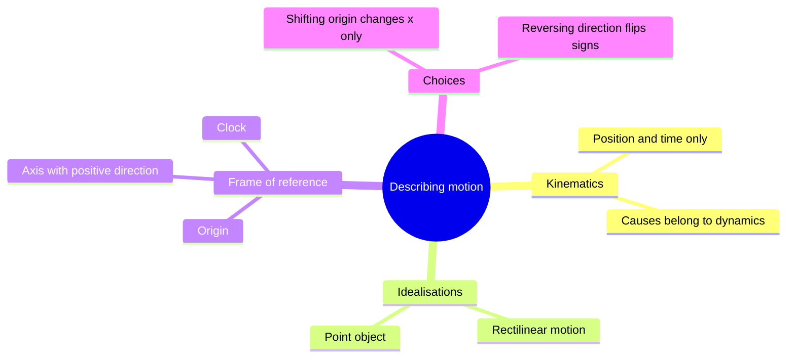
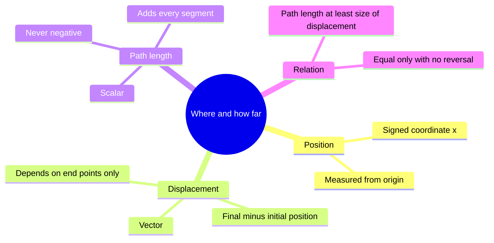
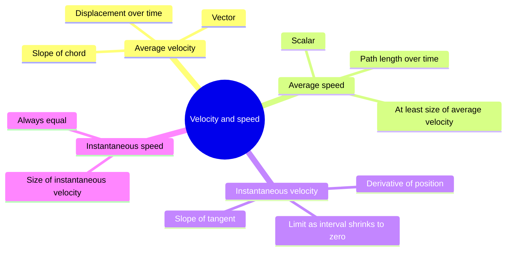
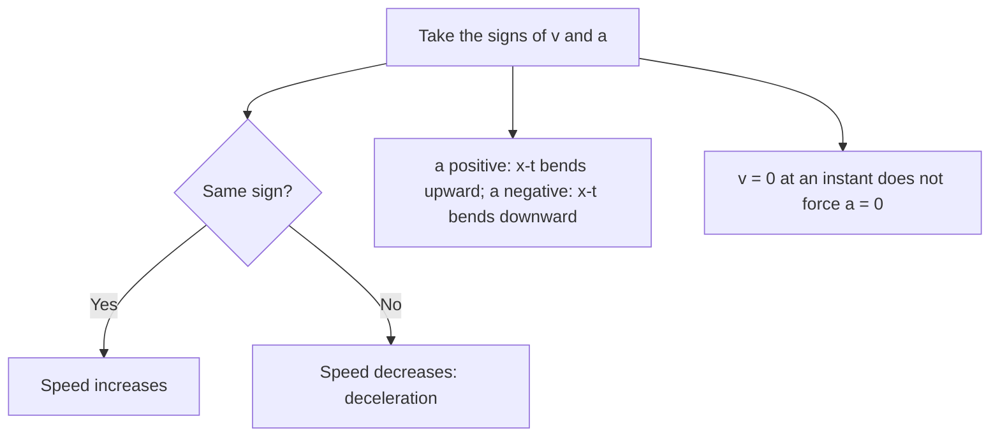
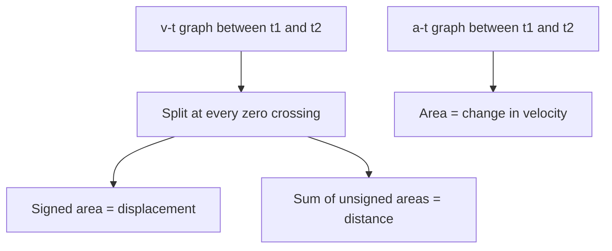
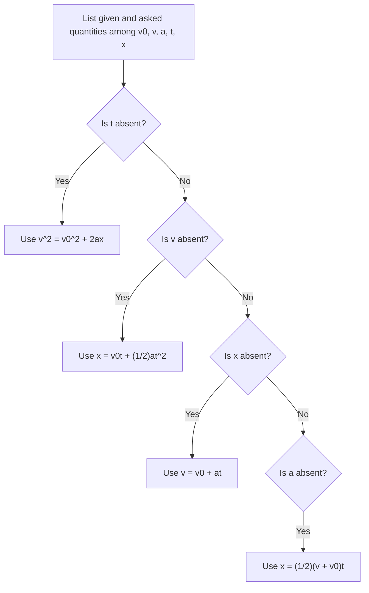
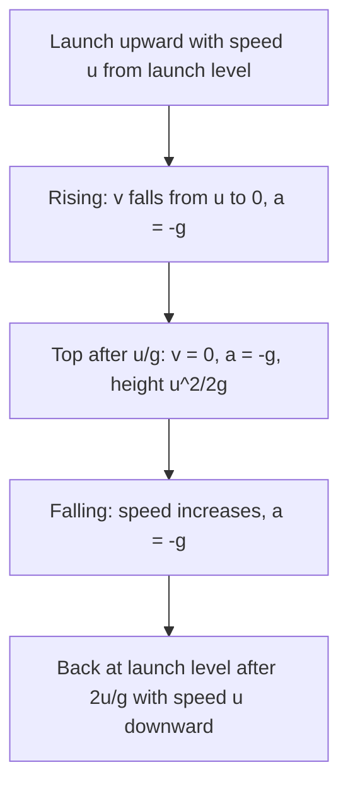
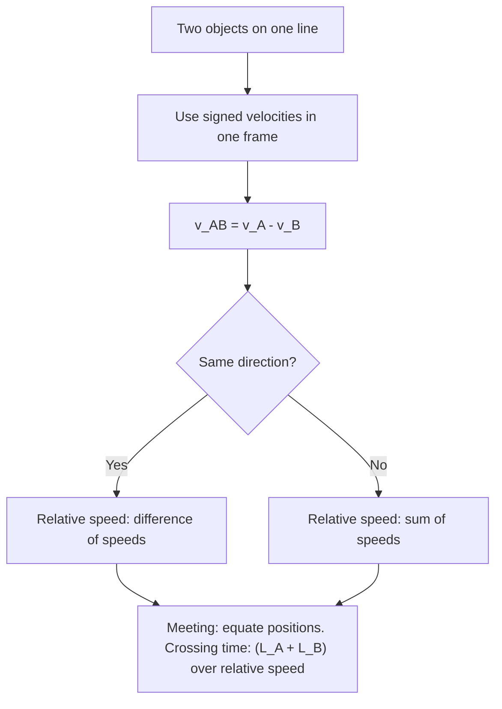
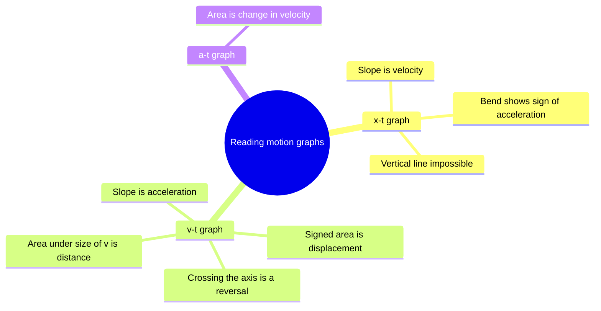

# Physics | Chapter 02 | Motion in a Straight Line | CNOTES
> **Motion in a Straight Line** | Condensed notes: the whole chapter as scannable points | Board · NEET · JEE

---

## SECTION 1 — INTRODUCTION: DESCRIBING MOTION

### 1.1 What is Motion?

- **Motion** — change in position of an object with time, relative to a frame of reference
- **Kinematics** — describes motion without its causes
- **Dynamics** — studies the causes (forces)
- Dynamics is treated in a later chapter
- **Rectilinear motion** — motion along a straight line
- One axis is enough
- **Point object** — size negligible against the distances moved
- Position is a single coordinate

### 1.2 Frame of Reference and Origin

- **Frame of reference** — reference point (origin) + axes + clock
- Straight-line motion needs one axis
- Right of origin: positive
- Left of origin: negative
- Vertical motion: upward positive (this chapter)
- Shifting the origin: $x$ changes
- Shifting the origin: $\Delta x$, $v$, $a$ unchanged
- Reversing the positive direction: signs of $x$, $\Delta x$, $v$, $a$ flip
- Reversing the positive direction: magnitudes unchanged
- Moving frame: measured velocity changes (§8)
- Trap: fix the origin and positive direction before solving; use them for every quantity (§1.2)

---

## SECTION 2 — POSITION, DISPLACEMENT AND PATH LENGTH

### 2.1 Position

- **Position** $x$ — signed coordinate along the axis, from the origin
- SI unit: m
- Dimensional formula: $[M^0 L T^0]$

### 2.2 Displacement ⭐

- **Displacement** $\Delta x = x_2 - x_1$ — change in position
- Vector
- Positive, negative or zero
- Depends on the end positions only
- The route is irrelevant
- SI unit: m
- Dimensional formula: $[M^0 L T^0]$

### 2.3 Path Length (Distance)

- **Path length** — total length of the path actually travelled
- Scalar
- Always $\ge 0$
- Never decreases with time
- SI unit: m
- Dimensional formula: $[M^0 L T^0]$

### 2.4 Displacement vs Path Length ⭐

| Feature | Displacement | Path length |
|:---|:---:|:---:|
| Type | Vector | Scalar |
| Values | $+$, $-$ or $0$ | Always $\ge 0$ |
| How found | $x_2 - x_1$ | Sum of all path segments |
| Effect of a reversal | Partly cancels | Adds |

- Path length $\ge |\Delta x|$
- Equality only for motion in one direction with no reversal
- 4 m east then 3 m west: path length $= 7$ m
- Same walk: $\Delta x = +1$ m

---

## SECTION 3 — VELOCITY AND SPEED

### 3.1 Average Velocity ⭐

- **Average velocity** $\bar{v} = \Delta x / \Delta t = (x_2 - x_1)/(t_2 - t_1)$
- Vector
- Positive, negative or zero
- SI unit: m s⁻¹
- Dimensional formula: $[M^0 L T^{-1}]$
- x–t graph: slope of the chord joining the two points
- Depends on the end points only
- Zero for any trip that returns to its start

### 3.2 Average Speed

- **Average speed** = total path length / total time
- Scalar
- Always $\ge 0$
- SI unit: m s⁻¹
- Average speed $\ge |\bar{v}|$
- Equality only for motion in one direction
- Trap: average speed is not the magnitude of average velocity when the motion reverses (§3.2)
- Round trip: 2.5 km out (30 min) and 2.5 km back (20 min)
  - $\bar{v} = 0$
  - Average speed $= 5\text{ km}/50\text{ min} = 6$ km h⁻¹

### 3.3 Instantaneous Velocity ⭐⭐

- **Instantaneous velocity** $v = \lim_{\Delta t \to 0} \Delta x/\Delta t = dx/dt$
- Derivative of position with respect to time
- Vector
- x–t graph: slope of the tangent at that instant
- Chord rotates into the tangent as $\Delta t \to 0$
- Uniform motion: equals the average velocity over any interval
- $x = 0.08\,t^3$: $v = 0.24\,t^2$
- At $t = 4$ s: $v = 3.84$ m s⁻¹
- Intervals centred on $t = 4$ s: average velocity $= 3.84 + 0.02\,\Delta t^2$

| $\Delta t$ (s) | 2.0 | 1.0 | 0.5 | 0.1 | 0.01 |
|:---:|:---:|:---:|:---:|:---:|:---:|
| $\Delta x/\Delta t$ (m s⁻¹) | 3.92 | 3.86 | 3.845 | 3.8402 | 3.8400 |

### 3.4 Instantaneous Speed

- **Instantaneous speed** $= |v|$
- Always equals $|v|$
- Path length in $\Delta t$ equals $|\Delta x|$ in the limit: $ds/dt = |dx/dt|$
- Average: speed $\ge |\bar{v}|$
- Instantaneous: speed $= |v|$

---

## SECTION 4 — ACCELERATION

### 4.1 Average Acceleration

- **Average acceleration** $\bar{a} = \Delta v/\Delta t = (v_2 - v_1)/(t_2 - t_1)$
- Vector
- Positive, negative or zero
- SI unit: m s⁻²
- Dimensional formula: $[M^0 L T^{-2}]$
- v–t graph: slope of the chord joining the two points

### 4.2 Instantaneous Acceleration ⭐

- **Instantaneous acceleration** $a = \lim_{\Delta t \to 0} \Delta v/\Delta t = dv/dt$
- Also $a = d^2x/dt^2$
- Also $a = v\,dv/dx$ (chain rule)
- Used when time is absent
- v–t graph: slope of the tangent at that instant
- x–t graph: curvature
- Sign of $d^2x/dt^2$ gives the bend
- Vector
- SI unit: m s⁻²

### 4.3 Positive and Negative Acceleration ⭐⭐

| Velocity | Acceleration | Effect on speed |
|:---:|:---:|:---|
| $+$ | $+$ | Increases |
| $+$ | $-$ | Decreases |
| $-$ | $-$ | Increases (in the negative direction) |
| $-$ | $+$ | Decreases |

- Same signs of $v$ and $a$: speed increases
- Opposite signs: speed decreases
- **Deceleration** (retardation) — acceleration opposing the velocity
- Deceleration is set by the relation of $a$ to $v$
- Not set by the sign of $a$ alone
- $a > 0$ with $v < 0$ is also a deceleration
- Ball thrown up (upward positive; $a = -g$ throughout)
  - Going up: $v > 0$, $a < 0$ → speed decreases
  - At the top: $v = 0$ and $a = -g \ne 0$
  - Coming down: $v < 0$, $a < 0$ → speed increases
- Trap: $v = 0$ at an instant does not imply $a = 0$ (§4.3)
- Trap: negative $a$ does not always mean slowing down (§4.3)

### 4.4 x–t, v–t and a–t Graph Shapes

| Motion | x–t graph | v–t graph | a–t graph |
|:---|:---|:---|:---|
| At rest | Horizontal line | Line along the time axis ($v = 0$) | Line along the time axis ($a = 0$) |
| Uniform velocity ($a = 0$) | Inclined straight line | Horizontal line at height $v$ | Line along the time axis |
| Constant $a > 0$ | Parabola bending upward | Straight line, positive slope | Horizontal line above the axis |
| Constant $a < 0$ | Parabola bending downward | Straight line, negative slope | Horizontal line below the axis |

- Shapes show the sign of $a$ only
- Speeding up or slowing down also needs the sign of $v$
- x–t bends upward: $a > 0$
- x–t bends downward: $a < 0$
- x–t straight: $a = 0$

| v–t case | Direction of motion | $a$ | Effect |
|:---|:---:|:---:|:---|
| (a) | $+$ | $+$ | Forward, speeding up |
| (b) | $+$ | $-$ | Forward, slowing down (deceleration) |
| (c) | $-$ | $-$ | Backward, speeding up |
| (d) | $+$ then $-$ | $-$ throughout | Slows, $v = 0$ at $t_1$, then reverses and speeds up |

- Case (d) is the graph of a ball thrown straight up
- Real x–t curves have no kinks
- A kink would need a velocity jump: infinite acceleration
- Real v–t curves have no vertical jumps
- Sharp corner on a v–t graph (acceleration switching suddenly): acceptable idealisation

---

## SECTION 5 — AREA UNDER A v–t GRAPH ⭐⭐

- Area under v–t between $t_1$ and $t_2$ = displacement: $\Delta x = x(t_2) - x(t_1) = \int_{t_1}^{t_2} v\,dt$
- Unit check: $(\text{m s}^{-1})(\text{s}) = \text{m}$
- Uniform velocity $u$ for time $T$: area = rectangle $uT$
- Area under a–t = change in velocity: $\Delta v = \int a\,dt$
- Trap: v–t area = displacement; a–t area = $\Delta v$; do not swap (§5)

### 5.1 Wavy Velocity: Signed Area vs Total Distance ⭐⭐

- Curve above the time axis: $v > 0$ → positive area
- Curve below the time axis: $v < 0$ → negative area
- Signed areas $A_1, A_2, A_3, \dots$ of successive regions
- Displacement $= A_1 + A_2 + A_3 + \cdots$
- Distance $= |A_1| + |A_2| + |A_3| + \cdots$
- Distance = area under $|v|$
- Trap: a dip below the axis subtracts from displacement and adds to distance (§5.1)
- An object can end near its start yet cover a long distance

---

## SECTION 6 — KINEMATIC EQUATIONS FOR UNIFORM ACCELERATION ⭐⭐⭐

### 6.1 The Equations of Motion

| Equation | Form | Quantities linked |
|:---|:---:|:---|
| First | $v = v_0 + at$ | $v, v_0, a, t$ (no displacement) |
| Second | $x = v_0 t + \tfrac{1}{2}at^2$ | $x, v_0, a, t$ (no final velocity) |
| Third | $v^2 = v_0^2 + 2ax$ | $v, v_0, a, x$ (no time) |
| Average-velocity form | $x = \tfrac{1}{2}(v + v_0)t$ | $x, v, v_0, t$ (no acceleration) |

- Valid only for constant acceleration
- Constant in both magnitude and direction
- $x$ = displacement from the start at $t = 0$ (so $x_0 = 0$)
- Start at $x_0$: replace $x$ by $x - x_0$
- Every quantity is signed

### 6.2 Derivation by the Graph (Area) Method ⭐⭐⭐

- Constant $a$: v–t graph is a straight line from $A(0, v_0)$ to $B(t, v)$
- Step 1: slope of $AB$ = $a$ = $(v - v_0)/t$ → $v = v_0 + at$
- Step 2: area = rectangle $v_0 t$ + triangle $\tfrac{1}{2}(v - v_0)t$
- Substitute $v - v_0 = at$ → $x = v_0 t + \tfrac{1}{2}at^2$
- Step 3: same area as trapezoid → $x = \tfrac{1}{2}(v + v_0)t$
- Eliminate $t = (v - v_0)/a$ → $v^2 = v_0^2 + 2ax$

### 6.3 Derivation by Calculus

- Start from $v = dx/dt$ and $a = dv/dt$
- First: $\int_{v_0}^{v} dv = a\int_0^t dt$ → $v = v_0 + at$
- Second: $\int_{x_0}^{x} dx = \int_0^t (v_0 + at)\,dt$ → $x - x_0 = v_0 t + \tfrac{1}{2}at^2$
- Third: $a = v\,dv/dx$ → $v\,dv = a\,dx$ → $(v^2 - v_0^2)/2 = a(x - x_0)$
- Graph method: shows the form of the equations
- Graph method: expected when a graph is given
- Calculus method: starts from the definitions
- Variable $a$: $v = v_0 + \int a\,dt$
- Variable $a$: $x = x_0 + \int v\,dt$
- Trap: the three equations do not apply to variable acceleration (§6.3)

### 6.4 Average Velocity Under Constant Acceleration

- $\bar{v} = (v + v_0)/2$
- $v$ is linear in $t$
- Time average of $v$ = midpoint of the end values
- Gives $x = \bar{v}\,t$ = average-velocity form
- Constant acceleration only
- Variable $a$: $v$ not linear in $t$
- Midpoint rule fails

### 6.5 Displacement in the nth Second ⭐⭐

- $s_n$ = displacement from $t = n - 1$ to $t = n$ (seconds)
- $s_n = v_0 + \dfrac{a}{2}(2n - 1)$
- Constant acceleration only
- $n$ counts seconds
- $s_n$ in m for $v_0$ in m s⁻¹ and $a$ in m s⁻²
- $s_n$ is a displacement
- Equals distance only if $v$ keeps one sign in that second
- From rest: $s_n = \dfrac{a}{2}(2n - 1)$ → $s_1 : s_2 : s_3 = 1 : 3 : 5$
- Special case: Galileo's law of odd numbers (§7.1)
- Trap: $s_n$ is one one-second slice; not the total in $n$ seconds (§6.5)

### 6.6 Worked Examples

- $x = x_0 + \beta t^2$ ($x_0 = 8.5$ m, $\beta = 2.5$ m s⁻²)
  - $v = 2\beta t = 5.0\,t$
  - $v(0) = 0$
  - $v(2) = 10$ m s⁻¹
  - $x(2) = 18.5$ m
  - $x(4) = 48.5$ m
  - $\bar{v}$ from $t = 2$ s to $4$ s $= 15$ m s⁻¹
  - Check: $a = 5.0$ m s⁻² is constant
  - Check: $\bar{v} = (10 + 20)/2 = 15$ m s⁻¹
- Ball thrown up at $20$ m s⁻¹ from a $25$ m building ($g = 10$ m s⁻²)
  - Rise above launch: third equation with $v = 0$ → $20$ m
  - Landing: $0 = 25 + 20t - 5t^2$ → $t = 5$ s
  - Reject $t = -1$ s (before launch)
  - Check: rise $2$ s + fall from $45$ m $3$ s $= 5$ s

### 6.7 Choosing the Equation ⭐⭐⭐

- Five quantities: $v_0, v, a, t, x$
- Each equation omits exactly one

| Absent quantity | Equation |
|:---|:---:|
| $x$ | $v = v_0 + at$ |
| $v$ | $x = v_0 t + \tfrac{1}{2}at^2$ |
| $t$ | $v^2 = v_0^2 + 2ax$ |
| $a$ | $x = \tfrac{1}{2}(v + v_0)t$ |

- Car from rest covers $100$ m in $5$ s: $v$ absent → second equation → $a = 8$ m s⁻²
- Check: $v = 40$ m s⁻¹
- Check: $\tfrac{1}{2}(0 + 40)(5) = 100$ m

### 6.8 Exploring the Equations Interactively

- $x = v_0 t + \tfrac{1}{2}at^2$: parabola bends upward for $a > 0$
- $x = v_0 t + \tfrac{1}{2}at^2$: parabola bends downward for $a < 0$
- $v = v_0 + at$: straight line
- Slope of the line equals $a$
- $v_0 < 0$ with $a > 0$: parabola dips then rises
- $v = 0$ at the same time the x–t curve turns

### 6.9 Stopping Distance

- Braking from $v_0$: final velocity $0$
- Acceleration $-a$ ($a > 0$ = magnitude of retardation)
- Third equation: $0 = v_0^2 + 2(-a)d_s$ → $d_s = \dfrac{v_0^2}{2a}$
- $d_s$ measured from the moment the brakes act to rest
- $d_s \propto v_0^2$ for the same retardation
- Double the speed → stopping distance $\times 4$
- $a = 5$ m s⁻²: $20$ m s⁻¹ → $40$ m
- $a = 5$ m s⁻²: $40$ m s⁻¹ → $160$ m
- Distance during the driver's reaction time is extra (§7.4)

---

## SECTION 7 — FREE FALL ⭐⭐

- **Free fall** — motion under gravity alone
- No air resistance or other force acts
- $g = 9.8$ m s⁻² downward
- Constant near Earth's surface
- Problems often use $g \approx 10$ m s⁻²
- SI unit: m s⁻²
- Dimensional formula: $[M^0 L T^{-2}]$
- Same for all objects: independent of mass
- Same at every point: rising, at the top, falling
- Convention: upward positive
- $y$ measured upward from the start
- $a = -g$

### 7.1 Galileo's Law of Odd Numbers

- From rest, successive equal intervals: distances $1 : 3 : 5 : 7 : 9 \ldots$
- Total distances after $1, 2, 3, \ldots$ intervals: $1 : 4 : 9 : 16 \ldots$ ($\propto n^2$)
- Distance in the $n$-th interval $= \tfrac{1}{2}g\tau^2(2n - 1)$
- Needs constant acceleration and $v_0 = 0$
- Holds for any such motion
- Free fall is one case
- Trap: the ratio needs $v_0 = 0$ and constant $a$ (§7.1)

### 7.2 Free-Fall Equations

| Quantity | Equation | With $g = 9.8$ m s⁻² |
|:---|:---:|:---:|
| Acceleration | $a = -g$ | $-9.8$ m s⁻² |
| Velocity | $v = -gt$ | $-9.8\,t$ m s⁻¹ |
| Position | $y = -\tfrac{1}{2}gt^2$ | $-4.9\,t^2$ m |
| Velocity and position | $v^2 = -2gy$ | $-19.6\,y$ m² s⁻² |

- From $a = -g$ and $v_0 = 0$ in the equations of §6.1
- Object moves down: $v < 0$, $y < 0$
- Downward positive, $h$ = distance fallen:
  - $v = gt$
  - $h = \tfrac{1}{2}gt^2$
  - $v^2 = 2gh$

### 7.3 Motion Thrown Upward ⭐⭐

- Launch speed $u$ upward
- Origin at launch
- Upward positive
- $a = -g$

| Quantity | Result | Comes from |
|:---|:---:|:---|
| Velocity and position | $v = u - gt$; $y = ut - \tfrac{1}{2}gt^2$ | First and second equations |
| Time to the top | $t_{\text{up}} = u/g$ | $v = 0$ in $v = u - gt$ |
| Maximum height | $H = u^2/(2g)$ | $v = 0$ in $v^2 = u^2 - 2gy$ |
| Time back at launch level | $T = 2u/g$ | $y = 0$ |
| Velocity back at launch level | $-u$ | $v^2 = u^2$ at $y = 0$ |

- Ascent time = descent time ($T = 2\,t_{\text{up}}$)
- Speed at a given height: equal going up and coming down
- At the top: $v = 0$
- At the top: $a = -g$
- Building example (§6.6): $u = 20$ m s⁻¹ → $t_{\text{up}} = 2$ s
- Building example (§6.6): $H = 20$ m
- Trap: results assume return to the launch level; otherwise solve $y = ut - \tfrac{1}{2}gt^2$ for the actual landing height (§7.3)

### 7.4 Reaction Time

- **Reaction time** — time between a stimulus and the start of the response
- Ruler drop: ruler released from rest
- Free fall through $d$ before being caught
- $d = \tfrac{1}{2}g\,t_r^2$ → $t_r = \sqrt{2d/g}$
- $d = 21.0$ cm $= 0.210$ m → $t_r \approx 0.2$ s
- Check: fall in $0.2$ s $\approx 0.196$ m

---

## SECTION 8 — RELATIVE VELOCITY ⭐⭐

### 8.1 Concept

- **Relative velocity** of A with respect to B — velocity of A as measured by an observer moving with B
- $v_{AB} = v_A - v_B = d(x_A - x_B)/dt$
- $v_A$, $v_B$: signed ground-frame velocities
- $v_{BA} = -v_{AB}$
- Rate of change of the separation $x_A - x_B$
- Same unit and dimensions as velocity

### 8.2 Cases

| Situation | Velocities | $v_{AB}$ | Meaning |
|:---|:---|:---:|:---|
| Same direction, equal speeds | $v_A = v_B$ | $0$ | Gap constant; each appears at rest to the other |
| Same direction, $v_A > v_B$ | both positive | $v_A - v_B > 0$ | Gap $x_A - x_B$ increases: A pulls away if ahead; closes in if behind |
| Opposite directions | A at $+v_A$, B at $-v_B$ | $v_A + v_B$ | Speeds add |

- Trap: $v_{AB} = v_A - v_B$ holds in every case with signed velocities (§8.2)
- Opposite directions: "speeds add" comes from the minus sign meeting B's negative velocity
- Bullet fired from a moving van at a car ahead
  - Van speed: $30$ km h⁻¹
  - Muzzle speed: $150$ m s⁻¹ relative to the van
  - Car speed: $192$ km h⁻¹, same direction
  - Bullet in ground frame: $150 + 8.33 = 158.33$ m s⁻¹
  - Relative to the car: $158.33 - 53.33 = 105$ m s⁻¹
  - Check: $150 - (53.33 - 8.33) = 105$ m s⁻¹

### 8.3 Meeting and Overtaking Problems

- Meeting: same position at the same time
- Constant velocities: $x(t) = x_0 + vt$ for each object
- Constant accelerations: $x = x_0 + v_0 t + \tfrac{1}{2}at^2$ for each
- Set $x_A(t) = x_B(t)$
- Solve for $t$
- Negative root: meeting was in the past
- No root: never meet
- $v_A = v_B$ with different starts: gap constant
- $v_A = v_B$ with different starts: never meet
- Gap $D$ closing at relative speed $|v_{AB}|$: $t = D/|v_{AB}|$
- Crossing starts: front of A meets rear of B (same direction) or fronts meet (opposite)
- Crossing ends: rear of A passes front of B
- Relative displacement in between: $L_A + L_B$

| Case | Relative speed | Time to cross completely |
|:---|:---:|:---:|
| Same direction (A overtakes B) | $v_A - v_B$ | $\dfrac{L_A + L_B}{v_A - v_B}$ |
| Opposite directions | $v_A + v_B$ | $\dfrac{L_A + L_B}{v_A + v_B}$ |

---

## SECTION 9 — GRAPHICAL INTERPRETATION SUMMARY ⭐⭐⭐

### 9.1 x–t Graph

| Feature | Meaning |
|:---|:---|
| Slope of the tangent, $dx/dt$ | Instantaneous velocity |
| Slope of the chord between two points | Average velocity |
| Positive / negative slope | Moving in the positive / negative direction |
| Zero slope (horizontal line) | At rest |
| Straight inclined line | Uniform velocity ($a = 0$) |
| Curve bending upward / downward | $a > 0$ / $a < 0$ |
| Vertical line | Impossible: many positions at one instant |
| Kink (sudden change of slope) | Impossible for real objects: velocity would jump |

### 9.2 v–t Graph

| Feature | Meaning |
|:---|:---|
| Slope of the tangent, $dv/dt$ | Instantaneous acceleration |
| Slope of the chord between two points | Average acceleration |
| Area between the curve and the time axis | Displacement (signed area) |
| Area under $\lvert v \rvert$ | Total distance |
| Horizontal line | Uniform velocity ($a = 0$) |
| Line along the time axis | At rest |
| Straight inclined line | Constant acceleration; positive slope $a > 0$; negative slope $a < 0$ |
| Crossing the time axis ($v = 0$) | $v$ changes sign: momentary rest and reversal of direction |
| Vertical jump | Impossible: infinite acceleration |

- Trap: crossing the time axis is a reversal; not a permanent stop (§9.2)
- Area below the axis: displacement in the negative direction

### 9.3 a–t Graph

| Feature | Meaning |
|:---|:---|
| Area under the curve | Change in velocity, $\Delta v$ |
| Horizontal line | Constant acceleration |
| Line along the time axis | Zero acceleration (uniform velocity or rest) |

---

## SECTION 10 — POINTS TO PONDER AND COMMON ERRORS ⭐⭐⭐

- Origin and positive direction are choices: fix them before solving (§1.2)
- Sign of $a$ alone does not give speeding up or slowing down (§4.3)
- Same signs of $v$ and $a$: speed increases; opposite signs: speed decreases (§4.3)
- $v = 0$ at an instant does not imply $a = 0$; top of a throw has $a = -g$ (§4.3, §7.3)
- Average speed $\ge |\bar{v}|$; a round trip has $\bar{v} = 0$ and non-zero average speed (§3.2)
- Instantaneous speed always equals $|v|$ (§3.4)
- Kinematic quantities are signed: substitute each with its sign (§6.1)
- Check the sign of the answer (§6.1)
- The three equations need constant $a$ (magnitude and direction); variable $a$: integrate (§6.3)
- v–t area = displacement; distance needs a split at every zero crossing (§5, §5.1)
- a–t area = change in velocity (§5)
- $s_n$ is one one-second slice; not the total for $n$ seconds (§6.5)
- Stopping distance $\propto v_0^2$; double the speed → $\times 4$ (§6.9)
- Galileo's $1 : 3 : 5 \ldots$ needs constant $a$ and $v_0 = 0$ (§7.1)
- $v_{AB} = v_A - v_B$ always, with signs; opposite directions: magnitudes add (§8.2)
- Kink in an x–t graph or jump in a v–t graph: non-physical (§4.4, §9)

---

## SECTION 11 — UNITS AND DIMENSIONS

| Quantity | Symbol | SI unit | Dimensional formula |
|:---|:---:|:---:|:---:|
| Position, displacement, path length | $x$, $\Delta x$ | m | $[M^0 L T^0]$ |
| Time | $t$ | s | $[M^0 L^0 T^1]$ |
| Velocity and speed (average or instantaneous) | $v$ | m s⁻¹ | $[M^0 L T^{-1}]$ |
| Acceleration (average or instantaneous), $g$ | $a$, $g$ | m s⁻² | $[M^0 L T^{-2}]$ |

- Only length and time appear as base dimensions
- $1$ km h⁻¹ $= \tfrac{5}{18}$ m s⁻¹

---

## SECTION 12 — FORMULA REFERENCE ⭐⭐⭐

- $\bar{v} = \Delta x/\Delta t$ — any motion
- $v = dx/dt$ — any motion
- $a = dv/dt = v\,dv/dx$ — any motion in one dimension
- $\Delta x = \int v\,dt$; $\Delta v = \int a\,dt$ — any motion
- First, second, third equations and average-velocity form — constant $a$ only
- Second, third and average-velocity forms use $x$ as displacement from the start
- First equation has no $x$
- $s_n = v_0 + \tfrac{a}{2}(2n - 1)$ — constant $a$; equals distance only if $v$ keeps one sign in that second
- $1 : 3 : 5 : 7 \ldots$ — constant $a$; $v_0 = 0$; equal successive intervals
- $d_s = v_0^2/(2a)$ — constant retardation of magnitude $a$; brought to rest
- Thrown up with speed $u$ — free fall; returns to launch level
  - $t_{\text{up}} = u/g$
  - $H = u^2/(2g)$
  - $T = 2u/g$
- $t_r = \sqrt{2d/g}$ — ruler released from rest; free fall
- $v_{AB} = v_A - v_B$ — any 1D motion; signed velocities in one frame
- $(L_A + L_B)/(v_A - v_B)$ — trains of lengths $L_A$, $L_B$; same direction
- $(L_A + L_B)/(v_A + v_B)$ — trains of lengths $L_A$, $L_B$; opposite directions

---

## RAPID REFERENCE

| Fact | Value |
|:---|:---|
| Displacement | $\Delta x = x_2 - x_1$ |
| Average velocity | $\bar{v} = \Delta x/\Delta t$ |
| Average speed | Total path length / total time |
| Instantaneous velocity | $v = dx/dt$ |
| Instantaneous acceleration | $a = dv/dt = v\,dv/dx$ |
| Displacement from a v–t graph | $\Delta x = \int v\,dt$ (signed area) |
| Distance from a v–t graph | Area under $\lvert v \rvert$ |
| Change in velocity from an a–t graph | $\Delta v = \int a\,dt$ |
| Speed rule | Same signs of $v$ and $a$: increases; opposite signs: decreases |
| x–t bend | Upward: $a > 0$; downward: $a < 0$ |
| Kinematic equation 1 | $v = v_0 + at$ |
| Kinematic equation 2 | $x = v_0 t + \tfrac{1}{2}at^2$ |
| Kinematic equation 3 | $v^2 = v_0^2 + 2ax$ |
| Kinematic equation 4 | $x = \tfrac{1}{2}(v + v_0)t$ |
| Displacement in the $n$-th second | $s_n = v_0 + \tfrac{a}{2}(2n - 1)$ |
| Galileo's law of odd numbers | $1 : 3 : 5 : 7 \ldots$ (cumulative $1 : 4 : 9 : 16 \ldots$) |
| Stopping distance | $d_s = v_0^2/(2a)$ |
| $g$ | $9.8$ m s⁻² downward ($\approx 10$ in problems) |
| Free fall from rest | $v = -gt$; $y = -\tfrac{1}{2}gt^2$; $v^2 = -2gy$ |
| Thrown up with speed $u$ | $t_{\text{up}} = u/g$; $H = u^2/(2g)$; $T = 2u/g$; return velocity $-u$ |
| Reaction time (ruler drop) | $t_r = \sqrt{2d/g}$ |
| Relative velocity | $v_{AB} = v_A - v_B$ |
| Opposite directions | $\lvert v_{AB} \rvert = \lvert v_A \rvert + \lvert v_B \rvert$ |
| Crossing time, same direction | $(L_A + L_B)/(v_A - v_B)$ |
| Crossing time, opposite directions | $(L_A + L_B)/(v_A + v_B)$ |
| SI units | Displacement: m; velocity: m s⁻¹; acceleration: m s⁻² |
| Dimensional formulae | Displacement $[M^0 L T^0]$; velocity $[M^0 L T^{-1}]$; acceleration $[M^0 L T^{-2}]$ |
| Unit conversion | $1$ km h⁻¹ $= \tfrac{5}{18}$ m s⁻¹ |

---

*End of Condensed Notes — Physics Ch. 02: Motion in a Straight Line*