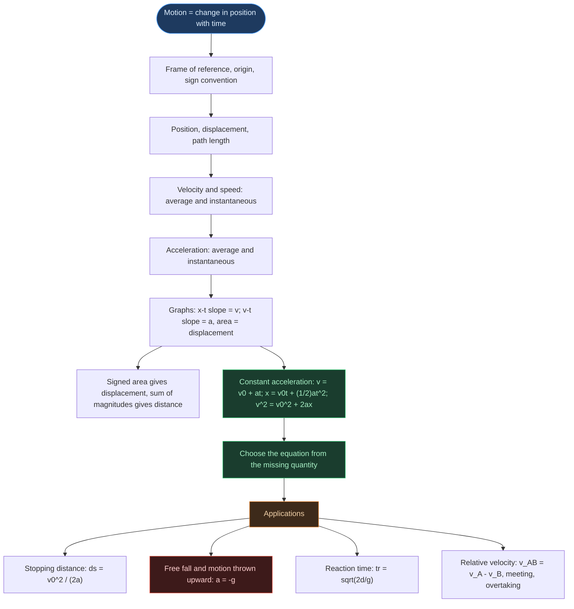
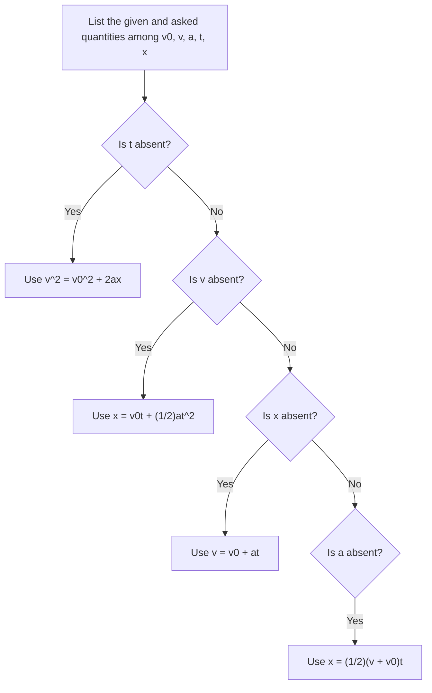

# Physics | Chapter 02 | Motion in a Straight Line | NOTES
> **Motion in a Straight Line** | Full explanation of the chapter, read once to learn it | Board · NEET · JEE

---

## CHAPTER BRIEF

This chapter describes how an object moves along a straight line using only position and time, and the quantities built from them: displacement, velocity and acceleration. It is the foundation for the rest of mechanics, because the same ideas carry over to motion in a plane and, once forces are introduced, to the study of what causes motion. By the end you should be able to read and sketch the three motion graphs, choose and derive the constant-acceleration equations, and solve free-fall and relative-velocity problems.

---

## PREREQUISITES, OUTCOMES AND SCOPE

**Prerequisites:** algebra, graphs of straight lines and parabolas, basic differentiation and integration of polynomials (derivative as slope, integral as area), SI units and dimensional formulae.

**Key outcomes**

- Separate displacement from path length, and velocity from speed, in definitions, numbers and graphs.
- Decide from the signs of $v$ and $a$ whether an object is speeding up or slowing down.
- Read velocity and acceleration from graph slopes, and displacement and distance from areas under a v–t graph.
- Derive the three constant-acceleration equations by the graph method and by calculus, and pick the right one for a problem.
- Apply them to stopping distance, free fall, motion thrown upward and reaction time.
- Use relative velocity for meeting and overtaking problems.

**Scope note:** motion along a single axis only, with objects treated as point objects and air resistance ignored. Motion in a plane and the forces that cause motion belong to later chapters.

---

## TABLE OF CONTENTS

- §1 Introduction: Describing Motion
  - 1.1 What is Motion?
  - 1.2 Frame of Reference and Origin
- §2 Position, Displacement and Path Length
  - 2.1 Position
  - 2.2 Displacement
  - 2.3 Path Length (Distance)
  - 2.4 Displacement vs Path Length
- §3 Velocity and Speed
  - 3.1 Average Velocity
  - 3.2 Average Speed
  - 3.3 Instantaneous Velocity
  - 3.4 Instantaneous Speed
- §4 Acceleration
  - 4.1 Average Acceleration
  - 4.2 Instantaneous Acceleration
  - 4.3 Positive and Negative Acceleration
  - 4.4 x–t, v–t and a–t Graph Shapes
- §5 Area Under a v–t Graph
  - 5.1 Wavy Velocity: Signed Area vs Total Distance
- §6 Kinematic Equations for Uniform Acceleration
  - 6.1 The Equations of Motion
  - 6.2 Derivation by the Graph (Area) Method
  - 6.3 Derivation by Calculus
  - 6.4 Average Velocity Under Constant Acceleration
  - 6.5 Displacement in the nth Second
  - 6.6 Worked Examples
  - 6.7 Choosing the Equation
  - 6.8 Exploring the Equations Interactively
  - 6.9 Stopping Distance
- §7 Free Fall
  - 7.1 Galileo's Law of Odd Numbers
  - 7.2 Free-Fall Equations
  - 7.3 Motion Thrown Upward
  - 7.4 Reaction Time
- §8 Relative Velocity
  - 8.1 Concept
  - 8.2 Cases
  - 8.3 Meeting and Overtaking Problems
- §9 Graphical Interpretation Summary
  - 9.1 x–t Graph
  - 9.2 v–t Graph
  - 9.3 a–t Graph
- §10 Points to Ponder and Common Errors
- §11 Units and Dimensions
- §12 Formula Reference

---

## CONCEPT ROADMAP



The chapter builds in one direction: definitions of position, velocity and acceleration first, then the graphs that display them, then the equations that hold when acceleration is constant, then the applications of those equations.

---

## SECTION 1 — INTRODUCTION: DESCRIBING MOTION

Describing motion starts with a choice: what is position measured from, and along which direction? This section fixes those ground rules and the simplifications the rest of the chapter relies on.

### 1.1 What is Motion?

> [!info] Definition
> **Motion** is the change in position of an object with time, relative to a chosen frame of reference. **Kinematics** describes motion without asking what causes it; the causes (forces) belong to dynamics, in a later chapter.

- This chapter covers **rectilinear motion**: motion along a straight line.
- Objects are treated as **point objects**. This is valid when the object's size is negligible compared with the distances it moves through, so that its position is a single coordinate.

### 1.2 Frame of Reference and Origin

To say where something is, an observer needs a reference point, a direction to measure along, and a clock. Together these form a **frame of reference**. For straight-line motion a single axis (the $x$-axis) is enough, and the reference point on it is the **origin**.

- Position to the right of the origin is positive; to the left it is negative.
- For vertical motion the axis is vertical, and this chapter takes **upward as positive**.

The origin and the positive direction are choices made by whoever solves the problem. They change the signed numbers but not the physics:

- Shifting the origin changes $x$ but leaves displacement, velocity and acceleration unchanged.
- Reversing the positive direction flips the sign of $x$, $\Delta x$, $v$ and $a$, but not their magnitudes.
- What does change the measured velocity is using a frame that is itself moving (§8).

> [!warning] State the origin and the positive direction before solving, then use them for every quantity in the problem.

---

## SECTION 2 — POSITION, DISPLACEMENT AND PATH LENGTH

Position says where an object is, displacement says how its position changed, and path length says how much ground it actually covered. Keeping the last two apart is the foundation for everything on velocity and speed.

### 2.1 Position

- **Position** $x$ is the coordinate of the object along the axis, measured from the origin.
- SI unit: **m**. Dimensional formula: $[M^0 L T^0]$.

### 2.2 Displacement ⭐

> [!info] Definition
> **Displacement** is the change in position:
>
> $$\Delta x = x_2 - x_1$$

- A **vector**: in one dimension its sign gives the direction. It can be positive, negative or zero.
- SI unit: **m**. Dimensional formula: $[M^0 L T^0]$.
- It depends only on the initial and final positions, not on the route taken.

### 2.3 Path Length (Distance)

> [!info] Definition
> **Path length** is the total length of the path actually travelled.

- A **scalar**, always $\ge 0$; it never decreases as the object moves.
- SI unit: **m**. Dimensional formula: $[M^0 L T^0]$.

### 2.4 Displacement vs Path Length ⭐

Path length adds every segment of the journey as a positive amount, so a stretch walked back is counted again. Displacement only compares where the journey ended with where it began, so a stretch walked back cancels part of it. That is why displacement can shrink or vanish while path length keeps growing.

| Feature | Displacement | Path length |
|:---|:---:|:---:|
| Type | Vector | Scalar |
| Values | $+$, $-$ or $0$ | Always $\ge 0$ |
| How it is found | $x_2 - x_1$ | Sum of all path segments |

> [!important] Path length $\ge |\text{displacement}|$, with equality only when the motion is in one direction with no reversal.

> [!example] Worked example: out and partly back
> - **Given:** a person walks 4 m east, then 3 m west (east positive, start at the origin).
> - **Find:** the path length and the displacement.
> - **Concept:** path length adds magnitudes; displacement is final position minus initial position.
> - **Work:** path length $= 4 + 3 = 7$ m. Final position $= 4 - 3 = +1$ m, so $\Delta x = +1 - 0 = +1$ m (1 m east).
> - **Check:** $|\Delta x| = 1 \le 7$, and the inequality is strict because the motion reversed.

---

## SECTION 3 — VELOCITY AND SPEED

Displacement alone does not say how quickly position is changing. Dividing by the time taken gives velocity; doing the same with path length gives speed. The two agree only when the motion never reverses, and mixing them up is the most common error in this chapter.

### 3.1 Average Velocity ⭐

> [!info] Definition
> **Average velocity** is the displacement divided by the time interval:
>
> $$\bar{v} = \frac{\Delta x}{\Delta t} = \frac{x_2 - x_1}{t_2 - t_1}$$

- A **vector**; it can be positive, negative or zero.
- SI unit: m s⁻¹. Dimensional formula: $[M^0 L T^{-1}]$.
- On an x–t graph it is the **slope of the chord** joining the points at $t_1$ and $t_2$.
- It depends only on the end points, so it is zero for any trip that returns to its start.

### 3.2 Average Speed

> [!info] Definition
> **Average speed** is the total path length divided by the total time taken:
>
> $$\text{average speed} = \frac{\text{total path length}}{\text{total time}}$$

- A **scalar**, always $\ge 0$. SI unit: m s⁻¹.

Over the same time interval, path length is at least as large as the size of the displacement (§2.4). Dividing both by that time gives

$$\text{average speed} \ge |\bar{v}|$$

with equality only for motion in one direction.

> [!warning] Average speed is not the magnitude of the average velocity whenever the object reverses direction.

> [!example] Worked example: round trip to the market
> - **Given:** 2.5 km to the market in 30 min, then 2.5 km back home in 20 min.
> - **Find:** the average velocity and the average speed for the whole trip.
> - **Concept:** velocity uses displacement; speed uses path length.
> - **Work:** the person ends where they started, so $\Delta x = 0$ and $\bar{v} = 0$. The path length is $5$ km in $50$ min $= \tfrac{5}{6}$ h, so the average speed is $5 \div \tfrac{5}{6} = 6$ km h⁻¹.
> - **Check:** $6 \ge |0|$, consistent with average speed $\ge |\bar{v}|$.

### 3.3 Instantaneous Velocity ⭐⭐

Average velocity over a long interval hides what happens inside it: a car can average 40 km h⁻¹ while stopping and racing. Shrinking the interval $\Delta t$ towards zero squeezes it to a single instant, and the average velocity settles to a definite value, the velocity at that instant.

> [!info] Definition
> **Instantaneous velocity** is the limit of the average velocity as $\Delta t \to 0$:
>
> $$v = \lim_{\Delta t \to 0} \frac{\Delta x}{\Delta t} = \frac{dx}{dt}$$

- It is the **derivative of position with respect to time**, and a vector.
- On an x–t graph it is the **slope of the tangent** at that instant. As $\Delta t \to 0$ the chord (average velocity) rotates into the tangent.
- For uniform motion (constant velocity) it equals the average velocity over any interval.

> [!example] Worked example: velocity from x(t)
> - **Given:** $x = 0.08\,t^3$ ($x$ in m, $t$ in s).
> - **Find:** the instantaneous velocity at $t = 4$ s.
> - **Concept:** $v = dx/dt$.
> - **Work:** $v = 0.24\,t^2$, so at $t = 4$ s, $v = 0.24 \times 16 = 3.84$ m s⁻¹.
> - **Check:** average velocities over intervals centred on $t = 4$ s equal $3.84 + 0.02\,\Delta t^2$ m s⁻¹, which approaches $3.84$ as $\Delta t \to 0$ (table below).

| $\Delta t$ (s) | 2.0 | 1.0 | 0.5 | 0.1 | 0.01 |
|:---:|:---:|:---:|:---:|:---:|:---:|
| $\Delta x/\Delta t$ (m s⁻¹), interval centred on $t = 4$ s | 3.92 | 3.86 | 3.845 | 3.8402 | 3.8400 |

The graph below shows the same thing geometrically. The curve is $x(t)$, with the horizontal axis as $t$ (s) and the vertical axis as $x$ (m). The moving line is the chord through the points at $4 - h$ and $4 + h$ (so $\Delta t = 2h$); the fixed line is the tangent at $t = 4$ s.

```desmos
f\left(x\right)=0.08x^{3}
h=1
m=\frac{f\left(4+h\right)-f\left(4-h\right)}{2h}
y=m\left(x-4-h\right)+f\left(4+h\right)
y=3.84\left(x-4\right)+f\left(4\right)
P_{1}=\left(4-h,f\left(4-h\right)\right)
P_{2}=\left(4+h,f\left(4+h\right)\right)
```

*Legend:* `f(x)` = position curve, `h` = half the time interval (slider), `m` = slope of the chord (average velocity), the fixed line = tangent at $t=4$ s with slope $3.84$, `P_1`, `P_2` = the two points the chord passes through.
*Try this:* drag `h` towards $0$ and watch `m` approach $3.84$ while the chord swings into the fixed tangent line.

### 3.4 Instantaneous Speed

> [!info] Definition
> **Instantaneous speed** is the magnitude of the instantaneous velocity, $|v|$.

Unlike the averages, instantaneous speed always equals $|v|$. Over an arbitrarily short interval the object cannot reverse direction, so the path length covered in $\Delta t$ and $|\Delta x|$ become equal in the limit: $ds/dt = |dx/dt|$.

- Average: speed $\ge |\bar{v}|$, equal only when there is no reversal.
- Instantaneous: speed $= |v|$ at every instant.

---

## SECTION 4 — ACCELERATION

Velocity can change in size, in direction, or both, and acceleration measures how quickly. Acceleration is signed like velocity, and its sign is where most mistakes begin, so §4.3 deserves the most attention.

### 4.1 Average Acceleration

> [!info] Definition
> **Average acceleration** is the change in velocity divided by the time interval:
>
> $$\bar{a} = \frac{\Delta v}{\Delta t} = \frac{v_2 - v_1}{t_2 - t_1}$$

- A **vector**; it can be positive, negative or zero.
- SI unit: m s⁻². Dimensional formula: $[M^0 L T^{-2}]$.
- On a v–t graph it is the **slope of the chord** joining the two points.

### 4.2 Instantaneous Acceleration ⭐

> [!info] Definition
> **Instantaneous acceleration** is the limit of the average acceleration as $\Delta t \to 0$:
>
> $$a = \lim_{\Delta t \to 0} \frac{\Delta v}{\Delta t} = \frac{dv}{dt} = \frac{d^2x}{dt^2}$$

- On a v–t graph it is the **slope of the tangent** at that instant.
- On an x–t graph it is the **curvature**: the sign of $d^2x/dt^2$ says whether the curve bends upward or downward (§4.4).
- A vector, with the same unit and dimensions as average acceleration.

When time does not appear in a problem, a second form is more useful. By the chain rule,

$$a = \frac{dv}{dt} = \frac{dv}{dx}\,\frac{dx}{dt} = v\,\frac{dv}{dx}$$

### 4.3 Positive and Negative Acceleration ⭐⭐

Acceleration is the rate at which velocity changes, and velocity has a sign. Speed, $|v|$, grows when $v$ is pushed further from zero and shrinks when $v$ is pulled towards zero. So the sign of $a$ alone cannot say whether an object speeds up; it has to be compared with the sign of $v$.

| Velocity | Acceleration | Effect on speed |
|:---:|:---:|:---|
| $+$ | $+$ | Increases |
| $+$ | $-$ | Decreases |
| $-$ | $-$ | Increases (in the negative direction) |
| $-$ | $+$ | Decreases |

**Rule:** if $v$ and $a$ have the **same sign**, speed increases; if **opposite signs**, speed decreases.

**Deceleration** (or retardation) is exactly the opposite-signs case: an acceleration that opposes the velocity. It is defined by how $a$ relates to $v$, not by the sign of $a$ alone, so $a > 0$ with $v < 0$ is also a deceleration.

A ball thrown upward shows all three situations (upward positive, $a = -g$ throughout):

- Going up: $v > 0$, $a < 0$, so speed decreases.
- At the top: $v = 0$, but $a = -g \ne 0$.
- Coming down: $v < 0$, $a < 0$, so speed increases.

> [!important] Zero velocity at an instant does not imply zero acceleration. Acceleration describes how $v$ is changing at that instant, not its current value. At the top of the throw $v$ is passing from positive to negative, so it is changing even though it is momentarily zero.

### 4.4 x–t, v–t and a–t Graph Shapes

For constant acceleration the three graphs have fixed shapes, summarised below.

| Motion | x–t graph | v–t graph | a–t graph |
|:---|:---|:---|:---|
| At rest | Horizontal line | Line along the time axis ($v = 0$) | Line along the time axis ($a = 0$) |
| Uniform velocity ($a = 0$) | Inclined straight line | Horizontal line at height $v$ | Line along the time axis |
| Constant $a > 0$ | Parabola bending upward | Straight line, positive slope | Horizontal line above the axis |
| Constant $a < 0$ | Parabola bending downward | Straight line, negative slope | Horizontal line below the axis |

The shapes show only the sign of $a$. Whether the object is speeding up or slowing down still depends on the sign of $v$ (§4.3).

```tikz
\begin{tikzpicture}[thick, font=\small]
  \begin{scope}
    \draw[->, line width=0.8pt] (0,0) -- (2.4,0) node[right, font=\tiny] {$t$};
    \draw[->, line width=0.8pt] (0,0) -- (0,1.8) node[above, font=\tiny] {$x$};
    \draw[blue!70!black, line width=1.6pt] (0,0.15) -- (2.2,1.6);
    \node[below] at (1.1,-0.4) {$a=0$};
  \end{scope}
  \begin{scope}[xshift=3.4cm]
    \draw[->, line width=0.8pt] (0,0) -- (2.4,0) node[right, font=\tiny] {$t$};
    \draw[->, line width=0.8pt] (0,0) -- (0,1.8) node[above, font=\tiny] {$x$};
    \draw[orange!80!black, line width=1.6pt] plot[smooth] coordinates {(0,0.1) (0.6,0.2) (1.2,0.5) (1.8,1.0) (2.2,1.55)};
    \node[below] at (1.1,-0.4) {$a>0$};
  \end{scope}
  \begin{scope}[xshift=6.8cm]
    \draw[->, line width=0.8pt] (0,0) -- (2.4,0) node[right, font=\tiny] {$t$};
    \draw[->, line width=0.8pt] (0,0) -- (0,1.8) node[above, font=\tiny] {$x$};
    \draw[red!70!black, line width=1.6pt] plot[smooth] coordinates {(0,0.1) (0.6,0.75) (1.2,1.2) (1.8,1.45) (2.2,1.5)};
    \node[below] at (1.1,-0.4) {$a<0$};
  \end{scope}
\end{tikzpicture}
```

*Reading the figure:* the **bend** of the x–t curve is the sign of the acceleration. A curve bending upward (getting steeper) means $a > 0$; a curve bending downward (flattening out) means $a < 0$; a straight line means $a = 0$. This lets you read the sign of $a$ from a position–time graph without any calculus.

Two things can each independently be positive or negative: the direction of motion and the sign of the acceleration. The four v–t cases below cover the combinations that matter.

```tikz
\begin{tikzpicture}[thick, font=\small]
  \begin{scope}
    \draw[gray] (-0.3,0) -- (2.3,0);
    \draw[->, line width=0.8pt] (0,-1.2) -- (0,1.6) node[above, font=\tiny] {$v$};
    \draw[blue!70!black, line width=1.6pt] (0,0.2) -- (2,1.4);
    \node[below] at (1,-1.5) {(a) $+$dir, $a>0$};
  \end{scope}
  \begin{scope}[xshift=3.6cm]
    \draw[gray] (-0.3,0) -- (2.3,0);
    \draw[->, line width=0.8pt] (0,-1.2) -- (0,1.6) node[above, font=\tiny] {$v$};
    \draw[orange!80!black, line width=1.6pt] (0,1.4) -- (2,0.2);
    \node[below] at (1,-1.5) {(b) $+$dir, $a<0$};
  \end{scope}
  \begin{scope}[yshift=-4.3cm]
    \draw[gray] (-0.3,0) -- (2.3,0);
    \draw[->, line width=0.8pt] (0,-1.6) -- (0,1.2) node[above, font=\tiny] {$v$};
    \draw[red!70!black, line width=1.6pt] (0,-0.2) -- (2,-1.4);
    \node[below] at (1,-1.9) {(c) $-$dir, $a<0$};
  \end{scope}
  \begin{scope}[xshift=3.6cm, yshift=-4.3cm]
    \draw[gray] (-0.3,0) -- (2.3,0);
    \draw[->, line width=0.8pt] (0,-1.2) -- (0,1.6) node[above, font=\tiny] {$v$};
    \draw[violet!70!black, line width=1.6pt] (0,1.4) -- (2,-1.0);
    \node[below, font=\tiny] at (1.17,0.15) {$t_1$};
    \node[below] at (1,-1.9) {(d) reverses at $t_1$};
  \end{scope}
\end{tikzpicture}
```

*Reading the figure:*

- (a) Moving forward and speeding up: $v > 0$, $a > 0$.
- (b) Moving forward and slowing down: $a < 0$ but $v$ stays positive, so this is a deceleration.
- (c) Moving backward and speeding up: $v < 0$ and $a < 0$. Negative acceleration here means faster motion, which is why "negative $a$ means slowing down" is wrong (§4.3).
- (d) Constant negative acceleration throughout: the object moves forward, slows, has $v = 0$ at $t_1$, then moves backward and picks up speed. A ball thrown straight up follows exactly this graph.

> [!note] Real x–t curves have no kinks, because a kink means the velocity jumps instantly, which would need infinite acceleration. Real v–t curves have no vertical jumps for the same reason. A sharp corner on a v–t graph (acceleration switching suddenly) is an acceptable idealisation.

---

## SECTION 5 — AREA UNDER A v–t GRAPH ⭐⭐

Over a very short slice of time $\Delta t$ the velocity is nearly constant, so the displacement in that slice is about $v\,\Delta t$: the area of a thin strip under the v–t curve. Adding the strips gives the displacement over the whole interval, and letting them become infinitely thin turns the sum into an integral.

> [!important] The area under the v–t curve between $t_1$ and $t_2$ equals the displacement in that interval:
>
> $$\Delta x = x(t_2) - x(t_1) = \int_{t_1}^{t_2} v\,dt$$

- Unit check: $(\text{m s}^{-1}) \times (\text{s}) = \text{m}$.
- Uniform velocity $u$ for a time $T$: the curve is a horizontal line, the area is the rectangle $u \times T$, and the displacement is $uT$.
- The same argument one level up: the area under an **a–t** graph is the change in velocity, $\Delta v = \int a\,dt$.

> [!warning] Area under v–t gives displacement; area under a–t gives change in velocity. Do not swap them.

### 5.1 Wavy Velocity: Signed Area vs Total Distance ⭐⭐

When the velocity changes sign, the v–t curve crosses the time axis. The region above the axis has $v > 0$ and contributes positive area; the region below has $v < 0$ and contributes negative area. Displacement counts each region with its sign, so backward motion cancels forward motion. Distance counts every region as a positive amount, like an odometer that never runs backward.

With $A_1, A_2, A_3, \dots$ the signed areas of successive regions ($A_2 < 0$ in the figure):

$$\text{Displacement} = A_1 + A_2 + A_3 + \cdots$$

$$\text{Distance} = |A_1| + |A_2| + |A_3| + \cdots$$

```tikz
\usetikzlibrary{arrows.meta}
\begin{tikzpicture}[>={Stealth[length=7pt,width=5pt]}, thick]
  \draw[->, line width=1pt] (-0.3,0) -- (6.8,0) node[right, font=\small] {$t$};
  \draw[->, line width=1pt] (0,-2.0) -- (0,2.0) node[above, font=\small] {$v$};
  \fill[green!25] plot[smooth] coordinates {(0,0) (0.5,1.0) (1,1.4) (1.5,1.0) (2,0)} -- cycle;
  \fill[red!20] plot[smooth] coordinates {(2,0) (2.5,-1.0) (3,-1.4) (3.5,-1.0) (4,0)} -- cycle;
  \fill[green!25] plot[smooth] coordinates {(4,0) (4.5,0.8) (5,1.1) (5.5,0.6) (6,0)} -- cycle;
  \draw[blue!70!black, line width=1.8pt]
    plot[smooth] coordinates {(0,0) (0.5,1.0) (1,1.4) (1.5,1.0) (2,0) (2.5,-1.0) (3,-1.4) (3.5,-1.0) (4,0) (4.5,0.8) (5,1.1) (5.5,0.6) (6,0)};
  \node[font=\small, green!40!black] at (1,0.55) {$A_1\ (+)$};
  \node[font=\small, red!60!black] at (3,-0.55) {$A_2\ (-)$};
  \node[font=\small, green!40!black] at (5,0.45) {$A_3\ (+)$};
  \node[below, font=\itshape\small, text=gray] at (3.2,-1.85) {Displacement $=A_1+A_2+A_3$ \quad Distance $=|A_1|+|A_2|+|A_3|$};
\end{tikzpicture}
```

*Reading the figure:* the curve rises above the axis ($A_1$, object moving in the $+$ direction), dips below it ($A_2$, the object has reversed and moves in the $-$ direction), then rises again ($A_3$). The net displacement adds $A_2$ with its negative sign, while the total distance treats it as a fresh positive contribution.

> [!warning] Whenever a v–t graph dips below the axis, the signed area (displacement) subtracts that region but distance adds it. An object can end near its starting point yet have covered a long distance.

---

## SECTION 6 — KINEMATIC EQUATIONS FOR UNIFORM ACCELERATION ⭐⭐⭐

When acceleration is constant, position, velocity and time are tied together by a small set of equations. This section derives them two ways, from the v–t graph and by integration, then shows how to choose among them and applies them to stopping distance.

### 6.1 The Equations of Motion

For an object with **constant acceleration $a$** and initial velocity $v_0$ at $t = 0$:

| Equation | Form | Quantities linked |
|:---|:---:|:---|
| First | $v = v_0 + at$ | $v, v_0, a, t$ (no displacement) |
| Second | $x = v_0 t + \tfrac{1}{2}at^2$ | $x, v_0, a, t$ (no final velocity) |
| Third | $v^2 = v_0^2 + 2ax$ | $v, v_0, a, x$ (no time) |
| Average-velocity form | $x = \tfrac{1}{2}(v + v_0)t$ | $x, v, v_0, t$ (no acceleration) |

> [!note] Conditions
> - Valid **only for constant acceleration**: constant in both magnitude and direction.
> - $x$ is the displacement from the starting position at $t = 0$ (so $x_0 = 0$). If the object starts at $x_0$, replace $x$ by $x - x_0$ in every equation.
> - Every quantity is signed; substitute each with its sign.

### 6.2 Derivation by the Graph (Area) Method ⭐⭐⭐

With constant acceleration the v–t graph is a straight line $AB$ from $A(0, v_0)$ to $B(t, v)$.

```tikz
\usetikzlibrary{arrows.meta}
\begin{tikzpicture}[>={Stealth[length=7pt,width=5pt]}, thick]
  \coordinate (O) at (0,0);
  \coordinate (A) at (0,1.5);
  \coordinate (D) at (5,0);
  \coordinate (C) at (5,1.5);
  \coordinate (B) at (5,4.2);
  \draw[->, line width=1pt] (-0.3,0) -- (6.3,0) node[right, font=\small] {$t$};
  \draw[->, line width=1pt] (0,-0.3) -- (0,5) node[above, font=\small] {$v$};
  \draw[fill=blue!12, draw=none] (O) -- (A) -- (C) -- (D) -- cycle;
  \draw[fill=orange!20, draw=none] (A) -- (B) -- (C) -- cycle;
  \draw[blue!70!black, line width=1.8pt] (A) -- (B);
  \draw[gray] (O) -- (A) -- (B) -- (D) -- cycle;
  \draw[dashed, gray] (A) -- (C) -- (B);
  \draw[dashed, gray] (C) -- (D);
  \node[left, font=\small] at (-0.15,1.5) {$A,\ v_0$};
  \node[right, font=\small] at (5.15,4.2) {$B,\ v$};
  \node[below left, font=\small] at (O) {$O$};
  \node[below, font=\small] at (D) {$D\ (t)$};
  \node[right, font=\small] at (5.05,1.35) {$C$};
  \node[font=\small, blue!50!black] at (2.4,0.7) {$v_0 t$};
  \node[font=\small, orange!70!black] at (4.35,2.6) {$\tfrac12(v-v_0)t$};
  \node[below, font=\itshape\small, text=gray] at (2.6,-0.9) {Area (rectangle $OACD$ + triangle $ACB$) $=$ displacement $x$};
\end{tikzpicture}
```

*Reading the figure:* the area under $AB$ from $t = 0$ to $t$ splits into a **rectangle** $OACD$ (height $v_0$, width $t$) and a **triangle** $ACB$ (base $t$, height $v - v_0$).

**Step 1: first equation, from the slope.** On a v–t graph the slope is the acceleration, and here it is constant:

$$a = \frac{v - v_0}{t} \;\Rightarrow\; \boxed{v = v_0 + at}$$

**Step 2: second equation, from the area** (§5: area under v–t is the displacement $x$):

$$x = \underbrace{v_0 t}_{\text{rectangle } OACD} + \underbrace{\tfrac{1}{2}(v - v_0)t}_{\text{triangle } ACB}$$

Substituting $v - v_0 = at$ from Step 1:

$$x = v_0 t + \tfrac{1}{2}(at)(t) \;\Rightarrow\; \boxed{x = v_0 t + \tfrac{1}{2}at^2}$$

**Step 3: fourth form and third equation.** The same area is a trapezoid, equal to average height times width:

$$x = \tfrac{1}{2}(v + v_0)\,t$$

Eliminating $t$ with $t = (v - v_0)/a$ from Step 1:

$$x = \frac{(v + v_0)}{2}\cdot\frac{(v - v_0)}{a} = \frac{v^2 - v_0^2}{2a} \;\Rightarrow\; \boxed{v^2 = v_0^2 + 2ax}$$

### 6.3 Derivation by Calculus

The graph method needs a straight v–t line from the start. The calculus method starts from the definitions $v = dx/dt$ and $a = dv/dt$, and assumes constant $a$ only at the integration step, which is why it carries over to non-uniform acceleration.

**First equation:**

$$a = \frac{dv}{dt} \;\Rightarrow\; \int_{v_0}^{v} dv = a\int_0^t dt \;\Rightarrow\; \boxed{v = v_0 + at}$$

**Second equation:**

$$\frac{dx}{dt} = v_0 + at \;\Rightarrow\; \int_{x_0}^{x} dx = \int_0^t (v_0 + at)\,dt \;\Rightarrow\; x - x_0 = v_0 t + \tfrac{1}{2}at^2$$

With $x_0 = 0$: $\boxed{x = v_0 t + \tfrac{1}{2}at^2}$.

**Third equation**, using $a = v\,dv/dx$ from §4.2:

$$v\,dv = a\,dx \;\Rightarrow\; \int_{v_0}^{v} v\,dv = a\int_{x_0}^{x} dx \;\Rightarrow\; \frac{v^2 - v_0^2}{2} = a(x - x_0)$$

With $x_0 = 0$: $\boxed{v^2 = v_0^2 + 2ax}$.

The graph method shows why the equations have the form they do, and is what a question expects when it hands you a graph. The calculus method keeps working when $a$ is not constant.

> [!warning] For variable acceleration the three equations do not apply. Integrate directly: $v = v_0 + \int a\,dt$ and $x = x_0 + \int v\,dt$.

### 6.4 Average Velocity Under Constant Acceleration

With constant $a$, the velocity changes at a steady rate, so it is a straight-line function of time and its average over the interval is the midpoint of its end values:

$$\bar{v} = \frac{v + v_0}{2}$$

This is what turns $x = \bar{v}\,t$ into the average-velocity form of §6.1. It holds **only for constant acceleration**; if $a$ varies, $v$ is not linear in $t$ and this midpoint rule fails.

### 6.5 Displacement in the nth Second ⭐⭐

> [!info] Definition
> $s_n$ is the displacement during the interval from $t = (n-1)$ s to $t = n$ s: one particular one-second slice, not the total from $0$ to $n$ seconds.

It is the area under the v–t line over just that slice:

$$s_n = \int_{n-1}^{n} (v_0 + at)\,dt = \Big[v_0 t + \tfrac{1}{2}at^2\Big]_{n-1}^{n}$$

$$s_n = v_0\big(n - (n-1)\big) + \tfrac{1}{2}a\big(n^2 - (n-1)^2\big) = v_0 + \tfrac{1}{2}a(2n - 1)$$

$$\boxed{s_n = v_0 + \frac{a}{2}(2n - 1)}$$

Here $n$ counts seconds, so the result is in metres when $v_0$ is in m s⁻¹ and $a$ in m s⁻². Because it is a displacement, $s_n$ equals the distance covered in that second only if the velocity does not change sign within it.

```tikz
\usetikzlibrary{arrows.meta}
\begin{tikzpicture}[>={Stealth[length=7pt,width=5pt]}, thick]
  \draw[->, line width=1pt] (-0.3,0) -- (6.5,0) node[right, font=\small] {$t\ (\mathrm{s})$};
  \draw[->, line width=1pt] (0,-0.3) -- (0,4.6) node[above, font=\small] {$v$};
  \fill[orange!30] (3,0) -- (3,2.4) -- (4,3.0) -- (4,0) -- cycle;
  \draw[blue!70!black, line width=1.8pt] (0,0.6) -- (6,4.2);
  \draw[gray!50] (1,0) -- (1,1.2);
  \draw[gray!50] (2,0) -- (2,1.8);
  \draw[gray!50] (3,0) -- (3,2.4);
  \draw[gray!50] (4,0) -- (4,3.0);
  \draw[gray!50] (5,0) -- (5,3.6);
  \node[below, font=\small] at (3,-0.05) {$n-1$};
  \node[below, font=\small] at (4,-0.05) {$n$};
  \node[font=\small, orange!70!black] at (3.5,1.1) {$s_n$};
  \node[below, font=\itshape\small, text=gray] at (3,-0.9) {Shaded strip $=$ displacement in the $n$-th second};
\end{tikzpicture}
```

*Reading the figure:* each gridline marks a whole second, and the shaded strip between $t = n-1$ and $t = n$ is $s_n$, a thin trapezoid. The full area from the origin would be the displacement in $n$ seconds, a different and larger quantity.

> [!tip] For motion from rest ($v_0 = 0$) this gives $s_n = \tfrac{a}{2}(2n-1)$, so $s_1 : s_2 : s_3 \cdots = 1 : 3 : 5 \cdots$. This is Galileo's law of odd numbers (§7.1) as a special case of the general formula.

### 6.6 Worked Examples

> [!example] Worked example: position given as a function of time
> - **Given:** $x = x_0 + \beta t^2$ with $x_0 = 8.5$ m and $\beta = 2.5$ m s⁻².
> - **Find:** the velocity as a function of time, the velocity at $t = 0$ and $t = 2.0$ s, and the average velocity from $t = 2$ s to $t = 4$ s.
> - **Concept:** $v = dx/dt$ for the instantaneous values; $\bar{v} = \Delta x/\Delta t$ for the average.
> - **Work:** $v = 2\beta t = 5.0\,t$ m s⁻¹, so $v(0) = 0$ and $v(2) = 10$ m s⁻¹. Positions: $x(2) = 8.5 + 2.5(4) = 18.5$ m and $x(4) = 8.5 + 2.5(16) = 48.5$ m. Then $\bar{v} = \dfrac{48.5 - 18.5}{4 - 2} = 15$ m s⁻¹.
> - **Check:** $a = dv/dt = 5.0$ m s⁻² is constant, so $\bar{v}$ must equal $\tfrac{1}{2}\big(v(2) + v(4)\big) = \tfrac{1}{2}(10 + 20) = 15$ m s⁻¹, as found.

A ball is thrown upward from the top of a building. Take $g = 10$ m s⁻²:

```tikz
\usetikzlibrary{arrows.meta}
\begin{tikzpicture}[>={Stealth[length=6pt,width=4pt]}, <={Stealth[length=6pt,width=4pt]}, thick]
  \draw[line width=1pt] (-0.6,0) -- (2.6,0);
  \draw[fill=gray!20] (0,0) rectangle (0.9,2.5);
  \node[font=\tiny, gray!60!black, rotate=90] at (0.45,1.25) {building};
  \coordinate (A) at (0.45,2.5);
  \coordinate (Bmax) at (0.45,4.5);
  \fill (A) circle (1.6pt);
  \fill (Bmax) circle (1.6pt);
  \draw[->, blue!70!black, line width=1.3pt] (A) -- ++(0,0.6) node[right, font=\small, blue!70!black] {$v_0=20$ m/s};
  \draw[dashed, gray] (A) -- (Bmax);
  \node[left, font=\small] at (A) {$A$};
  \node[above, font=\small] at (Bmax) {$B,\ v=0$};
  \draw[<->, gray] (1.3,2.5) -- (1.3,4.5) node[midway, right, font=\small] {$20$ m};
  \draw[<->, gray] (1.75,0) -- (1.75,2.5) node[midway, right, font=\small] {$25$ m};
  \node[below, font=\small] at (0.45,-0.3) {ground};
\end{tikzpicture}
```

*Reading the figure:* the ball is launched from $A$, on top of a $25$ m building, at $20$ m s⁻¹ upward. It slows under gravity, rises a further $20$ m to $B$ where $v = 0$, then falls the full $45$ m to the ground.

> [!example] Worked example: ball thrown up from a building
> - **Given:** launch from $y_0 = 25$ m above the ground, $v_0 = +20$ m s⁻¹, $a = -10$ m s⁻² (upward positive, origin at the ground).
> - **Find:** (a) the maximum height above the launch point; (b) the time to hit the ground.
> - **Concept:** constant acceleration $-g$, so the equations of §6.1 apply. For (a) time is not needed, so use the third equation; for (b) use the second equation for the full displacement.
> - **Work (a):** at the top $v = 0$: $0 = 400 + 2(-10)(y - y_0)$, so $y - y_0 = 20$ m.
> - **Work (b):** ground level is $y = 0$: $0 = 25 + 20t - 5t^2$, i.e. $t^2 - 4t - 5 = 0$, so $(t - 5)(t + 1) = 0$. The root $t = -1$ s is before the launch, so $t = 5$ s.
> - **Check:** the rise takes $v_0/g = 2$ s, and the fall from $45$ m takes $\sqrt{2 \times 45/10} = 3$ s. The total $2 + 3 = 5$ s matches.

### 6.7 Choosing the Equation ⭐⭐⭐

Every constant-acceleration problem involves five quantities: $v_0, v, a, t, x$. Each of the four equations in §6.1 leaves out exactly one of them. List what the problem gives and what it asks for; the quantity that appears in neither is the one to leave out, and that picks the equation.



*Reading the flowchart:* work top to bottom, asking whether each quantity is missing from the problem. The first "yes" names the equation.

> [!example] Worked example: choosing the equation
> - **Given:** a car starts from rest ($v_0 = 0$) and covers $x = 100$ m in $t = 5$ s.
> - **Find:** its acceleration.
> - **Concept:** the given quantities are $v_0$, $x$, $t$ and the unknown is $a$; the final velocity $v$ is absent, so use the second equation.
> - **Work:** $100 = 0 + \tfrac{1}{2}a(5)^2$, so $a = 8$ m s⁻².
> - **Check:** then $v = at = 40$ m s⁻¹ and $\tfrac{1}{2}(0 + 40)(5) = 100$ m, as given.

### 6.8 Exploring the Equations Interactively

The graph below plots $x = v_0 t + \tfrac{1}{2}at^2$ and $v = v_0 + at$ against time, so the link between the two curves is visible as the sliders move. The horizontal axis is time $t$ (s).

```desmos
v_{0}=0
a=2
y=v_{0}x+\frac{1}{2}ax^{2}\left\{x\ge0\right\}
y=v_{0}+ax\left\{x\ge0\right\}
T_{turn}=\left(-\frac{v_{0}}{a},0\right)\left\{-\frac{v_{0}}{a}\ge0\right\}
```

*Legend:* `v_0` = initial velocity (slider), `a` = acceleration (slider), the parabola = position $x(t)$ in m, the straight line = velocity $v(t)$ in m s⁻¹, `T_turn` = the time at which $v = 0$ (shown only when it lies at $t \ge 0$).
*Try this:* drag `a` and watch the parabola bend upward for $a > 0$ and downward for $a < 0$, while the straight line's slope equals $a$. Set $v_0 < 0$ with $a > 0$: the parabola dips, reaches its lowest point at the same time the straight line crosses zero, and `T_turn` sits at that time.

### 6.9 Stopping Distance

When brakes are applied to a vehicle moving at $v_0$, it slows under (assumed) constant retardation and comes to rest. Take the direction of motion as positive: the initial velocity is $v_0$, the final velocity is $0$, and the acceleration is $-a$, where $a > 0$ is the magnitude of the retardation. The third equation gives

$$0 = v_0^2 + 2(-a)\,d_s \;\Rightarrow\; \boxed{d_s = \frac{v_0^2}{2a}}$$

- $d_s$ is the distance covered from the moment the brakes act until the vehicle stops.
- For the same retardation, $d_s \propto v_0^2$: doubling the initial speed **quadruples** the stopping distance. For $a = 5$ m s⁻², $v_0 = 20$ m s⁻¹ needs $40$ m, while $v_0 = 40$ m s⁻¹ needs $160$ m.
- Distance covered during the driver's reaction time (§7.4) comes on top of $d_s$.

---

## SECTION 7 — FREE FALL ⭐⭐

Gravity gives every object near Earth's surface the same acceleration when nothing else acts on it. That makes free fall the most important case of constant acceleration: every equation in §6 applies with $a = -g$.

> [!info] Definition
> **Free fall** is motion under gravity alone, with no air resistance or other force acting.

- The acceleration is $g = 9.8$ m s⁻², directed downward, and constant near Earth's surface (heights small compared with Earth's radius). Problems often use $g \approx 10$ m s⁻² for convenience.
- SI unit: m s⁻². Dimensional formula: $[M^0 L T^{-2}]$.
- It is the same for all objects regardless of mass (Galileo's finding), when air resistance is absent.
- It is the same at every point of the motion: rising, at the top and falling.
- Convention: **upward is positive**, with $y$ measured upward from the starting point, so $a = -g$.

### 7.1 Galileo's Law of Odd Numbers

For a fall from rest the distance fallen grows as the square of the time, $\tfrac{1}{2}gt^2$. Split the fall into equal intervals $\tau$. The distance covered in the $n$-th interval is the difference of two such squares:

$$\tfrac{1}{2}g\tau^2\big[n^2 - (n-1)^2\big] = \tfrac{1}{2}g\tau^2\,(2n-1)$$

> [!info] Galileo's law of odd numbers
> Starting from rest, the distances covered in successive equal time intervals are in the ratio
>
> $$1 : 3 : 5 : 7 : 9 \ldots$$
>
> and the total distances after $1, 2, 3, \ldots$ intervals are in the ratio $1 : 4 : 9 : 16 \ldots$ (proportional to $n^2$).

> [!note] The ratio needs constant acceleration and $v_0 = 0$. It holds for any such motion, not only free fall; it is the special case of $s_n$ in §6.5.

### 7.2 Free-Fall Equations

Setting $a = -g$ and $v_0 = 0$ in §6.1, with $y$ measured upward from the starting point:

| Quantity | Equation | With $g = 9.8$ m s⁻² |
|:---|:---:|:---:|
| Acceleration | $a = -g$ | $-9.8$ m s⁻² |
| Velocity | $v = -gt$ | $-9.8\,t$ m s⁻¹ |
| Position | $y = -\tfrac{1}{2}gt^2$ | $-4.9\,t^2$ m |
| Velocity and position | $v^2 = -2gy$ | $-19.6\,y$ m² s⁻² |

The signs fit the picture: the object moves downward, so $v < 0$ and $y < 0$, and $v^2 = -2gy$ is positive because $y$ is negative. If downward is taken positive instead, with $h$ the distance fallen, the same results read $v = gt$, $h = \tfrac{1}{2}gt^2$, $v^2 = 2gh$.

### 7.3 Motion Thrown Upward ⭐⭐

An object thrown straight up with speed $u$ is in free fall from the moment it leaves the hand. Take the origin at the launch point, upward positive, so $v_0 = u$ and $a = -g$.

| Quantity | Result | Comes from |
|:---|:---:|:---|
| Velocity and position | $v = u - gt$, $\;y = ut - \tfrac{1}{2}gt^2$ | First and second equations with $a = -g$ |
| Time to the top | $t_{\text{up}} = \dfrac{u}{g}$ | $v = 0$ in $v = u - gt$ |
| Maximum height above launch | $H = \dfrac{u^2}{2g}$ | $v = 0$ in $v^2 = u^2 - 2gy$ |
| Time back at launch level | $T = \dfrac{2u}{g}$ | $y = 0$ gives $t\left(u - \tfrac{1}{2}gt\right) = 0$ |
| Velocity back at launch level | $-u$ | $v^2 = u^2$ at $y = 0$, directed downward |

Three consequences follow:

- The times of ascent and descent are equal, since $T = 2\,t_{\text{up}}$.
- At any given height the speed on the way up equals the speed on the way down, because $v^2 = u^2 - 2gy$ depends only on $y$.
- At the top $v = 0$ but $a = -g$ (§4.3).

> [!warning] These results assume the object returns to its launch level. If it lands elsewhere, such as the building example in §6.6, solve $y = ut - \tfrac{1}{2}gt^2$ using the actual landing height. The building example's rise, $H = 400/20 = 20$ m and $t_{\text{up}} = 2$ s, follows from the table above.

### 7.4 Reaction Time

> [!info] Definition
> **Reaction time** is the time between a stimulus (for example, seeing an obstacle) and the start of the response (for example, pressing the brake).

It can be measured with a falling ruler. One person releases the ruler without warning and the other catches it as fast as possible. The ruler is in free fall from rest, so the distance $d$ it drops before being caught satisfies

$$d = \tfrac{1}{2}g\,t_r^2 \;\Rightarrow\; \boxed{t_r = \sqrt{\frac{2d}{g}}}$$

> [!example] Worked example: ruler drop
> - **Given:** the ruler falls $d = 21.0$ cm $= 0.210$ m; $g = 9.8$ m s⁻².
> - **Find:** the reaction time.
> - **Concept:** free fall from rest, so $d = \tfrac{1}{2}g\,t_r^2$.
> - **Work:** $t_r = \sqrt{\dfrac{2(0.210)}{9.8}} = \sqrt{0.0429} \approx 0.2$ s.
> - **Check:** in $0.2$ s a freely falling object drops $\tfrac{1}{2}(9.8)(0.2)^2 \approx 0.196$ m, about $20$ cm, consistent with $21$ cm.

---

## SECTION 8 — RELATIVE VELOCITY ⭐⭐

Velocity depends on who is measuring. A passenger on a train sees the platform sliding backward, while someone on the platform sees the train moving forward. Relative velocity turns this into a rule for how one moving object appears from another.

### 8.1 Concept

Let $x_A$ and $x_B$ be the positions of A and B along the same axis, measured from the same origin in the ground frame. The position of A relative to B is $x_A - x_B$, and differentiating it with respect to time gives its rate of change.

> [!info] Definition
> The **relative velocity** of A with respect to B is the velocity of A as measured by an observer moving with B:
>
> $$v_{AB} = v_A - v_B = \frac{d(x_A - x_B)}{dt}$$
>
> where $v_A$ and $v_B$ are the signed velocities measured in the ground frame.

- It has the same unit and dimensions as velocity.
- $v_{BA} = -v_{AB}$.
- It is the rate at which the separation $x_A - x_B$ changes.

```tikz
\usetikzlibrary{arrows.meta}
\begin{tikzpicture}[>={Stealth[length=6pt,width=4pt]}, thick]
  \draw[line width=1pt] (-0.5,0) -- (7,0);
  \fill (1,0) circle (2pt);
  \node[below, font=\small] at (1,-0.3) {$B$};
  \fill (4,0) circle (2pt);
  \node[below, font=\small] at (4,-0.3) {$A$};
  \draw[->, red!70!black, line width=1.4pt] (1,0.3) -- (2.3,0.3) node[midway, above, font=\small, red!70!black] {$v_B$};
  \draw[->, blue!70!black, line width=1.4pt] (4,0.3) -- (6.3,0.3) node[midway, above, font=\small, blue!70!black] {$v_A$};
  \draw[->, violet!70!black, line width=1.4pt] (4,-0.9) -- (5.0,-0.9) node[midway, below, font=\small, violet!70!black] {$v_{AB}=v_A-v_B$};
  \node[below, font=\itshape\small, text=gray] at (3,-1.6) {Both $v_A$ and $v_B$ are ground-frame velocities; $v_{AB}$ is how fast $A$ appears to move to an observer riding on $B$};
\end{tikzpicture}
```

*Reading the figure:* A is ahead of B and moving faster, so the gap between them grows. The three arrows are drawn to one scale: $v_A$ is $2.3$ units, $v_B$ is $1.3$, and $v_{AB} = v_A - v_B$ is the remaining $1.0$.

### 8.2 Cases

| Situation | Velocities | $v_{AB}$ | Meaning |
|:---|:---|:---:|:---|
| Same direction, equal speeds | $v_A = v_B$ | $0$ | The gap stays constant; each appears at rest to the other |
| Same direction, $v_A > v_B$ | both positive | $v_A - v_B > 0$ | The gap $x_A - x_B$ increases: A pulls away if it is ahead, or closes in if it is behind |
| Opposite directions | A at $+v_A$, B at $-v_B$ | $v_A - (-v_B) = v_A + v_B$ | The speeds add |

> [!warning] The rule $v_{AB} = v_A - v_B$ holds in every case, using signed velocities. "The speeds add" for opposite directions is not a separate formula; it comes from the minus sign meeting B's negative velocity.

> [!example] Worked example: bullet fired from a moving van
> - **Given:** a police van moves at $30$ km h⁻¹ and fires a bullet forward with muzzle speed $150$ m s⁻¹ relative to the van. A thief's car ahead moves in the same direction at $192$ km h⁻¹.
> - **Find:** the speed with which the bullet hits the car (the bullet's velocity relative to the car).
> - **Concept:** the muzzle speed is measured from the van, so the bullet's ground velocity is the van's velocity plus the muzzle velocity. Then $v_{\text{bullet,car}} = v_{\text{bullet}} - v_{\text{car}}$.
> - **Work:** $30$ km h⁻¹ $= 8.33$ m s⁻¹ and $192$ km h⁻¹ $= 53.33$ m s⁻¹. Bullet in the ground frame: $150 + 8.33 = 158.33$ m s⁻¹. Relative to the car: $158.33 - 53.33 = 105$ m s⁻¹.
> - **Check:** relative to the van the car moves ahead at $53.33 - 8.33 = 45$ m s⁻¹, so the bullet closes on it at $150 - 45 = 105$ m s⁻¹.

### 8.3 Meeting and Overtaking Problems

Two objects meet when they are at the same position at the same time, so a meeting problem is solved by writing each position as a function of time and equating them.

- For constant velocities: $x_A(t) = x_{A0} + v_A t$ and $x_B(t) = x_{B0} + v_B t$. For constant accelerations use $x = x_0 + v_0 t + \tfrac{1}{2}at^2$ for each object.
- Set $x_A(t) = x_B(t)$ and solve for $t$. A negative root means the meeting lies in the past; no root means they never meet.
- If $v_A = v_B$ and the starting positions differ, the gap never changes, so they never meet.
- Closing a gap $D$ at relative speed $|v_{AB}|$ takes $t = D/|v_{AB}|$, provided the gap is actually closing.

For two trains of lengths $L_A$ and $L_B$, crossing starts when the front of A reaches the rear of B (same direction) or when the fronts meet (opposite directions). It ends when the rear of A has passed the front of B. In between, A moves relative to B by a distance $L_A + L_B$.

| Case | Relative speed | Time to cross completely |
|:---|:---:|:---:|
| Same direction (A overtakes B) | $v_A - v_B$ | $\dfrac{L_A + L_B}{v_A - v_B}$ |
| Opposite directions | $v_A + v_B$ | $\dfrac{L_A + L_B}{v_A + v_B}$ |

---

## SECTION 9 — GRAPHICAL INTERPRETATION SUMMARY ⭐⭐⭐

Each feature of a motion graph has one physical meaning. This section collects them in one place; the reasoning behind each is in §3 to §5.

### 9.1 x–t Graph

| Feature | Meaning |
|:---|:---|
| Slope of the tangent, $dx/dt$ | Instantaneous velocity |
| Slope of the chord between two points | Average velocity |
| Positive / negative slope | Moving in the positive / negative direction |
| Zero slope (horizontal line) | At rest |
| Straight inclined line | Uniform velocity ($a = 0$) |
| Curve bending upward / downward | $a > 0$ / $a < 0$ |
| Vertical line | Impossible: many positions at one instant, which would mean infinite velocity |
| Kink (sudden change of slope) | Impossible for real objects: the velocity would jump |

### 9.2 v–t Graph

| Feature | Meaning |
|:---|:---|
| Slope of the tangent, $dv/dt$ | Instantaneous acceleration |
| Slope of the chord between two points | Average acceleration |
| Area between the curve and the time axis | Displacement (signed area) |
| Area under $\lvert v \rvert$ | Total distance |
| Horizontal line | Uniform velocity ($a = 0$) |
| Line along the time axis | At rest |
| Straight inclined line | Constant acceleration; positive slope means $a > 0$, negative slope means $a < 0$ |
| Crossing the time axis ($v = 0$) | $v$ changes sign: momentary rest and reversal of direction |
| Vertical jump | Impossible: infinite acceleration |

> [!warning] A v–t graph crossing the time axis means the object reverses direction, not that it has stopped for good. Area below the axis is displacement in the negative direction.

### 9.3 a–t Graph

| Feature | Meaning |
|:---|:---|
| Area under the curve | Change in velocity, $\Delta v$ |
| Horizontal line | Constant acceleration |
| Line along the time axis | Zero acceleration (uniform velocity or rest) |

---

## SECTION 10 — POINTS TO PONDER AND COMMON ERRORS ⭐⭐⭐

These are the points that cost marks most often. Each is explained where it arises; this list collects them for a final check, with a pointer back to the reasoning.

1. **Origin and positive direction are choices.** Fix them first and use them for every quantity in the problem (§1.2).
2. **The sign of $a$ does not say whether the object speeds up.** Speed increases when $v$ and $a$ have the same sign and decreases when they have opposite signs, so $a < 0$ can mean speeding up (§4.3).
3. **$v = 0$ at an instant does not mean $a = 0$.** At the top of a throw $v = 0$ but $a = -g$ (§4.3, §7.3).
4. **Average speed is not $|\bar{v}|$ when the motion reverses.** A round trip has $\bar{v} = 0$ but a non-zero average speed (§3.2).
5. **Instantaneous speed always equals $|v|$**, unlike the averages (§3.4).
6. **Kinematic quantities are signed.** Substitute each with its sign and check the sign of the answer (§6.1).
7. **The three equations need constant acceleration**, constant in both magnitude and direction. For variable $a$, integrate (§6.3).
8. **Area under v–t is displacement, not distance.** Split at every zero crossing and add magnitudes for distance. Area under a–t is $\Delta v$ (§5, §5.1).
9. **$s_n$ is one one-second slice,** not the total for $n$ seconds (§6.5).
10. **Stopping distance is proportional to $v_0^2$:** doubling the speed quadruples it (§6.9).
11. **Galileo's $1 : 3 : 5 \ldots$ needs constant acceleration from rest** ($v_0 = 0$) (§7.1).
12. **Relative velocity is always $v_{AB} = v_A - v_B$ with signs.** When the directions are opposite the magnitudes add (§8.2).
13. **A kink in an x–t graph or a jump in a v–t graph is non-physical:** it would need an instantaneous change of velocity or infinite acceleration (§4.4, §9).

---

## SECTION 11 — UNITS AND DIMENSIONS

Every quantity in this chapter is built from length and time alone, so only those two base dimensions appear.

| Quantity | Symbol | SI unit | Dimensional formula |
|:---|:---:|:---:|:---:|
| Position, displacement, path length | $x$, $\Delta x$ | m | $[M^0 L T^0]$ |
| Time | $t$ | s | $[M^0 L^0 T^1]$ |
| Velocity and speed (average or instantaneous) | $v$ | m s⁻¹ | $[M^0 L T^{-1}]$ |
| Acceleration (average or instantaneous), $g$ | $a$, $g$ | m s⁻² | $[M^0 L T^{-2}]$ |

Conversion used in this chapter: $1$ km h⁻¹ $= \tfrac{5}{18}$ m s⁻¹.

---

## SECTION 12 — FORMULA REFERENCE ⭐⭐⭐

Every result of the chapter in one place. The last column says when each formula is safe to use, and most errors come from applying a formula outside that condition.

| Formula | Name | Valid when |
|:---|:---|:---|
| $\bar{v} = \dfrac{\Delta x}{\Delta t}$ | Average velocity | Any motion |
| $v = \dfrac{dx}{dt}$ | Instantaneous velocity | Any motion |
| $a = \dfrac{dv}{dt} = v\dfrac{dv}{dx}$ | Instantaneous acceleration | Any motion in one dimension |
| $\Delta x = \displaystyle\int v\,dt$, $\;\Delta v = \displaystyle\int a\,dt$ | Displacement and change in velocity | Any motion |
| $v = v_0 + at$ | First equation | Constant $a$ |
| $x = v_0 t + \tfrac{1}{2}at^2$ | Second equation | Constant $a$; $x$ is displacement from the start |
| $v^2 = v_0^2 + 2ax$ | Third equation | Constant $a$; $x$ is displacement from the start |
| $x = \tfrac{1}{2}(v + v_0)t$, $\;\bar{v} = \tfrac{1}{2}(v + v_0)$ | Average-velocity form | Constant $a$ |
| $s_n = v_0 + \tfrac{a}{2}(2n - 1)$ | Displacement in the $n$-th second | Constant $a$; equals distance only if $v$ keeps one sign in that second |
| $1 : 3 : 5 : 7 \ldots$ | Galileo's law of odd numbers | Constant $a$, $v_0 = 0$, equal successive intervals |
| $d_s = \dfrac{v_0^2}{2a}$ | Stopping distance | Constant retardation of magnitude $a$, brought to rest |
| $t_{\text{up}} = \dfrac{u}{g}$, $\;H = \dfrac{u^2}{2g}$, $\;T = \dfrac{2u}{g}$ | Thrown upward with speed $u$ | Free fall; returns to the launch level |
| $t_r = \sqrt{\dfrac{2d}{g}}$ | Reaction time (ruler drop) | Ruler released from rest, in free fall |
| $v_{AB} = v_A - v_B$ | Relative velocity | Any 1D motion, signed velocities in one frame |
| $\dfrac{L_A + L_B}{v_A \mp v_B}$ | Time to cross completely | Trains of lengths $L_A$, $L_B$; $-$ for the same direction, $+$ for opposite directions |

---

*End of Notes — Physics Ch. 02: Motion in a Straight Line*