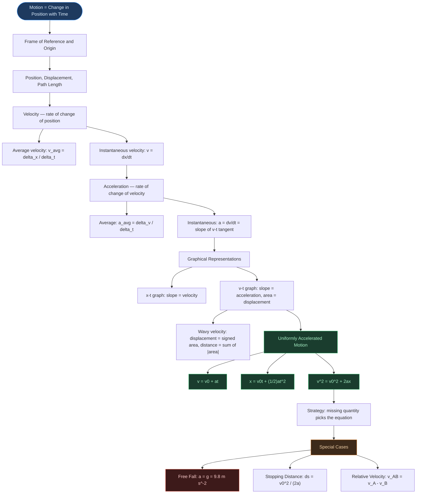
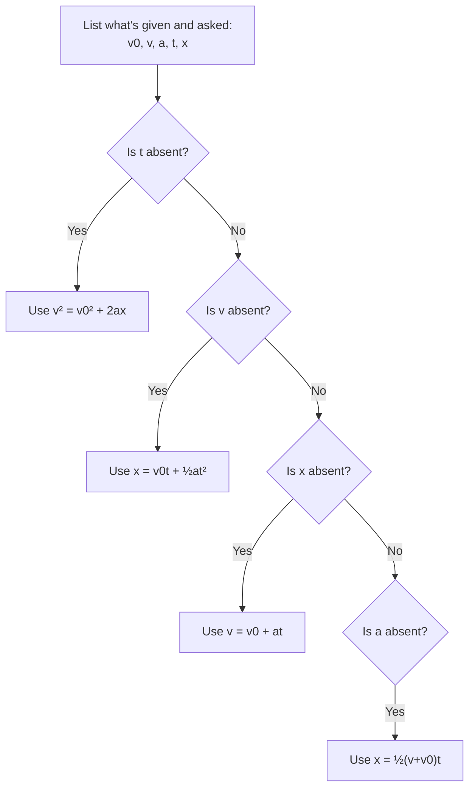

# ⚡ CHAPTER 2 — MOTION IN A STRAIGHT LINE
> **Complete Study Notes** | Board · NEET · JEE Layered

---

## 🗺️ CONCEPT ROADMAP



---

## SECTION 1 — INTRODUCTION: DESCRIBING MOTION

### 1.1 What is Motion?

> [!info] Definition
> **Motion** is the **change in position** of an object with respect to **time**. The description of motion without going into its causes is **Kinematics**.

- Kinematics = the study of **how** objects move, without reference to the causes (forces, mass, etc.). Causes are studied in Chapter 4 (Newton's Laws).
- This chapter restricts to **rectilinear motion** — motion along a **straight line**.
- Objects are treated as **point objects** (valid when object size is much smaller than the distance it moves).

### 1.2 Frame of Reference and Origin

- A **reference frame** is a coordinate system with respect to which motion is described.
- For straight-line motion, a single **x-axis** is sufficient.
- Position to the **right** of origin → **positive (+)**
- Position to the **left** of origin → **negative (−)**

> [!warning] Board Reminder
> The choice of origin and positive direction is **arbitrary**. Always state your chosen convention before solving any problem involving signs.

---

## SECTION 2 — POSITION, DISPLACEMENT, AND PATH LENGTH

### 2.1 Position

The **position** of an object at any instant is its coordinate measured from the origin along the axis. Symbol: $x$. SI unit: **m**.

### 2.2 Displacement ⭐

> [!important] Definition
> **Displacement** = Change in position:
>
> $$\Delta x = x_2 - x_1$$
>
> - It is a **vector** quantity (has both magnitude and direction).
> - SI unit: metre (m). Dimensional formula: $[L]$
> - Can be **positive, negative, or zero**.

### 2.3 Path Length (Distance)

> [!note] Definition
> **Path length** = Total length of the actual path traversed.
>
> - It is a **scalar** quantity (always $\geq 0$).
> - SI unit: metre (m). Dimensional formula: $[L]$

### 2.4 Key Distinction ⭐

| Feature | Displacement | Path Length |
|:---|:---:|:---:|
| Type | Vector | Scalar |
| Value | Can be +, −, or 0 | Always ≥ 0 |
| Formula | $x_2 - x_1$ | Sum of all path segments |
| Relation | $\leq$ Path Length | $\geq$ \|Displacement\| |

> [!important] Critical Rule
> **Path Length ≥ \|Displacement\|.** Equality holds **only** when motion is in one direction without any reversal.

**Example:** A person walks 4 m east, then 3 m west.

- Path length = 4 + 3 = **7 m**
- Displacement = 4 − 3 = **+1 m** (east)

---

## SECTION 3 — VELOCITY AND SPEED

### 3.1 Average Velocity ⭐

> [!info] Definition
> **Average velocity** = Total displacement ÷ Total time taken

$$\bar{v} = \frac{\Delta x}{\Delta t} = \frac{x_2 - x_1}{t_2 - t_1}$$

- **Vector** quantity. SI unit: m s⁻¹. Dimensional formula: $[M^0 L T^{-1}]$
- Can be positive, negative, or zero.

### 3.2 Average Speed

- **Average speed** = Total path length ÷ Total time taken
- **Scalar** quantity. Always $\geq |\text{average velocity}|$
- Equality holds only when motion is unidirectional.

> [!warning] NEET Trap
> **Average speed ≠ |Average velocity|** when the object reverses direction. A person who walks 2.5 km to market (30 min) and returns home (20 min) has **zero average velocity** over the entire trip but a non-zero average speed!

### 3.3 Instantaneous Velocity ⭐⭐

> [!important] Definition — Most Important for JEE
> **Instantaneous velocity** is the velocity at a specific **instant**, defined as the limit of average velocity as $\Delta t \to 0$:
>
> $$v = \lim_{\Delta t \to 0} \frac{\Delta x}{\Delta t} = \frac{dx}{dt}$$

- It is the **derivative of position with respect to time**.
- On an x–t graph: instantaneous velocity = **slope of the tangent** at that point.
- For **uniform motion** (constant velocity): instantaneous velocity = average velocity at all instants.

> [!example] NCERT Numerical — For $x = 0.08t^3$, find instantaneous velocity at $t = 4$ s
> $v = dx/dt = 0.24t^2$
>
> At $t = 4$ s: $v = 0.24 \times 16 = \mathbf{3.84}$ **m s⁻¹**
>
> Confirmed by NCERT Table 2.1 — as $\Delta t \to 0$, $\Delta x / \Delta t \to 3.84$ m s⁻¹.

> **Desmos graph placeholder — add in a later pass**
>
> Planned graph: the curve $x = 0.08t^3$ for $t \in [2, 6]$ s ($x$ in metres), with a secant line through $t = 4-\tfrac{\Delta t}{2}$ and $t = 4+\tfrac{\Delta t}{2}$, and a slider for $\Delta t \in [0.01, 2.0]$ s so the secant visibly rotates into the tangent at $t=4$ s as $\Delta t \to 0$.
> NCERT Table 2.1 values (this is exactly what the slider should reproduce):
>
> | $\Delta t$ (s) | 2.0 | 1.0 | 0.5 | 0.1 | 0.01 |
> |:---:|:---:|:---:|:---:|:---:|:---:|
> | $\Delta x/\Delta t$ (m s⁻¹) | 3.92 | 3.86 | 3.845 | 3.8402 | 3.8400 |
>
> The secant's slope converges monotonically to $3.84$ m s⁻¹ — the tangent slope — exactly matching the calculus answer above.

### 3.4 Instantaneous Speed

- **Instantaneous speed** = magnitude of instantaneous velocity = $|v|$
- **Always equal** to $|$instantaneous velocity$|$ (unlike average speed vs. average velocity)
- **Why?** At a single instant, path length and displacement are infinitesimally equal (no reversal possible at a point).

---

## SECTION 4 — ACCELERATION

### 4.1 Average Acceleration

> [!info] Definition
> **Average acceleration** = Change in velocity ÷ Time interval

$$\bar{a} = \frac{\Delta v}{\Delta t} = \frac{v_2 - v_1}{t_2 - t_1}$$

- **Vector** quantity. SI unit: m s⁻². Dimensional formula: $[M^0 L T^{-2}]$
- On a v–t graph: average acceleration = **slope of chord** connecting two points.

### 4.2 Instantaneous Acceleration ⭐

$$a = \lim_{\Delta t \to 0} \frac{\Delta v}{\Delta t} = \frac{dv}{dt}$$

- On a v–t graph: instantaneous acceleration = **slope of the tangent** at that point.
- Can be positive, negative, or zero.

### 4.3 Positive vs. Negative Acceleration — CRITICAL DISTINCTION ⭐⭐

> [!warning] The sign of acceleration does NOT tell you whether speed is increasing or decreasing. It depends on both the sign of acceleration AND the sign of velocity.

| Velocity | Acceleration | Effect on Speed |
|:---:|:---:|:---|
| Positive (+) | Positive (+) | Speed **increases** |
| Positive (+) | Negative (−) | Speed **decreases** (deceleration) |
| Negative (−) | Negative (−) | Speed **increases** (in negative direction) |
| Negative (−) | Positive (+) | Speed **decreases** |

**Rule:** If v and a have the **same sign** → speed increases. If **opposite signs** → speed decreases.

**Classic Example — Ball thrown upward (taking upward as positive):**

- Going up: $v > 0$, $a = -g < 0$ → speed decreases
- Coming down: $v < 0$, $a = -g < 0$ → speed increases
- At topmost point: $v = 0$, but $a = -g \neq 0$

> [!tip] Key Fact
> **Zero velocity at an instant does not imply zero acceleration at that instant.** A particle may be momentarily at rest yet have non-zero acceleration (e.g., ball at its highest point).

### 4.4 x–t, v–t, and a–t Graph Shapes

| Type of Motion | x–t graph | v–t graph |
|:---|:---|:---|
| Uniform ($a = 0$) | Straight line, inclined | Horizontal line (constant height) |
| Uniformly accelerated ($a > 0$) | Upward parabola | Straight line, positive slope |
| Uniformly decelerated ($a < 0$) | Downward parabola | Straight line, negative slope |

```tikz
\begin{tikzpicture}[thick, font=\small]
  \begin{scope}
    \draw[->, line width=0.8pt] (0,0) -- (2.4,0) node[right, font=\tiny] {$t$};
    \draw[->, line width=0.8pt] (0,0) -- (0,1.8) node[above, font=\tiny] {$x$};
    \draw[blue!70!black, line width=1.6pt] (0,0.15) -- (2.2,1.6);
    \node[below] at (1.1,-0.4) {$a=0$};
  \end{scope}
  \begin{scope}[xshift=3.4cm]
    \draw[->, line width=0.8pt] (0,0) -- (2.4,0) node[right, font=\tiny] {$t$};
    \draw[->, line width=0.8pt] (0,0) -- (0,1.8) node[above, font=\tiny] {$x$};
    \draw[orange!80!black, line width=1.6pt] plot[smooth] coordinates {(0,0.1) (0.6,0.2) (1.2,0.5) (1.8,1.0) (2.2,1.55)};
    \node[below] at (1.1,-0.4) {$a>0$};
  \end{scope}
  \begin{scope}[xshift=6.8cm]
    \draw[->, line width=0.8pt] (0,0) -- (2.4,0) node[right, font=\tiny] {$t$};
    \draw[->, line width=0.8pt] (0,0) -- (0,1.8) node[above, font=\tiny] {$x$};
    \draw[red!70!black, line width=1.6pt] plot[smooth] coordinates {(0,0.1) (0.6,0.75) (1.2,1.2) (1.8,1.45) (2.2,1.5)};
    \node[below] at (1.1,-0.4) {$a<0$};
  \end{scope}
\end{tikzpicture}
```

*Reading the figure:* the **bend direction** of the x–t curve *is* the sign of acceleration — bending upward (concave up, getting steeper) means $a>0$; bending downward (concave down, flattening out) means $a<0$; no bend at all means $a=0$. This is the fastest way to read acceleration off a position-time graph without doing any calculus.

The four v–t cases below match NCERT Fig. 2.3 exactly — the two things that can each independently be $+$ or $-$ are the **direction of motion** and the **sign of acceleration**:

```tikz
\begin{tikzpicture}[thick, font=\small]
  \begin{scope}
    \draw[gray] (-0.3,0) -- (2.3,0);
    \draw[->, line width=0.8pt] (0,-1.2) -- (0,1.6) node[above, font=\tiny] {$v$};
    \draw[blue!70!black, line width=1.6pt] (0,0.2) -- (2,1.4);
    \node[below] at (1,-1.5) {(a) $+$dir, $a>0$};
  \end{scope}
  \begin{scope}[xshift=3.6cm]
    \draw[gray] (-0.3,0) -- (2.3,0);
    \draw[->, line width=0.8pt] (0,-1.2) -- (0,1.6) node[above, font=\tiny] {$v$};
    \draw[orange!80!black, line width=1.6pt] (0,1.4) -- (2,0.2);
    \node[below] at (1,-1.5) {(b) $+$dir, $a<0$};
  \end{scope}
  \begin{scope}[yshift=-4.3cm]
    \draw[gray] (-0.3,0) -- (2.3,0);
    \draw[->, line width=0.8pt] (0,-1.6) -- (0,1.2) node[above, font=\tiny] {$v$};
    \draw[red!70!black, line width=1.6pt] (0,-0.2) -- (2,-1.4);
    \node[below] at (1,-1.9) {(c) $-$dir, $a<0$};
  \end{scope}
  \begin{scope}[xshift=3.6cm, yshift=-4.3cm]
    \draw[gray] (-0.3,0) -- (2.3,0);
    \draw[->, line width=0.8pt] (0,-1.2) -- (0,1.6) node[above, font=\tiny] {$v$};
    \draw[violet!70!black, line width=1.6pt] (0,1.4) -- (2,-1.0);
    \node[below, font=\tiny] at (1.17,0.15) {$t_1$};
    \node[below] at (1,-1.9) {(d) reverses at $t_1$};
  \end{scope}
\end{tikzpicture}
```

*Reading the figure:* (a) speeding up while moving forward; (b) slowing down while still moving forward (deceleration, but $v$ stays positive); (c) speeding up while moving backward (both $v$ and $a$ negative — this is *still* "speeding up," which is why "negative acceleration $\ne$ slowing down" is the trap in §4.3); (d) constant negative acceleration throughout — the object moves forward, slows, crosses $v=0$ at $t_1$, then moves backward, picking up speed in the new direction (a ball thrown straight up is exactly this case).

> [!tip] JEE Note
> In realistic graphs, x–t, v–t, a–t curves are **smooth** (no sharp kinks). Sharp kinks imply non-differentiable functions — physically impossible since velocity and acceleration cannot change instantaneously.

---

## SECTION 5 — AREA UNDER v–t GRAPH ⭐⭐

> [!important]
> **The area under the v–t curve between $t_1$ and $t_2$ equals the displacement of the object in that time interval.**

**Proof (for uniform velocity $u$):**
- v–t curve is a horizontal straight line at height $u$.
- Area under curve from 0 to $T$ = $u \times T$ = displacement ✓

**Check dimensions:** $v \text{ (m s}^{-1}) \times t \text{ (s)} = \text{m}$ = displacement ✓

For **changing velocity**, use calculus:

$$x = \int_{t_1}^{t_2} v \, dt$$

> [!warning] Board Note
> Students often confuse "area under v–t curve" (= displacement) with "area under a–t curve" (= change in velocity, $\Delta v$). Know **both**!

### 5.1 Wavy Velocity — Signed Area vs. Absolute Area ⭐⭐

> [!important] What happens when velocity changes sign
> If an object reverses direction one or more times, the v–t curve crosses the time axis. The region **above** the axis contributes a **positive** area; the region **below** contributes a **negative** area (since $v<0$ there). Displacement and distance treat these regions differently:

$$\text{Displacement} = A_1 - A_2 + A_3 - \cdots \qquad \text{(signed sum — regions below the axis subtract)}$$

$$\text{Distance} = |A_1| + |A_2| + |A_3| + \cdots \qquad \text{(sum of magnitudes — every region adds)}$$

```tikz
\usetikzlibrary{arrows.meta}
\begin{tikzpicture}[>={Stealth[length=7pt,width=5pt]}, thick]
  \draw[->, line width=1pt] (-0.3,0) -- (6.8,0) node[right, font=\small] {$t$};
  \draw[->, line width=1pt] (0,-2.0) -- (0,2.0) node[above, font=\small] {$v$};
  \fill[green!25] plot[smooth] coordinates {(0,0) (0.5,1.0) (1,1.4) (1.5,1.0) (2,0)} -- cycle;
  \fill[red!20] plot[smooth] coordinates {(2,0) (2.5,-1.0) (3,-1.4) (3.5,-1.0) (4,0)} -- cycle;
  \fill[green!25] plot[smooth] coordinates {(4,0) (4.5,0.8) (5,1.1) (5.5,0.6) (6,0)} -- cycle;
  \draw[blue!70!black, line width=1.8pt]
    plot[smooth] coordinates {(0,0) (0.5,1.0) (1,1.4) (1.5,1.0) (2,0) (2.5,-1.0) (3,-1.4) (3.5,-1.0) (4,0) (4.5,0.8) (5,1.1) (5.5,0.6) (6,0)};
  \node[font=\small, green!40!black] at (1,0.55) {$A_1\ (+)$};
  \node[font=\small, red!60!black] at (3,-0.55) {$A_2\ (-)$};
  \node[font=\small, green!40!black] at (5,0.45) {$A_3\ (+)$};
  \node[below, font=\itshape\small, text=gray] at (3.2,-1.85) {Displacement $=A_1-A_2+A_3$ \quad Distance $=|A_1|+|A_2|+|A_3|$};
\end{tikzpicture}
```

*Reading the figure:* the curve rises above the axis ($A_1$ — object moving in the $+$ direction), dips below it ($A_2$ — the object has reversed and is now moving in the $-$ direction), then rises again ($A_3$). Net displacement counts $A_2$ as a subtraction; total distance counts it as a fresh contribution — exactly like an odometer, which never runs backward.

> [!warning] NEET/JEE Trap
> This is the general version of the trap flagged in Section 9: **whenever a v–t graph dips below the axis, "area under the curve" for displacement subtracts that region, but distance always adds it.** A particle that ends up back near its starting point (small net displacement) can still have covered a large total distance — this is a favourite two-mark "distance vs. displacement from a graph" question.

---

## SECTION 6 — KINEMATIC EQUATIONS FOR UNIFORM ACCELERATION ⭐⭐⭐

### 6.1 The Three Equations of Motion

For an object with **constant acceleration $a$**, initial velocity $v_0$ at $t = 0$:

| Equation | Form | Quantities Linked |
|:---|:---:|:---|
| First equation | $v = v_0 + at$ | $v, v_0, a, t$ — no displacement |
| Second equation | $x = v_0 t + \frac{1}{2}at^2$ | $x, v_0, a, t$ — no final velocity |
| Third equation | $v^2 = v_0^2 + 2ax$ | $v, v_0, a, x$ — no time |
| Average velocity form | $x = \frac{1}{2}(v + v_0)t$ | $x, v, v_0, t$ — no acceleration |

> [!note]
> If initial position is $x_0$ (not zero), replace $x$ with $(x - x_0)$ in all equations.

### 6.2 Derivation via Graphical (Area) Method ⭐⭐⭐

> [!important] This is how NCERT itself first obtains Eq. 2 and Eq. 3 — geometrically, from the area under the v–t line — before the calculus method in 6.3.

Consider an object with initial velocity $v_0$ at $t=0$, reaching velocity $v$ at time $t$, under constant acceleration $a$. Its v–t graph is the straight line $AB$ from $A(0, v_0)$ to $B(t, v)$.

```tikz
\usetikzlibrary{arrows.meta}
\begin{tikzpicture}[>={Stealth[length=7pt,width=5pt]}, thick]
  \coordinate (O) at (0,0);
  \coordinate (A) at (0,1.5);
  \coordinate (D) at (5,0);
  \coordinate (C) at (5,1.5);
  \coordinate (B) at (5,4.2);
  \draw[->, line width=1pt] (-0.3,0) -- (6.3,0) node[right, font=\small] {$t$};
  \draw[->, line width=1pt] (0,-0.3) -- (0,5) node[above, font=\small] {$v$};
  \draw[fill=blue!12, draw=none] (O) -- (A) -- (C) -- (D) -- cycle;
  \draw[fill=orange!20, draw=none] (A) -- (B) -- (C) -- cycle;
  \draw[blue!70!black, line width=1.8pt] (A) -- (B);
  \draw[gray] (O) -- (A) -- (B) -- (D) -- cycle;
  \draw[dashed, gray] (A) -- (C) -- (B);
  \draw[dashed, gray] (C) -- (D);
  \node[left, font=\small] at (-0.15,1.5) {$A,\ v_0$};
  \node[right, font=\small] at (5.15,4.2) {$B,\ v$};
  \node[below left, font=\small] at (O) {$O$};
  \node[below, font=\small] at (D) {$D\ (t)$};
  \node[right, font=\small] at (5.05,1.35) {$C$};
  \node[font=\small, blue!50!black] at (2.4,0.7) {$v_0 t$};
  \node[font=\small, orange!70!black] at (4.35,2.6) {$\tfrac12(v-v_0)t$};
  \node[below, font=\itshape\small, text=gray] at (2.6,-0.9) {Area (rectangle $OACD$ + triangle $ACB$) $=$ displacement $x$};
\end{tikzpicture}
```

*Reading the figure:* the total area under $AB$, from $t=0$ to $t$, splits cleanly into a **rectangle** $OACD$ (height $v_0$, width $t$) and a **triangle** $ACB$ (base $t$, height $v-v_0$).

**Step 1 — add the two areas** (Section 5: area under v–t = displacement $x$):

$$x = \underbrace{v_0 t}_{\text{rectangle } OACD} + \underbrace{\tfrac{1}{2}(v - v_0)t}_{\text{triangle } ACB}$$

**Step 2 — substitute $v - v_0 = at$** (the first equation of motion):

$$x = v_0 t + \tfrac{1}{2}(at)(t) \;\Rightarrow\; \boxed{x = v_0 t + \tfrac{1}{2}at^2}$$

**Step 3 — eliminate $t$ for the third equation.** From Eq. 1, $t = (v-v_0)/a$. Writing the same area as (average height) × (width):

$$x = \bar v\, t = \left(\frac{v+v_0}{2}\right)\left(\frac{v-v_0}{a}\right) = \frac{v^2-v_0^2}{2a} \;\Rightarrow\; \boxed{v^2 = v_0^2 + 2ax}$$

> [!tip] Why keep both derivations?
> The graphical method is faster to *see* and is exactly what's being tested when a question gives you a graph instead of numbers. The calculus method below is the one that survives once acceleration stops being constant — keep both tools.

### 6.3 Derivation via Calculus Method (NCERT Example 2.2)

> [!note]
> The graphical method above assumed a straight v–t line (constant $a$) from the start. The calculus method below makes no such assumption until the integration step — which is exactly why it generalizes to *non-uniform* acceleration (see the JEE note below).

**Equation 1:**

> [!example] Derivation of $v = v_0 + at$
> $a = dv/dt \Rightarrow dv = a\, dt$
>
> Integrating both sides: $v - v_0 = at \Rightarrow \boxed{v = v_0 + at}$

**Equation 2:**

> [!example] Derivation of $x = v_0 t + \frac{1}{2}at^2$
> $v = dx/dt \Rightarrow dx = (v_0 + at)\, dt$
>
> Integrating: $x - x_0 = v_0 t + \tfrac{1}{2}at^2 \Rightarrow \boxed{x = v_0 t + \tfrac{1}{2}at^2}$ (with $x_0 = 0$)

**Equation 3:**

> [!example] Derivation of $v^2 = v_0^2 + 2ax$
> $a = v(dv/dx) \Rightarrow v\, dv = a\, dx$
>
> Integrating: $\tfrac{v^2 - v_0^2}{2} = ax \Rightarrow \boxed{v^2 = v_0^2 + 2ax}$

> [!warning] JEE Note
> Kinematic equations are valid **only for constant acceleration** (both magnitude and direction constant). For variable acceleration, use calculus directly — integrate $a$ to get $v$, integrate $v$ to get $x$.

### 6.4 Average Velocity Under Constant Acceleration

$$\bar{v} = \frac{v + v_0}{2}$$

This is the **arithmetic mean** of initial and final velocities — valid **only for constant acceleration**.

### 6.5 Distance in the nth Second ⭐⭐

> [!info] What "nth second" means
> $s_n$ is the distance covered **during** the interval from $t=(n-1)\,\text{s}$ to $t=n\,\text{s}$ — one specific one-second slice, not the total distance from $0$ to $n$ seconds.

**Derivation (calculus):** the distance in $[n-1, n]$ is the area under the v–t line over just that slice:

$$s_n = \int_{n-1}^{n} v\, dt = \int_{n-1}^{n} (v_0 + at)\, dt = \Big[v_0 t + \tfrac{1}{2}at^2\Big]_{n-1}^{n}$$

$$s_n = v_0\big(n-(n-1)\big) + \tfrac12 a\big(n^2-(n-1)^2\big) = v_0 + \tfrac12 a(n+n-1)$$

$$\boxed{s_n = v_0 + \frac{a}{2}(2n-1)}$$

```tikz
\usetikzlibrary{arrows.meta}
\begin{tikzpicture}[>={Stealth[length=7pt,width=5pt]}, thick]
  \draw[->, line width=1pt] (-0.3,0) -- (6.5,0) node[right, font=\small] {$t\ (\mathrm{s})$};
  \draw[->, line width=1pt] (0,-0.3) -- (0,4.6) node[above, font=\small] {$v$};
  \fill[orange!30] (3,0) -- (3,2.4) -- (4,3.0) -- (4,0) -- cycle;
  \draw[blue!70!black, line width=1.8pt] (0,0.6) -- (6,4.2);
  \foreach \x in {1,2,3,4,5} { \draw[gray!50] (\x,0) -- (\x,{0.6+\x*0.6}); }
  \node[below, font=\small] at (3,-0.05) {$n-1$};
  \node[below, font=\small] at (4,-0.05) {$n$};
  \node[font=\small, orange!70!black] at (3.5,1.1) {$s_n$};
  \node[below, font=\itshape\small, text=gray] at (3,-0.9) {Shaded strip $=$ distance covered in the $n$-th second};
\end{tikzpicture}
```

*Reading the figure:* each gridline marks a whole second; the shaded strip between $t=n-1$ and $t=n$ is $s_n$ — a thin trapezoid, not the full area from the origin (that full area would be total distance in $n$ seconds, a different and larger quantity).

> [!tip] Cross-check against Galileo's Law (Section 7.1)
> For free fall from rest ($v_0 = 0$), this reduces to $s_n = \frac{a}{2}(2n-1)$, i.e. $s_1 : s_2 : s_3 \cdots = 1:3:5\cdots$ — exactly the odd-number ratio. The general $s_n$ formula and Galileo's special case are the same result.

### 6.6 Worked NCERT Examples

**Example 2.1 — Position as function of time:** $x = a + bt^2$ where $a = 8.5$ m, $b = 2.5$ m s⁻²

> [!example] Solution
> $v = dx/dt = 2bt = 5.0t$ m s⁻¹
>
> At $t = 0$: $v = 0$ m s⁻¹ | At $t = 2.0$ s: $v = 10$ m s⁻¹
>
> Average velocity from $t = 2$ to $t = 4$ s:
>
> $\bar{v} = \dfrac{x(4) - x(2)}{4 - 2} = \dfrac{48.5 - 18.5}{2} = \mathbf{15}$ **m s⁻¹**

**Example 2.3 — Ball thrown upward from 25 m height at 20 m s⁻¹:** (Take $g = 10$ m s⁻²)

```tikz
\usetikzlibrary{arrows.meta}
\begin{tikzpicture}[>={Stealth[length=6pt,width=4pt]}, thick]
  \draw[line width=1pt] (-0.6,0) -- (2.6,0);
  \draw[fill=gray!20] (0,0) rectangle (0.9,2.5);
  \node[font=\tiny, gray!60!black, rotate=90] at (0.45,1.25) {building};
  \coordinate (A) at (0.45,2.5);
  \coordinate (Bmax) at (0.45,4.5);
  \fill (A) circle (1.6pt);
  \fill (Bmax) circle (1.6pt);
  \draw[->, blue!70!black, line width=1.3pt] (A) -- ++(0,0.6) node[right, font=\small, blue!70!black] {$v_0=20$ m/s};
  \draw[dashed, gray] (A) -- (Bmax);
  \node[left, font=\small] at (A) {$A$};
  \node[above, font=\small] at (Bmax) {$B,\ v=0$};
  \draw[<->, gray] (1.3,2.5) -- (1.3,4.5) node[midway, right, font=\small] {$20$ m};
  \draw[<->, gray] (1.75,0) -- (1.75,2.5) node[midway, right, font=\small] {$25$ m};
  \node[below, font=\small] at (0.45,-0.3) {ground};
\end{tikzpicture}
```

*Reading the figure:* the ball is launched from $A$, atop a $25$ m building, at $20$ m s⁻¹ upward. It decelerates under gravity, rising a further $20$ m to $B$ (where $v=0$), then falls the full $45$ m back to the ground — that full fall is what part (b) below solves for.

> [!example] Solution
> **(a) Maximum height above launch point:**
>
> $v^2 = v_0^2 + 2a(y - y_0) \Rightarrow 0 = 400 + 2(-10)(y - y_0) \Rightarrow \mathbf{(y - y_0) = 20}$ **m**
>
> **(b) Time to hit ground (Method 2 — full displacement):**
>
> $y_0 = 25$ m, $y = 0$, $v_0 = 20$ m s⁻¹, $a = -10$ m s⁻²
>
> $0 = 25 + 20t - 5t^2 \Rightarrow 5t^2 - 20t - 25 = 0 \Rightarrow \mathbf{t = 5}$ **s**

### 6.7 Problem-Solving Strategy — Which Equation to Use? ⭐⭐⭐

> [!tip] The five-quantities method
> Every constant-acceleration problem involves five quantities: $v_0, v, a, t, x$. Each of the four equations in §6.1 leaves out exactly one of them. **List what the problem gives you and what it asks for — whichever quantity doesn't appear at all is your cue for which equation to reach for.**



*Reading the flowchart:* work top to bottom, asking "is this quantity missing from the problem?" The first "yes" tells you which equation to reach for.

> [!example] Quick drill
> A car starts from rest ($v_0=0$) and covers $100$ m in $5$ s. Find its acceleration.
> Given: $v_0, x, t$. Missing: $v$. → Use $x = v_0t + \tfrac12at^2 \Rightarrow 100 = 0 + \tfrac12 a(25) \Rightarrow a = 8$ m s⁻².

### 6.8 Interactive Exploration (Coming Soon)

> **Desmos graph placeholder — add in a later pass**
>
> Planned graph: $x = v_0 t + \tfrac12 a t^2$ plotted for $t \in [0,10]$ s, with independent sliders for $v_0 \in [-10,10]$ m s⁻¹ and $a \in [-5,5]$ m s⁻², shown alongside $v = v_0+at$ so the slope of the $v$–$t$ line visibly matches the changing steepness of the $x$–$t$ curve.
> Value table for $v_0=0$, $a=2$ m s⁻² (illustrates the parabolic growth pattern):
>
> | $t$ (s) | 0 | 1 | 2 | 3 | 4 |
> |:---:|:---:|:---:|:---:|:---:|:---:|
> | $x$ (m) | 0 | 1 | 4 | 9 | 16 |
>
> Increasing $a$ steepens the parabola; a nonzero $v_0$ shifts where the curve's turning point sits relative to $t=0$.

---

## SECTION 7 — FREE FALL ⭐⭐

> [!important] Definition
> **Free fall** = motion of an object under **gravity alone**, with no air resistance.

- Acceleration = $g = 9.8$ m s⁻² (downward), constant near Earth's surface.
- Special case of uniformly accelerated motion.
- **Galileo's discovery:** All objects fall with the same acceleration regardless of mass (in absence of air resistance).

### 7.1 Galileo's Law of Odd Numbers

> [!info] Galileo's Law of Odd Numbers *(Board/NEET)*
> Distances covered in the 1st, 2nd, 3rd, ... equal time intervals $\tau$ (from rest) are in the ratio:
>
> $$1 : 3 : 5 : 7 : 9 \ldots$$
>
> Total distance after $n$ intervals $\propto n^2$ (i.e., $1 : 4 : 9 : 16 \ldots$)

### 7.2 Free Fall Equations (upward = positive)

**Example 2.4 (NCERT) — Free fall from rest:**

> [!example] Free Fall Equations (taking upward as positive, $v_0 = 0$)
> $a = -g = -9.8$ m s⁻²
>
> $v = -gt = -9.8t$ m s⁻¹
>
> $y = -\tfrac{1}{2}gt^2 = -4.9t^2$ m
>
> $v^2 = -2gy = -19.6y$ m² s⁻²

**Stopping Distance (Example 2.6):**

$$d_s = \frac{v_0^2}{2a}$$

Stopping distance $\propto v_0^2$ — doubling initial speed **quadruples** stopping distance.

**Reaction Time (Example 2.7):** A ruler dropped under free fall.

$$t_r = \sqrt{\frac{2d}{g}}$$

For $d = 21.0$ cm: $t_r = \sqrt{2 \times 0.21 / 9.8} \approx 0.2$ s

---

## SECTION 8 — RELATIVE VELOCITY ⭐⭐

### 8.1 Concept

> [!important] Definition
> **Relative velocity** of object A with respect to B:
>
> $$v_{AB} = v_A - v_B$$
>
> where $v_A$ and $v_B$ are velocities measured with respect to the ground frame.

```tikz
\usetikzlibrary{arrows.meta}
\begin{tikzpicture}[>={Stealth[length=6pt,width=4pt]}, thick]
  \draw[line width=1pt] (-0.5,0) -- (7,0);
  \fill (1,0) circle (2pt);
  \node[below, font=\small] at (1,-0.3) {$B$};
  \fill (4,0) circle (2pt);
  \node[below, font=\small] at (4,-0.3) {$A$};
  \draw[->, red!70!black, line width=1.4pt] (1,0.3) -- (2.3,0.3) node[midway, above, font=\small, red!70!black] {$v_B$};
  \draw[->, blue!70!black, line width=1.4pt] (4,0.3) -- (6.3,0.3) node[midway, above, font=\small, blue!70!black] {$v_A$};
  \draw[->, violet!70!black, line width=1.4pt] (4,-0.9) -- (5.5,-0.9) node[midway, below, font=\small, violet!70!black] {$v_{AB}=v_A-v_B$};
  \node[below, font=\itshape\small, text=gray] at (3,-1.6) {Both $v_A$ and $v_B$ are ground-frame velocities; $v_{AB}$ is how fast $A$ appears to move to an observer riding on $B$};
\end{tikzpicture}
```

### 8.2 Cases

**Case 1: Same direction**

$$v_{AB} = v_A - v_B$$

- $v_A = v_B$: relative velocity = 0 (appear stationary to each other)
- $v_A > v_B$: A moves away from B

**Case 2: Opposite directions** (A at $+v_A$, B at $-v_B$):

$$v_{AB} = v_A - (-v_B) = v_A + v_B$$

> [!tip] Classic NCERT Example (Q2.14)
> Police van at +30 km h⁻¹ fires bullet at +150 m s⁻¹. Thief's car at +192 km h⁻¹ = +53.33 m s⁻¹.
>
> - Bullet speed (ground frame) = 150 + 8.33 = 158.33 m s⁻¹
> - Relative speed of bullet w.r.t. thief's car = 158.33 − 53.33 = **105 m s⁻¹**

### 8.3 Meeting Problems

For two objects moving from the same start:

- Positions at time $t$: $x_A(t) = x_{A0} + v_A \cdot t$ and $x_B(t) = x_{B0} + v_B \cdot t$
- If $v_A = v_B$: separation remains constant → they never meet or separate further.
- To find meeting time: set $x_A(t) = x_B(t)$ and solve for $t$.

---

## SECTION 9 — GRAPHICAL INTERPRETATION SUMMARY ⭐⭐⭐

### x–t Graph

| Feature | Physical Meaning |
|:---|:---|
| Slope ($dx/dt$) | Instantaneous velocity |
| Positive slope | Moving in positive direction |
| Negative slope | Moving in negative direction |
| Zero slope (horizontal) | Object at rest |
| Curve bending upward | Positive acceleration |
| Curve bending downward | Negative acceleration |
| Straight line | Uniform velocity ($a = 0$) |

### v–t Graph

| Feature | Physical Meaning |
|:---|:---|
| Slope ($dv/dt$) | Instantaneous acceleration |
| Area under curve | Displacement |
| Horizontal line | Uniform velocity ($a = 0$) |
| Straight line, positive slope | Uniform positive acceleration |
| Straight line, negative slope | Uniform deceleration |
| Crossing the time axis ($v = 0$) | Object momentarily at rest / reverses direction |

> [!warning] Board Trap
> A v–t graph **crossing** the x-axis means the object **reverses direction**, NOT that it stops permanently. Area **below** the x-axis represents displacement in the negative direction.

### a–t Graph

| Feature | Physical Meaning |
|:---|:---|
| Area under curve | Change in velocity ($\Delta v$) |
| Horizontal line | Uniformly accelerated motion |

---

## SECTION 10 — POINTS TO PONDER (NCERT) ⭐

1. Origin and positive direction are a **choice** — specify them first.
2. If speed is **increasing** → $a$ is in the **same direction** as $v$. If speed is **decreasing** → $a$ is **opposite** to $v$.
3. Sign of acceleration depends on choice of positive direction — **not** inherently linked to speeding up/down.
4. Zero velocity at an instant **≠** zero acceleration (e.g., ball at topmost point: $v = 0$ but $a = g$).
5. Kinematic quantities are **algebraic** — always substitute with correct signs.
6. Kinematic equations hold **only for constant acceleration** (magnitude AND direction both constant).

---

## SECTION 11 — DIMENSIONAL FORMULAE

| Physical Quantity | Symbol | Dimensional Formula | SI Unit |
|:---|:---:|:---:|:---:|
| Displacement | $\Delta x$ | $[M^0 L T^0]$ | m |
| Velocity (avg and inst.) | $v$ | $[M^0 L T^{-1}]$ | m s⁻¹ |
| Speed | — | $[M^0 L T^{-1}]$ | m s⁻¹ |
| Acceleration (avg and inst.) | $a$ | $[M^0 L T^{-2}]$ | m s⁻² |
| Time | $t$ | $[M^0 L^0 T^1]$ | s |

---

## SECTION 12 — QUICK FORMULA REFERENCE ⭐⭐⭐

| Formula | Name | Condition |
|:---|:---|:---|
| $v = v_0 + at$ | 1st equation of motion | Constant $a$; $x_0 = 0$ |
| $x = v_0 t + \frac{1}{2}at^2$ | 2nd equation of motion | Constant $a$; $x_0 = 0$ |
| $v^2 = v_0^2 + 2ax$ | 3rd equation of motion | Constant $a$; $x_0 = 0$ |
| $x = \frac{1}{2}(v + v_0)t$ | Average velocity form | Constant $a$ |
| $s_n = v_0 + a(n - \frac{1}{2})$ | Distance in nth second | Constant $a$ |
| $\bar{v} = \Delta x / \Delta t$ | Average velocity (general) | Any motion |
| $v = dx/dt$ | Instantaneous velocity | Any motion |
| $a = dv/dt = v(dv/dx)$ | Instantaneous acceleration | Any motion |
| $v_{AB} = v_A - v_B$ | Relative velocity | Any 1D motion |
| $d_s = v_0^2 / (2a)$ | Stopping distance | Uniform deceleration |
| $t_r = \sqrt{2d/g}$ | Reaction time | Ruler drop experiment |
| $1 : 3 : 5 : 7 \ldots$ | Galileo's odd numbers | Free fall from rest |

---

## SECTION 13 — COMMON EXAM TRAPS ⭐⭐⭐

> [!danger] High-Yield Mistakes to Avoid

1. **Sign of $a$ ≠ direction of motion:** Negative $a$ doesn't mean moving backward — it depends on initial velocity direction.
2. **$v = 0$ does NOT mean $a = 0$:** At the highest point of a throw, $v = 0$ but $a = g$ downward.
3. **Average speed ≠ |Average velocity|** when the object reverses direction.
4. **Instantaneous speed = |Instantaneous velocity|** always (unlike the averages).
5. **Kinematic equations require constant acceleration** — don't use them for variable $a$.
6. **Area under v–t = displacement** (not distance). For total distance when direction changes, split and add magnitudes separately.
7. **Relative velocity:** same direction → $v_{AB} = v_A - v_B$; opposite direction → $v_{AB} = v_A + v_B$.
8. **Stopping distance $\propto v_0^2$:** Doubling speed → **4× stopping distance**.
9. **Galileo's odd numbers:** Only valid for free fall from **REST** ($v_0 = 0$).
10. **Sharp kinks in graphs** → non-physical (functions not differentiable).

---

*End of Core Notes — Ch. 2: Motion in a Straight Line*
*Exam Tags: Board · NEET · JEE Mains · JEE Advanced*