# Physics | Chapter 03 | Motion in a Plane | CNOTES

### Motion in a Plane

---

> Section numbers match NOTES. Priority: ⭐ standard · ⭐⭐ important · ⭐⭐⭐ essential.

## CONCEPT ROADMAP

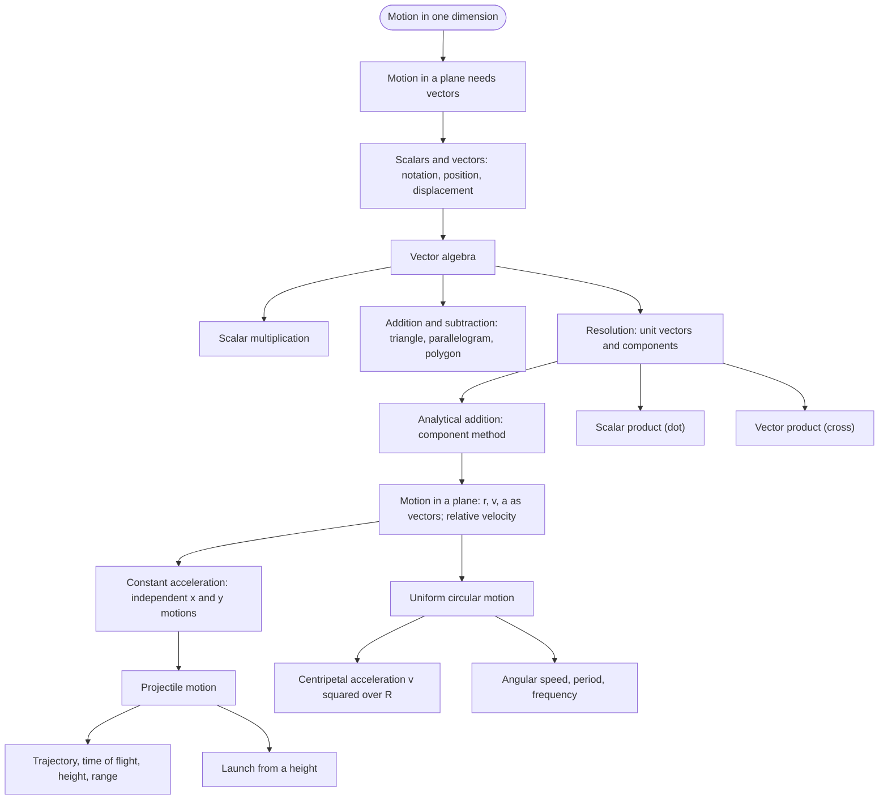

---

## SECTION 1 — SCALARS AND VECTORS ⭐

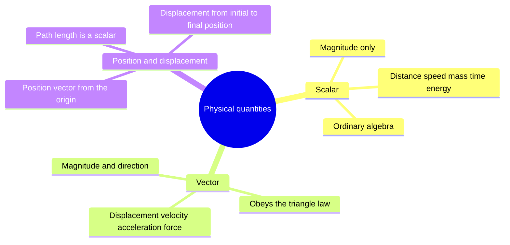

### 1.1 Scalar Quantities

- **Scalar** — magnitude only
- Combines by ordinary algebra
- Examples: distance, speed, mass, time, temperature, energy
- Fully described by a number and a unit

### 1.2 Vector Quantities ⭐

- **Vector** — magnitude and direction
- Obeys the triangle law of addition (§3.1)
- Examples: displacement, velocity, acceleration, force
- The addition rule is part of the definition
- Finite rotations have magnitude and direction but do not add like arrows
- Trap: a direction alone does not make a quantity a vector (§1.2)

### 1.3 Vector Notation

- Print: boldface $\mathbf{A}$
- Handwritten: arrow $\vec{A}$
- Magnitude: $|\mathbf{A}| = A$, a non-negative scalar
- Drawn as an arrow: length ∝ magnitude, head shows direction
- The other end of the arrow is the tail

### 1.4 Position and Displacement Vectors

- **Position vector** $\mathbf{r} = \overrightarrow{OP}$ — from the origin to the particle
  - SI unit m · dimension $[L]$
- **Displacement** $\Delta\mathbf{r} = \mathbf{r}' - \mathbf{r}$ — from initial position to final position
  - SI unit m · dimension $[L]$
- **Path length** — length of the route travelled
- Scalar · never negative
- Displacement depends only on the two end points
- Different routes: same $\Delta\mathbf{r}$, different path lengths
- $|\Delta\mathbf{r}| \le$ path length
- Equality only for straight-line motion without reversal
- Trap: a return to the start gives displacement $\mathbf{0}$ and a positive path length (§1.4)

### 1.5 Equality of Vectors

- Equal: same magnitude and same direction
- Position of the arrow does not matter for a displacement
- A position vector is anchored at the origin
- Trap: $|\mathbf{A}| = |\mathbf{B}|$ does not give $\mathbf{A} = \mathbf{B}$ (§1.5)

---

## SECTION 2 — MULTIPLICATION OF VECTORS BY REAL NUMBERS ⭐

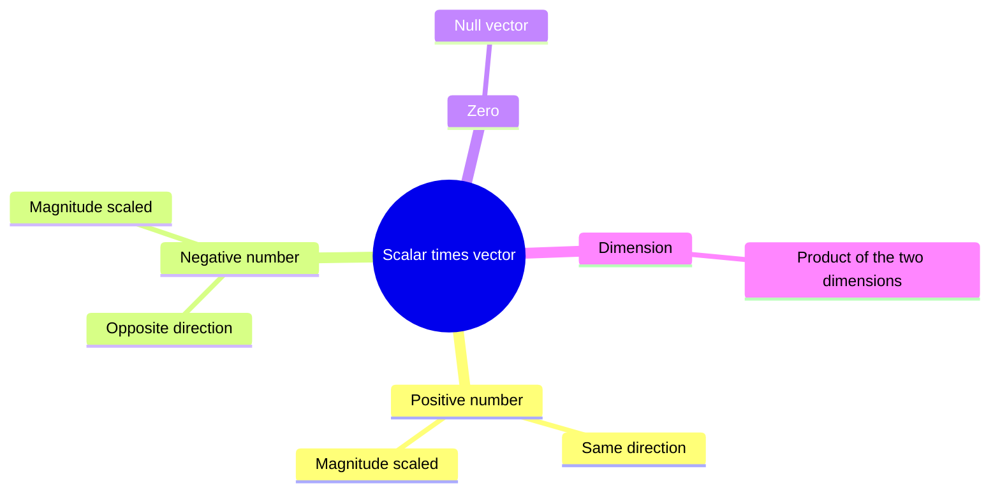

### 2.1 Multiplication by a Positive Scalar ($\lambda > 0$)

- Magnitude of $\lambda\mathbf{A}$: $\lambda A$
- Direction: same as $\mathbf{A}$

### 2.2 Multiplication by a Negative Scalar ($-\lambda$)

- Magnitude of $-\lambda\mathbf{A}$: $\lambda A$
- Direction: opposite to $\mathbf{A}$
- $\lambda = 1$: gives $-\mathbf{A}$
- $\lambda = 0$: gives the null vector (§3.3)

### 2.3 Dimension of $\lambda\mathbf{A}$

- $[\lambda\mathbf{A}] = [\lambda]\,[\mathbf{A}]$
- Pure number $\lambda$: same dimension as $\mathbf{A}$
- Example: velocity × time → $[LT^{-1}][T] = [L]$

---

## SECTION 3 — ADDITION AND SUBTRACTION OF VECTORS ⭐⭐

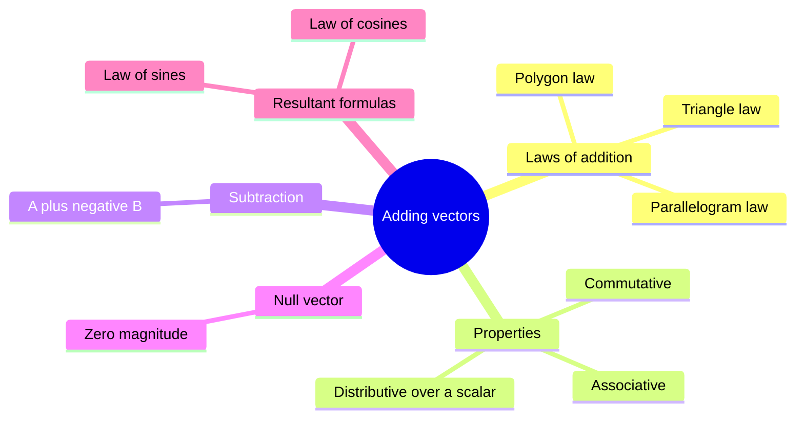

### 3.1 Triangle Law of Vector Addition (Head-to-Tail Method)

- Place the tail of $\mathbf{B}$ at the head of $\mathbf{A}$
- Resultant $\mathbf{R} = \mathbf{A} + \mathbf{B}$: tail of $\mathbf{A}$ to head of $\mathbf{B}$
- Equals displacement $\mathbf{A}$ followed by displacement $\mathbf{B}$
- Trap: $|\mathbf{A} + \mathbf{B}| \ne |\mathbf{A}| + |\mathbf{B}|$ unless the vectors point the same way (§3.1)

```tikz
\usetikzlibrary{arrows.meta}
\begin{tikzpicture}[>={Stealth[length=7pt,width=5pt]}, thick, scale=1.1]
  \coordinate (O) at (0,0);
  \coordinate (P) at (3,0.8);
  \coordinate (Q) at (4,3);
  \draw[->, blue!80!black, line width=1.6pt] (O) -- (P)
    node[midway, below, font=\small] {$\mathbf{A}$};
  \draw[->, green!60!black, line width=1.6pt] (P) -- (Q)
    node[midway, right, font=\small] {$\mathbf{B}$};
  \draw[->, red!80!black, line width=1.8pt, dashed] (O) -- (Q)
    node[midway, left, font=\small] {$\mathbf{R} = \mathbf{A} + \mathbf{B}$};
  \node[below left, font=\small] at (O) {O};
  \node[below right, font=\small] at (P) {P};
  \node[above right, font=\small] at (Q) {Q};
  \fill (O) circle (2.5pt);
  \fill (P) circle (2.5pt);
  \fill (Q) circle (2.5pt);
  \node[below, font=\itshape\small, text=gray] at (2,-0.4)
    {Triangle Law: tail of B at head of A};
\end{tikzpicture}
```

### 3.2 Properties of Vector Addition

- **Commutative** — $\mathbf{A} + \mathbf{B} = \mathbf{B} + \mathbf{A}$
- **Associative** — $(\mathbf{A} + \mathbf{B}) + \mathbf{C} = \mathbf{A} + (\mathbf{B} + \mathbf{C})$
- **Distributive** — $\lambda(\mathbf{A} + \mathbf{B}) = \lambda\mathbf{A} + \lambda\mathbf{B}$
- **Distributive** — $(\lambda + \mu)\mathbf{A} = \lambda\mathbf{A} + \mu\mathbf{A}$
- Any number of vectors: any order, any grouping
- Distributive law lets components add axis by axis (§5.1)

### 3.3 Null Vector (Zero Vector)

- **Null vector** $\mathbf{0}$ — zero magnitude
- Direction undefined
- $\mathbf{A} + (-\mathbf{A}) = \mathbf{0}$
- $\mathbf{A} + \mathbf{0} = \mathbf{A}$
- $\lambda\mathbf{0} = \mathbf{0}$
- $0\,\mathbf{A} = \mathbf{0}$
- Example: displacement of a particle that returns to its start
- Example: net force on a body in equilibrium

### 3.4 Vector Subtraction

- $\mathbf{A} - \mathbf{B} = \mathbf{A} + (-\mathbf{B})$
- $-\mathbf{B}$: same length as $\mathbf{B}$, opposite direction
- $\mathbf{B} - \mathbf{A} = -(\mathbf{A} - \mathbf{B})$
- Trap: $\mathbf{A} - \mathbf{B} \ne \mathbf{B} - \mathbf{A}$ (§3.4)

```tikz
\usetikzlibrary{arrows.meta}
\begin{tikzpicture}[>={Stealth[length=7pt,width=5pt]}, thick, scale=1.05]
  \coordinate (O) at (0,0);
  \coordinate (A) at (3.4,1.1);
  \coordinate (B) at (1.6,2.6);
  \coordinate (NB) at (-1.6,-2.6);
  \coordinate (R1) at (5.0,3.7);
  \coordinate (R2) at (1.8,-1.5);
  \draw[->, blue!80!black, line width=1.6pt] (O) -- (A)
    node[midway, below, font=\small] {$\mathbf{A}$};
  \draw[->, green!60!black, line width=1.6pt] (O) -- (B)
    node[midway, left, font=\small] {$\mathbf{B}$};
  \draw[->, green!60!black, dashed, line width=1.4pt] (O) -- (NB)
    node[midway, left, font=\small] {$-\mathbf{B}$};
  \draw[->, red!80!black, line width=1.8pt] (O) -- (R1)
    node[midway, above, font=\small] {$\mathbf{R_1}=\mathbf{A}+\mathbf{B}$};
  \draw[->, orange!80!black, line width=1.8pt] (O) -- (R2)
    node[midway, right, font=\small] {$\mathbf{R_2}=\mathbf{A}-\mathbf{B}$};
  \fill (O) circle (2.5pt);
  \node[below, font=\itshape\small, text=gray] at (1.0,-2.0)
    {A - B is A plus the reverse of B -- shown alongside A + B for comparison};
\end{tikzpicture}
```

### 3.5 Parallelogram Law of Vector Addition

- Draw $\mathbf{A}$ and $\mathbf{B}$ from a common tail
- Complete the parallelogram
- Diagonal from the common tail = $\mathbf{R} = \mathbf{A} + \mathbf{B}$
- Opposite side of the parallelogram = $\mathbf{B}$ shifted to the head of $\mathbf{A}$
- Same diagonal as the triangle law
- Natural for two vectors acting from one point, such as two forces

```tikz
\usetikzlibrary{arrows.meta}
\begin{tikzpicture}[>={Stealth[length=7pt,width=5pt]}, thick, scale=1.1]
  \coordinate (O) at (0,0);
  \coordinate (A) at (3.2,0.5);
  \coordinate (B) at (0.8,2.2);
  \coordinate (R) at (4.0,2.7);
  \draw[dashed, blue!50!black, line width=1pt] (B) -- (R);
  \draw[dashed, green!50!black, line width=1pt] (A) -- (R);
  \draw[->, blue!80!black, line width=1.6pt] (O) -- (A)
    node[midway, below, font=\small] {$\mathbf{A}$};
  \draw[->, green!60!black, line width=1.6pt] (O) -- (B)
    node[midway, left, font=\small] {$\mathbf{B}$};
  \draw[->, red!80!black, line width=2pt] (O) -- (R)
    node[midway, above left, font=\small] {$\mathbf{R}$};
  \node[below left, font=\small] at (O) {O};
  \fill (O) circle (2.5pt);
  \fill (R) circle (2pt);
  \node[below, font=\itshape\small, text=gray] at (2,-0.4)
    {Diagonal from origin = resultant R};
\end{tikzpicture}
```

### 3.6 Polygon Law of Vector Addition

- Place vectors head to tail in sequence
- Resultant: first tail to last head
- Order does not matter (§3.2)
- Closed polygon: resultant is the null vector

### 3.7 Worked Example — Rain and Wind

- Rain: 35 m s⁻¹ vertical
- Wind: 12 m s⁻¹ horizontal
- Method: perpendicular vectors → $R = \sqrt{35^2 + 12^2}$
- $R = 37$ m s⁻¹
- $\tan\theta = 12/35$ → $\theta \approx 19^\circ$ from the vertical
- Umbrella top tilts toward the upwind side

### 3.8 Law of Cosines and Law of Sines ⭐

- $\theta$ = angle between $\mathbf{A}$ and $\mathbf{B}$ with tails together
- Head-to-tail triangle interior angle: $180^\circ - \theta$
- **Magnitude** — $R = \sqrt{A^2 + B^2 + 2AB\cos\theta}$
- **Direction** — $\tan\alpha = \dfrac{B\sin\theta}{A + B\cos\theta}$
- $\alpha$ = angle between $\mathbf{R}$ and $\mathbf{A}$
- **Law of sines** — $\dfrac{R}{\sin\theta} = \dfrac{A}{\sin\beta} = \dfrac{B}{\sin\alpha}$
- $\beta$ = angle between $\mathbf{R}$ and $\mathbf{B}$
- Difference: $|\mathbf{A} - \mathbf{B}| = \sqrt{A^2 + B^2 - 2AB\cos\theta}$
- Bounds: $|A - B| \le R \le A + B$

| Angle $\theta$ | Resultant $R$ | Situation |
|---|---|---|
| $0^\circ$ | $A + B$ | Same direction, maximum |
| $90^\circ$ | $\sqrt{A^2 + B^2}$ | Perpendicular |
| $180^\circ$ | $\lvert A - B\rvert$ | Opposite, minimum |
| Any, $A = B$ | $2A\cos(\theta/2)$ | Equal magnitudes |

- Trap: equal magnitudes give $2A\cos(\theta/2)$, not $2A\cos\theta$ (§3.8)

---

## SECTION 4 — RESOLUTION OF VECTORS ⭐⭐

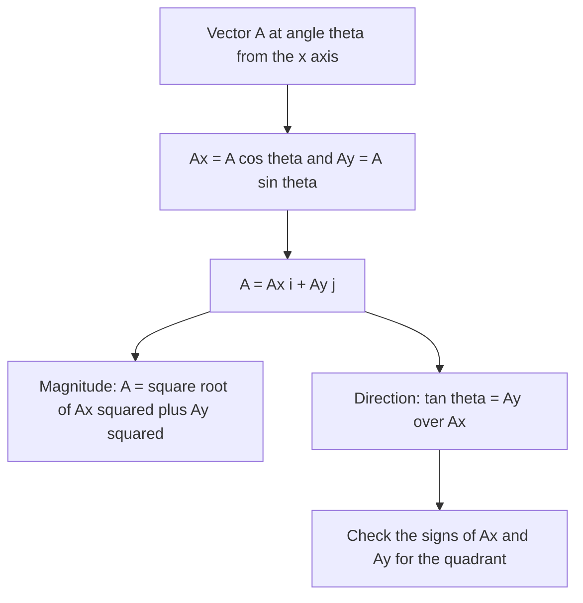

### 4.1 Resolving Along Two Arbitrary Directions

- $\mathbf{A} = \lambda\mathbf{a} + \mu\mathbf{b}$ for non-collinear $\mathbf{a}$, $\mathbf{b}$
- $\lambda$, $\mu$ are real numbers
- Parallelogram law run backwards
- Directions need not be perpendicular
- Perpendicular axes are simplest (§4.3)

### 4.2 Unit Vectors ⭐

- **Unit vector** $\hat{n} = \mathbf{A}/|\mathbf{A}|$ — magnitude 1
- Specifies a direction
- No dimension · no unit
- $\mathbf{A} = |\mathbf{A}|\,\hat{n}$
- $\hat{i}$, $\hat{j}$, $\hat{k}$ — along $+x$, $+y$, $+z$
- $\hat{i}$, $\hat{j}$, $\hat{k}$ are mutually perpendicular
- Worked: $6\hat{i} + 8\hat{j}$ → magnitude 10 → $\hat{A} = 0.6\hat{i} + 0.8\hat{j}$
- Trap: divide by $|\mathbf{A}|$, not $|\mathbf{A}|^2$ (§4.2)
- A correct unit vector has magnitude 1

### 4.3 Resolving a Vector Along the $x$ and $y$ Axes ⭐⭐⭐

- $A_x = A\cos\theta$
- $A_y = A\sin\theta$
- $\mathbf{A} = A_x\hat{i} + A_y\hat{j}$
- $\theta$ measured from the $+x$ axis
- $A = \sqrt{A_x^2 + A_y^2}$
- $\tan\theta = A_y/A_x$
- Component $A_x$ — scalar
- May be positive, negative or zero
- Component vector $A_x\hat{i}$ — vector along the axis
- Trap: $\tan^{-1}$ gives the correct angle only for $A_x > 0$ (§4.3)
- For $A_x < 0$ add $180^\circ$
- Example: $-3\hat{i} + 3\hat{j}$ gives $\tan^{-1}(-1) = -45^\circ$
- True angle: $135^\circ$

```tikz
\usetikzlibrary{arrows.meta}
\begin{tikzpicture}[>={Stealth[length=7pt,width=5pt]}, thick]
  \draw[->, thin, black] (-0.4,0) -- (4.2,0) node[right, font=\small] {$x$};
  \draw[->, thin, black] (0,-0.4) -- (0,3.4) node[above, font=\small] {$y$};
  \node[below left, font=\small] at (0,0) {O};
  \draw[->, blue!80!black, line width=2pt] (0,0) -- (3,2.52)
    node[above right, font=\small] {$\mathbf{A}$};
  \draw[->, red!80!black, line width=1.5pt] (0,0) -- (3,0)
    node[below, font=\small] {$A_x = A\cos\theta$};
  \draw[->, green!60!black, line width=1.5pt] (3,0) -- (3,2.52)
    node[right, font=\small] {$A_y = A\sin\theta$};
  \draw[dashed, gray, thin] (0,2.52) -- (3,2.52);
  \draw[thin] (2.85,0) -- (2.85,0.15) -- (3,0.15);
  \draw[thin] (0.65,0) arc (0:40:0.65);
  \node[font=\small] at (0.88,0.27) {$\theta$};
  \node[below, font=\itshape\small, text=gray] at (1.8,-0.6)
    {A resolves into independent x and y components};
\end{tikzpicture}
```

### 4.4 Three-Dimensional Resolution

- $\mathbf{A} = A_x\hat{i} + A_y\hat{j} + A_z\hat{k}$
- $A = \sqrt{A_x^2 + A_y^2 + A_z^2}$
- **Direction cosines** — cosines of $\alpha$, $\beta$, $\gamma$ with the $x$, $y$, $z$ axes
- $A_x = A\cos\alpha$
- $A_y = A\cos\beta$
- $A_z = A\cos\gamma$
- $\cos^2\alpha + \cos^2\beta + \cos^2\gamma = 1$

### 4.5 Position Vector in Component Form

- $\mathbf{r} = x\hat{i} + y\hat{j} + z\hat{k}$
- Point $(4, 4)$ → $\mathbf{r} = 4\hat{i} + 4\hat{j}$
- $\Delta\mathbf{r} = (x' - x)\hat{i} + (y' - y)\hat{j} + (z' - z)\hat{k}$

### 4.6 Worked Examples — Components and Unit Vectors

- $P(1, 2, -1)$, $Q(3, 2, 2)$ → $\overrightarrow{PQ} = 2\hat{i} + 3\hat{k}$
- $|\overrightarrow{PQ}| = \sqrt{13}$
- $\mathbf{A} + \mathbf{B} = 4\hat{i} - \hat{j} - \hat{k}$ → magnitude $3\sqrt{2}$
- Unit vector: $\frac{2\sqrt{2}}{3}\hat{i} - \frac{\sqrt{2}}{6}\hat{j} - \frac{\sqrt{2}}{6}\hat{k}$
- Magnitude of $\mathbf{B} = 25$ along $\mathbf{A} = 3\hat{i} + 4\hat{j}$ → $|\mathbf{B}|\hat{A} = 15\hat{i} + 20\hat{j}$
- 80 km h⁻¹ with $v_x = 40$ → $v_y = 40\sqrt{3} \approx 69$ km h⁻¹
- Same case: $\theta = 60^\circ$

---

## SECTION 5 — VECTOR ADDITION: ANALYTICAL METHOD ⭐⭐

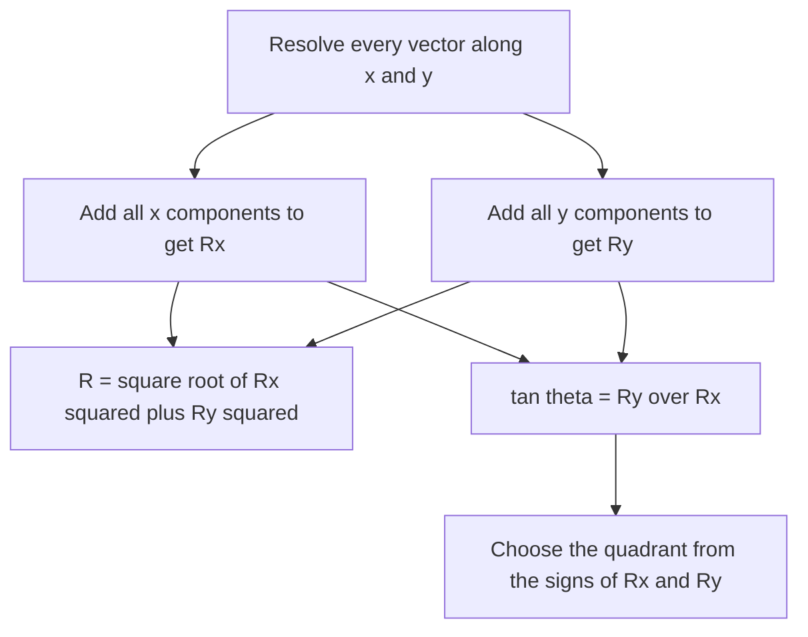

### 5.1 Component Method (Most Practical)

- $\mathbf{R} = (A_x + B_x)\hat{i} + (A_y + B_y)\hat{j}$
- Components of the resultant = sums of components
- Extends to $z$ and to any number of vectors
- Subtraction: reverse the signs of the second vector's components
- Step 1: resolve every vector along the axes
- Step 2: add the $x$ components to get $R_x$
- Step 2: add the $y$ components to get $R_y$
- Step 3: $R = \sqrt{R_x^2 + R_y^2}$
- Step 3: $\tan\theta = R_y/R_x$
- Quadrant from the signs of $R_x$ and $R_y$ (§4.3)

### 5.2 Worked Example — Motorboat

- Boat: 25 km h⁻¹ due north
- Current: 10 km h⁻¹ at $60^\circ$ east of south
- Current: $v_x = 5\sqrt{3} \approx 8.66$ · $v_y = -5$
- $R_x = 8.66$ · $R_y = 20$
- $R = \sqrt{475} \approx 21.8$ km h⁻¹
- Direction: $\varphi \approx 23.4^\circ$ from north toward east
- Check: law of cosines at $120^\circ$ gives $\sqrt{475}$

---

## SECTION 6 — MOTION IN A PLANE ⭐⭐⭐

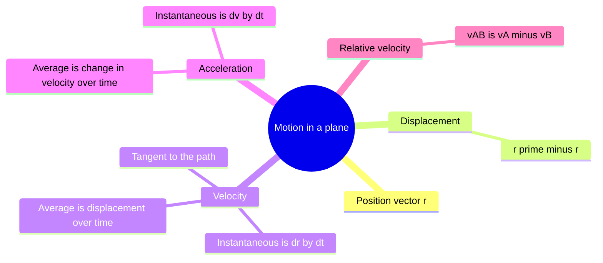

### 6.1 Position Vector and Displacement

- $\Delta\mathbf{r} = \mathbf{r}' - \mathbf{r} = \Delta x\,\hat{i} + \Delta y\,\hat{j}$
- $\Delta x = x' - x$
- $\Delta y = y' - y$

```tikz
\usetikzlibrary{arrows.meta}
\begin{tikzpicture}[>={Stealth[length=7pt,width=5pt]}, thick]
  \draw[->, thin, black] (-0.3,0) -- (5.5,0) node[right, font=\small] {$x$};
  \draw[->, thin, black] (0,-0.3) -- (0,3.8) node[above, font=\small] {$y$};
  \node[below left, font=\small] at (0,0) {O};
  \coordinate (P)  at (1.8,1.2);
  \coordinate (Pp) at (4.2,3.2);
  \draw[->, blue!80!black, line width=1.5pt] (0,0) -- (P)
    node[midway, below right, font=\small] {$\mathbf{r}$};
  \draw[->, blue!80!black, line width=1.5pt] (0,0) -- (Pp)
    node[midway, left, font=\small] {$\mathbf{r'}$};
  \draw[->, red!80!black, line width=1.8pt, dashed] (P) -- (Pp)
    node[midway, above, font=\small] {$\Delta\mathbf{r} = \mathbf{r'} - \mathbf{r}$};
  \fill (P)  circle (3pt) node[below right, font=\small] {P $(t)$};
  \fill (Pp) circle (3pt) node[above right, font=\small] {P$'$ $(t')$};
  \draw[dashed, gray, thin] (P)  -- (1.8,0) node[below, font=\tiny] {$x$};
  \draw[dashed, gray, thin] (Pp) -- (4.2,0) node[below, font=\tiny] {$x'$};
  \draw[dashed, gray, thin] (P)  -- (0,1.2) node[left,  font=\tiny] {$y$};
  \draw[dashed, gray, thin] (Pp) -- (0,3.2) node[left,  font=\tiny] {$y'$};
  \node[below, font=\itshape\small, text=gray] at (2.5,-0.5)
    {Displacement depends only on initial and final positions};
\end{tikzpicture}
```

### 6.2 Average Velocity in 2D

- $\bar{\mathbf{v}} = \dfrac{\Delta\mathbf{r}}{\Delta t} = \dfrac{\Delta x}{\Delta t}\hat{i} + \dfrac{\Delta y}{\Delta t}\hat{j}$
- Vector along $\Delta\mathbf{r}$
- SI unit m s⁻¹ · dimension $[LT^{-1}]$
- Average speed = path length ÷ $\Delta t$
- Average speed $\ge |\bar{\mathbf{v}}|$
- Equality only for straight-line motion without reversal
- Trap: a full lap gives $\bar{\mathbf{v}} = \mathbf{0}$ and a positive average speed (§6.2)

### 6.3 Instantaneous Velocity in 2D ⭐

- $\mathbf{v} = \lim\limits_{\Delta t \to 0}\dfrac{\Delta\mathbf{r}}{\Delta t} = \dfrac{d\mathbf{r}}{dt} = v_x\hat{i} + v_y\hat{j}$
- $v_x = dx/dt$ · $v_y = dy/dt$
- Speed $v = \sqrt{v_x^2 + v_y^2}$ — non-negative scalar
- Direction: $\tan\theta = v_y/v_x$
- Quadrant from the signs of $v_x$ and $v_y$
- Always tangent to the path
- Chord $\Delta\mathbf{r}$ becomes the tangent as $\Delta t \to 0$

### 6.4 Average Acceleration in 2D

- $\bar{\mathbf{a}} = \dfrac{\Delta\mathbf{v}}{\Delta t} = \dfrac{\Delta v_x}{\Delta t}\hat{i} + \dfrac{\Delta v_y}{\Delta t}\hat{j}$
- Vector along $\Delta\mathbf{v}$
- SI unit m s⁻² · dimension $[LT^{-2}]$

### 6.5 Instantaneous Acceleration in 2D ⭐

- $\mathbf{a} = \dfrac{d\mathbf{v}}{dt} = \dfrac{d^2\mathbf{r}}{dt^2} = a_x\hat{i} + a_y\hat{j}$
- $a_x = dv_x/dt$ · $a_y = dv_y/dt$
- Angle between $\mathbf{v}$ and $\mathbf{a}$: any value from $0^\circ$ to $180^\circ$
- Component of $\mathbf{a}$ along $\mathbf{v}$ changes the speed
- Component of $\mathbf{a}$ perpendicular to $\mathbf{v}$ changes only the direction

| Angle between $\mathbf{v}$ and $\mathbf{a}$ | Effect |
|---|---|
| $0^\circ$ | Speed increases; direction unchanged |
| $180^\circ$ | Speed decreases; direction unchanged while moving |
| $90^\circ$ | Direction changes; speed momentarily unchanged |
| Any other | Speed and direction both change |

- Uniform circular motion: $90^\circ$ at every instant

### 6.6 Worked Example — Variable Acceleration

- $\mathbf{r} = 3.0t\,\hat{i} + 2.0t^2\hat{j} + 5.0\hat{k}$
- $\mathbf{v} = 3.0\hat{i} + 4.0t\,\hat{j}$
- $\mathbf{a} = 4.0\,\hat{j}$
- At $t = 1.0$ s: $\mathbf{v} = 3.0\hat{i} + 4.0\hat{j}$
- Speed: 5.0 m s⁻¹
- Direction: $\theta \approx 53^\circ$ with $+x$
- Path: $y = \tfrac{2}{9}x^2$ in the plane $z = 5.0$ m

### 6.7 Relative Velocity in a Plane

- $\mathbf{r}_{AB} = \mathbf{r}_A - \mathbf{r}_B$
- **Relative velocity** — $\mathbf{v}_{AB} = \mathbf{v}_A - \mathbf{v}_B$
- $\mathbf{v}_A$ and $\mathbf{v}_B$ measured in the same frame
- $\mathbf{v}_{BA} = -\mathbf{v}_{AB}$
- Equal velocities: $\mathbf{v}_{AB} = \mathbf{0}$
- Worked: rain 35 m s⁻¹ vertically down
- Person walks 12 m s⁻¹ west
- $\mathbf{v}_{rp} = 12\hat{i} - 35\hat{j}$
- Magnitude 37 m s⁻¹
- $\tan\theta = v_p/v_r = 12/35$ → $\theta \approx 19^\circ$ from the vertical
- Umbrella top tilts toward the west, the direction of walking

---

## SECTION 7 — MOTION IN A PLANE WITH CONSTANT ACCELERATION ⭐⭐

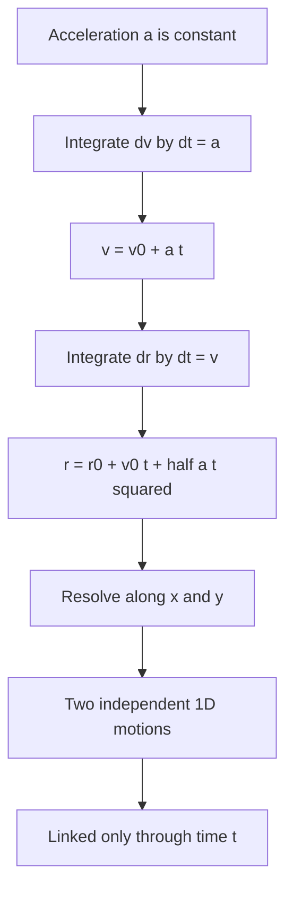

### 7.1 Equations of Motion (2D Vector Form)

- $\mathbf{v} = \mathbf{v}_0 + \mathbf{a}\,t$
- $\mathbf{r} = \mathbf{r}_0 + \mathbf{v}_0\,t + \tfrac{1}{2}\mathbf{a}\,t^2$
- $\mathbf{r}_0$, $\mathbf{v}_0$ = values at $t = 0$
- Obtained by integrating $d\mathbf{v}/dt = \mathbf{a}$ and $d\mathbf{r}/dt = \mathbf{v}$

### 7.2 Component Form ⭐⭐⭐

| Along $x$ | Along $y$ |
|---|---|
| $v_x = v_{0x} + a_x t$ | $v_y = v_{0y} + a_y t$ |
| $x = x_0 + v_{0x}t + \tfrac{1}{2}a_x t^2$ | $y = y_0 + v_{0y}t + \tfrac{1}{2}a_y t^2$ |

- $x$ equations contain only $x$ quantities
- $y$ equations contain only $y$ quantities
- Constant $\mathbf{a}$ → constant components
- Each axis obeys the Chapter 2 constant-acceleration equations
- Motion in a plane with constant acceleration = two independent 1D motions
- Axes linked only through time $t$
- Vector equations do not depend on the choice of axes
- Best axes: $\mathbf{a}$ along one axis, so the other component is zero

---

## SECTION 8 — PROJECTILE MOTION ⭐⭐⭐

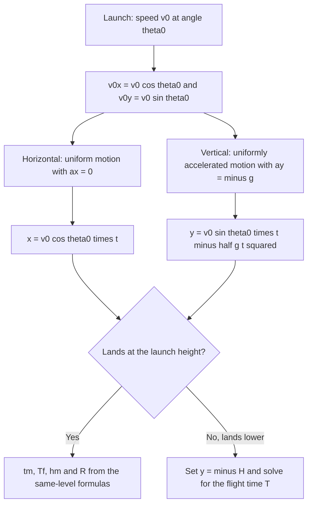

### 8.1 What is a Projectile?

- **Projectile** — object in flight after projection
- Only acceleration: that due to gravity
- **Projectile motion** — uniform horizontal motion + uniformly accelerated vertical motion
- Examples: thrown ball, bullet, stone, kicked football

### 8.2 Assumptions

- Air resistance neglected
- $g = 9.8$ m s⁻² · constant · downward
- $g$ constant for heights small compared with the Earth's radius
- Object treated as a point
- Galileo (1632): horizontal and vertical motions are independent

### 8.3 Setting Up the Problem ⭐⭐⭐

- Origin: launch point
- $x$-axis: horizontal, along the motion
- $y$-axis: vertical, upward
- Launch speed $v_0$ at angle $\theta_0$ above the horizontal
- $v_{0x} = v_0\cos\theta_0$
- $v_{0y} = v_0\sin\theta_0$
- $a_x = 0$
- $a_y = -g$

### 8.4 Equations of Motion for a Projectile ⭐⭐⭐

| Quantity | Along $x$ | Along $y$ |
|---|---|---|
| Velocity | $v_x = v_0\cos\theta_0$ (constant) | $v_y = v_0\sin\theta_0 - g\,t$ |
| Position | $x = (v_0\cos\theta_0)\,t$ | $y = (v_0\sin\theta_0)\,t - \tfrac{1}{2}g\,t^2$ |

- Trap: $v_x$ never changes during the flight (§8.4)
- Trap: at the highest point $v_y = 0$ but $v_x = v_0\cos\theta_0 \ne 0$ (§8.4)
- Speed at the highest point: $v_0\cos\theta_0$
- Acceleration at the highest point: $g$ downward
- $\mathbf{v} \perp \mathbf{a}$ only at the highest point

### 8.5 Equation of Trajectory (Path Equation) ⭐⭐

- $y = (\tan\theta_0)\,x - \dfrac{g}{2\,(v_0\cos\theta_0)^2}\,x^2$
- Form $y = ax - bx^2$ → parabola
- Obtained by eliminating $t$ from the position equations
- Trap: vertical launch $\theta_0 = 90^\circ$ gives $x = 0$ → straight line, not a parabola (§8.5)

```tikz
\usetikzlibrary{arrows.meta}
\begin{tikzpicture}[>={Stealth[length=7pt,width=5pt]}, thick, scale=1.15]
  \draw[->, thin, black] (-0.4,0) -- (5.5,0) node[right, font=\small] {$x$};
  \draw[->, thin, black] (0,-0.9) -- (0,3.0) node[above, font=\small] {$y$};
  \node[below left, font=\small] at (0,0) {O};
  \draw[blue!70!black, line width=2pt, smooth] plot coordinates {(0.00,0.0000) (0.25,0.4688) (0.50,0.8750) (0.75,1.2188) (1.00,1.5000) (1.25,1.7188) (1.50,1.8750) (1.75,1.9688) (2.00,2.0000) (2.25,1.9688) (2.50,1.8750) (2.75,1.7188) (3.00,1.5000) (3.25,1.2188) (3.50,0.8750) (3.75,0.4688) (4.00,0.0000)};
  \draw[->, red!80!black, line width=1.5pt] (0,0) -- (0.291,0.581)
    node[above left, font=\small] {$\mathbf{v_0}$};
  \draw[->, red!80!black, line width=1.5pt] (2,2) -- (2.65,2)
    node[right, font=\small] {$v_x = v_0\cos\theta_0$};
  \draw[->, red!80!black, line width=1.5pt] (4,0) -- (4.291,-0.581)
    node[right, font=\small] {$\mathbf{v_f}$};
  \draw[dashed, gray] (2,0) -- (2,2);
  \draw[dashed, gray] (-0.45,2) -- (2,2);
  \draw[->, gray, thin] (-0.450,1.000) -- (-0.450,0.000);
  \draw[->, gray, thin] (-0.450,1.000) -- (-0.450,2.000)
    node[pos=0, left, font=\small] {$h_m$};
  \draw[->, black, thin] (2.000,-0.650) -- (0.000,-0.650);
  \draw[->, black, thin] (2.000,-0.650) -- (4.000,-0.650)
    node[pos=0, below, font=\small] {$R$};
  \draw[thin] (0.4,0) arc (0:63.4:0.4);
  \node[font=\small] at (0.65,0.22) {$\theta_0$};
  \fill (0,0) circle (2.5pt);
  \fill (2,2) circle (2.5pt) node[above left, font=\small] {apex};
  \fill (4,0) circle (2.5pt);
  \node[below, font=\itshape\small, text=gray] at (2,-1.0)
    {Parabolic path: horizontal velocity is constant; vertical velocity changes};
\end{tikzpicture}
```

### 8.6 Time to Reach Maximum Height ⭐

- At the highest point $v_y = 0$
- $t_m = \dfrac{v_0\sin\theta_0}{g}$

### 8.7 Time of Flight ⭐⭐

- Landing at the launch height: $y = 0$
- $T_f = \dfrac{2\,v_0\sin\theta_0}{g} = 2\,t_m$
- Rise time = fall time
- Landing: $v_y = -v_0\sin\theta_0$
- Landing speed $v_0$
- Landing angle $\theta_0$ below the horizontal

### 8.8 Maximum Height ⭐⭐

- $h_m = \dfrac{(v_0\sin\theta_0)^2}{2g}$
- Depends only on the vertical component of the launch velocity

### 8.9 Horizontal Range ⭐⭐⭐

- $R = (v_0\cos\theta_0)\,T_f = \dfrac{v_0^2\sin 2\theta_0}{g}$
- Maximum at $\theta_0 = 45^\circ$
- $R_{\max} = v_0^2/g$
- §8.6 to §8.9 hold only for landing at the launch height

### 8.10 Key Results on Range ⭐⭐

- $\theta_0$ and $90^\circ - \theta_0$ → equal range
- Reason: $\sin 2(90^\circ - \theta_0) = \sin 2\theta_0$
- $45^\circ - \alpha$ and $45^\circ + \alpha$ → equal range
- $45^\circ \pm \alpha$ is the same pair as $\theta_0$ and $90^\circ - \theta_0$
- Range below $R_{\max}$: two launch angles
- One angle flatter · one steeper
- Trap: equal range does not give equal height or time (§8.10)
- Height ratio: $h_m(\theta_0)/h_m(90^\circ - \theta_0) = \tan^2\theta_0$

| Quantity | Proportional to | Largest at |
|---|---|---|
| Maximum height $h_m$ | $\sin^2\theta_0$ | $90^\circ$ |
| Time of flight $T_f$ | $\sin\theta_0$ | $90^\circ$ |
| Range $R$ | $\sin 2\theta_0$ | $45^\circ$ |

### 8.11 Summary Table — Projectile Formulae ⭐⭐⭐

| Quantity | Formula (same-level landing) |
|---|---|
| Velocity components | $v_x = v_0\cos\theta_0$, $\ v_y = v_0\sin\theta_0 - g\,t$ |
| Position | $x = (v_0\cos\theta_0)\,t$, $\ y = (v_0\sin\theta_0)\,t - \tfrac{1}{2}g\,t^2$ |
| Trajectory | $y = (\tan\theta_0)\,x - \dfrac{g\,x^2}{2(v_0\cos\theta_0)^2}$ |
| Time to maximum height | $t_m = v_0\sin\theta_0/g$ |
| Time of flight | $T_f = 2v_0\sin\theta_0/g$ |
| Maximum height | $h_m = (v_0\sin\theta_0)^2/2g$ |
| Range | $R = v_0^2\sin 2\theta_0/g$ |
| Maximum range | $R_{\max} = v_0^2/g$ at $\theta_0 = 45^\circ$ |
| Speed at the highest point | $v_0\cos\theta_0$ |
| Speed at landing | $v_0$ |

### 8.12 Launch from a Height — General Case

- Origin at the launch point
- Ground at $y = -H$ with $H \ge 0$
- Landing condition: $y = -H$
- $\tfrac{1}{2}g\,T^2 - (v_0\sin\theta_0)\,T - H = 0$
- $T = \dfrac{v_0\sin\theta_0 + \sqrt{v_0^2\sin^2\theta_0 + 2gH}}{g}$
- $R = (v_0\cos\theta_0)\,T$
- $v_{\text{impact}} = \sqrt{v_0^2 + 2gH}$
- Impact speed independent of $\theta_0$

| Case | Result |
|---|---|
| $H = 0$ | $T = 2v_0\sin\theta_0/g$ · $R = v_0^2\sin 2\theta_0/g$ |
| $\theta_0 = 0$, launch speed $u$ | $T = \sqrt{2H/g}$ · $R = u\sqrt{2H/g}$ |
| $\theta_0 = 0$, path | $y = -gx^2/2u^2$ |
| $\theta_0 = 0$, impact angle | $\tan\varphi = gT/u$ below the horizontal |
| $\theta_0 < 0$ | Same formulas with $\sin\theta_0$ negative |

- Trap: $\theta_0 = 0$ in $T_f = 2v_0\sin\theta_0/g$ gives $T_f = 0$ (§8.12)
- Trap: for $H > 0$ the angle of greatest range is below $45^\circ$ (§8.12)

```tikz
\usetikzlibrary{arrows.meta}
\begin{tikzpicture}[>={Stealth[length=7pt,width=5pt]}, thick, scale=1.1]
  \draw[line width=1pt] (-1.4,-1.128) -- (5.2,-1.128);
  \fill[gray!25] (-0.7,-1.128) rectangle (0,0);
  \draw (-0.7,-1.128) rectangle (0,0);
  \draw[dashed, gray] (0,0) -- (5.0,0);
  \draw[blue!70!black, line width=2pt, smooth] plot coordinates {(0.000,0.000) (0.346,0.175) (0.693,0.302) (1.039,0.379) (1.386,0.408) (1.732,0.387) (2.078,0.318) (2.425,0.199) (2.771,0.032) (3.118,-0.185) (3.464,-0.450) (3.811,-0.765) (4.157,-1.128)};
  \draw[->, red!80!black, line width=1.5pt] (0,0) -- (0.8,0.462)
    node[above, font=\small] {$\mathbf{v_0}$};
  \draw[thin] (0.5,0) arc (0:30:0.5);
  \node[font=\small] at (0.72,0.1) {$\theta_0$};
  \draw[->, black, thin] (-1.000,-0.564) -- (-1.000,-1.128);
  \draw[->, black, thin] (-1.000,-0.564) -- (-1.000,0.000)
    node[pos=0, left, font=\small] {$H$};
  \draw[->, black, thin] (2.079,-1.528) -- (0.000,-1.528);
  \draw[->, black, thin] (2.079,-1.528) -- (4.157,-1.528)
    node[pos=0, below, font=\small] {$R$};
  \draw[->, red!80!black, line width=1.5pt] (3.557,-0.458) -- (4.157,-1.128)
    node[midway, right, font=\small] {$\mathbf{v}$};
  \fill (0,0) circle (2.5pt); \fill (4.157,-1.128) circle (2.5pt);
  \node[below, font=\itshape\small, text=gray] at (2.2,-2.128)
    {Launch from height H: the path ends where y = -H, below the launch level};
\end{tikzpicture}
```

### 8.13 Worked Examples — Projectile Problems

- Cricket ball, 28 m s⁻¹ at $30^\circ$, same level
- $h_m = 10$ m
- $T_f = 2.9$ s
- $R = 69$ m
- Stone thrown horizontally at 15 m s⁻¹ from a 490 m cliff
- $T = 10$ s
- $R = 150$ m
- $v \approx 99$ m s⁻¹ at about $81^\circ$ below the horizontal
- Ball at 20 m s⁻¹, $30^\circ$, from $H = 14.1$ m
- $T = 3.0$ s
- $R \approx 52$ m
- $v \approx 26$ m s⁻¹

---

## SECTION 9 — UNIFORM CIRCULAR MOTION ⭐⭐⭐

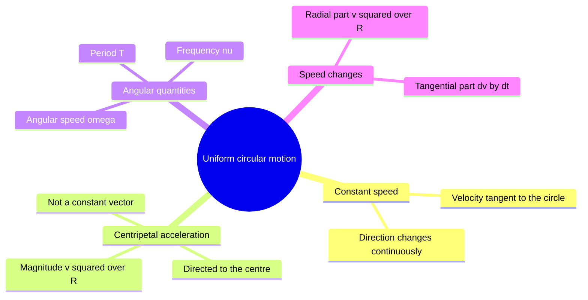

### 9.1 Definition

- **Uniform circular motion (UCM)** — motion along a circle at constant speed
- Speed constant
- Velocity not constant
- Velocity always tangent to the circle
- Direction of velocity changes continuously
- The particle accelerates although its speed is steady

### 9.2 Centripetal Acceleration ⭐⭐⭐

- Position triangle: $\mathbf{r}$, $\mathbf{r}'$, $\Delta\mathbf{r}$ — isosceles, apex angle $\Delta\theta$
- Velocity triangle: $\mathbf{v}$, $\mathbf{v}'$, $\Delta\mathbf{v}$ — isosceles, apex angle $\Delta\theta$
- The two triangles are similar
- $|\Delta\mathbf{v}|/v = |\Delta\mathbf{r}|/R$
- $|\Delta\mathbf{r}|/\Delta t \to v$ as $\Delta t \to 0$
- **Centripetal acceleration** — $a_c = \dfrac{v^2}{R} = \omega^2 R$
- Direction: toward the centre
- Base angles of the velocity triangle → $90^\circ$ as $\Delta\theta \to 0$
- $\Delta\mathbf{v} \perp \mathbf{v}$ → $\mathbf{a}$ lies along the radius
- SI unit m s⁻² · dimension $[LT^{-2}]$
- "Centripetal" = centre-seeking
- Trap: $\mathbf{a_c}$ is not a constant vector (§9.2)
- $|\mathbf{a_c}|$ is constant
- Trap: constant-acceleration equations do not apply to circular motion (§9.2)
- Trap: $\mathbf{v} \perp$ radius holds for any circular motion (§9.2)
- Trap: $\mathbf{v} \perp \mathbf{a}$ holds only when the speed is constant (§9.2)

```tikz
\usetikzlibrary{arrows.meta}
\begin{tikzpicture}[>={Stealth[length=7pt,width=5pt]}, thick, scale=1.1]
  \draw[black, line width=1.2pt] (0,0) circle (2cm);
  \fill (0,0) circle (2.5pt);
  \node[below left, font=\small] at (0,0) {O};
  \coordinate (P) at (1.414,1.414);
  \fill (P) circle (3pt);
  \node[right, font=\small] at (1.56,1.56) {P};
  \draw[dashed, gray] (0,0) -- (P)
    node[midway, below right, font=\small] {$R$};
  \draw[->, blue!80!black, line width=1.8pt]
    (P) -- (0.495,2.333)
    node[left, font=\small] {$\mathbf{v}$};
  \draw[->, red!80!black, line width=1.8pt]
    (P) -- (0.778,0.778)
    node[below, font=\small] {$\mathbf{a_c}$};
  \draw[thin, gray]
    (1.287,1.541) -- (1.159,1.414) -- (1.287,1.287);
  \node[right, font=\small, blue!70!black] at (0.5,2.6)
    {$\mathbf{v} \perp \mathbf{a_c}$ always};
  \node[left, font=\small, red!70!black] at (-2.1,0.9)
    {$a_c = \dfrac{v^2}{R} = \omega^2 R$};
  \draw[->, orange!80!black, thin] (0.5,0) arc (0:70:0.5)
    node[above right, font=\small, orange!80!black] {$\omega$};
  \node[below, font=\itshape\small, text=gray] at (0,-2.6)
    {In UCM: speed is constant; ac is toward centre; v perp ac};
\end{tikzpicture}
```

### 9.3 Angular Speed ⭐⭐

- **Angular displacement** $\Delta\theta = \Delta s/R$
- SI unit radian
- Dimensionless
- **Angular speed** $\omega = \Delta\theta/\Delta t$
- Constant in UCM
- SI unit rad s⁻¹ · dimension $[T^{-1}]$
- Treated as a scalar here
- $v = R\omega$
- $a_c = v^2/R = \omega^2 R$

### 9.4 Time Period and Frequency ⭐

- **Time period** $T$ — time for one revolution
- SI unit s · dimension $[T]$
- **Frequency** $\nu = 1/T$ — revolutions per unit time
- SI unit Hz = s⁻¹ · dimension $[T^{-1}]$
- $\omega = 2\pi/T = 2\pi\nu$
- $v = 2\pi R/T = 2\pi R\,\nu$
- $a_c = 4\pi^2 R/T^2 = 4\pi^2\nu^2 R$
- Trap: $\omega$ and $\nu$ share the dimension $[T^{-1}]$ (§12)
- They differ by the factor $2\pi$

### 9.5 Summary Table — Circular Motion Quantities

| Quantity | Symbol | Formula | SI unit | Dimension |
|---|---|---|---|---|
| Angular displacement | $\Delta\theta$ | $\Delta s/R$ | rad | dimensionless |
| Angular speed | $\omega$ | $\Delta\theta/\Delta t = 2\pi/T = 2\pi\nu$ | rad s⁻¹ | $[T^{-1}]$ |
| Time period | $T$ | $2\pi/\omega = 1/\nu$ | s | $[T]$ |
| Frequency | $\nu$ | $1/T = \omega/2\pi$ | Hz | $[T^{-1}]$ |
| Linear speed | $v$ | $\omega R = 2\pi R/T$ | m s⁻¹ | $[LT^{-1}]$ |
| Centripetal acceleration | $a_c$ | $v^2/R = \omega^2 R = 4\pi^2 R/T^2$ | m s⁻² | $[LT^{-2}]$ |

| Quantity | Behaviour in UCM |
|---|---|
| Speed $v$, angular speed $\omega$ | Constant |
| Velocity $\mathbf{v}$ | Changes (direction) |
| Magnitude $\lvert\mathbf{a_c}\rvert$ | Constant |
| Vector $\mathbf{a_c}$ | Changes (direction) |

### 9.6 Worked Example — Insect in a Groove

- Groove radius 12 cm
- 7 revolutions in 100 s
- $\nu = 0.070$ Hz
- $\omega = 0.44$ rad s⁻¹
- $v = 5.3$ cm s⁻¹
- $a_c = 2.3$ cm s⁻² toward the centre

### 9.7 Non-Uniform Circular Motion

- Speed changes → acceleration has two perpendicular parts
- Radial part: $v^2/R$ toward the centre
- Tangential part: $dv/dt$ along the velocity
- Tangential part changes the speed
- Radial part turns the velocity
- Trap: the radial part always points inward (§9.7)
- Total acceleration points at the centre only in UCM

---

## SECTION 10 — SCALAR (DOT) PRODUCT ⭐⭐

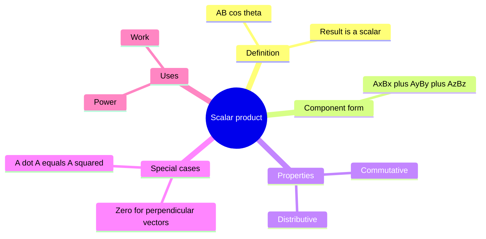

### 10.1 Definition ⭐⭐

- **Scalar (dot) product** $\mathbf{A}\cdot\mathbf{B} = AB\cos\theta$ — a scalar
- $\theta$ = angle between the vectors with tails together
- $0^\circ \le \theta \le 180^\circ$
- $= A\,(B\cos\theta)$ — $A$ times the projection of $\mathbf{B}$ on $\mathbf{A}$
- Only the parallel parts contribute
- Perpendicular part of a force does no work

| Quantity | Dot-product form | Unit |
|---|---|---|
| Work by a constant force | $W = \mathbf{F}\cdot\mathbf{s}$ | joule (J) |
| Power | $P = \mathbf{F}\cdot\mathbf{v}$ | watt (W) |

### 10.2 Component Form ⭐⭐⭐

- $\hat{i}\cdot\hat{i} = \hat{j}\cdot\hat{j} = \hat{k}\cdot\hat{k} = 1$
- $\hat{i}\cdot\hat{j} = \hat{j}\cdot\hat{k} = \hat{k}\cdot\hat{i} = 0$
- $\mathbf{A}\cdot\mathbf{B} = A_xB_x + A_yB_y + A_zB_z$
- $\cos\theta = \dfrac{\mathbf{A}\cdot\mathbf{B}}{AB}$
- $\mathbf{A}\cdot\mathbf{A} = A^2$

### 10.3 Properties ⭐⭐

- Commutative: $\mathbf{A}\cdot\mathbf{B} = \mathbf{B}\cdot\mathbf{A}$
- Distributive: $\mathbf{A}\cdot(\mathbf{B} + \mathbf{C}) = \mathbf{A}\cdot\mathbf{B} + \mathbf{A}\cdot\mathbf{C}$
- Scalar multiples: $(\lambda\mathbf{A})\cdot\mathbf{B} = \lambda(\mathbf{A}\cdot\mathbf{B})$

| Angle $\theta$ | $\mathbf{A}\cdot\mathbf{B}$ |
|---|---|
| $0^\circ \le \theta < 90^\circ$ | Positive; $+AB$ at $0^\circ$ |
| $\theta = 90^\circ$ | Zero |
| $90^\circ < \theta \le 180^\circ$ | Negative; $-AB$ at $180^\circ$ |

- Trap: $\mathbf{A}\cdot\mathbf{B} = 0$ means perpendicular or one vector is null (§10.3)
- Trap: a negative dot product means $\theta > 90^\circ$ (§10.3)
- Magnitudes $A$ and $B$ stay positive

### 10.4 Bridge to the Law of Cosines ⭐⭐

- $|\mathbf{A} + \mathbf{B}|^2 = A^2 + 2\,\mathbf{A}\cdot\mathbf{B} + B^2$
- $= A^2 + B^2 + 2AB\cos\theta$ → law of cosines (§3.8)
- $|\mathbf{A} - \mathbf{B}|^2 = A^2 + B^2 - 2\,\mathbf{A}\cdot\mathbf{B}$
- $|\mathbf{A} + \mathbf{B}| = |\mathbf{A} - \mathbf{B}|$ exactly when $\mathbf{A}\cdot\mathbf{B} = 0$

### 10.5 Worked Examples — Angle, Perpendicularity and Power

- $\hat{i} + 2\hat{j} - \hat{k}$ and $-\hat{i} + \hat{j} - 2\hat{k}$ → $\mathbf{A}\cdot\mathbf{B} = 3$ · $A = B = \sqrt{6}$ → $\theta = 60^\circ$
- $\hat{i} + 2\hat{j} + 3\hat{k}$ and $2\hat{i} - \hat{j}$ → $\mathbf{A}\cdot\mathbf{B} = 0$ → perpendicular
- $5\hat{i} + 7\hat{j} - 3\hat{k}$ ⟂ $2\hat{i} + 2\hat{j} - \alpha\hat{k}$ → $10 + 14 + 3\alpha = 0$ → $\alpha = -8$
- $\mathbf{F} = 7\hat{i} + 6\hat{j}$ N with $\mathbf{v} = 3\hat{i} + 4\hat{j}$ m s⁻¹
- $P = \mathbf{F}\cdot\mathbf{v} = 45$ W

---

## SECTION 11 — VECTOR (CROSS) PRODUCT ⭐⭐

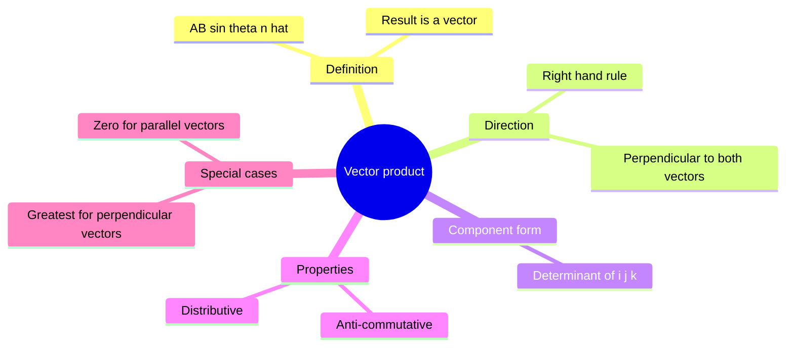

### 11.1 Definition ⭐⭐

- **Vector (cross) product** $\mathbf{A}\times\mathbf{B} = AB\sin\theta\;\hat{n}$ — a vector
- $\theta$ = angle between the vectors
- $0^\circ \le \theta \le 180^\circ$
- $\hat{n}$ = unit vector perpendicular to the plane of $\mathbf{A}$ and $\mathbf{B}$
- **Right-hand rule** — curl the fingers from $\mathbf{A}$ toward $\mathbf{B}$ through the smaller angle
- Thumb points along $\hat{n}$
- $|\mathbf{A}\times\mathbf{B}| = AB\sin\theta$ = area of the parallelogram on $\mathbf{A}$ and $\mathbf{B}$
- Zero for parallel or antiparallel vectors
- Greatest ($AB$) for perpendicular vectors

```tikz
\usetikzlibrary{arrows.meta}
\begin{tikzpicture}[>={Stealth[length=7pt,width=5pt]}, thick, scale=1.0]
  \coordinate (O) at (0,0);
  \draw[->, blue!80!black, line width=1.8pt] (O) -- (3.2,0.6) node[right, font=\small] {$\mathbf{A}$};
  \draw[->, green!60!black, line width=1.8pt] (O) -- (1.6,2.4) node[above, font=\small] {$\mathbf{B}$};
  \draw[thin, gray] (0.7,0.13) arc (10:57:0.7);
  \node[font=\small] at (1.05,0.55) {$\theta$};
  \draw[orange!80!black, line width=1.2pt] (5.4,1.2) circle (0.32);
  \fill[orange!80!black] (5.4,1.2) circle (0.05);
  \node[right, font=\small, orange!80!black] at (5.8,1.2) {$\mathbf{A}\times\mathbf{B}$ (out of page)};
  \node[below, font=\itshape\small, text=gray] at (2.6,-0.7)
    {Right-hand rule: curl fingers A to B, thumb points along A x B};
\end{tikzpicture}
```

### 11.2 Component Form and Basis Vector Rules ⭐⭐

- $\hat{i}\times\hat{i} = \hat{j}\times\hat{j} = \hat{k}\times\hat{k} = \mathbf{0}$
- $\hat{i}\times\hat{j} = \hat{k}$
- $\hat{j}\times\hat{k} = \hat{i}$
- $\hat{k}\times\hat{i} = \hat{j}$
- Cycle $\hat{i} \to \hat{j} \to \hat{k} \to \hat{i}$: plus sign
- Opposite order: minus sign
- Example: $\hat{j}\times\hat{i} = -\hat{k}$
- $\mathbf{A}\times\mathbf{B} = (A_yB_z - A_zB_y)\hat{i} + (A_zB_x - A_xB_z)\hat{j} + (A_xB_y - A_yB_x)\hat{k}$
- Determinant form: rows $(\hat{i}, \hat{j}, \hat{k})$, $(A_x, A_y, A_z)$, $(B_x, B_y, B_z)$

### 11.3 Properties ⭐⭐

- Anti-commutative: $\mathbf{A}\times\mathbf{B} = -(\mathbf{B}\times\mathbf{A})$
- Distributive: $\mathbf{A}\times(\mathbf{B} + \mathbf{C}) = \mathbf{A}\times\mathbf{B} + \mathbf{A}\times\mathbf{C}$
- Scalar multiples: $(\lambda\mathbf{A})\times\mathbf{B} = \lambda(\mathbf{A}\times\mathbf{B})$
- Self product: $\mathbf{A}\times\mathbf{A} = \mathbf{0}$
- $\mathbf{A}\times\mathbf{B}$ is perpendicular to both $\mathbf{A}$ and $\mathbf{B}$
- Trap: $\mathbf{A}\times\mathbf{B} \ne \mathbf{B}\times\mathbf{A}$ (§11.3)
- Reversing the order flips the sign
- Torque and angular momentum are cross products (rotational motion)

| | Dot product | Cross product |
|---|---|---|
| Result | Scalar | Vector |
| Magnitude | $AB\cos\theta$ | $AB\sin\theta$ |
| Zero when | Perpendicular | Parallel or antiparallel |
| Greatest when | Parallel | Perpendicular |
| Order | Commutative | Anti-commutative |
| Unit vectors | $\hat{i}\cdot\hat{i} = 1$, $\ \hat{i}\cdot\hat{j} = 0$ | $\hat{i}\times\hat{i} = \mathbf{0}$, $\ \hat{i}\times\hat{j} = \hat{k}$ |

### 11.4 Worked Example — Cross Product in Components

- $\mathbf{A} = \hat{i} + 2\hat{j} + 3\hat{k}$
- $\mathbf{B} = 2\hat{i} - \hat{j}$
- $\mathbf{A}\times\mathbf{B} = 3\hat{i} + 6\hat{j} - 5\hat{k}$
- $|\mathbf{A}\times\mathbf{B}| = \sqrt{70}$
- Equals $AB$ at $\theta = 90^\circ$
- $(\mathbf{A}\times\mathbf{B})\cdot\mathbf{A} = 0$ → perpendicular to $\mathbf{A}$

---

## SECTION 12 — DIMENSIONAL FORMULAE ⭐

| Quantity | Defining relation | SI unit | Dimensional formula |
|---|---|---|---|
| Position, displacement | — | m | $[L]$ |
| Velocity | $\Delta\mathbf{r}/\Delta t$ | m s⁻¹ | $[LT^{-1}]$ |
| Acceleration | $\Delta\mathbf{v}/\Delta t$ | m s⁻² | $[LT^{-2}]$ |
| Angular displacement | $\Delta s/R$ | rad | $[M^0L^0T^0]$, dimensionless |
| Angular speed | $\Delta\theta/\Delta t$ | rad s⁻¹ | $[T^{-1}]$ |
| Time period | — | s | $[T]$ |
| Frequency | $1/T$ | Hz | $[T^{-1}]$ |
| Centripetal acceleration | $v^2/R$ | m s⁻² | $[LT^{-2}]$ |
| Work | $\mathbf{F}\cdot\mathbf{s}$ | J | $[ML^2T^{-2}]$ |
| Power | $\mathbf{F}\cdot\mathbf{v}$ | W | $[ML^2T^{-3}]$ |

- Unit vectors: dimensionless · no unit
- A vector and its magnitude: same dimension
- Trap: $\omega$ and $\nu$ share the dimension $[T^{-1}]$ (§12)
- They differ by the factor $2\pi$

---

## SECTION 13 — PROBLEM-SOLVING STRATEGY ⭐⭐⭐

### 13.1 Choosing a Vector-Addition Method

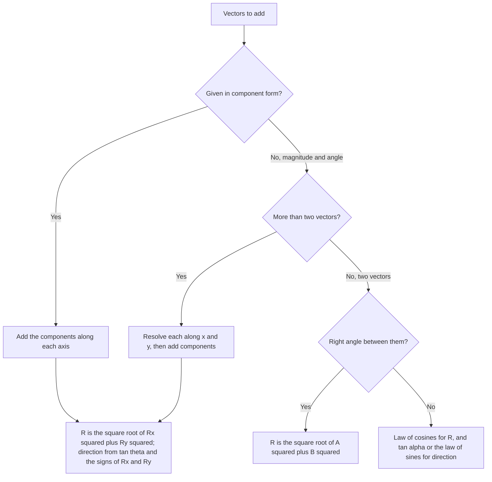

- Component route always works
- Shortcuts for two vectors need the angle between them

### 13.2 Projectile Problem Triage

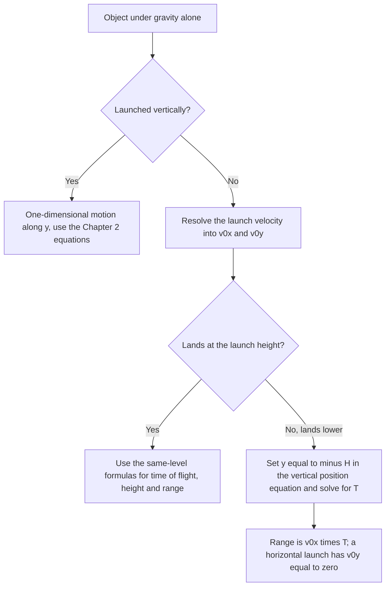

- Step 1: choose axes with $\mathbf{a}$ along one axis
- With $y$ upward, $\mathbf{g}$ lies along $-y$
- Step 2: resolve the initial velocity into $v_{0x}$ and $v_{0y}$
- Step 3: write the $x$ and $y$ equations separately (§7.2)
- Step 4: find $t$ from a condition on one axis, such as $y = -H$ or $v_y = 0$
- Step 4: substitute $t$ into the other axis
- Step 5: check signs · units · a limiting case
- Limiting case: $H = 0$ recovers the same-level formulas

### 13.3 Circular Motion Sanity Check

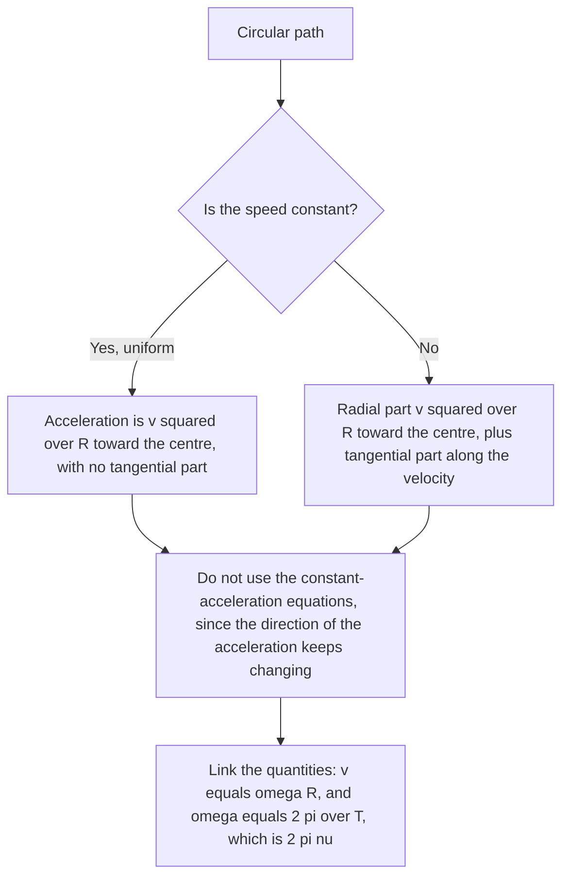

---

## RAPID REFERENCE

| Fact | Value |
|---|---|
| Acceleration due to gravity (used here) | $g = 9.8$ m s⁻² downward |
| Magnitude of a vector (3D) | $A = \sqrt{A_x^2 + A_y^2 + A_z^2}$ |
| Components in a plane | $A_x = A\cos\theta$, $\ A_y = A\sin\theta$ |
| Direction from components | $\tan\theta = A_y/A_x$, quadrant from the signs |
| Unit vector | $\hat{n} = \mathbf{A}/\lvert\mathbf{A}\rvert$ |
| Direction cosines | $\cos^2\alpha + \cos^2\beta + \cos^2\gamma = 1$ |
| Displacement in components | $\Delta\mathbf{r} = (x'-x)\hat{i} + (y'-y)\hat{j} + (z'-z)\hat{k}$ |
| Resultant magnitude | $R = \sqrt{A^2 + B^2 + 2AB\cos\theta}$ |
| Resultant direction (from $\mathbf{A}$) | $\tan\alpha = B\sin\theta/(A + B\cos\theta)$ |
| Law of sines | $R/\sin\theta = A/\sin\beta = B/\sin\alpha$ |
| Bounds on $R$ | $\lvert A-B\rvert \le R \le A+B$ |
| Equal magnitudes | $R = 2A\cos(\theta/2)$ |
| Difference magnitude | $\lvert\mathbf{A}-\mathbf{B}\rvert = \sqrt{A^2 + B^2 - 2AB\cos\theta}$ |
| Component addition | $R_x = A_x + B_x + \cdots$, $\ R_y = A_y + B_y + \cdots$ |
| Average velocity | $\bar{\mathbf{v}} = \Delta\mathbf{r}/\Delta t$ |
| Instantaneous velocity | $\mathbf{v} = d\mathbf{r}/dt$ |
| Average acceleration | $\bar{\mathbf{a}} = \Delta\mathbf{v}/\Delta t$ |
| Instantaneous acceleration | $\mathbf{a} = d\mathbf{v}/dt$ |
| Relative velocity | $\mathbf{v}_{AB} = \mathbf{v}_A - \mathbf{v}_B$, $\ \mathbf{v}_{BA} = -\mathbf{v}_{AB}$ |
| Constant acceleration | $\mathbf{v} = \mathbf{v}_0 + \mathbf{a}t$, $\ \mathbf{r} = \mathbf{r}_0 + \mathbf{v}_0 t + \tfrac{1}{2}\mathbf{a}t^2$ |
| Projectile launch components | $v_{0x} = v_0\cos\theta_0$, $\ v_{0y} = v_0\sin\theta_0$ |
| Projectile velocity | $v_x = v_0\cos\theta_0$, $\ v_y = v_0\sin\theta_0 - gt$ |
| Projectile position | $x = (v_0\cos\theta_0)t$, $\ y = (v_0\sin\theta_0)t - \tfrac{1}{2}gt^2$ |
| Trajectory | $y = (\tan\theta_0)x - gx^2/[2(v_0\cos\theta_0)^2]$ |
| Time to maximum height | $t_m = v_0\sin\theta_0/g$ |
| Time of flight (same level) | $T_f = 2v_0\sin\theta_0/g$ |
| Maximum height | $h_m = (v_0\sin\theta_0)^2/2g$ |
| Range (same level) | $R = v_0^2\sin 2\theta_0/g$ |
| Maximum range | $R_{\max} = v_0^2/g$ at $\theta_0 = 45^\circ$ |
| Equal ranges | $\theta_0$ and $90^\circ - \theta_0$ |
| Height ratio, complementary angles | $\tan^2\theta_0$ |
| Speed at the highest point | $v_0\cos\theta_0$ |
| Landing speed (same level) | $v_0$ |
| Launch from height $H$: flight time | $T = [v_0\sin\theta_0 + \sqrt{v_0^2\sin^2\theta_0 + 2gH}]/g$ |
| Launch from height $H$: range | $R = (v_0\cos\theta_0)T$ |
| Launch from height $H$: impact speed | $\sqrt{v_0^2 + 2gH}$ |
| Horizontal launch | $T = \sqrt{2H/g}$, $\ \tan\varphi = gT/u$ |
| Centripetal acceleration | $a_c = v^2/R = \omega^2R = 4\pi^2R/T^2$, toward the centre |
| Linear and angular speed | $v = R\omega$ |
| Angular speed | $\omega = 2\pi/T = 2\pi\nu$ |
| Frequency and period | $\nu = 1/T$ |
| Angular displacement | $\Delta\theta = \Delta s/R$ |
| Speed in circular motion | $v = 2\pi R/T = 2\pi R\nu$ |
| UCM: $\mathbf{v}$ and $\mathbf{a}$ | Perpendicular at every instant |
| Non-uniform circular motion | Radial $v^2/R$ inward, tangential $dv/dt$ |
| Dot product | $\mathbf{A}\cdot\mathbf{B} = AB\cos\theta = A_xB_x + A_yB_y + A_zB_z$ |
| Dot product identities | $\mathbf{A}\cdot\mathbf{A} = A^2$, $\ \cos\theta = \mathbf{A}\cdot\mathbf{B}/AB$ |
| Work and power | $W = \mathbf{F}\cdot\mathbf{s}$, $\ P = \mathbf{F}\cdot\mathbf{v}$ |
| Perpendicular vectors | $\mathbf{A}\cdot\mathbf{B} = 0$; also $\lvert\mathbf{A}+\mathbf{B}\rvert = \lvert\mathbf{A}-\mathbf{B}\rvert$ |
| Cross product | $\mathbf{A}\times\mathbf{B} = AB\sin\theta\,\hat{n}$, right-hand rule |
| Cross product components | $(A_yB_z - A_zB_y)\hat{i} + (A_zB_x - A_xB_z)\hat{j} + (A_xB_y - A_yB_x)\hat{k}$ |
| Unit vector products | $\hat{i}\times\hat{j} = \hat{k}$, $\ \hat{j}\times\hat{k} = \hat{i}$, $\ \hat{k}\times\hat{i} = \hat{j}$ |
| Cross product order | $\mathbf{A}\times\mathbf{B} = -(\mathbf{B}\times\mathbf{A})$ |
| Position, displacement | $[L]$, m |
| Velocity | $[LT^{-1}]$, m s⁻¹ |
| Acceleration | $[LT^{-2}]$, m s⁻² |
| Angular speed, frequency | $[T^{-1}]$, rad s⁻¹ and Hz |
| Time period | $[T]$, s |
| Angular displacement | Dimensionless, rad |
| Work | $[ML^2T^{-2}]$, J |
| Power | $[ML^2T^{-3}]$, W |