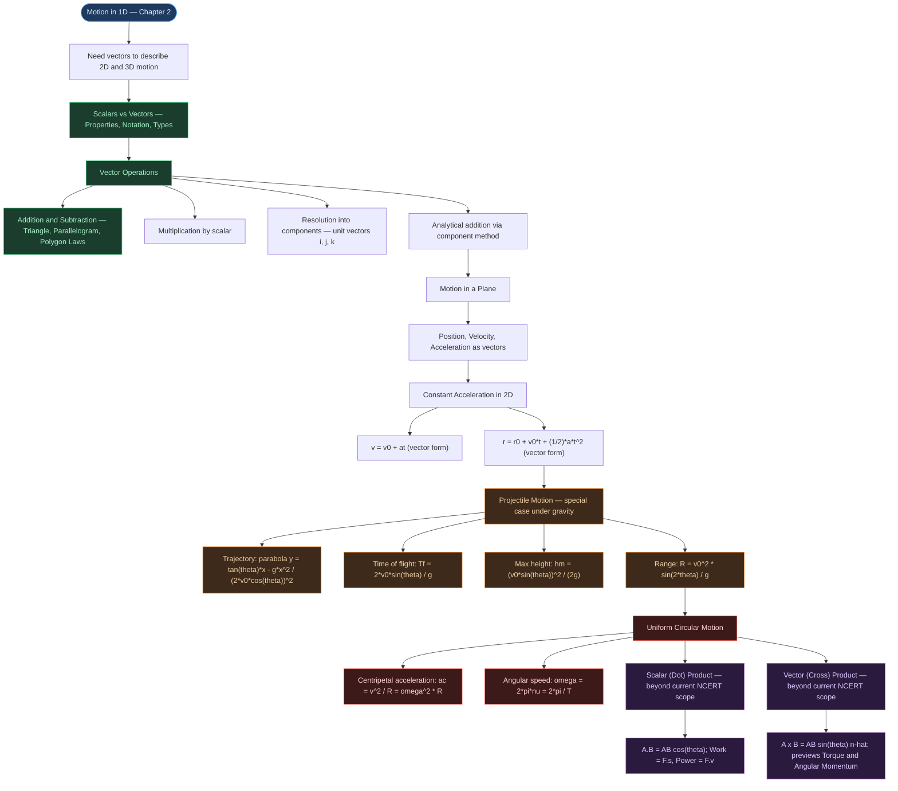
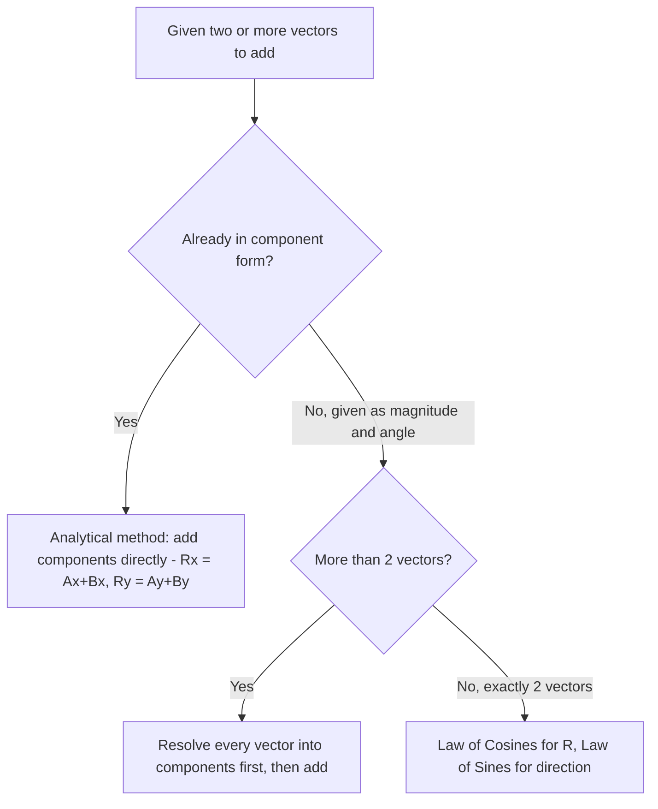
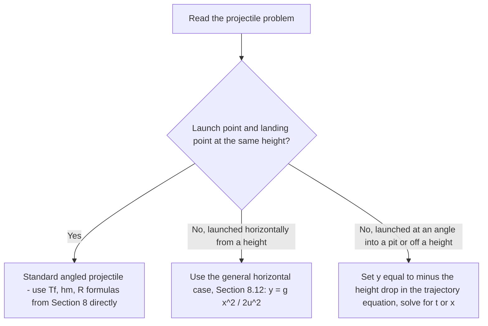
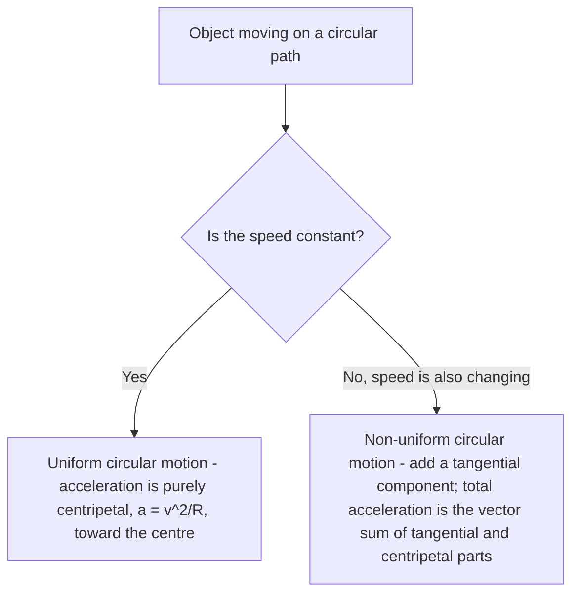

# ⚡ CHAPTER 3 — MOTION IN A PLANE
> **Complete Study Notes** | Board · NEET · JEE Layered

---

## 🗺️ CONCEPT ROADMAP



---

## SECTION 1 — SCALARS AND VECTORS

### 1.1 Scalar Quantities

> [!info] Definition
> A **scalar** is a quantity that has **only magnitude**, specified by a single number and its unit. Scalars obey the rules of **ordinary algebra**.

**Examples from Chapter 3:** Distance, Speed, Mass, Temperature, Time, Energy

---

### 1.2 Vector Quantities ⭐

> [!important] Definition
> A **vector** is a quantity that has **both magnitude and direction** and obeys the **triangle law** (equivalently, the **parallelogram law**) of addition.

**Examples from Chapter 3:** Displacement, Velocity, Acceleration, Force

---

### 1.3 Vector Notation

- In print: **bold face** — **A**, **v**, **r**
- In handwriting: arrow over letter — $\vec{A}$, $\vec{v}$, $\vec{r}$
- Magnitude of vector **A**: written as $|\mathbf{A}| = A$ (lightface italic)

---

### 1.4 Position and Displacement Vectors

- **Position vector r**: The vector from the origin O to a point P. Written as $\overrightarrow{OP} = \mathbf{r}$.

  *Quick example:* a point at $(4, 4)$ has position vector $\overrightarrow{OP} = 4\hat{i} + 4\hat{j}$ — just read the coordinates straight off as the components.
- **Displacement vector**: Vector from initial position P to final position P′:

$$\Delta\mathbf{r} = \mathbf{r'} - \mathbf{r}$$

> [!important] Key Fact
> The displacement vector depends only on the **initial and final positions**, NOT on the actual path taken. The displacement vector is always the straight line from P to Q — regardless of the route.
>
> **Corollary:** $|\Delta\mathbf{r}| \leq$ path length. Equality holds only for straight-line motion without reversal.

---

### 1.5 Equality of Vectors

Two vectors **A** and **B** are **equal** if and only if:

- They have the **same magnitude**, AND
- They have the **same direction**

> [!warning] Common Mistake
> Two vectors can have the same magnitude but different directions — they are **NOT** equal. Magnitude alone is insufficient for equality.

```tikz
\usetikzlibrary{arrows.meta}
\begin{tikzpicture}[>={Stealth[length=7pt,width=5pt]}, thick, scale=1.0]
  % Pair 1: equal vectors A and B
  \draw[->, blue!80!black, line width=1.6pt] (0,0) -- (1.6,2.2)
    node[above left, font=\small] {$\mathbf{A}$};
  \draw[->, blue!80!black, line width=1.6pt] (1.1,-0.3) -- (2.7,1.9)
    node[right, font=\small] {$\mathbf{B}$};
  \node[below, font=\small] at (0.8,1.0) {(a) $\mathbf{A}=\mathbf{B}$};
  % Pair 2: same length, different direction -> unequal
  \draw[->, red!75!black, line width=1.6pt] (4.6,0) -- (6.2,2.2)
    node[above left, font=\small] {$\mathbf{A'}$};
  \draw[->, red!75!black, line width=1.6pt] (5.7,-0.3) -- (7.9,0.4)
    node[right, font=\small] {$\mathbf{B'}$};
  \node[below, font=\small] at (6.0,1.0) {(b) $|\mathbf{A'}|=|\mathbf{B'}|$ but $\mathbf{A'}\neq\mathbf{B'}$};
  \node[below, font=\itshape\small, text=gray] at (4.0,-0.9)
    {Same length is not enough -- direction must match too};
\end{tikzpicture}
```

---

## SECTION 2 — MULTIPLICATION OF VECTORS BY REAL NUMBERS

### 2.1 Multiplication by a Positive Scalar ($\lambda > 0$)

$$|\lambda\mathbf{A}| = \lambda|\mathbf{A}|, \quad \text{direction same as } \mathbf{A}$$

Multiplying by 2 → same direction, twice the magnitude.

---

### 2.2 Multiplication by a Negative Scalar ($-\lambda$)

- Direction is **opposite** to **A**.
- Magnitude is $\lambda \times |\mathbf{A}|$.
- $-\mathbf{A}$ has the same magnitude as **A** but **opposite direction** → used in vector subtraction.

---

### 2.3 Dimension of $\lambda\mathbf{A}$

If $\lambda$ has its own physical dimension:

$$[\lambda\mathbf{A}] = [\lambda][\mathbf{A}]$$

**Example:** Velocity (m s⁻¹) $\times$ time (s) = displacement (m).

```tikz
\usetikzlibrary{arrows.meta}
\begin{tikzpicture}[>={Stealth[length=7pt,width=5pt]}, thick, scale=0.9]
  \draw[->, blue!80!black, line width=1.6pt] (0,0) -- (1.4,0.6)
    node[above, font=\small] {$\mathbf{A}$};
  \draw[->, blue!80!black, line width=2.4pt] (2.6,0) -- (5.4,1.2)
    node[above, font=\small] {$2\mathbf{A}$};
  \draw[->, red!75!black, line width=1.6pt] (6.6,0.6) -- (5.2,0)
    node[left, font=\small] {$-\mathbf{A}$};
  \draw[->, red!75!black, line width=2.6pt] (10.5,0.9) -- (8.4,0)
    node[left, font=\small] {$-1.5\mathbf{A}$};
  \node[below, font=\itshape\small, text=gray] at (5.2,-0.6)
    {Positive $\lambda$: same direction, scaled length. Negative $\lambda$: direction reverses};
\end{tikzpicture}
```

---

## SECTION 3 — ADDITION AND SUBTRACTION OF VECTORS ⭐⭐

### 3.1 Triangle Law of Vector Addition (Head-to-Tail Method)

> [!info] Triangle Law
> To add **A** + **B**: Place the **tail of B** at the **head of A**. The resultant **R** is the vector from the **tail of A** to the **head of B**.
>
> $$\mathbf{R} = \mathbf{A} + \mathbf{B}$$
>
> The two vectors and their resultant form the **three sides of a triangle**.

```tikz
\usetikzlibrary{arrows.meta}
\begin{tikzpicture}[>={Stealth[length=7pt,width=5pt]}, thick, scale=1.1]
  \coordinate (O) at (0,0);
  \coordinate (P) at (3,0.8);
  \coordinate (Q) at (4,3);
  \draw[->, blue!80!black, line width=1.6pt] (O) -- (P)
    node[midway, below, font=\small] {$\mathbf{A}$};
  \draw[->, green!60!black, line width=1.6pt] (P) -- (Q)
    node[midway, right, font=\small] {$\mathbf{B}$};
  \draw[->, red!80!black, line width=1.8pt, dashed] (O) -- (Q)
    node[midway, left, font=\small] {$\mathbf{R} = \mathbf{A} + \mathbf{B}$};
  \node[below left, font=\small] at (O) {O};
  \node[below right, font=\small] at (P) {P};
  \node[above right, font=\small] at (Q) {Q};
  \fill (O) circle (2.5pt);
  \fill (P) circle (2.5pt);
  \fill (Q) circle (2.5pt);
  \node[below, font=\itshape\small, text=gray] at (2,-0.4)
    {Triangle Law: tail of B at head of A};
\end{tikzpicture}
```

---

### 3.2 Properties of Vector Addition

**Commutative Law:**

$$\mathbf{A} + \mathbf{B} = \mathbf{B} + \mathbf{A}$$

**Associative Law:**

$$(\mathbf{A} + \mathbf{B}) + \mathbf{C} = \mathbf{A} + (\mathbf{B} + \mathbf{C})$$

---

### 3.3 Null Vector (Zero Vector)

$$\mathbf{A} + (-\mathbf{A}) = \mathbf{0}$$

- Magnitude = 0; direction is **undefined**.
- Properties: $\mathbf{A} + \mathbf{0} = \mathbf{A}$;  $\lambda\mathbf{0} = \mathbf{0}$;  $0\mathbf{A} = \mathbf{0}$

**Physical meaning:** An object that moves from P → P′ and returns to P has displacement = null vector.

---

### 3.4 Vector Subtraction

$$\mathbf{A} - \mathbf{B} = \mathbf{A} + (-\mathbf{B})$$

Add **A** and **−B** (reverse **B**, then use the triangle law).

> [!warning] NEET Trap
> **A − B** and **A + B** are different vectors even though both are formed from the same **A** and **B**. Vector subtraction is **NOT commutative**: $\mathbf{A} - \mathbf{B} \neq \mathbf{B} - \mathbf{A}$.

```tikz
\usetikzlibrary{arrows.meta}
\begin{tikzpicture}[>={Stealth[length=7pt,width=5pt]}, thick, scale=1.05]
  \coordinate (O) at (0,0);
  \coordinate (A) at (3.4,1.1);
  \coordinate (B) at (1.6,2.6);
  \coordinate (NB) at (-1.6,-2.6);
  \coordinate (R1) at (5.0,3.7);
  \coordinate (R2) at (1.8,-1.5);
  \draw[->, blue!80!black, line width=1.6pt] (O) -- (A)
    node[midway, below, font=\small] {$\mathbf{A}$};
  \draw[->, green!60!black, line width=1.6pt] (O) -- (B)
    node[midway, left, font=\small] {$\mathbf{B}$};
  \draw[->, green!60!black, dashed, line width=1.4pt] (O) -- (NB)
    node[midway, left, font=\small] {$-\mathbf{B}$};
  \draw[->, red!80!black, line width=1.8pt] (O) -- (R1)
    node[midway, above, font=\small] {$\mathbf{R_1}=\mathbf{A}+\mathbf{B}$};
  \draw[->, orange!80!black, line width=1.8pt] (O) -- (R2)
    node[midway, right, font=\small] {$\mathbf{R_2}=\mathbf{A}-\mathbf{B}$};
  \fill (O) circle (2.5pt);
  \node[below, font=\itshape\small, text=gray] at (1.0,-2.0)
    {A - B is A plus the reverse of B -- shown alongside A + B for comparison};
\end{tikzpicture}
```

---

### 3.5 Parallelogram Law of Vector Addition

> [!note] Parallelogram Law
> Bring tails of **A** and **B** to a common origin O. Complete the parallelogram. The **diagonal from O** gives the resultant **R** = **A** + **B**.
>
> The triangle law and parallelogram law are **equivalent** — they give the same resultant.

```tikz
\usetikzlibrary{arrows.meta}
\begin{tikzpicture}[>={Stealth[length=7pt,width=5pt]}, thick, scale=1.1]
  \coordinate (O) at (0,0);
  \coordinate (A) at (3.2,0.5);
  \coordinate (B) at (0.8,2.2);
  \coordinate (R) at (4.0,2.7);
  \draw[dashed, blue!50!black, line width=1pt] (B) -- (R);
  \draw[dashed, green!50!black, line width=1pt] (A) -- (R);
  \draw[->, blue!80!black, line width=1.6pt] (O) -- (A)
    node[midway, below, font=\small] {$\mathbf{A}$};
  \draw[->, green!60!black, line width=1.6pt] (O) -- (B)
    node[midway, left, font=\small] {$\mathbf{B}$};
  \draw[->, red!80!black, line width=2pt] (O) -- (R)
    node[midway, above left, font=\small] {$\mathbf{R}$};
  \node[below left, font=\small] at (O) {O};
  \fill (O) circle (2.5pt);
  \fill (R) circle (2pt);
  \node[below, font=\itshape\small, text=gray] at (2,-0.4)
    {Diagonal from origin = resultant R};
\end{tikzpicture}
```

---

### 3.6 Polygon Law of Vector Addition (New)

> [!note] Polygon Law
> When several vectors are added head-to-tail in sequence, the resultant is the **single vector that closes the polygon** — drawn from the tail of the first vector to the head of the last.
>
> $$\mathbf{R} = \mathbf{A} + \mathbf{B} + \mathbf{C} + \mathbf{D}$$
>
> This is just the triangle law applied repeatedly — add **A** + **B** to get a partial sum, add **C** to that, and so on. It's the natural extension of the triangle law to more than two vectors.

```tikz
\usetikzlibrary{arrows.meta}
\begin{tikzpicture}[>={Stealth[length=7pt,width=5pt]}, thick, scale=1.0]
  \coordinate (O) at (0,0);
  \coordinate (P1) at (2.6,-0.4);
  \coordinate (P2) at (4.6,1.0);
  \coordinate (P3) at (4.0,3.0);
  \coordinate (P4) at (1.8,3.6);
  \draw[->, blue!80!black, line width=1.6pt] (O) -- (P1)
    node[midway, below, font=\small] {$\mathbf{A}$};
  \draw[->, green!60!black, line width=1.6pt] (P1) -- (P2)
    node[midway, below right, font=\small] {$\mathbf{B}$};
  \draw[->, orange!80!black, line width=1.6pt] (P2) -- (P3)
    node[midway, right, font=\small] {$\mathbf{C}$};
  \draw[->, purple!70!black, line width=1.6pt] (P3) -- (P4)
    node[midway, above, font=\small] {$\mathbf{D}$};
  \draw[->, red!80!black, line width=2pt, dashed] (O) -- (P4)
    node[midway, left, font=\small] {$\mathbf{R}=\mathbf{A}+\mathbf{B}+\mathbf{C}+\mathbf{D}$};
  \fill (O) circle (2.5pt);
  \fill (P4) circle (2.5pt);
  \node[below, font=\itshape\small, text=gray] at (2.3,-0.9)
    {R is the closing side of the polygon -- tail of A to head of D};
\end{tikzpicture}
```

---

### 3.7 Worked Example — Rain and Umbrella (NCERT 3.1) ⭐⭐

> [!example] Which way should the umbrella tilt?
> **Given:** Rain falls vertically at $v_r = 35$ m s⁻¹. Wind blows horizontally (east to west) at $v_w = 12$ m s⁻¹.
>
> **Find:** The direction a boy should hold his umbrella.
>
> **Model:** Relative to the ground, the rain's actual velocity is the **vector sum** $\mathbf{R} = \mathbf{v_r} + \mathbf{v_w}$. The umbrella must be tilted along the direction of **R** (so its face is perpendicular to the rain's actual path), not straight up.
>
> **Work:** Since $\mathbf{v_r}$ and $\mathbf{v_w}$ are perpendicular:
>
> $$R = \sqrt{v_r^2 + v_w^2} = \sqrt{35^2 + 12^2} = \sqrt{1225 + 144} = \sqrt{1369} = 37 \text{ m s}^{-1}$$
>
> $$\tan\theta = \frac{v_w}{v_r} = \frac{12}{35} = 0.343 \implies \theta = \tan^{-1}(0.343) \approx 19°$$
>
> **Check:** $\theta$ is measured from the vertical, tilting toward the direction the wind is blowing *from* (east), which matches intuition — you tilt the umbrella into the slanting rain, not away from it.

```tikz
\usetikzlibrary{arrows.meta}
\begin{tikzpicture}[>={Stealth[length=7pt,width=5pt]}, thick, scale=1.0]
  \coordinate (O) at (0,0);
  \coordinate (VR) at (0,-3.0);
  \coordinate (VW) at (-1.2,-3.0);
  \coordinate (R) at (-1.2,-3.0);
  \draw[->, blue!80!black, line width=1.8pt] (O) -- (VR)
    node[right, font=\small] {$\mathbf{v_r}=35$};
  \draw[->, green!60!black, line width=1.6pt] (0,0) -- (-1.2,0)
    node[above, font=\small] {$\mathbf{v_w}=12$};
  \draw[->, green!60!black, line width=1.6pt] (VR) -- (R)
    node[below, font=\small] {$\mathbf{v_w}$};
  \draw[->, red!80!black, line width=2pt] (O) -- (R)
    node[midway, above left, font=\small] {$\mathbf{R}=37$};
  \draw[thin, gray] (0,-0.9) arc (270:250:0.9);
  \node[font=\small] at (-0.35,-1.05) {$\theta\!\approx\!19°$};
  \fill (O) circle (2.5pt);
  \node[below, font=\itshape\small, text=gray] at (-0.6,-3.5)
    {Umbrella tilts along R, about 19 degrees from vertical, toward the wind};
\end{tikzpicture}
```

---

### 3.8 Law of Cosines and Law of Sines ⭐ (JEE/NEET)

For two vectors **A** and **B** with angle $\theta$ between them:

**Magnitude of resultant:**

$$R = \sqrt{A^2 + B^2 + 2AB\cos\theta}$$

**Direction** (angle $\alpha$ that **R** makes with **A**):

$$\tan\alpha = \frac{B\sin\theta}{A + B\cos\theta}$$

**Law of Sines:**

$$\frac{R}{\sin\theta} = \frac{A}{\sin\beta} = \frac{B}{\sin\alpha}$$

**Special Cases:**

| $\theta$ | Resultant $R$ |
|:---:|:---|
| 0° (same direction) | $A + B$ (maximum) |
| 90° (perpendicular) | $\sqrt{A^2 + B^2}$ |
| 180° (opposite) | $\lvert A - B \rvert$ (minimum) |

```desmos
# Resultant magnitude vs angle between two vectors
R(theta) = sqrt(A^2 + B^2 + 2*A*B*cos(theta*pi/180))
A = 5   {slider: 1 to 15, step 1}
B = 3   {slider: 1 to 15, step 1}
theta from 0 to 180   # degrees, x-axis
window: x from 0 to 180, y from 0 to 20
Highlight: theta = 0 (R = A+B), theta = 90 (R = sqrt(A^2+B^2)), theta = 180 (R = |A-B|)
```

> Drag $\theta$ from $0°$ to $180°$ and watch $R$ fall monotonically from $A+B$ to $|A-B|$ — the three rows of the table above are just three points on this one curve.

**Derivation (drop a perpendicular from the tip of R):**

Place **A** = OP and **B** = PQ (parallelogram OPRQ... using the triangle OQS where S is the tip of the resultant). Drop $SN \perp OP$ (extended). Then $ON = A + B\cos\theta$ and $SN = B\sin\theta$. By Pythagoras on right triangle $OSN$:

$$R^2 = (A + B\cos\theta)^2 + (B\sin\theta)^2 = A^2 + B^2 + 2AB\cos\theta$$

which gives the boxed result above directly — no need for the similar-triangles argument if you're comfortable dropping a perpendicular and applying Pythagoras once.

```tikz
\usetikzlibrary{arrows.meta}
\begin{tikzpicture}[>={Stealth[length=7pt,width=5pt]}, thick, scale=1.05]
  \coordinate (O) at (0,0);
  \coordinate (P) at (3.2,0);
  \coordinate (S) at (4.6,2.6);
  \coordinate (N) at (4.6,0);
  \draw[->, blue!80!black, line width=1.6pt] (O) -- (P)
    node[midway, below, font=\small] {$\mathbf{A}$};
  \draw[->, green!60!black, line width=1.6pt] (P) -- (S)
    node[midway, right, font=\small] {$\mathbf{B}$};
  \draw[->, red!80!black, line width=1.8pt] (O) -- (S)
    node[midway, above left, font=\small] {$\mathbf{R}$};
  \draw[dashed, gray] (O) -- (N);
  \draw[dashed, gray] (S) -- (N);
  \draw[thin, gray] (4.4,0) -- (4.4,0.2) -- (4.6,0.2);
  \node[below, font=\small] at (1.6,0) {$A$};
  \node[below, font=\small] at (3.9,0) {$B\cos\theta$};
  \node[right, font=\small] at (4.6,1.3) {$B\sin\theta$};
  \draw[thin, gray] (0.7,0) arc (0:30:0.7);
  \node[font=\small] at (0.9,0.25) {$\theta$};
  \fill (O) circle (2pt); \fill (S) circle (2pt); \fill (N) circle (1.5pt);
  \node[below, font=\itshape\small, text=gray] at (2.3,-0.6)
    {Drop a perpendicular from S -- Pythagoras on triangle OSN gives R directly};
\end{tikzpicture}
```

---

## SECTION 4 — RESOLUTION OF VECTORS ⭐⭐

### 4.1 Resolving Along Two Arbitrary Directions

Any vector **A** in a plane can be expressed as:

$$\mathbf{A} = \lambda\mathbf{a} + \mu\mathbf{b}$$

where **a** and **b** are two non-collinear vectors in the plane, and $\lambda$, $\mu$ are real numbers.

---

### 4.2 Unit Vectors ⭐

> [!info] Definition
> A **unit vector** has magnitude **1** and specifies a **direction only**. It has no dimensions or units.
>
> $$\hat{\mathbf{n}} = \frac{\mathbf{A}}{|\mathbf{A}|}$$
>
> **Standard unit vectors:** $\hat{i}$ (x-axis), $\hat{j}$ (y-axis), $\hat{k}$ (z-axis).
> $|\hat{i}| = |\hat{j}| = |\hat{k}| = 1$. These are **mutually perpendicular**.

> [!example] Worked Example — Unit vector of $\mathbf{A} = 6\hat{i} + 8\hat{j}$ (New)
> **Given:** $\mathbf{A} = 6\hat{i} + 8\hat{j}$
>
> **Work:**
> $$|\mathbf{A}| = \sqrt{6^2 + 8^2} = \sqrt{100} = 10$$
> $$\hat{\mathbf{A}} = \frac{\mathbf{A}}{|\mathbf{A}|} = \frac{6\hat{i} + 8\hat{j}}{10} = 0.6\hat{i} + 0.8\hat{j}$$
>
> **Check:** $0.6^2 + 0.8^2 = 0.36 + 0.64 = 1$ ✓ — a genuine unit vector must satisfy this.

> [!warning] NEET Trap
> Divide by $|\mathbf{A}|$, **not** $|\mathbf{A}|^2$. Dividing $6\hat{i}+8\hat{j}$ by $100$ (instead of $10$) is a common slip and gives a vector of magnitude $0.1$, not $1$ — always run the $\hat{A}\cdot\hat{A}=1$ check above before moving on.

---

### 4.3 Resolving a Vector Along x and y Axes ⭐⭐⭐

For a vector **A** making angle $\theta$ with the x-axis:

$$\mathbf{A} = A_x\hat{i} + A_y\hat{j}$$

where:

$$A_x = A\cos\theta \qquad A_y = A\sin\theta$$

**Recovering magnitude and direction from components:**

$$A = |\mathbf{A}| = \sqrt{A_x^2 + A_y^2} \qquad \tan\theta = \frac{A_y}{A_x}$$

> [!warning] Board Note
> A component (e.g., $A_x$) is a **scalar** — it can be positive, negative, or zero. But $A_x\hat{i}$ is a **vector**.

```tikz
\usetikzlibrary{arrows.meta}
\begin{tikzpicture}[>={Stealth[length=7pt,width=5pt]}, thick]
  \draw[->, thin, black] (-0.4,0) -- (4.2,0) node[right, font=\small] {$x$};
  \draw[->, thin, black] (0,-0.4) -- (0,3.4) node[above, font=\small] {$y$};
  \node[below left, font=\small] at (0,0) {O};
  \draw[->, blue!80!black, line width=2pt] (0,0) -- (3,2.52)
    node[above right, font=\small] {$\mathbf{A}$};
  \draw[->, red!80!black, line width=1.5pt] (0,0) -- (3,0)
    node[below, font=\small] {$A_x = A\cos\theta$};
  \draw[->, green!60!black, line width=1.5pt] (3,0) -- (3,2.52)
    node[right, font=\small] {$A_y = A\sin\theta$};
  \draw[dashed, gray, thin] (0,2.52) -- (3,2.52);
  \draw[thin] (2.85,0) -- (2.85,0.15) -- (3,0.15);
  \draw[thin] (0.65,0) arc (0:40:0.65);
  \node[font=\small] at (0.88,0.27) {$\theta$};
  \node[below, font=\itshape\small, text=gray] at (1.8,-0.6)
    {A resolves into independent x and y components};
\end{tikzpicture}
```

---

### 4.4 Three-Dimensional Resolution

$$\mathbf{A} = A_x\hat{i} + A_y\hat{j} + A_z\hat{k}$$

$$A = \sqrt{A_x^2 + A_y^2 + A_z^2}$$

Direction cosines:

$$A_x = A\cos\alpha, \quad A_y = A\cos\beta, \quad A_z = A\cos\gamma$$

```tikz
\usetikzlibrary{arrows.meta}
\begin{tikzpicture}[>={Stealth[length=7pt,width=5pt]}, thick, scale=1.0]
  \draw[->, thin, black] (0,0) -- (4.2,0) node[right, font=\small] {$x$};
  \draw[->, thin, black] (0,0) -- (0,3.6) node[above, font=\small] {$y$};
  \draw[->, thin, black] (0,0) -- (-1.8,-1.3) node[below left, font=\small] {$z$};
  \node[below right, font=\small] at (0,0) {O};
  \draw[->, blue!80!black, line width=2pt] (0,0) -- (2.6,2.4)
    node[above right, font=\small] {$\mathbf{A}$};
  \draw[dashed, gray, thin] (2.6,0) -- (2.6,2.4) -- (0,2.4);
  \node[below, font=\small, red!70!black] at (1.3,0) {$A_x\hat{i}$};
  \node[left, font=\small, green!55!black] at (0,1.2) {$A_y\hat{j}$};
  \node[right, font=\small, orange!80!black] at (1.6,1.9) {$\alpha,\beta,\gamma$: angles with $x,y,z$};
  \fill[blue!80!black] (0,0) circle (2pt);
  \node[below, font=\itshape\small, text=gray] at (1.2,-0.9)
    {A resolves along all three mutually perpendicular axes independently};
\end{tikzpicture}
```

---

### 4.5 Position Vector in Component Form

$$\mathbf{r} = x\hat{i} + y\hat{j} + z\hat{k}$$

---

### 4.6 Additional Practice — Resolution and Unit Vectors (New)

> [!example] Vector between two points
> **Given:** Points $A(1, 2, -1)$ and $B(3, 2, 2)$.
>
> **Find:** $\overrightarrow{AB}$ and its magnitude.
>
> **Work:** $\overrightarrow{AB} = \mathbf{B} - \mathbf{A} = (3-1)\hat{i} + (2-2)\hat{j} + (2-(-1))\hat{k} = 2\hat{i} + 3\hat{k}$
>
> $$|\overrightarrow{AB}| = \sqrt{2^2 + 3^2} = \sqrt{13}$$

> [!example] Unit vector along a resultant
> **Given:** $\mathbf{A} = \hat{i} + 4\hat{j} - 2\hat{k}$, $\mathbf{B} = 3\hat{i} - 5\hat{j} + \hat{k}$.
>
> **Find:** Unit vector parallel to $\mathbf{A} + \mathbf{B}$.
>
> **Work:**
> $$\mathbf{A} + \mathbf{B} = 4\hat{i} - \hat{j} - \hat{k}, \qquad |\mathbf{A}+\mathbf{B}| = \sqrt{16+1+1} = \sqrt{18} = 3\sqrt{2}$$
> $$\hat{\mathbf{e}} = \frac{4\hat{i} - \hat{j} - \hat{k}}{3\sqrt{2}} = \frac{2\sqrt{2}}{3}\hat{i} - \frac{\sqrt{2}}{6}\hat{j} - \frac{\sqrt{2}}{6}\hat{k}$$

> [!example] Vector of given magnitude, parallel to another vector
> **Given:** $\mathbf{A} = 3\hat{i} + 4\hat{j}$, $\mathbf{B} = 7\hat{i} + 24\hat{j}$.
>
> **Find:** A vector with the same magnitude as $\mathbf{B}$, parallel to $\mathbf{A}$.
>
> **Model:** Find $\hat{\mathbf{A}}$, then scale it up to length $|\mathbf{B}|$ — a unit vector times any scalar length gives a vector of that length in the same direction.
>
> **Work:**
> $$|\mathbf{A}| = \sqrt{3^2+4^2} = 5, \qquad |\mathbf{B}| = \sqrt{7^2+24^2} = \sqrt{625} = 25$$
> $$\hat{\mathbf{A}} = \frac{3}{5}\hat{i} + \frac{4}{5}\hat{j} \implies |\mathbf{B}|\,\hat{\mathbf{A}} = 25\left(\frac{3}{5}\hat{i}+\frac{4}{5}\hat{j}\right) = 15\hat{i} + 20\hat{j}$$

> [!example] Rectangular components of velocity
> **Given:** A velocity of magnitude $80$ km/h has one rectangular component equal to $40$ km/h.
>
> **Find:** The other component.
>
> **Work:** With $v = 80$, $v_x = 40$: $\quad v^2 = v_x^2 + v_y^2 \implies v_y^2 = 80^2 - 40^2 = 6400 - 1600 = 4800$
>
> $$v_y = \sqrt{4800} = \sqrt{1600 \times 3} = 40\sqrt{3} \text{ km h}^{-1}$$

---

## SECTION 5 — VECTOR ADDITION: ANALYTICAL METHOD ⭐⭐

### 5.1 Component Method (Most Practical)

If $\mathbf{A} = A_x\hat{i} + A_y\hat{j}$ and $\mathbf{B} = B_x\hat{i} + B_y\hat{j}$, then:

$$\mathbf{R} = \mathbf{A} + \mathbf{B} = (A_x + B_x)\hat{i} + (A_y + B_y)\hat{j}$$

$$R_x = A_x + B_x \qquad R_y = A_y + B_y$$

In 3D:

$$R_x = A_x + B_x, \quad R_y = A_y + B_y, \quad R_z = A_z + B_z$$

> [!important] Key Principle
> Each component of the resultant = **sum of corresponding components** of the individual vectors. Components on different axes are **completely independent**.

---

### 5.2 Worked Example — Motorboat (NCERT 3.3)

> [!example] Motorboat crossing a river
> Boat velocity: $\mathbf{v_b} = 25\hat{j}$ km h⁻¹ (North)
>
> Current: $\mathbf{v_c}$ at 60° East of South $\Rightarrow$ $v_{cx} = 10\sin 60° = 5\sqrt{3}$ km h⁻¹, $v_{cy} = -10\cos 60° = -5$ km h⁻¹
>
> $$R = \sqrt{25^2 + 10^2 + 2(25)(10)\cos 120°} \approx 22 \text{ km h}^{-1}$$

---

## SECTION 6 — MOTION IN A PLANE ⭐⭐⭐

### 6.1 Position Vector and Displacement

Position of particle P at time $t$:

$$\mathbf{r} = x\hat{i} + y\hat{j}$$

Displacement from time $t$ to $t'$:

$$\Delta\mathbf{r} = \mathbf{r'} - \mathbf{r} = \Delta x\hat{i} + \Delta y\hat{j}$$

where $\Delta x = x' - x$,  $\Delta y = y' - y$.

```tikz
\usetikzlibrary{arrows.meta}
\begin{tikzpicture}[>={Stealth[length=7pt,width=5pt]}, thick]
  \draw[->, thin, black] (-0.3,0) -- (5.5,0) node[right, font=\small] {$x$};
  \draw[->, thin, black] (0,-0.3) -- (0,3.8) node[above, font=\small] {$y$};
  \node[below left, font=\small] at (0,0) {O};
  \coordinate (P)  at (1.8,1.2);
  \coordinate (Pp) at (4.2,3.2);
  \draw[->, blue!80!black, line width=1.5pt] (0,0) -- (P)
    node[midway, below right, font=\small] {$\mathbf{r}$};
  \draw[->, blue!80!black, line width=1.5pt] (0,0) -- (Pp)
    node[midway, left, font=\small] {$\mathbf{r'}$};
  \draw[->, red!80!black, line width=1.8pt, dashed] (P) -- (Pp)
    node[midway, above, font=\small] {$\Delta\mathbf{r} = \mathbf{r'} - \mathbf{r}$};
  \fill (P)  circle (3pt) node[below right, font=\small] {P $(t)$};
  \fill (Pp) circle (3pt) node[above right, font=\small] {P$'$ $(t')$};
  \draw[dashed, gray, thin] (P)  -- (1.8,0) node[below, font=\tiny] {$x$};
  \draw[dashed, gray, thin] (Pp) -- (4.2,0) node[below, font=\tiny] {$x'$};
  \draw[dashed, gray, thin] (P)  -- (0,1.2) node[left,  font=\tiny] {$y$};
  \draw[dashed, gray, thin] (Pp) -- (0,3.2) node[left,  font=\tiny] {$y'$};
  \node[below, font=\itshape\small, text=gray] at (2.5,-0.5)
    {Displacement depends only on initial and final positions};
\end{tikzpicture}
```

---

### 6.2 Average Velocity in 2D

$$\bar{\mathbf{v}} = \frac{\Delta\mathbf{r}}{\Delta t} = \frac{\Delta x}{\Delta t}\hat{i} + \frac{\Delta y}{\Delta t}\hat{j} = \bar{v}_x\hat{i} + \bar{v}_y\hat{j}$$

Direction of $\bar{\mathbf{v}}$ is the **same as direction of $\Delta\mathbf{r}$**.

---

### 6.3 Instantaneous Velocity in 2D ⭐

$$\mathbf{v} = \lim_{\Delta t \to 0}\frac{\Delta\mathbf{r}}{\Delta t} = \frac{d\mathbf{r}}{dt} = \frac{dx}{dt}\hat{i} + \frac{dy}{dt}\hat{j} = v_x\hat{i} + v_y\hat{j}$$

where $v_x = \dfrac{dx}{dt}$, $\quad v_y = \dfrac{dy}{dt}$.

**Magnitude:** $v = \sqrt{v_x^2 + v_y^2}$

**Direction:** $\theta = \tan^{-1}\!\left(\dfrac{v_y}{v_x}\right)$ with x-axis

> [!important] Key Fact
> The **direction of velocity** at any point is always **tangential to the path** at that point, in the direction of motion.

---

### 6.4 Average Acceleration in 2D

$$\bar{\mathbf{a}} = \frac{\Delta\mathbf{v}}{\Delta t} = \frac{\Delta v_x}{\Delta t}\hat{i} + \frac{\Delta v_y}{\Delta t}\hat{j} = \bar{a}_x\hat{i} + \bar{a}_y\hat{j}$$

---

### 6.5 Instantaneous Acceleration in 2D ⭐

$$\mathbf{a} = \frac{d\mathbf{v}}{dt} = \frac{dv_x}{dt}\hat{i} + \frac{dv_y}{dt}\hat{j} = a_x\hat{i} + a_y\hat{j}$$

> [!warning] NEET/JEE Critical
> In 2D/3D, velocity and acceleration vectors may have **any angle between 0° and 180°** between them. Unlike 1D, they are NOT confined to the same line.

---

### 6.6 Worked Example — Variable Acceleration (NCERT 3.4)

> [!example] Position vector given as function of time
> $\mathbf{r}(t) = 3.0t\,\hat{i} + 2.0t^2\,\hat{j} + 5.0\,\hat{k}$ m
>
> $\mathbf{v}(t) = \dfrac{d\mathbf{r}}{dt} = 3.0\,\hat{i} + 4.0t\,\hat{j}$ m s⁻¹
>
> $\mathbf{a}(t) = \dfrac{d\mathbf{v}}{dt} = 4.0\,\hat{j}$ m s⁻² (constant, along y-direction)
>
> At $t = 1.0$ s: $\mathbf{v} = 3.0\,\hat{i} + 4.0\,\hat{j}$;  $|\mathbf{v}| = 5.0$ m s⁻¹;  $\theta = \tan^{-1}(4/3) \approx 53°$ with x-axis.

---

## SECTION 7 — MOTION IN A PLANE WITH CONSTANT ACCELERATION ⭐⭐

### 7.1 Equations of Motion (2D Vector Form)

With initial velocity $\mathbf{v_0}$ at $t = 0$ and constant acceleration $\mathbf{a}$:

$$\mathbf{v} = \mathbf{v_0} + \mathbf{a}t \qquad \text{...(3.33a)}$$

$$\mathbf{r} = \mathbf{r_0} + \mathbf{v_0}t + \frac{1}{2}\mathbf{a}t^2 \qquad \text{...(3.34a)}$$

---

### 7.2 Component Form ⭐⭐⭐

$$v_x = v_{0x} + a_x t \qquad v_y = v_{0y} + a_y t$$

$$x = x_0 + v_{0x}t + \frac{1}{2}a_x t^2 \qquad y = y_0 + v_{0y}t + \frac{1}{2}a_y t^2$$

> [!important] Critical Result — Independence of Components
> **Motion in x and y can be treated completely independently!** This is the foundational principle of projectile motion analysis.
>
> 2D motion with constant acceleration = two **simultaneous independent 1D motions** along two perpendicular directions.

---

## SECTION 8 — PROJECTILE MOTION ⭐⭐⭐

### 8.1 What is a Projectile?

> [!info] Definition
> An object **in flight** after being **thrown or projected** is called a **projectile**. It moves under the sole influence of gravity (air resistance neglected).

Examples: cricket ball, football, bullet, stone thrown at an angle.

---

### 8.2 Assumptions

1. Air resistance is **negligible**.
2. Acceleration = $g = 9.8$ m s⁻² (downward) throughout.
3. Object is treated as a **point mass**.

> [!note] Historical Note — Galileo (1632)
> Galileo was the first to state the independence of horizontal and vertical components of projectile motion, in his *Dialogue on the Great World Systems*. This remains the foundational insight for the entire analysis.

---

### 8.3 Setting Up the Problem ⭐⭐⭐

Take origin at launch point. Let $v_0$ = initial speed, $\theta_0$ = angle with horizontal.

**Initial velocity components:**

$$v_{0x} = v_0\cos\theta_0 \qquad v_{0y} = v_0\sin\theta_0$$

**Acceleration components:**

$$a_x = 0 \qquad a_y = -g$$

---

### 8.4 Equations of Motion for Projectile ⭐⭐⭐

**Position:**

$$x = (v_0\cos\theta_0)\,t \qquad \text{(horizontal)}$$

$$y = (v_0\sin\theta_0)\,t - \frac{1}{2}gt^2 \qquad \text{(vertical)}$$

**Velocity:**

$$v_x = v_0\cos\theta_0 = \text{constant} \qquad \text{(horizontal velocity never changes)}$$

$$v_y = v_0\sin\theta_0 - gt \qquad \text{(vertical velocity decreases then increases)}$$

> [!warning] Board/NEET Key Fact
> The **horizontal velocity remains constant** throughout the flight (since $a_x = 0$). At the **top (maximum height)**, $v_y = 0$ but $v_x \neq 0$ — speed at max height equals $v_0\cos\theta_0$, not zero.

---

### 8.5 Equation of Trajectory (Path Equation) ⭐⭐

Eliminating $t$ from the equations for $x$ and $y$:

$$y = (\tan\theta_0)\,x - \frac{g}{2(v_0\cos\theta_0)^2}\,x^2 \qquad \text{...(3.39)}$$

> [!important] Key Result
> This is of the form $y = ax - bx^2$ — a **parabola**. The path of a projectile is always a parabolic under constant gravitational acceleration with no air resistance.

```tikz
\usetikzlibrary{arrows.meta}
\begin{tikzpicture}[>={Stealth[length=7pt,width=5pt]}, thick, scale=1.15]
  \draw[->, thin, black] (-0.4,0) -- (5.5,0) node[right, font=\small] {$x$};
  \draw[->, thin, black] (0,-0.9) -- (0,3.0) node[above, font=\small] {$y$};
  \node[below left, font=\small] at (0,0) {O};
  \draw[blue!70!black, line width=2pt, domain=0:4, samples=120, smooth]
    plot (\x, {2*\x - 0.5*\x*\x});
  \draw[->, red!80!black, line width=1.5pt]
    (0,0) -- (0.291,0.581)
    node[above left, font=\small] {$\mathbf{v_0}$};
  \draw[->, red!80!black, line width=1.5pt]
    (2,2) -- (2.65,2)
    node[above, font=\small] {$v_x = v_0\cos\theta_0$};
  \draw[->, red!80!black, line width=1.5pt]
    (4,0) -- (4.291,-0.581)
    node[right, font=\small] {$\mathbf{v_f}$};
  \draw[dashed, gray] (2,0) -- (2,2);
  \draw[dashed, gray] (0,2) -- (2,2);
  \draw[<->, gray, thin] (2.2,0) -- (2.2,2)
    node[midway, right, font=\small] {$h_m$};
  \draw[thin] (2,-0.05) -- (2,0.05);
  \draw[<->, black, thin] (0,-0.65) -- (4,-0.65)
    node[midway, below, font=\small] {$R$};
  \draw[thin] (0.4,0) arc (0:63:0.4);
  \node[font=\small] at (0.65,0.22) {$\theta_0$};
  \fill (0,0) circle (2.5pt);
  \fill (2,2) circle (2.5pt) node[above right, font=\small] {apex};
  \fill (4,0) circle (2.5pt);
  \node[below, font=\itshape\small, text=gray] at (2,-1.0)
    {Parabolic path: horizontal v is constant; vertical v changes};
\end{tikzpicture}
```

```desmos
# Interactive projectile trajectory — drag the sliders
y = x*tan(theta) - (g*x^2)/(2*v0^2*cos(theta)^2)
g = 9.8
v0 = 20   {slider: 5 to 40, step 1}   # launch speed, m/s
theta = 45 {slider: 0 to 90, step 1}  # launch angle, degrees -- convert to radians internally
window: x from 0 to 45, y from 0 to 20
Highlight: the point where the curve returns to y = 0 (range) and its peak (max height)
```

> Drag $\theta_0$ toward $45°$ and back — watch the range grow to a maximum and shrink again symmetrically on either side, which is exactly the complementary-angle result in Section 8.10.

---

### 8.6 Time to Reach Maximum Height ⭐

At maximum height, $v_y = 0$:

$$t_m = \frac{v_0\sin\theta_0}{g} \qquad \text{...(3.40a)}$$

---

### 8.7 Time of Flight ⭐⭐

Total time in air (when projectile returns to $y = 0$):

$$T_f = \frac{2v_0\sin\theta_0}{g} = 2t_m \qquad \text{...(3.40b)}$$

> [!important] Symmetry Result
> Time of flight = **2 × time to maximum height**. The parabolic path is symmetric about the vertical through the apex.

---

### 8.8 Maximum Height ⭐⭐

$$h_m = \frac{(v_0\sin\theta_0)^2}{2g} \qquad \text{...(3.41)}$$

---

### 8.9 Horizontal Range ⭐⭐⭐

The horizontal distance from launch to landing (on the same level):

$$R = \frac{v_0^2\sin 2\theta_0}{g} \qquad \text{...(3.42a)}$$

**Maximum Range:**

$$R_{max} = \frac{v_0^2}{g} \qquad \text{at } \theta_0 = 45° \qquad \text{...(3.42b)}$$

---

### 8.10 Key Results on Range ⭐⭐ (NEET/JEE Favourite)

- Range is **maximum at $\theta_0 = 45°$**.
- **Angles $(45° + \alpha)$ and $(45° - \alpha)$ give equal ranges** — Galileo's theorem.
  - Proof: $\sin(90° + 2\alpha) = \sin(90° - 2\alpha) = \cos 2\alpha$ ✓
- For a given range $R < R_{max}$, **two launch angles** are possible: $\theta$ and $(90° - \theta)$.

```desmos
# Range vs launch angle -- shows the 45-degree maximum and complementary symmetry
R(theta) = (v0^2 * sin(2*theta_rad))/g
theta_rad = theta * pi/180
g = 9.8
v0 = 28   {slider: 5 to 40, step 1}    # m/s, matches Example 3.8's cricket ball by default
theta from 0 to 90   # degrees, x-axis
window: x from 0 to 90, y from 0 to 90
Highlight: theta = 45 (peak) and mark theta = 30 & theta = 60 to show R(30) = R(60)
```

> Mark $\theta_0 = 30°$ and $\theta_0 = 60°$ on the graph — same range, exactly as Exam Trap #5 states. This is Galileo's $(45°+\alpha)$/$(45°-\alpha)$ result made visual.

---

### 8.11 Summary Table — Projectile Formulae ⭐⭐⭐

| Quantity | Formula |
|:---|:---|
| Initial horizontal velocity | $v_x = v_0\cos\theta_0$ |
| Initial vertical velocity | $v_{y0} = v_0\sin\theta_0$ |
| Horizontal position | $x = (v_0\cos\theta_0)\,t$ |
| Vertical position | $y = (v_0\sin\theta_0)\,t - \frac{1}{2}gt^2$ |
| Horizontal velocity (any $t$) | $v_x = v_0\cos\theta_0 = \text{const}$ |
| Vertical velocity (any $t$) | $v_y = v_0\sin\theta_0 - gt$ |
| Time to max height | $t_m = v_0\sin\theta_0\,/\,g$ |
| Time of flight | $T_f = 2v_0\sin\theta_0\,/\,g$ |
| Maximum height | $h_m = (v_0\sin\theta_0)^2\,/\,(2g)$ |
| Horizontal range | $R = v_0^2\sin 2\theta_0\,/\,g$ |
| Maximum range | $R_{max} = v_0^2\,/\,g$ at $45°$ |
| Trajectory | $y = (\tan\theta_0)\,x - gx^2\,/\,[2(v_0\cos\theta_0)^2]$ |

---

### 8.12 Horizontal Projectile — General Case (New)

> [!note] Why derive this separately
> A launch angle of $\theta_0 = 0°$ is technically covered by every formula in Sections 8.4–8.9. But it's common enough (and appears often enough as "thrown/dropped horizontally from a height") to deserve its own clean general result — with Example 3.7 falling out of it as a special numeric case, rather than being solved from scratch each time.

Let $u$ = horizontal launch speed, $H$ = height of the launch point above the ground. Take the origin at the launch point, $x$ horizontal, $y$ **measured downward**.

**Setup:** $a_x = 0$, $a_y = g$ (downward is positive here), $v_{0x} = u$, $v_{0y} = 0$.

$$x = ut \qquad y = \frac{1}{2}gt^2$$

**Equation of path** — eliminate $t = x/u$:

$$\boxed{y = \frac{1}{2}g\frac{x^2}{u^2}}$$

Still a parabola, but now with its vertex **at the launch point** instead of at the apex (there is no rising branch — the object starts moving downward immediately).

**Time of flight** (falls the full height $H$):

$$H = \frac{1}{2}gt^2 \implies \boxed{t = \sqrt{\frac{2H}{g}}}$$

**Horizontal range:**

$$\boxed{R = ut = u\sqrt{\frac{2H}{g}}}$$

**Speed and direction at any instant** ($v_x = u$ stays constant, $v_y = gt$ grows from rest):

$$v = \sqrt{u^2 + (gt)^2}, \qquad \tan\theta = \frac{v_y}{v_x} = \frac{gt}{u} = \frac{gx}{u^2}$$

(the two expressions for $\tan\theta$ agree because $x = ut$ — same angle, whether you track it by time or by horizontal distance.)

> [!example] Example 3.7 as a special case of the general result (NCERT 3.7)
> Take $H = 490$ m, $u = 15$ m s⁻¹, $g = 9.8$ m s⁻²:
>
> $$t = \sqrt{\frac{2(490)}{9.8}} = \sqrt{100} = 10 \text{ s}$$
> $$R = 15 \times 10 = 150 \text{ m}$$
> $$v = \sqrt{15^2 + (9.8 \times 10)^2} = \sqrt{225 + 9604} = \sqrt{9829} \approx 99 \text{ m s}^{-1}$$
>
> Same numbers as the original worked example — now visibly a substitution into the general formulas above, rather than a one-off calculation.

---

### 8.13 Worked Example — Angled Projectile

> [!example] Example 3.8 — Cricket ball at 28 m s⁻¹, 30°
> **(a) Maximum height:**
>
> $$h_m = \frac{(28\sin 30°)^2}{2 \times 9.8} = \frac{14^2}{19.6} = \frac{196}{19.6} = 10 \text{ m}$$
>
> **(b) Time of flight:**
>
> $$T_f = \frac{2 \times 28 \times \sin 30°}{9.8} = \frac{28}{9.8} \approx 2.9 \text{ s}$$
>
> **(c) Horizontal range:**
>
> $$R = \frac{28^2 \sin 60°}{9.8} = \frac{784 \times \frac{\sqrt{3}}{2}}{9.8} \approx 69 \text{ m}$$

---

## SECTION 9 — UNIFORM CIRCULAR MOTION ⭐⭐⭐

### 9.1 Definition

> [!info] Definition
> When an object follows a **circular path at constant speed**, the motion is called **uniform circular motion (UCM)**.
>
> "Uniform" = constant **speed**, NOT constant velocity — the direction changes continuously, so velocity is never constant.

---

### 9.2 Centripetal Acceleration ⭐⭐⭐

Since velocity direction changes continuously, there is an acceleration even at constant speed.

$$a_c = \frac{v^2}{R} \qquad \text{...(3.43)}$$

- **Direction:** Always directed **towards the centre** of the circle.
- **Magnitude:** Constant (since $v$ and $R$ are constant).
- **NOT a constant vector** — magnitude is constant but direction changes continuously.

> [!note] Historical Note — Centripetal Acceleration
> The term "centripetal" (centre-seeking) was coined by **Newton**. The first thorough published analysis was by **Christiaan Huygens (1629–1695)** in **1673**, in his *Horologium Oscillatorium*.

**Derivation outline:**

Using similar triangles (velocity triangle ~ position triangle):

$$\frac{|\Delta\mathbf{v}|}{v} = \frac{|\Delta\mathbf{r}|}{R} \implies |\Delta\mathbf{v}| = v\frac{|\Delta\mathbf{r}|}{R}$$

As $\Delta t \to 0$, $|\Delta\mathbf{r}|/\Delta t \to v$, so:

$$a_c = \frac{v^2}{R}$$

```tikz
\usetikzlibrary{arrows.meta}
\begin{tikzpicture}[>={Stealth[length=7pt,width=5pt]}, thick, scale=1.0]
  \coordinate (C) at (0,0);
  \coordinate (P) at (2.4,0);
  \coordinate (Pp) at (2.06,1.2);
  \draw[gray!50, line width=1pt] (0,0) circle (2.4cm);
  \draw[dashed, gray] (C) -- (P) node[midway, below, font=\small] {$\mathbf{r}$};
  \draw[dashed, gray] (C) -- (Pp) node[midway, above left, font=\small] {$\mathbf{r'}$};
  \draw[thin, gray] (0.5,0) arc (0:27:0.5);
  \node[font=\small] at (0.65,0.16) {$\Delta\theta$};
  \draw[->, blue!80!black, line width=1.6pt] (P) -- ++(0,1.5)
    node[right, font=\small] {$\mathbf{v}$};
  \draw[->, blue!80!black, line width=1.6pt] (Pp) -- ++(-0.68,1.36)
    node[above, font=\small] {$\mathbf{v'}$};
  % small velocity-difference triangle drawn off to the side
  \coordinate (G) at (5.2,0.4);
  \draw[->, blue!80!black, line width=1.4pt] (G) -- ++(0,1.5) node[right, font=\small] {$\mathbf{v}$};
  \draw[->, blue!80!black, line width=1.4pt] (G) -- ++(-0.68,1.36) node[left, font=\small] {$\mathbf{v'}$};
  \draw[->, red!80!black, line width=1.6pt] ($(G)+(0,1.5)$) -- ($(G)+(-0.68,1.36)$)
    node[midway, above, font=\small] {$\Delta\mathbf{v}$};
  \node[below, font=\itshape\small, text=gray] at (2.6,-0.8)
    {Triangle OPP' (position) is similar to the v, v', dv triangle -- same angle Dtheta between them};
\end{tikzpicture}
```

Both triangles above have the same angle $\Delta\theta$ between their two sides — the position triangle (sides $r$, $r'$, base $\Delta\mathbf{r}$) and the velocity triangle (sides $v$, $v'$, base $\Delta\mathbf{v}$) are **similar**, since $\mathbf{v}\perp\mathbf{r}$ and $\mathbf{v'}\perp\mathbf{r'}$ at every instant. That similarity is exactly what gives $|\Delta\mathbf{v}|/v = |\Delta\mathbf{r}|/R$ above.

```tikz
\usetikzlibrary{arrows.meta}
\begin{tikzpicture}[>={Stealth[length=7pt,width=5pt]}, thick, scale=1.1]
  \draw[black, line width=1.2pt] (0,0) circle (2cm);
  \fill (0,0) circle (2.5pt);
  \node[below left, font=\small] at (0,0) {O};
  \coordinate (P) at (1.414,1.414);
  \fill (P) circle (3pt);
  \node[right, font=\small] at (1.56,1.56) {P};
  \draw[dashed, gray] (0,0) -- (P)
    node[midway, below right, font=\small] {$R$};
  \draw[->, blue!80!black, line width=1.8pt]
    (P) -- (0.495,2.333)
    node[left, font=\small] {$\mathbf{v}$};
  \draw[->, red!80!black, line width=1.8pt]
    (P) -- (0.778,0.778)
    node[below, font=\small] {$\mathbf{a_c}$};
  \draw[thin, gray]
    (1.287,1.541) -- (1.159,1.414) -- (1.287,1.287);
  \node[right, font=\small, blue!70!black] at (0.5,2.6)
    {$\mathbf{v} \perp \mathbf{a_c}$ always};
  \node[left, font=\small, red!70!black] at (-2.1,0.9)
    {$a_c = \dfrac{v^2}{R} = \omega^2 R$};
  \draw[->, orange!80!black, thin] (0.5,0) arc (0:70:0.5)
    node[above right, font=\small, orange!80!black] {$\omega$};
  \node[below, font=\itshape\small, text=gray] at (0,-2.6)
    {In UCM: speed is constant; ac is toward centre; v perp ac};
\end{tikzpicture}
```

---

### 9.3 Angular Speed ⭐⭐

> [!info] Definition
> **Angular speed $\omega$** = rate of change of angular displacement $\Delta\theta$ with time.
>
> $$\omega = \frac{\Delta\theta}{\Delta t} \qquad \text{...(3.44)}$$
>
> SI unit: rad s⁻¹. Dimensional formula: $[\text{T}^{-1}]$

**Relation between linear speed and angular speed:**

$$v = R\omega \qquad \text{...(3.45)}$$

**Centripetal acceleration in terms of $\omega$:**

$$a_c = \omega^2 R \qquad \text{...(3.46)}$$

---

### 9.4 Time Period and Frequency ⭐

- **Time period $T$** = time for one complete revolution. SI unit: s.
- **Frequency $\nu$** = revolutions per second = $1/T$. SI unit: Hz.

$$\omega = 2\pi\nu = \frac{2\pi}{T}$$

$$v = 2\pi R\nu = \frac{2\pi R}{T}$$

$$a_c = 4\pi^2\nu^2 R = \frac{4\pi^2 R}{T^2} \qquad \text{...(3.48)}$$

---

### 9.5 Summary Table — Circular Motion Quantities

| Quantity | Formula | Unit |
|:---|:---|:---:|
| Angular speed | $\omega = 2\pi/T = 2\pi\nu$ | rad s⁻¹ |
| Linear speed | $v = R\omega = 2\pi R\nu$ | m s⁻¹ |
| Centripetal acceleration | $a_c = v^2/R = \omega^2 R = 4\pi^2\nu^2 R$ | m s⁻² |
| Direction of $a_c$ | Always toward centre | — |
| Is $a_c$ a constant vector? | No — direction changes continuously | — |

---

### 9.6 Worked Example — Insect in Groove (NCERT 3.9)

> [!example] Insect on a rotating disc
> $R = 12$ cm $= 0.12$ m;  7 revolutions in 100 s
>
> $$\omega = \frac{2\pi \times 7}{100} = 0.44 \text{ rad s}^{-1}$$
>
> $$v = \omega R = 0.44 \times 0.12 = 0.053 \text{ m s}^{-1} = 5.3 \text{ cm s}^{-1}$$
>
> $$a_c = \omega^2 R = (0.44)^2 \times 0.12 = 0.023 \text{ m s}^{-2} = 2.3 \text{ cm s}^{-2}$$
>
> Magnitude is constant; direction changes every instant → **NOT a constant vector**.

---

## SECTION 10 — SCALAR (DOT) PRODUCT ⭐⭐ (New — Beyond Current NCERT Scope)

> [!note] Why this section exists
> The 2025–26 NCERT reprint of this chapter does **not** cover the dot and cross product — but JEE/NEET still expect them, and they come straight out of the vector-component tools you already have (Section 4). This section and Section 11 are sourced from coaching material, not NCERT, and are flagged as such throughout.

### 10.1 Definition ⭐⭐

> [!important] Definition
> The **scalar (dot) product** of two vectors combines them into a single number:
>
> $$\mathbf{A}\cdot\mathbf{B} = AB\cos\theta$$
>
> where $\theta$ is the angle between **A** and **B**. The result is a **scalar**, not a vector.

**Physical examples you already know:**

| Quantity | Formula | SI unit | Dimensional formula |
|:---|:---|:---:|:---:|
| Work | $W = \mathbf{F}\cdot\mathbf{s}$ | J (joule) | $[\text{ML}^2\text{T}^{-2}]$ |
| Power | $P = \mathbf{F}\cdot\mathbf{v}$ | W (watt) | $[\text{ML}^2\text{T}^{-3}]$ |

---

### 10.2 Component Form ⭐⭐⭐

Since $\hat{i}\cdot\hat{i} = \hat{j}\cdot\hat{j} = \hat{k}\cdot\hat{k} = 1$ (angle $0°$, so $\cos 0° = 1$) and $\hat{i}\cdot\hat{j} = \hat{j}\cdot\hat{k} = \hat{k}\cdot\hat{i} = 0$ (angle $90°$), expanding $\mathbf{A}\cdot\mathbf{B}$ by distribution gives:

$$\boxed{\mathbf{A}\cdot\mathbf{B} = A_xB_x + A_yB_y + A_zB_z}$$

Rearranging the definition also gives the angle between any two vectors directly from their components:

$$\cos\theta = \frac{\mathbf{A}\cdot\mathbf{B}}{AB}$$

```tikz
\usetikzlibrary{arrows.meta}
\begin{tikzpicture}[>={Stealth[length=7pt,width=5pt]}, thick, scale=1.05]
  \coordinate (O) at (0,0);
  \coordinate (A) at (4,0);
  \coordinate (B) at (2.45,2.06);
  \coordinate (F) at (2.45,0);
  \draw[->, blue!70!black, line width=1.6pt] (O) -- (A) node[midway, below, font=\small] {$\mathbf{A}$};
  \draw[->, green!55!black, line width=1.6pt] (O) -- (B) node[midway, above left, font=\small] {$\mathbf{B}$};
  \draw[dashed, gray] (B) -- (F);
  \draw[orange!80!black, line width=1.6pt] (O) -- (F) node[midway, below, font=\small, orange!80!black] {$B\cos\theta$};
  \draw[orange!80!black] (0.7,0) arc (0:40:0.7);
  \node[font=\small, orange!80!black] at (0.95,0.35) {$\theta$};
  \node[below, font=\itshape\small, text=gray] at (2,-0.9) {A.B = A times (B cos theta) -- B's projection along A, scaled by A};
\end{tikzpicture}
```

---

### 10.3 Properties ⭐⭐

| Property | Condition | Result |
|:---|:---:|:---|
| Commutative | always | $\mathbf{A}\cdot\mathbf{B} = \mathbf{B}\cdot\mathbf{A}$ |
| Distributive | always | $\mathbf{A}\cdot(\mathbf{B}+\mathbf{C}) = \mathbf{A}\cdot\mathbf{B} + \mathbf{A}\cdot\mathbf{C}$ |
| Orthogonal vectors | $\theta = 90°$ | $\mathbf{A}\cdot\mathbf{B} = 0$ |
| Parallel vectors | $\theta = 0°$ | $\mathbf{A}\cdot\mathbf{B} = AB$ (maximum) |
| Anti-parallel vectors | $\theta = 180°$ | $\mathbf{A}\cdot\mathbf{B} = -AB$ (minimum) |
| Self dot product | — | $\mathbf{A}\cdot\mathbf{A} = A^2$ |

> [!warning] NEET Trap
> $\mathbf{A}\cdot\mathbf{B} = 0$ means the vectors are **perpendicular** (or one of them is the zero vector) — it does **not** mean either vector individually is zero. Don't over-conclude from a dot product being zero.

---

### 10.4 Bridge to the Law of Cosines ⭐⭐

The dot product gives a one-line derivation of the law of cosines from Section 3.8:

$$R^2 = |\mathbf{A}+\mathbf{B}|^2 = (\mathbf{A}+\mathbf{B})\cdot(\mathbf{A}+\mathbf{B}) = \mathbf{A}\cdot\mathbf{A} + 2\,\mathbf{A}\cdot\mathbf{B} + \mathbf{B}\cdot\mathbf{B} = A^2 + B^2 + 2AB\cos\theta$$

> [!example] Worked Example — Proving perpendicularity from a magnitude condition (New)
> **Given:** $\mathbf{A} + \mathbf{B} = \mathbf{e}$ and $A^2 + B^2 = e^2$.
>
> **Find:** Show **A** and **B** are perpendicular.
>
> **Work:** From the identity above, $e^2 = A^2 + B^2 + 2\mathbf{A}\cdot\mathbf{B}$. Substituting the given $A^2+B^2 = e^2$:
>
> $$e^2 = e^2 + 2\mathbf{A}\cdot\mathbf{B} \implies \mathbf{A}\cdot\mathbf{B} = 0$$
>
> **Check:** $\mathbf{A}\cdot\mathbf{B}=0 \implies \theta = 90°$ (Section 10.3) — **A** and **B** are mutually perpendicular. ∎

---

### 10.5 Additional Practice — Angle and Perpendicularity (New)

> [!example] Angle between two vectors
> **Given:** $\mathbf{A} = \hat{i} + 2\hat{j} - \hat{k}$, $\mathbf{B} = -\hat{i} + \hat{j} - 2\hat{k}$.
>
> **Work:**
> $$\mathbf{A}\cdot\mathbf{B} = (1)(-1)+(2)(1)+(-1)(-2) = -1+2+2 = 3$$
> $$|\mathbf{A}| = \sqrt{1+4+1} = \sqrt{6}, \qquad |\mathbf{B}| = \sqrt{1+1+4} = \sqrt{6}$$
> $$\cos\theta = \frac{3}{\sqrt{6}\sqrt{6}} = \frac{3}{6} = \frac{1}{2} \implies \theta = 60°$$

> [!example] Confirming perpendicularity
> **Given:** $\mathbf{A} = \hat{i}+2\hat{j}+3\hat{k}$, $\mathbf{B} = 2\hat{i}-\hat{j}$.
>
> **Work:** $\mathbf{A}\cdot\mathbf{B} = (1)(2)+(2)(-1)+(3)(0) = 2-2+0 = 0 \implies \mathbf{A}\perp\mathbf{B}$

> [!example] Finding an unknown component for perpendicularity
> **Given:** $\mathbf{A} = 5\hat{i}+7\hat{j}-3\hat{k}$ and $\mathbf{B} = 2\hat{i}+2\hat{j}-\alpha\hat{k}$ are mutually perpendicular.
>
> **Find:** $\alpha$
>
> **Work:** $\mathbf{A}\cdot\mathbf{B} = 10+14+3\alpha = 24+3\alpha$. Perpendicular $\implies \mathbf{A}\cdot\mathbf{B}=0$:
>
> $$24 + 3\alpha = 0 \implies \alpha = -8$$

> [!example] Power from force and velocity vectors
> **Given:** $\mathbf{F} = 7\hat{j}+6\hat{k}$ N, $\mathbf{v} = 3\hat{j}+4\hat{k}$ m s⁻¹.
>
> **Find:** Power delivered, $P = \mathbf{F}\cdot\mathbf{v}$.
>
> **Work:** $P = (7)(3) + (6)(4) = 21+24 = 45$ W
>
> **Check:** Units: N $\times$ m s⁻¹ = N m s⁻¹ = J s⁻¹ = W ✓

---

## SECTION 11 — VECTOR (CROSS) PRODUCT ⭐⭐ (New — Beyond Current NCERT Scope)

### 11.1 Definition ⭐⭐

> [!important] Definition
> The **vector (cross) product** of two vectors produces a third vector perpendicular to both:
>
> $$\mathbf{A}\times\mathbf{B} = AB\sin\theta\,\hat{\mathbf{n}}$$
>
> where $\hat{\mathbf{n}}$ is a unit vector perpendicular to the plane of **A** and **B**, direction given by the **right-hand rule**: curl the fingers of the right hand from **A** to **B**; the thumb points along $\mathbf{A}\times\mathbf{B}$.

```tikz
\usetikzlibrary{arrows.meta}
\begin{tikzpicture}[>={Stealth[length=7pt,width=5pt]}, thick, scale=1.0]
  \coordinate (O) at (0,0);
  \draw[->, blue!80!black, line width=1.8pt] (O) -- (3.2,0.6) node[right, font=\small] {$\mathbf{A}$};
  \draw[->, green!60!black, line width=1.8pt] (O) -- (1.6,2.4) node[above, font=\small] {$\mathbf{B}$};
  \draw[thin, gray] (0.7,0.13) arc (10:57:0.7);
  \node[font=\small] at (1.05,0.55) {$\theta$};
  \draw[orange!80!black, line width=1.2pt] (5.4,1.2) circle (0.32);
  \fill[orange!80!black] (5.4,1.2) circle (0.05);
  \node[right, font=\small, orange!80!black] at (5.8,1.2) {$\mathbf{A}\times\mathbf{B}$ (out of page)};
  \node[below, font=\itshape\small, text=gray] at (2.6,-0.7)
    {Right-hand rule: curl fingers A to B, thumb points along A x B};
\end{tikzpicture}
```

---

### 11.2 Component Form and Basis Vector Rules ⭐⭐

$$\hat{i}\times\hat{j} = \hat{k}, \quad \hat{j}\times\hat{k} = \hat{i}, \quad \hat{k}\times\hat{i} = \hat{j}$$

$$\hat{j}\times\hat{i} = -\hat{k}, \quad \hat{k}\times\hat{j} = -\hat{i}, \quad \hat{i}\times\hat{k} = -\hat{j}$$

$$\hat{i}\times\hat{i} = \hat{j}\times\hat{j} = \hat{k}\times\hat{k} = \mathbf{0}$$

> [!note] Memory Aid
> Go **counter-clockwise** through $\hat{i}\to\hat{j}\to\hat{k}\to\hat{i}$ for the **positive** relations; reversing the order flips the sign. Any vector crossed with itself is zero (angle $0°$, $\sin 0° = 0$).

---

### 11.3 Properties ⭐⭐

| Property | Condition | Result |
|:---|:---:|:---|
| Anti-commutative | always | $\mathbf{A}\times\mathbf{B} = -\mathbf{B}\times\mathbf{A}$ |
| Distributive | always | $\mathbf{A}\times(\mathbf{B}+\mathbf{C}) = \mathbf{A}\times\mathbf{B} + \mathbf{A}\times\mathbf{C}$ |
| Parallel vectors | $\theta = 0°$ or $180°$ | $\mathbf{A}\times\mathbf{B} = \mathbf{0}$ |
| Orthogonal vectors | $\theta = 90°$ | $|\mathbf{A}\times\mathbf{B}| = AB$ (maximum) |
| Angle from magnitude | — | $\sin\theta = \dfrac{|\mathbf{A}\times\mathbf{B}|}{AB}$ |
| Unit normal | — | $\hat{\mathbf{n}} = \dfrac{\mathbf{A}\times\mathbf{B}}{|\mathbf{A}\times\mathbf{B}|}$ |

> [!warning] NEET/JEE Trap
> Unlike the dot product, the cross product is **NOT commutative** — order matters, and swapping the order flips the sign of the result. This directly affects the sign/direction of torque and angular momentum.

---

### 11.4 Looking Ahead — Where the Cross Product Reappears ⭐

> [!note] Preview of Rotational Motion
> The cross product becomes essential once you reach circular and rotational motion — full treatment belongs to that chapter, but it's worth previewing the connection here since Section 9 (UCM) is right next door:
>
> | Linear quantity | Angular quantity | Relation |
> |:---|:---|:---|
> | Force $\mathbf{F}$ | Torque $\boldsymbol{\tau}$ | $\boldsymbol{\tau} = \mathbf{r}\times\mathbf{F}$ |
> | Momentum $\mathbf{p}$ | Angular momentum $\mathbf{L}$ | $\mathbf{L} = \mathbf{r}\times\mathbf{p}$ |
> | — | Angular velocity $\boldsymbol{\omega}$ | $\mathbf{v} = \boldsymbol{\omega}\times\mathbf{r}$ |
>
> **Units and dimensions:** Torque — N·m, $[\text{ML}^2\text{T}^{-2}]$. Angular momentum — kg m² s⁻¹, $[\text{ML}^2\text{T}^{-1}]$.
>
> **Careful:** $\mathbf{v} = \boldsymbol{\omega}\times\mathbf{r}$ gives the full velocity for a rigid body rotating about a fixed axis, but the *acceleration* has two pieces in general — a tangential part ($\boldsymbol{\alpha}\times\mathbf{r}$) and a centripetal part ($\boldsymbol{\omega}\times(\boldsymbol{\omega}\times\mathbf{r})$, which is exactly the $\omega^2 R$ result from Section 9.3). Don't drop the centripetal term when a problem needs total acceleration.

---

## SECTION 12 — POINTS TO PONDER (NCERT) ⭐

1. **Path length vs displacement:** Path length ≥ |displacement|. Equal only when no direction change.
2. **Average speed vs |average velocity|:** Average speed ≥ |average velocity|.
3. **Vector equations** (3.33a) and (3.34a) don't involve any choice of axes — you can always resolve them into components.
4. **Kinematic equations for uniform acceleration do NOT apply to UCM** — acceleration magnitude is constant but its direction is continuously changing.
5. **Resultant velocity:** If an object has velocities $\mathbf{v_1}$ and $\mathbf{v_2}$, resultant $= \mathbf{v_1} + \mathbf{v_2}$. Relative velocity of 1 w.r.t. 2 $= \mathbf{v_1} - \mathbf{v_2}$.
6. **Centripetal acceleration is toward centre only if speed is constant.** If speed also changes, there is an additional tangential component.
7. **Shape of trajectory** depends on both the acceleration AND the **initial conditions** (position and velocity). Same $g$ can give a straight line (thrown vertically) or a parabola (thrown at an angle).

---

## SECTION 13 — DIMENSIONAL FORMULAE (Chapter 3)

| Physical Quantity | Symbol | Dimensional Formula | SI Unit |
|:---|:---:|:---:|:---:|
| Displacement | $\Delta\mathbf{r}$ | $[\text{L}]$ | m |
| Velocity | $\mathbf{v}$ | $[\text{LT}^{-1}]$ | m s⁻¹ |
| Acceleration | $\mathbf{a}$ | $[\text{LT}^{-2}]$ | m s⁻² |
| Angular speed | $\omega$ | $[\text{T}^{-1}]$ | rad s⁻¹ |
| Centripetal acceleration | $a_c$ | $[\text{LT}^{-2}]$ | m s⁻² |
| Time period | $T$ | $[\text{T}]$ | s |
| Frequency | $\nu$ | $[\text{T}^{-1}]$ | Hz |
| Work | $W$ | $[\text{ML}^2\text{T}^{-2}]$ | J |
| Power | $P$ | $[\text{ML}^2\text{T}^{-3}]$ | W |
| Linear momentum | $\mathbf{p}$ | $[\text{MLT}^{-1}]$ | kg m s⁻¹ |
| Torque | $\boldsymbol{\tau}$ | $[\text{ML}^2\text{T}^{-2}]$ | N m |
| Angular momentum | $\mathbf{L}$ | $[\text{ML}^2\text{T}^{-1}]$ | kg m² s⁻¹ |

---

## SECTION 14 — QUICK FORMULA REFERENCE ⭐⭐⭐

| Formula | Context | Condition |
|:---|:---|:---|
| $R = \sqrt{A^2 + B^2 + 2AB\cos\theta}$ | Resultant of 2 vectors | General |
| $\tan\alpha = B\sin\theta\,/\,(A + B\cos\theta)$ | Direction of resultant | General |
| $\mathbf{A} = A_x\hat{i} + A_y\hat{j}$ | Component form | 2D |
| $A_x = A\cos\theta,\ A_y = A\sin\theta$ | Resolving | 2D |
| $R_x = A_x + B_x;\ R_y = A_y + B_y$ | Adding vectors | 2D analytical |
| $\mathbf{v} = d\mathbf{r}/dt;\ \mathbf{a} = d\mathbf{v}/dt$ | Calculus form | Any motion |
| $\mathbf{v} = \mathbf{v_0} + \mathbf{a}t$ | Vector equation | Const. acceleration |
| $v_x = v_{0x} + a_x t;\ v_y = v_{0y} + a_y t$ | Components | Const. acceleration |
| $x = v_0\cos\theta_0 \cdot t$ | Projectile (horizontal) | $a_x = 0$ |
| $y = v_0\sin\theta_0 \cdot t - \frac{1}{2}gt^2$ | Projectile (vertical) | $a_y = -g$ |
| $h_m = (v_0\sin\theta_0)^2\,/\,(2g)$ | Max height | Projectile |
| $T_f = 2v_0\sin\theta_0\,/\,g$ | Time of flight | Projectile |
| $R = v_0^2\sin 2\theta_0\,/\,g$ | Range | Projectile |
| $R_{max} = v_0^2\,/\,g$ | Max range (at 45°) | Projectile |
| $v = R\omega$ | UCM | Speed and angular speed |
| $a_c = v^2/R = \omega^2 R$ | Centripetal acceleration | UCM |
| $\omega = 2\pi\nu = 2\pi/T$ | Angular speed | UCM |
| $a_c = 4\pi^2\nu^2 R$ | Centripetal via frequency | UCM |
| $y = \frac{1}{2}g\,x^2/u^2$ | Trajectory | Horizontal projectile |
| $t = \sqrt{2H/g};\ R = u\sqrt{2H/g}$ | Time of flight, range | Horizontal projectile |
| $\mathbf{A}\cdot\mathbf{B} = A_xB_x+A_yB_y+A_zB_z = AB\cos\theta$ | Dot product | Any two vectors |
| $\cos\theta = (\mathbf{A}\cdot\mathbf{B})/(AB)$ | Angle between vectors | Any two vectors |
| $\lvert\mathbf{A}\times\mathbf{B}\rvert = AB\sin\theta$ | Cross product magnitude | Any two vectors |
| $\boldsymbol{\tau}=\mathbf{r}\times\mathbf{F};\ \mathbf{L}=\mathbf{r}\times\mathbf{p}$ | Torque, angular momentum | Looking ahead (rotational motion) |

---

## SECTION 15 — COMMON EXAM TRAPS ⭐⭐⭐

> [!warning] 12 Traps to Memorise Before the Exam
>
> 1. **At max height in projectile: $v_y = 0$ but $v_x \neq 0$ and $a = g \neq 0$** — Speed at max height $= v_0\cos\theta_0 \neq 0$ (unless $\theta_0 = 90°$).
> 2. **Horizontal velocity in projectile is constant** — it never changes (air resistance neglected).
> 3. **Centripetal acceleration is NOT a constant vector** — magnitude is constant but direction changes continuously.
> 4. **In UCM, velocity $\perp$ acceleration** — they are always perpendicular (90° between them).
> 5. **Angles $(45° + \alpha)$ and $(45° - \alpha)$ give equal ranges** — extremely common NEET MCQ.
> 6. **For complementary angles $\theta$ and $(90° - \theta)$:** Range is the same; max height ratio $= \tan^2\theta : 1$.
> 7. **Time of flight depends on $\sin\theta$; Range depends on $\sin 2\theta$** — don't swap them.
> 8. **Resultant of two equal vectors at angle $\theta$** $= 2A\cos(\theta/2)$, NOT $2A\cos\theta$.
> 9. **Vector subtraction is NOT commutative:** $\mathbf{A} - \mathbf{B} \neq \mathbf{B} - \mathbf{A}$.
> 10. **Equal magnitudes $\neq$ equal vectors** — direction must also be identical.
> 11. **Kinematic equations ($v = v_0 + at$, etc.) do NOT apply to UCM** — the direction of acceleration changes at every point.
> 12. **Path of projectile is always a parabola** — even for $\theta_0 = 0°$ (horizontal throw), the path is parabolic with vertex at the launch point.
> 13. **$\mathbf{A}\cdot\mathbf{B} = 0$ means perpendicular vectors (or a zero vector)** — it does NOT mean either vector individually is zero.
> 14. **Cross product is anti-commutative:** $\mathbf{A}\times\mathbf{B} = -\mathbf{B}\times\mathbf{A}$ — swapping the order flips the sign, which flips the direction of torque/angular momentum.
> 15. **A negative dot product just means $\theta > 90°$** — it's not a sign of a mistake; $\cos\theta$ is legitimately negative for obtuse angles.

---

## SECTION 16 — PROBLEM-SOLVING STRATEGY ⭐⭐⭐

### 16.1 Choosing a Vector-Addition Method



### 16.2 Projectile Problem Triage



### 16.3 Circular Motion Sanity Check



---

*End of Core Notes — Ch. 3: Motion in a Plane*
*Exam Tags: Board · NEET · JEE Mains · JEE Advanced*