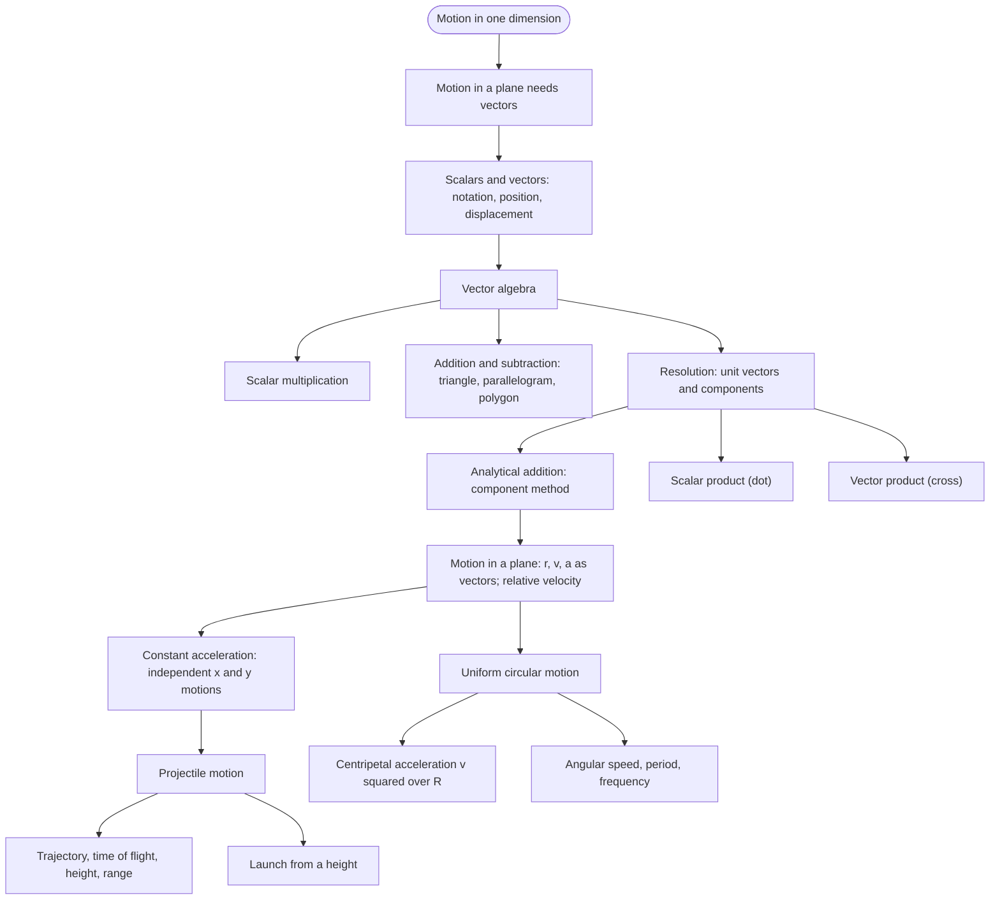
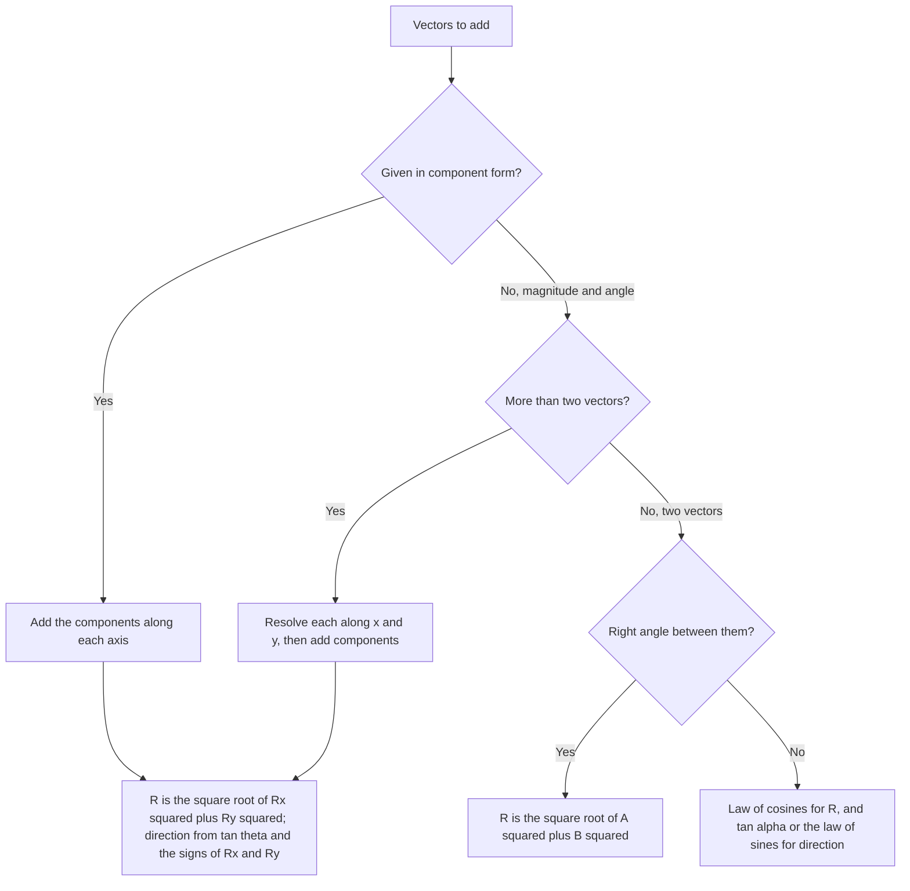
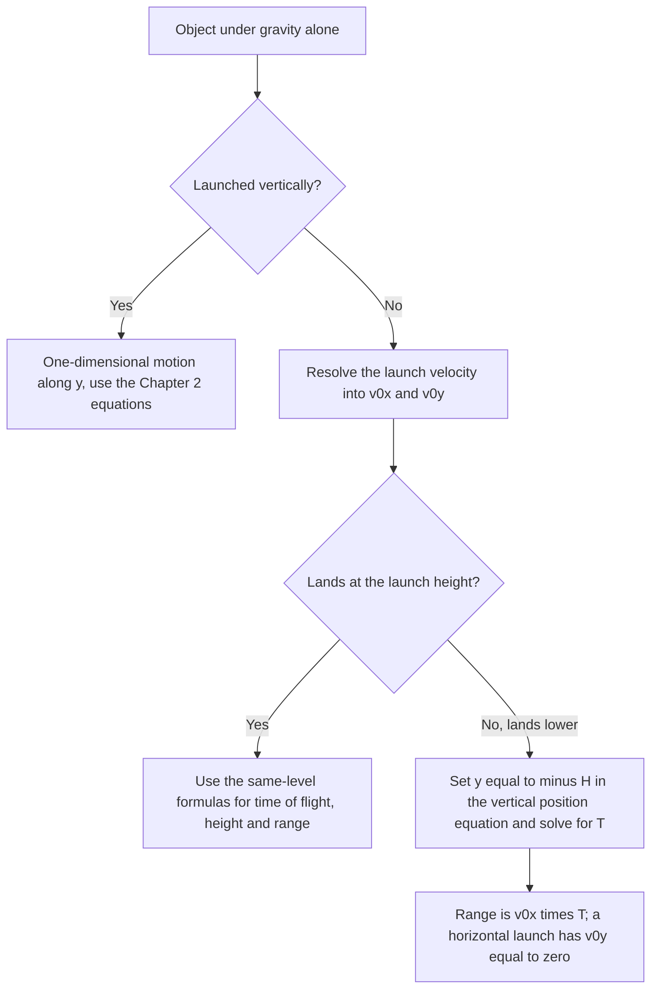
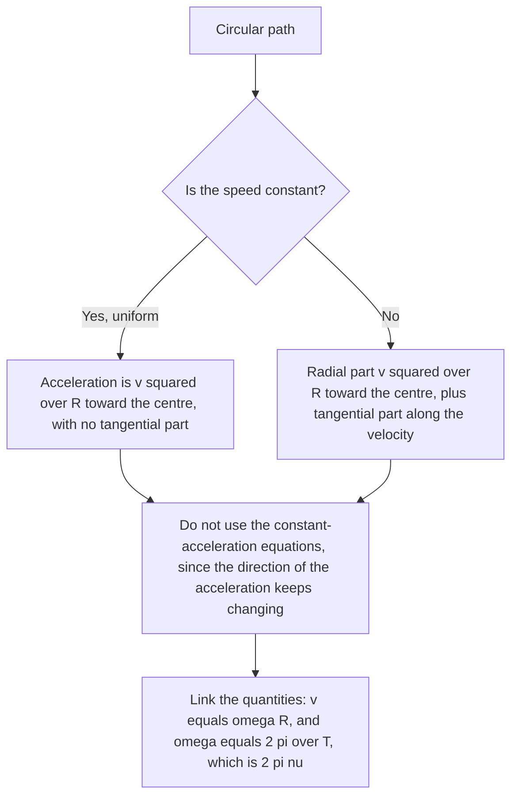

# Physics | Chapter 03 | Motion in a Plane | NOTES
> **Complete Study Notes** | Board · NEET · JEE Layered

---

Motion in a plane extends the straight-line kinematics of Chapter 2 to two dimensions, where position, velocity and acceleration become vectors that need not lie along one line. The chapter first builds the vector tools (addition, resolution into components, and the two products of vectors) and then uses them to describe projectile motion and uniform circular motion. Both are the everyday cases in which an object's path bends.

**Prerequisites:** one-dimensional kinematics (position, velocity, acceleration, the constant-acceleration equations), basic trigonometry, the derivative as a rate of change.

**Key outcomes**
- Add, subtract and resolve vectors graphically and by components.
- Obtain velocity and acceleration from a position vector and state their magnitude and direction.
- Solve projectile problems from the component equations, including launches from a height.
- Explain why the acceleration in uniform circular motion points inward with magnitude $v^2/R$, and relate $v$, $\omega$, $T$ and $\nu$.
- Use the dot and cross products to find angles, test perpendicularity, and compute work and power.

**Scope:** air resistance is neglected throughout; three-dimensional vectors appear only in resolution and in the two products; torque and angular momentum belong to rotational motion.

**Priority:** ⭐ standard · ⭐⭐ important · ⭐⭐⭐ essential. A subsection without stars carries the priority of its section.

---

## CONTENTS

- CONCEPT ROADMAP
- **SECTION 1 — SCALARS AND VECTORS ⭐**
  - 1.1 Scalar Quantities
  - 1.2 Vector Quantities ⭐
  - 1.3 Vector Notation
  - 1.4 Position and Displacement Vectors
  - 1.5 Equality of Vectors
- **SECTION 2 — MULTIPLICATION OF VECTORS BY REAL NUMBERS ⭐**
  - 2.1 Multiplication by a Positive Scalar ($\lambda > 0$)
  - 2.2 Multiplication by a Negative Scalar ($-\lambda$)
  - 2.3 Dimension of $\lambda\mathbf{A}$
- **SECTION 3 — ADDITION AND SUBTRACTION OF VECTORS ⭐⭐**
  - 3.1 Triangle Law of Vector Addition (Head-to-Tail Method)
  - 3.2 Properties of Vector Addition
  - 3.3 Null Vector (Zero Vector)
  - 3.4 Vector Subtraction
  - 3.5 Parallelogram Law of Vector Addition
  - 3.6 Polygon Law of Vector Addition
  - 3.7 Worked Example — Rain and Wind
  - 3.8 Law of Cosines and Law of Sines ⭐
- **SECTION 4 — RESOLUTION OF VECTORS ⭐⭐**
  - 4.1 Resolving Along Two Arbitrary Directions
  - 4.2 Unit Vectors ⭐
  - 4.3 Resolving a Vector Along the $x$ and $y$ Axes ⭐⭐⭐
  - 4.4 Three-Dimensional Resolution
  - 4.5 Position Vector in Component Form
  - 4.6 Worked Examples — Components and Unit Vectors
- **SECTION 5 — VECTOR ADDITION: ANALYTICAL METHOD ⭐⭐**
  - 5.1 Component Method (Most Practical)
  - 5.2 Worked Example — Motorboat
- **SECTION 6 — MOTION IN A PLANE ⭐⭐⭐**
  - 6.1 Position Vector and Displacement
  - 6.2 Average Velocity in 2D
  - 6.3 Instantaneous Velocity in 2D ⭐
  - 6.4 Average Acceleration in 2D
  - 6.5 Instantaneous Acceleration in 2D ⭐
  - 6.6 Worked Example — Variable Acceleration
  - 6.7 Relative Velocity in a Plane
- **SECTION 7 — MOTION IN A PLANE WITH CONSTANT ACCELERATION ⭐⭐**
  - 7.1 Equations of Motion (2D Vector Form)
  - 7.2 Component Form ⭐⭐⭐
- **SECTION 8 — PROJECTILE MOTION ⭐⭐⭐**
  - 8.1 What is a Projectile?
  - 8.2 Assumptions
  - 8.3 Setting Up the Problem ⭐⭐⭐
  - 8.4 Equations of Motion for a Projectile ⭐⭐⭐
  - 8.5 Equation of Trajectory (Path Equation) ⭐⭐
  - 8.6 Time to Reach Maximum Height ⭐
  - 8.7 Time of Flight ⭐⭐
  - 8.8 Maximum Height ⭐⭐
  - 8.9 Horizontal Range ⭐⭐⭐
  - 8.10 Key Results on Range ⭐⭐
  - 8.11 Summary Table — Projectile Formulae ⭐⭐⭐
  - 8.12 Launch from a Height — General Case
  - 8.13 Worked Examples — Projectile Problems
- **SECTION 9 — UNIFORM CIRCULAR MOTION ⭐⭐⭐**
  - 9.1 Definition
  - 9.2 Centripetal Acceleration ⭐⭐⭐
  - 9.3 Angular Speed ⭐⭐
  - 9.4 Time Period and Frequency ⭐
  - 9.5 Summary Table — Circular Motion Quantities
  - 9.6 Worked Example — Insect in a Groove
  - 9.7 Non-Uniform Circular Motion
- **SECTION 10 — SCALAR (DOT) PRODUCT ⭐⭐**
  - 10.1 Definition ⭐⭐
  - 10.2 Component Form ⭐⭐⭐
  - 10.3 Properties ⭐⭐
  - 10.4 Bridge to the Law of Cosines ⭐⭐
  - 10.5 Worked Examples — Angle, Perpendicularity and Power
- **SECTION 11 — VECTOR (CROSS) PRODUCT ⭐⭐**
  - 11.1 Definition ⭐⭐
  - 11.2 Component Form and Basis Vector Rules ⭐⭐
  - 11.3 Properties ⭐⭐
  - 11.4 Worked Example — Cross Product in Components
- **SECTION 12 — DIMENSIONAL FORMULAE ⭐**
- **SECTION 13 — PROBLEM-SOLVING STRATEGY ⭐⭐⭐**
  - 13.1 Choosing a Vector-Addition Method
  - 13.2 Projectile Problem Triage
  - 13.3 Circular Motion Sanity Check

---

## CONCEPT ROADMAP



The roadmap reads top to bottom: vector algebra (§1–5) is the toolkit, §6–7 turn position, velocity and acceleration into vectors, and §8 and §9 apply them to the two standard curved paths. The dot and cross products (§10–11) grow out of resolution and are used wherever a scalar or an axis direction must be extracted from two vectors.

---

## SECTION 1 — SCALARS AND VECTORS ⭐

In one dimension a plus or minus sign is enough to say which way a quantity points. In a plane, a direction needs an angle, so physical quantities split into those that carry a direction and those that do not. This section fixes the definitions and notation used in every later section.

### 1.1 Scalar Quantities

> [!info] Definition
> A **scalar** is a quantity with **magnitude only**. Scalars combine by the ordinary rules of algebra.

- Examples: distance, speed, mass, time, temperature, energy
- A scalar is described completely by a number and a unit

### 1.2 Vector Quantities ⭐

> [!info] Definition
> A **vector** is a quantity with both **magnitude and direction** that combines according to the **triangle law of addition** (§3.1).

- Examples: displacement, velocity, acceleration, force

> [!warning] Having a direction is not enough
> The addition rule is part of the definition. Finite rotations have a magnitude and a direction, but applying two of them in the opposite order gives a different result, so they do not add like arrows and are not vectors.

### 1.3 Vector Notation

- **Symbol:** bold in print ($\mathbf{A}$), an arrow when handwritten ($\vec{A}$)
- **Magnitude:** $|\mathbf{A}| = A$, a non-negative scalar
- **Picture:** an arrow whose length is proportional to the magnitude and whose head shows the direction; the other end is the **tail**

### 1.4 Position and Displacement Vectors

To locate a particle in a plane, draw an arrow from a fixed origin $O$ to the particle's position $P$. Two vectors and one scalar describe what happens when it moves.

- **Position vector** $\mathbf{r} = \overrightarrow{OP}$: from the origin to the particle. SI unit m; dimension $[L]$.
- **Displacement vector** $\Delta\mathbf{r} = \mathbf{r}' - \mathbf{r}$: from the initial position $P$ to the final position $P'$. SI unit m; dimension $[L]$.
- **Path length:** the length of the route actually travelled; a scalar, never negative.

Displacement is fixed by the two end points alone, so every route from $P$ to $P'$ gives the same $\Delta\mathbf{r}$ while the path lengths differ. A straight line is the shortest route between two points, so

$$|\Delta\mathbf{r}| \le \text{path length}$$

with equality only for motion along a straight line without reversing.

> [!warning] Displacement is not distance
> A particle that returns to its starting point has displacement $\mathbf{0}$ but a positive path length.

### 1.5 Equality of Vectors

Two vectors are **equal** ($\mathbf{A} = \mathbf{B}$) when they have the **same magnitude and the same direction**. Where the arrow is drawn does not matter, so a displacement can be shifted parallel to itself without changing it. A position vector is the exception, since it is anchored at the origin.

```tikz
\usetikzlibrary{arrows.meta}
\begin{tikzpicture}[>={Stealth[length=7pt,width=5pt]}, thick, scale=1.0]
  % Pair 1: equal vectors A and B
  \draw[->, blue!80!black, line width=1.6pt] (0,0) -- (1.6,2.2)
    node[above left, font=\small] {$\mathbf{A}$};
  \draw[->, blue!80!black, line width=1.6pt] (1.1,-0.3) -- (2.7,1.9)
    node[right, font=\small] {$\mathbf{B}$};
  \node[below, font=\small] at (0.8,1.0) {(a) $\mathbf{A}=\mathbf{B}$};
  % Pair 2: same length, different direction -> unequal
  \draw[->, red!75!black, line width=1.6pt] (4.6,0) -- (6.2,2.2)
    node[above left, font=\small] {$\mathbf{A'}$};
  \draw[->, red!75!black, line width=1.6pt] (5.7,-0.3) -- (7.9,0.4)
    node[right, font=\small] {$\mathbf{B'}$};
  \node[below, font=\small] at (6.0,1.0) {(b) $|\mathbf{A'}|=|\mathbf{B'}|$ but $\mathbf{A'}\neq\mathbf{B'}$};
  \node[below, font=\itshape\small, text=gray] at (4.0,-0.9)
    {Same length is not enough -- direction must match too};
\end{tikzpicture}
```

*In (a) the two arrows have the same length and direction, so they are equal wherever they are drawn. In (b) the lengths match but the directions differ, so the vectors are not equal.*

> [!warning] Equal magnitude does not mean equal vectors
> $|\mathbf{A}| = |\mathbf{B}|$ says nothing about direction. Two vectors of the same length pointing differently are different vectors.

---

## SECTION 2 — MULTIPLICATION OF VECTORS BY REAL NUMBERS ⭐

Multiplying a vector by a number changes its length, and reverses it if the number is negative, but never turns it. This is the operation behind scaling a velocity by a time interval ($\mathbf{v}\,\Delta t$) and behind writing any vector as a magnitude times a direction (§4.2).

### 2.1 Multiplication by a Positive Scalar ($\lambda > 0$)

- $\lambda\mathbf{A}$ has magnitude $\lambda A$
- $\lambda\mathbf{A}$ points in the same direction as $\mathbf{A}$

### 2.2 Multiplication by a Negative Scalar ($-\lambda$)

- $-\lambda\mathbf{A}$ has magnitude $\lambda A$
- $-\lambda\mathbf{A}$ points opposite to $\mathbf{A}$
- $\lambda = 1$ gives $-\mathbf{A}$, the vector of equal length and opposite direction; $\lambda = 0$ gives the null vector (§3.3)

```tikz
\usetikzlibrary{arrows.meta}
\begin{tikzpicture}[>={Stealth[length=7pt,width=5pt]}, thick, scale=0.9]
  \draw[->, blue!80!black, line width=1.6pt] (0,0) -- (1.4,0.6)
    node[above, font=\small] {$\mathbf{A}$};
  \draw[->, blue!80!black, line width=2.4pt] (2.6,0) -- (5.4,1.2)
    node[above, font=\small] {$2\mathbf{A}$};
  \draw[->, red!75!black, line width=1.6pt] (6.6,0.6) -- (5.2,0)
    node[left, font=\small] {$-\mathbf{A}$};
  \draw[->, red!75!black, line width=2.6pt] (10.5,0.9) -- (8.4,0)
    node[left, font=\small] {$-1.5\mathbf{A}$};
  \node[below, font=\itshape\small, text=gray] at (5.2,-0.6)
    {Positive $\lambda$: same direction, scaled length. Negative $\lambda$: direction reverses};
\end{tikzpicture}
```

*$2\mathbf{A}$ is twice as long as $\mathbf{A}$ in the same direction; $-\mathbf{A}$ and $-1.5\mathbf{A}$ point the opposite way.*

### 2.3 Dimension of $\lambda\mathbf{A}$

If $\lambda$ is a pure number, $\lambda\mathbf{A}$ has the same dimension as $\mathbf{A}$. If $\lambda$ itself has dimensions, the product carries both.

$$[\lambda\mathbf{A}] = [\lambda]\,[\mathbf{A}]$$

For example, velocity times a time interval is a displacement: $[LT^{-1}][T] = [L]$.

---

## SECTION 3 — ADDITION AND SUBTRACTION OF VECTORS ⭐⭐

Vectors add as arrows, not as numbers: two displacements of 3 m and 4 m can produce anything from 1 m to 7 m of net displacement, depending on their directions. The triangle law gives the rule; the parallelogram and polygon laws are the same rule redrawn or repeated, and §3.8 turns it into formulas.

### 3.1 Triangle Law of Vector Addition (Head-to-Tail Method)

> [!info] Triangle law
> To add $\mathbf{B}$ to $\mathbf{A}$, place the **tail of $\mathbf{B}$ at the head of $\mathbf{A}$**. The **resultant** $\mathbf{R} = \mathbf{A} + \mathbf{B}$ is the arrow from the tail of $\mathbf{A}$ to the head of $\mathbf{B}$.

The rule encodes something physical: a displacement $\mathbf{A}$ followed by a displacement $\mathbf{B}$ has the same effect as the single displacement $\mathbf{R}$ from the start to the finish.

```tikz
\usetikzlibrary{arrows.meta}
\begin{tikzpicture}[>={Stealth[length=7pt,width=5pt]}, thick, scale=1.1]
  \coordinate (O) at (0,0);
  \coordinate (P) at (3,0.8);
  \coordinate (Q) at (4,3);
  \draw[->, blue!80!black, line width=1.6pt] (O) -- (P)
    node[midway, below, font=\small] {$\mathbf{A}$};
  \draw[->, green!60!black, line width=1.6pt] (P) -- (Q)
    node[midway, right, font=\small] {$\mathbf{B}$};
  \draw[->, red!80!black, line width=1.8pt, dashed] (O) -- (Q)
    node[midway, left, font=\small] {$\mathbf{R} = \mathbf{A} + \mathbf{B}$};
  \node[below left, font=\small] at (O) {O};
  \node[below right, font=\small] at (P) {P};
  \node[above right, font=\small] at (Q) {Q};
  \fill (O) circle (2.5pt);
  \fill (P) circle (2.5pt);
  \fill (Q) circle (2.5pt);
  \node[below, font=\itshape\small, text=gray] at (2,-0.4)
    {Triangle Law: tail of B at head of A};
\end{tikzpicture}
```

*The arrow from O to Q closes the triangle O–P–Q and is the resultant of $\mathbf{A}$ and $\mathbf{B}$.*

> [!warning] The magnitudes do not simply add
> $|\mathbf{A} + \mathbf{B}| \ne |\mathbf{A}| + |\mathbf{B}|$ in general. Equality holds only when $\mathbf{A}$ and $\mathbf{B}$ point in the same direction (§3.8).

### 3.2 Properties of Vector Addition

- **Commutative:** $\mathbf{A} + \mathbf{B} = \mathbf{B} + \mathbf{A}$. The two orders are the two routes around the same parallelogram (§3.5) and end at the same point.
- **Associative:** $(\mathbf{A} + \mathbf{B}) + \mathbf{C} = \mathbf{A} + (\mathbf{B} + \mathbf{C})$. Grouping only decides which partial sum is drawn; the closing arrow is unchanged.
- **Distributive over a scalar:** $\lambda(\mathbf{A} + \mathbf{B}) = \lambda\mathbf{A} + \lambda\mathbf{B}$ and $(\lambda + \mu)\mathbf{A} = \lambda\mathbf{A} + \mu\mathbf{A}$.

Together the first two mean any number of vectors can be added in any order and any grouping. The third is what lets components be added separately in §5.1.

### 3.3 Null Vector (Zero Vector)

> [!info] Definition
> The **null vector** $\mathbf{0}$ has **zero magnitude** and no defined direction. It is the result of adding a vector and its negative: $\mathbf{A} + (-\mathbf{A}) = \mathbf{0}$.

- $\mathbf{A} + \mathbf{0} = \mathbf{A}$
- $\lambda\mathbf{0} = \mathbf{0}$ and $0\,\mathbf{A} = \mathbf{0}$
- Physical examples: the displacement of a particle that returns to its start; the net force on a body in equilibrium

### 3.4 Vector Subtraction

> [!info] Definition
> $\mathbf{A} - \mathbf{B} = \mathbf{A} + (-\mathbf{B})$: add $\mathbf{A}$ to the vector of the same length as $\mathbf{B}$ pointing the opposite way.

```tikz
\usetikzlibrary{arrows.meta}
\begin{tikzpicture}[>={Stealth[length=7pt,width=5pt]}, thick, scale=1.05]
  \coordinate (O) at (0,0);
  \coordinate (A) at (3.4,1.1);
  \coordinate (B) at (1.6,2.6);
  \coordinate (NB) at (-1.6,-2.6);
  \coordinate (R1) at (5.0,3.7);
  \coordinate (R2) at (1.8,-1.5);
  \draw[->, blue!80!black, line width=1.6pt] (O) -- (A)
    node[midway, below, font=\small] {$\mathbf{A}$};
  \draw[->, green!60!black, line width=1.6pt] (O) -- (B)
    node[midway, left, font=\small] {$\mathbf{B}$};
  \draw[->, green!60!black, dashed, line width=1.4pt] (O) -- (NB)
    node[midway, left, font=\small] {$-\mathbf{B}$};
  \draw[->, red!80!black, line width=1.8pt] (O) -- (R1)
    node[midway, above, font=\small] {$\mathbf{R_1}=\mathbf{A}+\mathbf{B}$};
  \draw[->, orange!80!black, line width=1.8pt] (O) -- (R2)
    node[midway, right, font=\small] {$\mathbf{R_2}=\mathbf{A}-\mathbf{B}$};
  \fill (O) circle (2.5pt);
  \node[below, font=\itshape\small, text=gray] at (1.0,-2.0)
    {A - B is A plus the reverse of B -- shown alongside A + B for comparison};
\end{tikzpicture}
```

*$\mathbf{A} - \mathbf{B}$ is built as $\mathbf{A} + (-\mathbf{B})$ and drawn beside $\mathbf{A} + \mathbf{B}$; the two results differ in both length and direction.*

> [!warning] Subtraction is not commutative
> $\mathbf{A} - \mathbf{B} \ne \mathbf{B} - \mathbf{A}$. In fact $\mathbf{B} - \mathbf{A} = -(\mathbf{A} - \mathbf{B})$: the same length, the opposite direction.

### 3.5 Parallelogram Law of Vector Addition

> [!info] Parallelogram law
> Bring the tails of $\mathbf{A}$ and $\mathbf{B}$ to a common point and complete the parallelogram. The **diagonal from the common tail** is the resultant $\mathbf{R} = \mathbf{A} + \mathbf{B}$.

The law is the triangle law in another layout. The side of the parallelogram opposite $\mathbf{A}$ is $\mathbf{B}$ shifted to the head of $\mathbf{A}$, which is exactly the head-to-tail construction, so both give the same diagonal. It is the natural picture when two vectors act from one point, such as two forces on a body.

```tikz
\usetikzlibrary{arrows.meta}
\begin{tikzpicture}[>={Stealth[length=7pt,width=5pt]}, thick, scale=1.1]
  \coordinate (O) at (0,0);
  \coordinate (A) at (3.2,0.5);
  \coordinate (B) at (0.8,2.2);
  \coordinate (R) at (4.0,2.7);
  \draw[dashed, blue!50!black, line width=1pt] (B) -- (R);
  \draw[dashed, green!50!black, line width=1pt] (A) -- (R);
  \draw[->, blue!80!black, line width=1.6pt] (O) -- (A)
    node[midway, below, font=\small] {$\mathbf{A}$};
  \draw[->, green!60!black, line width=1.6pt] (O) -- (B)
    node[midway, left, font=\small] {$\mathbf{B}$};
  \draw[->, red!80!black, line width=2pt] (O) -- (R)
    node[midway, above left, font=\small] {$\mathbf{R}$};
  \node[below left, font=\small] at (O) {O};
  \fill (O) circle (2.5pt);
  \fill (R) circle (2pt);
  \node[below, font=\itshape\small, text=gray] at (2,-0.4)
    {Diagonal from origin = resultant R};
\end{tikzpicture}
```

*Drawn from a common tail, $\mathbf{A}$ and $\mathbf{B}$ span a parallelogram; the diagonal from that tail is $\mathbf{R}$.*

### 3.6 Polygon Law of Vector Addition

To add three or more vectors, place them head to tail in any order. The resultant is the single arrow from the tail of the first to the head of the last.

- The order does not matter (§3.2)
- If the polygon closes, so that the head of the last vector meets the tail of the first, the resultant is the null vector

```tikz
\usetikzlibrary{arrows.meta}
\begin{tikzpicture}[>={Stealth[length=7pt,width=5pt]}, thick, scale=1.0]
  \coordinate (O) at (0,0);
  \coordinate (P1) at (2.6,-0.4);
  \coordinate (P2) at (4.6,1.0);
  \coordinate (P3) at (4.0,3.0);
  \coordinate (P4) at (1.8,3.6);
  \draw[->, blue!80!black, line width=1.6pt] (O) -- (P1)
    node[midway, below, font=\small] {$\mathbf{A}$};
  \draw[->, green!60!black, line width=1.6pt] (P1) -- (P2)
    node[midway, below right, font=\small] {$\mathbf{B}$};
  \draw[->, orange!80!black, line width=1.6pt] (P2) -- (P3)
    node[midway, right, font=\small] {$\mathbf{C}$};
  \draw[->, purple!70!black, line width=1.6pt] (P3) -- (P4)
    node[midway, above, font=\small] {$\mathbf{D}$};
  \draw[->, red!80!black, line width=2pt, dashed] (O) -- (P4)
    node[midway, left, font=\small] {$\mathbf{R}=\mathbf{A}+\mathbf{B}+\mathbf{C}+\mathbf{D}$};
  \fill (O) circle (2.5pt);
  \fill (P4) circle (2.5pt);
  \node[below, font=\itshape\small, text=gray] at (2.3,-0.9)
    {R is the closing side of the polygon -- tail of A to head of D};
\end{tikzpicture}
```

*The dashed resultant closes the open polygon formed by $\mathbf{A}$, $\mathbf{B}$, $\mathbf{C}$ and $\mathbf{D}$.*

### 3.7 Worked Example — Rain and Wind

> [!example] Which way should the umbrella tilt?
> **Given:** In still air rain falls vertically at $v_r = 35$ m s⁻¹. A steady horizontal wind of $v_w = 12$ m s⁻¹ blows from east to west and carries the drops with it.
>
> **Find:** The direction in which the umbrella should be held.
>
> **Concept:** Relative to the ground each drop has velocity $\mathbf{R} = \mathbf{v_r} + \mathbf{v_w}$, a vector sum. The umbrella shelters best when its axis lies along the line of the drops' motion, so its canopy faces the rain.
>
> **Work:** $\mathbf{v_r}$ and $\mathbf{v_w}$ are perpendicular, so
> $$R = \sqrt{35^2 + 12^2} = 37\ \text{m s}^{-1}, \qquad \tan\theta = \frac{12}{35} \;\Rightarrow\; \theta \approx 19^\circ$$
> with $\theta$ measured from the vertical. The drops move downward and toward the west, so they arrive from the upper east side.
>
> **Check:** $37^2 = 35^2 + 12^2$ ✓. With no wind $\theta = 0$ and the umbrella is held vertically ✓. The top of the umbrella therefore tilts about $19^\circ$ from the vertical toward the east, into the oncoming rain.

```tikz
\usetikzlibrary{arrows.meta}
\begin{tikzpicture}[>={Stealth[length=7pt,width=5pt]}, thick, scale=1.0]
  \coordinate (O) at (0,0);
  \coordinate (T) at (0,-3.5);
  \coordinate (R) at (-1.2,-3.5);
  \draw[->, blue!80!black, line width=1.8pt] (O) -- (T)
    node[midway, right, font=\small] {$\mathbf{v_r}=35$};
  \draw[->, green!60!black, line width=1.6pt] (T) -- (R)
    node[midway, below, font=\small] {$\mathbf{v_w}=12$};
  \draw[->, red!80!black, line width=2pt] (O) -- (R)
    node[pos=0.62, left, font=\small] {$\mathbf{R}=37$};
  \draw[thin, gray] (0,-0.9) arc (270:251.1:0.9);
  \draw[thin, gray] (-0.14,-0.89) -- (0.35,-0.7);
  \node[right, font=\small] at (0.35,-0.7) {$\theta\approx 19^\circ$};
  \fill (O) circle (2.5pt);
  \node[left, font=\small, text=gray] at (-1.35,-3.5) {west};
  \node[below, font=\itshape\small, text=gray, text width=7cm, align=center] at (-0.6,-4.3)
    {Drops move along R, about 19 degrees from the vertical, so the umbrella axis tilts the same angle toward the upwind (east) side};
\end{tikzpicture}
```

*The drops' velocity $\mathbf{R}$ is the head-to-tail sum of $\mathbf{v_r}$ and $\mathbf{v_w}$; $\tan\theta = v_w/v_r$ fixes the tilt.*

### 3.8 Law of Cosines and Law of Sines ⭐

The triangle law fixes the resultant geometrically. To get its **magnitude and direction** from the magnitudes $A$, $B$ and the angle $\theta$ between the vectors, drop a perpendicular from the tip of the resultant.

> [!note] Convention for $\theta$
> $\theta$ is the angle between $\mathbf{A}$ and $\mathbf{B}$ when their **tails are together**. Drawn head to tail, the angle inside the triangle is $180^\circ - \theta$, which is why the cross term below is $+2AB\cos\theta$ and not $-2AB\cos\theta$.

**Derivation.** Place $\mathbf{B}$ at the head of $\mathbf{A}$ (triangle law) so that $\mathbf{A} = \overrightarrow{OP}$, $\mathbf{B} = \overrightarrow{PS}$ and $\mathbf{R} = \overrightarrow{OS}$. Extend $OP$ and drop the perpendicular $SN$ onto it. Angle $SPN$ equals $\theta$, so

$$PN = B\cos\theta, \qquad SN = B\sin\theta, \qquad ON = A + B\cos\theta$$

Pythagoras in the right triangle $OSN$ gives the magnitude, and its tangent gives the direction:

> [!important] Resultant of two vectors
> $$R = \sqrt{A^2 + B^2 + 2AB\cos\theta}, \qquad \tan\alpha = \frac{B\sin\theta}{A + B\cos\theta}$$
> where $\alpha$ is the angle between $\mathbf{R}$ and $\mathbf{A}$.

```tikz
\usetikzlibrary{arrows.meta}
\begin{tikzpicture}[>={Stealth[length=7pt,width=5pt]}, thick, scale=1.05]
  \coordinate (O) at (0,0);
  \coordinate (P) at (3.2,0);
  \coordinate (S) at (4.6,2.6);
  \coordinate (N) at (4.6,0);
  \draw[->, blue!80!black, line width=1.6pt] (O) -- (P)
    node[midway, below, font=\small] {$\mathbf{A}$};
  \draw[->, green!60!black, line width=1.6pt] (P) -- (S)
    node[midway, left, font=\small] {$\mathbf{B}$};
  \draw[->, red!80!black, line width=1.8pt] (O) -- (S)
    node[midway, above left, font=\small] {$\mathbf{R}$};
  \draw[dashed, gray] (P) -- (N);
  \draw[dashed, gray] (S) -- (N);
  \draw[thin, gray] (4.4,0) -- (4.4,0.2) -- (4.6,0.2);
  \node[below, font=\small] at (3.9,0) {$B\cos\theta$};
  \node[right, font=\small] at (4.6,1.3) {$B\sin\theta$};
  % theta: angle between A and B when their tails are together (at P, between A extended and B)
  \draw[thin, gray] (3.8,0) arc (0:61.7:0.6);
  \node[font=\small] at (4.0,0.5) {$\theta$};
  % alpha: angle between R and A (at O)
  \draw[thin, gray] (0.8,0) arc (0:29.5:0.8);
  \node[font=\small] at (1.1,0.25) {$\alpha$};
  % beta: angle between R and B (at S)
  \draw[thin, gray] (3.99,2.256) arc (209.5:241.7:0.7);
  \node[font=\small] at (3.85,1.85) {$\beta$};
  \fill (O) circle (2pt); \fill (S) circle (2pt); \fill (N) circle (1.5pt);
  \node[below, font=\itshape\small, text=gray] at (2.3,-0.7)
    {Drop a perpendicular from S: ON = A + B cos(theta), SN = B sin(theta)};
\end{tikzpicture}
```

*The perpendicular $SN$ splits the sum into two legs of a right triangle: $ON = A + B\cos\theta$ along $\mathbf{A}$ and $SN = B\sin\theta$ across it.*

**Law of sines.** In triangle $OPS$ the interior angle at $P$ is $180^\circ - \theta$, and $\sin(180^\circ - \theta) = \sin\theta$. Let $\alpha$ be the angle between $\mathbf{R}$ and $\mathbf{A}$, and $\beta$ the angle between $\mathbf{R}$ and $\mathbf{B}$. Each side is opposite one of these angles, so

$$\frac{R}{\sin\theta} = \frac{A}{\sin\beta} = \frac{B}{\sin\alpha}$$

**Special cases.**

| Angle $\theta$ | Resultant $R$ | Situation |
|---|---|---|
| $0^\circ$ | $A + B$ | Same direction; the maximum |
| $90^\circ$ | $\sqrt{A^2 + B^2}$ | Perpendicular |
| $180^\circ$ | $\lvert A - B\rvert$ | Opposite directions; the minimum |
| Any, with $A = B$ | $2A\cos(\theta/2)$ | Equal magnitudes |

Since $\cos\theta$ lies between $-1$ and $1$, the magnitude of any resultant is bounded by

$$|A - B| \le R \le A + B$$

For equal magnitudes, $R^2 = 2A^2(1 + \cos\theta) = 4A^2\cos^2(\theta/2)$. For a **difference**, replace $\mathbf{B}$ by $-\mathbf{B}$, which changes the angle from $\theta$ to $180^\circ - \theta$:

$$|\mathbf{A} - \mathbf{B}| = \sqrt{A^2 + B^2 - 2AB\cos\theta}$$

> [!warning] The half-angle in the equal-magnitude case
> For two vectors of equal length, $R = 2A\cos(\theta/2)$, not $2A\cos\theta$.

```desmos
{
  "expressions": [
    { "id": "1", "latex": "A=5" },
    { "id": "2", "latex": "B=3" },
    { "id": "3", "latex": "y=\\sqrt{A^{2}+B^{2}+2AB\\cos\\left(\\frac{\\pi x}{180}\\right)}", "color": "#2d70b3" },
    { "id": "4", "latex": "\\left(0,A+B\\right)", "color": "#c74440" },
    { "id": "5", "latex": "\\left(90,\\sqrt{A^{2}+B^{2}}\\right)", "color": "#388c46" },
    { "id": "6", "latex": "\\left(180,\\left|A-B\\right|\\right)", "color": "#6042a6" }
  ],
  "graphSettings": { "xmin": -10, "xmax": 190, "ymin": -1, "ymax": 12 }
}
```

*The curve is $R$ against the angle $\theta$ in degrees; the three marked points are the maximum $A + B$, the perpendicular case $\sqrt{A^2 + B^2}$, and the minimum $|A - B|$. Changing $A$ and $B$ moves the curve but never takes it outside those bounds, and $R$ falls steadily as $\theta$ grows from $0^\circ$ to $180^\circ$.*

---

## SECTION 4 — RESOLUTION OF VECTORS ⭐⭐

Adding arrows with a ruler is slow and only as accurate as the drawing. Resolution replaces each arrow by its "shadows" along chosen axes, after which vector algebra becomes ordinary arithmetic on numbers. This section builds the components; §5 uses them to add vectors.

### 4.1 Resolving Along Two Arbitrary Directions

Any vector $\mathbf{A}$ in a plane can be written in terms of two non-collinear vectors $\mathbf{a}$ and $\mathbf{b}$:

$$\mathbf{A} = \lambda\mathbf{a} + \mu\mathbf{b}$$

with $\lambda$ and $\mu$ real numbers. This is the parallelogram law run backwards: the diagonal is given and the two sides are found. The two directions need not be perpendicular, but perpendicular axes make $\lambda$ and $\mu$ simple (§4.3).

### 4.2 Unit Vectors ⭐

> [!info] Definition
> A **unit vector** $\hat{n}$ has **magnitude 1** and specifies a direction. It has no dimension and no unit. It is obtained by dividing a vector by its own magnitude: $\hat{n} = \mathbf{A}/|\mathbf{A}|$.

Every vector is therefore a magnitude times a direction, $\mathbf{A} = |\mathbf{A}|\,\hat{n}$. The standard unit vectors point along the axes of a right-handed coordinate system:

| Unit vector | Direction | Magnitude |
|---|---|---|
| $\hat{i}$ | $+x$ | 1 |
| $\hat{j}$ | $+y$ | 1 |
| $\hat{k}$ | $+z$ | 1 |

The three are mutually perpendicular.

> [!example] Unit vector along $6\hat{i} + 8\hat{j}$
> **Given:** $\mathbf{A} = 6\hat{i} + 8\hat{j}$.
>
> **Find:** $\hat{A}$.
>
> **Concept:** Divide by the magnitude.
>
> **Work:** $|\mathbf{A}| = \sqrt{36 + 64} = 10$, so $\hat{A} = 0.6\,\hat{i} + 0.8\,\hat{j}$.
>
> **Check:** $\sqrt{0.6^2 + 0.8^2} = 1$ ✓

> [!warning] Divide by the magnitude, not its square
> Dividing $6\hat{i} + 8\hat{j}$ by 100 gives a vector of magnitude 0.1, not 1. Always confirm that the magnitude of a unit vector is 1.

### 4.3 Resolving a Vector Along the $x$ and $y$ Axes ⭐⭐⭐

Let $\mathbf{A}$ make an angle $\theta$ with the $+x$ axis. Dropping perpendiculars onto the axes forms a right triangle with $\mathbf{A}$ as the hypotenuse, so the two sides are

$$A_x = A\cos\theta, \qquad A_y = A\sin\theta, \qquad \mathbf{A} = A_x\hat{i} + A_y\hat{j}$$

```tikz
\usetikzlibrary{arrows.meta}
\begin{tikzpicture}[>={Stealth[length=7pt,width=5pt]}, thick]
  \draw[->, thin, black] (-0.4,0) -- (4.2,0) node[right, font=\small] {$x$};
  \draw[->, thin, black] (0,-0.4) -- (0,3.4) node[above, font=\small] {$y$};
  \node[below left, font=\small] at (0,0) {O};
  \draw[->, blue!80!black, line width=2pt] (0,0) -- (3,2.52)
    node[above right, font=\small] {$\mathbf{A}$};
  \draw[->, red!80!black, line width=1.5pt] (0,0) -- (3,0)
    node[below, font=\small] {$A_x = A\cos\theta$};
  \draw[->, green!60!black, line width=1.5pt] (3,0) -- (3,2.52)
    node[right, font=\small] {$A_y = A\sin\theta$};
  \draw[dashed, gray, thin] (0,2.52) -- (3,2.52);
  \draw[thin] (2.85,0) -- (2.85,0.15) -- (3,0.15);
  \draw[thin] (0.65,0) arc (0:40:0.65);
  \node[font=\small] at (0.88,0.27) {$\theta$};
  \node[below, font=\itshape\small, text=gray] at (1.8,-0.6)
    {A resolves into independent x and y components};
\end{tikzpicture}
```

*$A_x$ and $A_y$ are the two sides of the right triangle whose hypotenuse is $\mathbf{A}$, with $\theta$ measured from the $+x$ axis.*

Going the other way, the components give back the magnitude and direction:

$$A = \sqrt{A_x^2 + A_y^2}, \qquad \tan\theta = \frac{A_y}{A_x}$$

- **A component is a scalar** ($A_x$, $A_y$); the **component vector** ($A_x\hat{i}$) is a vector along that axis
- A component can be positive, negative or zero, according to whether it points along, against, or perpendicular to the axis

> [!warning] $\tan^{-1}$ alone can give the wrong quadrant
> The inverse tangent returns angles between $-90^\circ$ and $90^\circ$, so it is correct only when $A_x > 0$. For $\mathbf{A} = -3\hat{i} + 3\hat{j}$, $\tan^{-1}(A_y/A_x) = -45^\circ$, but the vector points at $135^\circ$. Read the signs of both components to place the vector in its quadrant, and add $180^\circ$ when $A_x < 0$.

### 4.4 Three-Dimensional Resolution

In space a vector has three components along mutually perpendicular axes:

$$\mathbf{A} = A_x\hat{i} + A_y\hat{j} + A_z\hat{k}, \qquad A = \sqrt{A_x^2 + A_y^2 + A_z^2}$$

```tikz
\usetikzlibrary{arrows.meta}
\begin{tikzpicture}[>={Stealth[length=7pt,width=5pt]}, thick, scale=1.0]
  \draw[->, thin, black] (0,0) -- (3.6,0) node[right, font=\small] {$x$};
  \draw[->, thin, black] (0,0) -- (0,3.2) node[above, font=\small] {$y$};
  \draw[->, thin, black] (0,0) -- (-1.9,-1.48) node[below left, font=\small] {$z$};
  \node[above left, font=\small] at (0,0) {O};
  \draw[dashed, gray] (2.6, 0.0) -- (2.6, 2.2) -- (0.0, 2.2);
  \draw[dashed, gray] (2.6, 0.0) -- (1.52, -0.84) -- (-1.08, -0.84);
  \draw[dashed, gray] (0.0, 2.2) -- (-1.08, 1.36) -- (-1.08, -0.84);
  \draw[dashed, gray] (2.6, 2.2) -- (1.52, 1.36);
  \draw[dashed, gray] (1.52, -0.84) -- (1.52, 1.36);
  \draw[dashed, gray] (-1.08, 1.36) -- (1.52, 1.36);
  \draw[->, blue!80!black, line width=2pt] (0,0) -- (1.52, 1.36) node[above right, font=\small] {$\mathbf{A}$};
  \node[below, font=\small, red!70!black] at (1.3,-0.12) {$A_x\hat{i}$};
  \node[left, font=\small, green!55!black] at (0,1.1) {$A_y\hat{j}$};
  \node[right, font=\small, orange!80!black] at (-0.3,-0.55) {$A_z\hat{k}$};
  \fill[blue!80!black] (0,0) circle (2pt);
  \node[below, font=\itshape\small, text=gray, text width=7.5cm, align=center] at (0.6,-1.7)
    {A is the far corner of a box whose edges are $A_x$, $A_y$, $A_z$ along the three perpendicular axes};
\end{tikzpicture}
```

*$\mathbf{A}$ is the diagonal of a box whose edges are its three components.*

If $\alpha$, $\beta$, $\gamma$ are the angles $\mathbf{A}$ makes with the $x$, $y$, $z$ axes, the **direction cosines** are their cosines, and each component is $A$ times one of them:

$$A_x = A\cos\alpha, \qquad A_y = A\cos\beta, \qquad A_z = A\cos\gamma$$

Substituting into $A^2 = A_x^2 + A_y^2 + A_z^2$ and dividing by $A^2$ gives the identity

$$\cos^2\alpha + \cos^2\beta + \cos^2\gamma = 1$$

### 4.5 Position Vector in Component Form

The position vector of the point $(x, y, z)$ is

$$\mathbf{r} = x\hat{i} + y\hat{j} + z\hat{k}$$

For example, the point $(4, 4)$ in a plane has $\mathbf{r} = 4\hat{i} + 4\hat{j}$. The displacement between two points is the difference of their position vectors, taken component by component:

$$\Delta\mathbf{r} = (x' - x)\hat{i} + (y' - y)\hat{j} + (z' - z)\hat{k}$$

### 4.6 Worked Examples — Components and Unit Vectors

> [!example] Vector between two points
> **Given:** Points $P(1, 2, -1)$ and $Q(3, 2, 2)$.
>
> **Find:** $\overrightarrow{PQ}$ and its magnitude.
>
> **Concept:** $\overrightarrow{PQ} = \mathbf{r}_Q - \mathbf{r}_P$ (§4.5).
>
> **Work:** $\overrightarrow{PQ} = (3-1)\hat{i} + (2-2)\hat{j} + (2-(-1))\hat{k} = 2\hat{i} + 3\hat{k}$, and $|\overrightarrow{PQ}| = \sqrt{2^2 + 3^2} = \sqrt{13}$.
>
> **Check:** The $y$-component is zero, so the vector lies in the $xz$-plane, as the equal $y$-coordinates require ✓.

> [!example] Unit vector along a sum
> **Given:** $\mathbf{A} = \hat{i} + 4\hat{j} - 2\hat{k}$ and $\mathbf{B} = 3\hat{i} - 5\hat{j} + \hat{k}$.
>
> **Find:** the unit vector along $\mathbf{A} + \mathbf{B}$.
>
> **Concept:** Add by components (§5.1), then divide by the magnitude (§4.2).
>
> **Work:** $\mathbf{A} + \mathbf{B} = 4\hat{i} - \hat{j} - \hat{k}$, with magnitude $\sqrt{16 + 1 + 1} = 3\sqrt{2}$, so
> $$\hat{n} = \frac{4\hat{i} - \hat{j} - \hat{k}}{3\sqrt{2}} = \frac{2\sqrt{2}}{3}\hat{i} - \frac{\sqrt{2}}{6}\hat{j} - \frac{\sqrt{2}}{6}\hat{k}$$
>
> **Check:** $\frac{8}{9} + \frac{2}{36} + \frac{2}{36} = 1$ ✓

> [!example] A vector of given length parallel to another
> **Given:** $\mathbf{A} = 3\hat{i} + 4\hat{j}$ and $\mathbf{B} = 7\hat{i} + 24\hat{j}$.
>
> **Find:** a vector with the magnitude of $\mathbf{B}$ and the direction of $\mathbf{A}$.
>
> **Concept:** The required vector is $|\mathbf{B}|\,\hat{A}$.
>
> **Work:** $|\mathbf{B}| = \sqrt{49 + 576} = 25$ and $\hat{A} = \tfrac{3}{5}\hat{i} + \tfrac{4}{5}\hat{j}$, so the vector is $15\hat{i} + 20\hat{j}$.
>
> **Check:** Its magnitude is $\sqrt{225 + 400} = 25$ ✓, and $15/3 = 20/4$, so it is parallel to $\mathbf{A}$ ✓.

> [!example] Missing component of a velocity
> **Given:** A velocity of magnitude 80 km h⁻¹ has an $x$-component of 40 km h⁻¹ and a positive $y$-component.
>
> **Find:** the $y$-component and the angle with the $x$-axis.
>
> **Concept:** The magnitude is $\sqrt{v_x^2 + v_y^2}$, and $\cos\theta = v_x/v$.
>
> **Work:** $v_y = \sqrt{80^2 - 40^2} = 40\sqrt{3} \approx 69$ km h⁻¹, and $\cos\theta = \tfrac{1}{2}$ gives $\theta = 60^\circ$.
>
> **Check:** $40^2 + (40\sqrt{3})^2 = 1600 + 4800 = 80^2$ ✓

---

## SECTION 5 — VECTOR ADDITION: ANALYTICAL METHOD ⭐⭐

Graphical addition is limited by the accuracy of the drawing. Components make the same addition exact, because the operations of §3.2 allow each axis to be handled separately.

### 5.1 Component Method (Most Practical)

Write $\mathbf{A} = A_x\hat{i} + A_y\hat{j}$ and $\mathbf{B} = B_x\hat{i} + B_y\hat{j}$. Adding is commutative, associative and distributive (§3.2), so the $\hat{i}$ terms and the $\hat{j}$ terms can be collected separately:

$$\mathbf{R} = \mathbf{A} + \mathbf{B} = (A_x + B_x)\,\hat{i} + (A_y + B_y)\,\hat{j}$$

The components of the resultant are therefore the sums of the components, and the same holds for a third axis and for any number of vectors. Subtraction works the same way with the signs of the second vector's components reversed.

1. Resolve every vector along the chosen axes (§4.3).
2. Add all the $x$-components to get $R_x$, and all the $y$-components to get $R_y$.
3. Recover the magnitude $R = \sqrt{R_x^2 + R_y^2}$ and the direction $\tan\theta = R_y/R_x$, using the signs of $R_x$ and $R_y$ to choose the quadrant (§4.3).

### 5.2 Worked Example — Motorboat

> [!example] Motorboat in a current
> **Given:** A motorboat heads due north at 25 km h⁻¹ in a current of 10 km h⁻¹ directed $60^\circ$ east of south.
>
> **Find:** The resultant velocity of the boat.
>
> **Concept:** The two velocities add as vectors. Take $x$ east and $y$ north and add by components (§5.1).
>
> **Work:** The boat is $(0,\ 25)$. The current has $v_x = 10\sin 60^\circ = 5\sqrt{3} \approx 8.66$ and $v_y = -10\cos 60^\circ = -5$. So $R_x = 8.66$ and $R_y = 25 - 5 = 20$, giving
> $$R = \sqrt{8.66^2 + 20^2} = \sqrt{475} \approx 21.8\ \text{km h}^{-1}, \qquad \tan\varphi = \frac{8.66}{20} \;\Rightarrow\; \varphi \approx 23.4^\circ$$
> measured from north toward east.
>
> **Check:** The angle between the two velocities is $120^\circ$, and the law of cosines gives $\sqrt{25^2 + 10^2 + 2(25)(10)\cos 120^\circ} = \sqrt{475}$ ✓. The result also lies between $25 - 10 = 15$ and $25 + 10 = 35$ km h⁻¹, as §3.8 requires ✓.

---

## SECTION 6 — MOTION IN A PLANE ⭐⭐⭐

In one dimension position, velocity and acceleration were single numbers. In a plane each becomes a vector, and every definition from Chapter 2 carries over with vectors in place of numbers: a change of position is still displacement, its rate of change is still velocity, and so on. What is new is that these vectors need not lie along one line, so velocity and acceleration can point in different directions.

### 6.1 Position Vector and Displacement

A particle at $P$ at time $t$ and at $P'$ at time $t'$ has position vectors $\mathbf{r}$ and $\mathbf{r}'$. Its displacement is the difference:

$$\Delta\mathbf{r} = \mathbf{r}' - \mathbf{r} = \Delta x\,\hat{i} + \Delta y\,\hat{j}, \qquad \Delta x = x' - x,\quad \Delta y = y' - y$$

```tikz
\usetikzlibrary{arrows.meta}
\begin{tikzpicture}[>={Stealth[length=7pt,width=5pt]}, thick]
  \draw[->, thin, black] (-0.3,0) -- (5.5,0) node[right, font=\small] {$x$};
  \draw[->, thin, black] (0,-0.3) -- (0,3.8) node[above, font=\small] {$y$};
  \node[below left, font=\small] at (0,0) {O};
  \coordinate (P)  at (1.8,1.2);
  \coordinate (Pp) at (4.2,3.2);
  \draw[->, blue!80!black, line width=1.5pt] (0,0) -- (P)
    node[midway, below right, font=\small] {$\mathbf{r}$};
  \draw[->, blue!80!black, line width=1.5pt] (0,0) -- (Pp)
    node[midway, left, font=\small] {$\mathbf{r'}$};
  \draw[->, red!80!black, line width=1.8pt, dashed] (P) -- (Pp)
    node[midway, above, font=\small] {$\Delta\mathbf{r} = \mathbf{r'} - \mathbf{r}$};
  \fill (P)  circle (3pt) node[below right, font=\small] {P $(t)$};
  \fill (Pp) circle (3pt) node[above right, font=\small] {P$'$ $(t')$};
  \draw[dashed, gray, thin] (P)  -- (1.8,0) node[below, font=\tiny] {$x$};
  \draw[dashed, gray, thin] (Pp) -- (4.2,0) node[below, font=\tiny] {$x'$};
  \draw[dashed, gray, thin] (P)  -- (0,1.2) node[left,  font=\tiny] {$y$};
  \draw[dashed, gray, thin] (Pp) -- (0,3.2) node[left,  font=\tiny] {$y'$};
  \node[below, font=\itshape\small, text=gray] at (2.5,-0.5)
    {Displacement depends only on initial and final positions};
\end{tikzpicture}
```

*$P$ and $P'$ are the positions at times $t$ and $t'$; the dashed arrow is the displacement, whose components are the differences of the coordinates.*

### 6.2 Average Velocity in 2D

> [!info] Definition
> The **average velocity** over an interval $\Delta t$ is the displacement divided by the interval:
> $$\bar{\mathbf{v}} = \frac{\Delta\mathbf{r}}{\Delta t} = \frac{\Delta x}{\Delta t}\hat{i} + \frac{\Delta y}{\Delta t}\hat{j}$$

- A vector; SI unit m s⁻¹; dimension $[LT^{-1}]$
- Dividing by the positive scalar $\Delta t$ does not turn the vector, so $\bar{\mathbf{v}}$ points along $\Delta\mathbf{r}$

> [!warning] Average speed is not the magnitude of the average velocity
> Average speed is path length divided by $\Delta t$. Since the path length is at least $|\Delta\mathbf{r}|$ (§1.4), average speed is at least $|\bar{\mathbf{v}}|$, with equality only for straight-line motion without reversing. A runner who completes a full lap has $\bar{\mathbf{v}} = \mathbf{0}$ but a positive average speed.

### 6.3 Instantaneous Velocity in 2D ⭐

> [!info] Definition
> The **instantaneous velocity** is the limit of the average velocity as the interval shrinks to zero:
> $$\mathbf{v} = \lim_{\Delta t \to 0}\frac{\Delta\mathbf{r}}{\Delta t} = \frac{d\mathbf{r}}{dt} = v_x\hat{i} + v_y\hat{j}, \qquad v_x = \frac{dx}{dt},\quad v_y = \frac{dy}{dt}$$

- Its magnitude is the **speed** (instantaneous speed), $v = \sqrt{v_x^2 + v_y^2}$, a non-negative scalar
- Its direction is given by $\tan\theta = v_y/v_x$, with the quadrant chosen from the signs of $v_x$ and $v_y$ (§4.3)

As $\Delta t$ shrinks, $P'$ slides toward $P$ along the path and the chord $\Delta\mathbf{r}$ turns into the tangent at $P$. The velocity is therefore always **tangent to the path**, pointing the way the particle is going.

### 6.4 Average Acceleration in 2D

> [!info] Definition
> The **average acceleration** is the change in velocity divided by the interval:
> $$\bar{\mathbf{a}} = \frac{\Delta\mathbf{v}}{\Delta t} = \frac{\Delta v_x}{\Delta t}\hat{i} + \frac{\Delta v_y}{\Delta t}\hat{j}$$

- A vector along $\Delta\mathbf{v}$; SI unit m s⁻²; dimension $[LT^{-2}]$

### 6.5 Instantaneous Acceleration in 2D ⭐

$$\mathbf{a} = \lim_{\Delta t \to 0}\frac{\Delta\mathbf{v}}{\Delta t} = \frac{d\mathbf{v}}{dt} = \frac{d^2\mathbf{r}}{dt^2} = a_x\hat{i} + a_y\hat{j}, \qquad a_x = \frac{dv_x}{dt},\quad a_y = \frac{dv_y}{dt}$$

In one dimension velocity and acceleration could only be parallel or opposite. In a plane the angle between them can be anything from $0^\circ$ to $180^\circ$, and the angle decides what the acceleration does. An acceleration along the velocity stretches or shrinks the arrow $\mathbf{v}$, while one at right angles can only rotate it.

| Angle between $\mathbf{v}$ and $\mathbf{a}$ | Effect |
|---|---|
| $0^\circ$ | Speed increases; direction unchanged |
| $180^\circ$ | Speed decreases; direction unchanged while the motion continues |
| $90^\circ$ | Direction changes; speed momentarily unchanged |
| Any other | Both speed and direction change |

Uniform circular motion (§9) is the case in which the angle is $90^\circ$ at every instant.

### 6.6 Worked Example — Variable Acceleration

> [!example] Velocity and acceleration from a position vector
> **Given:** A particle has position $\mathbf{r} = 3.0\,t\,\hat{i} + 2.0\,t^2\,\hat{j} + 5.0\,\hat{k}$ (metres, $t$ in seconds).
>
> **Find:** $\mathbf{v}(t)$, $\mathbf{a}(t)$, and the speed and direction of motion at $t = 1.0$ s.
>
> **Concept:** Velocity and acceleration are successive derivatives of $\mathbf{r}$, taken component by component (§6.3, §6.5).
>
> **Work:** $\mathbf{v} = \dfrac{d\mathbf{r}}{dt} = 3.0\,\hat{i} + 4.0\,t\,\hat{j}$ and $\mathbf{a} = \dfrac{d\mathbf{v}}{dt} = 4.0\,\hat{j}$. At $t = 1.0$ s, $\mathbf{v} = 3.0\,\hat{i} + 4.0\,\hat{j}$, so
> $$v = \sqrt{3.0^2 + 4.0^2} = 5.0\ \text{m s}^{-1}, \qquad \tan\theta = \frac{4.0}{3.0} \;\Rightarrow\; \theta \approx 53^\circ \text{ with the } +x \text{ axis}$$
>
> **Check:** The $\hat{k}$ term is constant, so it adds nothing to $\mathbf{v}$ or $\mathbf{a}$ and the particle stays in the plane $z = 5.0$ m. Eliminating $t$ gives $y = \tfrac{2}{9}x^2$, a parabola, and the acceleration $4.0\,\hat{j}$ is constant, as §7 requires for such a path ✓.

### 6.7 Relative Velocity in a Plane

So far every velocity was measured from the ground. Often it is more natural to ask how one object moves as seen from another. If particles $A$ and $B$ have position vectors $\mathbf{r}_A$ and $\mathbf{r}_B$ from the same origin, the position of $A$ relative to $B$ is $\mathbf{r}_{AB} = \mathbf{r}_A - \mathbf{r}_B$. Differentiating with respect to time gives the velocity of $A$ relative to $B$:

> [!info] Relative velocity
> $$\mathbf{v}_{AB} = \mathbf{v}_A - \mathbf{v}_B$$
> where $\mathbf{v}_A$ and $\mathbf{v}_B$ are both measured in the same frame, such as the ground.

- $\mathbf{v}_{BA} = -\mathbf{v}_{AB}$: the same magnitude, the opposite direction
- If $A$ and $B$ have the same velocity, $\mathbf{v}_{AB} = \mathbf{0}$

> [!example] Umbrella for a walking person
> **Given:** Rain falls vertically at 35 m s⁻¹ in the ground frame. A person walks west at 12 m s⁻¹.
>
> **Find:** The direction in which the umbrella should be held.
>
> **Concept:** The person feels the rain's velocity relative to themselves, $\mathbf{v}_{rp} = \mathbf{v}_r - \mathbf{v}_p$, and the umbrella should face that motion. Take $x$ east and $y$ up.
>
> **Work:** $\mathbf{v}_r = -35\,\hat{j}$ and $\mathbf{v}_p = -12\,\hat{i}$, so $\mathbf{v}_{rp} = 12\,\hat{i} - 35\,\hat{j}$. Its magnitude is $37$ m s⁻¹ and $\tan\theta = 12/35$, so $\theta \approx 19^\circ$ from the vertical. The relative velocity has a positive $x$-component, so to the person the rain moves toward the east and arrives from the front, the west. The top of the umbrella therefore tilts about $19^\circ$ from the vertical toward the west, the direction of walking.
>
> **Check:** A person standing still has $\mathbf{v}_p = \mathbf{0}$ and $\theta = 0$, so the umbrella is vertical ✓. Walking faster makes $\tan\theta = v_p/v_r$ larger, so the tilt toward the direction of walking grows ✓.

Here the ground-frame velocity of the rain is unchanged and the person moves; in §3.7 the person stood still and the wind changed the rain's own velocity. The tilt angle has the same size in both because in each the sideways relative speed is 12 m s⁻¹ against 35 m s⁻¹ downward.

---

## SECTION 7 — MOTION IN A PLANE WITH CONSTANT ACCELERATION ⭐⭐

Constant acceleration is the simplest case in which the vector description of §6 gives a complete answer, and it is exactly the case of a projectile in §8. The key result of this section is that such a motion separates into two independent one-dimensional motions.

### 7.1 Equations of Motion (2D Vector Form)

Let the particle have position $\mathbf{r}_0$ and velocity $\mathbf{v}_0$ at $t = 0$, and a constant acceleration $\mathbf{a}$. Because $\mathbf{a}$ does not change, $d\mathbf{v}/dt = \mathbf{a}$ integrates directly to the velocity, and integrating $d\mathbf{r}/dt = \mathbf{v}_0 + \mathbf{a}t$ then gives the position:

$$\mathbf{v} = \mathbf{v}_0 + \mathbf{a}\,t$$

$$\mathbf{r} = \mathbf{r}_0 + \mathbf{v}_0\,t + \tfrac{1}{2}\mathbf{a}\,t^2$$

### 7.2 Component Form ⭐⭐⭐

Each vector equation is really one scalar equation per axis:

| Along $x$ | Along $y$ |
|---|---|
| $v_x = v_{0x} + a_x t$ | $v_y = v_{0y} + a_y t$ |
| $x = x_0 + v_{0x}t + \tfrac{1}{2}a_x t^2$ | $y = y_0 + v_{0y}t + \tfrac{1}{2}a_y t^2$ |

Look at what each column contains. The $x$-equations involve only $x_0$, $v_{0x}$ and $a_x$; the $y$-equations involve only the $y$ quantities. If $\mathbf{a}$ is constant, each of its components is constant, so each axis obeys exactly the one-dimensional constant-acceleration equations of Chapter 2, and neither axis is affected by what the other is doing. The only thing the two share is the time $t$, which acts as a common clock.

> [!important] Independence of perpendicular motions
> Motion in a plane with constant acceleration is **two simultaneous, independent one-dimensional motions** along perpendicular axes, linked only through time.

The vector equations do not depend on the choice of axes, so the axes can be chosen for convenience. The best choice makes $\mathbf{a}$ lie along an axis so that its other component is zero, which is exactly what happens for a projectile in §8.

---

## SECTION 8 — PROJECTILE MOTION ⭐⭐⭐

A projectile is the standard application of §7. Once it is launched only gravity acts on it, so its acceleration is constant and points straight down, and the motion separates into a horizontal part and a vertical part that can be treated one at a time.

### 8.1 What is a Projectile?

> [!info] Definition
> A **projectile** is an object in flight after being projected (thrown, launched or hit) whose only acceleration is that due to gravity. **Projectile motion** is its motion, a combination of uniform horizontal motion and uniformly accelerated vertical motion.

- Examples: a thrown ball, a bullet, a stone, a kicked football

### 8.2 Assumptions

- Air resistance is neglected
- The acceleration due to gravity is constant, $g = 9.8$ m s⁻², directed downward; this holds for heights small compared with the radius of the Earth
- The object is treated as a point, so its size and spin play no part

Galileo (1632) stated that the horizontal and vertical motions of a projectile are independent, which is the result derived in §7.2.

### 8.3 Setting Up the Problem ⭐⭐⭐

Choose axes so that the acceleration lies along one of them, as §7.2 recommends.

- **Origin:** the launch point
- **$x$-axis:** horizontal, in the direction of the motion; **$y$-axis:** vertical, upward
- **Launch:** speed $v_0$ at angle $\theta_0$ above the horizontal, so $v_{0x} = v_0\cos\theta_0$ and $v_{0y} = v_0\sin\theta_0$
- **Acceleration:** $a_x = 0$ and $a_y = -g$

With $y$ upward gravity lies entirely along $-y$. Along $x$ nothing changes the velocity, so the motion is uniform; along $y$ the acceleration is constant, so the motion is uniformly accelerated.

### 8.4 Equations of Motion for a Projectile ⭐⭐⭐

Putting $a_x = 0$ and $a_y = -g$ into the component equations of §7.2:

| Quantity | Along $x$ | Along $y$ |
|---|---|---|
| Velocity | $v_x = v_0\cos\theta_0$ (constant) | $v_y = v_0\sin\theta_0 - g\,t$ |
| Position | $x = (v_0\cos\theta_0)\,t$ | $y = (v_0\sin\theta_0)\,t - \tfrac{1}{2}g\,t^2$ |

> [!warning] The horizontal velocity never changes
> No horizontal acceleration acts, so $v_x$ stays equal to $v_0\cos\theta_0$ for the whole flight.

> [!warning] At the highest point the velocity is not zero and the acceleration is not zero
> There $v_y = 0$, but $v_x = v_0\cos\theta_0$ remains, so the speed is $v_0\cos\theta_0$. The acceleration is still $g$ downward, and it is at this point, and only here, that $\mathbf{v}$ is perpendicular to $\mathbf{a}$.

### 8.5 Equation of Trajectory (Path Equation) ⭐⭐

Eliminating $t$ between the two position equations, using $t = x/(v_0\cos\theta_0)$, gives the shape of the path:

$$y = (\tan\theta_0)\,x - \frac{g}{2\,(v_0\cos\theta_0)^2}\,x^2$$

This has the form $y = ax - bx^2$ with constants $a$ and $b$, which is a **parabola**.

> [!warning] The path is a parabola unless the launch is vertical
> For $\theta_0 = 90^\circ$ we have $\cos\theta_0 = 0$ and $x = 0$ throughout, so the object moves along a straight vertical line. For every other launch angle the path is a parabola.

```tikz
\usetikzlibrary{arrows.meta}
\begin{tikzpicture}[>={Stealth[length=7pt,width=5pt]}, thick, scale=1.15]
  \draw[->, thin, black] (-0.4,0) -- (5.5,0) node[right, font=\small] {$x$};
  \draw[->, thin, black] (0,-0.9) -- (0,3.0) node[above, font=\small] {$y$};
  \node[below left, font=\small] at (0,0) {O};
  \draw[blue!70!black, line width=2pt, smooth] plot coordinates {(0.00,0.0000) (0.25,0.4688) (0.50,0.8750) (0.75,1.2188) (1.00,1.5000) (1.25,1.7188) (1.50,1.8750) (1.75,1.9688) (2.00,2.0000) (2.25,1.9688) (2.50,1.8750) (2.75,1.7188) (3.00,1.5000) (3.25,1.2188) (3.50,0.8750) (3.75,0.4688) (4.00,0.0000)};
  \draw[->, red!80!black, line width=1.5pt] (0,0) -- (0.291,0.581)
    node[above left, font=\small] {$\mathbf{v_0}$};
  \draw[->, red!80!black, line width=1.5pt] (2,2) -- (2.65,2)
    node[right, font=\small] {$v_x = v_0\cos\theta_0$};
  \draw[->, red!80!black, line width=1.5pt] (4,0) -- (4.291,-0.581)
    node[right, font=\small] {$\mathbf{v_f}$};
  \draw[dashed, gray] (2,0) -- (2,2);
  \draw[dashed, gray] (-0.45,2) -- (2,2);
  \draw[->, gray, thin] (-0.450,1.000) -- (-0.450,0.000);
  \draw[->, gray, thin] (-0.450,1.000) -- (-0.450,2.000)
    node[pos=0, left, font=\small] {$h_m$};
  \draw[->, black, thin] (2.000,-0.650) -- (0.000,-0.650);
  \draw[->, black, thin] (2.000,-0.650) -- (4.000,-0.650)
    node[pos=0, below, font=\small] {$R$};
  \draw[thin] (0.4,0) arc (0:63.4:0.4);
  \node[font=\small] at (0.65,0.22) {$\theta_0$};
  \fill (0,0) circle (2.5pt);
  \fill (2,2) circle (2.5pt) node[above left, font=\small] {apex};
  \fill (4,0) circle (2.5pt);
  \node[below, font=\itshape\small, text=gray] at (2,-1.0)
    {Parabolic path: horizontal velocity is constant; vertical velocity changes};
\end{tikzpicture}
```

*The velocity at the apex is purely horizontal, and the arrow at landing mirrors the arrow at launch.*

```desmos
{
  "expressions": [
    { "id": "1", "latex": "v_{0}=20" },
    { "id": "2", "latex": "\\theta=45" },
    { "id": "3", "latex": "g=9.8" },
    { "id": "4", "latex": "y=x\\tan\\left(\\frac{\\pi\\theta}{180}\\right)-\\frac{gx^{2}}{2v_{0}^{2}\\cos^{2}\\left(\\frac{\\pi\\theta}{180}\\right)}\\left\\{y\\ge0\\right\\}", "color": "#2d70b3" },
    { "id": "5", "latex": "\\left(\\frac{v_{0}^{2}\\sin\\left(\\frac{2\\pi\\theta}{180}\\right)}{g},0\\right)", "color": "#c74440" },
    { "id": "6", "latex": "\\left(\\frac{v_{0}^{2}\\sin\\left(\\frac{2\\pi\\theta}{180}\\right)}{2g},\\frac{\\left(v_{0}\\sin\\left(\\frac{\\pi\\theta}{180}\\right)\\right)^{2}}{2g}\\right)", "color": "#388c46" }
  ],
  "graphSettings": { "xmin": -5, "xmax": 60, "ymin": -5, "ymax": 30 }
}
```

*The blue curve is the trajectory for launch speed $v_0$ (m s⁻¹) and angle $\theta$ (degrees); the red point is the landing point (the range) and the green point is the apex. Raising $\theta$ makes the arc taller and, up to $45^\circ$, longer; raising $v_0$ stretches it in both directions.*

### 8.6 Time to Reach Maximum Height ⭐

At the highest point $v_y = 0$, so $0 = v_0\sin\theta_0 - g\,t_m$:

$$t_m = \frac{v_0\sin\theta_0}{g}$$

### 8.7 Time of Flight ⭐⭐

For a projectile that lands at the height it was launched from, set $y = 0$ in the vertical position equation: $t\,(v_0\sin\theta_0 - \tfrac{1}{2}g\,t) = 0$. The root $t = 0$ is the launch; the other is the landing:

$$T_f = \frac{2\,v_0\sin\theta_0}{g} = 2\,t_m$$

The fall takes as long as the rise. At landing $v_y = v_0\sin\theta_0 - g\,T_f = -v_0\sin\theta_0$, so the projectile lands with speed $v_0$, at angle $\theta_0$ below the horizontal.

### 8.8 Maximum Height ⭐⭐

The height is the value of $y$ at $t = t_m$:

$$h_m = (v_0\sin\theta_0)\,t_m - \tfrac{1}{2}g\,t_m^2 = \frac{(v_0\sin\theta_0)^2}{2g}$$

It depends only on the **vertical** component of the launch velocity.

### 8.9 Horizontal Range ⭐⭐⭐

The horizontal motion is uniform, so the range is the horizontal speed times the time of flight:

$$R = (v_0\cos\theta_0)\,T_f = \frac{2\,v_0^2\sin\theta_0\cos\theta_0}{g} = \frac{v_0^2\sin 2\theta_0}{g}$$

The range is greatest when $\sin 2\theta_0 = 1$, that is at $\theta_0 = 45^\circ$:

$$R_{\max} = \frac{v_0^2}{g}$$

> [!note] Same-level results
> The formulas of §8.6 to §8.9 assume the projectile lands at the height it was launched from. §8.12 removes that restriction.

### 8.10 Key Results on Range ⭐⭐

Because $R \propto \sin 2\theta_0$, angles that give the same $\sin 2\theta_0$ give the same range.

- **Complementary angles:** $\theta_0$ and $90^\circ - \theta_0$ give equal ranges, since $\sin 2(90^\circ - \theta_0) = \sin(180^\circ - 2\theta_0) = \sin 2\theta_0$.
- **Symmetric about $45^\circ$:** writing the two angles as $45^\circ - \alpha$ and $45^\circ + \alpha$ gives $\sin(90^\circ \mp 2\alpha) = \cos 2\alpha$ for both. This is the same pair as $\theta_0$ and $90^\circ - \theta_0$, not a second condition (a result due to Galileo).

For a range below $R_{\max}$ there are therefore two launch angles, a flatter and a steeper one.

> [!warning] Equal ranges do not mean equal flights
> The two complementary angles give different heights and times: $h_m \propto \sin^2\theta_0$ and $T_f \propto \sin\theta_0$, so the steeper throw stays up longer and goes higher. The ratio of the heights is $h_m(\theta_0)/h_m(90^\circ - \theta_0) = \tan^2\theta_0$.

| Quantity | Proportional to | Largest at |
|---|---|---|
| Maximum height $h_m$ | $\sin^2\theta_0$ | $90^\circ$ |
| Time of flight $T_f$ | $\sin\theta_0$ | $90^\circ$ |
| Range $R$ | $\sin 2\theta_0$ | $45^\circ$ |

```desmos
{
  "expressions": [
    { "id": "1", "latex": "v_{0}=28" },
    { "id": "2", "latex": "g=9.8" },
    { "id": "3", "latex": "y=\\frac{v_{0}^{2}\\sin\\left(\\frac{2\\pi x}{180}\\right)}{g}", "color": "#2d70b3" },
    { "id": "4", "latex": "\\left(30,\\frac{v_{0}^{2}\\sin\\left(\\frac{60\\pi}{180}\\right)}{g}\\right)", "color": "#c74440" },
    { "id": "5", "latex": "\\left(60,\\frac{v_{0}^{2}\\sin\\left(\\frac{120\\pi}{180}\\right)}{g}\\right)", "color": "#c74440" },
    { "id": "6", "latex": "\\left(45,\\frac{v_{0}^{2}}{g}\\right)", "color": "#388c46" }
  ],
  "graphSettings": { "xmin": 0, "xmax": 90, "ymin": 0, "ymax": 90 }
}
```

*The curve is the range against the launch angle in degrees. The two red points, at $30^\circ$ and $60^\circ$, sit at the same height, showing equal ranges for complementary angles; the green point at $45^\circ$ is the maximum $v_0^2/g$.*

### 8.11 Summary Table — Projectile Formulae ⭐⭐⭐

Launch and landing at the same level:

| Quantity | Formula | Depends on |
|---|---|---|
| Velocity components | $v_x = v_0\cos\theta_0$, $\ v_y = v_0\sin\theta_0 - g\,t$ | |
| Position | $x = (v_0\cos\theta_0)\,t$, $\ y = (v_0\sin\theta_0)\,t - \tfrac{1}{2}g\,t^2$ | |
| Trajectory | $y = (\tan\theta_0)\,x - \dfrac{g\,x^2}{2(v_0\cos\theta_0)^2}$ | both components |
| Time to maximum height | $t_m = \dfrac{v_0\sin\theta_0}{g}$ | vertical component |
| Time of flight | $T_f = \dfrac{2v_0\sin\theta_0}{g}$ | vertical component |
| Maximum height | $h_m = \dfrac{(v_0\sin\theta_0)^2}{2g}$ | vertical component |
| Range | $R = \dfrac{v_0^2\sin 2\theta_0}{g}$ | both components |
| Maximum range | $R_{\max} = \dfrac{v_0^2}{g}$ at $\theta_0 = 45^\circ$ | speed only |
| Speed at the highest point | $v_0\cos\theta_0$ | horizontal component |
| Speed at landing | $v_0$ | speed only |

### 8.12 Launch from a Height — General Case

The formulas of §8.6 to §8.9 assumed a landing at the launch height. Often the projectile lands lower, thrown from a cliff, tower or roof. The equations of §8.4 still hold, because they describe the motion at every instant. Only the landing condition changes.

Keep the origin at the launch point and let the ground be at $y = -H$ ($H \ge 0$). The projectile lands when $y = -H$:

$$(v_0\sin\theta_0)\,t - \tfrac{1}{2}g\,t^2 = -H \quad\Longrightarrow\quad \tfrac{1}{2}g\,t^2 - (v_0\sin\theta_0)\,t - H = 0$$

The positive root is the time of flight. The horizontal distance covered in that time is the range, and the velocity components at that instant give the impact speed:

> [!important] Launch from height $H$ at angle $\theta_0$
> $$T = \frac{v_0\sin\theta_0 + \sqrt{v_0^2\sin^2\theta_0 + 2gH}}{g}, \qquad R = (v_0\cos\theta_0)\,T, \qquad v_{\text{impact}} = \sqrt{v_0^2 + 2gH}$$

The impact speed follows from $v_x = v_0\cos\theta_0$ and $v_y = v_0\sin\theta_0 - gT = -\sqrt{v_0^2\sin^2\theta_0 + 2gH}$. It does not depend on the launch angle.

```tikz
\usetikzlibrary{arrows.meta}
\begin{tikzpicture}[>={Stealth[length=7pt,width=5pt]}, thick, scale=1.1]
  \draw[line width=1pt] (-1.4,-1.128) -- (5.2,-1.128);
  \fill[gray!25] (-0.7,-1.128) rectangle (0,0);
  \draw (-0.7,-1.128) rectangle (0,0);
  \draw[dashed, gray] (0,0) -- (5.0,0);
  \draw[blue!70!black, line width=2pt, smooth] plot coordinates {(0.000,0.000) (0.346,0.175) (0.693,0.302) (1.039,0.379) (1.386,0.408) (1.732,0.387) (2.078,0.318) (2.425,0.199) (2.771,0.032) (3.118,-0.185) (3.464,-0.450) (3.811,-0.765) (4.157,-1.128)};
  \draw[->, red!80!black, line width=1.5pt] (0,0) -- (0.8,0.462)
    node[above, font=\small] {$\mathbf{v_0}$};
  \draw[thin] (0.5,0) arc (0:30:0.5);
  \node[font=\small] at (0.72,0.1) {$\theta_0$};
  \draw[->, black, thin] (-1.000,-0.564) -- (-1.000,-1.128);
  \draw[->, black, thin] (-1.000,-0.564) -- (-1.000,0.000)
    node[pos=0, left, font=\small] {$H$};
  \draw[->, black, thin] (2.079,-1.528) -- (0.000,-1.528);
  \draw[->, black, thin] (2.079,-1.528) -- (4.157,-1.528)
    node[pos=0, below, font=\small] {$R$};
  \draw[->, red!80!black, line width=1.5pt] (3.557,-0.458) -- (4.157,-1.128)
    node[midway, right, font=\small] {$\mathbf{v}$};
  \fill (0,0) circle (2.5pt); \fill (4.157,-1.128) circle (2.5pt);
  \node[below, font=\itshape\small, text=gray] at (2.2,-2.128)
    {Launch from height H: the path ends where y = -H, below the launch level};
\end{tikzpicture}
```

*The path ends where $y = -H$, below the launch level, so the flight lasts longer and the range is greater than for a same-level launch with the same speed and angle.*

Every earlier result is a special case:

| Case | Result |
|---|---|
| $H = 0$ (same level) | $T = 2v_0\sin\theta_0/g$ and $R = v_0^2\sin 2\theta_0/g$, as in §8.7 and §8.9 |
| $\theta_0 = 0$ (horizontal launch at speed $u$) | $T = \sqrt{2H/g}$, $R = u\sqrt{2H/g}$, path $y = -gx^2/2u^2$, and the impact angle below the horizontal satisfies $\tan\varphi = gT/u$ |
| $\theta_0 < 0$ (thrown downward) | The same formulas, with $\sin\theta_0$ negative |

> [!warning] The $H = 0$ formulas cannot be used for a launch from a height
> Putting $\theta_0 = 0$ into $T_f = 2v_0\sin\theta_0/g$ gives $T_f = 0$, and the same-level range and height also vanish. A horizontal launch from a height needs the general result above, which reduces to $T = \sqrt{2H/g}$.

> [!warning] The $45^\circ$ rule is for same-level landings
> When the ground is below the launch point ($H > 0$) the angle that gives the greatest range is smaller than $45^\circ$.

### 8.13 Worked Examples — Projectile Problems

> [!example] Cricket ball, same level
> **Given:** A ball is thrown at 28 m s⁻¹ at $30^\circ$ above the horizontal and returns to the launch level; $g = 9.8$ m s⁻².
>
> **Find:** The maximum height, the time to return to the same level, and the horizontal distance covered.
>
> **Concept:** Launch and landing are at the same level, so the formulas of §8.6 to §8.9 apply.
>
> **Work:**
> $$h_m = \frac{(28\sin 30^\circ)^2}{2(9.8)} = \frac{14^2}{19.6} = 10\ \text{m}, \qquad T_f = \frac{2(28)\sin 30^\circ}{9.8} = 2.9\ \text{s}$$
> $$R = \frac{28^2\sin 60^\circ}{9.8} = 69\ \text{m}$$
>
> **Check:** $R = (v_0\cos\theta_0)\,T_f = 24.2 \times 2.86 = 69$ m ✓. Rising for $T_f/2 = 1.43$ s gives $14(1.43) - 4.9(1.43)^2 = 10$ m ✓.

> [!example] Stone thrown horizontally from a cliff
> **Given:** A stone is thrown horizontally at 15 m s⁻¹ from a cliff 490 m high.
>
> **Find:** The time to reach the ground, the horizontal distance, and the speed on impact.
>
> **Concept:** A horizontal launch from a height is the general case of §8.12 with $\theta_0 = 0$ and $H = 490$ m.
>
> **Work:**
> $$T = \sqrt{\frac{2(490)}{9.8}} = 10\ \text{s}, \qquad R = 15 \times 10 = 150\ \text{m}$$
> At impact $v_x = 15$ m s⁻¹ and $v_y = -gT = -98$ m s⁻¹, so $v = \sqrt{15^2 + 98^2} \approx 99$ m s⁻¹.
>
> **Check:** $\sqrt{u^2 + 2gH} = \sqrt{225 + 9604} \approx 99$ m s⁻¹ ✓. The stone lands about $81^\circ$ below the horizontal, steep as expected for a long fall.

> [!example] Ball thrown from a tower
> **Given:** A ball is thrown at 20 m s⁻¹ at $30^\circ$ above the horizontal from a tower, its launch point $H = 14.1$ m above the ground.
>
> **Find:** The time of flight, the horizontal range, and the impact speed.
>
> **Concept:** The ball lands below its launch level, so use the general result of §8.12.
>
> **Work:** $v_0\sin\theta_0 = 10$ m s⁻¹ and $v_0\cos\theta_0 = 17.3$ m s⁻¹, so
> $$T = \frac{10 + \sqrt{10^2 + 2(9.8)(14.1)}}{9.8} = \frac{10 + 19.4}{9.8} = 3.0\ \text{s}, \qquad R = 17.3 \times 3.0 \approx 52\ \text{m}$$
> At impact $v_y = 10 - 9.8(3.0) = -19.4$ m s⁻¹, so $v = \sqrt{17.3^2 + 19.4^2} \approx 26$ m s⁻¹.
>
> **Check:** $\sqrt{v_0^2 + 2gH} = \sqrt{400 + 276} = 26$ m s⁻¹ ✓, and $y(3.0\ \text{s}) = 10(3.0) - 4.9(3.0)^2 = -14.1$ m $= -H$ ✓.

---

## SECTION 9 — UNIFORM CIRCULAR MOTION ⭐⭐⭐

A particle moving round a circle at constant speed never speeds up or slows down, yet its velocity keeps changing direction. By §6.5 a changing velocity means an acceleration, and this section finds it.

### 9.1 Definition

> [!info] Definition
> **Uniform circular motion (UCM)** is motion along a circular path at **constant speed**.

- The speed is constant, but the velocity is not: it stays tangent to the circle, so its direction changes continuously
- A changing velocity means the particle is accelerating even though its speed is steady

### 9.2 Centripetal Acceleration ⭐⭐⭐

Let a particle move on a circle of radius $R$ with speed $v$. In a short time $\Delta t$ it goes from $P$ to $P'$: the radius turns through an angle $\Delta\theta$, and because the velocity is always perpendicular to the radius it turns through the same angle. That gives two triangles:

- the **position triangle**, with sides $\mathbf{r}$, $\mathbf{r}'$ (each of length $R$) and $\Delta\mathbf{r}$;
- the **velocity triangle**, with sides $\mathbf{v}$, $\mathbf{v}'$ (each of length $v$) and $\Delta\mathbf{v}$.

```tikz
\usetikzlibrary{arrows.meta}
\begin{tikzpicture}[>={Stealth[length=7pt,width=5pt]}, thick, scale=1.0]
  \coordinate (C) at (0,0);
  \coordinate (P) at (2.4,0);
  \coordinate (Pp) at (2.078,1.2);
  \draw[gray!50, line width=1pt] (0,0) circle (2.4cm);
  \draw[dashed, gray] (C) -- (P) node[midway, below, font=\small] {$\mathbf{r}$};
  \draw[dashed, gray] (C) -- (Pp) node[midway, above left, font=\small] {$\mathbf{r'}$};
  \draw[red!80!black, line width=1.4pt] (P) -- (Pp)
    node[midway, left, font=\small] {$\Delta\mathbf{r}$};
  \draw[thin, gray] (0.5,0) arc (0:30:0.5);
  \node[font=\small] at (0.75,0.17) {$\Delta\theta$};
  \draw[->, blue!80!black, line width=1.6pt] (P) -- ++(0,1.5)
    node[right, font=\small] {$\mathbf{v}$};
  \draw[->, blue!80!black, line width=1.6pt] (Pp) -- ++(-0.75,1.299)
    node[above, font=\small] {$\mathbf{v'}$};
  \fill (C) circle (2pt); \node[below left, font=\small] at (C) {C};
  % velocity triangle, same two velocities drawn from one point
  \coordinate (G) at (5.6,0.6);
  \draw[->, blue!80!black, line width=1.4pt] (G) -- ++(0,1.5)
    node[right, font=\small] {$\mathbf{v}$};
  \draw[->, blue!80!black, line width=1.4pt] (G) -- ++(-0.75,1.299)
    node[left, font=\small] {$\mathbf{v'}$};
  \draw[->, red!80!black, line width=1.6pt] (5.6,2.1) -- (4.85,1.899)
    node[midway, above, font=\small] {$\Delta\mathbf{v}$};
  \draw[thin, gray] (5.6,1.2) arc (90:120:0.6);
  \node[font=\small] at (5.38,1.42) {$\Delta\theta$};
  \node[below, font=\itshape\small, text=gray, text width=8cm, align=center] at (3.6,-2.5)
    {Both triangles are isosceles with the same apex angle, so they are similar};
\end{tikzpicture}
```

*Both triangles are isosceles with the same apex angle $\Delta\theta$, so they are similar.*

Similar triangles give

$$\frac{|\Delta\mathbf{v}|}{v} = \frac{|\Delta\mathbf{r}|}{R} \quad\Longrightarrow\quad \frac{|\Delta\mathbf{v}|}{\Delta t} = \frac{v}{R}\cdot\frac{|\Delta\mathbf{r}|}{\Delta t}$$

As $\Delta t \to 0$ the chord $|\Delta\mathbf{r}|$ approaches the arc length $v\,\Delta t$, so $|\Delta\mathbf{r}|/\Delta t \to v$, and the left side becomes the magnitude of the acceleration.

**Direction.** The base angles of the isosceles velocity triangle are $(180^\circ - \Delta\theta)/2$, which tend to $90^\circ$ as $\Delta\theta \to 0$. So $\Delta\mathbf{v}$, and therefore $\mathbf{a}$, is perpendicular to $\mathbf{v}$. Since $\mathbf{v}$ is along the tangent, $\mathbf{a}$ lies along the radius. It points inward because the path curves toward the centre, so the velocity turns toward the centre.

> [!important] Centripetal acceleration
> $$a_c = \frac{v^2}{R} = \omega^2 R, \qquad \text{directed toward the centre of the circle}$$
> SI unit m s⁻²; dimension $[LT^{-2}]$. "Centripetal" means centre-seeking.

```tikz
\usetikzlibrary{arrows.meta}
\begin{tikzpicture}[>={Stealth[length=7pt,width=5pt]}, thick, scale=1.1]
  \draw[black, line width=1.2pt] (0,0) circle (2cm);
  \fill (0,0) circle (2.5pt);
  \node[below left, font=\small] at (0,0) {O};
  \coordinate (P) at (1.414,1.414);
  \fill (P) circle (3pt);
  \node[right, font=\small] at (1.56,1.56) {P};
  \draw[dashed, gray] (0,0) -- (P)
    node[midway, below right, font=\small] {$R$};
  \draw[->, blue!80!black, line width=1.8pt]
    (P) -- (0.495,2.333)
    node[left, font=\small] {$\mathbf{v}$};
  \draw[->, red!80!black, line width=1.8pt]
    (P) -- (0.778,0.778)
    node[below, font=\small] {$\mathbf{a_c}$};
  \draw[thin, gray]
    (1.287,1.541) -- (1.159,1.414) -- (1.287,1.287);
  \node[right, font=\small, blue!70!black] at (0.5,2.6)
    {$\mathbf{v} \perp \mathbf{a_c}$ always};
  \node[left, font=\small, red!70!black] at (-2.1,0.9)
    {$a_c = \dfrac{v^2}{R} = \omega^2 R$};
  \draw[->, orange!80!black, thin] (0.5,0) arc (0:70:0.5)
    node[above right, font=\small, orange!80!black] {$\omega$};
  \node[below, font=\itshape\small, text=gray] at (0,-2.6)
    {In UCM: speed is constant; ac is toward centre; v perp ac};
\end{tikzpicture}
```

*In uniform circular motion $\mathbf{v}$ is tangent to the circle, $\mathbf{a_c}$ points to the centre, and the two are perpendicular at every instant.*

> [!warning] Constant magnitude, but not a constant vector
> $|\mathbf{a_c}| = v^2/R$ does not change, but its direction rotates with the particle. Because the acceleration vector is not constant, the constant-acceleration equations of §7 **do not apply** to circular motion.

> [!warning] Which perpendicularity is special to UCM
> For any motion on a circle about its centre, $\mathbf{v}$ is tangent and so perpendicular to the radius. It is the perpendicularity of $\mathbf{v}$ and $\mathbf{a}$ that holds only when the speed is constant (§9.7).

### 9.3 Angular Speed ⭐⭐

The angle swept by the radius is the **angular displacement**, $\Delta\theta = \Delta s/R$, where $\Delta s$ is the arc length. It is measured in radians and is dimensionless.

> [!info] Definition
> **Angular speed** is the rate at which the angular displacement changes: $\omega = \Delta\theta/\Delta t$. It is constant in UCM. SI unit rad s⁻¹; dimension $[T^{-1}]$. Here it is treated as a scalar, the magnitude of the angular velocity.

Since the arc length is $\Delta s = R\,\Delta\theta$, dividing by $\Delta t$ links linear and angular speed, and substituting into $a_c = v^2/R$ gives the second form of the acceleration:

$$v = R\,\omega, \qquad a_c = \frac{v^2}{R} = \omega^2 R$$

### 9.4 Time Period and Frequency ⭐

- **Time period** $T$: the time for one complete revolution. SI unit s; dimension $[T]$.
- **Frequency** $\nu$: the number of revolutions per unit time, $\nu = 1/T$. SI unit hertz (Hz) $= $ s⁻¹; dimension $[T^{-1}]$.

One revolution sweeps $2\pi$ radians in time $T$, so

$$\omega = \frac{2\pi}{T} = 2\pi\nu, \qquad v = \frac{2\pi R}{T} = 2\pi R\,\nu, \qquad a_c = \frac{4\pi^2 R}{T^2} = 4\pi^2\nu^2 R$$

### 9.5 Summary Table — Circular Motion Quantities

| Quantity | Symbol | Formula | SI unit | Dimension |
|---|---|---|---|---|
| Angular displacement | $\Delta\theta$ | $\Delta s/R$ | rad | dimensionless |
| Angular speed | $\omega$ | $\Delta\theta/\Delta t = 2\pi/T = 2\pi\nu$ | rad s⁻¹ | $[T^{-1}]$ |
| Time period | $T$ | $2\pi/\omega = 1/\nu$ | s | $[T]$ |
| Frequency | $\nu$ | $1/T = \omega/2\pi$ | Hz | $[T^{-1}]$ |
| Linear speed | $v$ | $\omega R = 2\pi R/T$ | m s⁻¹ | $[LT^{-1}]$ |
| Centripetal acceleration | $a_c$ | $v^2/R = \omega^2 R = 4\pi^2 R/T^2$ | m s⁻² | $[LT^{-2}]$ |

What stays fixed and what changes in UCM:

| Quantity | Behaviour |
|---|---|
| Speed $v$, angular speed $\omega$ | Constant |
| Velocity $\mathbf{v}$ | Changes (direction) |
| Magnitude $\lvert\mathbf{a_c}\rvert$ | Constant |
| Vector $\mathbf{a_c}$ | Changes (direction) |

### 9.6 Worked Example — Insect in a Groove

> [!example] Insect on a circular groove
> **Given:** An insect trapped in a circular groove of radius 12 cm completes 7 revolutions in 100 s.
>
> **Find:** The angular speed, the linear speed, and the centripetal acceleration.
>
> **Concept:** Find the frequency from the count, then use $\omega = 2\pi\nu$, $v = \omega R$ and $a_c = \omega^2 R$ (§9.3, §9.4).
>
> **Work:**
> $$\nu = \frac{7}{100} = 0.070\ \text{Hz}, \qquad \omega = 2\pi\nu = 0.44\ \text{rad s}^{-1}$$
> $$v = \omega R = 0.44 \times 0.12 = 0.053\ \text{m s}^{-1} = 5.3\ \text{cm s}^{-1}$$
> $$a_c = \omega^2 R = (0.44)^2 \times 0.12 = 0.023\ \text{m s}^{-2} = 2.3\ \text{cm s}^{-2}$$
> The acceleration is directed toward the centre of the groove.
>
> **Check:** $v^2/R = (0.053)^2/0.12 = 0.023$ m s⁻² ✓

### 9.7 Non-Uniform Circular Motion

If the speed changes as the particle goes round the circle, there is also a component of acceleration along the velocity (§6.5). The acceleration then has two perpendicular parts:

- a **radial part**, $v^2/R$ toward the centre, which turns the velocity;
- a **tangential part**, $dv/dt$ along the velocity, which changes the speed.

> [!warning] The centripetal part is always toward the centre, the total is not
> The radial component $v^2/R$ points inward at every instant, whatever the speed. The **total** acceleration points at the centre only in uniform circular motion, where the tangential part is zero.

---

## SECTION 10 — SCALAR (DOT) PRODUCT ⭐⭐

Some physical quantities are scalars built from two vectors: work, for instance, depends on how much of a force acts along the displacement. The dot product is the operation that produces them. In components it needs nothing beyond the arithmetic of §4.

### 10.1 Definition ⭐⭐

> [!info] Definition
> The **scalar (dot) product** of two vectors is the scalar
> $$\mathbf{A}\cdot\mathbf{B} = AB\cos\theta$$
> where $\theta$ ($0^\circ \le \theta \le 180^\circ$) is the angle between them with their tails together.

```tikz
\usetikzlibrary{arrows.meta}
\begin{tikzpicture}[>={Stealth[length=7pt,width=5pt]}, thick, scale=1.05]
  \coordinate (O) at (0,0);
  \coordinate (A) at (4,0);
  \coordinate (B) at (2.45,2.06);
  \coordinate (F) at (2.45,0);
  \draw[->, blue!70!black, line width=1.6pt] (O) -- (A) node[midway, below, font=\small] {$\mathbf{A}$};
  \draw[->, green!55!black, line width=1.6pt] (O) -- (B) node[midway, above left, font=\small] {$\mathbf{B}$};
  \draw[dashed, gray] (B) -- (F);
  \draw[orange!80!black, line width=1.6pt] (O) -- (F) node[midway, below, font=\small, orange!80!black] {$B\cos\theta$};
  \draw[orange!80!black] (0.7,0) arc (0:40:0.7);
  \node[font=\small, orange!80!black] at (0.95,0.35) {$\theta$};
  \node[below, font=\itshape\small, text=gray] at (2,-0.9) {A.B = A times (B cos theta) -- B's projection along A, scaled by A};
\end{tikzpicture}
```

*The projection of $\mathbf{B}$ along $\mathbf{A}$ has length $B\cos\theta$; multiplying it by $A$ gives $\mathbf{A}\cdot\mathbf{B}$.*

The dot product is $A$ times the part of $\mathbf{B}$ along $\mathbf{A}$, and equally $B$ times the part of $\mathbf{A}$ along $\mathbf{B}$. Only the parallel parts contribute, which is why the perpendicular part of a force does no work.

| Quantity | Dot-product form | Unit |
|---|---|---|
| Work done by a constant force | $W = \mathbf{F}\cdot\mathbf{s}$ | joule (J) |
| Power | $P = \mathbf{F}\cdot\mathbf{v}$ | watt (W) |

### 10.2 Component Form ⭐⭐⭐

The unit vectors are of length 1 and mutually perpendicular, so $\cos 0^\circ = 1$ and $\cos 90^\circ = 0$ give

$$\hat{i}\cdot\hat{i} = \hat{j}\cdot\hat{j} = \hat{k}\cdot\hat{k} = 1, \qquad \hat{i}\cdot\hat{j} = \hat{j}\cdot\hat{k} = \hat{k}\cdot\hat{i} = 0$$

Expanding $(A_x\hat{i} + A_y\hat{j} + A_z\hat{k})\cdot(B_x\hat{i} + B_y\hat{j} + B_z\hat{k})$ with the distributive law, every mixed product vanishes and only three terms remain:

> [!important] Dot product in components
> $$\mathbf{A}\cdot\mathbf{B} = A_xB_x + A_yB_y + A_zB_z, \qquad \cos\theta = \frac{\mathbf{A}\cdot\mathbf{B}}{AB}$$

Setting $\mathbf{B} = \mathbf{A}$ gives $\mathbf{A}\cdot\mathbf{A} = A^2$.

### 10.3 Properties ⭐⭐

- **Commutative:** $\mathbf{A}\cdot\mathbf{B} = \mathbf{B}\cdot\mathbf{A}$
- **Distributive:** $\mathbf{A}\cdot(\mathbf{B} + \mathbf{C}) = \mathbf{A}\cdot\mathbf{B} + \mathbf{A}\cdot\mathbf{C}$
- **Scalar multiples:** $(\lambda\mathbf{A})\cdot\mathbf{B} = \lambda(\mathbf{A}\cdot\mathbf{B})$

The sign of the product shows the angle:

| Angle $\theta$ | $\mathbf{A}\cdot\mathbf{B}$ |
|---|---|
| $0^\circ \le \theta < 90^\circ$ | positive; $+AB$ at $0^\circ$ |
| $\theta = 90^\circ$ | zero |
| $90^\circ < \theta \le 180^\circ$ | negative; $-AB$ at $180^\circ$ |

> [!warning] A zero dot product does not mean a zero vector
> $\mathbf{A}\cdot\mathbf{B} = 0$ means either that $\mathbf{A}$ and $\mathbf{B}$ are perpendicular or that one of them is the null vector.

> [!warning] A negative dot product is not a negative magnitude
> The sign only records that the angle between the vectors is greater than $90^\circ$. The magnitudes $A$ and $B$ are still positive.

### 10.4 Bridge to the Law of Cosines ⭐⭐

Squaring the magnitude of a sum with the dot product reproduces the law of cosines of §3.8:

$$|\mathbf{A} + \mathbf{B}|^2 = (\mathbf{A} + \mathbf{B})\cdot(\mathbf{A} + \mathbf{B}) = A^2 + 2\,\mathbf{A}\cdot\mathbf{B} + B^2 = A^2 + B^2 + 2AB\cos\theta$$

The same steps for a difference give $|\mathbf{A} - \mathbf{B}|^2 = A^2 + B^2 - 2\,\mathbf{A}\cdot\mathbf{B}$. Comparing the two shows that $|\mathbf{A} + \mathbf{B}| = |\mathbf{A} - \mathbf{B}|$ exactly when $\mathbf{A}\cdot\mathbf{B} = 0$, that is, when the vectors are perpendicular.

### 10.5 Worked Examples — Angle, Perpendicularity and Power

> [!example] Angle between two vectors
> **Given:** $\mathbf{A} = \hat{i} + 2\hat{j} - \hat{k}$ and $\mathbf{B} = -\hat{i} + \hat{j} - 2\hat{k}$.
>
> **Find:** the angle between them.
>
> **Concept:** $\cos\theta = \mathbf{A}\cdot\mathbf{B}/(AB)$ (§10.2).
>
> **Work:** $\mathbf{A}\cdot\mathbf{B} = (1)(-1) + (2)(1) + (-1)(-2) = 3$ and $A = B = \sqrt{6}$, so $\cos\theta = 3/6 = \tfrac{1}{2}$ and $\theta = 60^\circ$.
>
> **Check:** The dot product is positive, so the angle is below $90^\circ$ ✓.

> [!example] Testing perpendicularity
> **Given:** $\mathbf{A} = \hat{i} + 2\hat{j} + 3\hat{k}$ and $\mathbf{B} = 2\hat{i} - \hat{j}$.
>
> **Find:** whether they are perpendicular.
>
> **Concept:** Two non-null vectors are perpendicular when their dot product is zero (§10.3).
>
> **Work:** $\mathbf{A}\cdot\mathbf{B} = (1)(2) + (2)(-1) + (3)(0) = 0$.
>
> **Check:** Neither vector is null, so the zero product means they are perpendicular ✓.

> [!example] Finding an unknown component
> **Given:** $\mathbf{A} = 5\hat{i} + 7\hat{j} - 3\hat{k}$ and $\mathbf{B} = 2\hat{i} + 2\hat{j} - \alpha\hat{k}$ are perpendicular.
>
> **Find:** $\alpha$.
>
> **Concept:** Perpendicular vectors have $\mathbf{A}\cdot\mathbf{B} = 0$.
>
> **Work:** $10 + 14 + 3\alpha = 0$, so $\alpha = -8$.
>
> **Check:** With $\alpha = -8$, $\mathbf{B} = 2\hat{i} + 2\hat{j} + 8\hat{k}$ and $\mathbf{A}\cdot\mathbf{B} = 10 + 14 - 24 = 0$ ✓.

> [!example] Power from force and velocity
> **Given:** A force $\mathbf{F} = (7\hat{i} + 6\hat{j})$ N acts on a body moving with velocity $\mathbf{v} = (3\hat{i} + 4\hat{j})$ m s⁻¹.
>
> **Find:** the power delivered.
>
> **Concept:** $P = \mathbf{F}\cdot\mathbf{v}$ (§10.1).
>
> **Work:** $P = (7)(3) + (6)(4) = 45$ W.
>
> **Check:** Units are N m s⁻¹ = W ✓, and the positive value shows that the force has a component along the motion ✓.

---

## SECTION 11 — VECTOR (CROSS) PRODUCT ⭐⭐

Some quantities are vectors built from two other vectors and point along a third direction, perpendicular to both. The cross product produces such a vector, and its direction is fixed by a right-hand rule. Where the dot product measures how much two vectors point the same way, the cross product measures how much they do not.

### 11.1 Definition ⭐⭐

> [!info] Definition
> The **vector (cross) product** of $\mathbf{A}$ and $\mathbf{B}$ is the vector
> $$\mathbf{A}\times\mathbf{B} = AB\sin\theta\;\hat{n}$$
> where $\theta$ ($0^\circ \le \theta \le 180^\circ$) is the angle between them and $\hat{n}$ is a unit vector perpendicular to the plane of $\mathbf{A}$ and $\mathbf{B}$.

**Right-hand rule.** Curl the fingers of the right hand from $\mathbf{A}$ toward $\mathbf{B}$ through the smaller angle $\theta$; the thumb points along $\hat{n}$.

```tikz
\usetikzlibrary{arrows.meta}
\begin{tikzpicture}[>={Stealth[length=7pt,width=5pt]}, thick, scale=1.0]
  \coordinate (O) at (0,0);
  \draw[->, blue!80!black, line width=1.8pt] (O) -- (3.2,0.6) node[right, font=\small] {$\mathbf{A}$};
  \draw[->, green!60!black, line width=1.8pt] (O) -- (1.6,2.4) node[above, font=\small] {$\mathbf{B}$};
  \draw[thin, gray] (0.7,0.13) arc (10:57:0.7);
  \node[font=\small] at (1.05,0.55) {$\theta$};
  \draw[orange!80!black, line width=1.2pt] (5.4,1.2) circle (0.32);
  \fill[orange!80!black] (5.4,1.2) circle (0.05);
  \node[right, font=\small, orange!80!black] at (5.8,1.2) {$\mathbf{A}\times\mathbf{B}$ (out of page)};
  \node[below, font=\itshape\small, text=gray] at (2.6,-0.7)
    {Right-hand rule: curl fingers A to B, thumb points along A x B};
\end{tikzpicture}
```

*Turning from $\mathbf{A}$ to $\mathbf{B}$ counter-clockwise on the page, the right-hand rule gives $\mathbf{A}\times\mathbf{B}$ pointing out of the page.*

- The magnitude $|\mathbf{A}\times\mathbf{B}| = AB\sin\theta$ equals the area of the parallelogram whose sides are $\mathbf{A}$ and $\mathbf{B}$
- It is **zero** when the vectors are parallel or antiparallel ($\sin\theta = 0$) and **greatest**, $AB$, when they are perpendicular

### 11.2 Component Form and Basis Vector Rules ⭐⭐

For the unit vectors, the magnitude rule gives $0$ for a vector crossed with itself and $1$ for two perpendicular unit vectors, with the direction from the right-hand rule:

$$\hat{i}\times\hat{i} = \hat{j}\times\hat{j} = \hat{k}\times\hat{k} = \mathbf{0}$$

$$\hat{i}\times\hat{j} = \hat{k}, \qquad \hat{j}\times\hat{k} = \hat{i}, \qquad \hat{k}\times\hat{i} = \hat{j}$$

Going round the cycle $\hat{i} \to \hat{j} \to \hat{k} \to \hat{i}$ gives a plus sign; taking the pair in the opposite order gives a minus sign, for example $\hat{j}\times\hat{i} = -\hat{k}$.

Expanding $\mathbf{A}\times\mathbf{B}$ with the distributive law and these rules collects the terms along each unit vector:

> [!important] Cross product in components
> $$\mathbf{A}\times\mathbf{B} = (A_yB_z - A_zB_y)\,\hat{i} + (A_zB_x - A_xB_z)\,\hat{j} + (A_xB_y - A_yB_x)\,\hat{k} = \begin{vmatrix} \hat{i} & \hat{j} & \hat{k} \\ A_x & A_y & A_z \\ B_x & B_y & B_z \end{vmatrix}$$

### 11.3 Properties ⭐⭐

- **Anti-commutative:** $\mathbf{A}\times\mathbf{B} = -(\mathbf{B}\times\mathbf{A})$; swapping the order keeps the magnitude and reverses the direction
- **Distributive:** $\mathbf{A}\times(\mathbf{B} + \mathbf{C}) = \mathbf{A}\times\mathbf{B} + \mathbf{A}\times\mathbf{C}$
- **Scalar multiples:** $(\lambda\mathbf{A})\times\mathbf{B} = \lambda(\mathbf{A}\times\mathbf{B})$
- **Self product:** $\mathbf{A}\times\mathbf{A} = \mathbf{0}$
- **Perpendicular to both:** $\mathbf{A}\times\mathbf{B}$ is perpendicular to $\mathbf{A}$ and to $\mathbf{B}$

> [!warning] The order of a cross product matters
> $\mathbf{A}\times\mathbf{B} \ne \mathbf{B}\times\mathbf{A}$. Reversing the order changes the sign of the result, unlike the dot product.

The two products contrast on every axis:

| | Dot product | Cross product |
|---|---|---|
| Result | Scalar | Vector |
| Magnitude | $AB\cos\theta$ | $AB\sin\theta$ |
| Zero when | Perpendicular | Parallel or antiparallel |
| Greatest when | Parallel | Perpendicular |
| Order | Commutative | Anti-commutative |
| Unit vectors | $\hat{i}\cdot\hat{i} = 1$, $\ \hat{i}\cdot\hat{j} = 0$ | $\hat{i}\times\hat{i} = \mathbf{0}$, $\ \hat{i}\times\hat{j} = \hat{k}$ |

> [!note] Where this reappears
> Torque and angular momentum in rotational motion are cross products. Nothing later in this chapter depends on them.

### 11.4 Worked Example — Cross Product in Components

> [!example] Cross product and its checks
> **Given:** $\mathbf{A} = \hat{i} + 2\hat{j} + 3\hat{k}$ and $\mathbf{B} = 2\hat{i} - \hat{j}$.
>
> **Find:** $\mathbf{A}\times\mathbf{B}$ and its magnitude.
>
> **Concept:** Use the component formula of §11.2.
>
> **Work:**
> $$\mathbf{A}\times\mathbf{B} = (2\cdot 0 - 3\cdot(-1))\,\hat{i} + (3\cdot 2 - 1\cdot 0)\,\hat{j} + (1\cdot(-1) - 2\cdot 2)\,\hat{k} = 3\hat{i} + 6\hat{j} - 5\hat{k}$$
> $$|\mathbf{A}\times\mathbf{B}| = \sqrt{9 + 36 + 25} = \sqrt{70}$$
>
> **Check:** These are the vectors of the perpendicularity example in §10.5, so $\theta = 90^\circ$ and $|\mathbf{A}\times\mathbf{B}|$ should equal $AB = \sqrt{14}\,\sqrt{5} = \sqrt{70}$ ✓. The result is perpendicular to both: $(3\hat{i} + 6\hat{j} - 5\hat{k})\cdot\mathbf{A} = 3 + 12 - 15 = 0$ ✓.

---

## SECTION 12 — DIMENSIONAL FORMULAE ⭐

Each dimensional formula follows from the defining relation of the quantity. For example, $\omega = \Delta\theta/\Delta t$ with $\Delta\theta$ dimensionless gives $[T^{-1}]$, so these can be rebuilt rather than memorised.

| Quantity | Defining relation | SI unit | Dimensional formula |
|---|---|---|---|
| Position, displacement | — | m | $[L]$ |
| Velocity | $\Delta\mathbf{r}/\Delta t$ | m s⁻¹ | $[LT^{-1}]$ |
| Acceleration | $\Delta\mathbf{v}/\Delta t$ | m s⁻² | $[LT^{-2}]$ |
| Angular displacement | $\Delta s/R$ | rad | $[M^0L^0T^0]$, dimensionless |
| Angular speed | $\Delta\theta/\Delta t$ | rad s⁻¹ | $[T^{-1}]$ |
| Time period | — | s | $[T]$ |
| Frequency | $1/T$ | Hz | $[T^{-1}]$ |
| Centripetal acceleration | $v^2/R$ | m s⁻² | $[LT^{-2}]$ |
| Work | $\mathbf{F}\cdot\mathbf{s}$ | J | $[ML^2T^{-2}]$ |
| Power | $\mathbf{F}\cdot\mathbf{v}$ | W | $[ML^2T^{-3}]$ |

- Unit vectors are dimensionless and carry no unit
- A vector and its magnitude have the same dimension

> [!warning] $\omega$ and $\nu$ share a dimension but not a value
> Both have dimension $[T^{-1}]$, but $\omega = 2\pi\nu$. A frequency in Hz must be multiplied by $2\pi$ before it is used as an angular speed in rad s⁻¹.

---

## SECTION 13 — PROBLEM-SOLVING STRATEGY ⭐⭐⭐

Three decisions cover most problems in this chapter: which method adds the vectors, which formulas a projectile problem needs, and whether a circular motion is uniform. Each is a short chain of questions.

### 13.1 Choosing a Vector-Addition Method



The component route always works, and it is the one to use when in doubt. The shortcuts for two vectors save time only when the angle between them is given directly.

### 13.2 Projectile Problem Triage



For any constant-acceleration problem in a plane, the method behind the flowchart is:

1. Choose axes so that the acceleration lies along one of them; for a projectile, $y$ upward puts $\mathbf{g}$ along $-y$.
2. Resolve the initial velocity into $v_{0x}$ and $v_{0y}$.
3. Write the $x$ and $y$ equations separately (§7.2).
4. Link them through the common time $t$: use a condition on one axis, such as $y = -H$ or $v_y = 0$, to find $t$, then substitute it into the other axis.
5. Check signs, units, and a limiting case, for instance that $H = 0$ recovers the same-level formulas.

### 13.3 Circular Motion Sanity Check



---

*End of Core Notes — Ch. 3: Motion in a Plane*