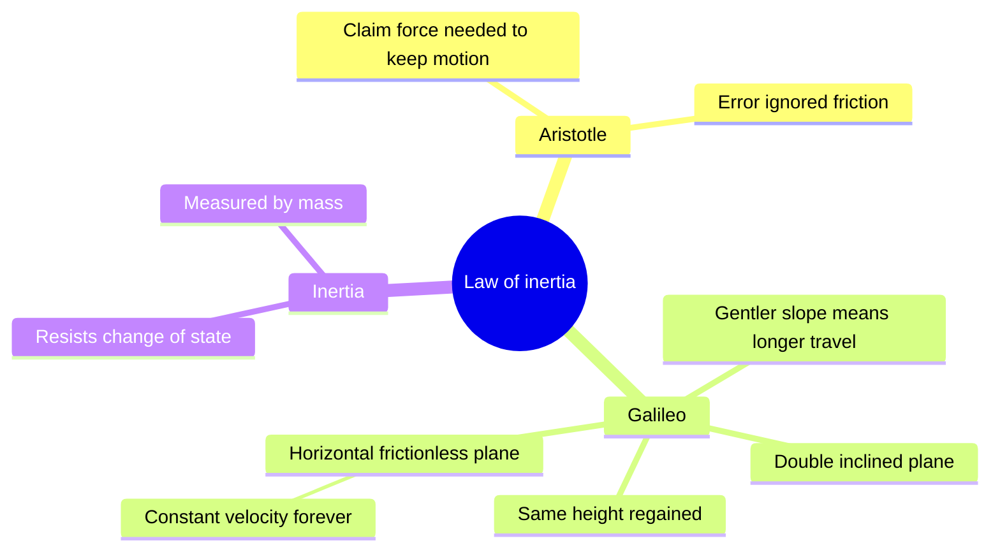
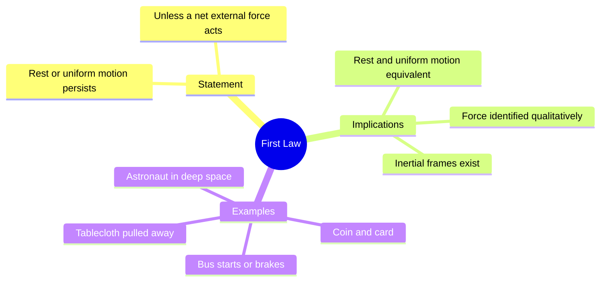
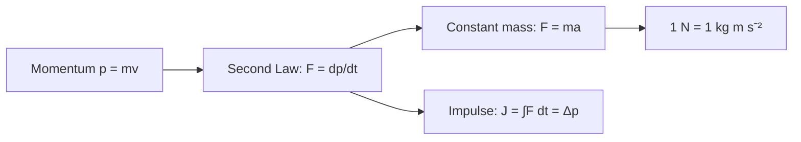
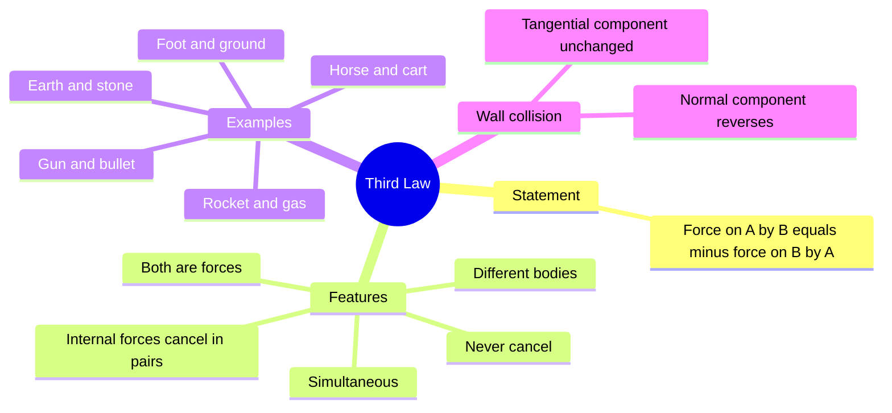
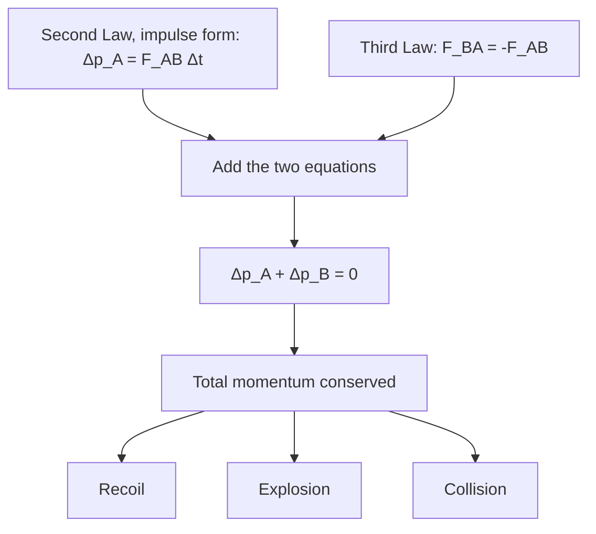
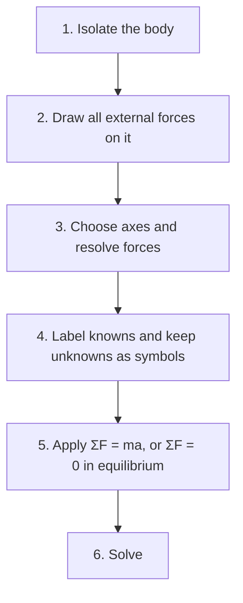
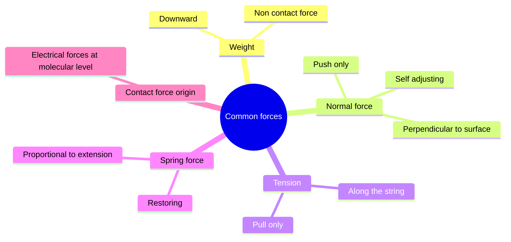
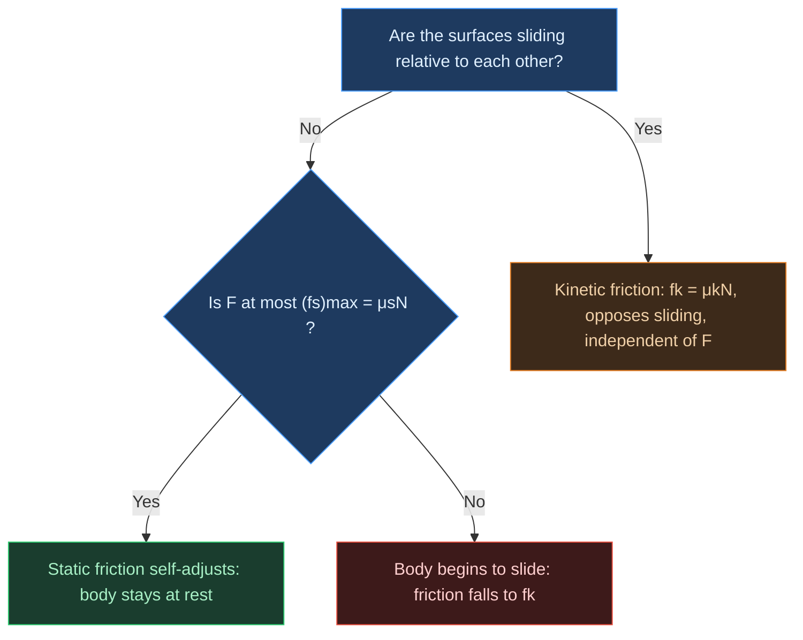
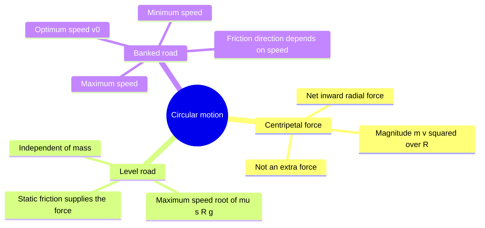
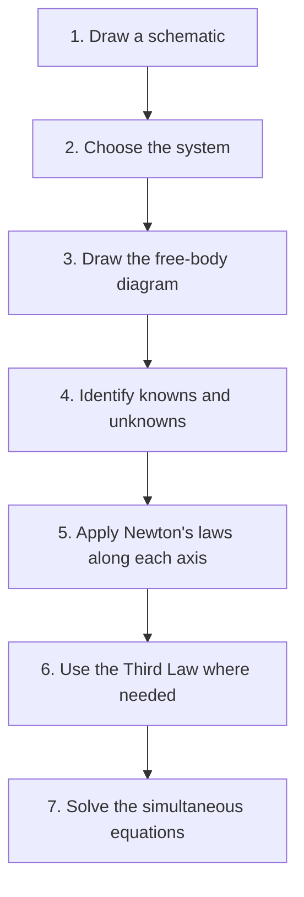

# Physics | Chapter 04 | Laws of Motion | CNOTES
> **Condensed Notes** | Board · NEET · JEE

---

## 1. Aristotle's Fallacy and the Law of Inertia

### 1.1 Aristotle's View

- **Aristotle's law** — a force is needed to keep a body in motion.
- The claim matches everyday experience: a toy car and a rolling ball both stop.
- Error: friction and air resistance were overlooked as opposing forces.
- Friction is a separate force that opposes motion.
- Aristotle confused the force to overcome friction with the force to sustain motion.
- Trap: a body needs no net force to *continue* moving (§1.2).

### 1.2 Galileo's Correction: The Law of Inertia

- A ball rolling down an incline speeds up.
- A ball rolling up an incline slows down.
- A ball on a horizontal frictionless plane keeps constant velocity.
- Double incline without friction: the ball rises to the same height on the opposite incline.
- The height regained is independent of the slope of the second incline.
- Gentler second slope: longer distance to regain the height.
- Horizontal second plane: height never regained.
- Limit: constant velocity forever.
- Idealisation: real balls stop as friction and air resistance are never zero.
- Smaller resistive forces: motion closer to constant velocity.
- **Law of inertia** — a body needs no net force to continue at rest or in uniform motion.
- **Inertia** — the property of resisting any change in the state of rest or uniform motion in a straight line.
- Measure of inertia: mass.
- Trap: rest is not a "more natural" state than uniform motion (§2.2).

---

## 2. Newton's First Law of Motion

### 2.1 Statement

- A body stays at rest or in uniform straight-line motion unless a net external force acts on it.
- Symbolic form: $\Sigma\mathbf F = 0 \Rightarrow \mathbf a = 0$ (in an inertial frame).

### 2.2 Implications

- Rest and uniform motion: both have $a = 0$.
- Both need zero net force.
- **Force** — the external agency that changes or tends to change the state of rest or uniform motion.
- The Second Law makes force quantitative (§3.2).
- **Inertial frame** — a frame where a body under no net force moves with constant velocity.
- Any non-rotating frame in uniform translation relative to an inertial frame is also inertial.
- The Earth's surface is inertial to good approximation for this chapter.
- Newton's laws in the usual form hold only in inertial frames.
- **Pseudo force** — an extra force added in an accelerating frame.
- Pseudo forces are not used in this chapter.
- Car at constant velocity: driving force balances air drag and rolling resistance.
- The driving force is static friction of the road on the driven wheels (§8.7).
- Trap: $F = 0$ gives $a = 0$ only within an inertial frame (§2.2).
- The First Law adds that inertial frames exist.
- Trap: the First Law is more than a special case of the Second Law (§2.2).

### 2.3 Examples of the First Law in Daily Life

| Situation | Inertia shown |
|:---|:---|
| Passenger thrown backward when a bus starts | Inertia of rest |
| Passenger thrown forward when a bus brakes | Inertia of motion |
| Tablecloth pulled away from dishes | Dishes stay at rest if the pull is fast |
| Card flicked from under a coin over a glass | Coin stays in place and drops into the glass |
| Astronaut after engines shut off | Constant velocity continues |

---

## 3. Momentum and Newton's Second Law

### 3.1 Momentum

- **Momentum** — $\mathbf p = m\mathbf v$.
- Vector quantity along the velocity.
- SI unit: kg m s⁻¹ = N s.
- Dimensional formula: [MLT⁻¹].
- Truck harder to stop than bicycle at the same speed: mass matters.
- Bullet pierces easily at high speed: speed matters.
- Same force for the same time on a heavy or light body gives the same $\Delta p$.
- Stone whirled at constant speed: $|\mathbf p| = mv$ constant.
- The momentum vector rotates continuously.
- Tension is perpendicular to the velocity.
- Tension does no work and changes direction only.
- Force is the rate of change of the momentum *vector*.
- Trap: constant $|\mathbf p|$ does not mean constant $\mathbf p$ (§3.1).

### 3.2 Newton's Second Law: Statement

- The rate of change of momentum is proportional to the net external force.
- The change takes place in the direction of the force.
- $\mathbf F = k\,d\mathbf p/dt$.
- $k = 1$ defines the SI unit of force.
- Constant mass: $\mathbf F = d\mathbf p/dt = m\mathbf a$.
- Same force: larger mass gives smaller acceleration.
- Mass measures inertia.
- **Newton** — force that gives 1 kg an acceleration of 1 m s⁻².
- $1\ \text{N} = 1\ \text{kg m s}^{-2}$.
- Dimensional formula of force: [MLT⁻²].

### 3.3 Key Points About the Second Law

- Consistency with the First Law: $F = 0 \Rightarrow dp/dt = 0 \Rightarrow p$ constant $\Rightarrow a = 0$ (constant mass).
- Vector law: $F_x = ma_x$, $F_y = ma_y$, $F_z = ma_z$.
- A force along $x$ changes only the $x$-component of velocity.
- Projectile: horizontal velocity stays constant under vertical gravity.
- Local relation: the force at an instant fixes the acceleration at that instant.
- Example: a stone released from an accelerating train has no horizontal force (air resistance neglected).
- $\mathbf F$ is the net external force.
- Internal forces are excluded.
- System of total mass $M$: $\mathbf F_\text{ext} = M\mathbf a_\text{cm}$.
- Trap: $ma$ is not a force (§3.3).
- Never draw $ma$ on an FBD.
- Trap: $v = 0$ does not mean $F = 0$ (§3.3).
- At the top of a vertical throw: $F = mg$ and $a = g$.
- Trap: force need not point along the velocity (§3.3).

### 3.4 Impulse

- **Impulse** — $\mathbf J = \int \mathbf F\,dt = \Delta\mathbf p$.
- Constant or average force: $\mathbf J = \mathbf F\Delta t$.
- SI unit: N s = kg m s⁻¹.
- Dimensional formula: [MLT⁻¹].
- Same dimensions as momentum.
- Different dimensions from force.
- Useful when $F$ and $\Delta t$ are unknown and $\Delta p$ is measurable.
- Catching a ball: hands drawn back give larger $\Delta t$.
- Larger $\Delta t$ gives smaller average force for the same $\Delta p$.
- **Impulsive force** — a large force acting for a very short time.
- An impulsive force is not a new kind of force.
- Trap: impulse is a change in momentum, not momentum itself (§3.4).

### 3.5 Solved Examples

- Bullet (Ex 4.2): $m = 0.04$ kg.
- Speed $u = 90$ m s⁻¹.
- Stopping distance $d = 0.6$ m.
- $a = -u^2/2d = -6750$ m s⁻².
- $F = ma = 270$ N.
- Check: $Ft \approx 3.6$ N s equals $mu$.
- Batsman (Ex 4.4): $m = 0.15$ kg.
- Velocity changes from $-12$ to $+12$ m s⁻¹.
- $J = \Delta p = 3.6$ N s.
- Full reversal at speed $u$: $|\Delta p| = 2mu$.
- Stopping from speed $u$: $|\Delta p| = mu$.

---

## 4. Newton's Third Law of Motion

### 4.1 Statement

- Forces occur in pairs.
- The two forces are equal in magnitude and opposite in direction.
- $\mathbf F_{AB} = -\mathbf F_{BA}$.
- $\mathbf F_{AB}$ is the force *on* A *by* B.

### 4.2 Critical Features of the Third Law

- "Action" and "reaction" both mean forces.
- Neither force comes first.
- Neither force causes the other.
- The two act simultaneously.
- The two act on different bodies.
- The two never cancel each other.
- For the motion of A, only the force on A counts.
- Holds for contact forces: normal, friction, tension, spring.
- Holds for gravity and electrostatic forces.
- Forces between moving charges need field momentum counted.
- That case is beyond this chapter.
- Internal forces cancel in pairs within a system.
- The Second Law for a system uses only external forces.

### 4.3 Examples of the Third Law

| Action | Reaction |
|:---|:---|
| Earth pulls stone down | Stone pulls Earth up with equal magnitude |
| Horse pulls cart forward | Cart pulls horse backward |
| Foot pushes ground backward | Ground pushes foot forward (friction) |
| Rocket pushes gas backward | Gas pushes rocket forward |
| Compressed spring pushes hand | Hand pushes spring |
| Gun pushes bullet forward | Bullet pushes gun backward (recoil) |

- Cart: net force = horse's pull minus resistance on the cart.
- Horse: net force = ground's static friction on the hooves minus the cart's pull.
- The two Third-Law partners never appear together in one body's equation.
- Trap: action and reaction do not cancel (§4.3).
- They act on different bodies.

### 4.4 Solved: Billiard Balls (NCERT Example 4.5)

- Wall assumed smooth.
- Ball speed unchanged on rebound.
- Only the normal component of velocity reverses.
- The tangential component ($p_y$) is unchanged.
- Impulse and force on the wall stay normal in both cases.
- (a) Normal strike: impulse on ball $= 2mu$.
- (b) Strike at 30° to the normal: impulse $= 2mu\cos 30°$.
- Ratio $J_a/J_b = 1/\cos 30° = 2/\sqrt{3} \approx 1.15$.
- Grazing incidence: impulse tends to zero.
- Trap: the force on the wall is not tilted at 30° (§4.4).

---

## 5. Conservation of Momentum

### 5.1 Derivation from the Second and Third Laws

- Bodies A and B interact for time $\Delta t$.
- No other external force acts on the pair.
- $\Delta\mathbf p_A = \mathbf F_{AB}\Delta t$.
- $\Delta\mathbf p_B = \mathbf F_{BA}\Delta t = -\mathbf F_{AB}\Delta t$.
- Sum: $\Delta\mathbf p_A + \Delta\mathbf p_B = 0$.
- Result: $\mathbf p_A' + \mathbf p_B' = \mathbf p_A + \mathbf p_B$.
- Momentum lost by one body equals momentum gained by the other.

### 5.2 Statement

- The total momentum of an isolated system is constant.
- $\sum\mathbf p_i = \text{constant}$ when $\sum\mathbf F_\text{ext} = 0$.
- **Isolated system** — net external force is zero.
- Component form: conserved along any direction where the net external force component is zero.
- Momentum is conserved in elastic and inelastic collisions.
- Kinetic energy is conserved only in elastic collisions.

### 5.3 Applications

- **Recoil**: initial total momentum is zero.
- Final total momentum stays zero.
- $m_\text{gun}v_\text{gun} + m_\text{bullet}v_\text{bullet} = 0$.
- $v_\text{gun} = -(m_\text{bullet}/m_\text{gun})\,v_\text{bullet}$ (velocities relative to the ground).
- Heavy gun: small recoil speed.
- Frictionless horizontal surface: gravity and normal force cancel.
- Horizontal momentum is then conserved.
- **Explosion**: momentum after equals momentum before.
- Body initially at rest: fragment momenta sum to zero.
- **Collision**: $m_A\mathbf v_A + m_B\mathbf v_B = m_A\mathbf v_A' + m_B\mathbf v_B'$.

---

## 6. Equilibrium of a Particle

### 6.1 Definition

- Mechanical equilibrium: net external force on a particle is zero.
- $\sum\mathbf F = 0 \Leftrightarrow \mathbf a = 0$.
- Static equilibrium: at rest.
- Dynamic equilibrium: uniform linear motion.
- Rotational equilibrium of extended bodies: not covered.

### 6.2 Conditions for Equilibrium

- Two forces: equal and opposite, $\mathbf F_1 = -\mathbf F_2$.
- Three or more concurrent forces: vector sum is zero.
- Three forces: $\sum F_x = 0$ and $\sum F_y = 0$.
- Graphical: head-to-tail vectors form a closed triangle.
- $n$ forces: closed polygon.

### 6.3 Free-Body Diagram (FBD)

- **FBD** — one isolated body with all external forces on it.
- Forces the body exerts on others are not drawn.
- Forces to draw:
  - Weight $mg$ downward
  - Normal force $N$ perpendicular to the surface (a push)
  - Tension $T$ along the rope (a pull)
  - Friction $f$ along the surface (opposes relative motion)
  - Applied forces
- Choose axes convenient for the motion (along and perpendicular to an incline).
- Label knowns.
- Leave unknowns as symbols.
- Apply $\sum F_x = ma_x$ and $\sum F_y = ma_y$.
- Trap: never draw the forces the body exerts on others (§6.3).
- Trap: never draw Third-Law partners, a "centripetal force" or $ma$ (§6.3, §9.1).

### 6.4 Solved: Rope with a Horizontal Force (NCERT Example 4.6)

- Given: 6 kg mass.
- Horizontal force at the midpoint $P$: 50 N.
- $g = 10$ m s⁻².
- Lower rope is vertical.
- $T_2 = mg = 60$ N.
- At $P$: $T_1\cos\theta = 60$ N and $T_1\sin\theta = 50$ N.
- $\tan\theta = 5/6$.
- $\theta \approx 40°$ (upper half, from the vertical).
- $T_1 = \sqrt{60^2 + 50^2} \approx 78$ N.
- $\theta$ is independent of the rope's length.

### 6.5 Solved: Weight Hung from Two Strings

- Given: $W = 200$ N.
- Strings at $30°$ and $45°$ above the horizontal.
- Horizontal: $T_1\cos 30° = T_2\cos 45°$.
- Vertical: $T_1\sin 30° + T_2\sin 45° = 200$.
- $T_2 = T_1\sqrt{6}/2$.
- $T_1 = 200(\sqrt{3} - 1) \approx 146.4$ N.
- $T_2 \approx 179.3$ N.
- **Lami's theorem** — three concurrent forces in equilibrium: each is proportional to the sine of the angle between the other two.
- Included angles here: $135°$, $120°$, $105°$.
- Included angles sum to $360°$.
- $200/\sin 105° \approx 207.1$ N gives the same $T_1$ and $T_2$.
- Trap: included angles not summing to $360°$ mean a mislabelled angle (§6.5).

---

## 7. Common Forces in Mechanics

### 7.1 Gravitational Force (Weight)

- $\mathbf W = m\mathbf g$.
- Acts vertically downward.
- Non-contact force.
- $g \approx 9.8$ m s⁻².
- Use $g = 10$ m s⁻² in numericals unless stated.
- $g$ varies slightly with location.
- Dimensional formula of weight: [MLT⁻²].
- Mass: measure of inertia.
- Mass is a property of the body.
- Weight: a force.
- Weight depends on $g$.

### 7.2 Normal Force ($N$)

- Component of the contact force perpendicular to the surfaces.
- Acts away from the surface onto the body.
- Push only.
- Self-adjusting up to the breaking point of the surface.
- Not always equal to $mg$.

| Situation | Normal force |
|:---|:---|
| At rest on a horizontal floor | $N = mg$ |
| On an incline at angle $\theta$ | $N = mg\cos\theta$ |
| In a lift accelerating up | $N = m(g + a)$ |
| In a lift accelerating down | $N = m(g - a)$ |
| Free fall | $N = 0$ |

- Table assumes no other force along the normal.
- On an incline: $mg\cos\theta$ is balanced by $N$.
- On an incline: $mg\sin\theta$ acts down the slope.
- Trap: $mg$ and $N$ act on the same body and are not a Third-Law pair (§7.2).
- Partner of $N$: the body's push on the surface.
- Partner of the weight: the body's pull on the Earth.

### 7.3 Tension ($T$)

- Force transmitted along a string, rope, chain or cable under stretch.
- Directed along the string, from the body toward the string.
- Pull only.
- **Ideal string and pulley** — massless string over a massless, frictionless pulley.
- Ideal string and pulley: equal tension throughout.
- String with mass: tension varies along it.
- Inextensible string: connected bodies share speed and acceleration.
- Trap: equal tension needs a massless string and pulley (§7.3).
- Inextensibility gives equal acceleration, not equal tension.

### 7.4 Spring Force (Hooke's Law)

- **Hooke's law** — $F = -kx$.
- $x$: extension ($+$) or compression ($-$) from the natural length.
- Negative sign: restoring force, opposes the displacement.
- Valid for small displacements within the elastic limit.
- **Spring constant** $k$: SI unit N m⁻¹.
- Dimensional formula of $k$: [MT⁻²].
- Larger $k$: stiffer spring.

### 7.5 Microscopic Origin of Contact Forces

- All contact forces originate in electrical forces.
- The forces act between charged constituents of matter.
- Macroscopically they are treated empirically: normal force, friction and so on.

---

## 8. Friction

### 8.1 What is Friction?

- **Friction** — component of the contact force parallel to the surfaces.
- Friction opposes actual or impending relative motion.
- Opposes relative motion, not absolute motion.
- Box in an accelerating train: static friction accelerates it with the train.
- Origin: molecular adhesion at microscopic contact patches.
- Origin: deformation of the surfaces.
- Friction is not a fundamental force.
- The laws of friction are empirical.
- Static regime: friction follows the applied force up to the limit.
- Sliding regime: friction is fixed at $\mu_k N$.

### 8.2 Static Friction ($f_s$)

- Opposes impending relative motion.
- Acts whenever there is a tendency to slide.
- Self-adjusting: equals $F$ for a simple push.
- Self-adjusting: equals $ma$ for a box in an accelerating train.
- $f_s \le \mu_s N$.
- $(f_s)_\text{max} = \mu_s N$.
- $(f_s)_\text{max}$ is called limiting friction.
- $\mu_s$: dimensionless.
- $\mu_s$ depends on the surface pair and its condition.
- $\mu_s$ does not depend on contact area.

### 8.3 Kinetic (Sliding) Friction ($f_k$)

- Opposes actual sliding.
- $f_k = \mu_k N$.
- $\mu_k$ is generally less than $\mu_s$ for a given pair.
- Trap: $\mu_k < \mu_s$ is an empirical tendency, not a law (§8.3).
- Friction force is proportional to $N$.
- $\mu$ itself is approximately independent of $N$.
- Independent of contact area.
- Nearly independent of sliding speed at moderate speeds.
- Graph of $f$ against $F$: line $f = F$ up to $\mu_s N$.
- Then a drop to the plateau $f = \mu_k N$.
- The drop is a step.
- Friction does not taper off.

### 8.4 Comparison: Static vs Kinetic Friction

| Feature | Static friction | Kinetic friction |
|:---|:---|:---|
| Acts when | No relative sliding | Surfaces slide |
| Opposes | Impending motion | Actual motion |
| Magnitude | $0$ to $\mu_s N$ | Fixed at $\mu_k N$ |
| Nature | Self-adjusting | Constant for given $N$ |
| Coefficient | $\mu_s$ | $\mu_k$, generally below $\mu_s$ |

### 8.5 Angle of Friction and Angle of Repose

- **Angle of friction** $\lambda$ — angle between the normal and the resultant $R$ of $N$ and $(f_s)_\text{max}$.
- $\tan\lambda = (f_s)_\text{max}/N = \mu_s$.
- **Angle of repose** $\theta_r$ — steepest incline where a body still rests without sliding.
- Block at rest on incline: $N = mg\cos\theta$.
- Block at rest on incline: $f_s = mg\sin\theta$.
- Rest requires $\tan\theta \le \mu_s$.
- $\mu_s = \tan\theta_r$.
- $\theta_r = \lambda$.
- $\theta_r$ is independent of mass.
- $\theta > \theta_r$: the body slides.
- Trap: $\tan\lambda = (f_s)_\text{max}/N$, never $f_s/N$ (§8.5).

### 8.5a Block on an Incline: Rest, Limit and Sliding

- $N = mg\cos\theta$ in every case.

| Case | Friction | Motion |
|:---|:---|:---|
| $\theta < \theta_r$ | $f_s = mg\sin\theta$ (below the maximum) | At rest |
| $\theta = \theta_r$ | $(f_s)_\text{max} = \mu_s mg\cos\theta = mg\sin\theta$ | On the verge of sliding |
| $\theta > \theta_r$ | $f_k = \mu_k mg\cos\theta$, up the incline | Slides down |

- Sliding: $a = g(\sin\theta - \mu_k\cos\theta)$ down the incline.
- $a$ is independent of mass.
- $a > 0$ as $\tan\theta > \mu_s$ exceeds $\mu_k$.

### 8.6 Rolling Friction

- Ideal rolling without slipping: the contact point is at rest relative to the surface.
- No sliding friction acts.
- No energy is lost as sliding heat.
- Static friction may still act on a speeding-up or slowing-down wheel.
- Real rolling: slight deformation of wheel and surface at the contact.
- **Rolling friction** — the resulting small resistance to rolling.
- Rolling friction is much smaller than kinetic friction.
- Replacing sliding by rolling reduces friction: wheels, ball bearings.

### 8.7 Friction: Harmful and Essential

- Harmful: dissipates energy as heat.
- Harmful: wears out parts.
- Reduced by lubricants.
- Reduced by ball bearings.
- Reduced by air cushions.
- Essential: walking.
- Essential: starting, turning and braking vehicles.
- Essential: gripping and holding objects.
- Essential: brakes in machines.

### 8.8 Solved Examples

- Train (Ex 4.7): $\mu_s = 0.15$.
- $ma = f_s \le \mu_s mg$.
- $a_\text{max} = \mu_s g = 1.5$ m s⁻².
- Result is independent of the box's mass.
- Incline (Ex 4.8): block just slides at $15°$.
- $\mu_s = \tan 15° \approx 0.27$.

---

## 9. Circular Motion

### 9.1 Centripetal Force

- Centripetal acceleration: $v^2/R$, toward the centre.
- $f_c = mv^2/R$.
- **Centripetal force** — the net radially inward force in circular motion.
- Always supplied by a real force.
- Never draw it as a separate force on an FBD.
- Dimensional formula: [MLT⁻²].

| Circular-motion situation | Real force supplying $f_c$ |
|:---|:---|
| Stone on a string, horizontal circle | Tension |
| Planet orbiting the Sun | Gravitational pull |
| Car turning on a level road | Static friction |
| Car on a banked road | Horizontal component of $N$ (plus friction when $v \ne v_0$) |
| Electron around a nucleus (Bohr model) | Electrostatic attraction |
| Roller coaster at the top of a loop | Normal force and weight together |

### 9.2 Motion of a Car on a Level Road

- Forces: weight $mg$ down.
- Forces: normal force $N$ up.
- Forces: friction $f$ horizontal, toward the centre.
- The friction is static: tyres do not slip sideways.
- $N = mg$.
- $f = mv^2/R \le \mu_s mg$.
- $v_\text{max}^{\text{level}} = \sqrt{\mu_s R g}$.
- Independent of the vehicle's mass.
- Above $v_\text{max}^{\text{level}}$: the car skids outward.

### 9.3 Motion of a Car on a Banked Road

- Banking: outer edge higher.
- $N$ gains a horizontal component toward the centre.
- General equations ($f$ positive down the slope): $N\cos\theta = mg + f\sin\theta$.
- General equations: $N\sin\theta + f\cos\theta = mv^2/R$.
- **Optimum speed** ($f = 0$): $v_0 = \sqrt{Rg\tan\theta}$.
- At $v_0$: no sideways friction and no lateral tyre wear.
- Maximum speed (friction down the slope, $f = \mu_s N$): $v_\text{max}^{\text{banked}} = \sqrt{Rg\,\dfrac{\tan\theta + \mu_s}{1 - \mu_s\tan\theta}}$.
- Valid when $\mu_s\tan\theta < 1$.
- If $\mu_s\tan\theta \ge 1$: no upper limit.
- Minimum speed (friction up the slope, $f = -\mu_s N$): $v_\text{min}^{\text{banked}} = \sqrt{Rg\,\dfrac{\tan\theta - \mu_s}{1 + \mu_s\tan\theta}}$.
- Valid when $\tan\theta > \mu_s$.
- If $\tan\theta \le \mu_s$: minimum speed is $0$.

| Speed | Friction on the car | Outcome |
|:---|:---|:---|
| $v = v_0$ | None needed | Stays on the curve |
| $v_0 < v \le v_\text{max}^{\text{banked}}$ | Down the slope | Stays on the curve |
| $v_\text{min}^{\text{banked}} \le v < v_0$ | Up the slope | Stays on the curve |
| $v > v_\text{max}^{\text{banked}}$ | Would exceed $\mu_s N$ | Slides outward and up |
| $v < v_\text{min}^{\text{banked}}$ | Would exceed $\mu_s N$ | Slides inward and down |

- $v_\text{max}^{\text{banked}} > v_\text{max}^{\text{level}}$ for the same $R$ and $\mu_s$.
- $\mu_s = 0$: only $v_0$ works.
- Trap: $v_0$ needs no friction and is not the maximum speed (§9.3).

### 9.4 Solved Examples

- Cyclist (Ex 4.10): $v = 18$ km/h $= 5$ m s⁻¹.
- $R = 3$ m.
- $\mu_s = 0.1$.
- $\mu_s R g = 3 < v^2 = 25$.
- The cyclist slips.
- Largest safe speed: $\sqrt{3} \approx 1.7$ m s⁻¹.
- Racetrack (Ex 4.11): $R = 300$ m.
- $\theta = 15°$.
- $\mu_s = 0.2$.
- $g = 9.8$ m s⁻².
- $v_0 \approx 28.1$ m s⁻¹.
- $v_\text{max}^{\text{banked}} \approx 38.1$ m s⁻¹.
- $v_\text{min}^{\text{banked}} \approx 13.8$ m s⁻¹.
- Level-road maximum for comparison: $\approx 24.2$ m s⁻¹.

---

## 10. Solving Problems in Mechanics

### 10.1 Systematic Approach

- Draw a schematic of the whole assembly.
- Choose the system.
- Draw the FBD with all external forces.
- Mark known and unknown quantities.
- Write $\sum F = ma$ along each axis.
- Third Law: force on A by B is equal and opposite to force on B by A.
- Solve the simultaneous equations.

### 10.2 Lift Problems

- **Apparent weight** — the normal force $N$ on the person.
- It is the scale reading.
- Equals $mg$ only when $a = 0$.

| Lift condition | Equation | Apparent weight $N$ | Sensation |
|:---|:---|:---|:---|
| Rest or constant velocity | $N = mg$ | $mg$ | Normal |
| Accelerating upward ($a$) | $N - mg = ma$ | $m(g + a)$ | Heavier |
| Accelerating downward ($a$) | $mg - N = ma$ | $m(g - a)$ | Lighter |
| Free fall ($a = g$) | $mg - N = mg$ | $0$ | Weightless |

- Acceleration direction decides.
- Velocity direction does not decide.
- Lift moving down and slowing: acceleration is upward.
- Then $N > mg$.
- **Weightlessness** — zero apparent weight.
- Gravity has not vanished.
- Body and lift fall with the same acceleration $g$.

### 10.3 Connected Bodies: The Atwood Machine

- Masses $m_1 > m_2$ on an ideal string and pulley.
- Equal tension on both sides.
- Equal acceleration for both masses.
- $m_1 g - T = m_1 a$.
- $T - m_2 g = m_2 a$.
- $a = \dfrac{(m_1 - m_2)g}{m_1 + m_2}$.
- $T = \dfrac{2m_1 m_2 g}{m_1 + m_2}$.
- $m_1 = m_2$: $a = 0$ and $T = mg$.
- $m_2 \to 0$: $a \to g$ and $T \to 0$.

### 10.4 Solved: Block and Iron Cylinder (NCERT Example 4.12)

- Given: 2 kg block and 25 kg cylinder.
- Floor accelerates downward at $0.1$ m s⁻².
- $g = 10$ m s⁻².
- (a) Block alone: $N = 20$ N.
- Block pushes the floor with 20 N downward.
- (b) System of 27 kg: $270 - N' = 27 \times 0.1$.
- $N' = 267.3$ N.
- System pushes the floor with 267.3 N downward (Third Law).
- Check: $N' = m(g - a)$ (§10.2).

---

## Rapid Reference

| Fact | Value |
|:---|:---|
| Momentum | $\mathbf p = m\mathbf v$; kg m s⁻¹; [MLT⁻¹] |
| Second Law | $\mathbf F = d\mathbf p/dt = m\mathbf a$ (constant mass) |
| Newton | $1\ \text{N} = 1\ \text{kg m s}^{-2}$; [MLT⁻²] |
| Impulse | $\mathbf J = \int \mathbf F\,dt = \Delta\mathbf p$; $= \mathbf F\Delta t$ for constant $\mathbf F$; N s; [MLT⁻¹] |
| Third Law | $\mathbf F_{AB} = -\mathbf F_{BA}$ |
| Conservation of momentum | $\sum\mathbf p$ constant when $\sum\mathbf F_\text{ext} = 0$ |
| Gun recoil | $v_\text{gun} = -(m_\text{bullet}/m_\text{gun})\,v_\text{bullet}$ |
| Equilibrium | $\sum\mathbf F = 0$ |
| Lami's theorem | $F_1/\sin\alpha = F_2/\sin\beta = F_3/\sin\gamma$ |
| Weight | $W = mg$; $g \approx 9.8$ m s⁻² (10 in numericals unless stated) |
| Normal force, horizontal floor | $N = mg$ |
| Normal force, incline | $N = mg\cos\theta$ |
| Hooke's law | $F = -kx$; $k$ in N m⁻¹; [MT⁻²] |
| Static friction | $0 \le f_s \le \mu_s N$; $(f_s)_\text{max} = \mu_s N$ |
| Kinetic friction | $f_k = \mu_k N$; $\mu_k$ generally below $\mu_s$ |
| Angle of repose | $\tan\theta_r = \mu_s$ |
| Angle of friction | $\tan\lambda = (f_s)_\text{max}/N = \mu_s$; $\lambda = \theta_r$ |
| Sliding acceleration on incline | $a = g(\sin\theta - \mu_k\cos\theta)$ |
| Centripetal force | $f_c = mv^2/R$ |
| Maximum speed, level road | $v_\text{max}^{\text{level}} = \sqrt{\mu_s R g}$ |
| Optimum speed, banked road | $v_0 = \sqrt{Rg\tan\theta}$ |
| Maximum speed, banked road | $\sqrt{Rg(\tan\theta + \mu_s)/(1 - \mu_s\tan\theta)}$; needs $\mu_s\tan\theta < 1$ |
| Minimum speed, banked road | $\sqrt{Rg(\tan\theta - \mu_s)/(1 + \mu_s\tan\theta)}$; needs $\tan\theta > \mu_s$ |
| Lift accelerating up | $N = m(g + a)$ |
| Lift accelerating down | $N = m(g - a)$ |
| Free fall | $N = 0$ |
| Atwood acceleration | $a = (m_1 - m_2)g/(m_1 + m_2)$ |
| Atwood tension | $T = 2m_1 m_2 g/(m_1 + m_2)$ |
| Ex 4.2 bullet | $F = 270$ N |
| Ex 4.4 batsman | $J = 3.6$ N s |
| Ex 4.5 billiard balls | Impulse ratio $2/\sqrt{3} \approx 1.15$ |
| Ex 4.6 rope | $\theta \approx 40°$ |
| Two strings, $W = 200$ N | $T_1 \approx 146.4$ N; $T_2 \approx 179.3$ N |
| Ex 4.7 train | $a_\text{max} = 1.5$ m s⁻² |
| Ex 4.8 incline | $\mu_s \approx 0.27$ |
| Ex 4.10 cyclist | Slips ($\mu_s R g = 3 < v^2 = 25$) |
| Ex 4.11 racetrack | $v_0 \approx 28.1$ m s⁻¹; $v_\text{max}^{\text{banked}} \approx 38.1$ m s⁻¹ |
| Ex 4.12 block and cylinder | $20$ N; $267.3$ N |