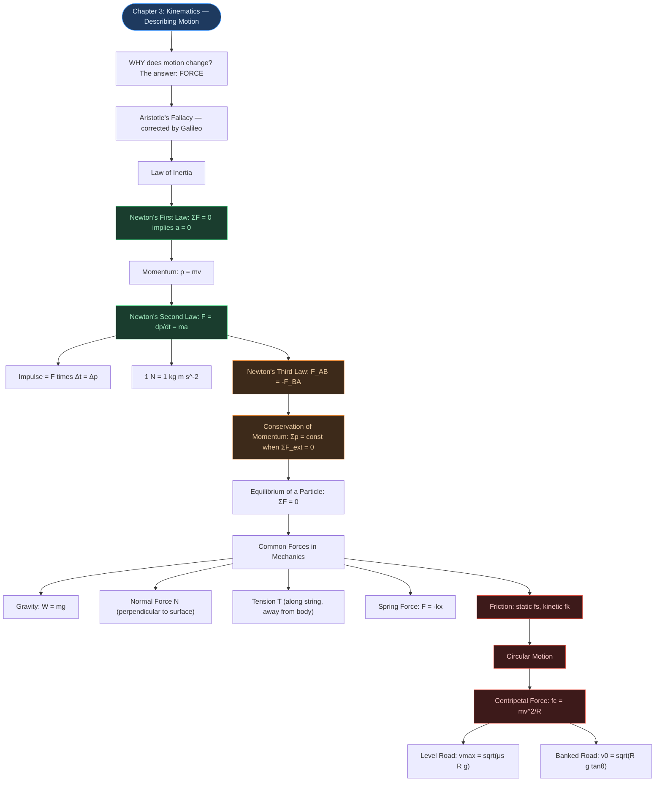

# ⚡ CHAPTER 4 — LAWS OF MOTION
> **Complete Study Notes** | Board · NEET · JEE Layered

---

## 🗺️ CONCEPT ROADMAP



---

## SECTION 1 — ARISTOTLE'S FALLACY AND THE LAW OF INERTIA

### 1.1 Aristotle's (Wrong) View

> **Aristotelian Law of Motion:** An external force is required to keep a body in motion.

**Why it seems right:** A toy car comes to rest once you stop pushing it. A ball rolling on the floor slows down.

**Why it is wrong:** The car and ball slow down because of **friction and air resistance** — opposing forces. If these were absent, no force would be needed to sustain motion.

> [!tip] Aristotle's Error
> He confused the applied force needed to overcome friction with the force needed to sustain motion. He did not account for friction as a separate opposing force.

### 1.2 Galileo's Correction — The Law of Inertia

Galileo studied motion on inclined planes and a double-inclined plane:

* A ball rolling **down** an incline: **accelerates**
* A ball rolling **up** an incline: **decelerates**
* Motion on a **horizontal** frictionless plane: **constant velocity** (neither accelerates nor decelerates)

**Double inclined plane experiment:** A ball released from one incline rises to the same height on the other, regardless of the slope angle. As slope → 0 (horizontal), the ball travels an infinite distance — it never stops.

```tikz
\usetikzlibrary{arrows.meta}
\begin{tikzpicture}[>={Stealth[length=6pt,width=4pt]}, thick, scale=0.78]
  \begin{scope}[yshift=6.6cm]
    \draw[gray!60, dashed] (-0.4,2) -- (4.2,2);
    \draw[line width=1.1pt] (0,2) -- (2,0) -- (3.6,2);
    \draw[gray] (0,0)--(-0.2,-0.22) (0.6,0)--(0.4,-0.22) (1.2,0)--(1.0,-0.22)
                (1.8,0)--(1.6,-0.22) (2.4,0)--(2.2,-0.22);
    \fill[blue!70!black] (0,2) circle (2.5pt);
    \fill[blue!70!black] (3.6,2) circle (2.5pt);
    \draw[->, red!75!black, line width=1.2pt, dashed] (0.35,1.85) to[bend right=20] (2.35,0.15);
    \draw[->, red!75!black, line width=1.2pt, dashed] (1.75,0.1) to[bend left=15] (3.35,1.85);
    \node[below, font=\itshape\small, text=gray] at (1.8,-0.7) {(i) steep slope -- rises to nearly the same height};
  \end{scope}

  \begin{scope}[yshift=3.3cm]
    \draw[gray!60, dashed] (-0.4,2) -- (6.2,2);
    \draw[line width=1.1pt] (0,2) -- (2,0) -- (5.6,2);
    \draw[gray] (0,0)--(-0.2,-0.22) (0.6,0)--(0.4,-0.22) (1.2,0)--(1.0,-0.22)
                (1.8,0)--(1.6,-0.22) (2.4,0)--(2.2,-0.22);
    \fill[blue!70!black] (0,2) circle (2.5pt);
    \fill[blue!70!black] (5.6,2) circle (2.5pt);
    \draw[->, red!75!black, line width=1.2pt, dashed] (0.35,1.85) to[bend right=20] (2.35,0.15);
    \draw[->, red!75!black, line width=1.2pt, dashed] (1.75,0.1) to[bend left=8] (5.35,1.85);
    \node[below, font=\itshape\small, text=gray] at (2.8,-0.7) {(ii) gentler slope -- same height, longer distance};
  \end{scope}

  \begin{scope}[yshift=0cm]
    \draw[line width=1.1pt] (0,2) -- (2,0) -- (7.4,0);
    \draw[gray] (0,0)--(-0.2,-0.22) (0.6,0)--(0.4,-0.22) (1.2,0)--(1.0,-0.22)
                (1.8,0)--(1.6,-0.22) (2.4,0)--(2.2,-0.22)
                (3.0,0)--(2.8,-0.22) (3.6,0)--(3.4,-0.22);
    \fill[blue!70!black] (0,2) circle (2.5pt);
    \draw[->, red!75!black, line width=1.2pt, dashed] (0.35,1.85) to[bend right=20] (2.35,0.15);
    \draw[->, red!75!black, line width=1.2pt, dashed] (2.2,0.08) -- (7.1,0.08);
    \node[right, font=\small, red!75!black] at (7.1,0.08) {$v=\text{const}$};
    \node[below, font=\itshape\small, text=gray] at (2.8,-0.7) {(iii) horizontal, frictionless -- motion never ceases};
  \end{scope}
\end{tikzpicture}
```

As the second slope is made gentler (rows i → iii), the ball must travel farther to climb back to the same height — in the limiting horizontal case it never stops at all. This progression is the experimental seed of the law of inertia.

> [!important] Galileo's Conclusion — The Law of Inertia
> The natural state of a body (rest OR uniform motion) does NOT require a net force to sustain it. A body resists any change in its state — this property is called **INERTIA**.
>
> **Inertia** = the inherent tendency of a body to **resist any change** in its state of rest or of uniform motion.

---

## SECTION 2 — NEWTON'S FIRST LAW OF MOTION ⭐

### 2.1 Statement

> **Every body continues to be in its state of rest or of uniform motion in a straight line unless compelled by some external force to act otherwise.**

**Equivalent simple form:**

$$\sum \mathbf{F} = 0 \implies \mathbf{a} = 0$$

### 2.2 Implications

* State of rest (v = 0) and state of uniform motion (v = constant ≠ 0) are **physically equivalent** — both have zero acceleration, both require zero net force.
* A body at rest is NOT in a "more natural" state than a body in uniform motion.
* **First Law defines Force:** Force is that external cause which changes (or tends to change) the state of rest or uniform motion of a body.
* **First Law defines Inertial Frame:** A reference frame in which the First Law holds is called an **inertial frame of reference**.

```tikz
\usetikzlibrary{arrows.meta}
\begin{tikzpicture}[>={Stealth[length=7pt,width=5pt]}, thick, scale=1.0]
  \begin{scope}
    \draw[line width=1pt] (-0.6,0) -- (3.0,0);
    \draw[gray] (-0.4,0)--(-0.6,-0.25) (0.2,0)--(0.0,-0.25) (0.8,0)--(0.6,-0.25)
                (1.4,0)--(1.2,-0.25) (2.0,0)--(1.8,-0.25) (2.6,0)--(2.4,-0.25);
    \draw[fill=blue!15] (0.6,0) rectangle (1.8,0.5);
    \draw[->, green!45!black, line width=1.6pt] (1.2,0.5) -- (1.2,1.5) node[above, font=\small] {$N$};
    \draw[->, red!70!black, line width=1.6pt] (1.2,0.25) -- (1.2,-0.9) node[below, font=\small] {$mg$};
    \node[below, font=\itshape\small, text=gray] at (1.2,-1.4) {(a) book at rest: $N=mg$, $\Sigma F=0$};
  \end{scope}

  \begin{scope}[xshift=5.6cm]
    \draw[line width=1pt] (-0.6,0) -- (3.6,0);
    \draw[gray] (-0.4,0)--(-0.6,-0.25) (0.2,0)--(0.0,-0.25) (0.8,0)--(0.6,-0.25)
                (1.4,0)--(1.2,-0.25) (2.0,0)--(1.8,-0.25) (2.6,0)--(2.4,-0.25) (3.2,0)--(3.0,-0.25);
    \draw[fill=blue!15] (0.4,0.45) rectangle (2.4,1.0);
    \draw[fill=blue!5] (0.6,0.15) circle (0.28);
    \draw[fill=blue!5] (2.2,0.15) circle (0.28);
    \draw[->, orange!80!black, line width=1.7pt] (2.6,0.7) -- (3.6,0.7) node[right, font=\small] {$v=\text{const}$};
    \node[below, font=\itshape\small, text=gray] at (1.4,-0.6) {(b) car at uniform velocity: net force zero};
  \end{scope}
\end{tikzpicture}
```

In (a) the book has no motion at all; in (b) the car has plenty of motion but no *change* in velocity — by the First Law, both situations are governed by the same condition, $\Sigma F = 0$. In (b) that zero is not "no forces" but a cancellation: the engine's forward thrust (via friction, §4.9.1) exactly balances resistive friction and drag.

### 2.3 Examples of First Law in Daily Life

| Situation | Explanation |
|:---|:---|
| Passenger thrown backward when bus starts | Passenger's body tends to remain at rest (inertia of rest) while floor moves forward |
| Passenger thrown forward when bus brakes | Body tends to continue moving forward (inertia of motion) |
| Tablecloth pulled away from dishes | Dishes tend to remain at rest (inertia) if pulled fast enough |
| Coin falls into glass when card is flicked | Coin's inertia of rest keeps it stationary; card moves away |
| Astronaut in deep space, rockets off | Continues with constant velocity (no net force) |

> [!warning] Exam Note
> The First Law is NOT merely a special case of the Second Law. It independently defines the concept of force and the concept of an inertial frame of reference.

---

## SECTION 3 — MOMENTUM AND NEWTON'S SECOND LAW ⭐⭐

### 3.1 Momentum

> [!info] Definition
> **Momentum (p)** of a body is the product of its **mass** and **velocity**.

$$\mathbf{p} = m\mathbf{v} \quad \text{...(4.1)}$$

* **Vector quantity** — same direction as velocity
* SI unit: **kg m s⁻¹** = **N s**
* Dimensional formula: **[MLT⁻¹]**

**Why momentum matters — Common Experiences:**

| Observation | What it shows |
|:---|:---|
| Truck harder to stop than bicycle at same speed | Mass matters |
| Bullet easily pierces tissue at high speed; barely at low speed | Speed matters |
| Cricketer pulls hands back to catch | Slower deceleration → less force |
| Same force applied to heavy and light bodies for same time → same Δp | Momentum is the key quantity |

**Momentum is a vector — force can change its direction even when its magnitude is fixed.** A stone whirled at uniform speed in a horizontal circle has constant $|\mathbf{p}| = mv$, yet the tension in the string is doing real work turning it: it redirects $\mathbf{p}$ continuously.

```tikz
\usetikzlibrary{arrows.meta}
\begin{tikzpicture}[>={Stealth[length=7pt,width=5pt]}, thick, scale=1.0]
  \draw[gray!60] (0,0) circle (2);
  \coordinate (O) at (0,0);
  \coordinate (P1) at (2,0);
  \coordinate (P2) at (0,2);
  \fill[black] (O) circle (1.5pt);
  \node[below left, font=\small] at (O) {hand};
  \draw[line width=0.9pt] (O) -- (P1);
  \draw[line width=0.9pt] (O) -- (P2);
  \fill[blue!70!black] (P1) circle (3pt);
  \fill[blue!70!black] (P2) circle (3pt);
  \draw[->, orange!80!black, line width=1.6pt] (P1) -- ++(0,1.1) node[above, font=\small] {$\mathbf{p}_1=m\mathbf{v}_1$};
  \draw[->, orange!80!black, line width=1.6pt] (P2) -- ++(-1.1,0) node[left, font=\small] {$\mathbf{p}_2=m\mathbf{v}_2$};
  \draw[->, red!75!black, line width=1.4pt] (P1) -- ++(-0.85,0) node[midway, above, font=\small, red!75!black] {$T$};
  \draw[->, red!75!black, line width=1.4pt] (P2) -- ++(0,-0.85) node[midway, right, font=\small, red!75!black] {$T$};
  \node[below, font=\itshape\small, text=gray] at (0,-2.6) {tension $T$ is always along the string, toward the centre -- it changes the direction of $\mathbf{p}$, not its magnitude};
\end{tikzpicture}
```

$|\mathbf{p}_1| = |\mathbf{p}_2|$ (same speed), but $\mathbf{p}_1 \ne \mathbf{p}_2$ as vectors — the tension $T$ is what produces this rotation. This is exactly the observation Newton generalises: force is proportional to the rate of change of the momentum *vector*, not just of speed.

### 3.2 Newton's Second Law — Statement

> [!important] Newton's Second Law
> The rate of change of momentum of a body is directly proportional to the applied force and takes place in the direction in which the force acts.

$$\mathbf{F} \propto \frac{\Delta \mathbf{p}}{\Delta t} \implies \mathbf{F} = k\frac{d\mathbf{p}}{dt}$$

Taking k = 1 (defines the SI unit of force):

$$\boxed{\mathbf{F} = \frac{d\mathbf{p}}{dt} = m\mathbf{a}} \quad \text{...(4.5)}$$

(for a body of fixed mass m)

**SI Unit of Force:** 1 Newton (N) = force that produces an acceleration of 1 m s⁻² in a body of mass 1 kg.

$$1 \text{ N} = 1 \text{ kg m s}^{-2} \quad \text{Dimensional formula: [MLT}^{-2}\text{]}$$

### 3.3 Key Points About the Second Law

**1. Consistency with First Law:** $F = 0 \implies dp/dt = 0 \implies p = \text{const} \implies a = 0$. Fully consistent. ✓

**2. It is a Vector Law:** Equivalent to three scalar equations:

$$F_x = ma_x \qquad F_y = ma_y \qquad F_z = ma_z \quad \text{...(4.6)}$$

A force along x changes only the x-component of velocity; y and z components remain unchanged. This is why horizontal velocity of a projectile stays constant under vertical gravity.

**3. It is a Local Relation:** Force F at a point **at a certain instant** determines acceleration a at that **same point at the same instant**. No "memory" of past motion.

> [!tip] Classic Example
> The moment a stone is released from an accelerated train, it has no horizontal force (if air resistance neglected). Its past horizontal acceleration is irrelevant.

**4. F is the Net External Force:** F = vector sum of ALL external forces on the body. Internal forces do not count.

**5. Applicable to systems:** Law applies to a particle AND to a rigid body or system of particles, where F = total external force and a = acceleration of centre of mass.

### 3.4 Impulse ⭐

When a **large force** acts for a **very short time** (bat hitting ball, hammer striking nail):

$$\text{Impulse} = \mathbf{F} \times \Delta t = \Delta \mathbf{p} \quad \text{...(4.7)}$$

* SI unit: **N s** = **kg m s⁻¹**
* Dimensional formula: **[MLT⁻¹]** (same as momentum)
* **Impulse = Change in momentum** — measurable even when F and Δt are individually unknown

> [!tip] Why a cricketer draws hands back while catching
> By increasing Δt of contact, the same Δp (impulse) is achieved with a **smaller force** F. This prevents injury.

> [!warning] Impulsive Force
> Impulsive force is NOT a new type of force. It is simply a large force acting for a short time. Newtonian mechanics treats it exactly like any other force.

### 3.5 Solved Examples

> [!example] NCERT Example 4.2 — Bullet stopped in barrel
> Bullet: $m = 0.04$ kg, $u = 90$ m s⁻¹, stopped in $d = 0.6$ m.
>
> $$a = \frac{-u^2}{2s} = \frac{-(90)^2}{2 \times 0.6} = -6750 \text{ m s}^{-2}$$
>
> $$F = ma = 0.04 \times 6750 = \mathbf{270 \text{ N}} \text{ (average resistive force)}$$

> [!example] NCERT Example 4.4 — Batsman hits ball
> Ball: $m = 0.15$ kg, velocity reversed from $-12$ m s⁻¹ to $+12$ m s⁻¹.
>
> $$\text{Impulse} = \Delta p = m(v - u) = 0.15 \times (12 - (-12)) = \mathbf{3.6 \text{ N s}}$$

---

## SECTION 4 — NEWTON'S THIRD LAW OF MOTION ⭐⭐

### 4.1 Statement

> [!important] Newton's Third Law
> To every action, there is always an equal and opposite reaction.
>
> More precisely: **Forces always occur in pairs. The force on body A by body B is equal and opposite to the force on body B by A.**
>
> $$\mathbf{F}_{AB} = -\mathbf{F}_{BA} \quad \text{...(4.8)}$$

### 4.2 Critical Features of the Third Law

**1. "Action" and "Reaction" are forces:** The words are misleading — neither precedes the other. Both forces act **simultaneously**. No cause-effect relation is implied. Either force can be labelled action.

**2. Action and Reaction act on DIFFERENT bodies:** They act on different bodies, so they **never cancel each other**. When considering the motion of body A, only $F_{BA}$ (force ON A by B) is relevant. Adding $F_{AB}$ to it is a conceptual error.

**3. Holds for all types of forces:** Contact forces (normal, friction, tension) AND non-contact forces (gravity, magnetic) all obey the Third Law.

**4. Internal forces cancel in pairs:** Within a system of particles, all action-reaction pairs between particles within the system sum to zero. The Second Law for the system uses only external forces.

### 4.3 Examples of Third Law

| Action | Reaction |
|:---|:---|
| Earth pulls stone downward (gravity) | Stone pulls Earth upward (same magnitude, Earth barely moves) |
| Horse pulls cart forward | Cart pulls horse backward |
| Foot pushes ground backward | Ground pushes foot forward (friction → walking is possible) |
| Rocket expels gas backward | Gas pushes rocket forward |
| Compressed spring pushes hand | Hand pushes spring |
| Gun exerts forward force on bullet | Bullet exerts backward force on gun (recoil) |

> [!warning] Classic Misconception
> "Action and reaction cancel → nothing can move." WRONG — they act on DIFFERENT bodies. For motion of any one body, only the force ON THAT BODY matters.

### 4.4 Solved: Billiard Balls (NCERT Example 4.5)

```tikz
\usetikzlibrary{arrows.meta}
\begin{tikzpicture}[>={Stealth[length=7pt,width=5pt]}, thick, scale=0.95]
  \begin{scope}
    \draw[line width=1.6pt] (3,-1.6) -- (3,1.6);
    \draw[gray] (3,1.6)--(3.25,1.85) (3,1.1)--(3.25,1.35) (3,0.6)--(3.25,0.85)
                (3,0.1)--(3.25,0.35) (3,-0.4)--(3.25,-0.15) (3,-0.9)--(3.25,-0.65)
                (3,-1.4)--(3.25,-1.15);
    \draw[->, blue!70!black, line width=1.6pt] (0,0.15) -- (2.85,0.15) node[midway, above, font=\small] {$u$};
    \draw[->, green!45!black, line width=1.6pt] (2.85,-0.15) -- (0,-0.15) node[midway, below, font=\small] {$u$};
    \draw[->, red!75!black, line width=1.7pt] (3,-0.9) -- (3.8,-0.9) node[right, font=\small, red!75!black] {$F_{wall}$};
    \node[below, font=\itshape\small, text=gray] at (1.4,-2.5) {(a) normal incidence -- force on wall along $+x$};
  \end{scope}

  \begin{scope}[xshift=6.6cm]
    \draw[line width=1.6pt] (3,-1.6) -- (3,1.6);
    \draw[gray] (3,1.6)--(3.25,1.85) (3,1.1)--(3.25,1.35) (3,0.6)--(3.25,0.85)
                (3,0.1)--(3.25,0.35) (3,-0.4)--(3.25,-0.15) (3,-0.9)--(3.25,-0.65)
                (3,-1.4)--(3.25,-1.15);
    \draw[gray!60, dashed] (1.0,0) -- (3,0);
    \node[font=\small, text=gray] at (1.5,0.2) {normal};
    \draw[->, blue!70!black, line width=1.6pt] (1.27,-1.0) -- (2.9,-0.03) node[near start, below, font=\small] {$u$};
    \draw[->, green!45!black, line width=1.6pt] (2.9,0.03) -- (1.27,1.0) node[near start, above, font=\small] {$u$};
    \node[font=\small, orange!80!black] at (2.35,-0.5) {$30°$};
    \draw[->, red!75!black, line width=1.7pt] (3,-1.9) -- (3.8,-1.9) node[right, font=\small, red!75!black] {$F_{wall}$};
    \node[below, font=\itshape\small, text=gray] at (1.6,-2.5) {(b) 30° to normal -- $p_y$ unchanged, only $p_x$ reverses};
  \end{scope}
\end{tikzpicture}
```

The instinctive guess — that the wall's force is tilted at 30° in case (b) — is wrong. Only the velocity *component along the normal* reverses on collision; the tangential component ($p_y$) is untouched, so the force (and impulse) stays normal to the wall in **both** cases. Only the *magnitude* of the impulse differs between (a) and (b), which is what the worked example below computes.

> [!example] NCERT Example 4.5 — Billiard balls hitting a wall
> Two identical balls strike a rigid wall at different angles but same speed $u$, rebound without speed change.
>
> **Case (a): Normal incidence**
> $x$-impulse on ball $= -2mu$; $y$-impulse $= 0$. Force on wall: normal to wall, in $+x$ direction.
>
> **Case (b): Incidence at 30° to normal**
> $x$-impulse on ball $= -2mu\cos 30°$; $y$-impulse $= 0$ ($p_y$ unchanged).
> Force on wall: still **normal to wall** in $+x$ direction (NOT at 30°!)
>
> **Ratio of impulses (a):(b):**
>
> $$\frac{2mu}{2mu\cos 30°} = \frac{1}{\cos 30°} = \frac{2}{\sqrt{3}} \approx 1.15$$

---

## SECTION 5 — CONSERVATION OF MOMENTUM ⭐⭐⭐

### 5.1 Derivation from 2nd and 3rd Laws

Two bodies A and B interact for time $\Delta t$:
* By 3rd Law: $\mathbf{F}_{AB} = -\mathbf{F}_{BA}$
* By 2nd Law: $\mathbf{F}_{AB} \cdot \Delta t = \Delta\mathbf{p}_A$ and $\mathbf{F}_{BA} \cdot \Delta t = \Delta\mathbf{p}_B$

Adding: $\Delta\mathbf{p}_A + \Delta\mathbf{p}_B = 0$

$$\therefore \quad \mathbf{p}_A' + \mathbf{p}_B' = \mathbf{p}_A + \mathbf{p}_B \quad \text{...(4.9)}$$

### 5.2 Statement

> [!important] Conservation of Momentum
> The total momentum of an isolated system of interacting particles is conserved.
>
> $$\sum \mathbf{p}_i = \text{constant} \quad \text{when } \sum \mathbf{F}_{ext} = 0$$
>
> **Isolated system:** Net external force on the system is zero. This holds whether the collision is **elastic or inelastic**. In elastic collisions, kinetic energy is additionally conserved.

### 5.3 Applications

**Gun recoil:**

$$\text{Initial: } \mathbf{p}_{total} = 0$$

$$\therefore \; m_{gun} \cdot v_{gun} + m_{bullet} \cdot v_{bullet} = 0 \implies v_{gun} = -\frac{m_{bullet}}{m_{gun}} \cdot v_{bullet}$$

**Explosion:** Total momentum before = total momentum after. If at rest initially, all fragment momenta sum to zero.

**Collision:**

$$m_A \mathbf{v}_A + m_B \mathbf{v}_B = m_A \mathbf{v}_A' + m_B \mathbf{v}_B'$$

---

## SECTION 6 — EQUILIBRIUM OF A PARTICLE ⭐

### 6.1 Definition

> [!info] Definition
> A particle is in **mechanical equilibrium** when the **net external force** on it is **zero**.

$$\sum \mathbf{F} = 0 \iff \mathbf{a} = 0$$

The particle is either **at rest** (static equilibrium) or in **uniform linear motion** (dynamic equilibrium).

### 6.2 Conditions

For **two forces**: $F_1 = -F_2$ (equal and opposite)

For **three concurrent forces**: $\mathbf{F}_1 + \mathbf{F}_2 + \mathbf{F}_3 = 0$, which gives:

$$F_{1x} + F_{2x} + F_{3x} = 0 \quad \text{and} \quad F_{1y} + F_{2y} + F_{3y} = 0 \quad \text{...(4.12)}$$

**Graphical:** Forces (as vectors) form a **closed triangle** (or closed polygon for n forces), all arrows in the same sense.

### 6.3 Free-Body Diagram (FBD) — The Essential Tool ⭐

A **free-body diagram** shows:
* The isolated body (system) of interest
* ALL external forces acting ON it from outside the system
* Forces the body exerts on others are NOT shown

**Steps:**
1. Isolate the body of interest (draw it separately)
2. Show all external forces: gravity ($mg$ ↓), normal ($N$ ⊥ surface), tension ($T$ along rope, away from body), friction ($f$ along surface, opposing impending/actual motion), applied forces
3. Label knowns; leave unknowns as variables
4. Apply $\Sigma F_x = ma_x$ and $\Sigma F_y = ma_y$

### 6.4 Solved: Rope with Horizontal Force (NCERT Example 4.6)

> [!example] NCERT Example 4.6 — Rope with horizontal force at midpoint
> 6 kg mass suspended from ceiling by 2 m rope; 50 N horizontal force at midpoint P.
>
> **FBD of weight:** $T_2 = 6 \times 10 = 60$ N
>
> **FBD at P** (three forces: $T_1$ upward-left, $T_2$ downward, 50 N rightward):
>
> $$T_1 \cos\theta = 60 \text{ N} \qquad T_1 \sin\theta = 50 \text{ N}$$
>
> $$\tan\theta = \frac{50}{60} = \frac{5}{6} \implies \theta = \tan^{-1}\!\left(\frac{5}{6}\right) \approx 40°$$

```tikz
\usetikzlibrary{arrows.meta}
\begin{tikzpicture}[>={Stealth[length=7pt,width=5pt]}, thick, scale=0.95]
  \coordinate (P) at (0,0);
  \fill[black] (P) circle (2pt);
  \node[below, font=\small] at (P) {$P$};
  \draw[gray!60, dashed] (0,0) -- (0,2.4);
  \draw[->, blue!70!black, line width=1.7pt] (P) -- (-2.0,2.4) node[left, font=\small] {$T_1$};
  \draw[->, red!75!black, line width=1.7pt] (P) -- (0,-2.2) node[right, font=\small] {$T_2=60\text{ N}$};
  \draw[->, orange!80!black, line width=1.7pt] (P) -- (2.4,0) node[right, font=\small] {$50\text{ N}$};
  \node[font=\small, text=gray] at (-0.55,1.5) {$\theta$};
  \node[below, font=\itshape\small, text=gray] at (0,-2.8) {equilibrium of $P$: horizontal and vertical components of the resultant vanish separately};
\end{tikzpicture}
```

Note that $\theta$ doesn't depend on the rope's length or on where along it the 50 N force is applied — only on the ratio of the two known forces.

### 6.5 Additional Practice: Two Strings at Different Angles *(New)*

> [!example] Extension — a weight hung from two strings
> A weight $W = 200$ N hangs from a point $P$, held by two strings: $T_1$ making $30°$ with the horizontal, $T_2$ making $45°$ with the horizontal on the other side. Find $T_1$ and $T_2$.

```tikz
\usetikzlibrary{arrows.meta}
\begin{tikzpicture}[>={Stealth[length=7pt,width=5pt]}, thick, scale=0.95]
  \coordinate (P) at (0,0);
  \fill[black] (P) circle (2pt);
  \draw[gray!40, dashed] (-2.6,0) -- (2.6,0);
  \draw[->, blue!70!black, line width=1.7pt] (P) -- (-2.31,1.33) node[left, font=\small] {$T_1$};
  \draw[->, teal!70!black, line width=1.7pt] (P) -- (1.7,1.7) node[right, font=\small] {$T_2$};
  \draw[->, red!75!black, line width=1.7pt] (P) -- (0,-2.4) node[right, font=\small] {$W=200\text{ N}$};
  \node[font=\small, text=gray] at (-1.6,0.35) {$30°$};
  \node[font=\small, text=gray] at (1.15,0.35) {$45°$};
  \node[below, font=\itshape\small, text=gray] at (0,-2.9) {three concurrent forces at the knot -- horizontal components cancel, vertical components support $W$};
\end{tikzpicture}
```

**Method 1 — resolving components.** At $P$, three concurrent forces are in equilibrium, so horizontal and vertical components each sum to zero.

$$T_1 \cos 30° = T_2 \cos 45° \qquad \text{(horizontal)}$$

$$T_1 \sin 30° + T_2 \sin 45° = 200 \qquad \text{(vertical)}$$

From the horizontal equation, express $T_2$ in terms of $T_1$:

$$T_2 = T_1\frac{\cos 30°}{\cos 45°} = T_1\frac{\sqrt{3}/2}{\sqrt{2}/2} = \frac{T_1\sqrt{6}}{2}$$

Substitute into the vertical equation:

$$\frac{T_1}{2} + \frac{T_1\sqrt{6}}{2}\cdot\frac{\sqrt{2}}{2} = 200 \implies \frac{T_1}{2} + \frac{T_1\sqrt{3}}{2} = 200$$

$$T_1\left(\frac{1+\sqrt{3}}{2}\right) = 200 \implies T_1 = \frac{400}{1+\sqrt{3}} = 200(\sqrt{3}-1)$$

$$T_1 \approx \mathbf{146.4\text{ N}}, \qquad T_2 = \frac{T_1\sqrt{6}}{2} \approx \mathbf{179.3\text{ N}}$$

**Method 2 — Lami's theorem (cross-check).** For three concurrent forces in equilibrium, each is proportional to the sine of the angle *between the other two*. Measuring each force's direction from the positive horizontal, $T_1$ points along $150°$, $T_2$ along $45°$, and $W$ along $270°$, so the included angles are:

$$\angle(T_2,W)=135°, \qquad \angle(T_1,W)=120°, \qquad \angle(T_1,T_2)=105°$$

$$135°+120°+105°=360° \quad \checkmark \ \text{(a genuine closed force triangle — a quick self-check on the angle bookkeeping)}$$

$$\frac{T_1}{\sin 135°} = \frac{T_2}{\sin 120°} = \frac{W}{\sin 105°} = \frac{200}{\sin 105°} \approx 207.1\text{ N}$$

$$T_1 = 207.1 \times \sin 135° \approx \mathbf{146.4\text{ N}}, \qquad T_2 = 207.1 \times \sin 120° \approx \mathbf{179.3\text{ N}}$$

Both methods agree. Whenever you solve a three-concurrent-force problem, cross-checking with Lami's theorem this way is cheap insurance — if your three included angles don't add to $360°$, you've mislabeled one of them.

---

## SECTION 7 — COMMON FORCES IN MECHANICS ⭐⭐

### 7.1 Gravitational Force (Weight)

$$\mathbf{W} = m\mathbf{g}$$

* Acts **vertically downward** on every body near Earth's surface
* **Non-contact force** — acts through empty space
* $g \approx 9.8$ m s⁻² (use $g = 10$ m s⁻² in numericals unless stated)
* Dimensional formula of weight: $[\text{MLT}^{-2}]$

### 7.2 Normal Force (N or R) ⭐

* **Component of contact force perpendicular** to the surfaces in contact
* Acts **away from the surface** onto the body (always a push, never a pull)
* **Self-adjusting force** — adjusts to maintain equilibrium (up to breaking point of surface)
* NOT always equal to $mg$

| Situation | Normal Force |
|:---|:---|
| Body at rest on horizontal floor | $N = mg$ |
| Body on incline at angle $\theta$ | $N = mg\cos\theta$ |
| Body in lift accelerating up ($+a$) | $N = m(g + a)$ |
| Body in lift accelerating down ($+a$) | $N = m(g - a)$ |
| Free fall | $N = 0$ |

```tikz
\usetikzlibrary{arrows.meta}
\begin{tikzpicture}[>={Stealth[length=7pt,width=5pt]}, thick, scale=0.95]
  \draw[line width=1.2pt] (0,0) -- (5,0) -- (5,2.5) -- cycle;
  \draw[gray] (0,0)--(-0.18,-0.22) (0.7,0)--(0.52,-0.22) (1.4,0)--(1.22,-0.22)
              (2.1,0)--(1.92,-0.22) (2.8,0)--(2.62,-0.22) (3.5,0)--(3.32,-0.22)
              (4.2,0)--(4.02,-0.22) (4.9,0)--(4.72,-0.22);
  \coordinate (B) at (3.0,1.5);
  \draw[fill=blue!15] ($(B)+(-0.35,-0.2)$) rectangle ($(B)+(0.35,0.4)$);
  \draw[->, red!75!black, line width=1.6pt] (B) -- ++(0,-1.8) node[below, font=\small] {$mg$};
  \draw[->, teal!70!black, line width=1.5pt, dashed] (B) -- ++(-0.72,-0.36) node[left, font=\small] {$mg\sin\theta$};
  \draw[->, orange!80!black, line width=1.5pt, dashed] (B) -- ++(0.72,-1.44) node[below right, font=\small] {$mg\cos\theta$};
  \draw[->, green!45!black, line width=1.7pt] (B) -- ++(-0.72,1.44) node[above left, font=\small] {$N$};
  \node[font=\small] at (4.55,0.28) {$\theta$};
\end{tikzpicture}
```

$mg\cos\theta$ presses the block into the surface and is exactly balanced by $N$; $mg\sin\theta$ has nothing to balance it along the surface, so it's this component — not the full weight — that would accelerate the block down the slope in the absence of friction.

> [!warning] Common Mistake
> $mg$ and $N$ are NOT an action-reaction pair. They act on the SAME body. The true action-reaction pair is: N on body by floor ↔ N on floor by body.

### 7.3 Tension (T) ⭐

* Force transmitted through a string, rope, chain, or cable under stretch
* Acts along the string, **directed away from the body** toward the string (pull)
* For a **massless, inextensible string** over a **smooth (frictionless) pulley**: T is the same throughout the string
* For a string with mass: tension varies with position

### 7.4 Spring Force (Hooke's Law)

$$F = -kx$$

* **$k$** = spring constant, unit: N m⁻¹, Dimensional formula: **$[\text{MT}^{-2}]$**
* **$x$** = extension (+) or compression (−) from natural length
* Negative sign: force is a **restoring force** (opposes displacement)
* Valid only for small displacements (elastic limit not exceeded)

```tikz
\usetikzlibrary{arrows.meta}
\begin{tikzpicture}[>={Stealth[length=7pt,width=5pt]}, thick, scale=0.95]
  \begin{scope}
    \draw[fill=gray!30] (-0.3,-0.5) rectangle (0,1.0);
    \draw[gray, line width=1pt] (-0.3,1.0)--(0.1,1.3) (-0.3,0.6)--(0.1,0.9)
                (-0.3,0.2)--(0.1,0.5) (-0.3,-0.2)--(0.1,0.1);
    \draw[line width=1pt] (0,0.25) -- (0.3,0.25) -- (0.5,0.55) -- (0.7,-0.05) -- (0.9,0.55) -- (1.1,-0.05) -- (1.3,0.25) -- (1.6,0.25);
    \draw[fill=blue!15] (1.6,-0.15) rectangle (2.3,0.65);
    \node[below, font=\itshape\small, text=gray] at (1.0,-0.9) {natural length -- $F=0$};
  \end{scope}

  \begin{scope}[yshift=-3.0cm]
    \draw[fill=gray!30] (-0.3,-0.5) rectangle (0,1.0);
    \draw[gray, line width=1pt] (-0.3,1.0)--(0.1,1.3) (-0.3,0.6)--(0.1,0.9)
                (-0.3,0.2)--(0.1,0.5) (-0.3,-0.2)--(0.1,0.1);
    \draw[line width=1pt] (0,0.25) -- (0.3,0.25) -- (0.55,0.55) -- (0.8,-0.05) -- (1.05,0.55) -- (1.3,-0.05) -- (1.55,0.55) -- (1.8,-0.05) -- (2.05,0.25) -- (2.8,0.25);
    \draw[fill=blue!15] (2.8,-0.15) rectangle (3.5,0.65);
    \draw[gray!60, dashed] (1.6,-0.7) -- (1.6,1.2);
    \draw[<->, gray, line width=0.9pt] (1.6,-0.55) -- (2.8,-0.55) node[midway, below, font=\small] {$x$};
    \draw[->, red!75!black, line width=1.7pt] (2.8,0.25) -- (2.15,0.25) node[midway, above, font=\small, red!75!black] {$F=-kx$};
    \node[below, font=\itshape\small, text=gray] at (1.75,-1.05) {stretched -- restoring force pulls back toward natural length};
  \end{scope}
\end{tikzpicture}
```

The minus sign in $F=-kx$ is doing real work here: whichever way you pull the block, the spring's force points back the other way — toward the natural length, never away from it. Compress the spring instead and every arrow in the second panel simply reverses.

### 7.5 Microscopic Origin of Contact Forces

> [!note] Key Fact
> All contact forces ultimately arise from **electrical forces** between charged constituents (nuclei and electrons) of matter at the molecular level. At the macroscopic scale, we treat them empirically as normal force, friction, etc.

---

## SECTION 8 — FRICTION ⭐⭐⭐

### 8.1 What is Friction?

> [!info] Definition
> **Friction** is the **component of the contact force parallel to the surfaces in contact** that opposes relative motion (actual or impending) between them.

> [!tip] Key Insight
> Friction opposes **relative motion** between surfaces — not absolute motion. A box accelerating with a train has no relative motion with the train floor, so static friction accelerates it along with the train.

**Microscopic origin:** Surface irregularities interlock. Electrical forces between molecules at contact patches resist sliding. Rolling friction arises from deformation at the contact point.

```tikz
\usetikzlibrary{arrows.meta}
\begin{tikzpicture}[>={Stealth[length=7pt,width=5pt]}, thick, scale=0.95]
  \begin{scope}
    \draw[line width=1pt] (-0.6,0) -- (3.2,0);
    \draw[gray] (-0.4,0)--(-0.6,-0.25) (0.2,0)--(0.0,-0.25) (0.8,0)--(0.6,-0.25)
                (1.4,0)--(1.2,-0.25) (2.0,0)--(1.8,-0.25) (2.6,0)--(2.4,-0.25);
    \draw[fill=blue!15] (0.7,0) rectangle (1.9,0.7);
    \draw[->, orange!80!black, line width=1.6pt] (1.9,0.35) -- (2.7,0.35) node[right, font=\small] {$F$};
    \draw[->, purple!70!black, line width=1.6pt] (0.7,0.35) -- (-0.1,0.35) node[left, font=\small] {$f_s=F$};
    \node[below, font=\itshape\small, text=gray] at (1.3,-0.6) {(a) at rest, $F \le (f_s)_{max}$: friction self-adjusts};
  \end{scope}

  \begin{scope}[xshift=6.2cm]
    \draw[line width=1pt] (-0.6,0) -- (3.4,0);
    \draw[gray] (-0.4,0)--(-0.6,-0.25) (0.2,0)--(0.0,-0.25) (0.8,0)--(0.6,-0.25)
                (1.4,0)--(1.2,-0.25) (2.0,0)--(1.8,-0.25) (2.6,0)--(2.4,-0.25);
    \draw[fill=blue!15] (0.7,0) rectangle (1.9,0.7);
    \draw[->, orange!80!black, line width=1.9pt] (1.9,0.35) -- (3.1,0.35) node[right, font=\small] {$F$};
    \draw[->, purple!70!black, line width=1.6pt] (0.7,0.35) -- (0.15,0.35) node[left, font=\small] {$f_k=\mu_kN$};
    \draw[->, gray, line width=1.4pt] (1.3,1.0) -- (2.1,1.0) node[right, font=\small, gray] {$a$};
    \node[below, font=\itshape\small, text=gray] at (1.3,-0.6) {(b) sliding, $F>(f_s)_{max}$: friction drops to constant $f_k$};
  \end{scope}
\end{tikzpicture}
```

In (a) friction is a follower, not a fixed value — it copies $F$ exactly, up to its limit. In (b) it has *stopped following*: once sliding starts, friction locks to the constant value $\mu_kN$ regardless of how much harder you push, and the leftover force $F-f_k$ is what accelerates the block.

### 8.2 Static Friction (fs) ⭐⭐

**Static friction** opposes **impending** relative motion.

* Exists only when there is an applied force
* Is **self-adjusting**: magnitude equals applied force, direction opposes impending motion
* Has a **maximum value** beyond which body starts sliding

$$f_s \leq \mu_s N \quad \text{...(4.14)}$$

$$(f_s)_\text{max} = \mu_s N \quad \text{...(4.13)}$$

$\mu_s$ = coefficient of static friction (dimensionless, depends only on surface pair)

### 8.3 Kinetic (Sliding) Friction (fk) ⭐⭐

**Kinetic friction** opposes **actual** relative sliding motion.

$$f_k = \mu_k N \quad \text{...(4.15)}$$

$\mu_k$ = coefficient of kinetic friction

**Properties (empirical laws):**
* $\mu_k < \mu_s$ (kinetic friction < maximum static friction)
* Independent of area of contact
* Nearly independent of velocity of sliding
* These are **empirical relations** (approximate, but practically useful)

> [!note] Interactive graph — friction vs. applied force *(spec, not yet in confirmed fence syntax — see note below)*
> **What it plots:** $f$ (friction actually exerted) against $F$ (applied force), as a piecewise function:
> $$f(F) = \begin{cases} F & 0 \le F \le \mu_s N \\ \mu_k N & F > \mu_s N \end{cases}$$
> **Sliders:** $\mu_s \in [0.1, 1.0]$, $\mu_k \in [0.05, \mu_s]$ (constrained below $\mu_s$), $N \in [1,50]$ N
> **Window:** $F \in [0, 1.2\mu_s N \cdot \text{(max slider)}]$, $f \in [0, \mu_s N \cdot 1.1]$
> **What to notice by dragging sliders:** the line $f=F$ (slope 1, the "self-adjusting" regime) runs up to the point $(\mu_sN,\ \mu_sN)$, then the graph **drops** to the constant plateau $f=\mu_kN$ — friction doesn't taper off smoothly, it steps down the instant sliding begins.

I don't have your `obsidian-markdown-it.js` renderer's confirmed Desmos fence schema (the base skill only defines a text placeholder, not a real one, and I couldn't find your repo's source to check). The block above has the exact function, sliders, and bounds ready — once you confirm the fence syntax it renders in, this drops straight in.

### 8.4 Comparison: Static vs Kinetic Friction

| Feature | Static Friction ($f_s$) | Kinetic Friction ($f_k$) |
|:---|:---|:---|
| Acts when | No relative sliding | Surfaces sliding |
| Opposes | Impending motion | Actual motion |
| Magnitude | $0$ to $(f_s)_\text{max} = \mu_s N$ | Fixed $= \mu_k N$ |
| Nature | Self-adjusting | Constant for given N |
| Value vs other | $(f_s)_\text{max} > f_k$ | $f_k < (f_s)_\text{max}$ |
| Coefficient | $\mu_s$ | $\mu_k < \mu_s$ |


The one branch students most often skip is the middle one: static friction is never just "read off $\mu_sN$" — it equals $F$ exactly, right up until $F$ hits that ceiling.

### 8.5 Angle of Friction and Angle of Repose

**Angle of friction ($\lambda$):** Angle between the resultant contact force and the normal to the surface.

$$\tan\lambda = \frac{f_s}{N} = \mu_s$$

**Angle of repose ($\theta_r$):** The steepest angle of an incline on which a body rests without sliding.

$$\mu_s = \tan\theta_r$$

```tikz
\usetikzlibrary{arrows.meta}
\begin{tikzpicture}[>={Stealth[length=7pt,width=5pt]}, thick, scale=0.95]
  \draw[line width=1.2pt] (0,0) -- (5,0) -- (5,2.5) -- cycle;
  \draw[gray] (0,0)--(-0.18,-0.22) (0.7,0)--(0.52,-0.22) (1.4,0)--(1.22,-0.22)
              (2.1,0)--(1.92,-0.22) (2.8,0)--(2.62,-0.22) (3.5,0)--(3.32,-0.22)
              (4.2,0)--(4.02,-0.22) (4.9,0)--(4.72,-0.22);
  \coordinate (B) at (3.0,1.5);
  \draw[fill=blue!15] ($(B)+(-0.35,-0.2)$) rectangle ($(B)+(0.35,0.4)$);
  \draw[->, red!75!black, line width=1.5pt] (B) -- ++(0,-1.8) node[below, font=\small] {$mg$};
  \draw[->, green!45!black, line width=1.6pt] (B) -- ++(-0.72,1.44) node[left, font=\small] {$N$};
  \draw[->, purple!70!black, line width=1.6pt] (B) -- ++(0.72,0.36) node[below right, font=\small] {$f_s$};
  \draw[->, blue!70!black, line width=2.0pt] (B) -- ++(0,1.8) node[above, font=\small] {$R$};
  \node[font=\small, text=gray] at (2.65,2.35) {$\lambda$};
  \node[font=\small] at (4.55,0.28) {$\theta$};
  \node[below, font=\itshape\small, text=gray] at (2.2,-1.4) {$R=N+f_s$ exactly balances $mg$; at the critical angle, $\lambda=\theta=\theta_r$};
\end{tikzpicture}
```

This is the geometric heart of the result: $N$ and $f_s$ individually point in awkward directions, but their vector sum $R$ must point straight up (opposite to $mg$, since the block is in equilibrium) — and the angle that puts $R$ makes with $N$ is, by construction, exactly $\theta$. That's why $\lambda = \theta_r$ isn't a coincidence; it falls straight out of equilibrium.

> [!important] Key Result
> $\theta_r$ and $\lambda$ are equal: angle of repose = angle of friction.
> If incline angle $\theta > \theta_r$, the body slides. $\theta_r$ is independent of the mass of the body.

### 8.6 Rolling Friction

* Theoretically, a sphere/ring rolling without slipping has one point of contact — no relative sliding → no friction
* In practice: small contact area due to deformation → small rolling friction exists
* Rolling friction $\ll$ kinetic friction (2–3 orders of magnitude smaller)
* **This is why wheels were invented.** Ball bearings and air cushions further reduce friction.

### 8.7 Advantages and Disadvantages of Friction

**Friction is harmful (in machines):** Dissipates energy as heat; wears out parts. Reduction methods: lubricants; ball bearings (rolling replaces sliding); air cushions.

**Friction is essential:** Walking (foot pushes backward → friction pushes forward); car acceleration and braking; holding/gripping objects; brakes in vehicles and machines.

### 8.8 Solved Examples

> [!example] NCERT 4.7 — Box in Accelerating Train
> Maximum acceleration of train so box doesn't slide ($\mu_s = 0.15$):
>
> $$ma = f_s \leq \mu_s N = \mu_s mg \implies a \leq \mu_s g$$
>
> $$a_\text{max} = 0.15 \times 10 = \mathbf{1.5 \text{ m s}^{-2}}$$

> [!example] NCERT 4.8 — Block on Incline
> Incline gradually tilted; block just slides at $\theta = 15°$.
>
> $$\mu_s = \tan 15° \approx \mathbf{0.27}$$

---

## SECTION 9 — CIRCULAR MOTION ⭐⭐⭐

### 9.1 Centripetal Force

In UCM, centripetal acceleration $= v^2/R$ (toward centre). Applying Second Law:

$$\boxed{f_c = \frac{mv^2}{R}} \quad \text{...(4.16)}$$

> [!warning] Critical — Centripetal Force is NOT a New Force
> Centripetal force is simply a name for the **net radially inward force** in circular motion, which is ALWAYS provided by some real physical force. Never add "centripetal force" as a separate entity in a free-body diagram.

| Circular motion situation | Real force acting as centripetal force |
|:---|:---|
| Stone on string, horizontal circle | Tension in string |
| Planet orbiting Sun | Gravitational pull of Sun |
| Car turning on level road | Static friction |
| Car on banked road | Component of N + component of friction |
| Electron around nucleus (Bohr model) | Electrostatic attraction |
| Roller coaster at top of loop | Normal force + weight |

### 9.2 Motion of Car on a Level Road ⭐⭐

Three forces: $mg$ (down), $N$ (up), friction $f$ (inward, horizontal centripetal).

Vertical: $N = mg$ ...(4.17)

Centripetal: $f = mv^2/R \leq \mu_s N = \mu_s mg$

$$\boxed{v_\text{max} = \sqrt{\mu_s Rg}} \quad \text{...(4.18)}$$

> [!tip] Key Result
> $v_\text{max}$ on a level circular road is **independent of the mass** of the vehicle.

### 9.3 Motion of Car on a Banked Road ⭐⭐⭐

Road banked at angle $\theta$. Forces: $mg$ (down), $N$ (perpendicular to banked surface), friction $f$ (along banked surface).

**At optimum speed $v_0$** (friction not needed, $f = 0$):

$$N\cos\theta = mg \qquad N\sin\theta = \frac{mv_0^2}{R}$$

$$\boxed{v_0 = \sqrt{Rg\tan\theta}} \quad \text{...(4.22)}$$

At $v_0$: no friction needed → no tyre wear, optimal for fuel economy.

**At maximum speed** (friction acts DOWN the slope, $f = \mu_s N$):

$$\boxed{v_\text{max} = \sqrt{Rg \cdot \frac{\tan\theta + \mu_s}{1 - \mu_s\tan\theta}}} \quad \text{...(4.21)}$$

**At minimum speed** (friction acts UP the slope, $f = \mu_s N$):

$$v_\text{min} = \sqrt{Rg \cdot \frac{\tan\theta - \mu_s}{1 + \mu_s\tan\theta}}$$

> [!important] Key Results — Banked Roads
> $v_\text{max}$ (banked) $>$ $v_\text{max}$ (level road) for same $R$ and $\mu_s$. Banking is always beneficial.
> For $\mu_s = 0$: car must travel at exactly $v_0$. Below or above, it slides.

### 9.4 Solved Examples

> [!example] NCERT Example 4.10 — Cyclist on circular turn
> Cyclist at 18 km/h ($= 5$ m s⁻¹) on circular turn, $R = 3$ m, $\mu_s = 0.1$.
>
> Check: $\mu_s Rg = 0.1 \times 3 \times 10 = 3$ m² s⁻², but $v^2 = 25$ m² s⁻²
>
> Since $v^2 > \mu_s Rg$, **the cyclist will slip.**

> [!example] NCERT Example 4.11 — Racetrack banking
> Racetrack: $R = 300$ m, $\theta = 15°$, $\mu_s = 0.2$.
>
> $$v_0 = \sqrt{300 \times 9.8 \times \tan 15°} = \mathbf{28.1 \text{ m s}^{-1}}$$
>
> $$v_\text{max} = \mathbf{38.1 \text{ m s}^{-1}}$$

---

## SECTION 10 — SOLVING PROBLEMS IN MECHANICS ⭐⭐

### 10.1 Systematic Approach

1. **Draw schematic** of the entire assembly (bodies, strings, pulleys, inclines, etc.)
2. **Choose your system** — the body or set of bodies whose motion you analyse
3. **Draw Free-Body Diagram (FBD)** — isolate the system and show ALL external forces
4. **Identify knowns and unknowns** — mark given magnitudes and directions
5. **Apply Newton's Laws** — write $\Sigma F = ma$ along each axis
6. **Use Third Law** — if force on A by B is known, force on B by A = equal magnitude, opposite direction
7. **Solve simultaneous equations**

### 10.2 Lift Problems (Standard Board/NEET Application)

Person of mass $m$ in a lift (weighing scale reads Normal force $N$):

| Lift condition | Equation | Apparent weight $N$ | Sensation |
|:---|:---|:---|:---|
| Rest or constant velocity | $N = mg$ | $mg$ | Normal |
| Accelerating upward ($a$) | $N - mg = ma$ | $m(g+a)$ | Heavier |
| Accelerating downward ($a$) | $mg - N = ma$ | $m(g-a)$ | Lighter |
| Free fall ($a = g$ down) | $mg - N = mg$ | $0$ | Weightless |

### 10.3 Connected Bodies — Atwood Machine

Two masses $m_1 > m_2$ over frictionless pulley, inextensible string:

For $m_1$ (going down): $m_1 g - T = m_1 a$

For $m_2$ (going up): $T - m_2 g = m_2 a$

Adding: $(m_1 - m_2)g = (m_1 + m_2)a$

$$\boxed{a = \frac{(m_1 - m_2)g}{m_1 + m_2}} \qquad \boxed{T = \frac{2m_1 m_2 g}{m_1 + m_2}}$$

### 10.4 Solved: Block on Floor + Iron Cylinder (NCERT Example 4.12)

> [!example] NCERT Example 4.12 — Block and iron cylinder system
> Block (2 kg) on floor; iron cylinder (25 kg) placed on block; both accelerate down at 0.1 m s⁻².
>
> **(a) Before (equilibrium):** $R = 20$ N; action of block on floor $= 20$ N downward.
>
> **(b) After:** System (27 kg) accelerating at 0.1 m s⁻² downward.
>
> $$\Sigma F: \quad 270 - R' = 27 \times 0.1 = 2.7 \text{ N}$$
>
> $$R' = \mathbf{267.3 \text{ N}} \text{ (action of system on floor, downward)}$$

---

## 📋 QUICK REFERENCE — All Laws and Formulas

> [!important] Newton's Laws
>
> **First Law:** $\displaystyle\sum \mathbf{F} = 0 \iff \mathbf{a} = 0$ (defines inertia; defines inertial frames)
>
> **Second Law:** $\displaystyle\mathbf{F} = \frac{d\mathbf{p}}{dt} = m\mathbf{a}$ where $1\text{ N} = 1\text{ kg m s}^{-2}$
>
> **Third Law:** $\mathbf{F}_{AB} = -\mathbf{F}_{BA}$ (forces in pairs; act on different bodies)

> [!important] Momentum and Impulse
>
> $$\mathbf{p} = m\mathbf{v} \quad [\text{MLT}^{-1}] \quad \text{SI: kg m s}^{-1}$$
>
> $$\text{Impulse} = \mathbf{F}\Delta t = \Delta\mathbf{p} \quad [\text{MLT}^{-1}] \quad \text{SI: N s}$$
>
> Conservation: $\mathbf{p}_\text{total} = \text{const}$ when $\Sigma\mathbf{F}_\text{ext} = 0$

> [!important] Friction
>
> Static: $f_s \leq \mu_s N$; at limit: $(f_s)_\text{max} = \mu_s N$
>
> Kinetic: $f_k = \mu_k N$; always $\mu_k < \mu_s$
>
> Angle of repose: $\tan\theta_r = \mu_s$

> [!important] Circular Motion
>
> Centripetal force: $f_c = mv^2/R$
>
> Level road: $v_\text{max} = \sqrt{\mu_s Rg}$
>
> Banked road (optimum): $v_0 = \sqrt{Rg\tan\theta}$
>
> $$v_\text{max}\text{ (banked)} = \sqrt{Rg \cdot \frac{\tan\theta + \mu_s}{1 - \mu_s\tan\theta}}$$

---

## ⚡ POINTS TO PONDER (High-Yield for Exams)

1. **Force ≠ direction of motion.** Force (and acceleration) are parallel to each other, but need not be parallel to velocity.

2. **v = 0 does NOT imply F = 0.** Ball at maximum height of throw: $v = 0$ but $F = mg$, $a = g$.

3. **ma is NOT a force.** In $F = ma$, "$ma$" is the effect of force $F$, not another force.

4. **Centripetal force is not a new kind of force.** Always identify the real force (tension, gravity, friction) acting as centripetal force.

5. **$f_s = \mu_s N$ is WRONG in general.** Static friction equals the applied force up to a maximum of $\mu_s N$. Write $f_s = \mu_s N$ only at the limiting condition.

6. **$mg = N$ only in equilibrium on a horizontal surface.** In a lift, on an incline, or during acceleration, they differ.

7. **Third law forces act on different bodies.** They never cancel each other for motion of any single body.

8. **Aristotle was wrong** — friction (not inertia) makes bodies come to rest. In the absence of friction, a body in motion remains in motion forever.