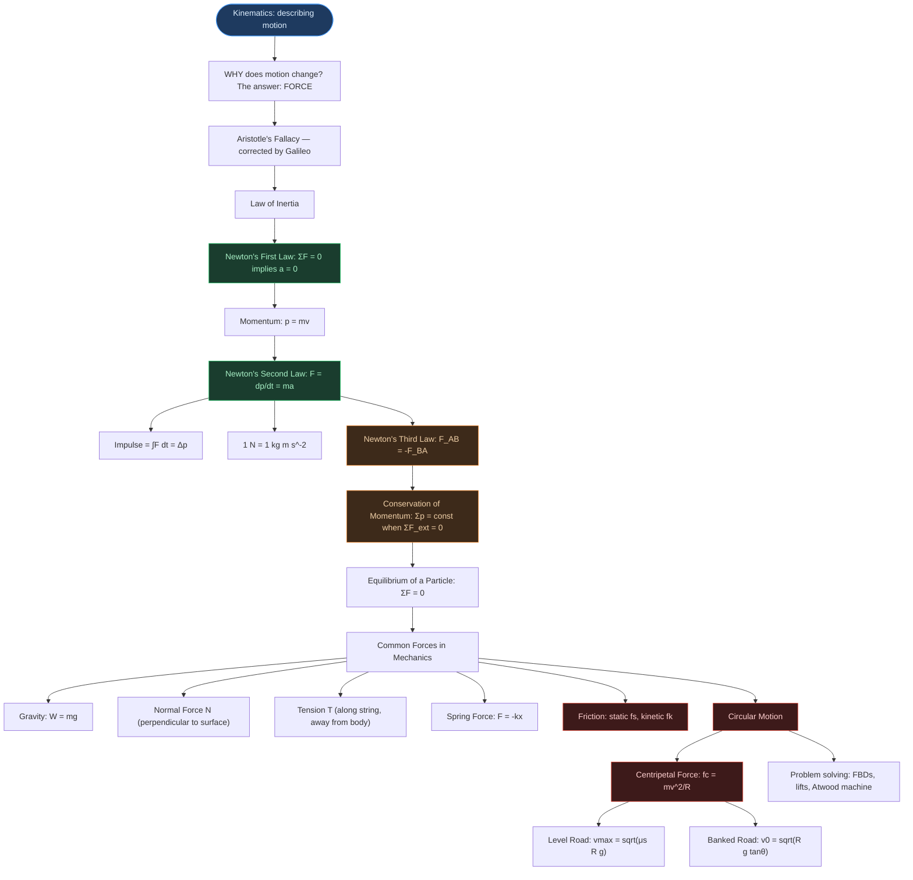
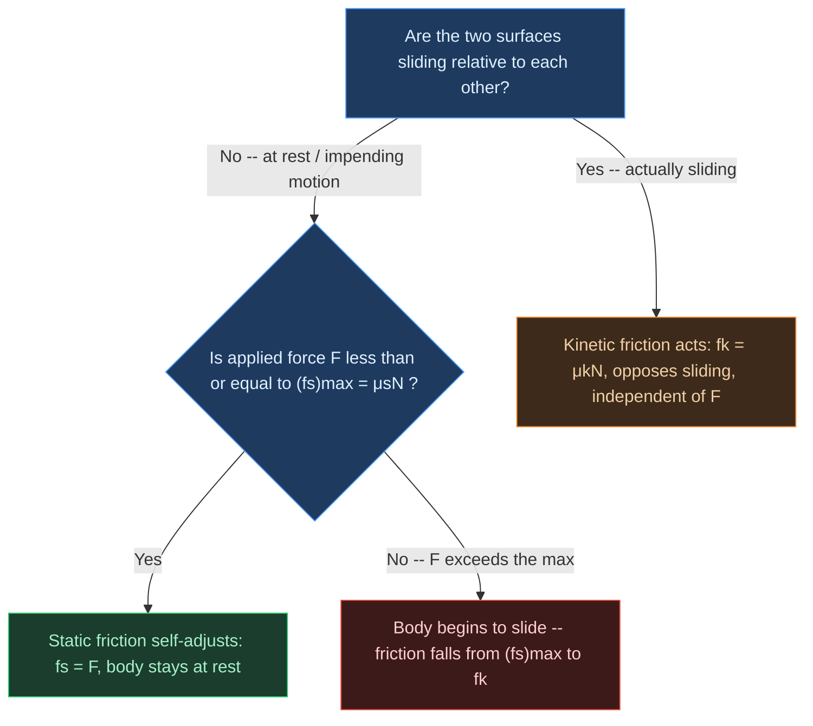

# Physics | Chapter 04 | Laws of Motion | NOTES
> **Complete Study Notes** | Board · NEET · JEE

---

## Chapter Brief

Kinematics describes how bodies move; this chapter explains why their motion changes. Three laws connect force, momentum and acceleration, and a short list of real forces (gravity, contact forces, tension, spring force, friction) supplies the inputs to those laws. By the end, the reader can turn a physical set-up such as a block on an incline, a car on a curve or a lift in motion into a free-body diagram and then into equations of motion. The chapter builds directly on the kinematics of straight-line and planar motion.

## At a Glance

- **Prerequisites:** Kinematics (velocity, acceleration, uniform circular motion and its centripetal acceleration), resolution of vectors into components.
- **Key outcomes:** By the end of this chapter you should be able to:
  - Draw a correct free-body diagram for a body on a surface, on an incline or hung from strings.
  - State the three laws and say what each does and does not imply.
  - Apply $F = ma$, the impulse-momentum relation and conservation of momentum to collisions, recoil and explosions.
  - Use static and kinetic friction, including the angle of repose, to decide whether a body slides and how fast it accelerates.
  - Find the speed limits for a car on a level and on a banked curve.
  - Solve lift and Atwood-machine problems.
- **Scope note:** Motion is analysed in inertial frames only (pseudo-forces are mentioned, not used); rotational equilibrium, variable-mass systems and speeds close to that of light are not treated.

---

## Table of Contents

More stars mean higher exam priority (⭐ to ⭐⭐⭐).

- Concept Roadmap
- 1. Aristotle's Fallacy and the Law of Inertia ⭐
  - 1.1 Aristotle's View
  - 1.2 Galileo's Correction: The Law of Inertia
- 2. Newton's First Law of Motion ⭐
  - 2.1 Statement
  - 2.2 Implications
  - 2.3 Examples of the First Law in Daily Life
- 3. Momentum and Newton's Second Law ⭐⭐
  - 3.1 Momentum
  - 3.2 Newton's Second Law: Statement
  - 3.3 Key Points About the Second Law
  - 3.4 Impulse ⭐
  - 3.5 Solved Examples
- 4. Newton's Third Law of Motion ⭐⭐
  - 4.1 Statement
  - 4.2 Critical Features of the Third Law
  - 4.3 Examples of the Third Law
  - 4.4 Solved: Billiard Balls (NCERT Example 4.5)
- 5. Conservation of Momentum ⭐⭐⭐
  - 5.1 Derivation from the Second and Third Laws
  - 5.2 Statement
  - 5.3 Applications
- 6. Equilibrium of a Particle ⭐
  - 6.1 Definition
  - 6.2 Conditions for Equilibrium
  - 6.3 Free-Body Diagram (FBD) ⭐
  - 6.4 Solved: Rope with a Horizontal Force (NCERT Example 4.6)
  - 6.5 Solved: Weight Hung from Two Strings
- 7. Common Forces in Mechanics ⭐⭐
  - 7.1 Gravitational Force (Weight)
  - 7.2 Normal Force ($N$) ⭐
  - 7.3 Tension ($T$) ⭐
  - 7.4 Spring Force (Hooke's Law)
  - 7.5 Microscopic Origin of Contact Forces
- 8. Friction ⭐⭐⭐
  - 8.1 What is Friction?
  - 8.2 Static Friction ($f_s$) ⭐⭐
  - 8.3 Kinetic (Sliding) Friction ($f_k$) ⭐⭐
  - 8.4 Comparison: Static vs Kinetic Friction
  - 8.5 Angle of Friction and Angle of Repose
  - 8.5a Block on an Incline: Rest, Limit and Sliding
  - 8.6 Rolling Friction
  - 8.7 Friction: Harmful and Essential
  - 8.8 Solved Examples
- 9. Circular Motion ⭐⭐⭐
  - 9.1 Centripetal Force
  - 9.2 Motion of a Car on a Level Road ⭐⭐
  - 9.3 Motion of a Car on a Banked Road ⭐⭐⭐
  - 9.4 Solved Examples
- 10. Solving Problems in Mechanics ⭐⭐
  - 10.1 Systematic Approach
  - 10.2 Lift Problems
  - 10.3 Connected Bodies: The Atwood Machine
  - 10.4 Solved: Block and Iron Cylinder (NCERT Example 4.12)

---

## Concept Roadmap



Read the map top to bottom: the three laws (green and orange) are the core, the list of real forces feeds them, and friction and circular motion (red) are where they are applied most heavily.

---

## 1. Aristotle's Fallacy and the Law of Inertia ⭐

Kinematics describes motion but not its cause. The first question dynamics must settle is what, if anything, is needed to keep a body moving, and for roughly two thousand years the everyday answer was wrong in an instructive way.

### 1.1 Aristotle's View

> **Aristotelian Law of Motion:** An external force is required to keep a body in motion.

The claim matches everyday experience: a toy car stops soon after the pushing stops, and a ball rolling on the floor slows and halts. Aristotle's error was to overlook the cause of the slowing. The car and ball decelerate because friction and air resistance act against their motion; remove those opposing forces and nothing is left to bring the body to rest.

> [!tip] Where Aristotle went wrong
> He confused the force needed to *overcome friction* with the force needed to *sustain motion*. Friction is a separate, opposing force, and he did not account for it.

### 1.2 Galileo's Correction: The Law of Inertia

Galileo studied balls on inclined planes and read the conclusion from how the motion changes with slope:

- A ball rolling **down** an incline speeds up.
- A ball rolling **up** an incline slows down.
- On a **horizontal**, frictionless plane the ball would neither speed up nor slow down: its velocity stays constant.

The double-inclined-plane experiment joins these observations. A ball released from rest on one incline climbs the opposite incline to the same height, whatever that incline's slope, provided friction is absent. As the second slope is made gentler, the ball must travel farther to regain the height. In the limiting case of a horizontal plane it can never regain it, so it moves on indefinitely at constant velocity.

```tikz
\usetikzlibrary{arrows.meta}
\begin{tikzpicture}[>={Stealth[length=6pt,width=4pt]}, thick, scale=0.78]
  \begin{scope}[yshift=6.6cm]
    \draw[gray!60, dashed] (-0.4,2) -- (4.2,2);
    \draw[line width=1.1pt] (0,2) -- (2,0) -- (3.6,2);
    \draw[gray] (0,0)--(-0.2,-0.22) (0.6,0)--(0.4,-0.22) (1.2,0)--(1.0,-0.22)
                (1.8,0)--(1.6,-0.22) (2.4,0)--(2.2,-0.22);
    \fill[blue!70!black] (0,2) circle (2.5pt);
    \fill[blue!70!black] (3.6,2) circle (2.5pt);
    \draw[->, red!75!black, line width=1.2pt, dashed] (0.35,1.85) to[bend right=20] (2.35,0.15);
    \draw[->, red!75!black, line width=1.2pt, dashed] (1.75,0.1) to[bend left=15] (3.35,1.85);
    \node[below, font=\itshape\small, text=gray] at (1.8,-0.7) {(i) steep slope -- rises to the same height};
  \end{scope}

  \begin{scope}[yshift=3.3cm]
    \draw[gray!60, dashed] (-0.4,2) -- (6.2,2);
    \draw[line width=1.1pt] (0,2) -- (2,0) -- (5.6,2);
    \draw[gray] (0,0)--(-0.2,-0.22) (0.6,0)--(0.4,-0.22) (1.2,0)--(1.0,-0.22)
                (1.8,0)--(1.6,-0.22) (2.4,0)--(2.2,-0.22);
    \fill[blue!70!black] (0,2) circle (2.5pt);
    \fill[blue!70!black] (5.6,2) circle (2.5pt);
    \draw[->, red!75!black, line width=1.2pt, dashed] (0.35,1.85) to[bend right=20] (2.35,0.15);
    \draw[->, red!75!black, line width=1.2pt, dashed] (1.75,0.1) to[bend left=8] (5.35,1.85);
    \node[below, font=\itshape\small, text=gray] at (2.8,-0.7) {(ii) gentler slope -- same height, longer distance};
  \end{scope}

  \begin{scope}[yshift=0cm]
    \draw[line width=1.1pt] (0,2) -- (2,0) -- (7.4,0);
    \draw[gray] (0,0)--(-0.2,-0.22) (0.6,0)--(0.4,-0.22) (1.2,0)--(1.0,-0.22)
                (1.8,0)--(1.6,-0.22) (2.4,0)--(2.2,-0.22)
                (3.0,0)--(2.8,-0.22) (3.6,0)--(3.4,-0.22);
    \fill[blue!70!black] (0,2) circle (2.5pt);
    \draw[->, red!75!black, line width=1.2pt, dashed] (0.35,1.85) to[bend right=20] (2.35,0.15);
    \draw[->, red!75!black, line width=1.2pt, dashed] (2.2,0.08) -- (7.1,0.08);
    \node[right, font=\small, red!75!black] at (7.1,0.08) {$v=\text{const}$};
    \node[below, font=\itshape\small, text=gray] at (2.8,-0.7) {(iii) horizontal, frictionless -- motion never ceases};
  \end{scope}
\end{tikzpicture}
```

Rows (i) to (iii) show the second slope flattening: the distance travelled grows without bound while the height reached stays the same. This progression is the experimental seed of the law of inertia.

> [!note] An idealisation
> Real balls do come to rest, because friction and air resistance are never exactly zero. The experiment shows that the *smaller* the resistive forces, the *closer* the motion is to constant velocity.

> [!important] Galileo's Conclusion: The Law of Inertia
> A body needs no net force to *continue* at rest or in uniform motion; it resists any change in that state. This property is **inertia**.
>
> **Inertia** — the property of a body by which it resists any change in its state of rest or of uniform motion in a straight line. Its measure is the body's **mass** (§3.2).

---

## 2. Newton's First Law of Motion ⭐

Galileo's law of inertia becomes Newton's First Law once "state of motion" and "external cause" are stated precisely.

### 2.1 Statement

> **Every body continues to be in its state of rest or of uniform motion in a straight line unless compelled by some external force to act otherwise.**

In symbols, for a body in an inertial frame (§2.2):

$$\sum \mathbf{F} = 0 \implies \mathbf{a} = 0$$

### 2.2 Implications

Three ideas follow from the statement.

- **Rest and uniform motion are equivalent states.** Both have zero acceleration and need zero net force; a body at rest is not in a "more natural" state than one moving at constant velocity.
- **Force is identified qualitatively.** Force is the external agency that changes, or tends to change, a body's state of rest or uniform motion. The Second Law (§3) makes this quantitative.
- **Inertial frames are identified.** An **inertial frame of reference** is one in which a body acted on by no net force moves with constant velocity. Any non-rotating frame moving with constant velocity relative to an inertial frame is also inertial, and the Earth's surface is inertial to good approximation for the motions in this chapter.

Newton's laws in the form used here hold only in inertial frames. In a frame accelerating relative to an inertial one, the laws work only if extra *pseudo* (fictitious) forces are added; this chapter stays in inertial frames.

```tikz
\usetikzlibrary{arrows.meta}
\begin{tikzpicture}[>={Stealth[length=7pt,width=5pt]}, thick, scale=1.0]
  \begin{scope}
    \draw[line width=1pt] (-0.6,0) -- (3.0,0);
    \draw[gray] (-0.4,0)--(-0.6,-0.25) (0.2,0)--(0.0,-0.25) (0.8,0)--(0.6,-0.25)
                (1.4,0)--(1.2,-0.25) (2.0,0)--(1.8,-0.25) (2.6,0)--(2.4,-0.25);
    \draw[fill=blue!15] (0.6,0) rectangle (1.8,0.5);
    \draw[->, green!45!black, line width=1.6pt] (1.2,0.5) -- (1.2,1.5) node[above, font=\small] {$N$};
    \draw[->, red!70!black, line width=1.6pt] (1.2,0.25) -- (1.2,-0.9) node[below, font=\small] {$mg$};
    \node[below, font=\itshape\small, text=gray] at (1.2,-1.4) {(a) book at rest: $N=mg$, $\Sigma F=0$};
  \end{scope}

  \begin{scope}[xshift=5.6cm]
    \draw[line width=1pt] (-0.6,0) -- (3.6,0);
    \draw[gray] (-0.4,0)--(-0.6,-0.25) (0.2,0)--(0.0,-0.25) (0.8,0)--(0.6,-0.25)
                (1.4,0)--(1.2,-0.25) (2.0,0)--(1.8,-0.25) (2.6,0)--(2.4,-0.25) (3.2,0)--(3.0,-0.25);
    \draw[fill=blue!15] (0.4,0.45) rectangle (2.4,1.0);
    \draw[fill=blue!5] (0.6,0.15) circle (0.28);
    \draw[fill=blue!5] (2.2,0.15) circle (0.28);
    \draw[->, orange!80!black, line width=1.7pt] (2.6,0.7) -- (3.6,0.7) node[right, font=\small] {$v=\text{const}$};
    \node[below, font=\itshape\small, text=gray] at (1.4,-0.6) {(b) car at uniform velocity: net force zero};
  \end{scope}
\end{tikzpicture}
```

In (a) the book has no motion at all; in (b) the car has plenty of motion but no *change* in velocity, so the First Law governs both through the same condition, $\Sigma F = 0$. In (b) that zero is not "no forces" but a cancellation: the driving force on the car (the road's static friction on the driven wheels, §8.7) balances air drag and rolling resistance.

> [!warning] The First Law is more than a special case of the Second
> Setting $F = 0$ in $F = ma$ does give $a = 0$, but only *within an inertial frame*. What the First Law adds is the statement that such frames exist, and that is what gives the Second Law its meaning.

### 2.3 Examples of the First Law in Daily Life

Each case is the same statement at work: without a net force, the existing state of motion persists.

| Situation | Explanation |
|:---|:---|
| Passenger thrown backward when a bus starts | The body tends to remain at rest (inertia of rest) while the floor moves forward |
| Passenger thrown forward when a bus brakes | The body tends to keep moving forward (inertia of motion) |
| Tablecloth pulled away from dishes | The dishes tend to stay at rest if the cloth is pulled fast enough |
| Coin drops into a glass when the card under it is flicked | The coin's inertia of rest keeps it in place while the card moves away |
| Astronaut in deep space after the engines shut off | Continues at constant velocity, since no net force acts |

---

## 3. Momentum and Newton's Second Law ⭐⭐

The First Law says when velocity does not change; the Second Law says how it changes when a net force acts. The bridge between them is momentum, which combines how much matter a body has with how fast it moves.

### 3.1 Momentum

> [!info] Definition
> **Momentum ($\mathbf{p}$)** of a body is the product of its **mass** and **velocity**.

$$\mathbf{p} = m\mathbf{v}$$

- **Vector quantity**, in the direction of the velocity
- SI unit: **kg m s⁻¹** = **N s**
- Dimensional formula: **[MLT⁻¹]**

Everyday experience shows that both mass and speed matter in how hard a moving body is to stop:

| Observation | What it shows |
|:---|:---|
| A truck is harder to stop than a bicycle at the same speed | Mass matters |
| A bullet pierces tissue easily at high speed but barely at low speed | Speed matters |
| A cricketer draws the hands back while catching | A slower stop needs less force |
| The same force on a heavy and a light body for the same time gives the same $\Delta p$ | Momentum is the key quantity |

Momentum is a vector, so a force can change it without changing its magnitude. A stone whirled at constant speed in a horizontal circle (gravity neglected or balanced) has constant $|\mathbf{p}| = mv$, yet its momentum vector rotates continuously. The string's tension supplies the force that rotates it; because the tension is always perpendicular to the velocity, it does no work and the speed does not change.

```tikz
\usetikzlibrary{arrows.meta}
\begin{tikzpicture}[>={Stealth[length=7pt,width=5pt]}, thick, scale=1.0]
  \draw[gray!60] (0,0) circle (2);
  \coordinate (O) at (0,0);
  \coordinate (P1) at (2,0);
  \coordinate (P2) at (0,2);
  \fill[black] (O) circle (1.5pt);
  \node[below left, font=\small] at (O) {hand};
  \draw[line width=0.9pt] (O) -- (P1);
  \draw[line width=0.9pt] (O) -- (P2);
  \fill[blue!70!black] (P1) circle (3pt);
  \fill[blue!70!black] (P2) circle (3pt);
  \draw[->, orange!80!black, line width=1.6pt] (P1) -- ++(0,1.1) node[above, font=\small] {$\mathbf{p}_1=m\mathbf{v}_1$};
  \draw[->, orange!80!black, line width=1.6pt] (P2) -- ++(-1.1,0) node[left, font=\small] {$\mathbf{p}_2=m\mathbf{v}_2$};
  \draw[->, red!75!black, line width=1.4pt] (P1) -- ++(-0.85,0) node[midway, above, font=\small, red!75!black] {$T$};
  \draw[->, red!75!black, line width=1.4pt] (P2) -- ++(0,-0.85) node[midway, right, font=\small, red!75!black] {$T$};
  \node[below, font=\itshape\small, text=gray] at (0,-2.6) {tension $T$ is always along the string, toward the centre -- it changes the direction of $\mathbf{p}$, not its magnitude};
\end{tikzpicture}
```

$|\mathbf{p}_1| = |\mathbf{p}_2|$ (same speed), but $\mathbf{p}_1 \ne \mathbf{p}_2$ as vectors, and the tension $T$ is what produces the rotation. This is the observation Newton generalises: force is the rate of change of the momentum *vector*, not merely of the speed.

### 3.2 Newton's Second Law: Statement

> [!important] Newton's Second Law
> The rate of change of momentum of a body is directly proportional to the net external force applied and takes place in the direction in which the force acts.

Writing the proportionality as an equation,

$$\mathbf{F} \propto \frac{d\mathbf{p}}{dt} \implies \mathbf{F} = k\frac{d\mathbf{p}}{dt}$$

and choosing $k = 1$ (which is what defines the SI unit of force) gives, for a body of constant mass $m$:

$$\boxed{\mathbf{F} = \frac{d\mathbf{p}}{dt} = \frac{d(m\mathbf{v})}{dt} = m\mathbf{a}}$$

The last form shows why mass measures inertia: for the same force, the greater the mass, the smaller the acceleration.

**SI unit of force:** 1 newton (N) is the force that gives a body of mass 1 kg an acceleration of 1 m s⁻².

$$1\ \text{N} = 1\ \text{kg m s}^{-2} \qquad \text{Dimensional formula: } [\text{MLT}^{-2}]$$

### 3.3 Key Points About the Second Law

**1. It agrees with the First Law.** If $F = 0$ then $dp/dt = 0$, so $p$ is constant and (for constant mass) $a = 0$.

**2. It is a vector law.** It is equivalent to three scalar equations:

$$F_x = ma_x \qquad F_y = ma_y \qquad F_z = ma_z$$

A force along $x$ changes only the $x$-component of velocity; the $y$ and $z$ components are untouched. This is why the horizontal velocity of a projectile stays constant under vertical gravity.

**3. It is a local relation.** The force at a point at a given instant fixes the acceleration at that same point and instant; the body carries no "memory" of past motion.

> [!tip] Classic example
> The moment a stone is released from an accelerating train, no horizontal force acts on it (air resistance neglected). Its earlier horizontal acceleration is irrelevant to what happens next.

**4. $\mathbf{F}$ is the net external force.** It is the vector sum of all external forces on the body; internal forces do not count.

**5. It applies to systems.** For a rigid body or a system of particles of total mass $M$, $\mathbf{F}_{\text{ext}} = M\mathbf{a}_{\text{cm}}$, where $\mathbf{a}_{\text{cm}}$ is the acceleration of the centre of mass.

Three common misreadings of $F = ma$:

> [!warning] $ma$ is not a force
> In $F = ma$, $ma$ is the *effect* of the net force, not a further force. Never draw it on a free-body diagram.

> [!warning] $v = 0$ does not mean $F = 0$
> At the top of a vertical throw $v = 0$, yet $F = mg$ and $a = g$. Force fixes acceleration, not velocity.

> [!warning] Force need not point along the velocity
> Force and acceleration are parallel to each other, but the velocity can point elsewhere (a projectile, a body in circular motion).

### 3.4 Impulse ⭐

When a bat strikes a ball or a hammer strikes a nail, a large force acts for a very short time, and its value changes rapidly during that time. Neither the peak force nor the exact duration is easy to measure, but the resulting change in momentum is. Integrating the Second Law over the interval gives the relation that makes this useful.

> [!info] Definition
> **Impulse ($\mathbf{J}$)** is the integral of force over the time it acts, and it equals the change in momentum of the body (the impulse-momentum theorem).

$$\mathbf{J} = \int \mathbf{F}\,dt = \Delta\mathbf{p} \qquad \text{(constant or average force: } \mathbf{J} = \mathbf{F}\Delta t\text{)}$$

- SI unit: **N s** = **kg m s⁻¹**
- Dimensional formula: **[MLT⁻¹]**, the same as momentum and *not* the same as force
- Measurable even when $F$ and $\Delta t$ are individually unknown, because only $\Delta\mathbf{p}$ is needed

> [!tip] Why a cricketer draws the hands back while catching
> Drawing the hands back lengthens the contact time $\Delta t$. For the same $\Delta p$, the average force $F = \Delta p/\Delta t$ falls, which protects the hands.

> [!warning] Impulsive force is not a new kind of force
> An **impulsive force** is a large force acting for a very short time. Impulse is defined for any force, but it is the natural measure of an impulsive one. Newtonian mechanics treats an impulsive force exactly like any other force.

### 3.5 Solved Examples

> [!example] NCERT Example 4.2: Bullet stopped in a wooden block
> **Given:** $m = 0.04$ kg, $u = 90$ m s⁻¹, final speed $0$, stopping distance $d = 0.6$ m.
>
> **Find:** the average resistive force $F$.
>
> **Model:** constant deceleration while the bullet is inside the block, so $v^2 = u^2 + 2as$ gives $a$ and the Second Law gives $F$.
>
> **Work:**
>
> $$a = \frac{0 - u^2}{2d} = \frac{-(90)^2}{2 \times 0.6} = -6750\ \text{m s}^{-2}$$
>
> $$F = ma = 0.04 \times 6750 = \mathbf{270\ N} \text{ (opposing the motion)}$$
>
> **Check:** the stopping time is $t = u/|a| = 90/6750 \approx 0.0133$ s, so the impulse is $Ft \approx 270 \times 0.0133 = 3.6$ N s, which matches $mu = 0.04 \times 90 = 3.6$ N s.

> [!example] NCERT Example 4.4: Batsman hits the ball back
> **Given:** $m = 0.15$ kg; taking the direction of the hit as positive, the velocity changes from $u = -12$ m s⁻¹ to $v = +12$ m s⁻¹.
>
> **Find:** the impulse imparted to the ball.
>
> **Model:** impulse equals the change in momentum.
>
> **Work:**
>
> $$J = \Delta p = m(v - u) = 0.15 \times \big(12 - (-12)\big) = \mathbf{3.6\ N\,s}$$
>
> **Check:** a complete reversal at speed $u$ changes the momentum by $2mu = 2 \times 0.15 \times 12 = 3.6$ N s, in the direction of the hit.

---

## 4. Newton's Third Law of Motion ⭐⭐

Forces do not come singly. Whenever one body pushes or pulls another, it is pushed or pulled back, and the Third Law makes this exact.

### 4.1 Statement

> [!important] Newton's Third Law
> To every action, there is always an equal and opposite reaction.
>
> More precisely: **forces always occur in pairs. The force on body A by body B is equal in magnitude and opposite in direction to the force on body B by body A.**
>
> $$\mathbf{F}_{AB} = -\mathbf{F}_{BA}$$
>
> Here $\mathbf{F}_{AB}$ is the force *on* A *by* B.

### 4.2 Critical Features of the Third Law

**1. "Action" and "reaction" both mean forces.** The words mislead: neither force comes first and neither causes the other. The two act simultaneously, and either one may be called the action.

**2. They act on different bodies**, so they never cancel each other. To find the motion of A, only $\mathbf{F}_{AB}$ (the force on A) matters; adding $\mathbf{F}_{BA}$ to it is a conceptual error.

**3. They hold for the forces met in this chapter:** contact forces (normal, friction, tension, spring) and non-contact ones such as gravity and electrostatic attraction. (Forces between moving charges need the momentum of the electromagnetic field counted as well, which lies beyond this chapter.)

**4. Internal forces cancel in pairs.** Inside a system of particles, every action-reaction pair sums to zero, so the Second Law for the whole system involves only external forces.

### 4.3 Examples of the Third Law

| Action | Reaction |
|:---|:---|
| Earth pulls a stone downward (gravity) | Stone pulls Earth upward with the same magnitude (Earth barely accelerates) |
| Horse pulls cart forward | Cart pulls horse backward |
| Foot pushes ground backward | Ground pushes foot forward (friction, which makes walking possible) |
| Rocket pushes gas backward | Gas pushes rocket forward |
| Compressed spring pushes hand | Hand pushes spring |
| Gun pushes bullet forward | Bullet pushes gun backward (recoil) |

> [!warning] Classic misconception
> "Action and reaction cancel, so nothing could ever move." Wrong: they act on *different* bodies. For the motion of any one body, only the force on that body matters.

The horse-and-cart case shows how motion still arises:

- **Cart:** net forward force = horse's pull minus resistance on the cart, so it accelerates if the pull exceeds the resistance.
- **Horse:** net forward force = ground's forward (static) friction on the hooves minus the cart's backward pull, so it accelerates if that friction exceeds the pull.
- The two Third-Law partners (horse on cart, cart on horse) never appear together in the equation for either body.

### 4.4 Solved: Billiard Balls (NCERT Example 4.5)

The wall is assumed smooth, so it can push only along its normal. Only the component of a ball's velocity *along the normal* then reverses on collision; the tangential component is untouched.

```tikz
\usetikzlibrary{arrows.meta}
\begin{tikzpicture}[>={Stealth[length=7pt,width=5pt]}, thick, scale=0.95]
  \begin{scope}
    \draw[line width=1.6pt] (3,-1.6) -- (3,1.6);
    \draw[gray] (3,1.6)--(3.25,1.85) (3,1.1)--(3.25,1.35) (3,0.6)--(3.25,0.85)
                (3,0.1)--(3.25,0.35) (3,-0.4)--(3.25,-0.15) (3,-0.9)--(3.25,-0.65)
                (3,-1.4)--(3.25,-1.15);
    \draw[->, blue!70!black, line width=1.6pt] (0,0.15) -- (2.85,0.15) node[midway, above, font=\small] {$u$};
    \draw[->, green!45!black, line width=1.6pt] (2.85,-0.15) -- (0,-0.15) node[midway, below, font=\small] {$u$};
    \draw[->, red!75!black, line width=1.7pt] (3,-0.9) -- (3.8,-0.9) node[right, font=\small, red!75!black] {$F_{wall}$};
    \node[below, font=\itshape\small, text=gray] at (1.4,-2.5) {(a) normal incidence -- force on wall along $+x$};
  \end{scope}

  \begin{scope}[xshift=6.6cm]
    \draw[line width=1.6pt] (3,-1.6) -- (3,1.6);
    \draw[gray] (3,1.6)--(3.25,1.85) (3,1.1)--(3.25,1.35) (3,0.6)--(3.25,0.85)
                (3,0.1)--(3.25,0.35) (3,-0.4)--(3.25,-0.15) (3,-0.9)--(3.25,-0.65)
                (3,-1.4)--(3.25,-1.15);
    \draw[gray!60, dashed] (1.0,0) -- (3,0);
    \node[font=\small, text=gray] at (1.5,0.2) {normal};
    \draw[->, blue!70!black, line width=1.6pt] (1.27,-1.0) -- (2.9,-0.03) node[near start, below, font=\small] {$u$};
    \draw[->, green!45!black, line width=1.6pt] (2.9,0.03) -- (1.27,1.0) node[near start, above, font=\small] {$u$};
    \node[font=\small, orange!80!black] at (2.35,-0.5) {$30°$};
    \draw[->, red!75!black, line width=1.7pt] (3,-1.9) -- (3.8,-1.9) node[right, font=\small, red!75!black] {$F_{wall}$};
    \node[below, font=\itshape\small, text=gray] at (1.6,-2.5) {(b) 30° to normal -- $p_y$ unchanged, only $p_x$ reverses};
  \end{scope}
\end{tikzpicture}
```

The instinctive guess, that the wall's force is tilted at 30° in case (b), is wrong. Because $p_y$ is unchanged, the impulse (and so the force) stays normal to the wall in **both** cases; only the *magnitude* of the impulse differs, which the worked example computes.

> [!example] NCERT Example 4.5: Billiard balls hitting a wall
> **Given:** two identical balls of mass $m$ strike a rigid, smooth wall with the same speed $u$ and rebound with unchanged speed. Ball (a) strikes along the normal; ball (b) strikes at $30°$ to the normal.
>
> **Find:** the direction of the force on the wall in each case, and the ratio of the impulses.
>
> **Model:** impulse on a ball equals its change in momentum. Take $+x$ along the wall's normal, pointing into the wall. By the Third Law, the force on the wall is opposite to the impulse on the ball.
>
> **Work:**
>
> Case (a): $p_x$ goes from $+mu$ to $-mu$, so the $x$-impulse on the ball is $-2mu$ and $y$-impulse is $0$.
>
> Case (b): $p_x$ goes from $+mu\cos 30°$ to $-mu\cos 30°$, so the $x$-impulse is $-2mu\cos 30°$; $p_y$ is unchanged, so the $y$-impulse is $0$.
>
> In both cases the force on the wall is along $+x$, normal to the wall (not at $30°$).
>
> $$\frac{J_a}{J_b} = \frac{2mu}{2mu\cos 30°} = \frac{1}{\cos 30°} = \frac{2}{\sqrt{3}} \approx 1.15$$
>
> **Check:** the more obliquely the ball strikes, the smaller the normal component and so the smaller the impulse; in the limit of grazing incidence the impulse tends to zero, consistent with a ratio greater than 1.

---

## 5. Conservation of Momentum ⭐⭐⭐

The Second and Third Laws together give one of the most useful results in mechanics: when bodies interact only with each other, their total momentum cannot change.

### 5.1 Derivation from the Second and Third Laws

Let bodies A and B interact for a time $\Delta t$, for instance in a collision, with no other external force acting on the pair. Let $\mathbf{F}_{AB}$ be the force on A by B. The Second Law in impulse form gives the change in momentum of each body, and the Third Law relates the two forces:

$$\Delta\mathbf{p}_A = \mathbf{F}_{AB}\,\Delta t \qquad \Delta\mathbf{p}_B = \mathbf{F}_{BA}\,\Delta t = -\mathbf{F}_{AB}\,\Delta t$$

Adding the two equations, the right-hand sides cancel:

$$\Delta\mathbf{p}_A + \Delta\mathbf{p}_B = 0 \implies \boxed{\mathbf{p}_A' + \mathbf{p}_B' = \mathbf{p}_A + \mathbf{p}_B}$$

The momentum lost by one body is exactly gained by the other.

### 5.2 Statement

> [!important] Conservation of Momentum
> The total momentum of an isolated system of interacting particles is conserved.
>
> $$\sum \mathbf{p}_i = \text{constant} \quad \text{when } \sum \mathbf{F}_{\text{ext}} = 0$$

- **Isolated system:** a system on which the net external force is zero.
- **Component form:** momentum is conserved along any direction in which the net external force component is zero, even if forces act along other directions.
- **Collisions:** momentum is conserved in **elastic and inelastic** collisions alike. Kinetic energy is additionally conserved only in elastic collisions.

### 5.3 Applications

**Gun recoil.** Before firing, gun and bullet are at rest, so their total momentum is zero and stays zero. With velocities measured relative to the ground:

$$m_{\text{gun}}\,v_{\text{gun}} + m_{\text{bullet}}\,v_{\text{bullet}} = 0 \implies v_{\text{gun}} = -\frac{m_{\text{bullet}}}{m_{\text{gun}}}\,v_{\text{bullet}}$$

The gun moves opposite to the bullet, and its speed is small because it is far heavier. (For a gun fired horizontally on a frictionless surface, gravity and the normal force cancel, so horizontal momentum is conserved.)

**Explosion.** Total momentum just after equals total momentum just before. If the body was at rest, the momenta of all fragments sum to zero.

**Collision.** For two bodies A and B:

$$m_A \mathbf{v}_A + m_B \mathbf{v}_B = m_A \mathbf{v}_A' + m_B \mathbf{v}_B'$$

---

## 6. Equilibrium of a Particle ⭐

Many problems ask not how something accelerates but what forces hold it still. Equilibrium is the case $\mathbf{a} = 0$, and it is also where free-body diagrams first earn their keep.

### 6.1 Definition

> [!info] Definition
> A particle is in **mechanical equilibrium** when the **net external force** on it is **zero**.

$$\sum \mathbf{F} = 0 \iff \mathbf{a} = 0$$

The particle is either **at rest** (static equilibrium) or in **uniform linear motion** (dynamic equilibrium). Rotational equilibrium of extended bodies is not covered here.

### 6.2 Conditions for Equilibrium

- **Two forces:** they must be equal and opposite, $\mathbf{F}_1 = -\mathbf{F}_2$.
- **Three or more concurrent forces:** the vector sum vanishes. For three forces, $\mathbf{F}_1 + \mathbf{F}_2 + \mathbf{F}_3 = 0$, which is equivalent to two component equations:

$$F_{1x} + F_{2x} + F_{3x} = 0 \qquad F_{1y} + F_{2y} + F_{3y} = 0$$

- **Graphically:** drawn head to tail, the force vectors form a closed triangle (a closed polygon for $n$ forces).

### 6.3 Free-Body Diagram (FBD) ⭐

A **free-body diagram** shows one chosen body in isolation together with every external force acting *on* it from outside; forces the body exerts on other bodies are not drawn. It is the tool that turns a physical set-up into equations, so every problem in this chapter starts with one.

Procedure:

1. Isolate the body (or system) of interest and draw it separately.
2. Draw every external force on it: weight $mg$ (downward), normal force $N$ (perpendicular to the surface, pushing the body), tension $T$ (along the rope, pulling the body toward the rope), friction $f$ (along the surface, opposing actual or impending relative motion), and any applied forces.
3. Choose axes convenient for the motion (along and perpendicular to an incline, for instance) and resolve the forces on them.
4. Label the knowns and leave the unknowns as symbols.
5. Apply $\sum F_x = ma_x$ and $\sum F_y = ma_y$ (or $\sum \mathbf{F} = 0$ in equilibrium).

> [!warning] Not on an FBD
> Do not draw the forces the body exerts on others, the Third-Law partners of the forces shown, a separate "centripetal force" (§9.1), or "$ma$" (§3.3).

### 6.4 Solved: Rope with a Horizontal Force (NCERT Example 4.6)

```tikz
\usetikzlibrary{arrows.meta}
\begin{tikzpicture}[>={Stealth[length=7pt,width=5pt]}, thick, scale=0.95]
  \coordinate (P) at (0,0);
  \fill[black] (P) circle (2pt);
  \node[below, font=\small] at (P) {$P$};
  \draw[gray!60, dashed] (0,0) -- (0,2.4);
  \draw[->, blue!70!black, line width=1.7pt] (P) -- (-2.0,2.4) node[left, font=\small] {$T_1$};
  \draw[->, red!75!black, line width=1.7pt] (P) -- (0,-2.2) node[right, font=\small] {$T_2=60\text{ N}$};
  \draw[->, orange!80!black, line width=1.7pt] (P) -- (2.4,0) node[right, font=\small] {$50\text{ N}$};
  \node[font=\small, text=gray] at (-0.55,1.5) {$\theta$};
  \node[below, font=\itshape\small, text=gray] at (0,-2.8) {equilibrium of $P$: horizontal and vertical components of the resultant vanish separately};
\end{tikzpicture}
```

> [!example] NCERT Example 4.6: Rope with a horizontal force at its midpoint
> **Given:** a $6$ kg mass hangs from the ceiling on a light rope of length $2$ m; a horizontal force of $50$ N acts at the midpoint $P$ of the rope; $g = 10$ m s⁻².
>
> **Find:** the angle $\theta$ the upper half of the rope makes with the vertical in equilibrium.
>
> **Model:** the mass is in equilibrium under its weight and the tension in the lower half alone, so the lower half is vertical. The point $P$ is then in equilibrium under three forces: $T_1$ (upper half, up and to the left), $T_2$ (lower half, down) and the $50$ N push (to the right).
>
> **Work:**
>
> $$T_2 = mg = 6 \times 10 = 60\ \text{N}$$
>
> $$T_1 \cos\theta = 60\ \text{N} \qquad T_1 \sin\theta = 50\ \text{N}$$
>
> $$\tan\theta = \frac{50}{60} = \frac{5}{6} \implies \theta = \tan^{-1}\!\left(\frac{5}{6}\right) \approx 40°$$
>
> **Check:** $T_1 = \sqrt{60^2 + 50^2} \approx 78$ N closes the force triangle. The angle depends only on the ratio of the two known forces, not on the rope's length.

### 6.5 Solved: Weight Hung from Two Strings

The knot $P$ carries three concurrent forces:

```tikz
\usetikzlibrary{arrows.meta}
\begin{tikzpicture}[>={Stealth[length=7pt,width=5pt]}, thick, scale=0.95]
  \coordinate (P) at (0,0);
  \fill[black] (P) circle (2pt);
  \draw[gray!40, dashed] (-2.6,0) -- (2.6,0);
  \draw[->, blue!70!black, line width=1.7pt] (P) -- (-2.31,1.33) node[left, font=\small] {$T_1$};
  \draw[->, teal!70!black, line width=1.7pt] (P) -- (1.7,1.7) node[right, font=\small] {$T_2$};
  \draw[->, red!75!black, line width=1.7pt] (P) -- (0,-2.4) node[right, font=\small] {$W=200\text{ N}$};
  \node[font=\small, text=gray] at (-1.6,0.35) {$30°$};
  \node[font=\small, text=gray] at (1.15,0.35) {$45°$};
  \node[below, font=\itshape\small, text=gray] at (0,-2.9) {three concurrent forces at the knot -- horizontal components cancel, vertical components support $W$};
\end{tikzpicture}
```

> [!example] Weight supported by two strings
> **Given:** a weight $W = 200$ N hangs from the knot $P$; string 1 makes $30°$ with the horizontal on one side, string 2 makes $45°$ with the horizontal on the other.
>
> **Find:** the tensions $T_1$ and $T_2$.
>
> **Model:** the knot is in equilibrium under three concurrent forces, so the horizontal components cancel and the vertical components together support $W$.
>
> **Work (resolving components):**
>
> $$T_1 \cos 30° = T_2 \cos 45° \qquad \text{(horizontal)}$$
>
> $$T_1 \sin 30° + T_2 \sin 45° = 200 \qquad \text{(vertical)}$$
>
> From the horizontal equation, $T_2$ in terms of $T_1$:
>
> $$T_2 = T_1\frac{\cos 30°}{\cos 45°} = T_1\frac{\sqrt{3}/2}{\sqrt{2}/2} = \frac{T_1\sqrt{6}}{2}$$
>
> Substituting into the vertical equation:
>
> $$\frac{T_1}{2} + \frac{T_1\sqrt{6}}{2}\cdot\frac{\sqrt{2}}{2} = \frac{T_1}{2} + \frac{T_1\sqrt{3}}{2} = 200 \implies T_1 = \frac{400}{1+\sqrt{3}} = 200(\sqrt{3}-1)$$
>
> $$T_1 \approx \mathbf{146.4\ N}, \qquad T_2 = \frac{T_1\sqrt{6}}{2} \approx \mathbf{179.3\ N}$$
>
> **Check (Lami's theorem):** for three concurrent forces in equilibrium, each force is proportional to the sine of the angle between the other two. Measuring directions from the positive horizontal, $T_1$ points along $150°$, $T_2$ along $45°$ and $W$ along $270°$, so the included angles are
>
> $$\angle(T_2,W)=135°, \qquad \angle(T_1,W)=120°, \qquad \angle(T_1,T_2)=105°$$
>
> and they add to $360°$, as they must. Then
>
> $$\frac{T_1}{\sin 135°} = \frac{T_2}{\sin 120°} = \frac{W}{\sin 105°} = \frac{200}{\sin 105°} \approx 207.1\ \text{N}$$
>
> $$T_1 = 207.1 \times \sin 135° \approx 146.4\ \text{N}, \qquad T_2 = 207.1 \times \sin 120° \approx 179.3\ \text{N}$$
>
> Both methods agree. If the three included angles do not add to $360°$, one has been mislabelled.

---

## 7. Common Forces in Mechanics ⭐⭐

To use $F = ma$ one must know which forces actually act on the body. This section covers the ones that are not friction: gravity, the normal force, tension and the spring force. Friction has a section of its own (§8).

### 7.1 Gravitational Force (Weight)

$$\mathbf{W} = m\mathbf{g}$$

- Acts **vertically downward** on every body near the Earth's surface
- **Non-contact force**: it acts through empty space
- $g \approx 9.8$ m s⁻² (use $g = 10$ m s⁻² in numericals unless stated); it varies slightly with location
- Dimensional formula of weight: $[\text{MLT}^{-2}]$
- **Mass** is a property of the body (a measure of its inertia); **weight** is a force that depends on $g$

### 7.2 Normal Force ($N$) ⭐

- **Component of the contact force perpendicular** to the surfaces in contact
- Acts **away from the surface** onto the body: always a push, never a pull
- **Self-adjusting:** it takes whatever value keeps the surfaces from interpenetrating, up to the breaking point of the surface
- **Not always equal to $mg$**

| Situation | Normal force |
|:---|:---|
| Body at rest on a horizontal floor | $N = mg$ |
| Body on an incline at angle $\theta$ | $N = mg\cos\theta$ |
| Body in a lift accelerating up | $N = m(g + a)$ |
| Body in a lift accelerating down | $N = m(g - a)$ |
| Free fall | $N = 0$ |

The entries assume no other force acts along the normal; the lift cases are derived in §10.2.

```tikz
\usetikzlibrary{arrows.meta}
\begin{tikzpicture}[>={Stealth[length=7pt,width=5pt]}, thick, scale=0.95]
  \draw[line width=1.2pt] (0,0) -- (5,0) -- (5,2.5) -- cycle;
  \draw[gray] (0,0)--(-0.18,-0.22) (0.7,0)--(0.52,-0.22) (1.4,0)--(1.22,-0.22)
              (2.1,0)--(1.92,-0.22) (2.8,0)--(2.62,-0.22) (3.5,0)--(3.32,-0.22)
              (4.2,0)--(4.02,-0.22) (4.9,0)--(4.72,-0.22);
  \coordinate (B) at (3.0,1.5);
  \draw[fill=blue!15] ($(B)+(-0.35,-0.2)$) rectangle ($(B)+(0.35,0.4)$);
  \draw[->, red!75!black, line width=1.6pt] (B) -- ++(0,-1.8) node[below, font=\small] {$mg$};
  \draw[->, teal!70!black, line width=1.5pt, dashed] (B) -- ++(-0.72,-0.36) node[left, font=\small] {$mg\sin\theta$};
  \draw[->, orange!80!black, line width=1.5pt, dashed] (B) -- ++(0.72,-1.44) node[below right, font=\small] {$mg\cos\theta$};
  \draw[->, green!45!black, line width=1.7pt] (B) -- ++(-0.72,1.44) node[above left, font=\small] {$N$};
  \node[font=\small] at (4.55,0.28) {$\theta$};
\end{tikzpicture}
```

$mg\cos\theta$ presses the block into the surface and is exactly balanced by $N$. $mg\sin\theta$ has nothing to balance it along the surface, so it is this component, not the full weight, that would accelerate the block down the slope in the absence of friction.

> [!warning] Common mistake
> $mg$ and $N$ on a body are **not** a Third-Law pair: both act on the *same* body. The Third-Law partner of the normal force on the body is the force the body exerts on the surface; the partner of the weight is the body's gravitational pull on the Earth.

### 7.3 Tension ($T$) ⭐

- Force transmitted through a string, rope, chain or cable under stretch
- Acts **along the string** and pulls on the body attached to it, so it is directed from the body toward the string
- A string can only pull, never push

**Ideal string and pulley.** For a **massless** string over a **massless, frictionless** pulley, the tension is the same everywhere along the string. If the string has mass, the tension varies with position. If the string is also **inextensible**, bodies connected by it have the same speed and acceleration along the string; that is a statement about the motion, separate from the equality of tension.

### 7.4 Spring Force (Hooke's Law)

$$F = -kx$$

- $k$ is the **spring constant**, in N m⁻¹; dimensional formula $[\text{MT}^{-2}]$. A larger $k$ means a stiffer spring.
- $x$ is the extension ($+$) or compression ($-$) from the natural length.
- The negative sign marks a **restoring force**: it always opposes the displacement.
- Valid only for small displacements, within the elastic limit.

```tikz
\usetikzlibrary{arrows.meta}
\begin{tikzpicture}[>={Stealth[length=7pt,width=5pt]}, thick, scale=0.95]
  \begin{scope}
    \draw[fill=gray!30] (-0.3,-0.5) rectangle (0,1.0);
    \draw[gray, line width=1pt] (-0.3,1.0)--(0.1,1.3) (-0.3,0.6)--(0.1,0.9)
                (-0.3,0.2)--(0.1,0.5) (-0.3,-0.2)--(0.1,0.1);
    \draw[line width=1pt] (0,0.25) -- (0.3,0.25) -- (0.5,0.55) -- (0.7,-0.05) -- (0.9,0.55) -- (1.1,-0.05) -- (1.3,0.25) -- (1.6,0.25);
    \draw[fill=blue!15] (1.6,-0.15) rectangle (2.3,0.65);
    \node[below, font=\itshape\small, text=gray] at (1.0,-0.9) {natural length -- $F=0$};
  \end{scope}

  \begin{scope}[yshift=-3.0cm]
    \draw[fill=gray!30] (-0.3,-0.5) rectangle (0,1.0);
    \draw[gray, line width=1pt] (-0.3,1.0)--(0.1,1.3) (-0.3,0.6)--(0.1,0.9)
                (-0.3,0.2)--(0.1,0.5) (-0.3,-0.2)--(0.1,0.1);
    \draw[line width=1pt] (0,0.25) -- (0.3,0.25) -- (0.55,0.55) -- (0.8,-0.05) -- (1.05,0.55) -- (1.3,-0.05) -- (1.55,0.55) -- (1.8,-0.05) -- (2.05,0.25) -- (2.8,0.25);
    \draw[fill=blue!15] (2.8,-0.15) rectangle (3.5,0.65);
    \draw[gray!60, dashed] (1.6,-0.7) -- (1.6,1.2);
    \draw[<->, gray, line width=0.9pt] (1.6,-0.55) -- (2.8,-0.55) node[midway, below, font=\small] {$x$};
    \draw[->, red!75!black, line width=1.7pt] (2.8,0.25) -- (2.15,0.25) node[midway, above, font=\small, red!75!black] {$F=-kx$};
    \node[below, font=\itshape\small, text=gray] at (1.75,-1.05) {stretched -- restoring force pulls back toward natural length};
  \end{scope}
\end{tikzpicture}
```

The minus sign in $F=-kx$ does real work: whichever way the block is displaced, the spring's force points back toward the natural length, never away from it. Compress the spring instead and every arrow in the lower panel reverses.

### 7.5 Microscopic Origin of Contact Forces

> [!note] Key fact
> All contact forces arise ultimately from **electrical forces** between the charged constituents (nuclei and electrons) of matter at the molecular level. At the macroscopic scale they are treated empirically as normal force, friction and so on.

---

## 8. Friction ⭐⭐⭐

Friction is the force that makes walking, driving and gripping possible, and also the one that wastes energy in machines. It behaves differently before and after sliding begins, and that difference drives most of the problems in this section.

### 8.1 What is Friction?

> [!info] Definition
> **Friction** is the **component of the contact force parallel to the surfaces in contact** that opposes relative motion (actual or impending) between them.

> [!tip] Key insight
> Friction opposes **relative** motion between the surfaces, not absolute motion. A box carried along by an accelerating train has no motion relative to the floor, so it is static friction that accelerates the box with the train.

Real surfaces touch only at microscopic contact patches. Electrical forces between molecules at those patches, together with the deformation of the surfaces, resist sliding. Friction is therefore not a fundamental force, and the laws that describe it are **empirical**: approximate but practically useful.

```tikz
\usetikzlibrary{arrows.meta}
\begin{tikzpicture}[>={Stealth[length=7pt,width=5pt]}, thick, scale=0.95]
  \begin{scope}
    \draw[line width=1pt] (-0.6,0) -- (3.2,0);
    \draw[gray] (-0.4,0)--(-0.6,-0.25) (0.2,0)--(0.0,-0.25) (0.8,0)--(0.6,-0.25)
                (1.4,0)--(1.2,-0.25) (2.0,0)--(1.8,-0.25) (2.6,0)--(2.4,-0.25);
    \draw[fill=blue!15] (0.7,0) rectangle (1.9,0.7);
    \draw[->, orange!80!black, line width=1.6pt] (1.9,0.35) -- (2.7,0.35) node[right, font=\small] {$F$};
    \draw[->, purple!70!black, line width=1.6pt] (0.7,0.35) -- (-0.1,0.35) node[left, font=\small] {$f_s=F$};
    \node[below, font=\itshape\small, text=gray] at (1.3,-0.6) {(a) at rest, $F \le (f_s)_{max}$: friction self-adjusts};
  \end{scope}

  \begin{scope}[xshift=6.2cm]
    \draw[line width=1pt] (-0.6,0) -- (3.4,0);
    \draw[gray] (-0.4,0)--(-0.6,-0.25) (0.2,0)--(0.0,-0.25) (0.8,0)--(0.6,-0.25)
                (1.4,0)--(1.2,-0.25) (2.0,0)--(1.8,-0.25) (2.6,0)--(2.4,-0.25);
    \draw[fill=blue!15] (0.7,0) rectangle (1.9,0.7);
    \draw[->, orange!80!black, line width=1.9pt] (1.9,0.35) -- (3.1,0.35) node[right, font=\small] {$F$};
    \draw[->, purple!70!black, line width=1.6pt] (0.7,0.35) -- (0.15,0.35) node[left, font=\small] {$f_k=\mu_kN$};
    \draw[->, gray, line width=1.4pt] (1.3,1.0) -- (2.1,1.0) node[right, font=\small, gray] {$a$};
    \node[below, font=\itshape\small, text=gray] at (1.3,-0.6) {(b) sliding, $F>(f_s)_{max}$: friction drops to constant $f_k$};
  \end{scope}
\end{tikzpicture}
```

In (a), friction follows the applied force $F$ exactly, up to its limit. In (b), once sliding starts, friction stops following $F$ and takes the constant value $\mu_k N$ however hard the block is pushed; the leftover force $F - f_k$ accelerates the block.

### 8.2 Static Friction ($f_s$) ⭐⭐

**Static friction** opposes **impending** relative motion. It acts whenever there is a *tendency* to slide, whether from an applied force or from what the situation demands.

- It is **self-adjusting**: it takes whatever value keeps the surfaces from sliding, which is $F$ for a simple push and $ma$ for a box riding an accelerating train.
- Its value has a **maximum**, beyond which the body starts to slide.

$$f_s \leq \mu_s N \qquad\qquad (f_s)_\text{max} = \mu_s N$$

$\mu_s$, the **coefficient of static friction**, is dimensionless and depends on the nature and condition of the pair of surfaces, not on the area of contact. The maximum static friction $(f_s)_\text{max}$ is also called **limiting friction**.

### 8.3 Kinetic (Sliding) Friction ($f_k$) ⭐⭐

**Kinetic friction** opposes **actual** relative sliding motion:

$$f_k = \mu_k N$$

$\mu_k$ is the **coefficient of kinetic friction**. Its empirical properties:

- For a given pair of surfaces, $\mu_k$ is generally less than $\mu_s$
- Independent of the area of contact
- Nearly independent of the sliding speed (at moderate speeds)

For a block on a horizontal surface, the friction actually exerted, $f$, depends on the applied force $F$ like this:

$$f(F) = \begin{cases} F & 0 \le F \le \mu_s N \\ \mu_k N & F > \mu_s N \end{cases}$$

```desmos
{
  "expressions": [
    { "id": "1", "latex": "m_{s}=0.6" },
    { "id": "2", "latex": "m_{k}=0.4" },
    { "id": "3", "latex": "N_{0}=20" },
    { "id": "4", "latex": "y=\\left\\{0\\le x\\le m_{s}N_{0}:x,x>m_{s}N_{0}:m_{k}N_{0}\\right\\}", "color": "#2d70b3" },
    { "id": "5", "latex": "\\left(m_{s}N_{0},m_{s}N_{0}\\right)", "color": "#c74440" }
  ],
  "graphSettings": { "xmin": -2, "xmax": 30, "ymin": -2, "ymax": 16 }
}
```

The horizontal axis is the applied force $F$ and the vertical axis is the friction $f$. Here $m_s$ is $\mu_s$, $m_k$ is $\mu_k$ and $N_0$ is the normal force. Change the constants (keeping $m_k$ below $m_s$) and notice that the line $f = F$ (slope 1, the self-adjusting regime) runs up to the red point $(\mu_s N, \mu_s N)$, then the graph **drops** to the constant plateau $f = \mu_k N$: friction does not taper off smoothly but steps down the instant sliding begins.

### 8.4 Comparison: Static vs Kinetic Friction

| Feature | Static friction ($f_s$) | Kinetic friction ($f_k$) |
|:---|:---|:---|
| Acts when | No relative sliding | Surfaces are sliding |
| Opposes | Impending motion | Actual motion |
| Magnitude | Any value from $0$ to $(f_s)_\text{max} = \mu_s N$ | Fixed at $\mu_k N$ |
| Nature | Self-adjusting | Constant for a given $N$ |
| Coefficient | $\mu_s$ | $\mu_k$, generally less than $\mu_s$ |



The branch most often skipped is the middle one: static friction is never just "read off $\mu_s N$". It matches what the situation requires (here, $F$) right up to the ceiling $\mu_s N$.

### 8.5 Angle of Friction and Angle of Repose

The **angle of friction ($\lambda$)** is the angle between the normal to the surface and the resultant contact force $R$, the vector sum of $N$ and the limiting static friction $(f_s)_\text{max}$:

$$\tan\lambda = \frac{(f_s)_\text{max}}{N} = \mu_s$$

The **angle of repose ($\theta_r$)** is the steepest incline on which a body rests without sliding. To find it, resolve the forces on a block at rest on an incline of angle $\theta$: perpendicular to the surface $N = mg\cos\theta$, and along it $f_s = mg\sin\theta$. Dividing, $f_s/N = \tan\theta$. The block stays at rest only while $f_s \le \mu_s N$, that is, while $\tan\theta \le \mu_s$. At the limiting incline the equality holds:

$$\boxed{\mu_s = \tan\theta_r}$$

```tikz
\usetikzlibrary{arrows.meta}
\begin{tikzpicture}[>={Stealth[length=7pt,width=5pt]}, thick, scale=0.95]
  \draw[line width=1.2pt] (0,0) -- (5,0) -- (5,2.5) -- cycle;
  \draw[gray] (0,0)--(-0.18,-0.22) (0.7,0)--(0.52,-0.22) (1.4,0)--(1.22,-0.22)
              (2.1,0)--(1.92,-0.22) (2.8,0)--(2.62,-0.22) (3.5,0)--(3.32,-0.22)
              (4.2,0)--(4.02,-0.22) (4.9,0)--(4.72,-0.22);
  \coordinate (B) at (3.0,1.5);
  \draw[fill=blue!15] ($(B)+(-0.35,-0.2)$) rectangle ($(B)+(0.35,0.4)$);
  \draw[->, red!75!black, line width=1.5pt] (B) -- ++(0,-1.8) node[below, font=\small] {$mg$};
  \draw[->, green!45!black, line width=1.6pt] (B) -- ++(-0.72,1.44) node[left, font=\small] {$N$};
  \draw[->, purple!70!black, line width=1.6pt] (B) -- ++(0.72,0.36) node[below right, font=\small] {$f_s$};
  \draw[->, blue!70!black, line width=2.0pt] (B) -- ++(0,1.8) node[above, font=\small] {$R$};
  \node[font=\small, text=gray] at (2.65,2.35) {$\lambda$};
  \node[font=\small] at (4.55,0.28) {$\theta$};
  \node[below, font=\itshape\small, text=gray] at (2.2,-1.4) {$R=N+f_s$ balances $mg$; at the limiting angle, $\lambda=\theta=\theta_r$};
\end{tikzpicture}
```

This is the geometric heart of the result: $N$ and $f_s$ individually point in awkward directions, but their vector sum $R$ must point straight up (opposite to $mg$, since the block is in equilibrium). The angle $R$ makes with $N$ is, by construction, the incline angle $\theta$. At the limiting condition that angle is both $\lambda$ and $\theta_r$, so $\lambda = \theta_r$ falls straight out of equilibrium.

> [!important] Key result
> The angle of repose equals the angle of friction, $\theta_r = \lambda = \tan^{-1}\mu_s$. If the incline angle $\theta > \theta_r$, the body slides. $\theta_r$ is independent of the mass of the body.

### 8.5a Block on an Incline: Rest, Limit and Sliding

The same resolution of forces shows what happens at any incline angle $\theta$, not just at $\theta_r$. Perpendicular to the incline the block does not accelerate, so $N = mg\cos\theta$ in every case. Along the incline the outcome depends on how $\theta$ compares with $\theta_r$:

| Case | Friction | Motion |
|:---|:---|:---|
| $\theta < \theta_r$ | $f_s = mg\sin\theta$, less than $(f_s)_\text{max}$ | At rest |
| $\theta = \theta_r$ | $f_s = (f_s)_\text{max} = \mu_s mg\cos\theta = mg\sin\theta$ | On the verge of sliding |
| $\theta > \theta_r$ | $f_k = \mu_k mg\cos\theta$, up the incline | Slides down the incline |

When the block slides, the net force down the incline is $mg\sin\theta - \mu_k mg\cos\theta$, so the Second Law gives

$$a = g(\sin\theta - \mu_k\cos\theta) \quad \text{down the incline}$$

The acceleration is independent of the mass, and it is positive because $\tan\theta > \tan\theta_r = \mu_s$ exceeds $\mu_k$.

### 8.6 Rolling Friction

A wheel rolling without slipping touches the surface at a point that is instantaneously at rest relative to the surface, so no sliding friction acts on it and none of its energy is dissipated as sliding heat. Static friction can still be present (a wheel that is speeding up or slowing down needs it). In practice, the wheel and the surface deform slightly at the contact, and this produces a small resistance to rolling called **rolling friction**. It is much smaller than kinetic (sliding) friction, which is why replacing sliding by rolling, as with wheels and ball bearings, reduces friction so effectively.

### 8.7 Friction: Harmful and Essential

Friction can be a nuisance or a necessity, depending on the job.

- **Harmful in machines:** it dissipates energy as heat and wears out parts. It is reduced by lubricants, by ball bearings (rolling replaces sliding) and by air cushions (the surfaces are separated).
- **Essential elsewhere:** walking (the foot pushes backward and friction pushes forward), starting, turning and braking vehicles, gripping and holding objects, and brakes in machines.

### 8.8 Solved Examples

> [!example] NCERT Example 4.7: Box in an accelerating train
> **Given:** a box rests on the floor of a train; $\mu_s = 0.15$ between box and floor; $g = 10$ m s⁻².
>
> **Find:** the maximum acceleration of the train for which the box does not slide.
>
> **Model:** the box accelerates with the train only if static friction supplies the force $ma$, and static friction cannot exceed $\mu_s N = \mu_s mg$.
>
> **Work:**
>
> $$ma = f_s \leq \mu_s N = \mu_s mg \implies a \leq \mu_s g$$
>
> $$a_\text{max} = 0.15 \times 10 = \mathbf{1.5\ m\,s^{-2}}$$
>
> **Check:** the result does not depend on the mass of the box, and the units are those of acceleration. A faster-accelerating train would slide out from under the box.

> [!example] NCERT Example 4.8: Block on a tilting incline
> **Given:** an incline is tilted gradually; the block just begins to slide at $\theta = 15°$.
>
> **Find:** the coefficient of static friction $\mu_s$.
>
> **Model:** the block is on the verge of sliding, so $\theta = \theta_r$ and $\mu_s = \tan\theta_r$.
>
> **Work:**
>
> $$\mu_s = \tan 15° \approx \mathbf{0.27}$$
>
> **Check:** the value is below $1$, as is typical for ordinary surface pairs, and the mass of the block plays no part.

---

## 9. Circular Motion ⭐⭐⭐

A body moving in a circle accelerates even at constant speed, because its velocity keeps changing direction. The Second Law then demands a force, and identifying which real force supplies it is the central skill of this section.

### 9.1 Centripetal Force

In uniform circular motion of radius $R$ at speed $v$, the acceleration is $v^2/R$, directed toward the centre (from kinematics). Applying the Second Law gives the force required:

$$\boxed{f_c = \frac{mv^2}{R}}$$

> [!warning] Critical: centripetal force is not a new force
> "Centripetal force" is the name for the **net radially inward force** in circular motion, and it is always provided by some real physical force. Never add it as a separate force in a free-body diagram.

| Circular-motion situation | Real force acting as the centripetal force |
|:---|:---|
| Stone on a string, horizontal circle | Tension in the string |
| Planet orbiting the Sun | Gravitational pull of the Sun |
| Car turning on a level road | Static friction |
| Car on a banked road | Horizontal component of $N$ (plus a friction component when $v \ne v_0$) |
| Electron around a nucleus (Bohr model) | Electrostatic attraction |
| Roller coaster at the top of a loop | Normal force and weight together |

### 9.2 Motion of a Car on a Level Road ⭐⭐

Three forces act on the car: weight $mg$ (down), normal force $N$ (up) and friction $f$ (horizontal, toward the centre). The tyres roll without slipping sideways, so this friction is **static**, and its maximum is $\mu_s N$.

Vertically there is no acceleration, so $N = mg$. Horizontally, friction supplies the centripetal force:

$$f = \frac{mv^2}{R} \leq \mu_s N = \mu_s mg$$

so the largest safe speed is

$$\boxed{v_\text{max}^{\text{level}} = \sqrt{\mu_s R g}}$$

> [!tip] Key result
> $v_\text{max}^{\text{level}}$ is **independent of the mass** of the vehicle. Above this speed the car skids outward.

### 9.3 Motion of a Car on a Banked Road ⭐⭐⭐

Banking tilts the road toward the centre of the curve (the outer edge is higher), so the normal force acquires a horizontal component pointing toward the centre. At the right speed this component alone supplies the centripetal force and no friction is needed.

Let the road be banked at angle $\theta$, and let $f$ be the friction along the road surface, taken positive when it acts **down the slope** (toward the inner edge). Resolving the forces vertically and horizontally:

$$N\cos\theta = mg + f\sin\theta \qquad N\sin\theta + f\cos\theta = \frac{mv^2}{R}$$

Setting $f$ to its three limiting values gives the three characteristic speeds.

**Optimum speed $v_0$ (friction not needed, $f = 0$):**

$$N\cos\theta = mg \qquad N\sin\theta = \frac{mv_0^2}{R}$$

Dividing the second by the first:

$$\boxed{v_0 = \sqrt{Rg\tan\theta}}$$

At $v_0$ no sideways friction is needed, so there is no lateral tyre wear.

**Maximum speed (car on the verge of sliding outward, friction acts down the slope, $f = \mu_s N$):**

$$N(\cos\theta - \mu_s\sin\theta) = mg \qquad N(\sin\theta + \mu_s\cos\theta) = \frac{mv^2}{R}$$

$$\boxed{v_\text{max}^{\text{banked}} = \sqrt{Rg\,\frac{\tan\theta + \mu_s}{1 - \mu_s\tan\theta}}}$$

This is valid when $\mu_s\tan\theta < 1$. If $\mu_s\tan\theta \ge 1$, no speed makes the car slide outward, so there is no upper limit.

**Minimum speed (car on the verge of sliding inward, friction acts up the slope, $f = -\mu_s N$):**

$$v_\text{min}^{\text{banked}} = \sqrt{Rg\,\frac{\tan\theta - \mu_s}{1 + \mu_s\tan\theta}}$$

This is valid when $\tan\theta > \mu_s$. If $\tan\theta \le \mu_s$, friction alone can hold the car on the slope at any speed, and the minimum speed is $0$.

What friction does across the whole speed range:

| Speed | Friction on the car | Outcome |
|:---|:---|:---|
| $v = v_0$ | None needed | Stays on the curve |
| $v_0 < v \le v_\text{max}^{\text{banked}}$ | Acts down the slope | Stays on the curve |
| $v_\text{min}^{\text{banked}} \le v < v_0$ | Acts up the slope | Stays on the curve |
| $v > v_\text{max}^{\text{banked}}$ | Would exceed $\mu_s N$ | Slides outward and up the slope |
| $v < v_\text{min}^{\text{banked}}$ | Would exceed $\mu_s N$ | Slides inward and down the slope |

> [!important] Key results: banked roads
> $v_\text{max}^{\text{banked}} > v_\text{max}^{\text{level}}$ for the same $R$ and $\mu_s$, so banking always raises the safe upper speed.
> For $\mu_s = 0$ the car must travel at exactly $v_0$: below or above it, the car slides.

### 9.4 Solved Examples

> [!example] NCERT Example 4.10: Cyclist on a circular turn
> **Given:** a cyclist at $18$ km/h ($= 5$ m s⁻¹) takes a level circular turn of radius $R = 3$ m; $\mu_s = 0.1$; $g = 10$ m s⁻².
>
> **Find:** whether the cyclist slips.
>
> **Model:** on a level road static friction supplies the centripetal force, so the cyclist stays on the turn only if $v^2 \le \mu_s R g$.
>
> **Work:**
>
> $$\mu_s R g = 0.1 \times 3 \times 10 = 3\ \text{m}^2\,\text{s}^{-2}, \qquad v^2 = 25\ \text{m}^2\,\text{s}^{-2}$$
>
> Since $v^2 > \mu_s R g$, **the cyclist will slip.**
>
> **Check:** the largest safe speed is $\sqrt{3} \approx 1.7$ m s⁻¹ ($\approx 6$ km/h), far below $18$ km/h.

> [!example] NCERT Example 4.11: Racetrack banking
> **Given:** a racetrack of radius $R = 300$ m banked at $\theta = 15°$; $\mu_s = 0.2$; $g = 9.8$ m s⁻².
>
> **Find:** the optimum speed $v_0$ and the maximum speed $v_\text{max}^{\text{banked}}$.
>
> **Model:** use the banked-road results of §9.3.
>
> **Work:**
>
> $$v_0 = \sqrt{300 \times 9.8 \times \tan 15°} \approx \mathbf{28.1\ m\,s^{-1}}$$
>
> $$v_\text{max}^{\text{banked}} = \sqrt{300 \times 9.8 \times \frac{\tan 15° + 0.2}{1 - 0.2\tan 15°}} \approx \mathbf{38.1\ m\,s^{-1}}$$
>
> **Check:** $\mu_s\tan\theta \approx 0.05 < 1$, so the maximum speed exists. The minimum speed is $\approx 13.8$ m s⁻¹, so $v_\text{min}^{\text{banked}} < v_0 < v_\text{max}^{\text{banked}}$ as it must be, and $v_\text{max}^{\text{banked}}$ exceeds the level-road value $\sqrt{\mu_s R g} \approx 24.2$ m s⁻¹.

---

## 10. Solving Problems in Mechanics ⭐⭐

The preceding sections supply the laws and the forces. This section shows how to combine them: one general procedure, then two standard set-ups (the lift and the Atwood machine) that recur constantly.

### 10.1 Systematic Approach

1. **Draw a schematic** of the whole assembly (bodies, strings, pulleys, inclines).
2. **Choose the system**: the body or set of bodies whose motion you analyse.
3. **Draw the free-body diagram**, isolating the system and showing all external forces (§6.3).
4. **Identify knowns and unknowns**, marking given magnitudes and directions.
5. **Apply Newton's laws**: write $\sum F = ma$ along each axis.
6. **Use the Third Law** where needed: if the force on A by B is known, the force on B by A has equal magnitude and opposite direction.
7. **Solve the simultaneous equations.**

### 10.2 Lift Problems

A weighing scale in a lift reads the normal force $N$ that the scale exerts on the person. This reading is the **apparent weight**; it equals the true weight $mg$ only when the acceleration is zero. Taking upward as positive and applying the Second Law to a person of mass $m$:

| Lift condition | Equation | Apparent weight $N$ | Sensation |
|:---|:---|:---|:---|
| Rest or constant velocity | $N = mg$ | $mg$ | Normal |
| Accelerating upward ($a$) | $N - mg = ma$ | $m(g + a)$ | Heavier |
| Accelerating downward ($a$) | $mg - N = ma$ | $m(g - a)$ | Lighter |
| Free fall ($a = g$ downward) | $mg - N = mg$ | $0$ | Weightless |

> [!warning] Acceleration, not velocity, decides
> Only the direction of the *acceleration* matters. A lift moving down but slowing has upward acceleration, so the reading is greater than $mg$.

> [!note] Weightlessness
> In free fall $N = 0$, yet gravity has not vanished: the person and the lift fall with the same acceleration $g$, so the floor has nothing to push against.

### 10.3 Connected Bodies: The Atwood Machine

Two masses $m_1 > m_2$ hang from a light, inextensible string passing over a light, frictionless pulley (§7.3), so the tension $T$ is the same on both sides and both masses have the same acceleration $a$.

For $m_1$ (moving down): $m_1 g - T = m_1 a$

For $m_2$ (moving up): $T - m_2 g = m_2 a$

Adding eliminates $T$: $(m_1 - m_2)g = (m_1 + m_2)a$. Substituting back for $T$:

$$\boxed{a = \frac{(m_1 - m_2)g}{m_1 + m_2}} \qquad \boxed{T = \frac{2m_1 m_2 g}{m_1 + m_2}}$$

Sanity checks: if $m_1 = m_2$ then $a = 0$ and $T = mg$ (equilibrium); if $m_2 \to 0$ then $a \to g$ and $T \to 0$ (free fall).

### 10.4 Solved: Block and Iron Cylinder (NCERT Example 4.12)

> [!example] NCERT Example 4.12: Block and iron cylinder on a floor
> **Given:** a block of mass $2$ kg rests on a floor. An iron cylinder of mass $25$ kg is then placed on it, and the floor (that of a lift, say) speeds up downward, so the block and cylinder together accelerate downward at $0.1$ m s⁻². Take $g = 10$ m s⁻².
>
> **Find:** (a) the action of the block on the floor before the cylinder is added; (b) the action of the block-cylinder system on the floor during the downward acceleration.
>
> **Model:** the floor's push on the body (normal force) and the body's push on the floor are a Third-Law pair, so finding one gives the other.
>
> **Work:**
>
> (a) The block is in equilibrium: $N = mg = 2 \times 10 = 20$ N upward on the block, so the block pushes on the floor with **20 N downward**.
>
> (b) Take the $27$ kg system, with downward as positive: $\text{weight} - N' = ma$.
>
> $$270 - N' = 27 \times 0.1 = 2.7\ \text{N} \implies N' = \mathbf{267.3\ N}$$
>
> By the Third Law, the system pushes on the floor with **267.3 N downward**.
>
> **Check:** the result is less than the true weight ($270$ N), as expected for a downward acceleration; it matches $m(g - a) = 27 \times 9.9 = 267.3$ N from the lift table in §10.2.