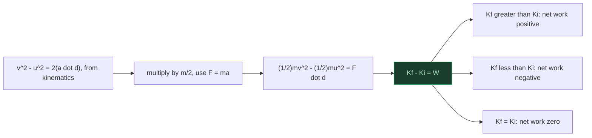
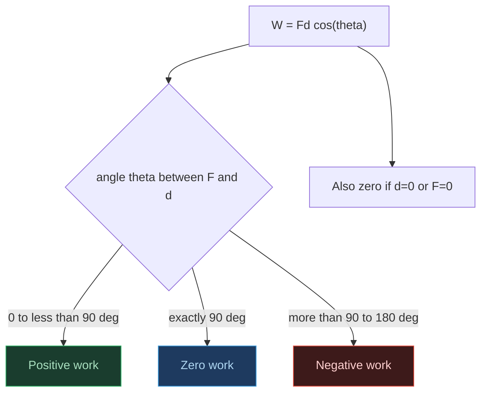
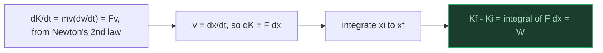
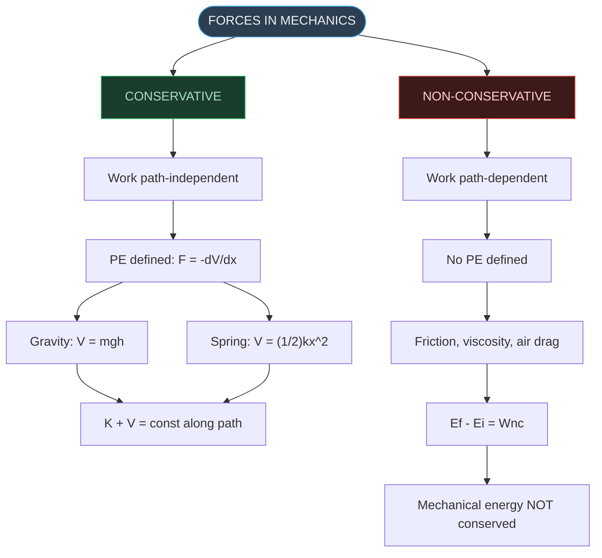
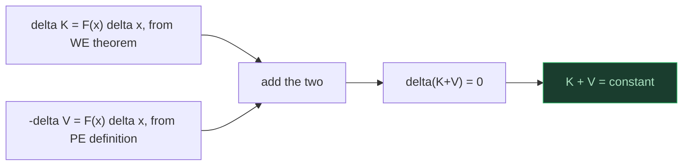
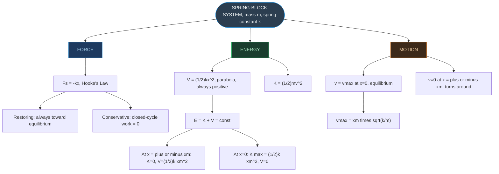
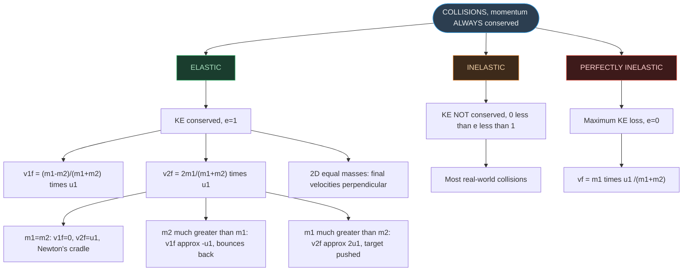
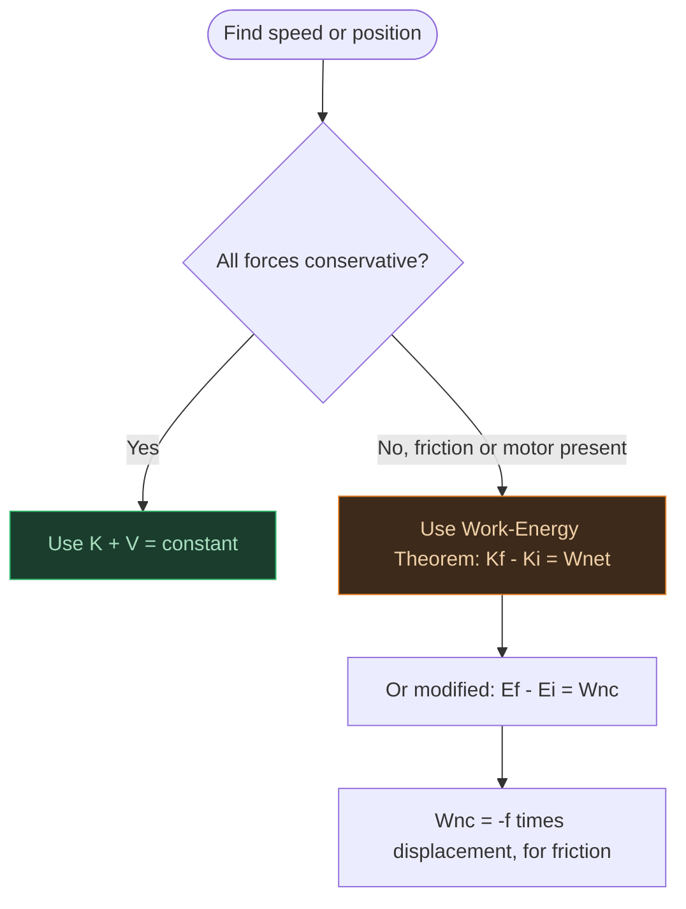

# Physics | Chapter 05 | Work Energy and Power | CNOTES
> **Work, Energy and Power** | Board · NEET · JEE

---

## SECTION 1 — SCALAR (DOT) PRODUCT OF TWO VECTORS

### 1.1 Definition
- **Dot product**: A dot B = AB cos(theta), theta = angle between A and B — result is a scalar, not a vector (contrast: cross product gives a vector, Ch. 6).
- Geometric meaning: A dot B = A(B cos theta) = B(A cos theta) — magnitude of one vector times the component of the other along it.

### 1.2 Properties of Dot Product
| Property | Expression |
|---|---|
| Commutative | A dot B = B dot A |
| Distributive | A dot (B+C) = A dot B + A dot C |
| Scalar multiply | A dot (lambda B) = lambda(A dot B) |
| Perpendicular | A dot B = 0 |
| Parallel | A dot B = AB |
| Self dot product | A dot A = A^2 |

- Unit vectors: i-hat dot i-hat = j-hat dot j-hat = k-hat dot k-hat = 1; i-hat dot j-hat = j-hat dot k-hat = k-hat dot i-hat = 0.
- Component form: A dot B = AxBx + AyBy + AzBz.

### 1.3 Solved Example (NCERT 5.1)
- F = (3, 4, −5), d = (5, 4, 3) → F dot d = 15 + 16 − 15 = **16 units**.
- F = d = sqrt(50) → cos theta = 16/50 = 0.32 → theta = cos⁻¹(0.32).
- Projection of F on d = (F dot d)/d = 16/sqrt(50) ≈ **2.26 units**.

---

## SECTION 2 — THE WORK–ENERGY THEOREM

### 2.1 Derivation (Constant Force, 1D → 3D)
- Start: v² − u² = 2(a dot d).
- Multiply by m/2, use F = ma: (1/2)mv² − (1/2)mu² = F dot d.
- Result: **Kf − Ki = W** — the Work-Energy Theorem.
- Scalar form of Newton's 2nd law — direction information is integrated over, not retained.

### 2.2 Solved — Raindrop (NCERT 5.2)
- m = 10⁻³ kg, h = 10³ m, v_f = 50 m/s.
- Wg = mgh = **10.0 J**.
- ΔK = (1/2)mv² = **1.25 J**.
- Wr = ΔK − Wg = 1.25 − 10.0 = **−8.75 J** (resistive force, negative as expected).

---

## SECTION 3 — WORK

### 3.1 Definition
- **W = Fd cos(theta) = F dot d** (theta = angle between F and d).
- SI unit: joule (J) = N m = kg m² s⁻²; dimensional formula [ML²T⁻²].
- Scalar quantity — can be positive, negative, or zero.

### 3.2 When is Work Zero?
| Condition | Example |
|---|---|
| d = 0 | Weightlifter holding load stationary |
| F = 0 | Block on frictionless surface, no applied force |
| F perpendicular to d (theta = 90°) | Moon's orbital motion; porter carrying load horizontally |

### 3.3 Sign of Work
| theta | Work | Example |
|---|---|---|
| 0°–90° | Positive | Applied force along motion |
| 90° | Zero | Normal force on moving body |
| 90°–180° | Negative | Friction opposing motion |

- Trap: work by friction is negative; work by gravity on a rising body is negative.

### 3.4 Alternative Units of Energy
| Unit | Value in J |
|---|---|
| erg | 10⁻⁷ |
| eV | 1.6 × 10⁻¹⁹ |
| calorie | 4.186 |
| kWh | 3.6 × 10⁶ |

### 3.5 Solved — Cyclist Skidding to Stop (NCERT 5.3)
- Road on cycle: F = 200 N, theta = 180°, d = 10 m → W = **−2000 J**.
- Cycle on road: road doesn't move → **W = 0**.
- Trap: W₁₂ + W₂₁ ≠ 0 in general, even though the force pair is equal and opposite (Newton's 3rd law) — work depends on each body's own displacement.

### 3.6 Additional Practice — Work Done Using Vectors
- Example A: F = (1, 5, 7) N, S = (6, 0, 9) m → W = 6 + 0 + 63 = **69 J**.
- Example B: F = (2, −3, 1) N, A(1,2,−3) → B(2,0,−5) m → S = (1, −2, −2) → W = 2 + 6 − 2 = **6 J**.
- Example C: F₁ = (2,−3,4) N, F₂ = (−1,2,−3) N, A(2,1,0) → B(−3,−4,−2) m → F_net = (1,−1,1), S = (−5,−5,−2) → W = −5 + 5 − 2 = **−2 J**.
- Trap: build S = OB − OA component-by-component; a single dropped sign flips the answer's sign.

---

## SECTION 4 — KINETIC ENERGY

### 4.1 Definition
- **K = (1/2)mv² = p²/(2m)**, p = mv.
- Always non-negative scalar; SI unit J; dimensional formula [ML²T⁻²].
- Equals the work needed to bring a body from rest to speed v.

### 4.2 Typical Kinetic Energies (NCERT Table 5.2)
| Object | Mass (kg) | Speed (m/s) | KE (J) |
|---|---|---|---|
| Car | 2000 | 25 | 6.3 × 10⁵ |
| Running athlete | 70 | 10 | 3.5 × 10³ |
| Bullet | 5 × 10⁻² | 200 | 10³ |
| Stone (dropped 10 m) | 1 | 14 | 10² |
| Raindrop (terminal) | 3.5 × 10⁻⁵ | 9 | 1.4 × 10⁻³ |
| Air molecule | ≈ 10⁻²⁶ | 500 | ≈ 10⁻²¹ |

- K is proportional to v² (quadratic in speed, linear in mass) — a tiny fast bullet and a heavy slow athlete land near the same order of magnitude.

### 4.3 Solved — Bullet Through Plywood (NCERT 5.4)
- m = 0.05 kg, vᵢ = 200 m/s, K_f = 10% of Kᵢ.
- Kᵢ = 1000 J, K_f = 100 J → v_f = sqrt(2×100/0.05) = **63.2 m/s**.
- Trap: speed drops by 68%, not 90% — K is proportional to v², not v.

---

## SECTION 5 — WORK DONE BY A VARIABLE FORCE

### 5.1 Integration Approach
- **W = integral from xi to xf of F(x) dx** — area under the F–x graph.
- Approximation: W ≈ sum of F(x)Δx, exact as Δx → 0.

### 5.2 Solved — Woman Pushing Trunk (NCERT 5.5)
- Applied force: 100 N (0–10 m), linearly decreasing to 50 N (10–20 m). Friction: 50 N constant, 20 m.
- W_F = 100×10 + (1/2)(100+50)×10 = 1000 + 750 = **1750 J**.
- W_f = −50×20 = **−1000 J**.

### 5.3 Additional Practice — Variable Force Integrals
- F(x) = 7 − 2x + 3x², 0→5 m: W = [7x − x² + x³] from 0 to 5 = 35 − 25 + 125 = **135 J**.
- F(x) = a + bx, 0→d: W = ad + bd²/2 = **(2ad + bd²)/2**.
- F(x) = 15 + 0.5x, 0→2 m: W = [15x + x²/4] from 0 to 2 = 30 + 1 = **31 J**.

---

## SECTION 6 — WORK–ENERGY THEOREM FOR VARIABLE FORCE

### 6.1 Proof
- dK/dt = mv(dv/dt) = Fv → dK = F dx.
- Integrating: **Kf − Ki = integral of F dx = W** — holds for variable forces too, not just constant force.

### 6.2 Important Distinctions
| Newton's 2nd Law | Work–Energy Theorem |
|---|---|
| Vector form | Scalar form |
| Instantaneous | Integrated over displacement |
| Retains direction | Direction lost |
| F = ma | Kf − Ki = W |

### 6.3 Solved — Rough Patch with Variable Force (NCERT 5.6)
- m = 1 kg, vᵢ = 2 m/s, F_r = −k/x (k = 0.5 J), 0.1 < x < 2.01 m.
- K_f = 2 − 0.5 ln(20.1) = 2 − 1.5 = **0.5 J**.
- v_f = sqrt(2K_f/m) = **1 m/s**.

---

## SECTION 7 — CONCEPT OF POTENTIAL ENERGY

### 7.1 What is Potential Energy?
- **PE** — stored energy due to position/configuration; convertible to KE when constraints are removed.
- Examples: stretched bow-string, compressed spring, water behind a dam.
- Defined only for conservative forces — not for friction or other non-conservative forces.

### 7.2 Gravitational Potential Energy
- **V(h) = mgh** — near-Earth-surface approximation (g constant).
- Reference V = 0 at ground — arbitrary choice.
- F = −dV/dh = −mg (negative sign → downward force).

### 7.3 Conservative Forces — Defining Property
- A force is conservative if F(x) = −dV/dx (1D).
- Equivalent conditions: work depends only on endpoints; work over a closed path = 0.
- Conservative: gravitational, electrostatic, magnetostatic, nuclear.
- Non-conservative: friction, air resistance, viscous drag.
- Path-independence example: ball on a frictionless incline reaches sqrt(2gh) at the bottom regardless of incline angle.

### 7.4 Sign of Potential Energy — Physical Meaning
- Convention: V → 0 as separation → infinity (used for gravitational/electrostatic PE between two bodies).
- Negative V means: the system is attractive, stable/bound (external work needed to separate to infinity), and generated by a conservative force.
- This convention differs from §7.2's V = 0-at-ground choice — same physics, different reference point, chosen for convenience.
- Same convention reappears in Ch. 7 (Gravitation) and atomic binding energy.

---

## SECTION 8 — CONSERVATION OF MECHANICAL ENERGY

### 8.1 Derivation
- From WE theorem: ΔK = F(x)Δx.
- From PE definition: −ΔV = F(x)Δx.
- Adding: Δ(K+V) = 0 → **K + V = constant** (conservative forces only).
- Equivalently: Kᵢ + V(xᵢ) = K_f + V(x_f).

### 8.2 Ball Dropped from Height H
| Height | KE | PE | Total E |
|---|---|---|---|
| H (top) | 0 | mgH | mgH |
| h (mid) | (1/2)mv_h² | mgh | mgH |
| 0 (ground) | (1/2)mv_f² | 0 | mgH |

- At ground: v_f = sqrt(2gH) — matches kinematics.

### 8.3 Solved — Bob Completing Circular Loop (NCERT 5.7)
- String length L; at top C, string slack (T_C = 0) → mg = mv_C²/L → v_C = sqrt(gL).
- Energy A→C (height gained 2L): (1/2)mv₀² = (1/2)mv_C² + 2mgL = 5mgL/2 → **v₀ = sqrt(5gL)**.
- At B (height L): (1/2)mv_B² = 5mgL/2 − mgL = 3mgL/2 → **v_B = sqrt(3gL)**.
- K_B : K_C = 3 : 1.
- After C: bob undergoes projectile motion (initial horizontal velocity = v_C).

### 8.4 Summary Table — Energy at Key Points (Bob on Loop)
| Point | Height | Speed | KE | PE |
|---|---|---|---|---|
| A (bottom) | 0 | sqrt(5gL) | 5mgL/2 | 0 |
| B (side) | L | sqrt(3gL) | 3mgL/2 | mgL |
| C (top) | 2L | sqrt(gL) | mgL/2 | 2mgL |

- Total = 5mgL/2 at every point.

---

## SECTION 9 — POTENTIAL ENERGY OF A SPRING

### 9.1 Spring Force (Hooke's Law)
- **F_s = −kx** — x = displacement from equilibrium, k = spring constant (N m⁻¹, [MT⁻²]).
- Negative sign → restoring force, toward equilibrium.
- Stiff spring: large k. Soft spring: small k.

### 9.2 Potential Energy of a Spring
- W_s (0 → x_m) = −(1/2)kx_m² → stored as **V(x) = (1/2)kx²**.
- V always positive (parabolic, symmetric about x = 0); V(0) = 0 by choice.
- Check: F = −dV/dx = −kx. ✓

### 9.3 Spring is a Conservative Force
- Closed cycle (extend then release): net work = 0.
- W_s (xᵢ → x_f) = (1/2)kxᵢ² − (1/2)kx_f² — depends only on endpoints.

### 9.4 Maximum Speed of Oscillating Block
- Released from rest at x = x_m; at x = 0, all PE → KE: (1/2)kx_m² = (1/2)mv_m² → **v_m = x_m·sqrt(k/m)**.
- K vs x and V vs x are complementary parabolas; E = K+V constant.

### 9.5 Speed at an Arbitrary Position
- Total energy E = (1/2)kx_m² (constant, entirely potential at the extreme).
- At position x: E = (1/2)kx² + (1/2)mv² → **v = sqrt[(k/m)(x_m² − x²)]**.
- At x = x_m: v = 0, E = V = (1/2)kx_m². At x = 0: v = v_m = sqrt(k/m)·x_m (matches §9.4).

### 9.6 Solved — Car Colliding with Spring (NCERT 5.8)
- m = 1000 kg, v = 5 m/s, k = 5.25 × 10³ N/m.
- KE = (1/2)×1000×25 = 1.25 × 10⁴ J.
- At max compression: (1/2)kx_m² = KE → **x_m = 2.00 m**.

### 9.7 Solved — With Friction (NCERT 5.9)
- μ = 0.5 → friction force = 5000 N opposing motion.
- WE theorem (not conservation, since friction is non-conservative): (1/2)mv² = (1/2)kx_m² + μmg·x_m.
- Solving: **x_m = 1.35 m** — less than 2.00 m (§9.6), since energy is lost to friction.

### 9.8 Additional Solved — Block Dropped Onto a Vertical Spring
- m = 2 kg, h = 0.40 m, k = 1960 N/m.
- Vertical spring: gravity does work over the entire fall (h+x), unlike the horizontal case (§9.6–9.7) — this is why x appears on both sides, forcing a quadratic instead of a direct square root.
- Energy balance: mg(h+x) = (1/2)kx² → 245x² − 5x − 2 = 0.
- x = (5 + sqrt(1985))/490 ≈ **0.101 m (≈10.1 cm)**.

### 9.9 Remarks on Conservative Forces
- Energy conservation gives positions, not time — time information is absent.
- Not all forces are conservative — friction's PE cannot be defined.
- Zero of PE is arbitrary: spring V = 0 at x = 0; gravity V = 0 at ground.

---

## SECTION 10 — NON-CONSERVATIVE FORCES AND ENERGY

### 10.1 Modified Energy Equation
- When conservative and non-conservative forces both act: **E_f − Eᵢ = W_nc**.
- Friction: W_nc < 0 → E_f < Eᵢ (energy decreases).
- Motor/engine doing work on system: W_nc > 0 → E_f > Eᵢ.
- Trap: unlike conservative-force work, W_nc depends on the path taken.

---

## SECTION 11 — POWER

### 11.1 Definition
- **Average power: P_av = W/t.**
- **Instantaneous power: P = dW/dt = F dot v** (v = instantaneous velocity).
- Scalar quantity; SI unit watt (W) = J s⁻¹ = kg m² s⁻³; dimensional formula [ML²T⁻³].
- Named after James Watt.

### 11.2 Other Units of Power
| Unit | Equivalent |
|---|---|
| Horse-power (hp) | 746 W |
| kWh | 3.6 × 10⁶ J — unit of ENERGY, not power |

- Trap: kWh = power × time = energy; 1 kWh = 1000 W × 3600 s = 3.6 × 10⁶ J.

### 11.3 Solved — Elevator (NCERT 5.10)
- Load = 1800 kg, v = 2 m/s constant, friction = 4000 N.
- F = mg + F_f = 18000 + 4000 = 22000 N.
- P = Fv = 22000×2 = 44000 W = 44 kW.
- In hp: 44000/746 ≈ **59 hp**.

---

## SECTION 12 — COLLISIONS

### 12.1 What is a Collision?
- **Collision** — brief interaction exchanging momentum/energy via impulsive forces.
- Total linear momentum always conserved (Newton's 3rd law). KE may or may not be conserved.
- **Scattering**: interaction via action-at-a-distance (e.g. alpha particle + nucleus, comet + Sun) — same conservation principles, through field forces.

### 12.2 Types of Collisions
| Type | Momentum | KE | Notes |
|---|---|---|---|
| Elastic | Conserved | Conserved | Ideal; billiard balls (approx.) |
| Inelastic | Conserved | Not conserved | Most real collisions |
| Perfectly Inelastic | Conserved | Maximum loss | Bodies stick together |

- Golden Rule: momentum is always conserved (no external force); KE conservation is only in elastic collisions.

### 12.3 Completely Inelastic Collision (1D)
- m₁ (moving, v₁ᵢ) + m₂ (at rest) stick together: **v_f = m₁v₁ᵢ/(m₁+m₂)**.
- KE lost: **ΔK = (1/2)[m₁m₂/(m₁+m₂)]v₁ᵢ²** — always positive.

### 12.4 General Elastic Collision — Both Bodies Moving
- Momentum: m₁(u₁ − v₁) = m₂(v₂ − u₂).
- KE: m₁(u₁² − v₁²) = m₂(v₂² − u₂²).
- Dividing: u₁ + v₁ = v₂ + u₂ → u₁ − u₂ = v₂ − v₁ (relative speed of approach = relative speed of separation; e = 1 for elastic).
- Solving: **v₁ = [(m₁−m₂)/(m₁+m₂)]u₁ + [2m₂/(m₁+m₂)]u₂**; **v₂ = [(m₂−m₁)/(m₁+m₂)]u₂ + [2m₁/(m₁+m₂)]u₁** (symmetric — swap labels 1↔2).

### 12.5 Elastic Collision — Special Case: Target at Rest
- Setting u₂ = 0 in §12.4: **v₁f = [(m₁−m₂)/(m₁+m₂)]v₁ᵢ**; **v₂f = [2m₁/(m₁+m₂)]v₁ᵢ**.
- Check: v₂f − v₁f = v₁ᵢ − v₂ᵢ (consistent with §12.4's relative-velocity result).

### 12.6 Special Cases of Elastic Collision
| Case | Condition | Result |
|---|---|---|
| Equal masses | m₁=m₂ | v₁f=0; v₂f=v₁ᵢ (complete transfer) |
| Very heavy target | m₂≫m₁ | v₁f≈−v₁ᵢ; v₂f≈0 (bounces back) |
| Very heavy projectile | m₁≫m₂ | v₁f≈v₁ᵢ; v₂f≈2v₁ᵢ (target pushed) |

- Equal-mass elastic collision = basis of Newton's cradle.

### 12.7 Neutron Moderation (NCERT 5.11) — Application
- Fractional KE retained: f₁ = [(m₁−m₂)/(m₁+m₂)]².

| Moderator | m₂/m₁ | KE retained | KE transferred |
|---|---|---|---|
| Deuterium (D₂O) | 2 | 1/9 ≈ 11% | 8/9 ≈ 89% |
| Carbon (graphite) | 12 | (11/13)² ≈ 71.6% | 28.4% |

- Deuterium is the more efficient moderator.

### 12.8 Elastic Collision in 2D (Glancing Collision)
- x-momentum: m₁v₁ᵢ = m₁v₁f cos θ₁ + m₂v₂f cos θ₂.
- y-momentum: 0 = m₁v₁f sin θ₁ − m₂v₂f sin θ₂.
- KE (elastic): (1/2)m₁v₁ᵢ² = (1/2)m₁v₁f² + (1/2)m₂v₂f².
- 4 unknowns (v₁f, v₂f, θ₁, θ₂), 3 equations → one more condition (e.g. θ₁) needed.

### 12.9 Solved — Billiard Balls (NCERT 5.12)
- Equal masses, θ₂ = 37°, elastic.
- Momentum (vector): v₁ᵢ = v₁f + v₂f → v₁ᵢ² = v₁f² + v₂f² + 2(v₁f dot v₂f).
- KE (equal masses): v₁ᵢ² = v₁f² + v₂f².
- Comparing: v₁f dot v₂f = 0 → θ₁ + θ₂ = 90° → **θ₁ = 53°**.
- Golden Result: two equal masses in a glancing elastic collision (one initially at rest) always separate at 90° to each other.

### 12.10 Additional Practice — More Collision Problems
- Problem A: m₁ = 2 kg hits stationary m, rebounds at 1/3 initial speed (1D elastic) → (2−m)/(2+m) = −1/3 → **m = 4 kg**.
- Problem B: 10 kg at +20 m/s meets 20 kg at −10 m/s (1D elastic, general case, §12.4) → v₁ = −20 m/s, v₂ = +10 m/s.
- Zero total momentum + elastic 1D collision ⟹ both velocities simply reverse (v₁ = −u₁, v₂ = −u₂) — a general feature, not a coincidence of these numbers.
- Problem C: equal masses M, one at 9 m/s hits stationary M, both leave at 30° to the original line (momentum only, not elastic) → v₁ = v₂ = 3sqrt(3) ≈ 5.2 m/s.
- Check: initial KE ∝ 81, final KE ∝ 54 — not equal, so NOT elastic; the "equal masses ⟹ 90° apart" result (§12.9) does not apply here since that requires an elastic collision.

---

## SECTION 13 — PROBLEM-SOLVING STRATEGY

### 13.1 Work–Energy Problems

- Identify all forces acting on the body.
- Calculate work done by each force over the displacement.
- Apply Kf − Ki = W_net.
- If conservative forces only: use K+V = constant (simplest).
- If friction present: E_f − Eᵢ = W_nc = −friction force × displacement.

### 13.2 Collision Problems
- Draw a before/after diagram; label all masses and velocities.
- Check elastic (KE conserved) vs inelastic.
- Always apply momentum conservation first.
- Elastic: general formulas (§12.4) if both bodies move initially; special-case formulas (§12.5) if the target starts at rest.
- Perfectly inelastic: combined-velocity formula (§12.3).
- Energy loss if required: ΔK = Kᵢ − K_f.

---

## Points to Ponder

- Work is force-specific: state "work done BY [force] ON [body]" — work by friction is not the same as work by an applied force.
- Work can be negative — unlike mass and KE (always positive), work by friction or by gravity on a rising body is negative.
- Cricketer moving hands back: momentum change is fixed by the catch; increasing contact time reduces the force, not the momentum change.
- Satellite spiraling inward speeds up despite losing total mechanical energy — PE decreases more than KE increases (air drag removes energy overall).
- Rocket casing heat comes from the rocket's own kinetic energy, which ultimately traces back to the fuel's chemical energy.
- Comet on a closed orbit: gravity is conservative → net work over a full orbit = 0 → KE unchanged from start to end.
- PE is undetermined up to a constant — only changes in PE matter physically; the zero reference must stay consistent within one problem.
- F = −kx holds for ideal springs only; real springs deviate at large extensions.
- KE is not conserved at every instant during an elastic collision — only the initial and final states matter.
- W₁₂ + W₂₁ is not necessarily zero for internal action-reaction force pairs — this is why sliding blocks can lose KE to each other.
- Zero total momentum plus an elastic collision means both velocities simply reverse: v₁ = −u₁, v₂ = −u₂.
- Negative PE, under the V→0-at-infinity convention, always means a bound, attractive system — the same logic reappears in gravitation (Ch. 7) and atomic binding energy.

---

## Rapid Reference

| Fact | Value |
|---|---|
| Work | W = F dot d = Fd cos(theta); SI: J; [ML²T⁻²] |
| Work (variable force) | W = integral of F(x) dx; area under F–x graph |
| Kinetic energy | K = (1/2)mv² = p²/(2m) |
| Work-Energy Theorem | Kf − Ki = W_net (constant or variable force) |
| Gravitational PE | V = mgh (V=0 at ground) |
| Spring PE | V = (1/2)kx² (V=0 at equilibrium) |
| Conservative force | F = −dV/dx |
| Conservation of Mechanical Energy | K + V = const (conservative forces only) |
| With friction | E_f − Eᵢ = W_nc (W_nc < 0 for friction) |
| Spring — max speed | v_m = x_m·sqrt(k/m) |
| Spring — speed at x | v = sqrt[(k/m)(x_m² − x²)] |
| Power (average) | P_av = W/t; SI: W; [ML²T⁻³] |
| Power (instantaneous) | P = F dot v |
| 1 hp | 746 W |
| 1 kWh | 3.6 × 10⁶ J (energy, not power) |
| 1 erg | 10⁻⁷ J |
| 1 eV | 1.6 × 10⁻¹⁹ J |
| 1 calorie | 4.186 J |
| Elastic collision (general) | v₁ = [(m₁−m₂)/(m₁+m₂)]u₁ + [2m₂/(m₁+m₂)]u₂; v₂ symmetric |
| Elastic collision (target at rest) | v₁f = [(m₁−m₂)/(m₁+m₂)]v₁ᵢ; v₂f = [2m₁/(m₁+m₂)]v₁ᵢ |
| Equal-mass elastic, target at rest | v₁f = 0; v₂f = v₁ᵢ |
| Perfectly inelastic | v_f = m₁v₁ᵢ/(m₁+m₂); ΔK = (1/2)[m₁m₂/(m₁+m₂)]v₁ᵢ² |
| Circular loop — min speed at top | v_C = sqrt(gL) |
| Circular loop — min speed at bottom | v₀ = sqrt(5gL) |
| Circular loop — speed at side (height L) | v_B = sqrt(3gL) |
| Neutron moderation — deuterium | ~89% KE transferred per collision |
| Coefficient of restitution | e=1 (elastic); 0<e<1 (inelastic); e=0 (perfectly inelastic) |

---

*End of Condensed Notes — Physics Ch. 5*