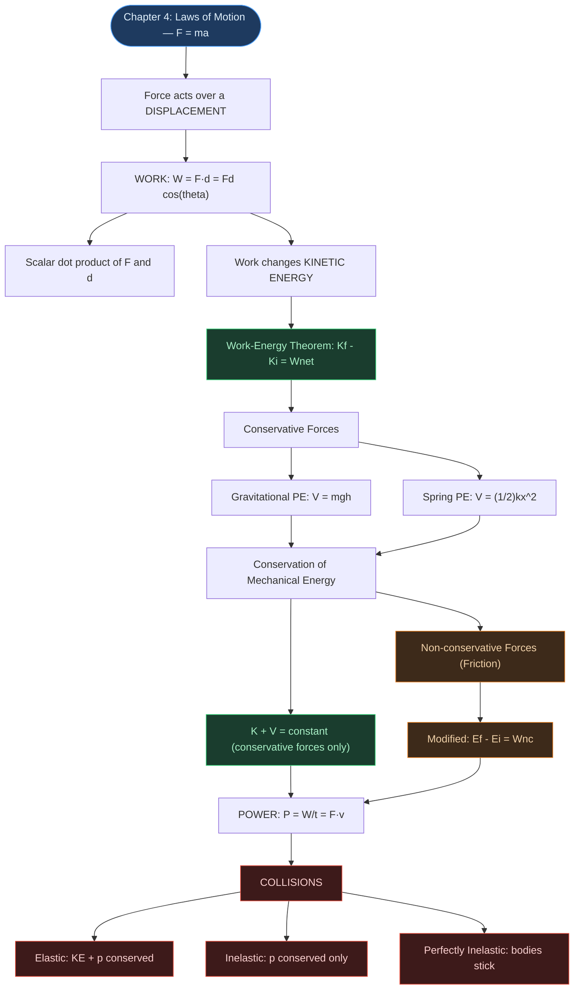

# ⚡ CHAPTER 5 — WORK, ENERGY AND POWER
> **Complete Study Notes** | Board · NEET · JEE Layered

---

## 🗺️ CONCEPT ROADMAP



---

## SECTION 1 — SCALAR (DOT) PRODUCT OF TWO VECTORS ⭐

### 1.1 Definition

The scalar product (dot product) of two vectors **A** and **B** is defined as:

$$\mathbf{A} \cdot \mathbf{B} = AB\cos\theta \quad \text{...(5.1a)}$$

where θ is the angle between the two vectors.

> [!info] Definition
> The dot product takes two vectors and returns a **scalar** (no direction), even though **A** and **B** are vectors. This is different from the *vector* (cross) product, which returns another vector (covered in Chapter 6).

**Geometric interpretation:** **A·B** is the product of the magnitude of one vector and the component of the other along it:

$$\mathbf{A}\cdot\mathbf{B} = A(B\cos\theta) = B(A\cos\theta)$$

```tikz
\usetikzlibrary{arrows.meta}
\begin{tikzpicture}[>={Stealth[length=7pt,width=5pt]}, thick, scale=1.05]
  \coordinate (O) at (0,0);
  \coordinate (A) at (4,0);
  \coordinate (B) at (2.45,2.06);
  \coordinate (F) at (2.45,0);
  \draw[->, blue!70!black, line width=1.6pt] (O) -- (A) node[midway, below, font=\small] {$\mathbf{A}$};
  \draw[->, green!55!black, line width=1.6pt] (O) -- (B) node[midway, above left, font=\small] {$\mathbf{B}$};
  \draw[dashed, gray] (B) -- (F);
  \draw[orange!80!black, line width=1.6pt] (O) -- (F) node[midway, below, font=\small, orange!80!black] {$B\cos\theta$};
  \draw[orange!80!black] (0.7,0) arc (0:40:0.7);
  \node[font=\small, orange!80!black] at (0.95,0.35) {$\theta$};
  \node[below, font=\small, text=gray, style=italic] at (2,-0.9) {$\mathbf{A}\cdot\mathbf{B}=AB\cos\theta$: product of $A$ and the projection of $\mathbf{B}$ onto $\mathbf{A}$};
\end{tikzpicture}
```

### 1.2 Properties of Dot Product

| Property | Expression |
|:---|:---|
| **Commutative** | **A·B** = **B·A** |
| **Distributive** | **A·(B + C)** = **A·B** + **A·C** |
| **Scalar multiply** | **A·(λB)** = λ(**A·B**) |
| **Perpendicular vectors** | **A·B** = 0 (cos90° = 0) |
| **Parallel vectors** | **A·B** = AB (cos0° = 1) |
| **Self dot product** | **A·A** = A² |

**For unit vectors î, ĵ, k̂:**

$$\hat{i}\cdot\hat{i} = \hat{j}\cdot\hat{j} = \hat{k}\cdot\hat{k} = 1$$

$$\hat{i}\cdot\hat{j} = \hat{j}\cdot\hat{k} = \hat{k}\cdot\hat{i} = 0$$

**In component form:** If **A** = Axî + Ayĵ + Azk̂ and **B** = Bxî + Byĵ + Bzk̂,

$$\mathbf{A}\cdot\mathbf{B} = A_xB_x + A_yB_y + A_zB_z \quad \text{...(5.1b)}$$

### 1.3 Solved Example (NCERT 5.1)

Given:
$$\vec F = 3\hat i + 4\hat j - 5\hat k \ \text{units}, \qquad \vec d = 5\hat i + 4\hat j + 3\hat k \ \text{units}$$

**Step 1 — Dot product:**
$$\vec F \cdot \vec d = (3)(5)+(4)(4)+(-5)(3) = 15+16-15 = \mathbf{16\ units}$$

**Step 2 — Magnitudes of F and d:**
$$F = \sqrt{3^2+4^2+(-5)^2} = \sqrt{50}, \qquad d = \sqrt{5^2+4^2+3^2} = \sqrt{50}$$

**Step 3 — Angle between F and d:**
$$\cos\theta = \frac{\vec F\cdot\vec d}{Fd} = \frac{16}{\sqrt{50}\times\sqrt{50}} = \frac{16}{50} = 0.32 \ \implies\ \theta = \cos^{-1}(0.32)$$

> [!note] Gap-fill — projection of F on d
> The printed NCERT solution stops at cosθ, but the question also asks for the **projection of F on d**, i.e. the component of **F** along **d**:
> $$\text{Projection of }\vec F\text{ on }\vec d = \frac{\vec F\cdot\vec d}{d} = \frac{16}{\sqrt{50}} = \frac{16}{5\sqrt{2}} = 1.6\sqrt{2} \approx \mathbf{2.26\ units}$$

---

## SECTION 2 — THE WORK–ENERGY THEOREM ⭐⭐

### 2.1 Derivation (Constant Force, 1D → 3D)

**Step 1 — Start from kinematics** (constant acceleration, generalised to vectors):
$$v^2 - u^2 = 2\,\vec a\cdot\vec d$$

**Step 2 — Multiply both sides by $m/2$, and use Newton's Second Law** ($\vec F = m\vec a$):
$$\frac{1}{2}mv^2 - \frac{1}{2}mu^2 = m\,\vec a\cdot\vec d = \vec F\cdot\vec d$$

**Step 3 — Identify each side as kinetic energy and work:**
$$\boxed{K_f - K_i = W} \qquad \text{...(5.3)}$$

> [!important] Work–Energy Theorem
> The change in kinetic energy of a particle is equal to the net work done on it by all the forces acting on it, over the displacement considered.

> [!note] Key Insight
> The WE theorem is a **scalar** form of Newton's Second Law. Direction information from Newton's 2nd law is "integrated over" and not explicitly retained.

### 2.2 Solved — Raindrop (NCERT 5.2)

Drop: m = 1.00 g = 10⁻³ kg; h = 1.00 km = 10³ m; final speed = 50.0 m s⁻¹

> [!example] Solution
>
> **(a) Work done by gravity:**
> $$W_g = mgh = 10^{-3}\times 10\times 10^3 = \mathbf{10.0\ J}$$
>
> **(b) Change in kinetic energy:**
> $$\Delta K = \frac{1}{2}mv^2 - 0 = \frac{1}{2}\times 10^{-3}\times 50^2 = \mathbf{1.25\ J}$$
>
> **Work done by the resistive force:**
> $$W_r = \Delta K - W_g = 1.25 - 10.0 = \mathbf{-8.75\ J} \quad \text{(negative, as expected)}$$

---

## SECTION 3 — WORK ⭐⭐

### 3.1 Definition

> **Work done by a constant force F on a body undergoing displacement d:**

$$\boxed{W = Fd\cos\theta = \mathbf{F}\cdot\mathbf{d}} \quad \text{...(5.4)}$$

where θ = angle between **F** and **d**.

- **SI Unit:** **Joule (J)** = N m = kg m² s⁻²
- **Dimensional Formula:** **[ML²T⁻²]**
- Work is a **scalar** quantity; can be **positive, negative, or zero**

```tikz
\usetikzlibrary{arrows.meta}
\begin{tikzpicture}[>={Stealth[length=7pt,width=5pt]}, thick, scale=1.0]
  \draw[line width=1pt] (-0.3,0) -- (6.3,0);
  \draw[gray] (0,0)--(-0.2,-0.25) (0.6,0)--(0.4,-0.25) (1.2,0)--(1.0,-0.25)
              (1.8,0)--(1.6,-0.25) (2.4,0)--(2.2,-0.25) (3.0,0)--(2.8,-0.25)
              (3.6,0)--(3.4,-0.25) (4.2,0)--(4.0,-0.25) (4.8,0)--(4.6,-0.25)
              (5.4,0)--(5.2,-0.25) (6.0,0)--(5.8,-0.25);
  \draw[fill=blue!15] (0,0) rectangle (1,0.8);
  \draw[dashed, fill=blue!5] (4,0) rectangle (5,0.8);
  \draw[->, black, line width=1pt] (0.5,-0.6) -- (4.5,-0.6) node[midway, below, font=\small] {$d$};
  \draw[->, red!75!black, line width=1.8pt] (0.5,0.4) -- (2.1,1.55) node[above, font=\small] {$\mathbf{F}$};
  \draw[red!75!black] (1.0,0.4) arc (0:35:0.5);
  \node[font=\small, red!75!black] at (1.35,0.62) {$\theta$};
  \node[below, font=\small, text=gray, style=italic] at (2.5,-1.1) {$W=(F\cos\theta)d=\mathbf{F}\cdot\mathbf{d}$ — only the component of $\mathbf{F}$ along $d$ does work};
\end{tikzpicture}
```

### 3.2 When is Work Zero?

| Condition | Example |
|:---|:---|
| Displacement = 0 | Weightlifter holding 150 kg stationary for 30 s |
| Force = 0 | Block sliding on perfectly frictionless surface |
| F ⊥ d (θ = 90°) | Moon's orbital motion (gravity ⊥ velocity); porter walking horizontally with load on head |

### 3.3 Sign of Work

| θ | cosθ | Work | Example |
|:---|:---|:---|:---|
| 0° to 90° | Positive | **Positive** | Applied force in direction of motion |
| Exactly 90° | Zero | **Zero** | Normal force on moving body |
| 90° to 180° | Negative | **Negative** | Friction opposes motion (θ = 180°) |

> [!warning] Exam Trap
> Work done by friction is negative (opposes motion). Work done by gravity on a rising body is negative.

### 3.4 Alternative Units of Energy

| Unit | Equivalent in J |
|:---|:---|
| erg | 10⁻⁷ J |
| electron volt (eV) | 1.6 × 10⁻¹⁹ J |
| calorie (cal) | 4.186 J |
| kilowatt hour (kWh) | 3.6 × 10⁶ J |

### 3.5 Solved — Cyclist skidding to stop (NCERT 5.3)

Force on cycle by road = 200 N opposing motion (θ = 180°); d = 10 m

> [!example] Solution
>
> **(a) Work done by road on cycle:**
> $$W_r = 200\times 10\times\cos 180° = \mathbf{-2000\ J}$$
>
> **(b) Work done by cycle on road:**
> Road undergoes **no displacement** $\implies W = 0$

> [!note] Key Insight
> Though force on road is equal and opposite (Newton's 3rd law), work done on road is zero because road doesn't move. $W_{12} + W_{21} \neq 0$ in general.

### 3.6 Additional Practice — Work Done Using Vectors (New)

Since work is fundamentally $\mathbf{F}\cdot\mathbf{d}$, these problems test direct vector computation — a common JEE/board pattern, especially when the displacement is given as two position vectors rather than a single displacement vector.

> [!example] Example A — force and displacement given directly
> A force $\vec F = \hat i + 5\hat j + 7\hat k$ N acts on a particle and displaces it through $\vec S = 6\hat i + 9\hat k$ m. Find the work done.
> $$W = \vec F \cdot \vec S = (1)(6) + (5)(0) + (7)(9) = 6 + 0 + 63 = \mathbf{69\ J}$$

> [!example] Example B — displacement from two position vectors
> A force $\vec F = (2\hat i - 3\hat j + \hat k)$ N acts on a body as it moves from $A(1,2,-3)$ to $B(2,0,-5)$ (metres). Find the work done.
> $$\vec S = \vec{OB} - \vec{OA} = (2-1)\hat i + (0-2)\hat j + (-5-(-3))\hat k = \hat i - 2\hat j - 2\hat k$$
> $$W = \vec F \cdot \vec S = (2)(1) + (-3)(-2) + (1)(-2) = 2 + 6 - 2 = \mathbf{6\ J}$$

> [!example] Example C — two forces acting together
> Two forces $\vec F_1 = 2\hat i - 3\hat j + 4\hat k$ N and $\vec F_2 = -\hat i + 2\hat j - 3\hat k$ N act simultaneously on a body as it moves from $A(2,1,0)$ to $B(-3,-4,-2)$ (metres). Find the total work done.
> $$\vec F_{net} = \vec F_1 + \vec F_2 = \hat i - \hat j + \hat k$$
> $$\vec S = \vec{OB} - \vec{OA} = (-3-2)\hat i + (-4-1)\hat j + (-2-0)\hat k = -5\hat i - 5\hat j - 2\hat k$$
> $$W = \vec F_{net} \cdot \vec S = (1)(-5) + (-1)(-5) + (1)(-2) = -5 + 5 - 2 = \mathbf{-2\ J}$$

> [!warning] Watch the sign on $\vec S$
> Always build $\vec S = \vec{OB}-\vec{OA}$ component-by-component and re-check each one before dotting with the force — a single dropped sign on one component flips the entire answer from positive to negative work.

---

## SECTION 4 — KINETIC ENERGY ⭐⭐

### 4.1 Definition

> **Kinetic energy (K)** of a body of mass m moving with speed v:

$$\boxed{K = \frac{1}{2}mv^2 = \frac{1}{2}m\mathbf{v}\cdot\mathbf{v}} \quad \text{...(5.5)}$$

- **Scalar quantity**, always **positive**
- SI Unit: **Joule (J)**; Dimensional Formula: **[ML²T⁻²]**
- "Energy of motion" — measure of capacity to do work

**Useful relation:**
$$p = mv \ \implies\ K = \frac{p^2}{2m} = \frac{p\cdot v}{2}$$

### 4.2 Typical Kinetic Energies (NCERT Table 5.2)

A feel for real-world numbers helps sanity-check your answers:

| Object | Mass (kg) | Speed (m s⁻¹) | Kinetic Energy (J) |
|:---|:---|:---|:---|
| Car | 2000 | 25 | 6.3 × 10⁵ |
| Running athlete | 70 | 10 | 3.5 × 10³ |
| Bullet | 5 × 10⁻² | 200 | 10³ |
| Stone dropped from 10 m | 1 | 14 | 10² |
| Raindrop at terminal speed | 3.5 × 10⁻⁵ | 9 | 1.4 × 10⁻³ |
| Air molecule | ≈ 10⁻²⁶ | 500 | ≈ 10⁻²¹ |

> [!note] Reading the table
> K depends on mass **linearly** but on speed **quadratically** ($K \propto v^2$) — that's why a bullet (tiny mass, huge speed) and a running athlete (large mass, modest speed) land in the same order of magnitude of KE.

### 4.3 Solved — Bullet through plywood (NCERT 5.4)

m = 50 g = 0.05 kg; vi = 200 m s⁻¹; Final KE = 10% of initial KE

> [!example] Solution
>
> **Initial and final kinetic energies:**
> $$K_i = \frac{1}{2}\times 0.05\times 200^2 = 1000\ \text{J}, \qquad K_f = 0.1\times 1000 = 100\ \text{J}$$
>
> **Emergent speed:**
> $$v_f = \sqrt{\frac{2\times 100}{0.05}} = \sqrt{4000} = \mathbf{63.2\ m\,s^{-1}}$$
>
> Note: Speed is reduced by 68%, not 90% (since $K\propto v^2$).

---

## SECTION 5 — WORK DONE BY A VARIABLE FORCE ⭐⭐

### 5.1 Integration Approach

For a force F(x) varying with position x:

$$\boxed{W = \int_{x_i}^{x_f} F(x)\, dx} \quad \text{...(5.7)}$$

This equals the **area under the F–x graph** between $x_i$ and $x_f$:

```tikz
\usetikzlibrary{arrows.meta}
\begin{tikzpicture}[>={Stealth[length=7pt,width=5pt]}, thick, scale=1.0]
  \draw[->, line width=1pt] (-0.3,0) -- (6.5,0) node[right, font=\small] {$x$};
  \draw[->, line width=1pt] (0,-0.3) -- (0,4) node[above, font=\small] {$F(x)$};
  \draw[blue!70!black, line width=1.6pt, smooth]
       plot coordinates {(0.3,0.8) (1.0,1.3) (1.8,1.6) (2.6,2.1) (3.4,2.0) (4.2,2.6) (5.0,3.1) (5.8,3.3)};
  \fill[blue!15]
       plot[smooth] coordinates {(1.8,0) (1.8,1.6) (2.6,2.1) (3.4,2.0) (4.2,2.6) (4.2,0)} -- cycle;
  \draw[dashed, gray] (1.8,0) -- (1.8,1.6);
  \draw[dashed, gray] (4.2,0) -- (4.2,2.6);
  \node[below, font=\small] at (1.8,-0.05) {$x_i$};
  \node[below, font=\small] at (4.2,-0.05) {$x_f$};
  \node[font=\small, blue!55!black] at (3.0,1.0) {Area $=\displaystyle\int_{x_i}^{x_f}\!F(x)\,dx=W$};
\end{tikzpicture}
```

**Approximate method:** divide the displacement into small intervals $\Delta x$:

$$W \approx \sum_{x_i}^{x_f} F(x)\,\Delta x$$

As $\Delta x \to 0$, this sum approaches the exact integral above.

### 5.2 Solved — Woman pushing trunk (NCERT 5.5)

Applied force: 100 N for first 10 m, then decreases linearly to 50 N at 20 m. Frictional force: constant 50 N opposing motion over 20 m.

> [!example] Solution
>
> **Work by the woman** (area of rectangle + trapezium):
> $$W_F = 100\times 10 + \frac{1}{2}(100+50)\times 10 = 1000+750 = \mathbf{1750\ J}$$
>
> **Work by friction:**
> $$W_f = (-50)\times 20 = \mathbf{-1000\ J}$$

### 5.3 Additional Practice — Variable Force Integrals (New)

Direct integration drills — useful when $F(x)$ is given as an explicit polynomial rather than a graph.

> [!example] Example A
> $F(x) = 7 - 2x + 3x^2$ N. Find the work done from $x=0$ to $x=5$ m.
> $$W = \int_0^5 (7-2x+3x^2)\,dx = \Big[7x - x^2 + x^3\Big]_0^5 = 7(5)-5^2+5^3 = 35-25+125 = \mathbf{135\ J}$$

> [!example] Example B — general symbolic result
> $F(x) = a + bx$. Find the work done from $x=0$ to $x=d$.
> $$W = \int_0^d (a+bx)\,dx = \Big[ax+\frac{bx^2}{2}\Big]_0^d = ad + \frac{bd^2}{2} = \mathbf{\frac{2ad+bd^2}{2}}$$

> [!example] Example C
> $F(x) = 15 + 0.5x$ N. Find the work done from $x=0$ to $x=2$ m.
> $$W = \int_0^2 (15+0.5x)\,dx = \Big[15x+\frac{x^2}{4}\Big]_0^2 = 15(2)+\frac{4}{4} = 30+1 = \mathbf{31\ J}$$

---

## SECTION 6 — WORK–ENERGY THEOREM FOR VARIABLE FORCE ⭐⭐

### 6.1 Proof

**Step 1 — Rate of change of kinetic energy** (Newton's 2nd law, 1D):
$$\frac{dK}{dt} = \frac{d}{dt}\left(\frac{1}{2}mv^2\right) = mv\frac{dv}{dt} = Fv$$

**Step 2 — Rewrite using $v = dx/dt$:**
$$\frac{dK}{dt} = F\frac{dx}{dt} \ \implies\ dK = F\,dx$$

**Step 3 — Integrate from $x_i$ to $x_f$:**
$$K_f - K_i = \int_{x_i}^{x_f} F\,dx = W \qquad \text{...(5.8b)}$$

> [!note] Generalises Section 2
> This proof shows the WE theorem holds for **variable forces too** — it's a fully general result, not just a constant-force special case.

### 6.2 Important Distinctions

| Newton's 2nd Law | Work–Energy Theorem |
|:---|:---|
| Vector form | Scalar form |
| Instantaneous (force at instant → accel. at same instant) | Integrated over time/displacement interval |
| Contains direction information | Direction information lost |
| F = ma | Kf − Ki = W |

### 6.3 Solved — Rough patch with variable force (NCERT 5.6)

m = 1 kg, vi = 2 m s⁻¹; Retarding force: Fr = −k/x (k = 0.5 J) for 0.1 < x < 2.01 m

> [!example] Solution
>
> **Setting up the integral:**
> $$K_f = K_i + \int_{0.1}^{2.01} \frac{-k}{x}\,dx = 2 - 0.5\ln\!\left(\frac{2.01}{0.1}\right)$$
>
> **Evaluating:**
> $$K_f = 2 - 0.5\ln(20.1) = 2 - 1.5 = \mathbf{0.5\ J}$$
>
> **Final speed:**
> $$v_f = \sqrt{\frac{2K_f}{m}} = \mathbf{1\ m\,s^{-1}}$$

---

## SECTION 7 — CONCEPT OF POTENTIAL ENERGY ⭐⭐⭐

### 7.1 What is Potential Energy?

> **Potential energy** is the **stored energy** of a body by virtue of its **position or configuration**. It is the energy that can be converted into kinetic energy when constraints are removed.

**Examples:** Stretched bow-string → arrow flies off; compressed spring → releases energy; fault lines in Earth's crust → earthquakes; water at height behind a dam → power generation.

> [!important] Key Rule
> Potential energy is defined **only for conservative forces**. It cannot be associated with non-conservative forces like friction.

### 7.2 Gravitational Potential Energy ⭐⭐

Work done by external agent in lifting mass m to height h (against gravity):

$$\boxed{V(h) = mgh} \quad \text{...(gravitational PE)}$$

- Reference: V = 0 at ground (h = 0) — **choice of reference is arbitrary**
- Relation to force:
$$F = -\frac{dV}{dh} = -mg \qquad \text{(negative sign → force acts downward)}$$
- When released from h: KE at ground = mgh (PE → KE conversion)

### 7.3 Conservative Forces — Defining Property

A force F(x) is **conservative** if:

$$F(x) = -\frac{dV}{dx} \quad \text{(1D)} \quad \text{...(5.9)}$$

This means: work done depends only on end points, not on path taken; work done over any closed path = 0.

**Examples of conservative forces:** gravitational, electrostatic, magnetostatic, and nuclear forces — each depends only on the initial and final position of the body, never on the path taken.

**Examples of non-conservative forces:** friction, air resistance, viscous drag.

> [!tip] Path Independence — Exam Note
> Gravitational force on a ball on a frictionless inclined plane: speed at the bottom = $\sqrt{2gh}$ regardless of the angle of inclination — **path independent!** This is the hallmark of a conservative force.

### 7.4 Sign of Potential Energy — Physical Meaning (New)

Since a conservative force is $F=-dV/dx$ (in 3D, $\vec F = -\nabla V$), the **sign of V** carries real physical meaning, not just bookkeeping.

> [!important] Negative Potential Energy
> When potential energy is defined with the standard convention **V → 0 as separation → ∞** (as used for gravitational and electrostatic PE between two bodies), a **negative** V means:
> 1. The system is **attractive** — the force pulls the interacting bodies together.
> 2. It **provides stability** — positive external work must be done to pull the bodies apart to infinity.
> 3. The force generating it is **conservative**.
> 4. The system is **bounded** — the bodies cannot escape each other's influence with the energy they currently have.

> [!note] Where this shows up later
> This convention (V → 0 at infinity, negative V ⟹ bound system) is what makes gravitational PE in orbital mechanics (Chapter 7 — Gravitation) and the binding energy of an atom's electron come out negative — both describe bodies that are *trapped*, not free. It's a different convention from Section 7.2 above, where V = 0 was chosen at the ground for convenience near Earth's surface.

---

## SECTION 8 — CONSERVATION OF MECHANICAL ENERGY ⭐⭐⭐

### 8.1 Derivation

**Step 1 — From the WE theorem**, for a small displacement Δx under a conservative force F:
$$\Delta K = F(x)\,\Delta x$$

**Step 2 — From the definition of potential energy** (Section 7.3):
$$-\Delta V = F(x)\,\Delta x$$

**Step 3 — Add the two equations:**
$$\Delta K + \Delta V = 0$$
$$\boxed{\Delta(K+V) = 0 \implies K+V = \text{constant}} \qquad \text{...(5.10)}$$

Equivalently, over the whole path from $x_i$ to $x_f$:
$$K_i + V(x_i) = K_f + V(x_f) \qquad \text{...(5.11)}$$

> [!important] Principle of Conservation of Mechanical Energy
> The total mechanical energy (K + V) of a system remains constant if all forces acting on it are **conservative**.

### 8.2 Ball Dropped from Height H

| Height | KE | PE | Total E |
|:---|:---|:---|:---|
| H (top) | 0 | mgH | mgH |
| h (intermediate) | $\frac{1}{2}mv_h^2$ | mgh | mgH |
| 0 (ground) | $\frac{1}{2}mv_f^2$ | 0 | mgH |

At the ground:
$$\frac{1}{2}mv_f^2 = mgH \implies v_f = \sqrt{2gH} \quad \checkmark \text{ (matches the kinematics result)}$$

### 8.3 Solved — Bob completing circular loop (NCERT 5.7) ⭐⭐

Bob of mass m on string of length L; horizontal velocity v₀ at lowest point A; string goes slack at highest point C.

> [!example] Solution
>
> **At point C** (string slack ⟹ tension $T_C=0$; gravity alone supplies the centripetal force):
> $$mg = \frac{mv_C^2}{L} \implies v_C = \sqrt{gL}$$
>
> **Energy conservation from A to C** (height gained $= 2L$):
> $$\frac{1}{2}mv_0^2 = \frac{1}{2}mv_C^2 + mg(2L) = \frac{1}{2}m(gL) + 2mgL = \frac{5}{2}mgL$$
> $$\boxed{v_0 = \sqrt{5gL}}$$
>
> **At B** (end of horizontal diameter, height $L$):
> $$\frac{1}{2}mv_B^2 = \frac{5}{2}mgL - mgL = \frac{3}{2}mgL \implies v_B = \sqrt{3gL}$$
>
> **Ratio of kinetic energies:**
> $$\frac{K_B}{K_C} = \frac{3gL}{gL} = \mathbf{3:1}$$
>
> After C, the string slackens and the bob follows **projectile motion** (initial horizontal velocity $=v_C$, directed left).

### 8.4 Summary Table — Energy at Key Points (Bob on Loop)

| Point | Height | Speed | KE | PE |
|:---|:---|:---|:---|:---|
| A (bottom) | 0 | √(5gL) | 5mgL/2 | 0 |
| B (side) | L | √(3gL) | 3mgL/2 | mgL |
| C (top) | 2L | √(gL) | mgL/2 | 2mgL |

**Total = 5mgL/2 at every point ✓**

---

## SECTION 9 — POTENTIAL ENERGY OF A SPRING ⭐⭐⭐

### 9.1 Spring Force (Hooke's Law)

$$\boxed{F_s = -kx} \quad \text{...(Hooke's Law)}$$

where x = displacement from equilibrium; k = spring constant (N m⁻¹) = [MT⁻²]; negative sign → restoring force (always toward equilibrium).

**Stiff spring:** large k | **Soft spring:** small k

### 9.2 Potential Energy of a Spring

Work done by spring force when extended from 0 to $x_m$:

$$W_s = -\int_0^{x_m} kx\,dx = -\frac{kx_m^2}{2}$$

This work is stored as potential energy:

$$\boxed{V(x) = \frac{1}{2}kx^2} \quad \text{...(5.19)}$$

Note: V is always **positive** (parabolic, symmetric about x = 0); V(0) = 0 by choice.

**Verification:**
$$F = -\frac{dV}{dx} = -kx \quad \checkmark$$

### 9.3 Spring is a Conservative Force

Work done by spring in any closed cycle (extend to $x_m$, release back to 0) = 0.

Work from $x_i$ to $x_f$:
$$W_s = \frac{1}{2}kx_i^2 - \frac{1}{2}kx_f^2 \qquad \text{(depends only on end points)} \quad \checkmark$$

### 9.4 Maximum Speed of Oscillating Block

Block of mass m on spring, released from rest at x = xm:

At equilibrium (x = 0): All PE converts to KE:

$$\frac{1}{2}kx_m^2 = \frac{1}{2}mv_m^2 \implies \boxed{v_m = x_m\sqrt{k/m}} \quad \text{...(maximum speed)}$$

The graphs of K and V vs x are complementary parabolas; total E = K + V remains constant.

### 9.5 Speed at an Arbitrary Position (New)

A block released from rest at the extreme position $x=x_m$ has total mechanical energy:
$$E = \frac{1}{2}kx_m^2 \qquad \text{(entirely potential, since it starts from rest)}$$

Since $E$ is constant, at any position $x$ (with $-x_m \le x \le x_m$):
$$E = \underbrace{\frac{1}{2}kx^2}_{V(x)} + \underbrace{\frac{1}{2}mv^2}_{K}$$

Solving for the speed:
$$\boxed{v = \sqrt{\frac{k}{m}\left(x_m^2 - x^2\right)}}$$

> [!example] Three special cases
> **At the extreme position** ($x=x_m$): $v=0$, and
> $$E = V = \frac{1}{2}kx_m^2$$
>
> **At the equilibrium position** ($x=0$): $V=0$, all energy is kinetic:
> $$v_m = \sqrt{\frac{k}{m}}\,x_m \qquad \text{(maximum speed — matches Section 9.4)}$$
>
> **At any intermediate position:** both K and V are non-zero, and they always sum to the constant $E = \tfrac12kx_m^2$.

### 9.6 Solved — Car colliding with spring (NCERT 5.8)

m = 1000 kg; v = 18 km/h = 5 m s⁻¹; k = 5.25 × 10³ N m⁻¹

> [!example] Solution
>
> **Kinetic energy of the car:**
> $$KE = \frac{1}{2}\times 1000\times 25 = 1.25\times 10^4\ \text{J}$$
>
> **At maximum compression $x_m$, all KE converts to spring PE:**
> $$\frac{1}{2}kx_m^2 = 1.25\times 10^4 \implies x_m = \sqrt{\frac{2\times 1.25\times 10^4}{5.25\times 10^3}} = \mathbf{2.00\ m}$$

### 9.7 Solved — With friction (NCERT 5.9)

Now μ = 0.5 (frictional force = 0.5 × 1000 × 10 = 5000 N opposes motion)

> [!example] Solution
>
> Using the WE theorem (**not** conservation of mechanical energy, since friction is non-conservative):
> $$\frac{1}{2}mv^2 = \frac{1}{2}kx_m^2 + \mu mg\,x_m$$
> $$kx_m^2 + 2\mu mg\,x_m - mv^2 = 0 \implies x_m = \mathbf{1.35\ m}$$
>
> (Less than 2.00 m from Section 9.6, because energy is lost to friction.) ✓

### 9.8 Solved — Block Dropped Onto a Vertical Spring (New)

A block of mass $m=2$ kg is dropped from a height $h=0.40$ m above a vertical spring of spring constant $k=1960\ \text{N m}^{-1}$. Find the maximum compression of the spring.

> [!example] Solution
> Unlike the horizontal-spring case above, **gravity keeps doing work during the compression itself** — both the fall height and the compression $x$ enter the energy budget together. Taking $V=0$ at the point where the block first touches the spring:
>
> **Energy balance** (loss in gravitational PE = gain in spring PE, over the total fall distance $h+x$):
> $$mg(h+x) = \frac{1}{2}kx^2$$
>
> **Substituting values** ($m=2$ kg, $g=10\ \text{m s}^{-2}$, $h=0.4$ m, $k=1960\ \text{N m}^{-1}$):
> $$2(10)(0.4+x) = \frac{1}{2}(1960)x^2$$
> $$8+20x = 980x^2$$
> $$980x^2 - 20x - 8 = 0 \implies 245x^2 - 5x - 2 = 0$$
>
> **Solving the quadratic:**
> $$x = \frac{5\pm\sqrt{(-5)^2-4(245)(-2)}}{2(245)} = \frac{5\pm\sqrt{1985}}{490}$$
>
> Taking the positive root ($\sqrt{1985}\approx 44.55$):
> $$x = \frac{5+44.55}{490} \approx \mathbf{0.101\ m\ (\approx 10.1\ cm)}$$

> [!note] Why this differs from Sections 9.6–9.7
> There, the spring is horizontal, so gravity does no work during compression. Here the spring is vertical, so gravity contributes work over the **entire** fall distance $(h+x)$ — that's why $x$ appears on both sides of the energy equation, forcing a quadratic instead of a direct square-root solve.

### 9.9 Remarks on Conservative Forces

1. **Time information absent:** Conservation of energy gives positions, not time duration.
2. **Not all forces are conservative:** Friction's PE cannot be defined.
3. **Zero of PE is arbitrary:** Spring: V = 0 at x = 0 (equilibrium). Gravity: V = 0 at ground.

---

## SECTION 10 — NON-CONSERVATIVE FORCES AND ENERGY

### 10.1 Modified Energy Equation

When both conservative (Fc) and non-conservative (Fnc) forces act:

$$\Delta E = W_{nc}$$

$$\boxed{E_f - E_i = W_{nc}} \quad \text{...(modified energy theorem)}$$

where Wnc = work done by non-conservative forces over path.

- Friction: Wnc < 0 → Ef < Ei (mechanical energy decreases)
- A motor/engine doing work on the system: Wnc > 0 → Ef > Ei

> [!warning] Path Dependence
> Unlike conservative force work, $W_{nc}$ **depends on the path** taken.

---

## SECTION 11 — POWER ⭐⭐

### 11.1 Definition

> **Power** is the **time rate of doing work** (or energy transfer).

**Average Power:**

$$P_{av} = \frac{W}{t}$$

**Instantaneous Power:**

$$\boxed{P = \frac{dW}{dt} = \mathbf{F}\cdot\mathbf{v}} \quad \text{...(5.20, 5.21)}$$

where **v** is instantaneous velocity.

- **Scalar quantity**
- SI Unit: **Watt (W)** = J s⁻¹ = kg m² s⁻³
- Named after **James Watt** (steam engine inventor)
- Dimensional Formula: **[ML²T⁻³]**

### 11.2 Other Units of Power

| Unit | Equivalent |
|:---|:---|
| **Horse-power (hp)** | 746 W |
| **kWh (kilowatt hour)** | 3.6 × 10⁶ J (unit of ENERGY, not power!) |

> [!warning] Common Mistake
> kWh is a unit of **energy** (power × time), not power!
> 1 kWh = 1000 W × 3600 s = 3.6 × 10⁶ J

### 11.3 Solved — Elevator (NCERT 5.10)

Load = 1800 kg; speed = 2 m s⁻¹ (constant); frictional force = 4000 N

> [!example] Solution
>
> **Total downward force the motor must balance:**
> $$F = mg + F_f = 1800\times 10 + 4000 = \mathbf{22000\ N}$$
>
> **Power delivered** (constant speed ⟹ motor force equals F):
> $$P = Fv = 22000\times 2 = 44000\ \text{W} = 44\ \text{kW}$$
>
> **In horsepower:**
> $$P = \frac{44000}{746} \approx \mathbf{59\ hp}$$

---

## SECTION 12 — COLLISIONS ⭐⭐⭐

### 12.1 What is a Collision?

> A **collision** is a brief interaction between bodies during which the momentum and/or energy is exchanged through impulsive forces.

**Key point:** During a collision, total linear momentum is **always conserved** (by Newton's 3rd law). KE may or may not be conserved.

**Scattering:** When interaction involves action at a distance (e.g., alpha particle + nucleus, comet + Sun).

### 12.2 Types of Collisions

| Type | Momentum | Kinetic Energy | Notes |
|:---|:---|:---|:---|
| **Elastic** | Conserved | Conserved | Ideal; billiard balls approx. |
| **Inelastic** | Conserved | **Not** conserved | Most real collisions |
| **Perfectly Inelastic** | Conserved | **Maximum loss** | Bodies stick together |

> [!important] The Golden Rule
> In ALL collisions, linear momentum is conserved (as long as no external force). KE conservation is ONLY in elastic collisions.

### 12.3 Completely Inelastic Collision (1D) ⭐⭐

m₁ moving with v₁ᵢ hits stationary m₂; they stick together:

$$m_1 v_{1i} = (m_1 + m_2)v_f$$

$$\boxed{v_f = \frac{m_1}{m_1 + m_2}v_{1i}} \quad \text{...(5.22)}$$

**Loss in KE:**

$$\Delta K = \frac{1}{2}\frac{m_1 m_2}{m_1 + m_2}v_{1i}^2 \quad \text{(always positive)}$$

### 12.4 General Elastic Collision — Both Bodies Moving (New) ⭐⭐⭐

Body 1 (mass $m_1$, initial velocity $u_1$) collides elastically with body 2 (mass $m_2$, initial velocity $u_2$) — **neither body needs to start at rest.** This is the general result; Section 12.5 recovers NCERT's familiar $u_2=0$ case from it.

**Step 1 — Momentum conservation:**
$$m_1u_1 + m_2u_2 = m_1v_1 + m_2v_2$$
$$\implies m_1(u_1-v_1) = m_2(v_2-u_2) \qquad \text{...(i)}$$

**Step 2 — Kinetic energy conservation (elastic collision):**
$$\frac{1}{2}m_1u_1^2 + \frac{1}{2}m_2u_2^2 = \frac{1}{2}m_1v_1^2 + \frac{1}{2}m_2v_2^2$$
$$\implies m_1(u_1^2-v_1^2) = m_2(v_2^2-u_2^2) \qquad \text{...(ii)}$$

**Step 3 — Divide (ii) by (i):**
$$\frac{u_1^2-v_1^2}{u_1-v_1} = \frac{v_2^2-u_2^2}{v_2-u_2} \implies u_1+v_1 = v_2+u_2 \qquad \text{...(iii)}$$

> [!note] Reading equation (iii)
> Rearranged, (iii) reads $u_1-u_2=v_2-v_1$ — the **relative speed of approach equals the relative speed of separation**. This is exactly the statement that the coefficient of restitution is 1 for an elastic collision.

**Step 4 — Solve (iii) for $v_2$, and substitute into the momentum equation (i):**
$$v_2 = u_1-u_2+v_1$$
$$m_1u_1+m_2u_2 = m_1v_1+m_2(u_1-u_2+v_1)$$
$$(m_1-m_2)u_1+2m_2u_2 = (m_1+m_2)v_1$$

**Step 5 — Final results:**
$$\boxed{v_1 = \left(\frac{m_1-m_2}{m_1+m_2}\right)u_1 + \left(\frac{2m_2}{m_1+m_2}\right)u_2}$$
$$\boxed{v_2 = \left(\frac{m_2-m_1}{m_1+m_2}\right)u_2 + \left(\frac{2m_1}{m_1+m_2}\right)u_1}$$

(The second follows from the first by symmetry — swap the labels $1\leftrightarrow2$.)

### 12.5 Elastic Collision — Special Case: Target at Rest ⭐⭐⭐

Setting $u_2=0$ in Section 12.4's results (the target body starts at rest) recovers the standard NCERT formulas:

$$\boxed{v_{1f} = \frac{m_1 - m_2}{m_1 + m_2}v_{1i}} \quad \text{...(5.26)}$$

$$\boxed{v_{2f} = \frac{2m_1}{m_1 + m_2}v_{1i}} \quad \text{...(5.27)}$$

**Relative velocity check:** $v_{2f} - v_{1f} = v_{1i} - v_{2i}$ — consistent with the coefficient-of-restitution note in Section 12.4.

### 12.6 Special Cases of Elastic Collision ⭐⭐

| Case | Condition | Result |
|:---|:---|:---|
| **Equal masses** | m₁ = m₂ | v₁f = 0; v₂f = v₁ᵢ (complete transfer) |
| **Very heavy target** | m₂ >> m₁ | v₁f ≈ −v₁ᵢ; v₂f ≈ 0 (ball bounces back) |
| **Very heavy projectile** | m₁ >> m₂ | v₁f ≈ v₁ᵢ; v₂f ≈ 2v₁ᵢ (target pushed ahead) |

> [!note] Newton's Cradle
> **Equal mass elastic collision:** first body stops completely; second moves off with the initial speed of the first. This is the basis of Newton's cradle!

### 12.7 Neutron Moderation (NCERT 5.11) — Application ⭐

In a nuclear reactor, fast neutrons (v₁ᵢ = 10⁷ m s⁻¹) must be slowed using a moderator.

Fractional KE retained by neutron:

$$f_1 = \frac{K_{1f}}{K_{1i}} = \left(\frac{m_1 - m_2}{m_1 + m_2}\right)^2$$

| Moderator | m₂/m₁ | f₁ (KE retained) | f₂ (KE transferred) |
|:---|:---|:---|:---|
| Deuterium (D₂O) | 2 | 1/9 ≈ 11% | 8/9 ≈ 89% |
| Carbon (graphite) | 12 | (11/13)² ≈ 71.6% | 28.4% |

**Deuterium is more efficient** — neutron loses ~89% of energy per collision.

### 12.8 Elastic Collision in 2D (Glancing Collision) ⭐⭐

For a 2D collision (Fig 5.10), using vector momentum conservation + energy conservation:

**x-component of momentum:**
$$m_1v_{1i} = m_1v_{1f}\cos\theta_1 + m_2v_{2f}\cos\theta_2 \qquad \text{...(5.28)}$$

**y-component of momentum:**
$$0 = m_1v_{1f}\sin\theta_1 - m_2v_{2f}\sin\theta_2 \qquad \text{...(5.29)}$$

**KE conservation (elastic only):**
$$\frac{1}{2}m_1v_{1i}^2 = \frac{1}{2}m_1v_{1f}^2 + \frac{1}{2}m_2v_{2f}^2 \qquad \text{...(5.30)}$$

**4 unknowns ($v_{1f}, v_{2f}, \theta_1, \theta_2$), 3 equations** → one more condition needed (e.g., $\theta_1$ measured)

### 12.9 Solved — Billiard Balls (NCERT 5.12) ⭐⭐

Equal masses (m₁ = m₂); θ₂ = 37°; elastic collision.

> [!example] Solution
>
> **Momentum conservation** (equal masses ⟹ vector form):
> $$\vec v_{1i} = \vec v_{1f} + \vec v_{2f}$$
>
> **Squaring both sides:**
> $$v_{1i}^2 = v_{1f}^2 + v_{2f}^2 + 2\vec v_{1f}\cdot\vec v_{2f}$$
>
> **KE conservation (equal masses):**
> $$v_{1i}^2 = v_{1f}^2 + v_{2f}^2$$
>
> **Comparing the two:**
> $$\vec v_{1f}\cdot\vec v_{2f} = 0 \implies \theta_1+\theta_2 = 90°$$
> $$\theta_1 = 90° - 37° = \mathbf{53°}$$

> [!important] Golden Result
> When two equal masses undergo a glancing elastic collision (one initially at rest), they always move at **right angles to each other** after collision.

### 12.10 Additional Practice — More Collision Problems (New)

> [!example] Problem A — find the unknown mass
> A body of mass 2 kg, moving with initial speed $u_1$, collides elastically (1D) with a stationary body of mass $m$, and rebounds with $\tfrac13$ of its initial speed. Find $m$.
>
> Using Section 12.5's result with $m_1=2$ kg, target at rest, and $v_{1f}=-\tfrac13u_1$ (rebounds, so negative):
> $$-\frac{1}{3}u_1 = \left(\frac{2-m}{2+m}\right)u_1 \implies \frac{2-m}{2+m} = -\frac{1}{3}$$
>
> **Cross-multiplying and solving:**
> $$3(2-m) = -(2+m) \implies 6-3m = -2-m \implies 2m=8$$
> $$\boxed{m = 4\ \text{kg}}$$

> [!example] Problem B — two bodies approaching each other
> A 10 kg ball moving at 20 m/s and a 20 kg ball moving at 10 m/s approach each other head-on (1D, elastic). Find their final velocities.
>
> This needs the **general** result from Section 12.4, since neither body starts at rest. Taking the 10 kg ball's direction as positive:
> $$u_1 = +20\ \text{m/s}\ (m_1=10\text{ kg}), \qquad u_2 = -10\ \text{m/s}\ (m_2=20\text{ kg})$$
>
> **Applying the general formulas:**
> $$v_1 = \left(\frac{10-20}{30}\right)(20) + \left(\frac{2\times20}{30}\right)(-10) = -6.67-13.33 = \mathbf{-20\ m/s}$$
> $$v_2 = \left(\frac{20-10}{30}\right)(-10) + \left(\frac{2\times10}{30}\right)(20) = -3.33+13.33 = \mathbf{10\ m/s}$$

> [!note] Why they simply reverse
> The initial total momentum here is $m_1u_1+m_2u_2 = 10(20)+20(-10)=0$. Whenever total momentum is zero (the lab frame *is* the centre-of-mass frame), an elastic 1D collision simply **reverses each body's velocity**: $v_1=-u_1$, $v_2=-u_2$ — exactly what happened here. It's a general feature of zero-momentum elastic collisions, not a coincidence of these particular numbers.

> [!warning] Problem C — a symmetric scattering problem (momentum-conservation only, NOT elastic)
> A body of mass $M$ moving at 9 m/s collides with an identical stationary body of mass $M$. Both bodies move off symmetrically at 30° to the original line. Find the final speed.
>
> **y-component of momentum** (equal masses, so $M$ cancels):
> $$0 = v_1\sin30° - v_2\sin30° \implies v_1 = v_2$$
>
> **x-component of momentum:**
> $$u_1 = v_1\cos30° + v_2\cos30° = \sqrt3\,v_1 \qquad (\text{using }v_1=v_2)$$
>
> **Solving:**
> $$v_1 = \frac{u_1}{\sqrt3} = \frac{9}{\sqrt3} = 3\sqrt3 \approx \mathbf{5.2\ m/s} = v_2$$
>
> **Why this isn't labeled "elastic":** checking KE — initial $\propto 9^2=81$; final $\propto 2(3\sqrt3)^2=2(27)=54$. These aren't equal, so kinetic energy is **not** conserved here. Solve this one with momentum conservation only, and don't assume the "equal masses ⟹ 90° apart" result from Section 12.9 — that result specifically requires an *elastic* collision, which this isn't.

---

## SECTION 13 — PROBLEM-SOLVING STRATEGY

### 13.1 Work–Energy Problems

1. Identify all forces acting on the body
2. Calculate work done by each force over the displacement
3. Apply: Kf − Ki = W_net
4. If conservative forces only: use K + V = constant (easier!)
5. If friction present: Ef − Ei = Wnc = −friction force × displacement

### 13.2 Collision Problems

1. Draw before/after diagram; label all masses and velocities
2. Check if elastic (KE conserved) or inelastic
3. **Always apply momentum conservation** first
4. For elastic: use the general formulas (Section 12.4) if *both* bodies are moving initially, or the special-case formulas (5.26), (5.27) if the target starts at rest
5. For perfectly inelastic: use combined velocity formula (5.22)
6. Calculate energy loss if required: ΔK = Kᵢ − Kf

---

## 📋 QUICK REFERENCE — All Laws and Formulas

> [!important] Work and Kinetic Energy
>
> $$W = \mathbf{F}\cdot\mathbf{d} = Fd\cos\theta \qquad [ML^2T^{-2}], \text{ SI: J}$$
>
> $$\text{Variable force: } W = \int F(x)\,dx \quad \text{(area under F-x graph)}$$
>
> $$W = 0 \text{ if } d=0,\; F=0,\; \text{or } F\perp d$$
>
> $$K = \tfrac{1}{2}mv^2 = \frac{p^2}{2m}$$
>
> $$\text{Work-Energy Theorem: } K_f - K_i = W_{net}$$

> [!important] Potential Energy and Conservation
>
> $$\text{Gravitational: } V = mgh \quad (V=0 \text{ at ground})$$
>
> $$\text{Spring: } V = \tfrac{1}{2}kx^2 \quad (V=0 \text{ at equilibrium})$$
>
> $$\text{Conservative force: } F = -\frac{dV}{dx}$$
>
> $$\text{Conservation: } K + V = \text{const} \quad \text{(conservative forces only)}$$
>
> $$\text{With friction: } E_f - E_i = W_{nc} \quad (W_{nc} < 0 \text{ for friction})$$

> [!important] Power
>
> $$P_{av} = \frac{W}{t} \qquad [ML^2T^{-3}], \text{ SI: W (watt)}$$
>
> $$P_{inst} = \mathbf{F}\cdot\mathbf{v}$$
>
> $$1 \text{ hp} = 746 \text{ W}; \quad 1 \text{ kWh} = 3.6 \times 10^6 \text{ J}$$

> [!important] Elastic Collision (1D)
>
> **General** (both bodies moving):
> $$v_1 = \left(\frac{m_1-m_2}{m_1+m_2}\right)u_1 + \left(\frac{2m_2}{m_1+m_2}\right)u_2$$
> $$v_2 = \left(\frac{m_2-m_1}{m_1+m_2}\right)u_2 + \left(\frac{2m_1}{m_1+m_2}\right)u_1$$
>
> **Special case** ($m_2$ at rest, i.e. $u_2=0$):
> $$v_{1f} = \frac{m_1 - m_2}{m_1 + m_2}\,v_{1i}, \qquad v_{2f} = \frac{2m_1}{m_1 + m_2}\,v_{1i}$$
>
> Equal masses, target at rest: $v_{1f}=0$; $v_{2f}=v_{1i}$ (complete KE transfer)

> [!important] Perfectly Inelastic Collision (1D)
>
> $$v_f = \frac{m_1}{m_1 + m_2}\,v_{1i}$$
>
> $$\Delta K = \frac{1}{2}\frac{m_1 m_2}{m_1+m_2}v_{1i}^2 \quad \text{(energy lost)}$$

---

## ⚡ POINTS TO PONDER (High-Yield for Exams)

1. **Work done is force-specific.** Always state: "Work done BY [force] ON [body]." Work done by friction ≠ work done by applied force.

2. **Work can be negative.** Unlike mass and KE (always positive scalars), work done by friction or gravity on a rising body is negative.

3. **Cricketer moves hands back** not because force is reduced — momentum change is fixed. Moving hands back increases contact time, reducing force.

4. **Satellite speeding up as it spirals in:** As it descends, PE decreases by more than KE increases → total mechanical energy decreases (air drag removes energy). Despite losing total energy, it speeds up because PE → KE conversion dominates.

5. **Rocket burning casing:** Heat comes from the **rocket's kinetic energy** (which ultimately came from chemical energy of fuel).

6. **Comet on closed orbit:** Gravity is conservative → work done over complete orbit = 0 → KE same at start and end.

7. **PE is always undetermined up to a constant.** Only changes in PE are physically meaningful. The choice of reference point (where V = 0) is arbitrary — but must be consistent throughout a problem.

8. **F = −kx is for ideal springs.** Real springs show deviation from Hooke's law at large extensions.

9. **During collision, KE ≠ conserved even in elastic.** KE conservation in elastic collisions applies to initial and final states — NOT at every instant during contact.

10. **Work done by internal forces:** The sum of work done by action-reaction forces (W₁₂ + W₂₁) is NOT necessarily zero. This is why a block sliding on another can lose KE.