# Physics | Chapter 06 | System of Particles and Rotational Motion | CNOTES

### Condensed Notes | Mirrors NOTES §1–§11 exactly

---

## §1 Introduction: Rigid Bodies and Types of Motion

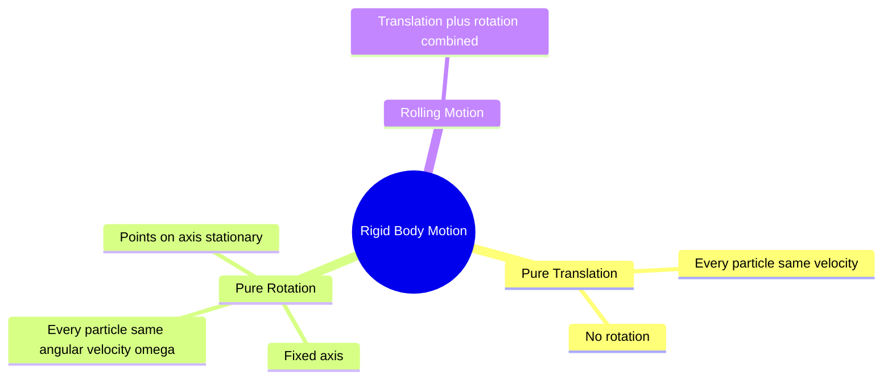

### 1.1 What is a Rigid Body?
- **Rigid body** — perfectly definite, unchanging shape; distance between every pair of particles stays constant under any force.
- No real body is truly rigid — deformation often negligible in practice.

### 1.2 Types of Motion of a Rigid Body
- **Pure translation** — every particle has the same velocity at every instant. Example: block sliding down an incline.
- **Pure rotation** — body rotates about a fixed axis; particles move in circles. Example: ceiling fan, potter's wheel.
- **Rolling motion** — translation + rotation combined. Example: cylinder rolling down an incline.
- Pure translation → identical velocity for every particle.
- Pure rotation about a fixed axis → identical angular velocity ω for every particle; linear speeds still differ with radius.

### 1.3 Rotation About a Fixed Axis
- Every particle moves in a circle in a plane perpendicular to the axis, centred on the axis.
- Particle at perpendicular distance $r$ from the axis traces a circle of radius $r$.
- Particles **on** the axis: $r=0 \Rightarrow v=\omega r=0$ — stationary.
- Axis of a spinning top is **not fixed** — it precesses. This chapter treats fixed-axis rotation only.

### 1.4 Why Different Points Have Different Speeds
- $v_i=\omega r_i$ — Eq. (6.19).
- Same $\omega$ for every point of a rotating body; linear speed scales linearly with radius from the axis.

---

## §2 Centre of Mass (COM)

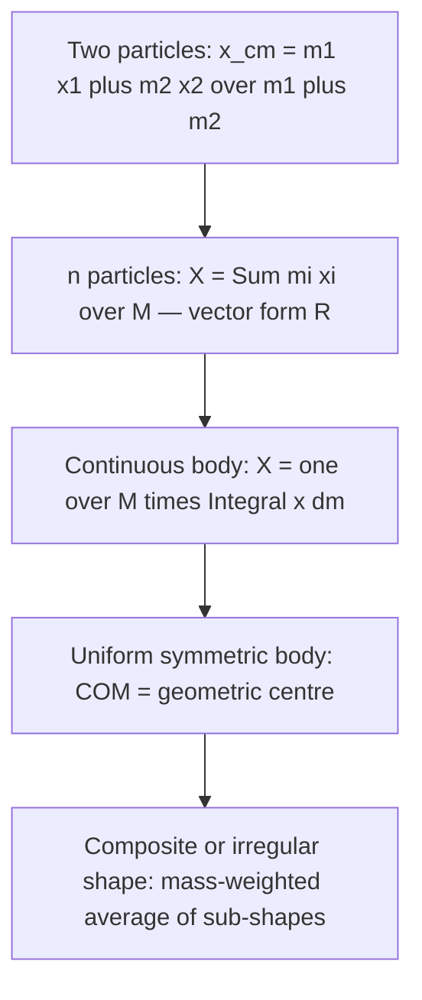

### 2.1 What Is the Centre of Mass?
- **COM** — point that moves exactly as a single particle carrying the total mass $M$ would move under the same external force.
- Trap: COM coincides with the geometric centre only for uniform, symmetric bodies — not in general.

### 2.2 Two-Particle System — Derivation
- $x_{cm}=\dfrac{m_1x_1+m_2x_2}{m_1+m_2}$ — Eq. (6.1).
- Equal masses ($m_1=m_2$): $x_{cm}=\dfrac{x_1+x_2}{2}$ — midpoint.
- $x_{cm}$ is the mass-weighted mean — pulled toward the heavier particle.

### 2.3 General Case — n Particles
- $X=\dfrac{\sum m_ix_i}{M}$, similarly for $Y$, $Z$ — Eq. (6.4a–c).
- Vector form: $\mathbf{R}=\dfrac{\sum m_i\mathbf{r}_i}{M}$ — Eq. (6.4d).
- Origin chosen at the COM $\Rightarrow \sum m_i\mathbf{r}_i=\mathbf{0}$.

### 2.4 Continuous Mass Distribution
- $X=\frac1M\int x\,dm$, similarly for $Y,Z$ — Eq. (6.5a).
- Uniform symmetric body: COM = geometric centre. Every element $dm$ at $\mathbf r$ is matched by an element at $-\mathbf r$.

### 2.5 COM of Regular Shapes

| Body | COM |
|:---|:---|
| Uniform rod | Midpoint |
| Uniform ring | Centre |
| Uniform disc | Centre |
| Uniform sphere | Centre |
| Uniform triangular lamina | Centroid |
| L-shaped lamina (uniform) | Mass-weighted average of sub-shapes |

- Trap: COM can lie outside the body's material — ring, hollow sphere.

### 2.6 Solved Examples from NCERT
- Example 6.1 — 3 unequal masses (100 g, 150 g, 200 g) at triangle vertices: $X=5/18$ m, $Y=1/(3\sqrt3)$ m.
- Example 6.2 — uniform triangular lamina: COM = centroid, proved via the strip method (every strip's midpoint lies on a median).
- Example 6.3 — L-lamina (3 kg, three 1 kg unit squares): COM at $(5/6,\,5/6)$ m.

---

## §3 Motion of the Centre of Mass

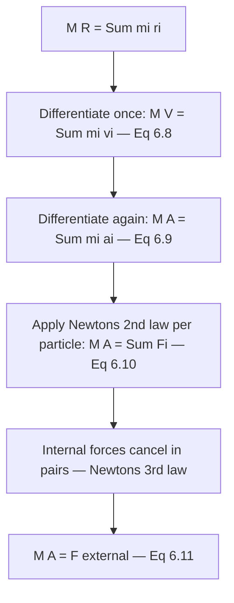

### 3.1 Derivation: The Centre of Mass Obeys Newton's Second Law
- $M\mathbf{V}=\sum m_i\mathbf{v}_i$ — Eq. (6.8), velocity of COM.
- $M\mathbf{A}=\sum m_i\mathbf{a}_i$ — Eq. (6.9), acceleration of COM.
- Each particle's force $\mathbf F_i$ includes both external and internal contributions.
- Internal action–reaction pairs cancel exactly on summing (Newton's third law).
- $M\mathbf{A}=\mathbf{F}_{ext}$ — Eq. (6.11): COM moves as if all mass were concentrated there and all external force applied there. True for any system, rigid or not.
- Trap: internal forces (e.g. a mid-air explosion) never change the COM's path — only external force (gravity) does.

### 3.2 Consequence — Radioactive Decay and Binary Stars
- Radioactive decay: COM at rest before decay stays at rest — decay products fly apart back-to-back.
- Binary stars: COM moves like a free particle. In the COM frame, the two stars orbit the COM, always diametrically opposite.
- Problem-solving split: COM translation (external forces only) + motion relative to COM (internal dynamics).

---

## §4 Vector Product of Two Vectors

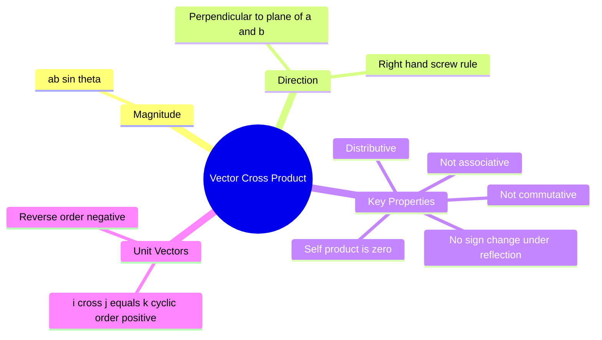

### 4.1 Why We Need It
- Torque and angular momentum are both defined via the cross product.

### 4.2 Definition
- $\mathbf{c}=\mathbf{a}\times\mathbf{b}$: magnitude $ab\sin\theta$; direction ⟂ to the plane of $\mathbf a,\mathbf b$; sense by right-hand screw rule.

### 4.3 Key Properties

| Property | Statement |
|:---|:---|
| Not commutative | $\mathbf{a}\times\mathbf{b}=-\mathbf{b}\times\mathbf{a}$ |
| Not associative | Order and grouping matter |
| Distributive | $\mathbf{a}\times(\mathbf{b}+\mathbf{c})=\mathbf{a}\times\mathbf{b}+\mathbf{a}\times\mathbf{c}$ |
| Self cross product | $\mathbf{a}\times\mathbf{a}=\mathbf{0}$ |
| Under reflection | Does **not** change sign (unlike polar vectors) |

### 4.4 Unit Vector Rules
- $\hat\imath\times\hat\imath=\hat\jmath\times\hat\jmath=\hat k\times\hat k=\mathbf 0$.
- $\hat\imath\times\hat\jmath=\hat k$, $\hat\jmath\times\hat k=\hat\imath$, $\hat k\times\hat\imath=\hat\jmath$ — cyclic order → positive.
- Reversed order → negative: $\hat\jmath\times\hat\imath=-\hat k$, $\hat k\times\hat\jmath=-\hat\imath$, $\hat\imath\times\hat k=-\hat\jmath$.

### 4.5 Component (Determinant) Form
- $\mathbf{a}\times\mathbf{b}=(a_yb_z-a_zb_y)\hat\imath+(a_zb_x-a_xb_z)\hat\jmath+(a_xb_y-a_yb_x)\hat{k}$.
- Example 6.4 — $\mathbf a=3\hat\imath-4\hat\jmath+5\hat k$, $\mathbf b=-2\hat\imath+\hat\jmath+3\hat k$: $\mathbf a\cdot\mathbf b=5$; $\mathbf a\times\mathbf b=-17\hat\imath-19\hat\jmath-5\hat k$.

### 4.6 Dot Product vs Cross Product — Quick Comparison

| | Dot Product | Cross Product |
|:---|:---|:---|
| Result | Scalar | Vector |
| Formula | $ab\cos\theta$ | $ab\sin\theta$, direction ⟂ plane |
| Commutative | Yes | No |
| Zero when | $\theta=90°$ | $\theta=0°$ or $180°$ |
| Examples | Work, Power | Torque, Angular momentum |

---

## §5 Angular Velocity and Its Relation with Linear Velocity

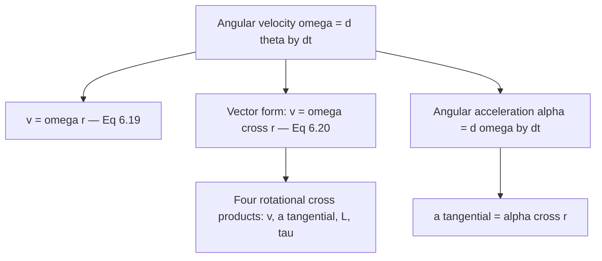

### 5.1 Angular Velocity — Definition
- $\omega=d\theta/dt$; SI rad s⁻¹; $[T^{-1}]$.
- $v_i=\omega r_i$ — Eq. (6.19); same $\omega$ for every particle of the body.
- Vector form $\mathbf{v}=\boldsymbol\omega\times\mathbf{r}$ — Eq. (6.20), valid even for rotation about a single fixed point.
- Four rotational cross-products: $\mathbf v=\boldsymbol\omega\times\mathbf r$ (velocity); $\mathbf a_t=\boldsymbol\alpha\times\mathbf r$ (tangential accel); $\mathbf L=\mathbf r\times\mathbf p$ (angular momentum, analogue of $\mathbf p=m\mathbf v$); $\boldsymbol\tau=\mathbf r\times\mathbf F$ (torque, analogue of $\mathbf F$).

### 5.2 Angular Acceleration
- $\boldsymbol\alpha=d\boldsymbol\omega/dt$, scalar form $\alpha=d\omega/dt$ — Eq. (6.21)/(6.22); SI rad s⁻²; $[T^{-2}]$.
- Fixed-axis rotation: $\boldsymbol\omega$'s direction never changes — only magnitude.
- $\boldsymbol\alpha$ is therefore also fixed in direction for fixed-axis rotation — the vector equation collapses to the scalar one.

### 5.3 Tangential and Centripetal Acceleration in Rotation
- $\mathbf a_t=\boldsymbol\alpha\times\mathbf r$, $|a_t|=\alpha r_\perp$ — tangential acceleration, changes speed along the circle.
- $a_c=\omega^2r_\perp=v^2/r_\perp$ — centripetal acceleration, always toward the axis, changes direction only.
- $a_t$ vs $\omega$: straight line, independent of $\omega$. $a_c$ vs $\omega$: parabola, $\propto\omega^2$.
- Trap: $\alpha=0$ (no angular acceleration) does **not** mean zero acceleration — $a_c=\omega^2r_\perp\neq0$ persists as long as the particle keeps moving in a circle.

### 5.4 Vector Nature of ω and α
- $\boldsymbol\omega$ and $\boldsymbol\alpha$ act as genuine 3-D vectors along the rotation axis, confirmed by both $\mathbf v=\boldsymbol\omega\times\mathbf r$ and $\mathbf a_t=\boldsymbol\alpha\times\mathbf r$ computed as real cross products, not just plugged-in formulas.

---

## §6 Torque and Angular Momentum

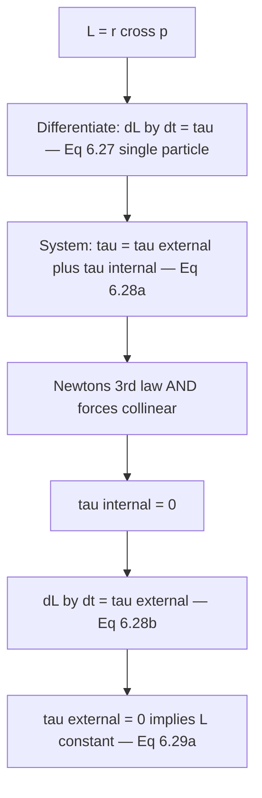

### 6.1 Moment of Force (Torque)
- $\boldsymbol{\tau}=\mathbf{r}\times\mathbf{F}$ — Eq. (6.23); SI N m; $[ML^2T^{-2}]$ — same dimension as energy, but torque is a vector and energy a scalar.
- $\tau=rF\sin\theta=rF_\perp=r_\perp F$ — Eq. (6.24a–c).
- $\tau=0$ if $r=0$, $F=0$, or the line of action of $\mathbf F$ passes through the origin ($\theta=0°$ or $180°$).
- Reverse $\mathbf F$ alone → $\boldsymbol\tau$ reverses.
- Reverse both $\mathbf r$ and $\mathbf F$ → $\boldsymbol\tau$ unchanged.
- $\tau=rF\sin\theta$ peaks at $\theta=90°$ (force ⟂ to $\mathbf r$) — most effective angle; zero at $\theta=0°,180°$.
- Trap: $\tau=r_\perp F=rF_\perp$ are equivalent — use whichever is more convenient for the geometry.

### 6.2 Angular Momentum of a Particle
- $\mathbf{L}=\mathbf{r}\times\mathbf{p}$ — Eq. (6.25a); SI kg m² s⁻¹ (= J s); $[ML^2T^{-1}]$.
- $L=rp\sin\theta=rp_\perp=r_\perp p$ — Eq. (6.26a,b).
- $d\mathbf{L}/dt=\boldsymbol\tau$ — Eq. (6.27), single particle. Exact rotational analogue of $\mathbf F=d\mathbf p/dt$.

### 6.3 Torque and Angular Momentum for a System of Particles
- System: $\mathbf L=\sum\mathbf l_i=\sum\mathbf r_i\times\mathbf p_i$ — Eq. (6.25b).
- $d\mathbf L/dt=\Sigma\boldsymbol\tau_i=\boldsymbol\tau_{ext}+\boldsymbol\tau_{int}$ — Eq. (6.28a).
- Trap: $\boldsymbol\tau_{int}=\mathbf 0$ needs **two** conditions together — Newton's third law (equal & opposite) **and** the forces being collinear (central forces). Either alone is not enough.
- With both conditions: $d\mathbf{L}/dt=\boldsymbol\tau_{ext}$ — Eq. (6.28b).
- $\boldsymbol\tau_{ext}=\mathbf 0 \Rightarrow \mathbf L=$ constant — Eq. (6.29a), conservation of angular momentum.

### 6.4 Solved Examples
- Example 6.5 — $\mathbf r=\hat\imath-\hat\jmath+\hat k$, $\mathbf F=7\hat\imath+3\hat\jmath-5\hat k$ → $\boldsymbol\tau=2\hat\imath+12\hat\jmath+10\hat k$ N m.
- Example 6.6 — particle moving at constant $\mathbf v$: angular momentum about any fixed point $O$ stays constant. Perpendicular distance from $O$ to the line of motion is fixed; consistent with zero torque on a free particle.
- Method — torque from a time-varying momentum: build $\mathbf L(t)=\mathbf r\times\mathbf p(t)$, then differentiate component-wise to get $\boldsymbol\tau(t)=d\mathbf L/dt$.

---

## §7 Equilibrium of a Rigid Body

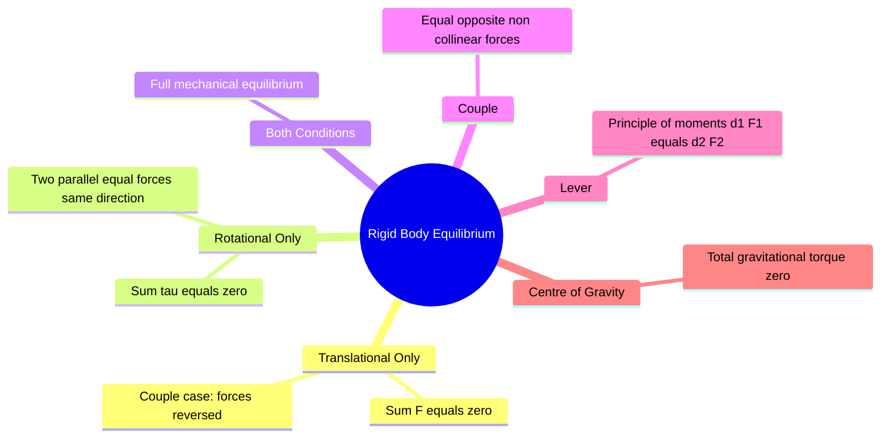

### 7.1 Conditions for Mechanical Equilibrium
- Mechanical equilibrium: $\sum\mathbf{F}_i=\mathbf{0}$ (translational) — Eq. (6.30a); $\sum\boldsymbol{\tau}_i=\mathbf{0}$ (rotational) — Eq. (6.30b).
- Rotational equilibrium condition is independent of the origin chosen, provided translational equilibrium also holds.

### 7.2 Partial Equilibrium
- Rotational only, not translational: two equal parallel forces, same direction, at a rod's two ends. Moments about the midpoint cancel; net force $=2F\neq0$.
- Translational only, not rotational: reverse one of those forces. Net force $=0$; the pair now forms a couple — pure rotation, no translation.

### 7.3 Couple
- **Couple** — equal magnitude, opposite direction, different (parallel) lines of action; produces rotation with no translation.
- Torque of a couple $=\mathbf{AB}\times\mathbf F$ — independent of the origin chosen (a distinguishing feature).
- Examples of couples: turning a bottle cap, a compass needle in Earth's magnetic field.
- Trap: a couple has zero net force **but** non-zero torque — translational and rotational equilibrium are independent conditions.

### 7.4 Principle of Moments (Lever)
- **Lever** — load $F_1$ at load arm $d_1$; effort $F_2$ at effort arm $d_2$; pivot at the fulcrum.
- Translational equilibrium of a lever: $R-F_1-F_2=0$.
- Rotational equilibrium about the fulcrum: $d_1F_1=d_2F_2$ — Eq. (6.32a).
- Mechanical advantage: $\text{M.A.}=F_1/F_2=d_2/d_1$ — Eq. (6.32b). $d_2>d_1 \Rightarrow \text{M.A.}>1$: small effort lifts large load.
- Lever examples: seesaw, beam balance, scissors, human forearm, pliers, crowbar.

### 7.5 Centre of Gravity (CG)
- **Centre of Gravity (CG)** — point where total gravitational torque is zero: $\sum\mathbf r_i\times m_i\mathbf g=\mathbf 0$ — Eq. (6.33).
- $\mathbf g$ uniform across the body $\Rightarrow$ CG = COM (always true in this course).
- Finding CG experimentally: suspend the body from a point, drop a plumb line; repeat from a second point; the intersection locates the CG.

### 7.6 Solved Examples from NCERT
- Example 6.8 — bar (70 cm, 4 kg) on two knife edges with a 6 kg load: $R_1\approx54.88$ N, $R_2\approx43.12$ N.
- Example 6.9 — ladder (3 m, 20 kg) against a frictionless wall, foot 1 m from the wall: $N=196$ N, $F_1\approx34.6$ N (wall), floor friction $\approx34.6$ N, net floor force $\approx199.0$ N at $\approx80°$ to horizontal.

---

## §8 Moment of Inertia

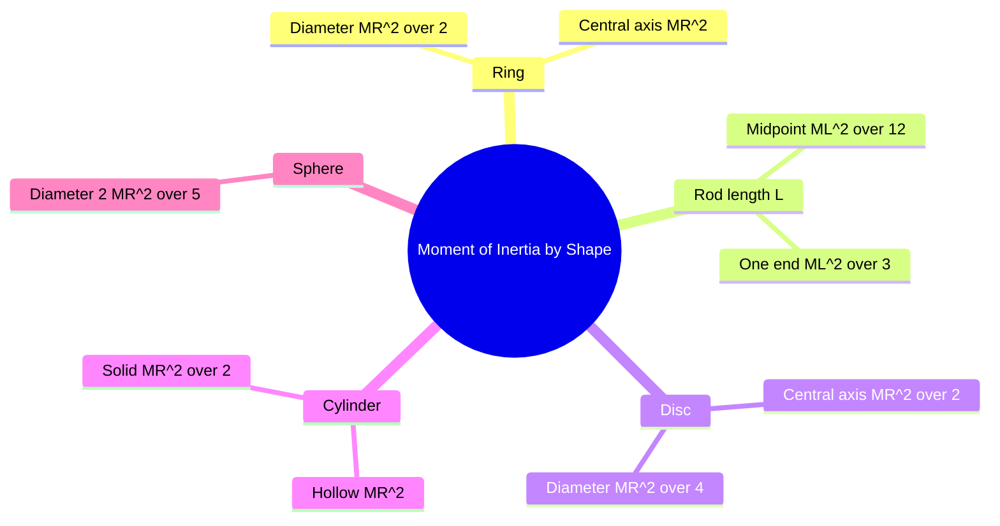

### 8.1 Definition
- $I=\sum m_ir_i^2$ — Eq. (6.34); $r_i$ = perpendicular distance from the axis. SI kg m²; $[ML^2]$.
- $I$ depends on mass, its distribution, and the axis chosen — unlike mass, $I$ is **not** a fixed property of a body.
- $I$ weights distance heavily ($r^2$ factor) — a small mass far from the axis can out-contribute a large mass close to it.

### 8.2 Kinetic Energy of Rotation
- $K_{rot}=\tfrac12I\omega^2$ — Eq. (6.35), derived from summing $\tfrac12m_iv_i^2$ with $v_i=r_i\omega$.
- $I$ is the rotational analogue of mass; $\omega$ of $v$.

### 8.3 Radius of Gyration $k$
- **Radius of gyration** $k$ — distance at which the entire mass, concentrated as a point, reproduces the same $I$; RMS distance of all particles from the axis.
- $I=Mk^2 \Rightarrow k=\sqrt{I/M}$. SI m; $[L]$.

| Body / Axis | $k$ |
|:---|:---|
| Thin rod, midpoint | $L/\sqrt{12}$ |
| Ring, central axis | $R$ |
| Disc, central axis | $R/\sqrt2$ |
| Disc, diameter | $R/2$ |
| Solid sphere, diameter | $R\sqrt{2/5}$ |

### 8.4 Standard Results — Moments of Inertia (Table 6.1)

| Body | Axis | $I$ |
|:---|:---|:---|
| Thin ring, radius $R$ | ⟂ to plane, centre | $MR^2$ |
| Thin ring, radius $R$ | Diameter | $MR^2/2$ |
| Thin rod, length $L$ | ⟂, midpoint | $ML^2/12$ |
| Thin rod, length $L$ | ⟂, one end (via §8.6) | $ML^2/3$ |
| Disc, radius $R$ | ⟂ to disc, centre | $MR^2/2$ |
| Disc, radius $R$ | Diameter | $MR^2/4$ |
| Hollow cylinder, radius $R$ | Axis of cylinder | $MR^2$ |
| Solid cylinder, radius $R$ | Axis of cylinder | $MR^2/2$ |
| Solid sphere, radius $R$ | Diameter | $2MR^2/5$ |

- Trap: hollow cylinder = ring ($MR^2$); solid cylinder = disc ($MR^2/2$); solid sphere $=2MR^2/5$. Always specify the axis — the same body has a different $I$ per row above.

### 8.4.1 Axis Choice, Not Shape Alone, Sets I
- The same body gives a different $I$ for each different axis — Table 6.1's rod, ring, and disc rows each list two axes for exactly this reason.

### 8.5 Two Special Cases (NCERT derivations)
- Thin ring about its own axis: all mass at distance $R \Rightarrow I=MR^2$, via comparing $K=\tfrac12Mv^2$ with $K=\tfrac12I\omega^2$.
- Massless rod, point masses $M/2$ at each end, axis ⟂ through centre: $I=Ml^2/4$.

### 8.6 Parallel Axis Theorem
- $I'=I_{cm}+Md^2$ — for **any** rigid body and **any** pair of parallel axes, $d$ = perpendicular distance between them.
- Doubling $d$ quadruples the $Md^2$ term — quadratic growth, not linear.
- Worked: rod about one end — $I_{end}=\dfrac{ML^2}{12}+M\left(\dfrac L2\right)^2=\dfrac{ML^2}{3}$.

### 8.7 Perpendicular Axis Theorem
- $I_z=I_x+I_y$ — **planar (laminar) bodies only**, three mutually ⟂ axes meeting at one point.
- Trap: does **not** apply to 3-D solids (sphere, solid cylinder) — planar bodies only.
- Worked: disc about a diameter from disc about centre — $I_z=MR^2/2$, $I_x=I_y$ by symmetry $\Rightarrow I_x=I_z/2=MR^2/4$.
- Worked: ring about a diameter — $I_z=MR^2 \Rightarrow I_x=I_y=MR^2/2$.

### 8.8 Flywheel — Practical Application
- **Flywheel** — heavy disc, large $I$, used in engines. Resists sudden changes in angular speed, giving smooth motion despite fluctuating driving torque.

---

## §9 Kinematics of Rotational Motion About a Fixed Axis

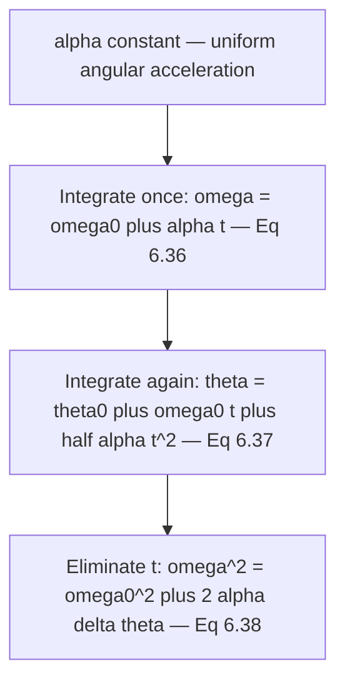

### 9.1 Equations of Motion (Uniform Angular Acceleration)
- $\omega=\omega_0+\alpha t$ — Eq. (6.36).
- $\theta=\theta_0+\omega_0t+\tfrac12\alpha t^2$ — Eq. (6.37).
- $\omega^2=\omega_0^2+2\alpha(\theta-\theta_0)$ — Eq. (6.38).
- Valid only when angular acceleration $\alpha$ is constant.

### 9.2 Derivation of Eq. (6.36)
- $\alpha=d\omega/dt=$ const → integrate → $\omega=\omega_0+\alpha t$.
- Integrate again → $\theta=\theta_0+\omega_0t+\tfrac12\alpha t^2$.
- rpm → rad/s: $\omega=\dfrac{\pi N}{30}$.

### 9.3 Solved Example (NCERT 6.11) — Motor Wheel
- Motor wheel, 1200 → 3120 rpm in 16 s: $\alpha=4\pi$ rad s⁻².
- $\theta=1152\pi$ rad → 576 revolutions.

### 9.4 Angular Velocity of a Clock's Minute Hand
- Minute hand: one revolution in 3600 s. $\omega=2\pi/3600\approx1.745\times10^{-3}$ rad/s.

### 9.5 Car Wheel Angular Retardation
- Car wheel (72 km/h, diameter 0.5 m) stops in 20 rotations: angular retardation $=80/\pi\approx25.5$ rad/s².

### 9.6 Kinematics Equations, Tied to the Vector Picture
- Tangential/centripetal decomposition (§5.3) combines with the $\theta,\omega,\alpha$ kinematics of §9.1 in one unified vector picture of circular motion.

---

## §10 Dynamics of Rotational Motion About a Fixed Axis

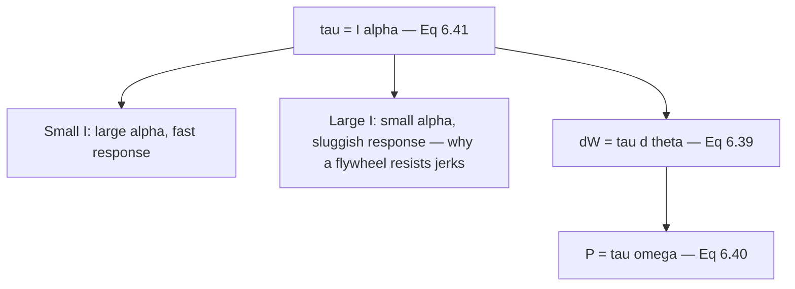

### 10.1 Torque and Angular Acceleration
- $\tau=I\alpha$ — Eq. (6.41), the rotational analogue of $F=ma$; $I$ plays the role of inertia.
- Fixed $\tau$, small $I$ (light disc) → large $\alpha$, fast response.
- Fixed $\tau$, large $I$ (heavy flywheel) → small $\alpha$, sluggish response — the mechanism behind a flywheel resisting jerky speed changes (§8.8).

### 10.2 Work Done by a Torque and Rotational Power
- $dW=\tau\,d\theta$ — Eq. (6.39).
- $P=\tau\omega$ — Eq. (6.40).

### 10.3 Table of Analogies — Linear vs Rotational Motion

| Linear | Rotational |
|:---|:---|
| Displacement $x$ | Angular displacement $\theta$ |
| Velocity $v=dx/dt$ | Angular velocity $\omega=d\theta/dt$ |
| Acceleration $a=dv/dt$ | Angular acceleration $\alpha=d\omega/dt$ |
| Mass $M$ | Moment of inertia $I$ |
| Force $F=Ma$ | Torque $\tau=I\alpha$ |
| Work $dW=F\,ds$ | Work $dW=\tau\,d\theta$ |
| KE $=Mv^2/2$ | KE $=I\omega^2/2$ |
| Power $P=Fv$ | Power $P=\tau\omega$ |
| Momentum $p=Mv$ | Angular momentum $L=I\omega$ |

### 10.4 Solved Example (NCERT 6.12) — Flywheel and Cord
- Flywheel ($M=20$ kg, $R=20$ cm), cord pulled with $F=25$ N: $\tau=FR=5.0$ N m; $I=MR^2/2=0.4$ kg m²; $\alpha=\tau/I=12.5$ rad/s².
- 2 m of cord unwound: $W=F\times d=50$ J; $\theta=d/R=10$ rad; $\omega^2=2\alpha\theta=250\,(\text{rad/s})^2$; $K=\tfrac12I\omega^2=50$ J.
- Work done equals kinetic energy gained (50 J = 50 J), frictionless bearings — confirms the rotational work–energy theorem.

---

## §11 Angular Momentum in Case of Rotation About a Fixed Axis

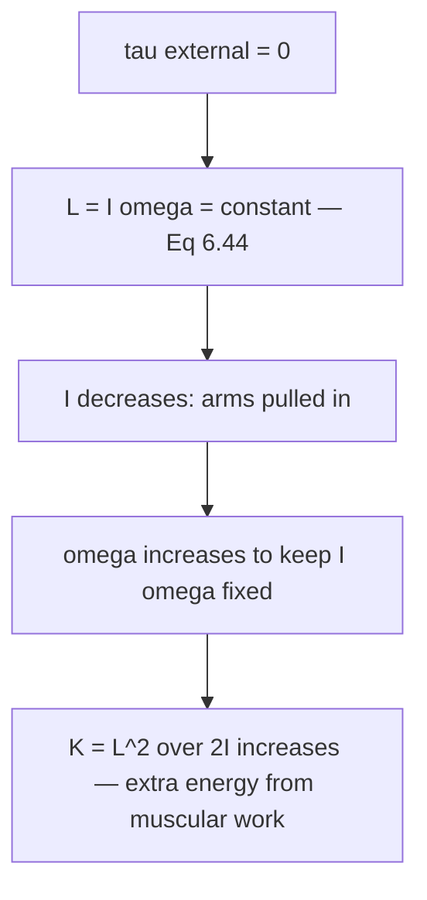

### 11.1 Setting Up: $L_z=I\omega$
- $L=I\omega$ — Eq. (6.42d), valid for a body symmetric about the rotation axis (true for every body in Table 6.1).
- $\dfrac{d}{dt}(I\omega)=\tau_{ext}$; if $I$ is constant this reduces to $\tau=I\alpha$ — Eq. (6.41).
- Trap: $\mathbf L$ and $\boldsymbol\omega$ are **not** always parallel — for a body not symmetric about its rotation axis, $\mathbf L=I\boldsymbol\omega$ (as vectors) is a special-case convenience, not a universal law.

### 11.2 Conservation of Angular Momentum
- $\tau_{ext}=0$, $I$ allowed to change $\Rightarrow L_z=I\omega=$ constant — Eq. (6.44).
- $I$ decreases $\Rightarrow \omega$ increases, and vice versa.
- Skater: arms pulled in → $I$ decreases sharply → $\omega$ increases to conserve $L$.
- Kinetic energy $K=\tfrac12I\omega^2=\tfrac12L\omega$ **increases** when arms are pulled in. Extra energy comes from muscular work done pulling the arms in, not from nowhere.
- $K\propto1/I$ while $\omega\propto1/I$ too — halving $I$ quadruples $K$, not just doubles it.

### 11.3 Earth Shrinks: Change in Day Length
- Earth shrinks to $1/64$ its volume, mass unchanged: $V\propto R^3 \Rightarrow R'=R/4$.
- No external torque during the shrink $\Rightarrow L$ conserved.
- Treating Earth as a uniform solid sphere ($I=\tfrac25MR^2$): $R^2/T=R'^2/T' \Rightarrow T'=T/16=1.5$ hours.

---

## Points to Ponder

- Trap: COM ≠ geometric centre for non-uniform bodies — coincide only for uniform, symmetric bodies. §2.1
- Trap: COM can lie outside the body — ring, hollow sphere, L-shape. §2.5
- Trap: internal forces never affect COM motion — only external forces (e.g. gravity) determine it. §3.1
- Trap: torque and work share dimensions $[ML^2T^{-2}]$ but are different quantities — torque is a vector (cross product), work a scalar (dot product). §6.1
- Trap: a couple has zero net force but non-zero torque — translational and rotational equilibrium are independent conditions. §7.3
- Trap: internal torques cancel only when **both** Newton's third law and collinearity hold — drop either assumption and cancellation fails. §6.3
- Trap: total torque about a point depends on that point's choice unless net external force is zero; rotational equilibrium alone is origin-independent only together with translational equilibrium. §7.1
- Trap: moment of inertia depends on the axis — the same body has different $I$ values for different axes; always specify the axis. §8.1
- Trap: $I_{cm}$ is the smallest $I$ among all parallel axes, since the Parallel Axis Theorem only ever adds $Md^2\geq0$. §8.6
- Trap: Perpendicular Axis Theorem applies **only** to flat, planar (2-D) bodies — never to a 3-D solid like a sphere or solid cylinder. §8.7
- Trap: CG coincides with COM only if $g$ doesn't vary across the body — always true in this course, not true for astronomically large bodies. §7.5
- Trap: in the skater effect, $L=I\omega$ stays constant but kinetic energy $K=L^2/2I$ increases — the extra energy comes from muscular work, not from nowhere. §11.2
- Trap: rolling motion (previewed, full treatment in the next chapter) — total KE $=\tfrac12Mv^2+\tfrac12I\omega^2$; rolling without slipping requires $v=R\omega$. §1.2
- Trap: $\tau=r_\perp F=rF_\perp$ are equivalent forms — use whichever suits the geometry. §6.1
- Trap: a particle moving in a straight line has non-zero angular momentum about any point not on its line of motion; that angular momentum stays constant since no torque acts on a free particle. §6.4 (Example 6.6)
- Trap: $\mathbf L$ and $\boldsymbol\omega$ are parallel only when the rotation axis is a symmetry axis of the body — $L=I\omega$ works cleanly for every body in Table 6.1, but is not a universally true vector relation. §11.1

---

## Key Historical Persons

| Person | Contribution |
|:---|:---|
| Isaac Newton (1643–1727) | Laws of motion — foundation for all rotational mechanics |
| Leonhard Euler (1707–1783) | Developed rotational dynamics; Euler's equations of motion |
| Christiaan Huygens (1629–1695) | First correct derivation of the moment of inertia of a pendulum; co-namesake of the Huygens–Steiner (Parallel Axis) theorem |
| Jakob Steiner (1796–1863) | Co-namesake of the Parallel Axis / Huygens–Steiner theorem |
| James Watt (1736–1819) | Flywheel concept for steam engines — practical application of $I$ |

---

## Problem-Solving Strategy

**Type A — Centre of Mass**
1. Identify discrete system or continuous body.
2. Discrete: list every $(m_i,x_i,y_i)$ from the origin, apply $X=\sum m_ix_i/M$.
3. Continuous, uniform, symmetric: COM = geometric centre — skip the integral.
4. Composite shape: split into sub-shapes; treat each sub-shape's mass as concentrated at its own COM; apply the discrete formula to those points.

**Type B — Equilibrium (levers, ladders, beams)**
1. Draw a free-body diagram — mark every force with its point of application.
2. Translational equations: $\sum F_x=0$, $\sum F_y=0$.
3. Choose a pivot where the maximum number of unknown forces act — those forces drop out of the moment equation.
4. Rotational equation about that pivot: $\sum\tau=0$.
5. Solve the resulting system simultaneously.

**Type C — Moment of Inertia and Axis Theorems**
1. Identify the body's shape; check Table 6.1 for $I$ about the natural (central) axis.
2. Target axis parallel to the natural axis → Parallel Axis Theorem, $I'=I_{cm}+Md^2$.
3. Planar body, axis ⟂ to plane, or splitting $I_z$ into in-plane components → Perpendicular Axis Theorem, $I_z=I_x+I_y$.
4. Composite body: find $I$ of each piece about the same axis, then add.

**Type D — Combined Kinematics + Dynamics**
1. Find $\tau$ (from forces) and $I$ (from geometry/mass) separately.
2. $\alpha=\tau/I$.
3. Feed $\alpha$ into Eq. (6.36)–(6.38) for $\omega$, $\theta$, or $t$.
4. Cross-check: work done by external torque should equal kinetic energy gained (no friction).

**Type E — Angular Momentum Conservation**
1. Confirm $\tau_{ext}=0$ about the axis — internal reconfiguration only, no outside twist.
2. Write $I_1\omega_1=I_2\omega_2$.
3. Compute $I_1$, $I_2$ from geometry before and after.
4. Solve for the unknown $\omega$. If asked about energy: $K$ is generally **not** conserved even though $L$ is — any change in $K$ is accounted for by real work done changing the configuration.

---

## Rapid Reference

| Fact | Value |
|:---|:---|
| Two-particle COM | $x_{cm}=(m_1x_1+m_2x_2)/(m_1+m_2)$ |
| $n$-particle COM (vector) | $\mathbf R=\sum m_i\mathbf r_i/M$ |
| COM equation of motion | $M\mathbf A=\mathbf F_{ext}$ |
| System momentum | $\mathbf P=M\mathbf V$; conserved if $\mathbf F_{ext}=0$ |
| Cross product magnitude | $\|\mathbf a\times\mathbf b\|=ab\sin\theta$ |
| Cyclic unit-vector rule | $\hat\imath\times\hat\jmath=\hat k$, $\hat\jmath\times\hat k=\hat\imath$, $\hat k\times\hat\imath=\hat\jmath$ |
| Linear–angular velocity | $v=\omega r$ (6.19); $\mathbf v=\boldsymbol\omega\times\mathbf r$ (6.20) |
| Angular acceleration | $\alpha=d\omega/dt$; SI rad s⁻²; $[T^{-2}]$ |
| Tangential / centripetal accel. | $a_t=\alpha r_\perp$; $a_c=\omega^2r_\perp=v^2/r_\perp$ |
| Torque | $\boldsymbol\tau=\mathbf r\times\mathbf F$; SI N m; $[ML^2T^{-2}]$ |
| Angular momentum (particle) | $\mathbf L=\mathbf r\times\mathbf p$; SI kg m² s⁻¹; $[ML^2T^{-1}]$ |
| Torque–angular momentum link | $d\mathbf L/dt=\boldsymbol\tau_{ext}$; conserved if $\boldsymbol\tau_{ext}=0$ |
| Translational equilibrium | $\sum\mathbf F_i=\mathbf 0$ |
| Rotational equilibrium | $\sum\boldsymbol\tau_i=\mathbf 0$ |
| Couple torque | $\mathbf{AB}\times\mathbf F$, origin-independent |
| Lever principle of moments | $d_1F_1=d_2F_2$; M.A. $=F_1/F_2=d_2/d_1$ |
| Centre of gravity condition | $\sum\mathbf r_i\times m_i\mathbf g=\mathbf 0$; CG = COM if $g$ uniform |
| Moment of inertia | $I=\sum m_ir_i^2$; SI kg m²; $[ML^2]$ |
| Rotational KE | $K_{rot}=\tfrac12I\omega^2$ |
| Radius of gyration | $I=Mk^2$; SI m; $[L]$ |
| Ring — centre / diameter | $MR^2$ / $MR^2/2$ |
| Disc — centre / diameter | $MR^2/2$ / $MR^2/4$ |
| Hollow / solid cylinder | $MR^2$ / $MR^2/2$ |
| Solid sphere (diameter) | $2MR^2/5$ |
| Thin rod — midpoint / end | $ML^2/12$ / $ML^2/3$ |
| Parallel Axis Theorem | $I'=I_{cm}+Md^2$ — any body, any parallel axes |
| Perpendicular Axis Theorem | $I_z=I_x+I_y$ — planar bodies only |
| Rotational kinematics | $\omega=\omega_0+\alpha t$; $\theta=\theta_0+\omega_0t+\tfrac12\alpha t^2$; $\omega^2=\omega_0^2+2\alpha\Delta\theta$ |
| rpm → rad/s | $\omega=\pi N/30$ |
| Rotational Newton's 2nd law | $\tau=I\alpha$ |
| Work / power by torque | $dW=\tau\,d\theta$; $P=\tau\omega$ |
| Angular momentum (fixed axis) | $L=I\omega$; conserved if $\tau_{ext}=0$ |
| Motor wheel (NCERT 6.11) | $\alpha=4\pi$ rad/s²; 576 revolutions |
| Clock minute hand $\omega$ | $\approx1.745\times10^{-3}$ rad/s |
| Car wheel angular retardation | $\approx25.5$ rad/s² |
| Flywheel and cord (NCERT 6.12) | $\alpha=12.5$ rad/s²; $W=K=50$ J |
| Ladder example | $N=196$ N; $F_1\approx34.6$ N; net floor force $\approx199.0$ N |
| Bar-on-knife-edges example | $R_1\approx54.88$ N; $R_2\approx43.12$ N |
| Earth-shrinks example | New day length $=1.5$ hours |
| Angular momentum of Earth (spin) | $\approx7.1\times10^{33}$ kg m² s⁻¹ |

---

*End of CNOTES — Physics Ch. 6*