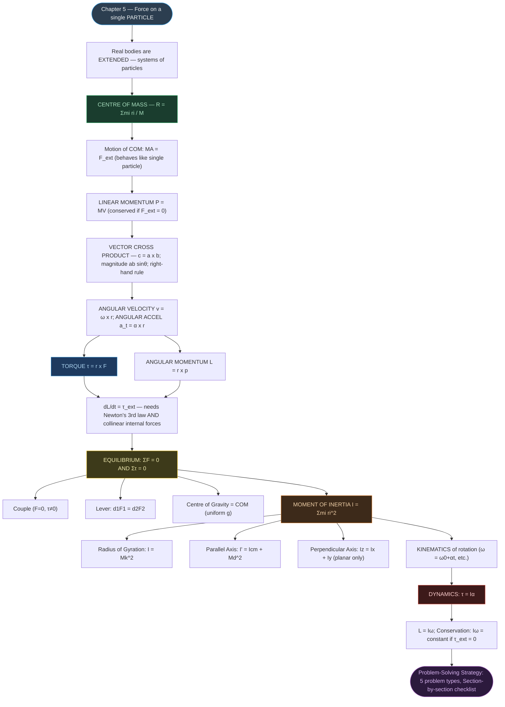

# CHAPTER 6: SYSTEMS OF PARTICLES AND ROTATIONAL MOTION

### Complete Study Notes | Board · NEET · JEE Layered

---

## 🗺️ CONCEPT ROADMAP



---

## SECTION 1 — INTRODUCTION: RIGID BODIES AND TYPES OF MOTION ⭐

### 1.1 What is a Rigid Body?

> [!note] Definition
> A **rigid body** is a body with a perfectly definite and unchanging shape. The distances between all pairs of particles remain constant, regardless of the forces acting.

No real body is truly rigid; deformations exist but are often negligible (e.g., a steel beam, a flywheel, a wheel of a vehicle).

### 1.2 Types of Motion of a Rigid Body

| Type | Description | Example |
|:---|:---|:---|
| **Pure Translation** | All particles have the same velocity at every instant | Block sliding down inclined plane |
| **Pure Rotation** | Body rotates about a fixed axis; particles move in circles | Ceiling fan, Potter's wheel |
| **Rolling Motion** | Translation + Rotation combined | Cylinder rolling down an incline |

> [!important] Key Principle
> In **pure translation**, every particle has the same velocity. In **pure rotation** about a fixed axis, every particle has the **same angular velocity** ω.

```tikz
\usetikzlibrary{arrows.meta}
\begin{tikzpicture}[>={Stealth[length=7pt,width=5pt]}, thick, scale=1.0]
  % LEFT PANEL: pure translation
  \draw[line width=1pt] (-0.3,0) -- (3.3,0);
  \draw[fill=blue!15] (0,0) rectangle (2,1);
  \fill[black] (0.5,0.5) circle (2pt) node[left=2pt, font=\small] {$P_1$};
  \fill[black] (1.5,0.5) circle (2pt) node[right=2pt, font=\small] {$P_2$};
  \draw[->, red!75!black, line width=1.4pt] (0.5,0.5) -- (0.5,1.5);
  \draw[->, red!75!black, line width=1.4pt] (1.5,0.5) -- (1.5,1.5);
  \node[font=\small, red!75!black] at (1.0,1.75) {$\mathbf{v}$};
  \node[below, font=\itshape\small, text=gray] at (1.0,-0.6) {Pure translation: every point has the same velocity};

  % RIGHT PANEL: pure rotation
  \begin{scope}[xshift=6.6cm]
    \fill[gray!15] (1,0.5) circle (1.6);
    \draw[gray!60] (1,0.5) circle (1.6);
    \fill[black] (1,0.5) circle (1.5pt) node[below=2pt, font=\small] {axis};
    \coordinate (Q1) at (1.8,0.5);
    \coordinate (Q2) at (2.6,0.5);
    \fill[black] (Q1) circle (2pt) node[above=2pt, font=\small] {$P_1$};
    \fill[black] (Q2) circle (2pt) node[above=2pt, font=\small] {$P_2$};
    \draw[->, red!75!black, line width=1.4pt] (Q1) -- ++(0,0.7);
    \draw[->, red!75!black, line width=1.6pt] (Q2) -- ++(0,1.0);
    \node[font=\small, red!75!black] at (1.65,1.35) {$v_1$};
    \node[font=\small, red!75!black] at (2.75,1.65) {$v_2$};
    \node[below, font=\itshape\small, text=gray] at (1,-1.3) {Pure rotation: same $\omega$, but $v=\omega r$ differs with radius};
  \end{scope}
\end{tikzpicture}
```

*Left:* every particle of a purely translating body carries an identical velocity vector at any instant — the body's orientation never changes. *Right:* in pure rotation, every particle shares the **same angular velocity** $\omega$, but because $v=\omega r$, a point farther from the axis (like $P_2$) has a larger linear speed than one closer in ($P_1$), even though both "keep pace" angularly.

### 1.3 Rotation About a Fixed Axis

- Every particle moves in a **circle** lying in a plane **perpendicular** to the fixed axis, with its centre on the axis.
- A particle at perpendicular distance r from the axis traces a circle of radius r.
- Particles **on the axis** have r = 0, so v = ωr = 0 → they remain **stationary**.
- The axis of a spinning top is **not fixed** (it precesses) — our chapter mainly deals with fixed-axis rotation.

### 1.4 Interactive — Why Different Points Have Different Speeds *(New)*

The TikZ figure above is a snapshot; this graph is the mechanism. Five points sit at different radii on the *same* rotating disc (same $\omega$ for all of them, exactly as the Key Principle box states). Drag $\omega$ and watch every arrow's length scale — **linearly with $r$**, never with anything else.

```desmos
\omega=1.4
r_{1}=0.6
r_{2}=1.2
r_{3}=1.8
r_{4}=2.4
r_{5}=3.0
t=0
\theta=\omega t
P_{1}=r_{1}\left(\cos\theta,\sin\theta\right)
P_{2}=r_{2}\left(\cos\theta,\sin\theta\right)
P_{3}=r_{3}\left(\cos\theta,\sin\theta\right)
P_{4}=r_{4}\left(\cos\theta,\sin\theta\right)
P_{5}=r_{5}\left(\cos\theta,\sin\theta\right)
V_{1}=\omega r_{1}\left(-\sin\theta,\cos\theta\right)
V_{2}=\omega r_{2}\left(-\sin\theta,\cos\theta\right)
V_{3}=\omega r_{3}\left(-\sin\theta,\cos\theta\right)
V_{4}=\omega r_{4}\left(-\sin\theta,\cos\theta\right)
V_{5}=\omega r_{5}\left(-\sin\theta,\cos\theta\right)
v_{1}=\operatorname{vector}\left(P_{1},P_{1}+V_{1}\right)
v_{2}=\operatorname{vector}\left(P_{2},P_{2}+V_{2}\right)
v_{3}=\operatorname{vector}\left(P_{3},P_{3}+V_{3}\right)
v_{4}=\operatorname{vector}\left(P_{4},P_{4}+V_{4}\right)
v_{5}=\operatorname{vector}\left(P_{5},P_{5}+V_{5}\right)
x^{2}+y^{2}=r_{5}^{2}
speed_{table}=\left[\left|V_{1}\right|,\left|V_{2}\right|,\left|V_{3}\right|,\left|V_{4}\right|,\left|V_{5}\right|\right]
```

Every arrow points along its own tangent — none of them parallel — but the ratio $|V_i|/r_i$ is the **same number** ($=\omega$) for all five points, every single frame. That ratio being constant *is* the content of Eq. (6.19), $v_i=\omega r_i$.

---

## SECTION 2 — CENTRE OF MASS (COM) ⭐⭐⭐

### 2.1 What Is the Centre of Mass?

> [!note] Definition
> The **centre of mass (COM)** is that single point which moves in exactly the same way a single particle — carrying the *total mass* of the system — would move if the same external force were applied to it.

The COM is a bookkeeping device: instead of tracking every particle of a possibly-huge system individually, track this one point, and you have completely captured the system's translational behaviour. Sections 2 and 3 make this idea precise; Section 3 in particular shows *why* this definition is dynamically useful, not just geometrically convenient.

### 2.2 Two-Particle System — Derivation

Consider two particles of masses $m_1$ and $m_2$ with position vectors $\mathbf{r}_1$ and $\mathbf{r}_2$ from some origin $O$. Their COM is the point $C$, with position vector $\mathbf{R}_{cm}$:

$$\mathbf{R}_{cm} = \frac{m_1\mathbf{r}_1 + m_2\mathbf{r}_2}{m_1+m_2}$$

```tikz
\usetikzlibrary{arrows.meta}
\begin{tikzpicture}[>={Stealth[length=7pt,width=5pt]}, thick, scale=1.0]
  \coordinate (O) at (0,0);
  \coordinate (M1) at (4.2,0.6);
  \coordinate (M2) at (2.6,3.0);
  \coordinate (C) at (3.56,1.56);
  \draw[->, blue!70!black, line width=1.5pt] (O) -- (M1) node[midway, below, font=\small] {$\mathbf{r}_1$};
  \draw[->, green!50!black, line width=1.5pt] (O) -- (M2) node[midway, above left, font=\small] {$\mathbf{r}_2$};
  \draw[dashed, gray] (M1) -- (M2);
  \draw[->, orange!85!black, line width=1.7pt] (O) -- (C) node[midway, below right, font=\small, orange!85!black] {$\mathbf{R}_{cm}$};
  \fill[black] (M1) circle (2.5pt) node[right=3pt, font=\small] {$m_1$};
  \fill[black] (M2) circle (2.5pt) node[above=3pt, font=\small] {$m_2$};
  \fill[red!70!black] (C) circle (2.3pt) node[below right=1pt, font=\small, red!70!black] {$C$};
  \node[below left, font=\small] at (O) {$O$};
  \node[below, font=\itshape\small, text=gray] at (2.1,-0.5) {$C$ lies on segment $m_1m_2$, closer to whichever mass is larger};
\end{tikzpicture}
```

Restricting motion to the x-axis (as is conventional for the scalar derivation) and writing $\mathbf{r}_1 \to x_1$, $\mathbf{r}_2 \to x_2$, $\mathbf{R}_{cm}\to x_{cm}$:

**Step 1 — the weighted-sum relation:**

$$(m_1+m_2)\,x_{cm} = m_1x_1 + m_2x_2$$

**Step 2 — solve for $x_{cm}$:**

$$\boxed{x_{cm} = \frac{m_1x_1 + m_2x_2}{m_1 + m_2}} \qquad \text{...(6.1)}$$

The same steps along $y$ give $y_{cm} = \dfrac{m_1y_1+m_2y_2}{m_1+m_2}$.

**Step 3 — special case, equal masses ($m_1=m_2=m$):**

$$x_{cm} = \frac{mx_1+mx_2}{2m} = \frac{x_1+x_2}{2}$$

For equal masses, the COM lies exactly **midway** between them — this falls out of the general weighted-average result; it is not a separate rule to memorise.

> [!note] Reading $x_{cm}$
> $X$ in Eq. (6.1) is the **mass-weighted mean** of $x_1$ and $x_2$ — it is pulled toward whichever particle is heavier, exactly like a weighted average in statistics.

### 2.3 General Case — n Particles

$$\boxed{X = \frac{\sum m_i x_i}{M}, \quad Y = \frac{\sum m_i y_i}{M}, \quad Z = \frac{\sum m_i z_i}{M}} \qquad \text{...(6.4a–c)}$$

where $M = \sum m_i$ is the **total mass**.

**In vector form:**

$$\boxed{\mathbf{R} = \frac{\sum m_i \mathbf{r}_i}{M}} \qquad \text{...(6.4d)}$$

> [!note] Origin Choice
> If the origin is chosen **at the COM**, then $\sum m_i \mathbf{r}_i = \mathbf{0}$.

### 2.4 Continuous Mass Distribution

$$X = \frac{1}{M}\int x\,dm, \quad Y = \frac{1}{M}\int y\,dm, \quad Z = \frac{1}{M}\int z\,dm \qquad \text{...(6.5a)}$$

**For uniform, symmetric bodies:** The COM coincides with the **geometric centre** — by symmetry, for every element $dm$ at $\mathbf{r}$, there is an element $dm$ at $-\mathbf{r}$, so the integrals vanish.

### 2.5 COM of Regular Shapes

| Body | COM Location |
|:---|:---|
| Uniform thin rod | Midpoint (geometric centre) |
| Uniform ring of radius R | Centre of the ring |
| Uniform disc of radius R | Centre of the disc |
| Uniform sphere of radius R | Centre of the sphere |
| Uniform triangular lamina | Centroid (intersection of medians) — proved in Example 6.2 below |
| L-shaped lamina (uniform) | Use mass-weighted average of sub-shapes |

### 2.6 Solved Examples from NCERT

> [!example] Example 6.1 — Three unequal masses at vertices of equilateral triangle (side 0.5 m)
>
> Masses: $m_1 = 100$ g at O(0,0), $m_2 = 150$ g at A(0.5, 0), $m_3 = 200$ g at B(0.25, 0.25√3)
>
> $$X = \frac{100(0) + 150(0.5) + 200(0.25)}{450} = \frac{125}{450} = \frac{5}{18} \text{ m}$$
>
> $$Y = \frac{100(0) + 150(0) + 200(0.25\sqrt{3})}{450} = \frac{1}{3\sqrt{3}} \text{ m}$$
>
> Note: COM is NOT the geometric centre of the triangle (unequal masses).

**Example 6.2 — Centre of mass of a triangular lamina (uniform)**

Subdivide the lamina $\triangle LMN$ into narrow strips parallel to the base $MN$. By symmetry, each strip's own centre of mass sits at its midpoint. Joining the midpoints of every strip traces out the median $LP$ — so the COM of the *whole* triangle must lie somewhere on $LP$.

The same argument applied to strips parallel to the other two sides shows the COM also lies on medians $MQ$ and $NR$.

```tikz
\usetikzlibrary{arrows.meta}
\begin{tikzpicture}[>={Stealth[length=6pt,width=4.5pt]}, thick, scale=1.0]
  \coordinate (L) at (1.6,3.2);
  \coordinate (M) at (0,0);
  \coordinate (N) at (4,0);
  \coordinate (P) at (2,0);
  \coordinate (Q) at (2.8,1.6);
  \coordinate (R) at (0.8,1.6);
  \coordinate (G) at (1.87,1.07);
  \draw[line width=1.2pt] (L) -- (M) -- (N) -- cycle;
  \draw[dashed, blue!60!black] (L) -- (P);
  \draw[dashed, blue!60!black] (M) -- (Q);
  \draw[dashed, blue!60!black] (N) -- (R);
  \fill[red!70!black] (G) circle (2.2pt) node[right=2pt, font=\small, red!70!black] {$G$ (COM)};
  \node[above, font=\small] at (L) {$L$};
  \node[below left, font=\small] at (M) {$M$};
  \node[below right, font=\small] at (N) {$N$};
  \node[below, font=\small] at (P) {$P$};
  \node[above right, font=\small] at (Q) {$Q$};
  \node[above left, font=\small] at (R) {$R$};
  \node[below, font=\itshape\small, text=gray] at (2,-0.7) {Every strip's midpoint lies on a median $\Rightarrow$ COM is the centroid};
\end{tikzpicture}
```

A point that lies on all three medians simultaneously must be their **point of concurrence** — the **centroid** $G$. Hence, for a uniform triangular lamina, the **COM coincides with the centroid**, regardless of the triangle's shape.

> [!example] Example 6.3 — L-shaped uniform lamina (3 kg, three unit squares)
>
> COM of each unit square is at its geometric centre: $C_1 = (1/2, 1/2)$, $C_2 = (3/2, 1/2)$, $C_3 = (1/2, 3/2)$; each of mass 1 kg.
>
> $$X = \frac{1(1/2) + 1(3/2) + 1(1/2)}{3} = \frac{5}{6} \text{ m}$$
>
> $$Y = \frac{1(1/2) + 1(1/2) + 1(3/2)}{3} = \frac{5}{6} \text{ m}$$
>
> COM lies on the line of symmetry at (5/6, 5/6).

---

## SECTION 3 — MOTION OF THE CENTRE OF MASS ⭐⭐

### 3.1 Derivation: The Centre of Mass Obeys Newton's Second Law

This is the result that makes the COM more than a geometric curiosity — it shows that a system's COM moves *exactly* like a single particle of mass $M$ under the net external force, no matter how complicated the internal motion is.

Start from Eq. (6.4d): $M\mathbf{R} = \sum m_i \mathbf{r}_i$.

**Step 1 — differentiate once (masses are constant in time):**

$$M\frac{d\mathbf{R}}{dt} = \sum m_i \frac{d\mathbf{r}_i}{dt}$$

$$\boxed{M\mathbf{V} = \sum m_i \mathbf{v}_i = m_1\mathbf{v}_1 + m_2\mathbf{v}_2 + \dots} \qquad \text{...(6.8)}$$

Here $\mathbf V = d\mathbf R/dt$ is the **velocity of the COM**.

**Step 2 — differentiate again:**

$$M\frac{d\mathbf{V}}{dt} = \sum m_i \frac{d\mathbf{v}_i}{dt}$$

$$\boxed{M\mathbf{A} = \sum m_i \mathbf{a}_i = m_1\mathbf{a}_1 + m_2\mathbf{a}_2 + \dots} \qquad \text{...(6.9)}$$

Here $\mathbf A = d\mathbf V/dt$ is the **acceleration of the COM**.

**Step 3 — bring in Newton's second law for each particle.** The force on particle $i$ is $\mathbf F_i = m_i\mathbf a_i$ (this $\mathbf F_i$ already includes *both* external and internal forces on that particle), so:

$$M\mathbf{A} = \mathbf{F}_1 + \mathbf{F}_2 + \dots + \mathbf{F}_n \qquad \text{...(6.10)}$$

**Step 4 — internal forces cancel.** Every internal force (particle $j$ on particle $i$) is matched by an equal-and-opposite reaction (particle $i$ on particle $j$), by Newton's third law. Summed over the whole system, these pairs cancel exactly, leaving only the external forces:

$$\boxed{M\mathbf{A} = \mathbf{F}_{ext}} \qquad \text{...(6.11)}$$

> [!important] The Big Idea
> **The centre of mass of a system of particles moves as if all the mass of the system were concentrated at the COM, and all the external forces were applied at that point** — regardless of whether the system is rigid, deforming, exploding, or has any internal motion whatsoever. To find the motion of the COM, you never need to know the internal forces.

```tikz
\usetikzlibrary{arrows.meta}
\begin{tikzpicture}[>={Stealth[length=7pt,width=5pt]}, thick, scale=1.0]
  \draw[domain=0:6, samples=60, smooth, gray!70, line width=1pt] plot (\x, {2.2*\x - 0.4*\x*\x});
  \draw[dashed, orange!85!black, domain=3:6.4, samples=40, smooth, line width=1.3pt] plot (\x, {2.2*\x - 0.4*\x*\x});
  \fill[red!70!black] (3,3.3) circle (2.8pt) node[above, font=\small, red!70!black] {explosion};
  \fill[black] (4.2,2.5) circle (2pt) node[below right=1pt, font=\small] {fragment 1};
  \fill[black] (3.6,4.4) circle (2pt) node[above=1pt, font=\small] {fragment 2};
  \draw[->, black!60, line width=1pt] (3,3.3) -- (4.2,2.5);
  \draw[->, black!60, line width=1pt] (3,3.3) -- (3.6,4.4);
  \draw[->, thick] (-0.3,0) -- (7,0) node[right, font=\small] {$x$};
  \draw[->, thick] (0,-0.3) -- (0,3.8) node[above, font=\small] {$y$};
  \node[below, font=\itshape\small, text=gray] at (3.2,-0.6) {Solid: original path \quad Dashed: COM path after explosion (same parabola)};
\end{tikzpicture}
```

A shell following a parabolic trajectory explodes mid-air into fragments. The forces of the explosion are **internal** — they contribute nothing to Eq. (6.11). The only external force throughout is gravity, unchanged by the explosion. So the **COM of the fragments continues along the exact same parabolic path** the unexploded shell would have followed — even as individual fragments fly off in wildly different directions.

### 3.2 Consequence — Radioactive Decay and Binary Stars

- **Radioactive decay:** A radium nucleus at rest decays into a radon nucleus and an alpha particle. Since there's no external force, the COM stays at rest — the two products must fly apart **back-to-back**, in exactly opposite directions.
- **Binary stars:** With no external force, the COM of a double-star system moves like a free particle (uniform velocity, or rest). In the COM frame, the two stars orbit the (stationary) COM in circles, always diametrically opposite each other.

> [!tip] Problem-Solving Technique
> Separating a system's motion into **(i) translation of the COM** and **(ii) motion relative to the COM** is one of the most powerful techniques in mechanics — it lets you analyse the "boring" overall drift and the "interesting" internal dynamics independently.

---

## SECTION 4 — VECTOR PRODUCT OF TWO VECTORS ⭐⭐

### 4.1 Why We Need It

Two of the most important rotational quantities — **torque** and **angular momentum** — are defined using a new kind of vector multiplication: the **cross product**.

### 4.2 Definition

> [!note] Definition
> The vector product (cross product) of $\mathbf{a}$ and $\mathbf{b}$ is a vector $\mathbf{c} = \mathbf{a}\times\mathbf{b}$ such that:
> 1. **Magnitude:** $|\mathbf{c}| = ab\sin\theta$, where $\theta$ is the angle between $\mathbf a$ and $\mathbf b$.
> 2. **Direction:** $\mathbf{c}$ is perpendicular to the plane containing $\mathbf a$ and $\mathbf b$.
> 3. **Sense:** given by the **right-hand screw rule** — curl the fingers of the right hand from $\mathbf a$ to $\mathbf b$ (through the smaller angle); the thumb points along $\mathbf c$.

```tikz
\usetikzlibrary{arrows.meta}
\begin{tikzpicture}[>={Stealth[length=7pt,width=5pt]}, thick, scale=1.1]
  \coordinate (O) at (0,0);
  \draw[->, blue!70!black, line width=1.6pt] (O) -- (3.2,0) node[right, font=\small, blue!70!black] {$\mathbf{a}$};
  \draw[->, green!45!black, line width=1.6pt] (O) -- (2.1,2.0) node[above, font=\small, green!45!black] {$\mathbf{b}$};
  \draw[gray] (0.6,0) arc (0:43:0.6);
  \node[font=\small, gray] at (0.95,0.32) {$\theta$};
  \draw[->, red!70!black, line width=1.8pt] (O) -- (0,3.3) node[above, font=\small, red!70!black] {$\mathbf{c}=\mathbf{a}\times\mathbf{b}$};
  \node[font=\footnotesize, gray, align=left] at (4.6,1.6) {Right-hand rule:\\ curl fingers $\mathbf{a}\to\mathbf{b}$,\\ thumb gives $\mathbf{c}$};
\end{tikzpicture}
```

The cross product $\mathbf c$ points straight out of the plane containing $\mathbf a$ and $\mathbf b$ — here, "out of the page," toward the viewer.

### 4.3 Key Properties

| Property | Statement |
|:---|:---|
| **Not commutative** | $\mathbf{a}\times\mathbf{b} = -\mathbf{b}\times\mathbf{a}$ |
| **Not associative in general** | Order and grouping matter |
| **Distributive** | $\mathbf{a}\times(\mathbf{b}+\mathbf{c}) = \mathbf{a}\times\mathbf{b} + \mathbf{a}\times\mathbf{c}$ |
| **Self cross product** | $\mathbf{a}\times\mathbf{a} = \mathbf{0}$ (since $\sin 0^\circ = 0$) |
| **Behaviour under reflection** | $\mathbf{a}\times\mathbf{b}$ does **not** change sign under reflection (unlike ordinary/"polar" vectors) |

### 4.4 Unit Vector Rules

$$\hat{\imath}\times\hat{\imath} = \hat{\jmath}\times\hat{\jmath} = \hat{k}\times\hat{k} = \mathbf{0}$$

$$\hat{\imath}\times\hat{\jmath} = \hat{k}, \quad \hat{\jmath}\times\hat{k} = \hat{\imath}, \quad \hat{k}\times\hat{\imath} = \hat{\jmath}$$

> [!tip] Cyclic Order Trick
> If $\hat\imath,\hat\jmath,\hat k$ occur in **cyclic order** ($\hat\imath\to\hat\jmath\to\hat k\to\hat\imath\to\dots$), the product is **positive**. Reverse the order and it's **negative**: $\hat\jmath\times\hat\imath=-\hat k$, $\hat k\times\hat\jmath=-\hat\imath$, $\hat\imath\times\hat k=-\hat\jmath$.

### 4.5 Component (Determinant) Form

$$\mathbf{a}\times\mathbf{b} = \begin{vmatrix} \hat{\imath} & \hat{\jmath} & \hat{k} \\ a_x & a_y & a_z \\ b_x & b_y & b_z \end{vmatrix} = (a_yb_z - a_zb_y)\hat\imath + (a_zb_x - a_xb_z)\hat\jmath + (a_xb_y - a_yb_x)\hat{k}$$

> [!example] Example 6.4 — Scalar and vector products
>
> Given $\mathbf a = 3\hat\imath - 4\hat\jmath + 5\hat k$ and $\mathbf b = -2\hat\imath + \hat\jmath + 3\hat k$:
>
> $$\mathbf{a}\cdot\mathbf{b} = (3)(-2)+(-4)(1)+(5)(3) = -6-4+15 = 5$$
>
> $$\mathbf{a}\times\mathbf{b} = \begin{vmatrix} \hat\imath & \hat\jmath & \hat k \\ 3 & -4 & 5 \\ -2 & 1 & 3\end{vmatrix}$$
>
> Working component by component: $\hat\imath: (-4)(3)-(5)(1) = -17$; $\hat\jmath: (5)(-2)-(3)(3) = -19$; $\hat k: (3)(1)-(-4)(-2) = -5$.
>
> $$\mathbf{a}\times\mathbf{b} = -17\hat\imath - 19\hat\jmath - 5\hat{k}$$
>
> and $\mathbf{b}\times\mathbf{a} = -(\mathbf a\times\mathbf b) = 17\hat\imath+19\hat\jmath+5\hat k$.

### 4.6 Dot Product vs Cross Product — Quick Comparison

| | Dot Product $\mathbf a\cdot\mathbf b$ | Cross Product $\mathbf a\times\mathbf b$ |
|:---|:---|:---|
| Result type | Scalar | Vector |
| Formula | $ab\cos\theta$ | $ab\sin\theta$, direction ⟂ to plane |
| Commutative? | Yes | No — anti-commutative |
| Zero when | $\theta = 90°$ | $\theta = 0°$ or $180°$ (parallel vectors) |
| Physical examples | Work $W=\mathbf F\cdot\mathbf s$, Power $P = \mathbf F\cdot\mathbf v$ | Torque $\boldsymbol\tau = \mathbf r\times\mathbf F$, Angular momentum $\mathbf L=\mathbf r\times\mathbf p$ |

---

## SECTION 5 — ANGULAR VELOCITY AND ITS RELATION WITH LINEAR VELOCITY ⭐⭐

### 5.1 Angular Velocity — Definition

> [!note] Definition
> **Angular velocity** $\omega$ is the time rate of change of angular displacement:
> $$\omega = \lim_{\Delta t \to 0}\frac{\Delta\theta}{\Delta t} = \frac{d\theta}{dt}$$
> **SI unit:** rad s⁻¹. **Dimensional formula:** $[T^{-1}]$.

For a particle at perpendicular distance $r_i$ from a fixed axis:

$$v_i = \omega r_i \qquad \text{...(6.19)}$$

The **same** $\omega$ applies to every particle of the body — this is why we speak of "the angular velocity of the body" as a single number, even though different particles have different linear speeds.

**Vector form**, valid even for rotation about one fixed point (not just a fixed axis):

$$\boxed{\mathbf{v} = \boldsymbol\omega \times \mathbf{r}} \qquad \text{...(6.20)}$$

```tikz
\usetikzlibrary{arrows.meta}
\begin{tikzpicture}[>={Stealth[length=7pt,width=5pt]}, thick, scale=1.0]
  \draw[->, thick] (0,-0.4) -- (0,4.2) node[above, font=\small] {$z$ (axis)};
  \draw[->, purple!70!black, line width=1.6pt] (0,3.2) -- (0,4.0);
  \node[font=\small, purple!70!black] at (0.4,3.9) {$\vec\omega$};
  \coordinate (C) at (0,1.6);
  \draw[gray!60] (C) ellipse (2.0 and 0.5);
  \fill[black] (C) circle (1.5pt) node[left=2pt, font=\small] {$C$};
  \coordinate (O) at (0,0);
  \fill[black] (O) circle (1.5pt) node[below left=1pt, font=\small] {$O$};
  \coordinate (P) at (2.0,1.6);
  \fill[red!70!black] (P) circle (2.2pt) node[right=2pt, font=\small, red!70!black] {$P$};
  \draw[blue!60!black, line width=1.2pt] (C) -- (P) node[midway, above, font=\small, blue!60!black] {$r_\perp$};
  \draw[->, orange!85!black, line width=1.5pt] (O) -- (P) node[midway, below right=1pt, font=\small, orange!85!black] {$\mathbf r$};
  \draw[->, green!45!black, line width=1.7pt] (P) -- ++(0,1.3) node[above, font=\small, green!45!black] {$\mathbf v$};
  \node[below, font=\itshape\small, text=gray] at (0.3,-0.9) {$P$ traces a circle of radius $r_\perp$; $\mathbf v=\vec\omega\times\mathbf r$ is tangential to it};
\end{tikzpicture}
```

Since $\boldsymbol\omega$ lies along $OC$ (the axis) and $\mathbf{r} = \mathbf{OC}+\mathbf{CP}$, and $\boldsymbol\omega\times\mathbf{OC}=\mathbf 0$ (parallel vectors), we get $\boldsymbol\omega\times\mathbf r = \boldsymbol\omega\times\mathbf{CP}$ — a vector of magnitude $\omega r_\perp$, tangential to the circle at $P$. This confirms $|\mathbf v| = \omega r_\perp$, matching Eq. (6.19).

> [!tip] The Four Rotational Cross-Products
> Every core relation in this chapter is a cross product pairing an angular quantity with a position (or momentum) vector. Keep these four together:

| Relation | Gives you | Rotational analogue of |
|:---|:---|:---|
| $\mathbf v = \boldsymbol\omega\times\mathbf r$ | linear velocity | — |
| $\mathbf a_t = \boldsymbol\alpha\times\mathbf r$ | tangential acceleration | — |
| $\mathbf L = \mathbf r\times\mathbf p$ | angular momentum | linear momentum $\mathbf p = m\mathbf v$ |
| $\boldsymbol\tau = \mathbf r\times\mathbf F$ | torque | force $\mathbf F$ |

### 5.2 Angular Acceleration

> [!note] Definition
> $$\boldsymbol\alpha = \frac{d\boldsymbol\omega}{dt}, \qquad \text{scalar form (fixed axis): } \alpha = \frac{d\omega}{dt} \qquad \text{...(6.21), (6.22)}$$
> **SI unit:** rad s⁻². **Dimensional formula:** $[T^{-2}]$.

For **fixed-axis** rotation, $\boldsymbol\omega$'s *direction* never changes — only its magnitude can — so $\boldsymbol\alpha$ is also fixed in direction, and the vector equation collapses to the scalar one above.

### 5.3 Tangential and Centripetal Acceleration in Rotation *(New)*

A particle undergoing circular motion in a rotating rigid body has, in general, **two** perpendicular components of acceleration:

$$\boxed{\mathbf{a}_t = \boldsymbol\alpha\times\mathbf{r}, \qquad |a_t| = \alpha r_\perp} \quad \text{(tangential — speeds it up/slows it down along the circle)}$$

$$\boxed{a_c = \omega^2 r_\perp = \frac{v^2}{r_\perp}} \quad \text{(centripetal — always toward the axis, changes direction only)}$$

**How $a_t$ and $a_c$ actually scale — plotted, not just stated:** $a_t=\alpha r$ is a **straight line** against $\omega$ (it doesn't even depend on $\omega$!), while $a_c=\omega^2 r$ is a **parabola**. This is easy to state and easy to forget — plotting both against the same axis makes the quadratic growth of $a_c$ impossible to un-see.

```desmos
a_{tan}\left(\omega\right)=\alpha r
a_{cen}\left(\omega\right)=\omega^{2}r
r=2
\alpha=1.5
\omega_{now}=1.8
P_{tan}=\left(\omega_{now},a_{tan}\left(\omega_{now}\right)\right)
P_{cen}=\left(\omega_{now},a_{cen}\left(\omega_{now}\right)\right)
```

Slide $\omega_{now}$ to the right: the point on the flat line $a_{tan}(\omega)$ barely moves, but the point on $a_{cen}(\omega)$ shoots upward — double $\omega$ and $a_c$ quadruples, not doubles.

> [!warning] Common Confusion
> $a_t = \alpha r_\perp$ is only the **tangential** part. It vanishes when $\omega$ is constant ($\alpha = 0$) — but the particle is *still* accelerating centripetally, $a_c=\omega^2 r_\perp \neq 0$, as long as it keeps moving in a circle at all. "No angular acceleration" does **not** mean "no acceleration."

### 5.4 Interactive 3D Model — Visualizing $\mathbf v=\boldsymbol\omega\times\mathbf r$ and $\mathbf a_t=\boldsymbol\alpha\times\mathbf r$ *(New)*

Section 5.1 asserted that $\boldsymbol\omega$ is a genuine **vector** lying along the rotation axis — that's the single hardest thing to picture from a flat page. The model below makes it concrete: $\boldsymbol\omega$ and $\boldsymbol\alpha$ literally point along the $z$-axis, $\mathbf r$ sweeps around in the $xy$-plane, and $\mathbf v$, $\mathbf a_{rad}$, $\mathbf a_{tan}$ are computed as genuine cross products — not just plugged into a memorised formula. Drag $t$ and watch every vector update live.

| Desmos variable | Meaning | Matches this note's notation |
|:---|:---|:---|
| $\sigma$ | angular position | $\theta$ |
| $\omega_0,\ \omega$ | initial / instantaneous angular velocity | $\omega_0,\ \omega$ |
| $\alpha$ | angular acceleration | $\alpha$ |
| $r_{head}$ | tip of the position vector | $\mathbf r$ |
| $\omega_{head},\ \alpha_{head}$ | $(0,0,\omega)$, $(0,0,\alpha)$ — $\boldsymbol\omega,\boldsymbol\alpha$ as real 3-vectors | $\boldsymbol\omega,\ \boldsymbol\alpha$ |
| $v_{head}=\omega_{head}\times r_{head}$ | velocity, via genuine cross product | $\mathbf v=\boldsymbol\omega\times\mathbf r$ (Eq. 6.20) |
| $a_{tan}=\alpha_{head}\times r_{head}$ | tangential acceleration | $\mathbf a_t=\boldsymbol\alpha\times\mathbf r$ (§5.3) |
| $a_{rad}$ | centripetal (radial) acceleration | $a_c=-\omega^2\mathbf r$ (§5.3) |

```desmos-3d
O_{rg}\ =\ \left(0,0,0\right)
\sigma=\omega_{0}t+\frac{1}{2}\alpha t^{2}\ +\ \sigma_{0}
\omega=\omega_{0}+\alpha t
r_{head}=R\left(\cos\sigma,\sin\sigma,0\right)
\omega_{head}=\left(0,0,\omega\right)
v_{head}\ =\ \omega_{head}\times r_{head}
v_{body}=v_{head}+\ r_{head}
\alpha_{head}=\left(0,0,\alpha\right)
a_{rad}=-R\omega^{2}\left(\frac{r_{head}}{R}\right)
a_{radbody}=a_{rad}+r_{head}
a_{tan}\ =\alpha_{head}\times r_{head}
a_{tanbody}=a_{tan}+r_{head}
a_{net}=a_{rad}+a_{tan}
a_{netbody}=a_{net}+r_{head}
x^{2}+y^{2}=R^{2}
r_{vec}=\operatorname{vector}\left(O_{rg},r_{head}\right)
\omega_{vec}=\operatorname{vector}\left(O_{rg},\omega_{head}\right)
\alpha_{vec}=\operatorname{vector}\left(O_{rg},\alpha_{head}\right)
v_{vec}=\operatorname{vector}\left(r_{head},v_{body}\right)
a_{radvec}=\operatorname{vector}\left(r_{head},a_{radbody}\right)
a_{tanvec}=\operatorname{vector}\left(r_{head},a_{tanbody}\right)
a_{netvec}=\operatorname{vector}\left(r_{head},a_{netbody}\right)
\sigma_{0}=0
\omega_{0}=-1.53
\alpha=1.1
R=3.3
t=2.541
```

Try setting $\alpha=0$: the $\vec\alpha$ arrow and $\mathbf a_{tan}$ both vanish, but $\mathbf a_{rad}$ stays put — a direct, hands-on confirmation of the §5.3 warning above.

---

## SECTION 6 — TORQUE AND ANGULAR MOMENTUM ⭐⭐⭐

### 6.1 Moment of Force (Torque)

> [!note] Definition
> The **torque** (moment of force) of $\mathbf F$ acting at point $P$ (position vector $\mathbf r$ from origin $O$) is:
> $$\boxed{\boldsymbol\tau = \mathbf{r}\times\mathbf{F}} \qquad \text{...(6.23)}$$
> **SI unit:** N m. **Dimensional formula:** $[ML^2T^{-2}]$ — dimensionally identical to energy, but torque is a **vector**, energy is a **scalar**; never equate them physically.

$$\tau = rF\sin\theta = rF_\perp = r_\perp F \qquad \text{...(6.24a–c)}$$

Torque vanishes if $r=0$, $F=0$, or if the line of action of $\mathbf F$ passes through the origin ($\theta = 0°$ or $180°$).

```tikz
\usetikzlibrary{arrows.meta}
\begin{tikzpicture}[>={Stealth[length=7pt,width=5pt]}, thick, scale=1.0]
  \coordinate (O) at (0,0);
  \coordinate (P) at (3.4,0.9);
  \draw[->, blue!70!black, line width=1.6pt] (O) -- (P) node[midway, below, font=\small, blue!70!black] {$\mathbf r$};
  \draw[->, red!70!black, line width=1.7pt] (P) -- ++(1.6,1.9) node[above, font=\small, red!70!black] {$\mathbf F$};
  \draw[gray] (2.0,0.53) arc (14:58:1.0);
  \node[font=\small, gray] at (2.55,1.05) {$\theta$};
  \draw[dashed, gray!70] (O) -- ++(4.6,1.22);
  \fill[black] (O) circle (1.5pt) node[below left=1pt, font=\small] {$O$};
  \fill[black] (P) circle (2pt) node[below right=1pt, font=\small] {$P$};
  \node[draw, circle, minimum size=14pt, font=\tiny] at (5.3,3.0) {$\odot$};
  \node[font=\small, purple!70!black] at (6.1,3.0) {$\vec\tau$ out of page};
\end{tikzpicture}
```

If $\mathbf F$ is reversed, $\boldsymbol\tau$ reverses. If **both** $\mathbf r$ and $\mathbf F$ are reversed, $\boldsymbol\tau$ is unchanged (two sign flips cancel).

### 6.2 Angular Momentum of a Particle

> [!note] Definition
> $$\boxed{\mathbf{L} = \mathbf{r}\times\mathbf{p}} \qquad \text{...(6.25a)}$$
> **SI unit:** kg m² s⁻¹ (= J s). **Dimensional formula:** $[ML^2T^{-1}]$.

$$L = rp\sin\theta = rp_\perp = r_\perp p \qquad \text{...(6.26a,b)}$$

**Rate of change of angular momentum equals torque** — derived by differentiating $\mathbf L = \mathbf r\times\mathbf p$:

$$\frac{d\mathbf{L}}{dt} = \frac{d\mathbf{r}}{dt}\times\mathbf{p} + \mathbf{r}\times\frac{d\mathbf{p}}{dt} = \mathbf{v}\times m\mathbf{v} + \mathbf{r}\times\mathbf{F} = \mathbf{0} + \mathbf{r}\times\mathbf F$$

$$\boxed{\frac{d\mathbf{L}}{dt} = \boldsymbol\tau} \qquad \text{...(6.27)}$$

($\mathbf v\times m\mathbf v = \mathbf 0$ because the cross product of any vector with itself — or a scalar multiple of itself — vanishes.) This is the exact rotational analogue of $\mathbf F = d\mathbf p/dt$.

**Interactive 3D — $\mathbf L=\mathbf r\times\mathbf p$ for a particle going in a circle** *(New)*: this is the object Eq. (6.25a) actually is — not a formula, a vector. Here a particle of mass $m$ moves on a circle of radius $R$ in the $xy$-plane with angular speed $\omega$; $\mathbf r$ and $\mathbf p$ both sweep around together, yet their cross product $\mathbf L$ **never changes** — same direction ($+z$), same magnitude, every instant. That's Section 11's whole "$L=I\omega=$ constant" idea, seen a chapter early, from first principles.

```desmos-3d
O_{rg}=\left(0,0,0\right)
R=2.5
\omega=1.2
m=1
t=0.7
\sigma=\omega t
r_{head}=R\left(\cos\sigma,\sin\sigma,0\right)
v_{head}=\omega\left(0,0,1\right)\times r_{head}
p_{head}=m\cdot v_{head}
L_{head}=r_{head}\times p_{head}
r_{vec}=\operatorname{vector}\left(O_{rg},r_{head}\right)
p_{vec}=\operatorname{vector}\left(r_{head},r_{head}+p_{head}\right)
L_{vec}=\operatorname{vector}\left(O_{rg},O_{rg}+L_{head}\right)
x^{2}+y^{2}=R^{2}
L_{magnitude}=\left|L_{head}\right|
L_{expected}=m\omega R^{2}
```

Drag $t$ through a full revolution: $\vec r$ and $\vec p$ both rotate in the $xy$-plane, but $\vec L$ stands **perfectly still**, pointing along $+z$, with $L_{magnitude}$ locked to $m\omega R^2$ throughout — exactly the invariance Example 6.6 proves algebraically for a straight-line particle, now shown for a circular one.

### 6.3 Torque and Angular Momentum for a System of Particles

$$\mathbf{L} = \sum_i \mathbf{l}_i = \sum_i \mathbf{r}_i\times\mathbf{p}_i \qquad \text{...(6.25b)}$$

Differentiating, and using $d\mathbf l_i/dt = \boldsymbol\tau_i$ for each particle:

$$\frac{d\mathbf{L}}{dt} = \sum_i \boldsymbol\tau_i = \sum_i \mathbf{r}_i\times\mathbf{F}_i \qquad \text{...(6.28a)}$$

Each $\mathbf F_i$ splits into an external part and an internal part, so the total torque splits the same way:

$$\boldsymbol\tau = \boldsymbol\tau_{ext} + \boldsymbol\tau_{int}$$

> [!warning] Why $\boldsymbol\tau_{int}=0$ needs TWO assumptions, not one
> It's tempting to say "internal torques cancel by Newton's third law" and stop there — that's incomplete. Newton's third law only guarantees that the force pair between any two particles is **equal and opposite**; by itself, that does *not* force their torques to cancel. Cancellation additionally requires the internal forces to act **along the line joining the two particles** (i.e., they are *central* forces). Only with **both** Newton's third law **and** collinearity does every action–reaction pair contribute zero net torque about any point.

With both assumptions in place, $\boldsymbol\tau_{int}=\mathbf 0$, giving:

$$\boxed{\frac{d\mathbf{L}}{dt} = \boldsymbol\tau_{ext}} \qquad \text{...(6.28b)}$$

**Conservation of angular momentum:** if $\boldsymbol\tau_{ext}=\mathbf 0$, then $\mathbf L = \text{constant}$ — Eq. (6.29a), the rotational analogue of momentum conservation.

### 6.4 Solved Examples

> [!example] Example 6.5 — Torque of a force about the origin
>
> $\mathbf r = \hat\imath-\hat\jmath+\hat k$, $\mathbf F = 7\hat\imath+3\hat\jmath-5\hat k$.
>
> $\hat\imath: (-1)(-5)-(1)(3) = 5-3=2$; $\hat\jmath: (1)(7)-(1)(-5) = 7+5=12$; $\hat k: (1)(3)-(-1)(7)=3+7=10$.
>
> $$\boldsymbol\tau = 2\hat\imath+12\hat\jmath+10\hat{k} \text{ N m}$$

> [!example] Example 6.6 — Angular momentum of a uniformly moving particle
>
> A particle moves with **constant velocity** $\mathbf v$. Show its angular momentum about any point $O$ never changes.
>
> $\mathbf l = \mathbf r\times m\mathbf v$, with magnitude $mvr\sin\theta = mv\,(OM)$, where $OM$ is the perpendicular distance from $O$ to the (straight) line of motion. Since the particle travels in a straight line at constant $\mathbf v$, this perpendicular distance $OM$ never changes — and neither does the direction of $\mathbf l$ (always perpendicular to the fixed plane containing $\mathbf r$ and $\mathbf v$). Hence $\mathbf l$ is constant throughout the motion. (Consistent with Eq. 6.28b: there is no torque on a free particle, so $\mathbf l$ cannot change.)

> [!example] Example *(New)* — Reusing Example 6.4's numbers as a torque
>
> Example 6.4 already computed $\mathbf a\times\mathbf b$ for $\mathbf a = 3\hat\imath-4\hat\jmath+5\hat k$, $\mathbf b=-2\hat\imath+\hat\jmath+3\hat k$. If instead $\mathbf a$ is read as a position vector $\mathbf r$ and $\mathbf b$ as a force $\mathbf F$, the *identical* computation gives the torque directly:
>
> $$\boldsymbol\tau = \mathbf r\times\mathbf F = -17\hat\imath-19\hat\jmath-5\hat{k} \text{ N m}$$
>
> The lesson: $\mathbf r\times\mathbf F$, $\mathbf a\times\mathbf b$, and $\mathbf r\times\mathbf p$ are all the *same* mathematical operation — only the physical labels on the vectors change.

> [!example] Example *(New)* — Same $\mathbf r$ as Example 6.5, different $\mathbf F$
>
> $\mathbf r = \hat\imath+\hat\jmath-\hat k$ (same as Example 6.5), but now $\mathbf F = 7\hat\imath-3\hat\jmath-5\hat k$ (both non-$\hat\imath$ signs flipped compared to Example 6.5).
>
> $\hat\imath: (1)(-5)-(-1)(-3) = -5-3=-8$; $\hat\jmath: (-1)(7)-(1)(-5) = -7+5=-2$; $\hat k: (1)(-3)-(1)(7)=-3-7=-10$.
>
> $$\boldsymbol\tau = -8\hat\imath-2\hat\jmath-10\hat{k} \text{ N m}$$
>
> Compare with Example 6.5's $2\hat\imath+12\hat\jmath+10\hat k$: flipping two components of $\mathbf F$ changes the torque completely — there's no shortcut relating the two answers; each must be computed fresh.

> [!example] Example *(New)* — Torque from a time-varying momentum
>
> A particle sits at the fixed position $\mathbf r = \hat\imath+\hat\jmath-\hat k$ while its momentum varies as $\mathbf p(t) = 5t\,\hat\imath + 9t^2\,\hat\jmath - 3\,\hat k$. Find the torque on it as a function of time.
>
> **Step 1 — find $\mathbf L(t) = \mathbf r\times\mathbf p(t)$:**
> $\hat\imath: (1)(-3)-(-1)(9t^2) = 9t^2-3$; $\hat\jmath: (-1)(5t)-(1)(-3) = 3-5t$; $\hat k: (1)(9t^2)-(1)(5t) = 9t^2-5t$.
>
> $$\mathbf{L}(t) = (9t^2-3)\hat\imath + (3-5t)\hat\jmath + (9t^2-5t)\hat{k}$$
>
> **Step 2 — differentiate component-wise, using $\boldsymbol\tau = d\mathbf L/dt$:**
>
> $$\boxed{\boldsymbol\tau(t) = 18t\,\hat\imath - 5\,\hat\jmath + (18t-5)\,\hat{k}}$$
>
> This is a genuinely useful example because it shows $\boldsymbol\tau = d\mathbf L/dt$ being used the way it's actually tested — via differentiation of a time-dependent $\mathbf L$, not just $\mathbf r\times\mathbf F$ read off directly.

---

## SECTION 7 — EQUILIBRIUM OF A RIGID BODY ⭐⭐

### 7.1 Conditions for Mechanical Equilibrium

A rigid body is in **mechanical equilibrium** when it has neither linear nor angular acceleration:

$$\boxed{\sum \mathbf{F}_i = \mathbf{0}} \qquad \text{(Translational equilibrium) ...(6.30a)}$$

$$\boxed{\sum \boldsymbol{\tau}_i = \mathbf{0}} \qquad \text{(Rotational equilibrium) ...(6.30b)}$$

> [!note]
> The rotational equilibrium condition is **independent of the choice of origin** (provided translational equilibrium also holds) — so you're always free to take moments about whichever point makes the algebra simplest.

### 7.2 Partial Equilibrium

A body can satisfy *one* condition without the other:

- **Rotational equilibrium only, NOT translational:** two equal, parallel forces in the **same** direction at the two ends of a rod. Moments about the midpoint cancel (equal and opposite in sense), but net force $=2F\neq \mathbf 0$.
- **Translational equilibrium only, NOT rotational:** reverse one of those forces — now net force $=\mathbf 0$, but the two forces form a **couple**, so moments add up rather than cancel, and the rod undergoes pure rotation with no translation.

### 7.3 Couple

> [!note] Definition
> A **couple** is a pair of forces of **equal magnitude** acting in **opposite directions** with **different (parallel) lines of action**. A couple produces rotation **without** translation.

```tikz
\usetikzlibrary{arrows.meta}
\begin{tikzpicture}[>={Stealth[length=7pt,width=5pt]}, thick, scale=1.0]
  \draw[line width=2pt, gray!70] (0,0) -- (5,0);
  \fill[black] (0,0) circle (2pt) node[below=3pt, font=\small] {$A$};
  \fill[black] (5,0) circle (2pt) node[below=3pt, font=\small] {$B$};
  \draw[->, red!70!black, line width=1.7pt] (0,0) -- (0,1.4) node[above, font=\small, red!70!black] {$\mathbf F$};
  \draw[->, blue!60!black, line width=1.7pt] (5,0) -- (5,-1.4) node[below, font=\small, blue!60!black] {$-\mathbf F$};
  \draw[->, gray, line width=1pt] (2.5,0.9) arc (90:330:0.9);
  \node[font=\small, gray] at (2.5,-0.3) {rotation};
  \node[below, font=\itshape\small, text=gray] at (2.5,-1.9) {Net force $=\mathbf F+(-\mathbf F)=\mathbf 0$, but net torque $=\mathbf{AB}\times\mathbf F \neq \mathbf 0$};
\end{tikzpicture}
```

**Torque of a couple** $= \mathbf{AB}\times\mathbf F$, and this is **independent of the origin** chosen to compute moments — a distinguishing feature of couples (proved by taking moments of $\mathbf F$ at $B$ and $-\mathbf F$ at $A$ about an arbitrary point and simplifying; the origin-dependent terms cancel).

Examples: turning a bottle cap with your fingers, a compass needle in the Earth's magnetic field (equal and opposite forces on the N and S poles).

### 7.4 Principle of Moments (Lever) ⭐⭐

For a lever (light, rigid rod) pivoted at the **fulcrum**:

| Term | Definition |
|:---|:---|
| **Load** $F_1$ | Force to be lifted; acts at load arm $d_1$ from fulcrum |
| **Effort** $F_2$ | Force applied; acts at effort arm $d_2$ from fulcrum |
| **Fulcrum** | Pivot point of the lever |

```tikz
\usetikzlibrary{arrows.meta}
\begin{tikzpicture}[>={Stealth[length=7pt,width=5pt]}, thick, scale=1.0]
  \draw[line width=2.4pt, gray!60] (0,0) -- (6,0);
  \draw[fill=gray!50] (2.6,-0.55) -- (3.4,-0.55) -- (3.0,0) -- cycle;
  \node[below, font=\small] at (3.0,-0.6) {fulcrum};
  \fill[black] (0.4,0) circle (2pt) node[above=2pt, font=\small] {$A$};
  \fill[black] (5.6,0) circle (2pt) node[above=2pt, font=\small] {$B$};
  \draw[<->, gray] (0.4,0.55) -- (3.0,0.55);
  \node[font=\small, gray] at (1.7,0.85) {$d_1$};
  \draw[<->, gray] (3.0,0.55) -- (5.6,0.55);
  \node[font=\small, gray] at (4.3,0.85) {$d_2$};
  \draw[->, red!70!black, line width=1.7pt] (0.4,0) -- (0.4,-1.3) node[below, font=\small, red!70!black] {$F_1$ (load)};
  \draw[->, blue!60!black, line width=1.7pt] (5.6,0) -- (5.6,-1.3) node[below, font=\small, blue!60!black] {$F_2$ (effort)};
  \draw[->, green!45!black, line width=1.7pt] (3.0,0) -- (3.0,1.3) node[above, font=\small, green!45!black] {$R$};
  \node[below, font=\itshape\small, text=gray] at (3.0,-2.0) {Principle of moments: $F_1 d_1 = F_2 d_2$};
\end{tikzpicture}
```

For translational equilibrium: $R - F_1 - F_2 = 0$. Taking moments about the fulcrum ($R$ contributes none, since it acts there):

$$\boxed{d_1 F_1 = d_2 F_2} \qquad \text{...(6.32a)}$$

$$\text{Mechanical Advantage} = \frac{F_1}{F_2} = \frac{d_2}{d_1} \qquad \text{...(6.32b)}$$

If $d_2 > d_1$: M.A. $> 1$ → a **small effort lifts a large load**. Examples of levers: seesaw, beam balance, scissors, human forearm, pliers, a crowbar.

### 7.5 Centre of Gravity (CG)

> [!note] Definition
> The **Centre of Gravity (CG)** is the point where the total gravitational torque on the body is **zero**.

$$\sum \boldsymbol{\tau}_g = \sum \mathbf{r}_i \times m_i\mathbf{g} = \mathbf{0} \qquad \text{...(6.33)}$$

Since $\mathbf g$ is the same for every particle in an ordinary-sized body, it factors out of the sum — leaving $\sum m_i\mathbf r_i = \mathbf 0$, exactly the condition that defines the COM. So:

> [!important]
> **CG coincides with COM** for any body small enough that $g$ doesn't vary across it. For a body so large that $g$ varies from one part to another (astronomically large structures), CG and COM would differ — but this never arises in this course.

**Finding CG of an irregular body experimentally:** suspend it from a point $A$; the vertical line through $A$ passes through the CG. Suspend it again from a different point $B$; the intersection of the two vertical lines locates the CG exactly.

### 7.6 Solved Examples from NCERT

**Example 6.8 — Metal bar (70 cm, 4 kg) on two knife edges; 6 kg load**

Bar AB (70 cm), knife edges at $K_1$ (10 cm from A) and $K_2$ (10 cm from B). Load $W_1=6g$ N at 30 cm from A (point $P$). Bar's own weight $W=4g$ N acts at its centre of gravity $G$ (35 cm from A, since the bar is uniform). So $K_1G=K_2G=25$ cm, $PG=5$ cm.

```tikz
\usetikzlibrary{arrows.meta}
\begin{tikzpicture}[>={Stealth[length=6pt,width=4.5pt]}, thick, scale=0.95]
  \draw[line width=2.4pt, gray!60] (0,0) -- (7,0);
  \fill[black] (0,0) circle (2pt) node[above=2pt, font=\small] {$A$};
  \fill[black] (7,0) circle (2pt) node[above=2pt, font=\small] {$B$};
  \draw[fill=gray!50] (0.65,-0.5) -- (1.35,-0.5) -- (1.0,0) -- cycle;
  \node[below, font=\small] at (1.0,-0.55) {$K_1$};
  \draw[fill=gray!50] (5.65,-0.5) -- (6.35,-0.5) -- (6.0,0) -- cycle;
  \node[below, font=\small] at (6.0,-0.55) {$K_2$};
  \fill[black] (3.0,0) circle (2pt);
  \fill[black] (3.5,0) circle (2pt) node[above=2pt, font=\small] {$G$};
  \node[above, font=\small] at (3.0,0.15) {$P$};
  \draw[->, green!45!black, line width=1.6pt] (1.0,0) -- (1.0,1.3) node[above, font=\small, green!45!black] {$R_1$};
  \draw[->, green!45!black, line width=1.6pt] (6.0,0) -- (6.0,1.3) node[above, font=\small, green!45!black] {$R_2$};
  \draw[->, blue!60!black, line width=1.6pt] (3.0,0) -- (3.0,-1.8) node[left, font=\small, blue!60!black] {$W_1$};
  \draw[->, red!70!black, line width=1.6pt] (3.5,0) -- (3.5,-1.3) node[right, font=\small, red!70!black] {$W$};
  \node[below, font=\itshape\small, text=gray] at (3.5,-2.2) {$R_1+R_2=W+W_1$; moments about $G$ fix $R_1,R_2$ individually};
\end{tikzpicture}
```

Translational equilibrium: $R_1+R_2-W_1-W=0 \Rightarrow R_1+R_2=10g=98$ N ...(i)

Rotational equilibrium (moments about $G$): $-R_1(K_1G)+W_1(PG)+R_2(K_2G)=0$

$$-0.25R_1 + 6g(0.05) + 0.25R_2 = 0 \;\Rightarrow\; R_1-R_2=1.2g=11.76\text{ N} \qquad \text{...(ii)}$$

Solving (i) and (ii) together: $\boxed{R_1\approx 54.88\text{ N}, \quad R_2\approx 43.12\text{ N}}$

**Example 6.9 — Ladder (3 m, 20 kg) against a frictionless wall, foot 1 m from wall**

By Pythagoras, the ladder reaches a height $BC = \sqrt{3^2-1^2}=2\sqrt2$ m up the wall.

```tikz
\usetikzlibrary{arrows.meta}
\begin{tikzpicture}[>={Stealth[length=7pt,width=5pt]}, thick, scale=1.15]
  \draw[line width=1.4pt] (-0.3,0) -- (3.0,0);
  \draw[line width=1.4pt] (0,-0.3) -- (0,3.1);
  \coordinate (A) at (1.0,0);
  \coordinate (B) at (0,2.83);
  \coordinate (D) at (0.5,1.415);
  \draw[line width=2pt, brown!60!black] (A) -- (B);
  \fill[black] (A) circle (2pt) node[below=2pt, font=\small] {$A$};
  \fill[black] (B) circle (2pt) node[left=2pt, font=\small] {$B$};
  \fill[black] (D) circle (2pt) node[right=3pt, font=\small] {$D$ (CG)};
  \draw[->, red!70!black, line width=1.6pt] (D) -- ++(0,-1.0) node[below, font=\small, red!70!black] {$W$};
  \draw[->, green!45!black, line width=1.6pt] (A) -- ++(0,1.1) node[above, font=\small, green!45!black] {$N$};
  \draw[->, orange!85!black, line width=1.6pt] (A) -- ++(-0.9,0) node[below, font=\small, orange!85!black] {$F$};
  \draw[->, blue!60!black, line width=1.6pt] (B) -- ++(1.0,0) node[above, font=\small, blue!60!black] {$F_1$};
  \node[below, font=\small] at (0.5,-0.35) {floor};
  \node[left, font=\small] at (-0.15,1.5) {wall};
  \node[below, font=\itshape\small, text=gray] at (1.3,-0.9) {Frictionless wall $\Rightarrow \mathbf F_1$ purely horizontal; floor supplies both $N$ and friction $F$};
\end{tikzpicture}
```

Vertical equilibrium: $N-W=0 \Rightarrow N=W=20g=196$ N.

Rotational equilibrium (moments about $A$): $2\sqrt2\,F_1-\tfrac12 W=0 \Rightarrow F_1=\dfrac{W}{4\sqrt2}\approx 34.6$ N.

Horizontal equilibrium: $F-F_1=0\Rightarrow F=F_1\approx34.6$ N (friction at the floor).

Net force from the floor: $\boxed{F_2=\sqrt{F^2+N^2}\approx199.0\text{ N}, \text{ at } \alpha=\tan^{-1}(N/F)\approx80°\text{ to the horizontal}}$

---

## SECTION 8 — MOMENT OF INERTIA ⭐⭐⭐

### 8.1 Definition

The **moment of inertia** (MI) of a rigid body about an axis:

$$\boxed{I = \sum_i m_i r_i^2} \qquad \text{...(6.34)}$$

where $r_i$ is the **perpendicular distance** of the $i^{\text{th}}$ particle from the axis.

- **SI unit:** kg m²; **Dimensional formula:** $[ML^2]$
- Depends on: mass, distribution of mass about the axis, and position/orientation of axis.
- Unlike mass, $I$ is **NOT a fixed property of the body** — it changes with the axis chosen. The same disc has a different $I$ about its central axis than about its diameter.

```tikz
\usetikzlibrary{arrows.meta}
\begin{tikzpicture}[>={Stealth[length=6pt,width=4.5pt]}, thick, scale=1.0]
  \draw[->, thick] (0,-0.3) -- (0,3.6) node[above, font=\small] {axis};
  \draw[->, purple!70!black, line width=1.4pt] (0,2.9) -- (0,3.5);
  \node[font=\small, purple!70!black] at (0.35,3.4) {$\omega$};
  \draw[gray!50, rounded corners=8pt] (0.3,0.4) .. controls (2.4,-0.4) and (3.6,0.7) .. (3.4,2.1) .. controls (3.2,3.2) and (1.2,3.0) .. (0.3,2.0) .. controls (-0.3,1.3) and (-0.1,0.8) .. (0.3,0.4);
  \fill[black] (0,1.55) circle (1.5pt);
  \fill[blue!60!black] (1.1,0.9) circle (2.3pt) node[below=2pt, font=\small, blue!60!black] {$m_1$};
  \draw[blue!60!black] (0,1.55) -- (1.1,0.9) node[midway, above, font=\footnotesize] {$r_1$};
  \fill[green!45!black] (2.4,1.9) circle (2.3pt) node[right=2pt, font=\small, green!45!black] {$m_2$};
  \draw[green!45!black] (0,1.55) -- (2.4,1.9) node[midway, above, font=\footnotesize] {$r_2$};
  \fill[red!70!black] (1.5,2.7) circle (2.3pt) node[above=2pt, font=\small, red!70!black] {$m_3$};
  \draw[red!70!black] (0,1.55) -- (1.5,2.7) node[midway, right, font=\footnotesize] {$r_3$};
  \node[below, font=\itshape\small, text=gray] at (1.6,-0.7) {$I=\sum m_i r_i^2$ — each mass contributes according to how far it sits from the axis};
\end{tikzpicture}
```

Notice how heavily $I$ weights **distance**, not just mass — a small mass far from the axis can contribute more to $I$ than a large mass close to it, because of the $r_i^2$ factor.

### 8.2 Kinetic Energy of Rotation

$$\boxed{K_{rot} = \frac{1}{2}I\omega^2} \qquad \text{...(6.35)}$$

**Derivation:** each particle moves in a circle with speed $v_i = r_i\omega$, so its KE is $\tfrac12 m_i v_i^2 = \tfrac12 m_i r_i^2 \omega^2$. Summing over all particles, with $\omega$ common to every one of them:

$$K = \sum_i \tfrac12 m_i r_i^2\omega^2 = \tfrac12\omega^2\sum_i m_i r_i^2 = \tfrac12 I\omega^2$$

Compare with translational KE $K = \tfrac{1}{2}mv^2$ → **$I$ is the rotational analogue of mass $m$**; $\omega$ is the analogue of $v$.

### 8.3 Radius of Gyration $k$ ⭐⭐

> [!note] Definition
> The **radius of gyration** $k$ about a given axis is the distance from the axis at which the *entire mass* of the body, if concentrated as a single point, would produce the same moment of inertia as the actual body. Equivalently, $k$ is the **RMS (root-mean-square)** value of the distances of all the particles from the axis:
> $$k = \sqrt{\frac{r_1^2+r_2^2+\cdots+r_n^2}{n}}$$
> **SI unit:** m. **Dimensional formula:** $[L]$.

**Derivation of $I = Mk^2$:** Suppose (for a clean derivation) that the body is made of $n$ *identical* particles, each of mass $m$, so $M = mn$.

**Step 1:**
$$I = \sum_i m_i r_i^2 = m\sum_i r_i^2 \quad \text{(mass $m$ is common, pull it out)}$$

**Step 2 — multiply and divide by $n$:**
$$I = (mn)\left(\frac{\sum_i r_i^2}{n}\right)$$

**Step 3 — identify the two factors:** $mn = M$ (total mass), and $\dfrac{\sum r_i^2}{n} = k^2$ (mean-square distance, by definition above):

$$\boxed{I = Mk^2 \quad\Longrightarrow\quad k=\sqrt{I/M}} \qquad \text{...(new result)}$$

| Body | Axis | $k$ |
|:---|:---|:---|
| Thin rod (length L) | Midpoint, perpendicular | $L/\sqrt{12}$ |
| Circular ring (radius R) | Central axis (perpendicular to plane) | $R$ |
| Circular disc (radius R) | Central axis (perpendicular to plane) | $R/\sqrt2$ |
| Circular disc (radius R) | Diameter | $R/2$ |
| Solid sphere (radius R) | Diameter | $R\sqrt{2/5}$ |

### 8.4 Standard Results — Moments of Inertia (Table 6.1) ⭐⭐

| Body | Axis | $I$ |
|:---|:---|:---|
| Thin circular ring, radius R | Perpendicular to plane, at centre | $MR^2$ |
| Thin circular ring, radius R | Diameter | $MR^2/2$ |
| Thin rod, length L | Perpendicular to rod, at midpoint | $ML^2/12$ |
| Circular disc, radius R | Perpendicular to disc, at centre | $MR^2/2$ |
| Circular disc, radius R | Diameter | $MR^2/4$ |
| Hollow cylinder, radius R | Axis of cylinder | $MR^2$ |
| Solid cylinder, radius R | Axis of cylinder | $MR^2/2$ |
| Solid sphere, radius R | Diameter | $2MR^2/5$ |
| Thin rod, length L *(New — via §8.6)* | Perpendicular to rod, **at one end** | $ML^2/3$ |

> [!warning] Exam Trap
> Hollow cylinder = Ring ($MR^2$). Solid cylinder = Disc ($MR^2/2$). Solid sphere = $2MR^2/5$. Always specify the axis — the same body has a *different* $I$ for each row above.

### 8.5 Two Special Cases (NCERT derivations)

**(a) Thin ring (radius R, mass M), rotating about its own central axis**

All mass is at the same distance $R$ from the axis: $K=\tfrac12 Mv^2=\tfrac12M(R\omega)^2=\tfrac12(MR^2)\omega^2$. Comparing with $K=\tfrac12I\omega^2$: $I_{ring}=MR^2$.

**(b) Rod of negligible mass, length $l$, with point masses $M/2$ at each end, rotating about a perpendicular axis through the centre**

$$I = \frac{M}{2}\left(\frac{l}{2}\right)^2 + \frac{M}{2}\left(\frac{l}{2}\right)^2 = \frac{Ml^2}{4}$$

### 8.6 Parallel Axis Theorem ⭐⭐⭐ *(New)*

> [!note] Statement
> The moment of inertia of a body about **any** axis equals the moment of inertia about a **parallel axis through the centre of mass**, plus $Md^2$, where $d$ is the perpendicular distance between the two axes:
> $$\boxed{I' = I_{cm} + Md^2}$$

```tikz
\usetikzlibrary{arrows.meta}
\begin{tikzpicture}[>={Stealth[length=6pt,width=4.5pt]}, thick, scale=1.0]
  \draw[gray!30, fill=gray!8] (1.2,1.2) circle (1.5);
  \draw[dashed, blue!60!black, line width=1.2pt] (1.2,-0.5) -- (1.2,2.9);
  \node[font=\small, blue!60!black] at (1.2,3.15) {$I_{cm}$ (through centre)};
  \draw[dashed, red!70!black, line width=1.2pt] (3.6,-0.5) -- (3.6,2.9);
  \node[font=\small, red!70!black] at (3.6,3.15) {$I'$ (parallel axis)};
  \fill[black] (1.2,1.2) circle (2pt);
  \draw[<->, gray] (1.2,-0.9) -- (3.6,-0.9);
  \node[font=\small, gray] at (2.4,-1.2) {$d$};
  \node[below, font=\itshape\small, text=gray] at (2.4,-1.7) {$I' = I_{cm} + Md^2$ — always true, for ANY rigid body and ANY pair of parallel axes};
\end{tikzpicture}
```

> [!example] Worked application — Rod about one end
>
> A uniform rod of mass $M$, length $L$ has $I_{cm} = ML^2/12$ (axis through centre, perpendicular to rod). Find $I$ about a **parallel axis through one end**.
>
> Here $d = L/2$ (perpendicular distance from centre to end):
>
> $$I_{end} = I_{cm} + Md^2 = \frac{ML^2}{12} + M\left(\frac{L}{2}\right)^2 = \frac{ML^2}{12}+\frac{ML^2}{4} = \boxed{\frac{ML^2}{3}}$$
>
> This is one of the most frequently tested single results in the whole chapter — memorise both $ML^2/12$ (centre) and $ML^2/3$ (end), and know how they're related.

### 8.7 Perpendicular Axis Theorem ⭐⭐⭐ *(New)*

> [!note] Statement
> For a **planar (laminar) body only**, the moment of inertia about an axis perpendicular to its plane equals the sum of the moments of inertia about any two mutually perpendicular axes **in its own plane**, all three axes intersecting at one point:
> $$\boxed{I_z = I_x + I_y}, \qquad I_x=\sum m_i x_i^2,\; I_y = \sum m_i y_i^2,\; I_z = \sum m_i z_i^2$$

```tikz
\usetikzlibrary{arrows.meta}
\begin{tikzpicture}[>={Stealth[length=6pt,width=4.5pt]}, thick, scale=1.0]
  \draw[->, thick] (-0.3,0) -- (3.6,0) node[right, font=\small] {$y$};
  \draw[->, thick] (0,-0.3) -- (0,2.6) node[above, font=\small] {$z$ (out of plane)};
  \draw[->, thick] (0,0) -- (-1.6,-1.2) node[below left, font=\small] {$x$};
  \draw[gray!50, fill=blue!8] (1.6,0) ellipse (1.5 and 0.55);
  \node[font=\small, gray] at (2.2,-0.75) {planar lamina};
  \fill[black] (0,0) circle (1.5pt) node[below right=1pt, font=\small] {$O$};
  \node[below, font=\itshape\small, text=gray] at (1.0,-2.0) {$I_z=I_x+I_y$ — valid ONLY when the whole body lies in the $xy$-plane};
\end{tikzpicture}
```

> [!warning] Critical Restriction
> The perpendicular axis theorem applies **only to flat, two-dimensional (planar/laminar) bodies** — rings, discs, plane laminas. It does **not** apply to three-dimensional solids like a solid sphere or a solid cylinder, because those bodies have mass genuinely spread along the $z$-direction too, not confined to the $xy$-plane.

> [!example] Worked application — Disc about a diameter, from the disc about its centre
>
> A uniform disc has $I_z = MR^2/2$ about the axis through its centre, perpendicular to its plane (Table 6.1). By symmetry, the two in-plane diameters (any two mutually perpendicular ones) must have **equal** moments of inertia: $I_x=I_y$. By the perpendicular axis theorem:
>
> $$I_z = I_x+I_y = 2I_x \;\Rightarrow\; I_x = \frac{I_z}{2}=\frac{MR^2/2}{2}=\boxed{\frac{MR^2}{4}}$$
>
> This exactly reproduces the "disc about diameter" row of Table 6.1 — confirming the theorem and showing how the table's own entries are *not* independent facts, but consequences of each other.

> [!example] Worked application — Ring about a diameter, from the ring about its centre
>
> Similarly for a ring, $I_z=MR^2$ (centre, perpendicular), so $I_x=I_y=I_z/2=\boxed{MR^2/2}$ — matching Table 6.1's "ring about diameter" row.

### 8.8 Flywheel — Practical Application

A **flywheel** is a disc with large $I$ used in steam engines and automobiles. Because of its large $I$, it **resists sudden changes** in angular speed → smooth, jerk-free motion, even as the driving torque fluctuates.

---

## SECTION 9 — KINEMATICS OF ROTATIONAL MOTION ABOUT A FIXED AXIS ⭐⭐

### 9.1 Equations of Motion (Uniform Angular Acceleration)

Exact analogues of the linear kinematic equations:

| Linear | Rotational |
|:---|:---|
| $v = v_0 + at$ | $\omega = \omega_0 + \alpha t$ ...(6.36) |
| $x = x_0 + v_0 t + \tfrac{1}{2}at^2$ | $\theta = \theta_0 + \omega_0 t + \tfrac{1}{2}\alpha t^2$ ...(6.37) |
| $v^2 = v_0^2 + 2a(x - x_0)$ | $\omega^2 = \omega_0^2 + 2\alpha(\theta - \theta_0)$ ...(6.38) |

These apply only when angular acceleration $\alpha$ is **constant** (uniform).

### 9.2 Derivation of Eq. (6.36)

Since $\alpha = d\omega/dt =$ constant, integrating: $\omega = \alpha t + c$. At $t = 0$, $\omega = \omega_0 \Rightarrow c = \omega_0$.

Therefore $\omega = \omega_0 + \alpha t$ ✓

Integrating again: $\theta = \theta_0 + \omega_0 t + \tfrac{1}{2}\alpha t^2$ ✓

> [!tip] Quick Convert: rpm → rad/s
> If $N$ is the speed in **revolutions per minute (rpm)**:
> $$\omega = 2\pi\left(\frac{N}{60}\right) = \frac{\pi N}{30} \text{ rad/s}$$
> This shortcut saves a step in almost every rotational-kinematics numerical.

### 9.3 Solved Example (NCERT 6.11) — Motor Wheel ⭐

**Angular speed increases from 1200 rpm to 3120 rpm in 16 s**

$\omega_0 = 2\pi \times 1200/60 = 40\pi$ rad s⁻¹; $\omega = 2\pi \times 3120/60 = 104\pi$ rad s⁻¹

**(i)** $\alpha = (\omega - \omega_0)/t = (104\pi - 40\pi)/16 = \boxed{4\pi \text{ rad s}^{-2}}$

**(ii)** $\theta = \omega_0 t + \tfrac{1}{2}\alpha t^2 = 40\pi(16) + \tfrac{1}{2}(4\pi)(256) = 1152\pi$ rad

Number of revolutions $= 1152\pi/(2\pi) = \boxed{576 \text{ revolutions}}$

### 9.4 Additional Practice — Angular Velocity of a Clock's Minute Hand *(New)*

> [!example] Find the angular velocity of the minute hand of a clock
>
> The minute hand completes **one full revolution** ($2\pi$ rad) in exactly **60 minutes** $= 3600$ s.
>
> $$\omega = \frac{2\pi}{T} = \frac{2\pi}{3600} = \frac{\pi}{1800} \approx \boxed{1.745\times10^{-3}\text{ rad/s}}$$

### 9.5 Additional Practice — Car Wheel Angular Retardation *(New)*

> [!example] A car moves at 72 km/h; wheel diameter 0.5 m; brakes stop the wheel in 20 rotations. Find the angular retardation.
>
> **Step 1 — convert given data to SI and to angular quantities.** $v = 72$ km/h $= 20$ m/s; radius $r=0.25$ m.
>
> $$\omega_0 = \frac{v}{r} = \frac{20}{0.25} = 80 \text{ rad/s}, \qquad \omega = 0 \text{ (wheel stops)}$$
>
> $$\theta = 20 \text{ rotations} = 20\times2\pi = 40\pi \text{ rad}$$
>
> **Step 2 — apply $\omega^2=\omega_0^2+2\alpha\theta$, with $\alpha$ negative (retardation):**
>
> $$0 = (80)^2 + 2\alpha(40\pi) \;\Rightarrow\; \alpha = -\frac{6400}{80\pi} = -\frac{80}{\pi}$$
>
> $$\boxed{\text{Angular retardation} = \frac{80}{\pi}\approx 25.5 \text{ rad/s}^2}$$

### 9.6 Interactive Model — Explore the Kinematics Equations Yourself *(New)*

Everything derived in this section — $\theta=\theta_0+\omega_0t+\tfrac12\alpha t^2$, $\omega=\omega_0+\alpha t$ — plus the tangential/centripetal split from §5.3, is live below. Drag $t$ to watch time evolve, or change $u_{ang}$, $a_{ang}$, $\phi$, or $R$ and watch every vector update instantly.

| Desmos variable | Meaning | Matches this note's notation |
|:---|:---|:---|
| $A$ | angular position | $\theta$ |
| $u_{ang}$ | initial angular velocity | $\omega_0$ |
| $v_{ang}$ | angular velocity at time $t$ | $\omega$ |
| $a_{ang}$ | angular acceleration | $\alpha$ |
| $\phi$ | initial angular position | $\theta_0$ |
| $r$ | position vector on the circle | $\mathbf r$ |
| $v$ | tangential velocity vector | $\mathbf v=\boldsymbol\omega\times\mathbf r$ |
| $a_{rad}$ | centripetal (radial) acceleration | $a_c=-\omega^2\mathbf r$ |
| $a_{tan}$ | tangential acceleration | $\mathbf a_t=\boldsymbol\alpha\times\mathbf r$ |
| $a_{net}$ | total acceleration | $\mathbf a_{rad}+\mathbf a_{tan}$ |

```desmos
A\ =\frac{1}{2}a_{ang}t^{2}+u_{ang}t\ +\ \phi
v_{ang}=u_{ang}+a_{ang}t
x^{2}+y^{2}\ =\ R^{2}
r=R\left(\cos A,\ \sin A\right)
r_{dir}=\frac{r}{R}
v=Rv_{ang}\left(-\sin A,\ \cos A\right)
v_{body}=v+r
v_{dir}=\frac{v}{Rv_{ang}}
a_{rad}=-R\left(v_{ang}\right)^{2}\left(r_{dir}\right)
a_{radbody}=a_{rad}+r
a_{tan}=Ra_{ang}\left(v_{dir}\right)
a_{tanbody}=a_{tan}+r
a_{net}=a_{rad}+a_{tan}
a_{netbody}=a_{net}+r
y_{r}\ =\ \tan\left(A\right)x\ \left\{x^{2}\le r.x^{2}\right\}\left\{\operatorname{sgn}\left(r.x\right)=\operatorname{sgn}\left(x\right)\right\}
y_{v}=\ -\cot\left(A\right)\left(x-r.x\right)\ +r.y\ \ \left\{\left(x-r.x\right)^{2\ }\le\left(v.x\right)^{2}\right\}\left\{\operatorname{sgn}\left(v.x\right)=\operatorname{sgn}\left(x-r.x\right)\right\}
y_{rad}=\tan\left(A\right)\left(x-r.x\right)+r.y\ \left\{\left(x-r.x\right)^{2}\le\left(a_{rad}.x\right)^{2}\right\}\left\{\operatorname{sgn}\left(a_{rad}.x\right)=\operatorname{sgn}\left(x-r.x\right)\right\}
y_{tan}=-\cot\left(A\right)\left(x-r.x\right)+r.y\ \left\{\left(x-r.x\right)^{2\ }\le\left(a_{tan}.x\right)^{2}\right\}\left\{\operatorname{sgn}\left(a_{tan}.x\right)=\operatorname{sgn}\left(x-r.x\right)\right\}
y_{net}=\tan\left(\arctan\left(-\frac{Ra_{ang}}{R\left(v_{ang}\right)^{2}}\right)+A\right)\left(x-r.x\right)+r.y\left\{\left(x-r.x\right)^{2\ }\le\left(a_{net}.x\right)^{2}\right\}\left\{\operatorname{sgn}\left(a_{net}.x\right)=\operatorname{sgn}\left(x-r.x\right)\right\}
R=3.54
u_{ang}=1.72
\phi=0.8
a_{ang}=-0.48
t\ =0
R_{ext}=0
```

Try setting $a_{ang}=0$ and dragging $t$: the point still moves (constant $\omega$), $a_{tan}$ disappears, but $a_{rad}$ never does — this is the same §5.3 warning, now something you can drag instead of just read.

---

## SECTION 10 — DYNAMICS OF ROTATIONAL MOTION ABOUT A FIXED AXIS ⭐⭐⭐

### 10.1 Torque and Angular Acceleration

From the work-energy route (or directly from Newton's 2nd Law applied to rotation):

$$\boxed{\tau = I\alpha} \qquad \text{...(6.41)}$$

This is the exact rotational analogue of $F=ma$: torque produces angular acceleration, exactly as force produces linear acceleration, with $I$ playing the role of inertia.

### 10.2 Work Done by a Torque and Rotational Power

$$dW = \tau\,d\theta \qquad \text{...(6.39)}, \qquad P = \tau\omega \qquad \text{...(6.40)}$$

matching the linear forms $dW=F\,ds$ and $P=Fv$.

### 10.3 Table of Analogies — Linear vs Rotational Motion

| # | Linear Motion | Rotational Motion (fixed axis) |
|:---|:---|:---|
| 1 | Displacement $x$ | Angular displacement $\theta$ |
| 2 | Velocity $v=dx/dt$ | Angular velocity $\omega = d\theta/dt$ |
| 3 | Acceleration $a=dv/dt$ | Angular acceleration $\alpha = d\omega/dt$ |
| 4 | Mass $M$ | Moment of inertia $I$ |
| 5 | Force $F=Ma$ | Torque $\tau=I\alpha$ |
| 6 | Work $dW=F\,ds$ | Work $dW=\tau\,d\theta$ |
| 7 | Kinetic energy $K=Mv^2/2$ | Kinetic energy $K=I\omega^2/2$ |
| 8 | Power $P=Fv$ | Power $P=\tau\omega$ |
| 9 | Linear momentum $p=Mv$ | Angular momentum $L=I\omega$ |

### 10.4 Solved Example (NCERT 6.12) — Flywheel and Cord ⭐⭐

**Example 6.12 (NCERT) — Flywheel and Cord ⭐⭐**

Flywheel (M = 20 kg, R = 20 cm), pulled by a 25 N cord. A cord of negligible mass is wound round the rim of the flywheel; a steady pull of 25 N is applied, and the flywheel is mounted on frictionless bearings.

```tikz
\usetikzlibrary{arrows.meta}
\begin{tikzpicture}[>={Stealth[length=7pt,width=5pt]}, thick, scale=1.0]
  \draw[gray!40, fill=gray!10] (0,0) circle (1.6);
  \draw[dashed, gray] (0,0) -- (1.6,0);
  \node[font=\small, gray] at (0.8,0.25) {$R$};
  \fill[black] (0,0) circle (2pt);
  \draw[line width=1.6pt, brown!60!black] (1.6,0) -- (1.6,-2.6);
  \draw[->, red!70!black, line width=1.8pt] (1.6,-2.6) -- (1.6,-3.6) node[below, font=\small, red!70!black] {$F=25$ N};
  \draw[->, purple!70!black, line width=1.3pt] (0.3,1.55) arc (13:100:1.6);
  \node[font=\small, purple!70!black] at (-0.6,1.75) {$\alpha$};
  \node[below, font=\itshape\small, text=gray] at (0,-4.0) {Cord unwinds tangentially at the rim $\Rightarrow \tau = FR$};
\end{tikzpicture}
```

**(a) Angular acceleration:** $\tau = FR = 25\times0.20=5.0$ N m. $I=\dfrac{MR^2}{2}=\dfrac{20(0.2)^2}{2}=0.4$ kg m².

$$\alpha = \frac{\tau}{I} = \frac{5.0}{0.4} = \boxed{12.5\text{ rad/s}^2}$$

**(b) Work done unwinding 2 m of cord:** $W = F\times d = 25\times2=\boxed{50\text{ J}}$.

**(c) Kinetic energy gained** (starting from rest): angular displacement $\theta = 2\text{ m}/0.2\text{ m}=10$ rad. Using $\omega^2=\omega_0^2+2\alpha\theta=0+2(12.5)(10)=250\;(\text{rad/s})^2$.

$$K=\tfrac12I\omega^2 = \tfrac12(0.4)(250)=\boxed{50\text{ J}}$$

**(d) Comparison:** the kinetic energy gained (50 J) exactly equals the work done by the pull (50 J) — no energy is lost, since the bearings are frictionless. This is the rotational work–energy theorem in action.

---

## SECTION 11 — ANGULAR MOMENTUM IN CASE OF ROTATION ABOUT A FIXED AXIS ⭐⭐⭐

### 11.1 Setting Up: $L_z = I\omega$

For a rigid body symmetric about its axis of rotation (an axis of symmetry — true for every body in Table 6.1), the component of angular momentum along the axis works out to:

$$\boxed{L = I\omega} \qquad \text{...(6.42d)}$$

Differentiating, and using $dL/dt=\tau_{ext}$ (Eq. 6.28b) restricted to the fixed-axis component:

$$\frac{d}{dt}(I\omega) = \tau_{ext}$$

If $I$ itself doesn't change with time, this reduces straight back to $\tau=I\alpha$ (Eq. 6.41) — consistent with Section 10.

> [!warning] $\mathbf L$ and $\boldsymbol\omega$ are not always parallel
> In general, for a body not symmetric about its rotation axis, $\mathbf L\neq\mathbf L_z$ and $\mathbf L$ does **not** lie along the axis at all. The simple relation $\mathbf L=I\boldsymbol\omega$ (as vectors) is a **special-case convenience** for symmetric bodies — the only kind this course deals with — not a universal law.

### 11.2 Conservation of Angular Momentum

If $I$ is *allowed to change* (mass redistributes relative to the axis) but $\tau_{ext}=0$:

$$\boxed{L_z = I\omega = \text{constant}} \qquad \text{...(6.44)}$$

So if $I$ **decreases**, $\omega$ must **increase** to keep $I\omega$ fixed, and vice versa — this is the single most powerful idea in the chapter for solving "sudden change in shape/configuration" problems.

```tikz
\usetikzlibrary{arrows.meta}
\begin{tikzpicture}[>={Stealth[length=6pt,width=4.5pt]}, thick, scale=0.9]
  % LEFT: arms out, large I, small omega
  \fill[black] (0,0) circle (2pt);
  \draw[line width=2pt, brown!60!black] (0,0) -- (0,1.8);
  \draw[line width=1.8pt, brown!60!black] (0,1.4) -- (-1.6,2.2);
  \draw[line width=1.8pt, brown!60!black] (0,1.4) -- (1.6,2.2);
  \draw[->, purple!70!black, line width=1.2pt] (0.7,-0.3) arc (-30:30:0.8);
  \node[font=\footnotesize, purple!70!black] at (1.4,0) {small $\omega$};
  \node[below, font=\itshape\small, text=gray] at (0,-0.9) {Arms out: large $I$};

  \begin{scope}[xshift=6.4cm]
    % RIGHT: arms in, small I, large omega
    \fill[black] (0,0) circle (2pt);
    \draw[line width=2pt, brown!60!black] (0,0) -- (0,1.8);
    \draw[line width=1.8pt, brown!60!black] (0,1.4) -- (-0.35,1.9);
    \draw[line width=1.8pt, brown!60!black] (0,1.4) -- (0.35,1.9);
    \draw[->, purple!70!black, line width=1.6pt] (0.9,-0.3) arc (-40:40:0.95);
    \draw[->, purple!70!black, line width=1.6pt] (0.9,-0.3) arc (-100:-40:0.95);
    \node[font=\footnotesize, purple!70!black] at (1.55,0) {large $\omega$};
    \node[below, font=\itshape\small, text=gray] at (0,-0.9) {Arms in: small $I$};
  \end{scope}
  \node[font=\small, gray] at (3.2,2.6) {Same $L=I\omega$ throughout — no external torque};
\end{tikzpicture}
```

**Turn this into a dial you can actually drag:** with $L$ held fixed, $\omega$ and $I$ trace out the hyperbola $\omega=L/I$ below — pull $I_{now}$ toward zero (arms tucked in tight) and watch $\omega_{now}$ shoot upward, exactly the "arms in → spin faster" effect in the panel above, now with numbers attached.

```desmos
L=5
I_{now}=2.2
\omega_{now}=\frac{L}{I_{now}}
K_{now}=\frac{L^{2}}{2I_{now}}
f\left(I\right)=\frac{L}{I}
P=\left(I_{now},\omega_{now}\right)
```

Watch $K_{now}=L^2/(2I_{now})$ climb as you drag $I_{now}$ down — this is the "kinetic energy increases" claim below, made concrete: halving $I_{now}$ doesn't just double $K_{now}$, it **quadruples** it, because $K\propto 1/I$ while $\omega\propto 1/I$ too.

A skater (or a person on a frictionless swivel chair) pulls their arms in: $I$ decreases sharply, so $\omega$ increases to conserve $L=I\omega$. Pulling arms back out reverses the effect. The kinetic energy $K=\tfrac12I\omega^2=\tfrac12L\omega$ actually **increases** when arms are pulled in (since $\omega$ increases while $L$ stays fixed) — that extra energy comes from the **muscular work** done pulling the arms inward against the effective outward pull, not from nowhere.

### 11.3 Additional Practice — Earth Shrinks: Change in Day Length *(New)*

> [!example] If the Earth's volume suddenly shrinks to $1/64$ of its original value (mass unchanged), find the new duration of the day.
>
> **Step 1 — find the new radius.** Since $V\propto R^3$:
>
> $$V' = \frac{V}{64} \;\Rightarrow\; \frac{4}{3}\pi R'^3 = \frac{1}{64}\cdot\frac{4}{3}\pi R^3 \;\Rightarrow\; R' = \frac{R}{4}$$
>
> **Step 2 — no external torque acts during the shrink** (it's an internal redistribution of the Earth's own mass), so angular momentum is conserved. Treating Earth as a uniform solid sphere, $I=\tfrac25MR^2$, and $\omega=2\pi/T$:
>
> $$I\omega = I'\omega' \;\Rightarrow\; \frac{2}{5}MR^2\cdot\frac{2\pi}{T} = \frac{2}{5}MR'^2\cdot\frac{2\pi}{T'}$$
>
> **Step 3 — mass and the $\tfrac25\cdot2\pi$ factors cancel**, leaving:
>
> $$\frac{R^2}{T} = \frac{R'^2}{T'} \;\Rightarrow\; T' = T\left(\frac{R'}{R}\right)^2 = T\cdot\frac{1}{16}$$
>
> $$\boxed{T' = \frac{24}{16} = 1.5 \text{ hours}}$$
>
> A day would last just 1.5 hours — the Earth would spin **sixteen times faster**, purely because it got smaller while keeping the same mass and angular momentum.

---

## 📋 QUICK REFERENCE

> [!important] Centre of Mass
>
> $\mathbf{R} = \sum m_i \mathbf{r}_i / M$ (discrete); $\mathbf{R} = \frac{1}{M}\int \mathbf{r}\,dm$ (continuous)
>
> COM of symmetric homogeneous body = geometric centre; for a uniform triangular lamina = centroid
>
> If $F_{ext} = 0$: COM moves with constant velocity

> [!important] Cross Product
>
> $|\mathbf{a}\times\mathbf{b}| = ab\sin\theta$; $\mathbf{a}\times\mathbf{b} = -(\mathbf{b}\times\mathbf{a})$ (NOT commutative); $\mathbf{a}\times\mathbf{a} = \mathbf{0}$
>
> $\hat{\imath}\times\hat{\jmath} = \hat{k};\;\hat{\jmath}\times\hat{k} = \hat{\imath};\;\hat{k}\times\hat{\imath} = \hat{\jmath}$ (cyclic → positive)

> [!important] Angular Kinematics
>
> $\omega = d\theta/dt$; SI: rad/s; $[T^{-1}]$ $\qquad$ $\alpha = d\omega/dt$; SI: rad/s²; $[T^{-2}]$
>
> $v=\omega r$; $\mathbf v=\boldsymbol\omega\times\mathbf r$ $\qquad$ $a_t=\alpha r$; $\mathbf a_t=\boldsymbol\alpha\times\mathbf r$ $\qquad$ $a_c=\omega^2r=v^2/r$
>
> rpm → rad/s: $\omega=\pi N/30$

> [!important] Torque and Angular Momentum
>
> $\boldsymbol{\tau} = \mathbf{r}\times\mathbf{F}$; $|\tau| = rF\sin\theta = r_\perp F = rF_\perp$; $[ML^2T^{-2}]$; N m
>
> $\mathbf{l} = \mathbf{r}\times\mathbf{p}$; $|l| = rp\sin\theta = r_\perp p = rp_\perp$; $[ML^2T^{-1}]$
>
> $d\mathbf{l}/dt = \boldsymbol{\tau}$ (single particle); $d\mathbf{L}/dt = \boldsymbol{\tau}_{ext}$ (system) — internal torques cancel only if forces are equal-opposite AND collinear
>
> If $\tau_{ext} = 0$: $\mathbf{L} =$ constant

> [!important] Equilibrium
>
> $\sum\mathbf{F} = \mathbf{0}$ (translational); $\sum\boldsymbol{\tau} = \mathbf{0}$ (rotational) — origin-independent if $\sum\mathbf{F} = \mathbf{0}$
>
> Couple: equal & opposite, different lines of action; torque $=\mathbf{AB}\times\mathbf F$, origin-independent always
>
> Lever: $d_1F_1 = d_2F_2$; M.A. $= F_1/F_2 = d_2/d_1$
>
> CG = COM if $g$ is uniform across the body

> [!important] Moment of Inertia
>
> $I = \sum m_i r_i^2$; $[ML^2]$; kg m²; $I=Mk^2$ ($k=$ radius of gyration, $[L]$, unit m)
>
> $K_{rot} = \tfrac{1}{2}I\omega^2$
>
> Ring: $MR^2$ (centre) / $MR^2/2$ (diameter); Disc: $MR^2/2$ (centre) / $MR^2/4$ (diameter)
>
> Sphere: $2MR^2/5$ (diameter); Solid cylinder: $MR^2/2$; Hollow cylinder: $MR^2$
>
> Thin rod: $ML^2/12$ (midpoint) / $ML^2/3$ (end)
>
> **Parallel axis:** $I'=I_{cm}+Md^2$ (any body, any parallel axes)
>
> **Perpendicular axis:** $I_z=I_x+I_y$ (**planar bodies only**)

> [!important] Rotational Kinematics (uniform α)
>
> $\omega = \omega_0 + \alpha t$
>
> $\theta = \theta_0 + \omega_0 t + \tfrac{1}{2}\alpha t^2$
>
> $\omega^2 = \omega_0^2 + 2\alpha(\theta - \theta_0)$

> [!important] Rotational Dynamics
>
> $\tau = I\alpha$ (rotational Newton's 2nd law)
>
> $P = \tau\omega$ (power in rotation); $W = \tau\,d\theta$ (work done by torque)
>
> $L = I\omega$ (for rotation about a symmetry axis)
>
> If $\tau_{ext} = 0$: $I\omega =$ constant (conservation of L)

---

## ⚡ POINTS TO PONDER (High-Yield for Exams)

1. **COM ≠ geometric centre for non-uniform bodies.** The COM is the mass-weighted average position; it coincides with the geometric centre only for uniform symmetric bodies.
2. **COM can lie outside the body.** For a ring, the COM is at the centre — in empty space. Similarly for a hollow sphere, L-shaped body, etc.
3. **Internal forces don't affect COM motion.** An explosion in mid-air doesn't change the path of the COM — only external forces (gravity) determine COM motion. To find COM motion, you never need to know the internal forces at all.
4. **Torque and work: same dimensions, different quantities.** Both $[ML^2T^{-2}]$ = N m, but torque is a vector (cross product) and work is a scalar (dot product) — never equate them physically.
5. **A couple has zero net force but non-zero torque.** You can have translational equilibrium without rotational equilibrium, or vice versa — the two conditions are independent.
6. **Internal torques cancel only under two conditions together:** Newton's third law (equal and opposite) **and** the forces being directed along the line joining the particles (collinear/central). Drop either assumption and the cancellation fails.
7. **The total torque on a system is origin-independent only if the net external force is zero** — otherwise, changing your reference point changes the computed torque.
8. **Moment of inertia depends on the axis.** The same cylinder has $I = MR^2/2$ for its own axis but a different $I$ for a diameter. **Always specify the axis.**
9. **Parallel Axis Theorem works for any rigid body and any pair of parallel axes**, and shows $I_{cm}$ is always the *smallest* possible moment of inertia among all parallel axes (since $Md^2 \geq 0$ only ever adds).
10. **Perpendicular Axis Theorem applies ONLY to flat, planar (2-D) bodies** — never apply it to a 3-D solid like a sphere or a solid cylinder, whose mass isn't confined to one plane.
11. **CG coincides with COM only if $g$ doesn't vary across the body** — always true in this course, but not true for astronomically large bodies.
12. **Skater analogy:** $L = I\omega =$ constant. Pulling arms in reduces $I$ → $\omega$ increases. The kinetic energy **increases** ($K = L^2/2I$) — the extra energy comes from muscular work done while pulling in the arms, not from nowhere.
13. **Rolling (for reference, next chapter):** Total KE $= \tfrac{1}{2}Mv^2 + \tfrac{1}{2}I\omega^2$. For rolling without slipping: $v = R\omega$.
14. **Perpendicular distance in torque:** $\tau = r_\perp F = rF_\perp$. Both interpretations give the same result — use whichever is more convenient for the given geometry.
15. **Angular momentum of a linearly moving particle:** A particle moving in a straight line has *non-zero* angular momentum about any point NOT on its line of motion — and this angular momentum stays constant, since there is no torque on a free particle (Example 6.6).
16. $\mathbf L$ and $\boldsymbol\omega$ are parallel only when the rotation axis is a symmetry axis of the body — this is why $L=I\omega$ works cleanly for every body in Table 6.1, but is not a universally true vector relation.

---

## 🔑 Key Historical Persons (Chapter 6)

| Person | Contribution |
|:---|:---|
| **Isaac Newton** (1643–1727) | Laws of motion — foundation for all rotational mechanics |
| **Leonhard Euler** (1707–1783) | Developed rotational dynamics; Euler's equations of motion |
| **Christiaan Huygens** (1629–1695) | First to correctly derive moment of inertia of a pendulum; the Parallel Axis Theorem is also known as the **Huygens–Steiner theorem** |
| **Jakob Steiner** (1796–1863) | Co-namesake of the Parallel Axis Theorem (Huygens–Steiner theorem) |
| **James Watt** (1736–1819) | Flywheel concept for steam engines (practical application of I) |

---

## 🧭 PROBLEM-SOLVING STRATEGY

**Type A — Centre of Mass problems**
1. Identify whether the system is discrete particles or a continuous body.
2. For discrete systems: set up a coordinate origin, list every $(m_i, x_i, y_i)$, and apply $X=\sum m_ix_i/M$.
3. For continuous, uniform, symmetric bodies: COM = geometric centre — skip the integral entirely.
4. For composite shapes (like an L-lamina): split into simple sub-shapes, treat each sub-shape's mass as concentrated at *its own* COM, then apply the discrete formula to those points.

**Type B — Equilibrium problems (levers, ladders, beams)**
1. Draw a clean free-body diagram; mark every force with its point of application.
2. Write the **translational** equilibrium equations ($\sum F_x=0$, $\sum F_y=0$).
3. Choose a **smart pivot point** for moments — usually the point where the most unknown forces act, so they drop out of the torque equation.
4. Write the **rotational** equilibrium equation ($\sum\tau=0$) about that pivot.
5. Solve the resulting system (usually 2–3 equations) simultaneously.

**Type C — Moment of Inertia and Axis Theorem problems**
1. Identify the body's shape and check Table 6.1 for $I$ about the "natural" axis (through the centre).
2. If the target axis is parallel to that natural axis → Parallel Axis Theorem, $I'=I_{cm}+Md^2$.
3. If the body is planar and you need $I$ about an axis perpendicular to its plane, or want to split $I_z$ into in-plane components → Perpendicular Axis Theorem, $I_z=I_x+I_y$.
4. For composite bodies, find $I$ of each piece about the *same* axis (using the theorems as needed) and add.

**Type D — Combined Rotational Kinematics + Dynamics**
1. From the given information, find $\tau$ (from forces) and $I$ (from geometry/mass) separately.
2. Get $\alpha = \tau/I$.
3. Feed $\alpha$ into the standard kinematic equations (6.36)–(6.38) to find $\omega$, $\theta$, or $t$ as needed.
4. Cross-check energy: work done by external torque should equal the kinetic energy gained (if no friction).

**Type E — Angular Momentum Conservation problems**
1. Confirm $\tau_{ext}=0$ about the axis in question (internal reconfiguration, no outside twist).
2. Write $I_1\omega_1 = I_2\omega_2$.
3. Compute $I_1$ and $I_2$ from the geometry before and after the change.
4. Solve for the unknown $\omega$ — and if asked about energy, remember $K$ is generally **not** conserved even though $L$ is (any change in $K$ is accounted for by real work done in changing the configuration).

---