# Physics | Chapter 07 | Gravitation | CNOTES

### Gravitation — Condensed Notes (mirrors NOTES §1–§10 exactly)

---

## Chapter at a Glance

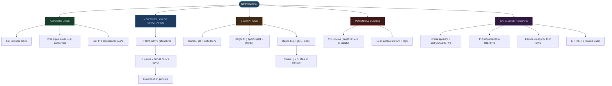

---

## SECTION 1 — INTRODUCTION & HISTORICAL BACKGROUND ⭐

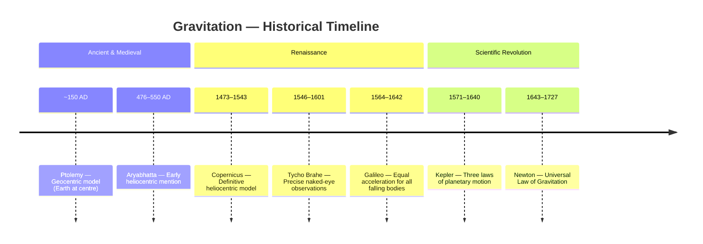

### 1.1 Early Observations

- **Ptolemy** (~150 AD) — geocentric model: Earth at centre, all bodies revolve around it; required epicycles (circles-within-circles) to explain retrograde motion.
- **Aryabhatta** (5th century AD) — earliest heliocentric mention, in Indian astronomy.
- **Copernicus** (1473–1543) — definitive heliocentric model; still assumed **circular** orbits; discredited by the Church.
- **Tycho Brahe** (1546–1601) — compiled precise naked-eye planetary-position data over a lifetime.
- **Galileo** (1564–1642) — all bodies fall with the **same acceleration** regardless of mass; supported Copernicus.
- **Kepler** (1571–1640) — Brahe's assistant; extracted three laws of planetary motion from Brahe's data.
- **Newton** (1643–1727) — used Kepler's laws to derive the Universal Law of Gravitation, unifying terrestrial and celestial motion.
- Trap: Copernicus's model was circular-orbit; Kepler corrected this to **ellipses** (§2.1).

**Key Historical Persons**

| Person | Dates | Key Contribution |
|:---|:---:|:---|
| Ptolemy | ~100–170 AD | Geocentric model |
| Aryabhatta | 476–550 AD | Early heliocentric mention |
| Copernicus | 1473–1543 | Definitive heliocentric model, circular orbits |
| Galileo | 1564–1642 | Equal acceleration for all falling bodies |
| Tycho Brahe | 1546–1601 | Precise naked-eye planetary data |
| Kepler | 1571–1640 | Three laws of planetary motion |
| Cavendish | 1731–1810 | First measured G (1798); "weighed the Earth" |
| Newton | 1643–1727 | Universal Law of Gravitation |

---

## SECTION 2 — KEPLER'S LAWS ⭐⭐⭐

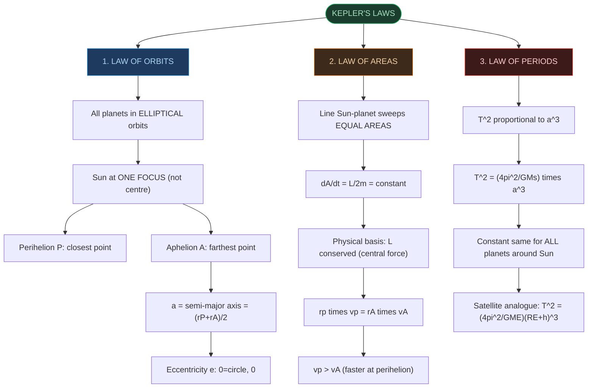

### 2.1 Law of Orbits (First Law)

- All planets move in **elliptical** orbits; Sun at **one focus**, not the centre.
- Ellipse property: $TF_1+TF_2 = 2a$ = constant, for any point T on the curve.
- **Perihelion (P)** — closest point to Sun; **Aphelion (A)** — farthest point.
- Semi-major axis $a = (r_p+r_A)/2$; a circle is the special case where both foci coincide and $a$ = radius.
- **Eccentricity** $e$: 0 for a circle, $0<e<1$ for an ellipse, $e=1$ for a parabola (open path, not a bound orbit). Earth's $e\approx0.0167$.
- Earth's orbit: $b/a = 0.99986$ — nearly circular.
- Trap: the Sun sits at **one focus**, not at the centre of the ellipse.

### 2.2 Law of Areas (Second Law)

- Line joining planet to Sun sweeps **equal areas in equal times**: $\Delta A/\Delta t = L/2m = $ constant.
- Physical basis: gravity is a **central force** (along $\mathbf{r}$) → torque about the Sun = 0 → angular momentum $L$ conserved.
- Holds for **any central force**, not gravity specifically.
- From $L$ conservation: $r_p v_p = r_A v_A \Rightarrow v_p/v_A = r_A/r_p$.
- Since $r_A > r_p$: planet moves **faster at perihelion**, slower at aphelion.
- Trap: linear momentum is **NOT** conserved for an orbiting planet (direction of $\mathbf{p}$ keeps changing); angular momentum **is** conserved.

### 2.3 Law of Periods (Third Law)

- $T^2 \propto a^3$, i.e., $T^2/a^3 = $ constant, for all planets orbiting the same star.
- $T^2 = (4\pi^2/GM_S)\cdot a^3$ — same constant $K_S$ for every planet around a given star.
- NCERT Table 7.1 (Mercury→Neptune): $T^2/a^3 \approx 2.95$–$3.01\times10^{-34}$ y² m⁻³ — constant within data precision.
- log–log plot of $a$ vs $T$ for all 8 planets: straight line of slope $3/2$ (since $T\propto a^{3/2}$).
- Trap: the constant is the same for all planets around the **same** star; it is **different** for a different star.

### 2.4 Solved Example 7.1 — Perihelion and Aphelion

- $v_p > v_A$ follows directly from $r_p v_p = r_A v_A$ and $r_A > r_p$.
- Area swept over the larger arc (through aphelion) > area over the smaller arc (through perihelion).
- By the equal-areas law: the planet takes **longer** to traverse the larger (aphelion-side) arc than the smaller one.

---

## SECTION 3 — UNIVERSAL LAW OF GRAVITATION ⭐⭐⭐

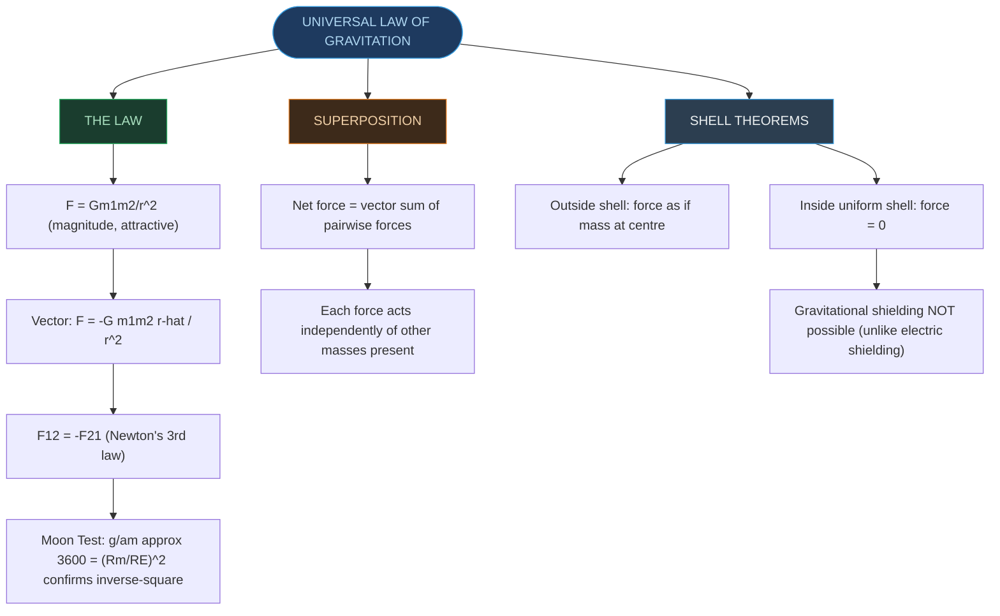

### 3.1 Newton's Reasoning (The Moon Test)

- Compared Moon's centripetal acceleration $a_m = 4\pi^2R_m/T^2$ to $g$ at Earth's surface.
- Using $T\approx27.3$ days, $R_m\approx3.84\times10^8$ m → $a_m \ll g$.
- Assuming $F\propto1/r^2$: $g/a_m = (R_m/R_E)^2 \approx 3600$ — matches the known ratio $R_m/R_E\approx60$ exactly.
- This numerical match confirmed gravity's **inverse-square** dependence.

### 3.2 The Universal Law (Statement)

- Every pair of masses attracts with $F = Gm_1m_2/r^2$ (magnitude, always attractive).
- Vector form: $\mathbf{F} = -G(m_1m_2/r^2)\hat{r}$ — force on $m_2$ due to $m_1$, directed toward $m_1$.
- $\mathbf{F}_{12} = -\mathbf{F}_{21}$ (Newton's 3rd law satisfied).
- $G$ is universal — identical for every pair of masses, everywhere.

### 3.3 Principle of Superposition

- Net gravitational force on a mass from several others = **vector sum** of the individual pairwise forces.
- Each pairwise force acts independently, unaffected by any other mass present.
- Same superposition rule applies to gravitational PE: total PE = sum over all pairs (§6.2).

### 3.4 Extended Bodies — Two Important Shell Theorems

- **Outside** a uniform spherical shell: force = as if the entire mass were concentrated at the shell's centre.
- **Inside** a uniform spherical shell: force = **zero** — contributions from every part of the shell cancel exactly.
- Consequence: Earth (as concentric shells) is treated as a point mass for anything outside it — this is what makes §5's $g(h)$ and $g(d)$ derivations work.
- Trap: **gravitational shielding is not possible.** Zero-force-inside applies only to the shell's own mass; it cannot block an *external* mass from pulling on that point (unlike electrostatic shielding by a conductor).

### 3.5 Solved Example 7.2 — Three Masses at Triangle Vertices

- Three equal masses $m$ at equilateral-triangle vertices, mass $2m$ at centroid, all 1 m apart: three equal forces at $120°$ apart → **net force = 0** by symmetry.
- If the mass at one vertex (A) is doubled to $2m$: forces from B and C still cancel sideways; net force = $2Gm^2\hat{j}$, directed toward the doubled mass.

---

## SECTION 4 — THE GRAVITATIONAL CONSTANT G ⭐⭐

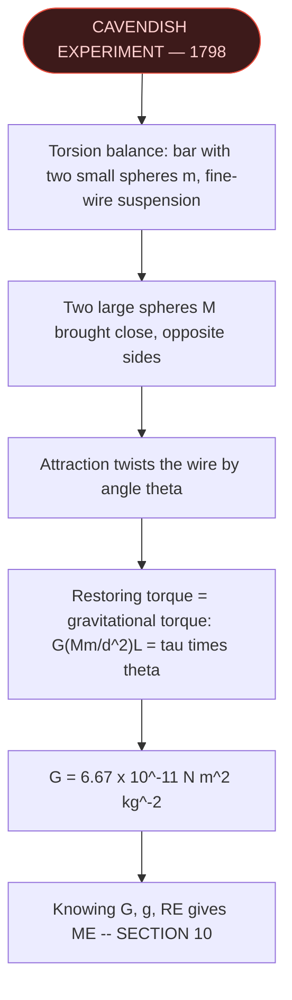

### 4.1 Cavendish Experiment (1798)

- Apparatus: torsion balance — light bar with two small lead spheres, suspended by a fine wire; two large lead spheres brought close on opposite sides.
- Large spheres attract the nearby small ones → torque on the bar = $F\times L$.
- Wire twists by angle $\theta$ until restoring torque = gravitational torque: $G(Mm/d^2)L = \tau\theta$.
- Accepted value: $G = 6.67\times10^{-11}$ N m² kg⁻²; dimensional formula $[\text{M}^{-1}\text{L}^3\text{T}^{-2}]$.
- "Cavendish weighed the Earth" — knowing $G$, $g$, $R_E$ lets $M_E$ be calculated (§10.1).

---

## SECTION 5 — ACCELERATION DUE TO GRAVITY ⭐⭐⭐

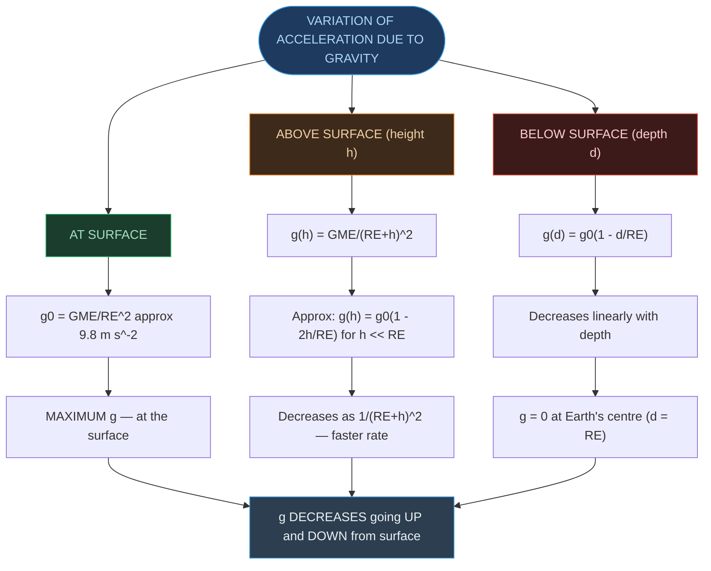

### 5.1 At the Surface of Earth

- $g = GM_E/R_E^2$, from $F = GM_Em/R_E^2 = mg$.
- $g\approx9.8$ m/s², $M_E\approx5.97\times10^{24}$ kg, $R_E\approx6.4\times10^6$ m (this chapter's standard rounding).
- Note: §9.5 and §10.1 use the source problem's more precise $R_E=6.37\times10^6$ m instead — same figure to 3 significant digits, not a contradiction.

### 5.2 At Height h Above Surface

- Distance from centre = $R_E+h$ → $g(h) = GM_E/(R_E+h)^2$.
- For $h\ll R_E$ (binomial approximation): $g(h) \approx g(1-2h/R_E)$.
- $g$ decreases with height; rate of decrease (factor $2h/R_E$) is **faster** than with depth.

### 5.3 At Depth d Below Surface

- Only the inner sphere of radius $(R_E-d)$ contributes — the outer shell of thickness $d$ exerts zero net force (shell theorem, §3.4).
- Mass ratio $M_\text{inner}/M_E = (R_E-d)^3/R_E^3$ → $g(d) = g(1-d/R_E)$.
- $g$ decreases **linearly** with depth; $g=0$ at the centre ($d=R_E$).

### 5.4 Summary — Variation of g

- $g$ is **MAXIMUM at the surface** — decreases both going up and going down.
- Above: $g(h)\approx g(1-2h/R_E)$; Below: $g(d)=g(1-d/R_E)$ — the rate above is **twice** the rate below for small displacements.
- Trap: the two formulas are different in *shape* (inverse-square outside vs. linear inside) — never apply the surface formula $g=GM_E/r^2$ for $r<R_E$.

---

## SECTION 6 — GRAVITATIONAL POTENTIAL ENERGY ⭐⭐⭐

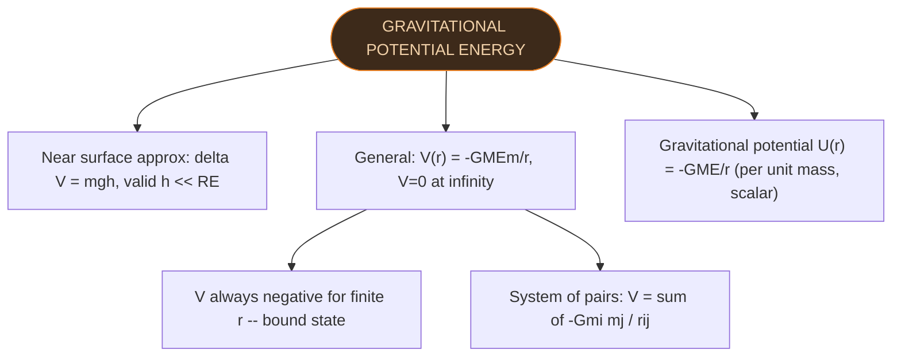

### 6.1 Near the Surface (Approximation)

- For $h\ll R_E$, gravity $\approx$ constant $= mg$ → $W(h) = mgh + W_0$.
- $\Delta W = mg\cdot\Delta h$ — the familiar $mgh$ formula, valid **only near the surface**.

### 6.2 General Expression (Any Distance r from Centre)

- Work to move $m$ from $r_1$ to $r_2$: $W_{12} = -GM_Em(1/r_2 - 1/r_1)$.
- With $V=0$ at $r\to\infty$: $V(r) = -GM_Em/r$ (valid for $r>R_E$).
- $V$ is **always negative** for finite $r$ — negative PE signals a **bound state**.
- For a system of particles: $V = $ sum over all **pairs**, $-Gm_im_j/r_{ij}$ (superposition, §3.3).
- Trap: $mgh$ is only an **approximation** ($h\ll R_E$); $V=-GMm/r$ is the exact, general expression.

### 6.3 Gravitational Potential (Field Concept)

- Gravitational potential $U(r)$ = PE of a **unit mass**: $U(r) = -GM_E/r$ (J/kg, scalar).
- For two particles: $V = -Gm_1m_2/r$.

### 6.4 Solved Example 7.3 — Four Masses at Corners of a Square

- 4 masses $m$ at square corners, side $l$: 4 side-pairs at distance $l$ + 2 diagonal pairs at distance $\sqrt{2}\,l$ = 6 pairs total.
- Total PE: $W = -4Gm^2/l - 2Gm^2/(\sqrt{2}\,l) = -5.41\,Gm^2/l$.
- Potential at centre (distance $l\sqrt{2}/2$ from each corner): $U = -4\sqrt{2}\,Gm/l$.

---

## SECTION 7 — ESCAPE SPEED ⭐⭐⭐

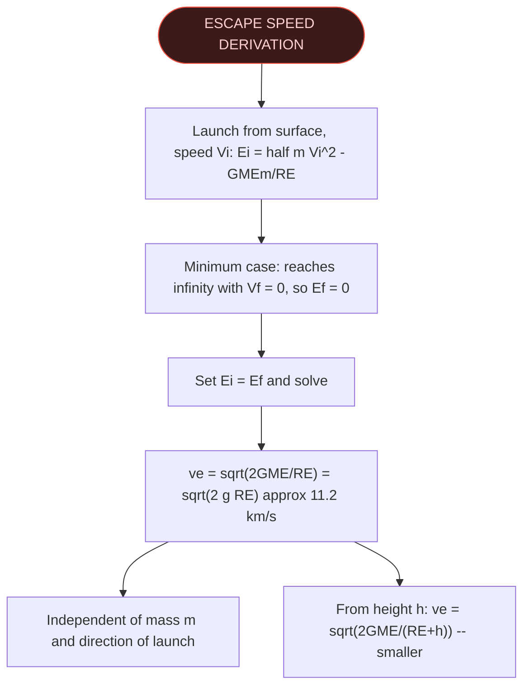

### 7.1 Derivation

- Minimum-escape condition: object just reaches infinity with zero final speed → $E_f=0$.
- Energy conservation: $\tfrac{1}{2}mV_i^2 - GM_Em/R_E = 0 \Rightarrow v_e = \sqrt{2GM_E/R_E} = \sqrt{2gR_E}$.

### 7.2 Numerical Value

- $v_e = \sqrt{2\times9.8\times6.4\times10^6} \approx$ **11.2 km/s** for Earth.

### 7.3 Key Properties of Escape Speed

- Depends on the **planet's mass** ($\propto\sqrt{M}$) — Yes.
- Depends on the **escaping body's mass** — No ($m$ cancels out).
- Depends on **direction of launch** — No.
- Depends on **launch height** — Yes: from height $h$, $v_e=\sqrt{2GM_E/(R_E+h)}$ (smaller).
- Moon's $v_e\approx2.3$ km/s — no atmosphere, since thermal gas speeds exceed this and escape permanently.
- Trap: "escape" means reaching infinity with **zero** speed (the minimum case); launching with $v>v_e$ leaves leftover KE at infinity.

**Speed comparison**

| Quantity | Formula | Value |
|:---|:---|:---|
| Orbital speed (low orbit) | $V_0=\sqrt{gR_E}$ | ≈7.9 km/s |
| Escape speed (surface) | $v_e=\sqrt{2gR_E}$ | ≈11.2 km/s |
| Ratio $v_e/V_0$ | — | $\sqrt2\approx1.414$ |
| Moon's escape speed | — | ≈2.3 km/s |
| Mars' escape speed | — | ≈5.0 km/s |
| Jupiter's escape speed | — | ≈59.5 km/s |

### 7.4 Solved Example 7.4 — Neutral Point Between Two Spheres

- Two spheres, mass $M$ and $4M$, equal radius $R$, $6R$ apart (centre-to-centre): neutral point $N$ at $r=2R$ from $M$ (solving $GMm/r^2 = G(4M)m/(6R-r)^2$).
- Speed needed at $M$'s surface to just reach $N$: $v = \sqrt{3GM/5R}$.

---

## SECTION 8 — EARTH SATELLITES ⭐⭐⭐

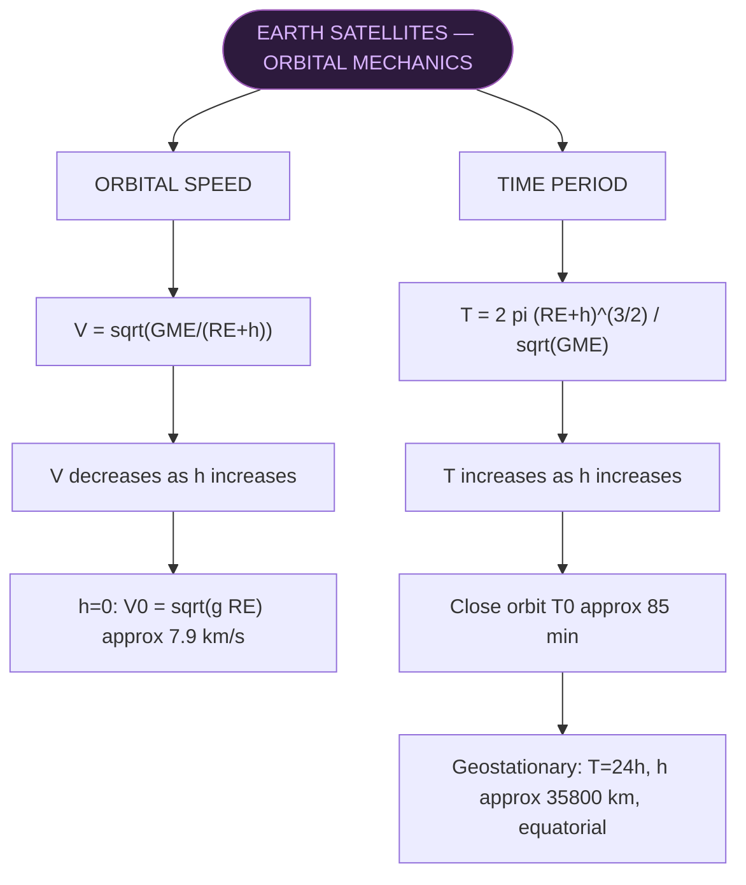

### 8.1 Orbital Speed

- Centripetal force = gravitational force: $mV^2/(R_E+h) = GM_Em/(R_E+h)^2 \Rightarrow V=\sqrt{GM_E/(R_E+h)}$.
- At $h=0$: $V=\sqrt{gR_E}\approx7.9$ km/s (first cosmic velocity).
- $V$ **decreases** as $h$ increases — higher orbits are slower.

### 8.2 Time Period

- $T = 2\pi(R_E+h)^{3/2}/\sqrt{GM_E} \Rightarrow T^2 = (4\pi^2/GM_E)(R_E+h)^3$ — Kepler's Third Law applied to Earth satellites.
- Close orbit ($h\ll R_E$): $T_0=2\pi\sqrt{R_E/g}\approx85$ minutes.
- $T$ **increases** with $h$.

### 8.3 Geostationary Satellite

- $T = 24$ h (matches Earth's rotation); orbit is equatorial.
- Height above surface ≈ 35,800 km (rounded to ≈36,000 km in quick-reference contexts).
- Appears stationary relative to Earth's surface; used for telecommunications, weather observation.

### 8.4 Solved Example 7.5 — Mars and its Moons

- Mass of Mars from Phobos data ($T=459$ min, $R=9.4\times10^3$ km): $M_\text{Mars} = 4\pi^2R^3/(GT^2) \approx 6.48\times10^{23}$ kg.
- Martian year ($R_{\text{Mars-Sun}}=1.52\times R_{\text{Earth-Sun}}$): $T_\text{Mars}=T_\text{Earth}\times(1.52)^{3/2}=365\times1.874\approx684$ days.

---

## SECTION 9 — ENERGY OF AN ORBITING SATELLITE ⭐⭐⭐

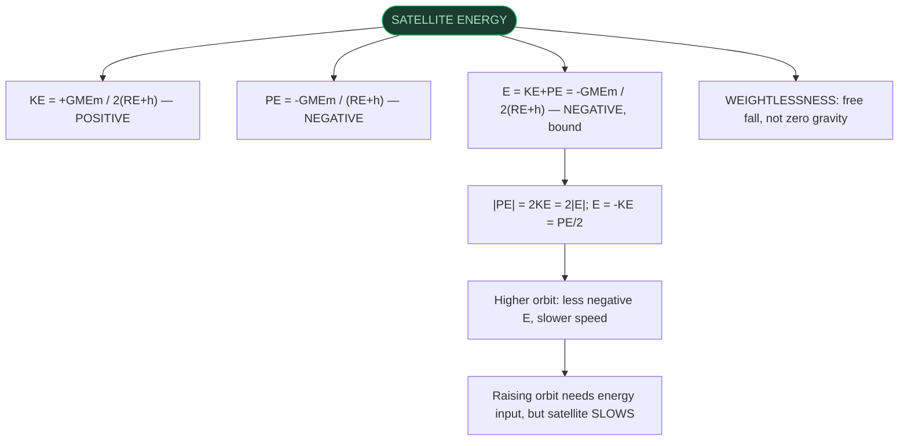

### 9.1 Kinetic Energy

- $KE = \tfrac12 mV^2 = GM_Em/[2(R_E+h)]$ — **positive**.

### 9.2 Potential Energy

- $PE = -GM_Em/(R_E+h)$ — **negative**.

### 9.3 Total Mechanical Energy

- $E = KE+PE = -GM_Em/[2(R_E+h)]$ — **negative** (bound system).
- Virial-theorem chain: $|PE|=2KE=2|E|$; $E=-KE=PE/2$.
- Trap: total energy is **never zero** for a bound orbit — $E=0$ marks the escape threshold, not an orbiting satellite.

### 9.4 Binding Energy

- Energy required to remove a satellite to infinity $= |E| = GM_Em/[2(R_E+h)]$.

### 9.5 Solved Example 7.8 — Changing Orbital Radius

- 400 kg satellite moved from orbit $2R_E$ to $4R_E$: $\Delta E=+3.13\times10^9$ J (energy **supplied**).
- $\Delta KE=-3.13\times10^9$ J — KE **decreases** (satellite slows).
- $\Delta PE=-6.25\times10^9$ J — PE decreases by exactly $2\times|\Delta E|$.
- Trap: raising a satellite's orbit **requires supplying energy**, but the satellite **slows down** — the energy goes into PE, with half "returning" as reduced KE.
- Uses $R_E=6.37\times10^6$ m (see §5.1 note).

### 9.6 Weightlessness

- Gravity at ISS altitude (~400 km) $\approx8.9$ m/s² — nearly the full surface value; **not** the reason for weightlessness.
- Weightlessness = **free fall**: astronaut and spacecraft accelerate together under the same $g(h)$ → no relative acceleration → no normal force between them.
- Trap: weightlessness ≠ zero gravity — it is the absence of a **supporting force**, caused by free fall.

---

## SECTION 10 — "WEIGHING THE EARTH" ⭐⭐

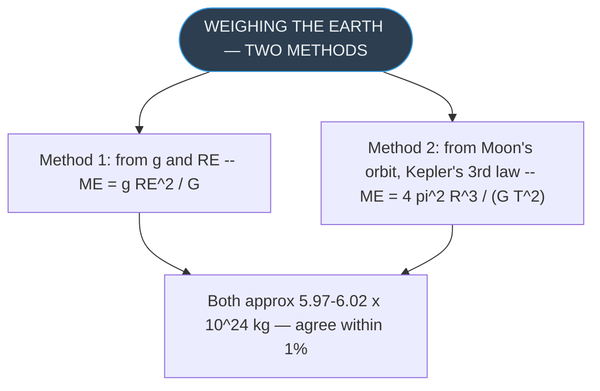

### 10.1 Solved Example 7.6 — Two Independent Methods for $M_E$

- Method 1 (from $g$, $R_E$): $M_E = gR_E^2/G \approx 5.97\times10^{24}$ kg.
- Method 2 (from Moon's orbit, Kepler's 3rd law): $M_E = 4\pi^2R^3/(GT^2) \approx 6.02\times10^{24}$ kg.
- Both methods agree to within 1% — cross-validates the law via two independent routes.
- Uses $R_E=6.37\times10^6$ m (the source problem's precise value; see §5.1 note).

---

## Beyond the Numbered Sections

*These two high-yield facts appear only in NOTES's unnumbered Points to Ponder, not in a numbered section — flagged rather than force-fitted.*

- **Tidal force** depends on the **gradient** of gravity ($dF/dr\propto1/r^3$), not on $g$ itself — the Moon's tides exceed the Sun's because the Moon is much closer (steeper gradient), despite the Sun's overall pull on Earth being stronger.
- For **elliptical** satellite orbits, semi-major axis $a$ replaces $(R_E+h)$ in every satellite energy formula: $E=-GM_Em/2a$.

---

## Rapid Reference

| Fact | Value |
|:---|:---|
| G | $6.67\times10^{-11}$ N m² kg⁻²; dim $[\text{M}^{-1}\text{L}^3\text{T}^{-2}]$ |
| g at surface | 9.8 m/s²; dim $[\text{LT}^{-2}]$ |
| $M_E$ | $5.97\times10^{24}$ kg |
| $R_E$ (standard) | $6.4\times10^6$ m (§9.5/§10.1 use $6.37\times10^6$ m) |
| $g(h)$, $h\ll R_E$ | $g_0(1-2h/R_E)$ |
| $g(d)$ | $g_0(1-d/R_E)$ |
| $V(r)$ — GPE | $-GM_Em/r$; dim $[\text{ML}^2\text{T}^{-2}]$ |
| $U(r)$ — potential | $-GM_E/r$; dim $[\text{L}^2\text{T}^{-2}]$ |
| Escape speed $v_e$ | $\sqrt{2GM_E/R_E}\approx11.2$ km/s |
| Orbital speed $V_0$ (surface) | $\sqrt{gR_E}\approx7.9$ km/s |
| $v_e/V_0$ ratio | $\sqrt2\approx1.414$ |
| Satellite KE | $+GM_Em/2(R_E+h)$ |
| Satellite PE | $-GM_Em/(R_E+h)$ |
| Satellite E | $-GM_Em/2(R_E+h)$; $\lvert PE\rvert=2KE=2\lvert E\rvert$ |
| Close-orbit $T_0$ | $2\pi\sqrt{R_E/g}\approx85$ min |
| Geostationary $T$, $h$ | 24 h, ≈35,800 km (≈36,000 km rounded) |
| Kepler's 3rd law | $T^2=(4\pi^2/GM_S)a^3$ |
| Moon's escape speed | ≈2.3 km/s |
| Mars' escape speed | ≈5.0 km/s |
| Jupiter's escape speed | ≈59.5 km/s |
| Earth's eccentricity $e$ | ≈0.0167 |
| Earth's $b/a$ ratio | 0.99986 |
| Moon distance / period | $3.84\times10^8$ m / 27.3 days |
| Cavendish torque balance | $G(Mm/d^2)L=\tau\theta$ |
| Example 7.2 result | Net force = 0 (symmetric); $2Gm^2\hat{j}$ if one mass doubled |
| Example 7.3 result | $PE=-5.41\,Gm^2/l$; $U_\text{centre}=-4\sqrt2\,Gm/l$ |
| Example 7.4 result | Neutral point $r=2R$; $v=\sqrt{3GM/5R}$ |
| Example 7.5 result | $M_\text{Mars}\approx6.48\times10^{23}$ kg; Martian year ≈684 days |
| Example 7.6 result | $M_E$: $5.97\times10^{24}$ kg vs $6.02\times10^{24}$ kg — agree within 1% |
| Example 7.8 result | $\Delta E=+3.13\times10^9$ J, $\Delta KE=-3.13\times10^9$ J, $\Delta PE=-6.25\times10^9$ J |
| Weightlessness cause | Free fall, not absent gravity; $g$ at ISS ≈8.9 m/s² |
| Tidal force | $\propto$ gradient $dF/dr\propto1/r^3$ |

---

*End of Condensed Notes — Physics Ch. 7 | Mirrors NOTES §1–§10 exactly*